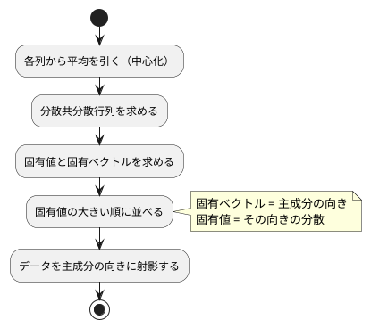

# 第 13 章: 主成分分析による次元削減

## 13.1 はじめに

ここまでの章では、正解ラベルのあるデータで予測をしてきました。この章から扱う **教師なし学習** では、正解ラベルを使わずに、データそのものの構造を調べます。

最初に扱うのは **主成分分析（PCA）** です。住宅価格のデータには 15 個もの列がありますが、列どうしは互いに関係しあっていて、実際にはもっと少ない数の「軸」で大部分を説明できることがあります。主成分分析は、データのばらつきを最もよく説明する新しい軸を探し、たくさんの列を少数の軸に要約します。

[Python 版の第 13 章](../python/13-principal-component-analysis.md) は NumPy の固有値分解で主成分分析を自作し、scikit-learn の `PCA` と突き合わせました。[Kotlin 版](../kotlin/13-principal-component-analysis.md) と [Java 版](../java/13-principal-component-analysis.md) は、第 7 章の行列型と Tribuo の `DenseMatrix` の固有値分解を組み合わせました。Scala 版も同じ構成です。分散共分散行列は [第 7 章](07-linear-regression.md) で作った `machinelearning.chapter07.Matrix`（`Vector[Vector[Double]]` を包んだ case class）で求め、固有値分解だけを Tribuo に任せます。

Tribuo には主成分分析のモジュールが無いので、この章にはライブラリへの置き換えの節がありません（理由は 13.12 節）。その代わりに、Tribuo の固有値分解の振る舞いを **学習用テスト** で確かめ、主成分分析が満たすべき数学的な性質をテストにして、自作の実装を検証します。

Notebook と可視化の節は設けません。累積寄与率のグラフや主成分の散布図は [Python 版](../python/13-principal-component-analysis.md) と [Kotlin 版の 13.14 節](../kotlin/13-principal-component-analysis.md) を参照してください。

## 13.2 主成分分析とは

### ばらつきが最も大きい方向を探す

2 つの列が強く相関しているデータを散布図にすると、点は斜めの帯のように並びます。このとき、帯に沿った方向の 1 本の軸を取れば、2 つの列の情報をほぼ 1 つの数値で表せます。この「ばらつき（分散）が最も大きい方向」が **第 1 主成分** です。第 2 主成分は、第 1 主成分と直交する方向のうち、ばらつきが最も大きい方向です。

### 分散共分散行列の固有ベクトル

主成分は、次の手順で求められます。



**分散共分散行列** は、対角に各列の分散、それ以外に 2 列の共分散を並べた行列です。この行列の **固有ベクトル** が主成分の向き、**固有値** がその向きのデータの分散になります。行列 `A` の固有ベクトル `v` と固有値 `λ` は、`A v = λ v`（`A` を掛けても向きが変わらず、長さだけが `λ` 倍になる）を満たします。

### 寄与率

各主成分の固有値を、固有値の合計で割った値を **寄与率** と呼びます。その主成分が、データ全体のばらつきのうち何割を説明しているかを表します。第 1 主成分から順に寄与率を足したものが **累積寄与率** です。「累積寄与率が 0.8 に届くまでの主成分を使う」のように、残す軸の数を決める目安に使います。

## 13.3 題材とデータ

この章では、[第 9 章](09-feature-engineering.md) と同じ `Boston.csv`（100 件）を、住宅価格 `PRICE` も含めたすべての列で使います。

| 列の種類 | 列 | 注意点 |
|---------|-----|--------|
| 数値 | ZN, INDUS, CHAS, NOX, RM, AGE, DIS, RAD, TAX, PTRATIO, B, LSTAT, PRICE | NOX と RAD に欠損値がある |
| カテゴリ | CRIME | `high`・`low`・`very_low` の 3 種類の文字列 |

主成分分析は数値しか扱えず、欠損値があると計算できません。また、列ごとに単位や桁（TAX は数百、NOX は 1 未満）が違うと、桁の大きい列のばらつきが主成分を支配してしまいます。そこで次の前処理をしてから主成分分析をします。

1. CRIME をダミー変数（`CRIME_low`・`CRIME_very_low` の 2 列）に置き換える
2. 欠損値を列の平均値で補完する
3. すべての列を平均 0・標準偏差 1 に標準化する

Kotlin 版はこの章の中に最小限の前処理を書き直しましたが、Scala 版は Java 版と同じく、第 9 章の `Dummies`・`Standardizer` と第 2 章の `Preprocessing.columnMeans`・`fillMissing` をそのまま組み合わせます。列名は Kotlin 版の `low` ではなく `CRIME_low` になります。

この章では訓練データとテストデータに分けません。主成分分析は正解を予測するモデルではなく、手元のデータ全体の構造を要約する手法だからです。そのため、補完の平均値も標準化の平均・標準偏差も、100 件すべてから求めます。

## 13.4 TODO リストの作成

**TODO リスト**:

- [ ] 分散共分散行列を求める
  - [ ] 2 列の分散と共分散を並べる
  - [ ] 3 列でも各列の分散と 2 列ずつの共分散を並べる
- [ ] Tribuo の固有値分解の振る舞いを確かめる
- [ ] 主成分を求める
  - [ ] 完全に相関する 2 列なら第 1 主成分だけで分散をすべて説明する
  - [ ] 寄与率の大きい順に、指定した数だけ並ぶ
  - [ ] 主成分の向き（符号）をそろえる
  - [ ] 主成分が固有ベクトルの性質を満たす
- [ ] データを主成分の向きに射影する
- [ ] 累積寄与率がしきい値に届く主成分の数を求める
- [ ] 主成分への影響が大きい列を求める
- [ ] Boston を前処理する（ダミー変数・欠損値の補完・標準化）
- [ ] 実データで寄与率と主成分の意味を表示する

## 13.5 分散共分散行列を求める

最初のテストは、手で計算できる 3 件 2 列のデータです。列は `(1, 3, 5)` と `(2, 6, 10)` で、平均は 3 と 6、中心化すると `(-2, 0, 2)` と `(-4, 0, 4)` になります。件数から 1 を引いた 2 で割ると、分散は 4 と 16、共分散は 8 です。

```scala
  private def assertMatrix(expected: Vector[Vector[Double]], actual: Matrix): Unit =
    assert(actual.rowCount === expected.size)
    assert(actual.columnCount === expected.head.size)
    expected.zip(actual.rows).foreach { (expectedRow, actualRow) =>
      expectedRow.zip(actualRow).foreach((e, a) => assert(a === e +- Tolerance))
    }

  test("2 列の分散と共分散を並べた行列を返す") {
    val x = Matrix(Vector(Vector(1, 2), Vector(3, 6), Vector(5, 10)))

    assertMatrix(Vector(Vector(4, 8), Vector(8, 16)), Pca.covarianceMatrix(x))
  }
```

`Matrix(Vector(Vector(1, 2), …))` と整数で書けているのは、`Matrix` の引数の型が `Vector[Vector[Double]]` と決まっていて、Scala が整数リテラルを期待される型の `Double` に広げるからです。Java 版の `new double[][] {{1, 2}, …}` と同じ感覚で読めます。

`assertMatrix` を `Unit` を返すヘルパーにしたのは、`-Wvalue-discard` の下で「複数の `assert` を並べたメソッドの戻り値を捨てている」と怒られないようにするためです（第 7 章の 7.11 節で踏んだ落とし穴です）。

三角測量の相手には、3 列のデータを使いました。列を 1 つ足しても、対角に分散、それ以外に共分散が並ぶことを確かめます。

```scala
  test("3 列でも各列の分散と 2 列ずつの共分散を並べる") {
    val x = Matrix(Vector(Vector(1, 2, 0), Vector(3, 6, 1), Vector(5, 10, 5)))

    assertMatrix(
      Vector(Vector(4, 8, 5), Vector(8, 16, 10), Vector(5, 10, 7)),
      Pca.covarianceMatrix(x)
    )
  }
```

実装は、中心化した行列 `Xc` について `Xcᵀ Xc` を第 7 章の転置と積で求め、件数から 1 を引いた数で割るだけです。

```scala
  /** 列ごとの平均。 */
  def columnMeans(x: Matrix): Vector[Double] =
    (0 until x.columnCount).toVector.map(j => x.column(j).sum / x.rowCount)

  /** 各列から平均を引く（中心化）。 */
  private def center(x: Matrix, means: Vector[Double]): Matrix =
    Matrix(x.rows.map(row => row.lazyZip(means).map(_ - _)))

  /** 列ごとの分散と、2 列ずつの共分散を並べた行列。件数から 1 を引いた数で割る。 */
  def covarianceMatrix(x: Matrix): Matrix =
    val centered = center(x, columnMeans(x))
    val divisor = (x.rowCount - 1).toDouble
    Matrix((centered.transpose * centered).rows.map(_.map(_ / divisor)))
```

Java 版・C# 版は、中心化とスカラー倍のために `double[][]` を写して二重ループで書き換えます。Scala では `Vector` が変更できないので、`map` で新しい行列を作るだけです。行ごとの引き算は `row.lazyZip(means).map(_ - _)` の 1 行で、中間のコレクションも作られません。`*`・`transpose` は第 7 章の `Matrix` のメソッドで、この章のために足したものはありません。

## 13.6 Tribuo の固有値分解を確かめる

### 学習用テストを書く

固有値分解は、自分で実装すると数値計算の難しい部分に踏み込むことになります。ここでは Tribuo の `DenseMatrix` が持つ `eigenDecomposition` を使います。Kotlin 版では「NumPy の `eigh` と同じく固有値は小さい順だろう」という予想が外れ、学習用テストで大きい順だと分かりました。Scala 版でも、同じ予想から書いて自分の手で確かめます。対称行列 `[[2, 1], [1, 2]]` の固有値は 1 と 3 です。

```scala
class TmpRedSpec extends AnyFunSuite:
  private val symmetric = DenseMatrix.createDenseMatrix(Array(Array(2.0, 1.0), Array(1.0, 2.0)))

  private def rounded(values: Array[Double]): Vector[Double] =
    values.toVector.map(v => math.round(v * 1e9) / 1e9)

  test("対称行列の固有値を小さい順に返す") {
    val eigen = symmetric.eigenDecomposition().orElseThrow()

    assert(rounded(eigen.eigenvalues().toArray) === Vector(1.0, 3.0))
  }
```

Tribuo に渡す行列は `Array[Array[Double]]` なので、ここだけは `Vector` ではなく配列で書きます。`Array(2.0, 1.0)` と小数で書いているのは、`Array(2, 1)` では `Array[Int]` になってしまい、`createDenseMatrix` の引数に合わないからです。期待値は、計算誤差を落とすために小数第 9 位で丸めてから `Vector` にして比べています。

```text
[info] TmpRedSpec:
[info] - 対称行列の固有値を小さい順に返す *** FAILED ***
[info]   Vector(3.0, 1.0) did not equal Vector(1.0, 3.0) (TmpRedSpec.scala:15)
[info]   Analysis:
[info]   Vector1(0: 3.0 -> 1.0, 1: 1.0 -> 3.0)
```

Scala から呼んでも、Tribuo は固有値を **大きい順** に返しました。ScalaTest は `Vector` どうしの比較で「どの位置がどう違うか」を `Analysis` に出すので、何が外れたのかがすぐ分かります。

### ドキュメントの記述をテストに固定する

Kotlin 版で Tribuo 4.3.2 のソースを読んで分かったこと（[ADR 002](../../../adr/002-kotlin-ml-libraries.md)）は、Scala 版でも同じ版のライブラリを使うのでそのまま当てはまります。

- `EigenDecomposition.eigenvalues()` のドキュメンテーションコメントには「The vector of eigenvalues, in descending order.」とあり、固有値を大きい順に並べ替えている
- 固有ベクトルは行列の **列** に並べて返す（`getEigenVector(i)` で `i` 列目を取り出せる）
- 対称でない行列は、複素数の固有値を持つことがあるので、空の `Optional` を返す

予想を正し、対角成分の並びが大きい順でない行列でも並べ替えることと、対称でない行列の振る舞いを足しました。

```scala
  test("対角成分の並びに関係なく固有値を大きい順に並べ替える") {
    val diagonal = DenseMatrix.createDenseMatrix(
      Array(Array(1.0, 0.0, 0.0), Array(0.0, 5.0, 0.0), Array(0.0, 0.0, 3.0))
    )

    val eigen = diagonal.eigenDecomposition().orElseThrow()

    assert(rounded(eigen.eigenvalues().toArray) === Vector(5.0, 3.0, 1.0))
  }

  test("対称でない行列は固有値分解できず空の Optional を返す") {
    val asymmetric = DenseMatrix.createDenseMatrix(Array(Array(2.0, 1.0), Array(0.0, 2.0)))

    assert(asymmetric.eigenDecomposition().isEmpty)
  }
```

`java.util.Optional` は Scala のコレクションではありませんが、`isEmpty` はそのまま呼べます。Scala の `Option` に変換する必要はありません。

## 13.7 主成分を求める

### 完全に相関する 2 列

`(1, 2), (3, 6), (5, 10)` は完全に 1 本の直線に乗るので、第 1 主成分だけで分散をすべて説明できるはずです。主成分の向きは `(1, 2)` を長さ 1 にした `(1/√5, 2/√5)` になります。

```scala
  test("完全に相関する 2 列なら第 1 主成分だけで分散をすべて説明する") {
    val x = Matrix(Vector(Vector(1, 2), Vector(3, 6), Vector(5, 10)))

    val model = Pca.fit(x, 2)

    assertMatrix(
      Vector(Vector(1 / math.sqrt(5), 2 / math.sqrt(5))),
      Matrix(Vector(model.components.rows.head))
    )
    assert(model.explainedVarianceRatio.head === 1.0 +- Tolerance)
    assert(model.explainedVarianceRatio(1) === 0.0 +- Tolerance)
  }
```

学習の結果は case class にまとめます。Java 版は `record`、Kotlin 版は `data class` を使いましたが、Scala の case class はそれらと同じく等価判定と `toString` が付いてきます。Java 版が `List.copyOf(mean)` のように防御的な写しを取っているのに対し、Scala 版は `Vector` も `Matrix` も変更できないので、そのまま持てます。

```scala
case class PcaModel(
    mean: Vector[Double],
    components: Matrix,
    explainedVariance: Vector[Double],
    explainedVarianceRatio: Vector[Double]
)
```

`fit` は、分散共分散行列を Tribuo に渡して固有値分解し、固有値の大きい順に `nComponents` 個の固有ベクトルを取り出します。

```scala
  def fit(x: Matrix, nComponents: Int): PcaModel =
    val covariance =
      DenseMatrix.createDenseMatrix(covarianceMatrix(x).rows.map(_.toArray).toArray)
    val eigen = covariance
      .eigenDecomposition()
      .orElseThrow(() => IllegalArgumentException("分散共分散行列を固有値分解できません"))
    val eigenvalues = eigen.eigenvalues().toArray.toVector
    val components =
      (0 until nComponents).toVector.map(i => eigen.getEigenVector(i).toArray.toVector)
    val variances = eigenvalues.take(nComponents)
    PcaModel(
      columnMeans(x),
      normalizeSigns(Matrix(components)),
      variances,
      variances.map(_ / eigenvalues.sum)
    )
```

Java・Kotlin・Scala はどれも同じ JVM の上で同じ Tribuo を呼びますが、型の橋渡しの書き方は少しずつ違います。

| 版 | Tribuo に渡す | Tribuo から受け取る |
|----|-------------|-----------------|
| Java | `matrix.toArray()` をそのまま | `eigen.eigenvalues().toArray()` をそのまま |
| Kotlin | `matrix.toArray()` をそのまま | `toArray()` を `List` にする |
| Scala | `rows.map(_.toArray).toArray` で `Vector` を配列にする | `toArray.toVector` で `Vector` に戻す |

Scala は行列の中身を不変の `Vector` で持っている分、ライブラリの境界で配列との往復が要ります。とはいえ `toArray`・`toVector` のひとことで済み、要素をループで詰め替える必要はありません。`orElseThrow` には、空だったときに何が起きたか分かるように例外を作る関数を渡しています。

### 符号の規則を決める

固有ベクトルは、`v` が解なら `-v` も同じ向きを表す解です。ライブラリがどちらを返すかは決まっていないので、そのままでは主成分の符号が再現しません。そこで、**絶対値が最大の要素が正になる** という規則で向きをそろえます。

```scala
  test("絶対値が最大の要素が正になるように主成分の向きをそろえる") {
    val components = Matrix(Vector(Vector(0.6, -0.8), Vector(-0.8, 0.6)))

    assertMatrix(Vector(Vector(-0.6, 0.8), Vector(0.8, -0.6)), Pca.normalizeSigns(components))
  }
```

```scala
  /** 固有ベクトルは符号が逆でも同じ向きを表すので、絶対値が最大の要素が正になるようにそろえる。 */
  def normalizeSigns(components: Matrix): Matrix =
    Matrix(components.rows.map { row =>
      val sign = math.signum(row.maxBy(math.abs))
      row.map(_ * sign)
    })
```

Java 版は「絶対値が最大の要素」を探すためにループで `largest` を更新し、C# 版も同じ形になります。Scala は `row.maxBy(math.abs)` のひとことです。`maxBy` に渡しているのは `math.abs` という既存の関数そのもので、`_ => ...` のラムダを書く必要もありません。

`fit` の中で `normalizeSigns` を通すので、完全に相関する 2 列の第 2 主成分は `(2/√5, -1/√5)` になります（絶対値が最大なのは第 1 要素の 2/√5 なので、そのまま正）。この向きもテストで固定しました。

```scala
  test("主成分の向きは絶対値が最大の要素が正になるようにそろえる") {
    val x = Matrix(Vector(Vector(1, 2), Vector(3, 6), Vector(5, 10)))

    val model = Pca.fit(x, 2)

    assertMatrix(
      Vector(Vector(2 / math.sqrt(5), -1 / math.sqrt(5))),
      Matrix(Vector(model.components.rows(1)))
    )
  }
```

### 突き合わせる相手が無いときは性質をテストにする

Python 版は scikit-learn の `PCA` と主成分・寄与率を突き合わせましたが、Scala 版には突き合わせる相手がありません。Kotlin 版・Java 版と同じく、主成分分析の結果が満たすべき **性質** をテストにします。

- 主成分は長さ 1 で、互いに直交する。主成分を並べた行列 `C` と転置の積 `C Cᵀ` は単位行列になる
- 主成分 `v` は分散共分散行列 `A` の固有ベクトルで、`A v` は `v` の「その主成分の分散」倍になる
- 主成分は寄与率の大きい順に並ぶ

検証用のデータには、2 つの隠れた変数を 4 列に混ぜ、小さなノイズを加えた 40 行を使います。`java.util.Random(0)` で作るので、Java 版とまったく同じ数値が並びます。

```scala
  private def mixedDataset(): Matrix =
    val random = Random(0)
    val mixing = Vector(Vector(2.0, 0.5), Vector(0.3, 1.0), Vector(1.0, -1.0), Vector(0.0, 0.2))
    Matrix((0 until 40).toVector.map { _ =>
      val base = Vector(random.nextGaussian(), random.nextGaussian())
      mixing.map(m => m(0) * base(0) + m(1) * base(1) + random.nextGaussian() * 0.1)
    })

  test("主成分は長さ 1 で互いに直交する") {
    val model = Pca.fit(mixedDataset(), 3)

    val gram = model.components * model.components.transpose

    assertMatrix(Vector(Vector(1, 0, 0), Vector(0, 1, 0), Vector(0, 0, 1)), gram)
  }

  test("主成分は分散共分散行列に掛けると分散の倍数になる固有ベクトル") {
    val x = mixedDataset()

    val model = Pca.fit(x, 3)

    val covariance = Pca.covarianceMatrix(x)
    model.components.rows.zip(model.explainedVariance).foreach { (component, variance) =>
      val projected = covariance * Matrix.columnVector(component*)
      assertMatrix(component.map(v => Vector(v * variance)), projected)
    }
  }
```

`Matrix.columnVector(component*)` の `*` は、`Vector[Double]` を可変長引数として渡す記法です（Scala 2 の `: _*` にあたります）。期待値の `component.map(v => Vector(v * variance))` は、1 列の行列そのものの形なので、そのまま `assertMatrix` に渡せます。

寄与率の順は、`sorted` と比べるだけで確かめられます。

```scala
  test("主成分は寄与率の大きい順に指定した数だけ並ぶ") {
    val ratios = Pca.fit(mixedDataset(), 3).explainedVarianceRatio

    assert(ratios.size === 3)
    assert(ratios === ratios.sorted(Ordering[Double].reverse))
  }
```

Java 版は AssertJ の `isSortedAccordingTo(Comparator.reverseOrder())` を使いました。Scala では「降順に並べ替えても同じ」という等価判定で書けます。

どの性質のテストも、実装を変えずに通ります。Tribuo の固有値分解をどう使っても満たすべき性質なので、Tribuo の版を上げたときや、自前の計算に差し替えたときの安全網になります。

## 13.8 データを主成分の向きに射影する

データを主成分の軸で表し直すには、平均を引いてから主成分の向きとの内積を取ります。平均が `(1, 2)`、主成分が `(0.6, 0.8)` のモデルに `(2, 3)` を渡すと、`(1, 1)` と `(0.6, 0.8)` の内積で 1.4 になります。

```scala
  test("平均を引いてから主成分の向きに射影する") {
    val model =
      PcaModel(Vector(1.0, 2.0), Matrix(Vector(Vector(0.6, 0.8))), Vector(1.0), Vector(1.0))

    assertMatrix(
      Vector(Vector(1.4), Vector(0.0)),
      Pca.transform(model, Matrix(Vector(Vector(2, 3), Vector(1, 2))))
    )
  }
```

テストの `PcaModel` は、学習を経由せずに組み立てています。case class にしておいたので、射影だけを切り離してテストできます。実装は、13.5 節で切り出した `center` の再利用です。

```scala
  /** 平均を引いてから、データを主成分の向きに射影する。 */
  def transform(model: PcaModel, x: Matrix): Matrix =
    center(x, model.mean) * model.components.transpose
```

## 13.9 必要な主成分の数を求める

寄与率が `[0.5, 0.25, 0.25]` のとき、累積寄与率は `[0.5, 0.75, 1.0]` です。しきい値 0.75 に届くのは 2 つ目、0.8 に上げると 3 つ目になります。

```scala
  test("累積寄与率がしきい値に届くまでの主成分の数を返す") {
    assert(Pca.componentsNeeded(Vector(0.5, 0.25, 0.25), 0.75) === 2)
  }

  test("しきい値を上げると必要な主成分の数が増える") {
    assert(Pca.componentsNeeded(Vector(0.5, 0.25, 0.25), 0.8) === 3)
  }
```

```scala
  /** 累積寄与率がしきい値に届くまでの主成分の数。 */
  def componentsNeeded(ratios: Vector[Double], threshold: Double): Int =
    val needed = ratios.scanLeft(0.0)(_ + _).tail.indexWhere(_ >= threshold)
    if needed < 0 then ratios.size else needed + 1
```

`scanLeft` は途中経過を残す畳み込みで、累積寄与率の列そのものを作ります（先頭の初期値 0 は `tail` で落とします）。Java 版は `cumulative` という変数を持ちながらループを回し、途中で `return i + 1` しました。Kotlin の `runningReduce` にあたる操作が Scala にもあるので、「累積してから最初にしきい値を超えた位置を探す」という言い方のまま書けます。`indexWhere` は見つからなければ -1 を返すので、そのときは全部必要だという意味で `ratios.size` を返します。

## 13.10 主成分への影響が大きい列を求める

主成分は列の重み付きの和なので、係数の絶対値が大きい列がその軸の意味を決めます。列名と係数の組には、`(String, Double)` のタプルではなく `Loading` という名前を付けました。

```scala
case class Loading(column: String, value: Double)
```

```scala
  test("係数の絶対値が大きい順に列名と係数を返す") {
    val component = Vector(0.1, -0.7, 0.5)

    assert(
      Pca.topLoadings(component, Vector("ZN", "DIS", "TAX"), 2) ===
        Vector(Loading("DIS", -0.7), Loading("TAX", 0.5))
    )
  }
```

```scala
  /** 主成分の係数の絶対値が大きい順に、列名と係数を k 個返す。 */
  def topLoadings(component: Vector[Double], columns: Vector[String], k: Int): Vector[Loading] =
    columns
      .lazyZip(component)
      .map(Loading.apply)
      .sortBy(loading => -math.abs(loading.value))
      .take(k)
```

`columns.lazyZip(component).map(Loading.apply)` は、2 つの列を組にして case class に詰める処理です。case class の `apply` がそのまま 2 引数の関数として渡せるので、`(c, v) => Loading(c, v)` と書く必要がありません。並べ替えは「絶対値の符号を反転した値」で昇順に並べるだけで降順になります。`sortBy` は安定なので、同じ絶対値が並んでも元の列の順が残ります。

## 13.11 Boston を前処理して実データで要約する

前処理は、第 9 章までに作った部品を 3 つ並べるだけです。

```scala
  /** CRIME をダミー変数にし、欠損値を列の平均値で補完してから、すべての列を標準化する。 */
  def standardize(table: Table): Vector[Features] =
    val encoded =
      Dummies.encode(table, Category, Dummies.categories(table.rows.map(_.text(Category))))
    val filled = Preprocessing.fillMissing(
      encoded.rows,
      encoded.columns,
      Preprocessing.columnMeans(encoded.rows, encoded.columns)
    )
    Standardizer.fit(filled).transform(filled)

  /** 特徴量のリストを、1 件を 1 行とする行列にする。 */
  def toMatrix(x: Vector[Features]): Matrix = Matrix(x.map(_.values))
```

`toMatrix` が `Matrix(x.map(_.values))` の 1 行で済むのは、`Features` が値を `Vector[Double]` で持っていて、`Matrix` もそれを並べたものだからです。Java 版は `x.stream().map(Features::values).toArray(double[][]::new)` と配列に集め直します。

架空の 4 件（CRIME が 3 種類、RM に欠損値が 1 件）で、ダミー変数の列名と、標準化の結果を確かめます。

```scala
  test("CRIME をダミー変数の列に置き換える") {
    val x = BostonPca.standardize(bostonLike())

    assert(x.head.columns === Vector("RM", "PRICE", "CRIME_low", "CRIME_very_low"))
  }

  test("欠損値を補完してから各列を平均 0 と標準偏差 1 にそろえる") {
    val x = BostonPca.standardize(bostonLike())

    x.head.columns.foreach { column =>
      val values = x.map(_.value(column))
      val mean = values.sum / values.size
      val variance = values.map(v => (v - mean) * (v - mean)).sum / values.size
      assert(mean === 0.0 +- 1e-9, column)
      assert(math.sqrt(variance) === 1.0 +- 1e-9, column)
    }
  }
```

`assert` の第 2 引数（ScalaTest の `clue`）に列名を渡しておくと、どの列で落ちたかが失敗メッセージに出ます。Java 版の AssertJ の `as(column)` と同じ役割です。

実データのテストは、`assume` で CSV が無ければスキップします。100 件・15 列になること、実データでも主成分が固有ベクトルの性質を満たし寄与率の合計が 1 になること、そして表示を固定します。

```scala
  test("実行すると寄与率と主成分の解釈を表示する") {
    requireData(): Unit
    val output = Vector.newBuilder[String]

    Main.run(output += _)

    assert(
      output.result() === Vector(
        "データ件数: 100, 列数: 15",
        "寄与率: PC1 0.4110, PC2 0.1448, PC3 0.1019, PC4 0.0645, PC5 0.0623, PC6 0.0581",
        "累積寄与率が 0.8 に届く主成分の数: 6（累積寄与率 0.8427）",
        "第 1 主成分で影響の大きい列: INDUS 0.359, NOX 0.350, TAX 0.328",
        "第 2 主成分で影響の大きい列: PRICE 0.444, CRIME_low 0.423, RM 0.405"
      )
    )
  }
```

`Main.run(print: String => Unit)` は、表示する行を関数に渡す形にしてあります（第 1 章からの約束）。標準出力を差し替えなくても、`Vector.newBuilder` に `output += _` として集めるだけでテストできます。Java 版は `StdoutCapture` というヘルパーで `System.out` を一時的に差し替えています。

`sbt "run chapter13"` で実行した結果です。

```text
データ件数: 100, 列数: 15
寄与率: PC1 0.4110, PC2 0.1448, PC3 0.1019, PC4 0.0645, PC5 0.0623, PC6 0.0581
累積寄与率が 0.8 に届く主成分の数: 6（累積寄与率 0.8427）
第 1 主成分で影響の大きい列: INDUS 0.359, NOX 0.350, TAX 0.328
第 2 主成分で影響の大きい列: PRICE 0.444, CRIME_low 0.423, RM 0.405
```

[Java 版の 13.12 節](../java/13-principal-component-analysis.md) の出力と、桁までそろって一致しました。この章は分割も乱数も使わず、計算は中心化・積・固有値分解だけなので、同じ JVM・同じ Tribuo で同じ値になります。主成分の向きまで一致するのは、13.7 節で符号の規則を決めたからです。

### 結果を読む

- **第 1 主成分だけで 4 割を説明する**: 15 列のばらつきのうち 41.1% を、1 本の軸で説明できます
- **15 列を 6 本の軸に要約できる**: 累積寄与率 0.8 を目安にすると、6 つの主成分で全体の 84.3% を説明できます
- **第 1 主成分は「産業化・都市化」の軸と読める**: 非小売業の土地の割合（INDUS）、窒素酸化物の濃度（NOX）、固定資産税率（TAX）が同じ向きに強く効いています
- **第 2 主成分は「住環境のよさ」の軸と読める**: 住宅価格（PRICE）、犯罪率が低い地区（CRIME_low）、部屋数（RM）が同じ向きに効いています

主成分の「意味」は計算で決まるものではなく、係数を見た人間の解釈です。符号の向きも `normalizeSigns` の規則で決めたものなので、「値が大きいほど都市化している」のか「小さいほど」なのかは、係数の符号とあわせて読む必要があります。

## 13.12 ライブラリへの置き換えを省略する理由

他の章では、自作のアルゴリズムを Tribuo のトレーナーに置き換えて結果を突き合わせてきました。この章では、その節を省略します。[ADR 002](../../../adr/002-kotlin-ml-libraries.md)・[ADR 005](../../../adr/005-java-ml-libraries.md)・[ADR 007](../../../adr/007-scala-ml-libraries.md) のとおり、Tribuo 4.3.2 には主成分分析のモジュール（学習して射影するトレーナーや変換器）が無いためです。Scala 版のために Breeze などの線形代数ライブラリを足すこともせず、Kotlin 版・Java 版と同じく Tribuo の固有値分解を使った自作を最終実装とします。

その代わりに、この章では次の形で Tribuo を使い、検証しました。

| 検証の手段 | 何を確かめたか |
|-----------|--------------|
| 学習用テスト（`TribuoEigenLearningSpec`） | Tribuo の固有値分解が、固有値を大きい順に並べ、対称でない行列では空の `Optional` を返すこと |
| 性質のテスト（`PcaSpec`） | 主成分が長さ 1 で直交し、分散共分散行列の固有ベクトルになっていること |
| 実データのテスト（`BostonPcaDataSpec`） | 実データでも固有ベクトルの性質を満たし、寄与率の合計が 1 になること。表示が Java 版の結果と一致すること |

主成分分析の手順のうち、計算が難しいのは固有値分解だけです。そこだけをライブラリに任せ、前後の中心化・分散共分散行列・並べ替え・符号・射影を自作したことで、この章の実装が最終実装になります。

## 13.13 品質チェック

`nix develop .#scala` の中で、整形・整形の検査・テストをまとめて実行します。

```console
$ sbt -batch --no-colors scalafmtAll scalafmtCheckAll test
…
[info] Total number of tests run: 188
[info] Suites: completed 38, aborted 0
[info] Tests: succeeded 188, failed 0, canceled 0, ignored 0, pending 0
[info] All tests passed.
```

第 13 章のテストの実行結果です（学習データを配置した状態）。

```text
[info] BostonPcaDataSpec:
[info] - CRIME をダミー変数にして 15 列の標準化済みデータにする
[info] - 実データの主成分も分散共分散行列の固有ベクトルになる
[info] - 実行すると寄与率と主成分の解釈を表示する
[info] BostonPcaSpec:
[info] - CRIME をダミー変数の列に置き換える
[info] - 欠損値を補完してから各列を平均 0 と標準偏差 1 にそろえる
[info] TribuoEigenLearningSpec:
[info] - 対称行列の固有値を大きい順に返す
[info] - 対角成分の並びに関係なく固有値を大きい順に並べ替える
[info] - i 番目の固有ベクトルは行列を掛けても向きが変わらず i 番目の固有値倍になる
[info] - 対称でない行列は固有値分解できず空の Optional を返す
[info] PcaSpec:
[info] - 2 列の分散と共分散を並べた行列を返す
[info] - 3 列でも各列の分散と 2 列ずつの共分散を並べる
[info] - 完全に相関する 2 列なら第 1 主成分だけで分散をすべて説明する
[info] - 主成分は寄与率の大きい順に指定した数だけ並ぶ
[info] - 主成分の向きは絶対値が最大の要素が正になるようにそろえる
[info] - 絶対値が最大の要素が正になるように主成分の向きをそろえる
[info] - 主成分は長さ 1 で互いに直交する
[info] - 主成分は分散共分散行列に掛けると分散の倍数になる固有ベクトル
[info] - 平均を引いてから主成分の向きに射影する
[info] - 累積寄与率がしきい値に届くまでの主成分の数を返す
[info] - しきい値を上げると必要な主成分の数が増える
[info] - 係数の絶対値が大きい順に列名と係数を返す
```

学習データが無い環境（`ML_DATA_DIR=/nonexistent sbt test`）では、`BostonPcaDataSpec` の 3 件が canceled になり、ビルドは成功します。

第 7 章の `Matrix` と第 9 章の `Dummies`・`Standardizer` は変更していません。要素ごとの引き算やスカラー倍のように、この章だけで必要になった処理は `Pca` の中に書きました。TDD の途中で済ませたリファクタリングは、`covarianceMatrix` と `transform` に重複していた中心化を `center` に切り出したこと、列名と係数の組をタプルではなく `Loading` にしたことの 2 つです。

## 13.14 まとめ

この章では、主成分分析を分散共分散行列と固有値分解から組み立てました。

1. **分散共分散行列** — 第 7 章の `Matrix` の転置と積を再利用し、`Xcᵀ Xc / (n − 1)` で求めた。中心化もスカラー倍も `map` だけで書け、配列を写して守る処理は要らなかった
2. **学習用テストで予想を正す** — Tribuo の固有値は小さい順だろうという予想をテストで確かめ、大きい順・対称行列だけ、という振る舞いを固定した
3. **符号の規則を決める** — `maxBy(math.abs)` で絶対値が最大の要素を選び、その符号で向きをそろえた。Java 版がループで書いた探索が 1 行になった
4. **突き合わせる相手が無いときは性質をテストにする** — scikit-learn の代わりに、直交性・固有ベクトル・寄与率の順という性質で自作の主成分分析を検証した
5. **次元削減と解釈** — Boston の 15 列を累積寄与率 0.8 を目安に 6 本の軸へ要約し、Java 版と同じ寄与率・同じ主成分・同じ符号が得られることを確かめた

Scala 版ならではの学びもありました。

- **ライブラリの境界だけで配列に戻す** — `Vector` と `Array` の変換は `toArray`・`toVector` のひとことで済み、要素の詰め替えは要らなかった
- **累積は `scanLeft` で言い表せる** — 累積寄与率の判定を、変数を更新するループではなく「累積してから最初に超えた位置」と書けた
- **case class の `apply` が関数になる** — `lazyZip(...).map(Loading.apply)` のように、組を作る処理にラムダを書かずに済んだ

次の章では、同じく教師なし学習の K-means で、データを似たもの同士のグループに分けます。
