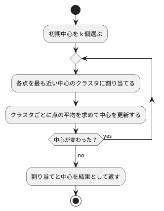

# 第 14 章: K-means によるクラスタリング

## 14.1 はじめに

これまでの章では、正解ラベル（派閥・品種・生存・価格など）が付いたデータから予測のルールを学ばせてきました。このような学習を **教師あり学習** と呼びます。

この章では、正解ラベルの無いデータから、似たもの同士のグループ（クラスタ）を見つける **クラスタリング** を扱います。正解を教えずにデータの構造を見つけるので、**教師なし学習** の一種です。代表的なアルゴリズムである **K-means** を TDD で自作し、Tribuo の `KMeansTrainer` と結果を比べます。

題材は、卸売業者の顧客ごとの商品カテゴリ別の支出額です。「どんな買い方をする顧客のグループがあるか」を、データだけから探します。

[Python 版の第 14 章](../python/14-k-means-clustering.md) と同じ TODO リストで進め、[Kotlin 版](../kotlin/14-k-means-clustering.md)・[Java 版](../java/14-k-means-clustering.md) と対比します。Kotlin 版は点を `List<Double>` で表し、`generateSequence` の遅延評価で「中心が動かなくなるまで繰り返す」処理を書きました。Java 版は `double[][]` と `for` 文です。Scala 版は点を `Vector[Double]`、点の集まりを `Vector[Vector[Double]]` という不変のコレクションで表し、繰り返しは **末尾再帰** で書きます。

Notebook と可視化の節は設けません。エルボー法のグラフとクラスタごとの特徴のグラフは、[Python 版](../python/14-k-means-clustering.md) と [Kotlin 版の 14.16 節](../kotlin/14-k-means-clustering.md) を参照してください。

## 14.2 K-means の仕組み

K-means は、クラスタ数 k を人間が決め、次の 2 つの手順を交互に繰り返してクラスタを作ります。

1. **割り当て**: 各点を、最も近いクラスタの中心に割り当てる
2. **更新**: クラスタごとに、割り当てられた点の平均を新しい中心にする

中心が動かなくなったら（割り当てが変わらなくなったら）終わりです。



クラスタのまとまりの良さは **SSE**（Sum of Squared Errors、誤差平方和）で測ります。各点と、その点が属するクラスタの中心との距離の 2 乗を合計した値で、小さいほど各クラスタの点が中心の近くにまとまっています。

K-means には、最初に選ぶ中心（初期中心）によって結果が変わるという性質があります。この章では、この性質もテストで確かめながら実装します。そのため、初期中心を **引数で受け取る** 設計にします。乱数で選ぶ処理と分けておけば、テストでは決まった初期中心を渡して結果を固定できます。

## 14.3 題材とデータ

この章で使うのは `Wholesale.csv` です。440 件の顧客について、次の 8 列が記録されています。欠損値はありません。

| 列 | 意味 |
|----|------|
| Channel | 販売チャネルの区分 |
| Region | 地域の区分 |
| Fresh | 生鮮食品の支出額 |
| Milk | 乳製品の支出額 |
| Grocery | 食料雑貨の支出額 |
| Frozen | 冷凍食品の支出額 |
| Detergents_Paper | 洗剤・紙製品の支出額 |
| Delicassen | 惣菜の支出額 |

Channel と Region は区分を表す番号で、大小に意味がありません。この章では支出額の 6 列だけを使って、買い方の似た顧客をまとめます。

支出額の列は、列によって桁が大きく違います。距離で近さを測る K-means では、このままだと値の大きい列が距離をほぼ決めてしまいます。そこで、クラスタリングの前に列ごとに **標準化** します。標準化には [第 9 章](09-feature-engineering.md) の `Standardizer`（件数で割る標準偏差）をそのまま使います。

## 14.4 TODO リストの作成

**TODO リスト**:

- [ ] 支出額の列を読み込む
- [ ] 列ごとに標準化する
- [ ] 各点を最も近い中心のクラスタに割り当てる
- [ ] 割り当てた点の平均で中心を更新する
  - [ ] 点が 1 つも無いクラスタの中心はそのままにする
- [ ] SSE を計算する
- [ ] 中心が変わらなくなるまで割り当てと更新を繰り返す
- [ ] 初期中心をシードで選ぶ
- [ ] クラスタ数ごとの SSE を求める（エルボー法）
- [ ] 初期中心を変えて繰り返し、SSE が最小の結果を選ぶ
- [ ] Tribuo の `KMeansTrainer` と比べる
- [ ] クラスタごとの特徴をまとめる
- [ ] 実データでクラスタリングして結果を表示する

## 14.5 支出額の列を読み込む

テストでは、架空の値を 1 行だけ書いた CSV を一時ファイルに作ります。JUnit 5 の `@TempDir` にあたる仕組みは ScalaTest の `AnyFunSuite` には無いので、`Files.createTempFile` と `deleteOnExit` で済ませます。

```scala
  private val Header = "Channel,Region,Fresh,Milk,Grocery,Frozen,Detergents_Paper,Delicassen\n"

  private def writeCsv(content: String): Path =
    val csv = Files.createTempFile("wholesale", ".csv")
    csv.toFile.deleteOnExit()
    Files.write(csv, content.getBytes(StandardCharsets.UTF_8))

  test("Channel と Region を除いた支出額の列を読み込む") {
    val csv = writeCsv(Header + "1,2,100,200,300,400,500,600\n")

    val x = Spending.load(csv)

    assert(
      x.head.columns === Vector(
        "Fresh",
        "Milk",
        "Grocery",
        "Frozen",
        "Detergents_Paper",
        "Delicassen"
      )
    )
    assert(x.head.values === Vector(100.0, 200.0, 300.0, 400.0, 500.0, 600.0))
  }
```

読み込みは、第 2 章の `Table` で CSV を読み、区分の 2 列を除いた列だけを `Features` にします。

```scala
  /** 区分を表す番号で、支出額ではない列 */
  val Categories: Set[String] = Set("Channel", "Region")

  /** Channel と Region を除いた支出額の列を読み込む。欠損値があれば例外を投げる。 */
  def load(csvFile: Path): Vector[Features] =
    val table = Table.load(csvFile)
    val columns = table.columns.filterNot(Categories.contains)
    table.rows.map { row =>
      Features(
        columns,
        columns.map(column =>
          row.number(column).getOrElse(throw IllegalArgumentException(s"欠損値があります: $column"))
        )
      )
    }
```

`filterNot(Categories.contains)` のように、`Set` をそのまま「条件を表す関数」として渡せます（`Set[String]` は `String => Boolean` でもあるからです）。`row.number` は `Option[Double]` を返すので、`getOrElse` で「欠損値があれば例外」という方針を 1 行で書けます。このデータには欠損値が無いという前提を、型の上で明示したことになります。

## 14.6 列ごとに標準化する

標準化は第 9 章の `Standardizer` に任せ、結果を「1 件 = 1 つの点」の形にします。

```scala
  /** 第 9 章の標準化（件数で割る標準偏差）で列ごとにそろえ、1 件を 1 つの点とする。 */
  def standardize(x: Vector[Features]): Vector[Vector[Double]] =
    Standardizer.fit(x).transform(x).map(_.values)
```

テストでは、変換後の各列の平均が 0、標準偏差が 1 になることを確かめます。点の集まりが `Vector[Vector[Double]]` なので、`transpose` で列ごとの並びにできます。

```scala
  test("列ごとに平均 0・標準偏差 1 の点に変換する") {
    val columns = Vector("Fresh", "Milk")
    val x = Vector(
      Features(columns, Vector(10, 5)),
      Features(columns, Vector(20, 5)),
      Features(columns, Vector(30, 8))
    )

    val points = Spending.standardize(x)

    points.transpose.foreach { values =>
      val mean = values.sum / values.size
      val variance = values.map(v => (v - mean) * (v - mean)).sum / values.size
      assert(mean === 0.0 +- 1e-12)
      assert(math.sqrt(variance) === 1.0 +- 1e-12)
    }
  }
```

Java 版は列ごとの値を取り出すために添字のループを回します。Scala では `transpose` のひとことで、行の集まりが列の集まりになります。

## 14.7 各点を最も近い中心に割り当てる

1 次元の 4 点と 2 つの中心から始めます。

```scala
  test("各点を最も近い中心のクラスタに割り当てる") {
    val points = pointsOf(Vector(0.0), Vector(1.0), Vector(9.0), Vector(10.0))
    val centers = pointsOf(Vector(0.0), Vector(10.0))

    assert(KMeans.assignClusters(points, centers) === Vector(0, 0, 1, 1))
  }
```

`pointsOf` は、テストの中で `Vector[Vector[Double]]` という型を書かずに済ませるための小さなヘルパーです。

```scala
  private def pointsOf(rows: Vector[Double]*): Vector[Vector[Double]] = rows.toVector
```

三角測量は 2 次元の点で行い、ユークリッド距離で判定していることを確かめます。実装は距離の 2 乗と `minBy` だけです。

```scala
  /** 2 点間の距離の 2 乗。 */
  def squaredDistance(a: Vector[Double], b: Vector[Double]): Double =
    a.lazyZip(b).map((x, y) => (x - y) * (x - y)).sum

  /** 各点を、最も近い中心のクラスタ番号に割り当てる。 */
  def assignClusters(
      points: Vector[Vector[Double]],
      centers: Vector[Vector[Double]]
  ): Vector[Int] =
    points.map(point => centers.indices.minBy(k => squaredDistance(point, centers(k))))
```

距離の 2 乗のままで比べるのは、平方根を取らなくても大小が変わらないからです（Python 版・Kotlin 版・Java 版と同じ）。Java 版は「最も近い中心」を探すために `nearest` を更新する二重ループを書きますが、Scala は `centers.indices.minBy(...)` で「距離が最小になる添字」と言えます。`minBy` は最小が複数あれば最初の添字を返すので、Java 版の `<`（厳密に小さいときだけ更新）と同じ結果になります。

## 14.8 中心を更新する

クラスタごとに、割り当てられた点の平均を新しい中心にします。点が 1 つも割り当てられなかったクラスタは、中心を変えません。

```scala
  test("クラスタごとに割り当てられた点の平均を新しい中心にする") {
    val points = pointsOf(Vector(0, 0), Vector(2, 0), Vector(10, 10), Vector(10, 12))
    val previous = pointsOf(Vector(0, 0), Vector(0, 0))

    assert(
      KMeans.updateCenters(points, Vector(0, 0, 1, 1), previous) ===
        Vector(Vector(1, 0), Vector(10, 11))
    )
  }

  test("点が 1 つも割り当てられなかったクラスタは中心を変えない") {
    val points = pointsOf(Vector(0, 0), Vector(2, 4))
    val previous = pointsOf(Vector(0, 0), Vector(99, 99))

    assert(
      KMeans.updateCenters(points, Vector(0, 0), previous) === Vector(Vector(1, 2), Vector(99, 99))
    )
  }
```

空のクラスタのテストは、Java 版では `0.0 / 0` が例外にならずに `NaN` になるという落とし穴を見つけるためのものでした。Scala の `Double` も JVM の `double` なので同じ振る舞いをします。この章では「前の中心を残す」方針にし、割り当てが 0 件かどうかを `groupMap` の結果の有無で判断します。

```scala
  def updateCenters(
      points: Vector[Vector[Double]],
      labels: Vector[Int],
      previous: Vector[Vector[Double]]
  ): Vector[Vector[Double]] =
    val grouped = labels.zip(points).groupMap(_._1)(_._2)
    previous.indices.toVector.map { k =>
      grouped.get(k) match
        case None => previous(k)
        case Some(members) =>
          members.transpose.map(_.sum / members.size)
    }
```

`groupMap(_._1)(_._2)` は「クラスタ番号でまとめて、値のほうだけを集める」処理です。Java 版は合計用の配列と件数の配列を用意し、点を 1 つずつ足し込んでから件数で割ります。Scala では「割り当てられた点を集めて、列ごとの平均を取る」という説明がそのままコードになり、`0 件なら NaN` の危険は `match` で先に断ち切れます。

`transpose` で列ごとの並びにしてから平均を取るので、足す順番は Java 版と同じ（点の順）になります。浮動小数点の足し算は順番で結果が変わるので、この一致が後で効いてきます。

## 14.9 SSE を計算する

```scala
  test("各点と所属するクラスタの中心との距離の 2 乗を合計する") {
    val points = pointsOf(Vector(0, 0), Vector(2, 0), Vector(10, 10), Vector(10, 12))
    val centers = pointsOf(Vector(1, 0), Vector(10, 11))

    assert(KMeans.sumOfSquaredErrors(points, Vector(0, 0, 1, 1), centers) === 4.0)
  }
```

```scala
  def sumOfSquaredErrors(
      points: Vector[Vector[Double]],
      labels: Vector[Int],
      centers: Vector[Vector[Double]]
  ): Double =
    points.lazyZip(labels).map((point, label) => squaredDistance(point, centers(label))).sum
```

`lazyZip` は、2 つのコレクションを組にして `map` するときに中間のコレクションを作りません。Java 版の添字ループと同じ計算を、添字なしで書けます。

## 14.10 中心が変わらなくなるまで繰り返す

結果は case class にまとめます。Java 版は「`record` の成分に配列を置くと `equals` が参照の比較になる」ため、割り当てを `List<Integer>`、中心を第 7 章の `Matrix` にしました。Scala は `Vector` も `Matrix` も値で比べられるので、同じ形がそのまま自然な選択になります。

```scala
case class KMeansResult(labels: Vector[Int], centers: Matrix, sse: Double)
```

そのおかげで、収束した結果を丸ごと 1 つの等価判定で確かめられます。

```scala
  test("割り当てが変わらなくなるまで割り当てと中心の更新を繰り返す") {
    val result = KMeans.fit(twoGroups(), Vector(Vector(0, 0), Vector(0, 1)))

    assert(
      result === KMeansResult(
        Vector(0, 0, 1, 1),
        Matrix(Vector(Vector(0, 0.5), Vector(10, 10.5))),
        1.0
      )
    )
  }
```

繰り返しは末尾再帰で書きました。`@annotation.tailrec` を付けておくと、末尾呼び出しになっていない場合にコンパイルエラーになるので、スタックを積まないことがコンパイラに保証されます。

```scala
  def fit(
      points: Vector[Vector[Double]],
      initialCenters: Vector[Vector[Double]],
      maxIterations: Int = DefaultMaxIterations
  ): KMeansResult =
    val centers = converge(points, initialCenters, maxIterations)
    val labels = assignClusters(points, centers)
    KMeansResult(labels, Matrix(centers), sumOfSquaredErrors(points, labels, centers))

  @annotation.tailrec
  private def converge(
      points: Vector[Vector[Double]],
      centers: Vector[Vector[Double]],
      remaining: Int
  ): Vector[Vector[Double]] =
    if remaining <= 0 then centers
    else
      val next = updateCenters(points, assignClusters(points, centers), centers)
      if next == centers then centers else converge(points, next, remaining - 1)
```

`next == centers` と書けるのは、`Vector` の等価判定が要素の比較だからです。Java 版は `Arrays.deepEquals(next, centers)` を呼びます（`==` は参照の比較になってしまう）。Kotlin 版は `generateSequence` で中心の列を作り、`zipWithNext` で「変わらなくなった最初の要素」を探しました。3 つの版で書き方は違いますが、止まる条件は同じです。

最大反復回数は、既定値のある引数にしました。Java 版がオーバーロードで用意した「上限を省いた版」は要りません。1 回で打ち切ったときの中心もテストで固定しています。

```scala
  test("最大反復回数に達したら収束していなくても打ち切る") {
    val result = KMeans.fit(twoGroups(), Vector(Vector(0, 0), Vector(0, 1)), 1)

    assert(result.centers.rows.head === Vector(0.0, 0.0))
    assert(result.centers.rows(1).head === 20.0 / 3 +- 1e-9)
    assert(result.centers.rows(1)(1) === 22.0 / 3 +- 1e-9)
    assert(result.labels === Vector(0, 0, 1, 1))
  }
```

## 14.11 初期中心をシードで選ぶ

初期中心は、点をシード付きの乱数で並べ替えて先頭から k 個取ります。並べ替えには、第 2 章の `Preprocessing.shuffle` をそのまま使いました。`java.util.Random` を使った Fisher-Yates で、Java 版の `Collections.shuffle` と同じ手順・同じ乱数です。

```scala
  /** シード付きの乱数で点を並べ替え、先頭から nClusters 個を初期中心にする。 */
  def chooseInitialCenters(
      points: Vector[Vector[Double]],
      nClusters: Int,
      seed: Long
  ): Vector[Vector[Double]] =
    Preprocessing.shuffle(points, seed).take(nClusters)
```

Java 版は、点の配列を壊さないように添字のリストを並べ替え、選んだ点を `clone()` で写して返します。Scala では `Vector` が変更できないので、点をそのまま並べ替えても元のデータは無傷です。写しを取る必要もありません。

テストでは「データの中の点が重複なく k 個選ばれる」「同じシードなら同じ、違うシードなら違う」を確かめます。

```scala
  test("データの中から重複なくクラスタ数だけ点を選ぶ") {
    val points = numberedPoints(10)

    val centers = KMeans.chooseInitialCenters(points, 3, 0)

    assert(centers.distinct.size === 3)
    assert(centers.forall(points.contains))
  }
```

`distinct` も `contains` も値の比較なので、Java 版が `Arrays.toString` で文字列にしてから重複を数えたり、`anySatisfy` で 1 件ずつ突き合わせたりした工夫は要りません。

## 14.12 エルボー法でクラスタ数を選ぶ

K-means では、クラスタ数 k を人間が決める必要があります。k を増やすほど各点は近い中心を持てるので、SSE は小さくなります。k を点の数と同じにすれば SSE は 0 ですが、それではグループ分けになりません。

**エルボー法** は、k を 1 から順に増やして SSE をグラフにし、減り方が急に緩やかになる k（肘のように曲がる点）を選ぶ方法です。2 グループの例では、k = 1 のときの中心は全 4 点の平均 (5, 5.5) で SSE は 201、k = 2 のときは 1 です。

```scala
  test("クラスタ数ごとにクラスタリングしたときの SSE を求める") {
    assert(KMeans.sseByClusterCount(twoGroups(), Vector(1, 2), 0) === SeqMap(1 -> 201.0, 2 -> 1.0))
  }
```

戻り値は `SeqMap`（順序を保つ不変の Map）にしました。クラスタ数の順に取り出したいからです。Java 版は `LinkedHashMap` を明示し、Kotlin 版は `associateWith` が返す `LinkedHashMap` に頼りました。Scala の `Map` は既定では順序を保たないので、型で意思表示できる `SeqMap` を選んでいます。

## 14.13 局所解と複数回の試行

### 実データで起きたこと

ここまでのメソッドで、標準化した実データのエルボー法を試してみました。使い捨てのテストで、初期中心 1 通りで k = 1 から 10 までの SSE を求め、シードを変えて表示した結果の一部です（小数第 2 位まで。確かめたあとでテストは削除しました）。

| k | シード 0 | シード 1 | シード 5 |
|---|---------|---------|---------|
| 2 | 2267.09 | 1954.18 | 1956.12 |
| 4 | 1345.47 | 1533.99 | 1345.47 |
| 6 | 993.26 | 947.20 | 1015.81 |
| 7 | 934.29 | 952.13 | 908.79 |
| 9 | 719.53 | 758.35 | 793.95 |
| 10 | 754.63 | 618.17 | 877.40 |

シード 0 では k = 2 の SSE が 2267.09 で、シード 1 の 1954.18 より大きくなりました。シード 0 では k = 9 の 719.53 から k = 10 の 754.63 へ、シード 1 では k = 6 の 947.20 から k = 7 の 952.13 へ、シード 5 では k = 9 の 793.95 から k = 10 の 877.40 へ、k を増やしたのに SSE が増えています。**この表は [Java 版の同じ表](../java/14-k-means-clustering.md) と 1 桁も違いません。** 初期中心の選び方（`java.util.Random` の Fisher-Yates）も、中心の更新と SSE の足し算の順序もそろえたからです。

K-means は「今より SSE が下がる方向」にしか中心を動かさないので、初期中心によっては、最もよい分け方にたどり着く前に止まることがあります。これを **局所解** と呼びます。

### 局所解をテストで再現する

1 次元に 3 組の点を並べた例で確かめます。3 つのクラスタに分けるなら、0 と 1、10 と 11、20 と 21 に分けるのが最適で、SSE は 0.5 × 3 = 1.5 です。ところが、左の組から 2 点・中央の組から 1 点を初期中心にすると、0 と 1 が別々のクラスタのまま、残りの 4 点が 1 つのクラスタにまとめられて止まります。

```scala
  private def threePairs(): Vector[Vector[Double]] =
    pointsOf(Vector(0), Vector(1), Vector(10), Vector(11), Vector(20), Vector(21))

  test("初期中心によっては局所解に陥る") {
    val stuck = KMeans.fit(threePairs(), Vector(Vector(0), Vector(1), Vector(10)))

    assert(stuck.sse === 101.0)
  }

  test("複数の初期中心の候補のうち SSE が最小の結果を返す") {
    val candidates = Vector(
      Vector(Vector(0.0), Vector(1.0), Vector(10.0)),
      Vector(Vector(0.0), Vector(10.0), Vector(20.0))
    )

    val result = KMeans.best(threePairs(), candidates)

    assert(result.sse === 1.5)
    assert(result.centers === Matrix(Vector(Vector(0.5), Vector(10.5), Vector(20.5))))
  }
```

複数の候補から最小を選ぶ処理と、シードをずらして候補を作る処理を分けて書きました。

```scala
  /** 初期中心の候補ごとにクラスタリングし、SSE が最小の結果を返す。 */
  def best(
      points: Vector[Vector[Double]],
      initialCenterCandidates: Vector[Vector[Vector[Double]]]
  ): KMeansResult =
    initialCenterCandidates.map(fit(points, _)).minBy(_.sse)

  /** シードを 1 ずつずらして初期中心を nInit 通り選び、SSE が最小の結果を返す。 */
  def fitWithRestarts(
      points: Vector[Vector[Double]],
      nClusters: Int,
      seed: Long,
      nInit: Int = DefaultNInit
  ): KMeansResult =
    best(
      points,
      (0 until nInit).toVector.map(i => chooseInitialCenters(points, nClusters, seed + i))
    )
```

`nInit` の既定値 10 は、scikit-learn の `KMeans` の `n_init` と同じです。エルボー法の `sseByClusterCount` も、この `fitWithRestarts` を使うように直しました。

```scala
  def sseByClusterCount(
      points: Vector[Vector[Double]],
      clusterCounts: Vector[Int],
      seed: Long,
      nInit: Int = DefaultNInit
  ): SeqMap[Int, Double] =
    SeqMap.from(clusterCounts.map(n => n -> fitWithRestarts(points, n, seed, nInit).sse))
```

`Vector[Vector[Vector[Double]]]`（初期中心の候補の集まり）という 3 重の型は、読むときに少し止まります。`type Points = Vector[Vector[Double]]` のような型の別名を作ることも考えましたが、`Points` という名前では「点の集まり」なのか「1 つの点」なのか読み手が迷うため、この章では型をそのまま書いています。

## 14.14 Tribuo の KMeansTrainer と比べる

### 初期中心を渡せない

Python 版では、scikit-learn の `KMeans` に同じ初期中心を配列で渡し、クラスタ番号・中心・SSE がすべて一致することを確かめました。Kotlin 版で調べたとおり（[ADR 002](../../../adr/002-kotlin-ml-libraries.md)）、Tribuo の `KMeansTrainer` のコンストラクターの引数はクラスタ数・最大反復回数・距離・初期化の方法・スレッド数・シードで、初期中心そのものを受け取る引数はありません。初期化の方法（`Initialisation`）は、ランダムに選ぶ `RANDOM` と、互いに離れた点を選びやすくする **k-means++** の `PLUSPLUS` の 2 つです。

この事実を、Scala 版でも学習用テストとして残します。

```scala
  test("KMeansTrainer の初期化方法は RANDOM と PLUSPLUS だけで初期中心を渡すコンストラクターは無い") {
    assert(
      KMeansTrainer.Initialisation.values.toVector.map(_.name) === Vector("RANDOM", "PLUSPLUS")
    )
    assert(
      !classOf[KMeansTrainer].getConstructors.exists(
        _.getParameterTypes.exists(t =>
          t.isArray || classOf[util.Collection[?]].isAssignableFrom(t)
        )
      )
    )
  }
```

Scala では `KMeansTrainer.getConstructors` と書くと、Java の静的メンバーを持つ「コンパニオンのような入れもの」を指してしまい、意図したコンストラクターの一覧になりません。クラスそのものを指す `classOf[KMeansTrainer]` を使います。`classOf[util.Collection[?]]` の `?` はワイルドカードの型引数で、Java の `Collection<?>` にあたります。

同じ初期中心を渡せないので、クラスタ番号や中心の一致は確かめられません。ADR 002 で決めたとおり、同じクラスタ数での **SSE の大きさ** を比べます。

### Tribuo のデータセットに変換する

Tribuo のクラスタリングでは、事例の出力の型が `ClusterID` です。学習するときはクラスタが決まっていないので、未割り当てを表す `ClusteringFactory.UNASSIGNED_CLUSTER_ID` を渡します。

```scala
  /** 点の集まりを、クラスタ番号の無い Tribuo のデータセットにする。 */
  def toDataset(points: Vector[Vector[Double]]): MutableDataset[ClusterID] =
    val dataset =
      MutableDataset[ClusterID](SimpleDataSourceProvenance("points", factory), factory)
    val names = featureNames(points.head.size)
    points.foreach { point =>
      dataset.add(
        ArrayExample[ClusterID](ClusteringFactory.UNASSIGNED_CLUSTER_ID, names, point.toArray)
      )
    }
    dataset

  /** k-means++ で初期中心を選んで学習する。 */
  def train(points: Vector[Vector[Double]], nClusters: Int, seed: Long): KMeansModel =
    KMeansTrainer(
      nClusters,
      MaxIterations,
      L2Distance(),
      KMeansTrainer.Initialisation.PLUSPLUS,
      Threads,
      seed
    ).train(toDataset(points))
```

Tribuo は特徴量を **名前の順** に並べ替えるので、列の順と名前の順が一致するように `x00`・`x01` … と 0 埋めの名前を付けます（第 7 章と同じ注意点です）。

```scala
  private def featureNames(dimensions: Int): Array[String] =
    (0 until dimensions).toArray.map(j => String.format(Locale.ROOT, "x%02d", j))
```

学習した中心は `getCentroidVectors` で取り出せます。返るのは `Array[DenseVector]` なので、`toVector` で不変のコレクションに戻し、SSE は **自作の割り当てと自作の SSE** で求めます。定義をそろえないと比べられないからです。

```scala
  def centers(model: KMeansModel): Vector[Vector[Double]] =
    model.getCentroidVectors.toVector.map(_.toArray.toVector)

  def sse(points: Vector[Vector[Double]], nClusters: Int, seed: Long): Double =
    val trained = centers(train(points, nClusters, seed))
    KMeans.sumOfSquaredErrors(points, KMeans.assignClusters(points, trained), trained)

  def bestSse(points: Vector[Vector[Double]], nClusters: Int, seed: Long, nInit: Int): Double =
    (0 until nInit).map(i => sse(points, nClusters, seed + i)).min
```

`model.getCentroidVectors` を `getCentroidVectors()` と書かないのは、Scala では引数の無い Java のメソッドを括弧なしで呼べるからです。はっきり分かれた 2 グループでは、Tribuo の SSE も自作と同じ 1.0 になりました。

```scala
  test("はっきり分かれた 2 グループなら Tribuo の SSE も自作と同じになる") {
    val points: Vector[Vector[Double]] =
      Vector(Vector(0, 0), Vector(0, 1), Vector(10, 10), Vector(10, 11))

    assert(TribuoKMeans.sse(points, 2, 0L) === 1.0 +- 1e-9)
  }
```

ここで `val points: Vector[Vector[Double]] = …` と型を書いているのは、`Vector(Vector(0, 0), …)` だけでは `Vector[Vector[Int]]` と推論されてしまうからです。整数リテラルが `Double` に広がるのは、期待される型がその場で分かっているときだけです。テストを書きながら次のエラーで気づきました。

```text
[error] 26 |    assert(TribuoKMeans.sse(points, 2, 0L) === 1.0 +- 1e-9)
[error]    |                            ^^^^^^
[error]    |                            Found:    (points : Vector[Vector[Int]])
[error]    |                            Required: Vector[Vector[Double]]
```

## 14.15 実データでクラスタリングする

### クラスタごとの特徴をまとめる

クラスタ番号だけでは何のグループか分からないので、クラスタごとに件数と、**元の単位（標準化する前）** での平均支出額を求めます。

```scala
case class ClusterSummary(cluster: Int, count: Int, means: SeqMap[String, Double])
```

```scala
  /** クラスタごとの件数と、元の単位での列ごとの平均を、件数の多い順に並べる。 */
  def summarizeClusters(x: Vector[Features], labels: Vector[Int]): Vector[ClusterSummary] =
    labels
      .zip(x)
      .groupMap(_._1)(_._2)
      .toVector
      .sortBy(_._1)
      .map((cluster, members) => ClusterSummary(cluster, members.size, means(members)))
      .sortBy(-_.count)
```

クラスタ番号で並べてから件数の多い順に並べ直しているのは、件数が同じクラスタの順を決めるためです（`sortBy` は安定なので、件数が同じならクラスタ番号の順になります）。Java 版は `TreeMap` と `Comparator.comparingInt(...).reversed()` で同じことをしています。

### 実データのテスト

実データのテストは `assume` で CSV が無ければスキップします。件数と列数のほかに、性質を 2 つ確かめました。

```scala
  test("標準化したデータのクラスタ数 1 の SSE は件数と列数の積になる") {
    requireData(): Unit
    val points = Spending.standardize(Spending.load(csvFile))

    val sse = KMeans.sseByClusterCount(points, Vector(1), 0)(1)

    assert(sse === 440.0 * 6 +- 1e-6)
  }

  test("クラスタ数を増やすほど SSE が小さくなる") {
    requireData(): Unit
    val points = Spending.standardize(Spending.load(csvFile))

    val sse = KMeans.sseByClusterCount(points, (1 to 10).toVector, 0).values.toVector

    assert(sse.sliding(2).forall(pair => pair(1) < pair(0)))
  }
```

1 つ目は、標準化したデータの分散が列ごとに 1 なので、クラスタ数 1 の SSE が「件数 × 列数」になるという性質です。自作の標準化が「件数で割る標準偏差」だからぴったり 2640 になります（不偏標準偏差なら 2634 になります）。2 つ目は、隣り合う 2 つを `sliding(2)` で見て、減り続けていることを確かめています。初期中心を 10 通り試すようにしたので、14.13 節で見た「k を増やすと SSE が増える」現象は起きません。

### 実行して結果を表示する

`sbt "run chapter14"` の結果です。

```text
データ件数: 440（支出額 6 列）
クラスタ数ごとの SSE（初期中心 10 通りの最小値）:
クラスタ数	自作	Tribuo（k-means++）
1	2640.00	2640.00
2	1954.18	1954.78
3	1614.52	1607.67
4	1334.36	1317.90
5	1085.27	1058.77
6	947.20	917.67
7	888.22	839.38
8	775.24	742.02
9	690.81	655.14
10	618.17	606.81

クラスタ数 5 のクラスタごとの件数と平均支出額:
クラスタ	件数	Fresh	Milk	Grocery	Frozen	Detergents_Paper	Delicassen
2	265	8909	2967	3804	2248	989	962
1	96	5509	10556	16478	1420	7199	1659
0	65	31117	4260	5374	7225	849	2286
3	10	15965	34709	48537	3055	24875	2943
4	4	52022	31696	18491	29826	2699	19656
```

Tribuo が学習の経過を標準エラーに出すので、`Logger.getLogger("org.tribuo").setLevel(Level.WARNING)` で警告以上だけにしています。Java 版と同じく、ロガーはガベージコレクションで設定ごと消えないようにフィールドで持ち続けます。

### 結果を読む

**この表は [Java 版の 14.15 節](../java/14-k-means-clustering.md) の表と、SSE も件数も平均支出額も完全に一致しました。** 自作の列が一致するのは初期中心の乱数と計算の順序がそろっているから、Tribuo の列が一致するのは同じ Tribuo 4.3.2 に同じ標準化の値と同じシードを渡しているからです。Kotlin 版とは、Tribuo の列だけが一致し、自作の列は違います（`kotlin.random.Random` は別の点を選ぶため）。

**自作と Tribuo の SSE を比べると**、k = 2 だけは自作（1954.18）のほうが Tribuo（1954.78）より小さく、k = 3 から 10 では Tribuo（k-means++ で 10 通り）のほうが小さくなりました。差は k = 7 で最も大きく、自作の 888.22 に対して Tribuo は 839.38 です。どちらも「初期中心を変えて 10 回試し、最小の SSE を使う」点は同じなので、違いは初期中心の選び方にあります。データの点からランダムに選ぶ自作より、互いに離れた点を選びやすい k-means++ のほうが、このデータでは局所解を避けやすかったと読めます。

**エルボー法で読むと**、自作の SSE の減り方は k = 3 → 4 で 280.16、k = 4 → 5 で 249.09、k = 5 → 6 で 138.07、k = 6 → 7 で 58.98 と小さくなっていきますが、k = 7 → 8 では 112.98 と再び大きくなり、はっきりした肘は見えません。ここでは Python 版・Kotlin 版・Java 版と同じくクラスタ数を 5 にしました。エルボーが 1 点に決まらないときは、クラスタを解釈できるかどうかも合わせて判断します。

クラスタ数 5 の結果は、次のように読めます。

- **265 件のクラスタ**: どの支出額も少なめの、最も多いグループ
- **96 件のクラスタ**: Grocery・Milk・Detergents_Paper が多めのグループ
- **65 件のクラスタ**: Fresh が突出して多いグループ
- **10 件のクラスタ**: Milk・Grocery・Detergents_Paper が非常に多いグループ
- **4 件のクラスタ**: Fresh・Milk・Frozen・Delicassen がどれも極端に多い顧客。グループというより外れ値に近い存在です

K-means は外れ値にも中心を 1 つ割いてしまうことが、この結果から分かります。外れ値の扱いは [第 9 章](09-feature-engineering.md) で扱いました。

## 14.16 品質チェック

`nix develop .#scala` の中で、整形・整形の検査・テストをまとめて実行します。

```console
$ sbt -batch --no-colors scalafmtAll scalafmtCheckAll test
…
[info] Total number of tests run: 188
[info] Suites: completed 38, aborted 0
[info] Tests: succeeded 188, failed 0, canceled 0, ignored 0, pending 0
[info] All tests passed.
```

第 14 章のテストの実行結果です（学習データを配置した状態）。

```text
[info] SpendingSpec:
[info] - Channel と Region を除いた支出額の列を読み込む
[info] - 列ごとに平均 0・標準偏差 1 の点に変換する
[info] - クラスタごとの件数と平均を件数の多い順に並べる
[info] TribuoKMeansSpec:
[info] - KMeansTrainer の初期化方法は RANDOM と PLUSPLUS だけで初期中心を渡すコンストラクターは無い
[info] - はっきり分かれた 2 グループなら Tribuo の SSE も自作と同じになる
[info] - Tribuo でもシードを変えて繰り返し最小の SSE を使える
[info] KMeansSpec:
[info] - 各点を最も近い中心のクラスタに割り当てる
[info] - 2 次元の点をユークリッド距離で最も近い中心に割り当てる
[info] - クラスタごとに割り当てられた点の平均を新しい中心にする
[info] - 点が 1 つも割り当てられなかったクラスタは中心を変えない
[info] - 各点と所属するクラスタの中心との距離の 2 乗を合計する
[info] - 中心から離れた点ほど誤差が大きくなる
[info] - 割り当てが変わらなくなるまで割り当てと中心の更新を繰り返す
[info] - 最大反復回数に達したら収束していなくても打ち切る
[info] - データの中から重複なくクラスタ数だけ点を選ぶ
[info] - 同じシードなら同じ点を選ぶ
[info] - シードが違えば違う点を選ぶ
[info] - クラスタ数ごとにクラスタリングしたときの SSE を求める
[info] - 初期中心を変えて繰り返し最小の SSE を使う
[info] - 初期中心によっては局所解に陥る
[info] - 複数の初期中心の候補のうち SSE が最小の結果を返す
[info] WholesaleDataSpec:
[info] - 実データから 440 件の支出額 6 列を読み込む
[info] - 標準化したデータのクラスタ数 1 の SSE は件数と列数の積になる
[info] - クラスタ数を増やすほど SSE が小さくなる
[info] - 実行すると SSE とクラスタごとの件数と平均支出額を表示する
```

学習データが無い環境（`ML_DATA_DIR=/nonexistent sbt test`）では、`WholesaleDataSpec` の 4 件が canceled になり、ビルドは成功します。

この章で追加した依存は、Tribuo のクラスタリングのモジュール 1 つだけです。

```scala
      "org.tribuo" % "tribuo-clustering-kmeans" % "4.3.2",
```

TDD の途中で済ませた設計の判断は次のとおりです。

- **不変のコレクションで通す** — 点も中心も `Vector` にし、途中で配列に落とさなかった。配列に戻すのは Tribuo に渡すときだけ
- **既定の引数** — `fit` の `maxIterations` と `fitWithRestarts`・`sseByClusterCount` の `nInit` を既定値のある引数にした。Java 版のオーバーロードは要らない
- **定義の共有** — Tribuo との比較でも、SSE は自作の `assignClusters` と `sumOfSquaredErrors` で求め、同じ定義で比べた

第 2 章の `Table`・`Features`・`Preprocessing`、第 7 章の `Matrix`、第 9 章の `Standardizer` は変更していません。

## 14.17 まとめ

この章では、K-means を割り当て・更新・SSE の小さな部品から組み立て、Tribuo の `KMeansTrainer` と比べました。

1. **初期中心を引数で受け取る** — 乱数で選ぶ処理と分けたので、テストでは初期中心を固定して結果を確かめられた。局所解もテストで再現できた
2. **初期中心 1 通りではエルボー法を読めない** — 実データでシードごとに SSE の曲線が変わり、k を増やして SSE が増えることもあった。10 通り試した最小の SSE で比べた
3. **Tribuo とは SSE の大きさで比べる** — 初期中心を渡せないので、シードを変えた最小の SSE で比べた。k = 3〜10 では k-means++ の Tribuo のほうが小さかった
4. **Java 版と数値が完全に一致した** — 初期中心の乱数（`java.util.Random` の Fisher-Yates）と、中心の更新・SSE の足し算の順序をそろえたので、シードごとの SSE の表も、最終的な SSE もクラスタごとの平均も Java 版と同じ値になった

Scala 版ならではの学びもありました。

- **収束は末尾再帰で書ける** — `@annotation.tailrec` を付けた `converge` で、可変の変数もループも使わずに「中心が動かなくなるまで」を表せた。止まる条件も `next == centers` と値で書ける
- **不変なら写しも比較も悩まない** — Java 版が `clone()`・`Arrays.deepEquals`・`Arrays.toString` で解いた問題が、`Vector` ではそもそも起きなかった
- **整数リテラルの広がりは期待される型しだい** — `val points = Vector(Vector(0, 0), …)` は `Vector[Vector[Int]]` になる。型を書くか、型が決まる場所に置く必要がある
- **Java の静的メンバーは `classOf` で** — `KMeansTrainer.getConstructors` ではコンストラクターの一覧を取れず、`classOf[KMeansTrainer]` を使った

次の章では、ここまでに作ったモデルを Web API として公開します。
