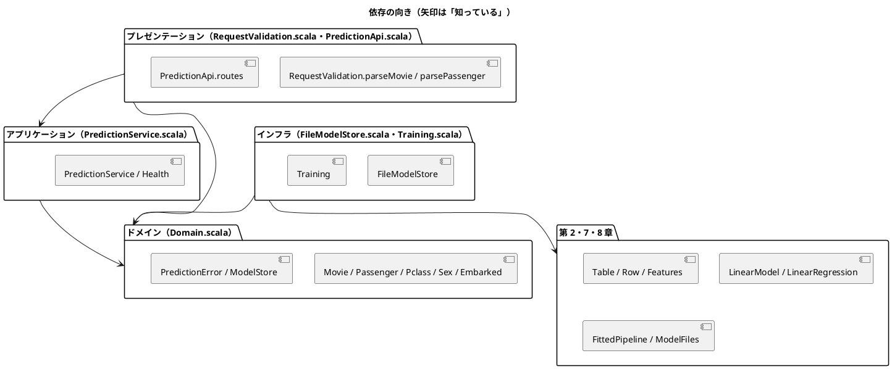

# 第 15 章: 機械学習 API とモジュール設計

## 15.1 はじめに

ここまでの章では、モデルを学習して評価するところまでを扱いました。モデルは、学習しただけでは誰の役にも立ちません。この章では、第 7 章の興行収入の予測と第 8 章の生存の予測を、**HTTP の API** として公開します。

API を作ると、機械学習とは別の関心事が増えます。

- 外から来る JSON が正しい形か（**入力の検証**）
- 学習済みモデルをどこから読み込むか（**モデルの置き場**）
- モデルが無いときや、ファイルが壊れているときに、何を返すか（**エラーの扱い**）

これらを 1 つのファイルに書くと、変更が難しくなります。関心事ごとに層（モジュール）を分け、依存の向きをそろえます。

[Python 版の第 15 章](../python/15-machine-learning-api-and-module-design.md)・[Kotlin 版の第 15 章](../kotlin/15-machine-learning-api-and-module-design.md)・[F# 版の第 15 章](../fsharp/15-machine-learning-api-and-module-design.md)・[Java 版の第 15 章](../java/15-machine-learning-api-and-module-design.md)・[C# 版の第 15 章](../csharp/15-machine-learning-api-and-module-design.md) と同じ API を作ります。Scala 版では、次の 3 点に注目してください。

- **失敗を `Either` で返す**。Scala の標準ライブラリには F# の `Result` に当たる `Either` があるので、F# 版とほとんど同じ形でドメインを書けます。Java 版は検査例外、C# 版は自作の `PredictionResult<T>` でした
- ドメインの値は **Scala 3 の `enum`**。`enum` のケースに値（コード）を持たせて、JSON の値との対応づけを機械的に作ります
- Web フレームワークは **http4s**。統合テストでは、サーバーを立てずに `HttpRoutes` を関数として直接呼びます

## 15.2 レイヤードアーキテクチャ

### 4 つの層と依存の向き

ほかの版と同じく、4 つの層に分けます。呼び方も F# 版・C# 版とそろえます。

| 層 | ファイル | 役割 | 知っている層 |
|----|---------|------|------------|
| ドメイン | `Domain.scala` | 入力（`Movie`・`Passenger`）と予測結果の型、客室の等級・性別・乗船港の `enum`、予測できなかった理由（`PredictionError`）、「モデルの置き場」の約束（`ModelStore`） | 何も知らない |
| アプリケーション | `PredictionService.scala` | 予測のユースケース（モデルを読み込んで予測する）と、ヘルスチェック（`Health`） | ドメイン |
| インフラ | `FileModelStore.scala`・`Training.scala` | モデルのファイルへの保存・読み込みと、第 7・8 章のモデルをドメインの約束に合わせるアダプター。学習して保存する処理 | ドメイン、第 2・7・8 章 |
| プレゼンテーション | `RequestValidation.scala`・`PredictionApi.scala` | 入力の検証、http4s の経路、HTTP の状態コード | ドメイン、アプリケーション |



ポイントは、**アプリケーション層がインフラ層を知らない** ことです。`PredictionService` は「置き場（`ModelStore`）から読み込んで予測する」ことしか知らず、それがファイルなのか、テスト用のスタブなのかを気にしません。

プレゼンテーション層の `PredictionApi.routes` も、サービスを引数で受け取ります。どの置き場を使うかを決めるのは、サーバーを起動する `Server`（15.8 節）だけです。

F# 版では、`.fsproj` に書いたファイルの順番がそのまま依存の向きになり、逆向きの依存はコンパイルできませんでした。Scala にはその仕組みがありません。パッケージはすべて `machinelearning.chapter15` で、ファイルの順番も関係しないので、**ドメイン層から `PredictionApi` を呼ぶコードも書けてしまいます**。依存の向きは、各ファイルの先頭に書いた Scaladoc と、レビューで守ります。C# 版と同じ事情です。

```scala
/** アプリケーション層。置き場からモデルを読み込んで予測するユースケースと、ヘルスチェック。 ドメイン層だけを知る。
  */
class PredictionService(store: ModelStore):
```

### インサイドアウトで進める

TDD の進め方には、外側（API）から作る **アウトサイドイン** と、内側（ドメイン・アプリケーション）から作る **インサイドアウト** があります。この章ではインサイドアウトを選びます。内側の層は外側を知らないので、スタブだけでテストできます。

## 15.3 TODO リストの作成

**TODO リスト**:

- [ ] ドメインの型を決める（`enum` と `case class`）
- [ ] 予測サービスを作る
  - [ ] モデルが無ければ `Left` を返す
  - [ ] ヘルスチェック
- [ ] 入力を検証する
  - [ ] 不正な理由をまとめて返す
  - [ ] 年齢と乗船港は省略できる
- [ ] http4s でエンドポイントを作る
  - [ ] 不正な入力は 422、モデルが無ければ 503、知らない経路は 404
- [ ] モデルを保存して読み込む
  - [ ] ファイルが無いときと壊れているときを区別する
- [ ] 実データで学習したモデルで動かす

## 15.4 ドメイン層とアプリケーション層

### ドメインを enum と case class で表す

```scala
// src/main/scala/machinelearning/chapter15/Domain.scala
/** 客室の等級。 */
enum Pclass(val code: Int):
  case First extends Pclass(1)
  case Second extends Pclass(2)
  case Third extends Pclass(3)

/** 性別。 */
enum Sex(val code: String):
  case Male extends Sex("male")
  case Female extends Sex("female")

/** 乗船した港。 */
enum Embarked(val code: String):
  case Cherbourg extends Embarked("C")
  case Queenstown extends Embarked("Q")
  case Southampton extends Embarked("S")

/** 興行収入を予測する映画の特徴量。 */
case class Movie(sns1: Double, sns2: Double, actor: Double, original: Boolean)

/** 生存を予測する乗客。年齢と乗船港は分からないことがある。 */
case class Passenger(
    pclass: Pclass,
    sex: Sex,
    age: Option[Double],
    sibSp: Int,
    parch: Int,
    fare: Double,
    embarked: Option[Embarked]
)

/** 予測した興行収入。 */
case class SalesPrediction(sales: Double)

/** 生存するかどうかの予測。 */
case class SurvivalPrediction(survived: Boolean)
```

- 第 8 章では、客室の等級を数値、性別と乗船港を文字列で表していました。CSV の値をそのまま持つためです。API のドメインでは、とりうる値を列挙します
- Scala 3 の `enum` は、ケースが固定された代数的データ型です。C# の enum のように `(Pclass)4` と書いて抜け道を作ることはできません。この点は、F# の判別共用体と同じ強さです
- **`enum` のケースには値を持たせられます**。`Pclass.First` は `code` に 1 を、`Sex.Male` は `code` に `"male"` を持ちます。この `code` が JSON での表現であり、第 8 章のパイプラインに渡す CSV のセルの値でもあります。対応づけを 1 か所（`Domain.scala`）に置いておけば、検証（15.5 節）でもアダプター（15.7 節）でもそれを使い回せます
- 分からないことがある年齢と乗船港は `Option[Double]`・`Option[Embarked]` です。第 2 章の欠損値を `Option` で表したのと同じ考え方です
- 入力も出力もすべて `case class` です。値で等しさを比べるので、テストの期待値をそのまま書けます

### 失敗の表し方 — 3 つの言語の違い

モデルの読み込みは失敗しうる処理です。「失敗をどう表すか」は、言語ごとに使える道具が違います。

| 版 | 失敗の表し方 | 呼び出す側 |
|----|------------|-----------|
| F# | 組み込みの `Result<'T, PredictionError>` | `match` か `Result.map` で扱う。扱うまで値を取り出せない |
| Java | 検査例外 `ModelNotFoundException` | `catch` するか、自分の宣言にも `throws` を書くかをコンパイラに強制される |
| C# | 自作の `PredictionResult<T>`（抽象レコードと sealed な派生） | `Match` で成功と失敗の両方を書く |
| Scala | 組み込みの `Either[PredictionError, T]` | `match` か `map` で扱う。扱うまで値を取り出せない |

Scala には、F# の `Result` に当たる `Either` が標準ライブラリにあります。しかも **右（`Right`）が成功** という向きまで同じなので、`map` は成功のときだけ働き、失敗はそのまま通り抜けます。C# 版のように型を自作する必要はなく、F# 版とほとんど同じ式が書けます。

一方、`Either` は Java の検査例外と違って「扱わないとコンパイルできない」わけではありません。`Left` を握りつぶして `.toOption.get` と書けば、実行時に落ちます。強制力は検査例外のほうが上で、書きやすさは `Either` のほうが上、という違いです。

```scala
/** 予測できなかった理由。Scala 3 の enum で、F# の判別共用体と同じ形にする。 */
enum PredictionError(val model: String):
  /** 学習済みモデルが見つからない。持つのはモデルの名前だけで、ファイルのパスは持たない。 */
  case ModelNotFound(override val model: String) extends PredictionError(model)

  /** 学習済みモデルのファイルはあるが、読み込めない（壊れている・形が違う）。 */
  case ModelUnreadable(override val model: String) extends PredictionError(model)

  /** 人に見せる説明。 */
  def describe: String = this match
    case ModelNotFound(name)   => s"学習済みモデル $name が見つかりません"
    case ModelUnreadable(name) => s"学習済みモデル $name を読み込めません"
```

- エラーはモデルの名前だけを持ち、ファイルのパスを持ちません。応答に内部の情報（サーバーのディレクトリ構成）が漏れないようにするためです
- `describe` は `enum` の本体に書いたメソッドです。すべてのケースが 1 つの `match` に並ぶので、F# 版と同じく **網羅性の検査** が効きます。理由を増やして `describe` に足し忘れると、`-Xfatal-warnings` があるのでコンパイルが止まります。C# 版が抽象メソッドで得た効果を、Scala では `match` で得ています
- ケースに引数を持たせつつ、親の `enum` のパラメーター（`val model`）も埋めるので `override val model` と書きます。ここは `enum` にパラメーターを付けたときの決まり事です

### モデルと置き場の約束

```scala
/** 学習済みモデルの置き場。読み込めなければ Left を返す（F# 版の Result と同じ形）。 */
trait ModelStore:
  def loadSalesModel(): Either[PredictionError, Movie => Double]

  def loadSurvivalModel(): Either[PredictionError, Passenger => Boolean]
```

- モデルは「映画を受け取って金額を返す関数」そのものです。F# 版の `type SalesModel = Movie -> float` に当たるものを、Scala では関数型 `Movie => Double` でそのまま書けます。C# 版がデリゲート、Java 版が関数型インターフェースを定義したところが、Scala では型 1 つです
- 置き場は **`trait`** です。テストではスタブ、本番では `FileModelStore` を差し込みます

### Red: スタブで予測サービスをテストする

```scala
// src/test/scala/machinelearning/chapter15/PredictionServiceSpec.scala
/** テスト用のモデルの置き場。 */
object Stubs:
  def store(sales: Movie => Double, survival: Passenger => Boolean): ModelStore = new ModelStore:
    def loadSalesModel(): Either[PredictionError, Movie => Double] = Right(sales)
    def loadSurvivalModel(): Either[PredictionError, Passenger => Boolean] = Right(survival)

  /** どのモデルも見つからない置き場。 */
  def empty: ModelStore = new ModelStore:
    def loadSalesModel(): Either[PredictionError, Movie => Double] =
      Left(PredictionError.ModelNotFound("cinema"))
    def loadSurvivalModel(): Either[PredictionError, Passenger => Boolean] =
      Left(PredictionError.ModelNotFound("survived"))
```

```scala
test("映画の特徴量から興行収入を予測する") {
  val service = PredictionService(Stubs.store(_ => 1234.5, _ => true))

  assert(service.predictSales(Stubs.movie) === Right(SalesPrediction(1234.5)))
}

test("モデルが無ければ ModelNotFound を返す") {
  val error = PredictionService(Stubs.empty).predictSales(Stubs.movie).swap.toOption.get

  assert(error === PredictionError.ModelNotFound("cinema"))
  assert(error.describe === "学習済みモデル cinema が見つかりません")
}
```

- スタブのモデルは、学習もファイルも使わない、ただの関数リテラルです。`_ => 1234.5` がそのまま `Movie => Double` になります。C# 版のように、スタブのためのクラスを組み立てなくてすみます
- `new ModelStore: ...` は無名クラスです。`trait` のメソッドをその場で実装します
- 結果も `case class` と `enum` なので、`Right(SalesPrediction(1234.5))` をそのまま期待値に書けます
- `.swap.toOption.get` は「`Left` の中身を取り出す」書き方です。`Either` の左右を入れ替えてから `Option` にします

まだ何も実装していないので、コンパイルできません。

```text
[error] -- [E006] Not Found Error: .../chapter15/PredictionServiceSpec.scala:7:19
[error] 7 |  def store(sales: Movie => Double, survival: Passenger => Boolean): ModelStore = new ModelStore:
[error]   |                   ^^^^^
[error]   |                   Not found: type Movie
[error]   |
[error]   | longer explanation available when compiling with `-explain`
```

### Green: map で予測する

```scala
// src/main/scala/machinelearning/chapter15/PredictionService.scala
class PredictionService(store: ModelStore):
  def predictSales(movie: Movie): Either[PredictionError, SalesPrediction] =
    store.loadSalesModel().map(model => SalesPrediction(model(movie)))

  def predictSurvival(passenger: Passenger): Either[PredictionError, SurvivalPrediction] =
    store.loadSurvivalModel().map(model => SurvivalPrediction(model(passenger)))

  /** モデルごとに、読み込めるかどうかを返す。 */
  def health: Health =
    Health(store.loadSalesModel().isRight, store.loadSurvivalModel().isRight)

/** モデルごとに読み込めるかどうか。 */
case class Health(cinema: Boolean, survived: Boolean)
```

`map` は、成功なら中の値（モデル）を使って予測を作り、失敗ならそのまま通します。F# 版の `Result.map` と同じ式が、標準の `Either` でそのまま書けています。C# 版では、この `Map` を自分で書く必要がありました。

## 15.5 入力を検証する（プレゼンテーション層）

### 何を検証するか

API の入力は、映画なら `{"sns1": 200, "sns2": 500, "actor": 3000, "original": 1}`、乗客なら `{"pclass": 1, "sex": "female", "age": null, "sib_sp": 0, "parch": 0, "fare": 50, "embarked": "C"}` の JSON です。項目名と、とりうる値はほかの版と同じです。

- 数値の項目は 0 以上。`sib_sp`・`parch` は整数
- `original` は 0 か 1、`pclass` は 1・2・3、`sex` は `male`・`female`、`embarked` は `C`・`Q`・`S`
- `age` と `embarked` は省略でき、`null` も省略と同じ扱い
- 不正な項目がいくつあっても、**理由をまとめて** 返す

### Red: 理由をまとめて返すテスト

```scala
// src/test/scala/machinelearning/chapter15/PredictionServiceSpec.scala
test("不正な項目の理由を返す") {
  val cases = Vector(
    """{"sns1": -1, "sns2": 500, "actor": 3000, "original": 1}""" -> "sns1 は 0 以上にしてください",
    """{"sns1": "多い", "sns2": 500, "actor": 3000, "original": 1}""" -> "sns1 は数値にしてください",
    """{"sns1": 200, "sns2": 500, "actor": 3000, "original": 2}""" -> "original は 0、1 のどれかにしてください",
    """{"sns2": 500, "actor": 3000, "original": 1}""" -> "sns1 を指定してください"
  )

  cases.foreach { (body, expected) =>
    assert(RequestValidation.parseMovie(body).swap.toOption.get.contains(expected), body)
  }
}

test("不正な項目が複数あれば理由をすべて集める") {
  val body = """{"sns1": -1, "sns2": -2, "actor": 3000, "original": 1}"""

  assert(
    RequestValidation.parseMovie(body).swap.toOption.get
      === Vector("sns1 は 0 以上にしてください", "sns2 は 0 以上にしてください")
  )
}
```

- `"""..."""` は、中に `"` をそのまま書ける文字列リテラルです。JSON をそのまま貼れます
- 入力を変えて同じことを確かめるところは、`Vector` に並べて `foreach` で回します。C# 版の `[Theory]`・`[InlineData]` に当たるものですが、ScalaTest には要らず、ただのコレクションの操作です。`assert` の第 2 引数に `body` を渡すと、失敗したときにどの入力かが表示されます

### 検証の結果を Either で表す

```scala
// src/main/scala/machinelearning/chapter15/RequestValidation.scala
/** 検証の結果。正しければ値を、不正なら理由の一覧を持つ。 */
type Validation[A] = Either[Vector[String], A]
```

`type` は型の別名です。検証の結果も `Either` ですが、左（失敗）は 1 つのエラーではなく **理由の一覧** です。F# 版の `Validation<'T> = Result<'T, string list>` と同じ形です。

項目 1 つの中は、`flatMap` でつなげます。最初の失敗で止まってよいからです（「数値でない」値に「0 以上か」を聞いても意味がありません）。

```scala
private def number(name: String, value: Json): Validation[Double] =
  value.asNumber.map(_.toDouble).toRight(Vector(s"$name は数値にしてください"))

private def integer(name: String, value: Json): Validation[Int] =
  value.asNumber.flatMap(_.toInt).toRight(Vector(s"$name は整数にしてください"))

private def nonNegative[A](name: String, value: Validation[A])(using
    numeric: Numeric[A]
): Validation[A] =
  value.flatMap(v =>
    if numeric.toDouble(v) >= 0 then Right(v) else Left(Vector(s"$name は 0 以上にしてください"))
  )

private def nonNegativeNumber(json: Json, name: String): Validation[Double] =
  nonNegative(name, required(name, field(json, name)).flatMap(number(name, _)))

private def nonNegativeInteger(json: Json, name: String): Validation[Int] =
  nonNegative(name, required(name, field(json, name)).flatMap(integer(name, _)))
```

- `Option.toRight` は、`Some` を `Right` に、`None` を渡した `Left` にします。circe の `Json` から値を取り出す `asNumber` は `Option` を返すので、ここで検証の結果に変わります
- `nonNegative` は `Double` にも `Int` にも使いたいので、型引数 `A` と **`using numeric: Numeric[A]`** を取ります。Scala 3 の文脈引数（given）です。C# 版では `INumber<T>` の制約、F# 版では `inline` と静的メンバー制約を使ったところが、Scala では標準の型クラス `Numeric` 1 つですみます

### 理由をすべて集める

`flatMap` でつなぐと、最初の失敗で止まります。項目どうしは **全部** 検証して、理由をまとめて返したいところです。F# 版は `and!` の計算式を自作しましたが、Scala 版では素朴に「全部検証してから、失敗だけ集める」と書きます。

```scala
private def errorsOf(result: Validation[?]): Vector[String] = result.left.getOrElse(Vector.empty)

private def combine[A, B, C, D, R](
    a: Validation[A],
    b: Validation[B],
    c: Validation[C],
    d: Validation[D]
)(build: (A, B, C, D) => R): Validation[R] =
  val errors = Vector(a, b, c, d).flatMap(errorsOf)
  if errors.nonEmpty then Left(errors)
  else Right(build(a.toOption.get, b.toOption.get, c.toOption.get, d.toOption.get))
```

- `Vector(a, b, c, d).flatMap(errorsOf)` で、失敗した項目の理由だけが順に並びます。1 つも無ければ全部が成功なので、`build` で値を組み立てます
- `.toOption.get` は、本来なら避けたい書き方です。ここでは直前に「理由が 1 つも無い」ことを確かめているので安全ですが、それをコンパイラは知りません。cats の `Validated` を使えば型で保証できます。この章では **依存を増やさず、標準の `Either` だけで書く** ことを選びました
- `Validation[?]` の `?` はワイルドカードです。「何かの型の検証結果」から理由だけを取り出すので、中身の型は問いません

映画は項目が 4 つなので `combine` が使えます。乗客は 7 つあるので、同じことを直接書きます。

```scala
/** 本文を映画の特徴量にする。 */
def parseMovie(body: String): Validation[Movie] =
  parseWith(body) { json =>
    val sns1 = nonNegativeNumber(json, "sns1")
    val sns2 = nonNegativeNumber(json, "sns2")
    val actor = nonNegativeNumber(json, "actor")
    val original = oneOf(json, "original", Map("0" -> false, "1" -> true))
    combine(sns1, sns2, actor, original)((a, b, c, d) => Movie(a, b, c, d))
  }

/** 本文を乗客の特徴量にする。年齢と乗船港は省略できる。 */
def parsePassenger(body: String): Validation[Passenger] =
  parseWith(body) { json =>
    val pclass = oneOf(json, "pclass", Pclass.values.map(p => p.code.toString -> p).toMap)
    val sex = oneOf(json, "sex", Sex.values.map(s => s.code -> s).toMap)
    val age = optional(json, "age")(value => nonNegative("age", number("age", value)))
    val sibSp = nonNegativeInteger(json, "sib_sp")
    val parch = nonNegativeInteger(json, "parch")
    val fare = nonNegativeNumber(json, "fare")
    val embarked =
      optional(json, "embarked")(value =>
        choose("embarked", value, Embarked.values.map(e => e.code -> e).toMap)
      )
    val errors = Vector(pclass, sex, age, sibSp, parch, fare, embarked).flatMap(errorsOf)
    if errors.nonEmpty then Left(errors)
    else
      Right(
        Passenger(
          pclass.toOption.get,
          sex.toOption.get,
          age.toOption.get,
          sibSp.toOption.get,
          parch.toOption.get,
          fare.toOption.get,
          embarked.toOption.get
        )
      )
  }
```

ここで効いてくるのが、15.4 節で `enum` のケースに持たせた `code` です。

```scala
Pclass.values.map(p => p.code.toString -> p).toMap
Sex.values.map(s => s.code -> s).toMap
Embarked.values.map(e => e.code -> e).toMap
```

`enum` には、すべてのケースを並べた `values` が自動で作られます。そこから `code` をキーにした `Map` を作れば、**JSON の値と `enum` の対応表が、ケースの定義からそのまま導かれます**。F# 版・C# 版は `[ "1", First; "2", Second; "3", Third ]` のような対応表を検証のところに手で書いていたので、ケースを増やしたら対応表も直す必要がありました。Scala 版では、`enum` に `case Fourth extends Pclass(4)` を足せば、検証もエラーメッセージも自動で追いつきます。

```scala
/** JSON の値（数値か文字列）を、決められた値の一覧のどれかに対応づける。 */
private def oneOf[A](json: Json, name: String, choices: Map[String, A]): Validation[A] =
  required(name, field(json, name)).flatMap(choose(name, _, choices))

private def choose[A](name: String, value: Json, choices: Map[String, A]): Validation[A] =
  val raw = value.asString.getOrElse(value.noSpaces)
  choices
    .get(raw)
    .toRight(Vector(s"$name は ${choices.keys.toSeq.sorted.mkString("、")} のどれかにしてください"))
```

- `value.asString.getOrElse(value.noSpaces)` は、「文字列ならそのまま、そうでなければ JSON の表記のまま」を取り出します。`"female"` も `1` も、同じ `Map` のキーで引けます
- エラーメッセージの選択肢も `choices.keys` から作ります。ここも対応表と自動でそろいます
- **検証と変換を同時に** 行うので、`enum` の値になれた入力だけがドメインに入ります。TypeScript 版では zod のスキーマで同じことをしました

省略できる項目と、`null` の扱いは次のとおりです。

```scala
/** 項目の値。無い項目と null は None。 */
private def field(json: Json, name: String): Option[Json] =
  json.hcursor.downField(name).focus.filterNot(_.isNull)

/** 省略できる項目。無ければ None。 */
private def optional[A](json: Json, name: String)(
    validate: Json => Validation[A]
): Validation[Option[A]] =
  field(json, name).fold(Right(None))(value => validate(value).map(Some(_)))
```

`filterNot(_.isNull)` の 1 行で、「項目が無い」と「`null` が入っている」が同じ `None` になります。テストでもそこを確かめています。

```scala
test("null の年齢は省略と同じに扱う") {
  val passenger = RequestValidation.parsePassenger(passengerJson).toOption.get

  assert(passenger.age === None)
  assert(passenger.embarked === Some(Embarked.Cherbourg))
}
```

## 15.6 http4s でエンドポイントを作る（プレゼンテーション層）

### http4s を導入する

F# 版が Giraffe、C# 版が Minimal API、Java 版が Javalin を使ったところを、Scala 版は **http4s** で書きます。JSON は circe です。

```scala
// build.sbt
"org.http4s" %% "http4s-ember-server" % "0.23.37",
"org.http4s" %% "http4s-dsl" % "0.23.37",
"org.http4s" %% "http4s-circe" % "0.23.37",
"io.circe" %% "circe-generic" % "0.14.16",
"io.circe" %% "circe-parser" % "0.14.16",
```

- `http4s-dsl` が `POST -> Root / "cinema" / "sales"` のような経路の書き方を、`http4s-circe` が circe の `Json` を本文にする仕組みを持ちます
- `http4s-ember-server` は、実際にポートを開く実装です。統合テストでは使いません

### Red: HttpRoutes を直接呼ぶテスト

http4s の `HttpRoutes[IO]` は、その実体が **要求を受け取って応答を返す関数** です。だから、統合テストのためにサーバーを立てる必要がありません。

```scala
// src/test/scala/machinelearning/chapter15/PredictionApiSpec.scala
/** 置き場を使う API に要求を送り、状態コードと本文を返す。ネットワークは使わない。 */
private def send(store: ModelStore, request: Request[IO]): (Status, Json) =
  val response =
    PredictionApi.routes(PredictionService(store)).orNotFound.run(request).unsafeRunSync()
  val body = response.as[String].unsafeRunSync()
  (response.status, parser.parse(body).getOrElse(Json.Null))

private def post(store: ModelStore, path: String, body: String): (Status, Json) =
  send(store, Request[IO](Method.POST, Uri.unsafeFromString(path)).withEntity(body))
```

```scala
test("映画の特徴量を送ると予測した興行収入を返す") {
  val (status, body) = post(stub, "/cinema/sales", movieJson)

  assert(status === Status.Ok)
  assert(body === parser.parse("""{"sales":1200.0}""").toOption.get)
}

test("モデルが無ければ 503 と、パスを含まない理由を返す") {
  val (status, body) = post(Stubs.empty, "/cinema/sales", movieJson)

  assert(status === Status.ServiceUnavailable)
  assert(body.hcursor.downField("detail").as[String].toOption.get === "学習済みモデル cinema が見つかりません")
}

test("知らない経路は 404 を返す") {
  val (status, _) = get(stub, "/unknown")

  assert(status === Status.NotFound)
}
```

- `.orNotFound` は、`HttpRoutes[IO]`（当たらない経路があるかもしれない）を `HttpApp[IO]`（必ず応答を返す）に変えます。どの経路にも当たらない要求には 404 を返します。F# 版で `choose` のリストの最後に置いた 404 のハンドラーに当たるものが、Scala 版ではこのメソッド 1 つです
- `.run(request)` は `IO[Response[IO]]` を返す純粋な値で、まだ何も起きていません。`unsafeRunSync()` で初めて実行されます。C# 版が `UseTestServer()` でメモリ内のサーバーを立て、Java 版が `JavalinTest` でサーバーを起動したところが、Scala 版では **ただの関数呼び出し** です。ポートの競合も、後片付けの失敗もありません
- 本文は文字列で受け取ってから circe で読み直し、`Json` どうしで比べます。項目の順や空白に左右されずに比べられます

### エンドポイントを組み立てる

```scala
// src/main/scala/machinelearning/chapter15/PredictionApi.scala
/** 置き場を使う API の経路。 */
def routes(service: PredictionService): HttpRoutes[IO] = HttpRoutes.of[IO] {
  case request @ POST -> Root / "cinema" / "sales" =>
    predictWith(
      request,
      RequestValidation.parseMovie,
      service.predictSales,
      _.sales.asJson,
      "sales"
    )

  case request @ POST -> Root / "survived" =>
    predictWith(
      request,
      RequestValidation.parsePassenger,
      service.predictSurvival,
      _.survived.asJson,
      "survived"
    )

  case GET -> Root / "health" =>
    val models = service.health
    val status = if models.cinema && models.survived then "ok" else "degraded"
    Ok(
      Json.obj(
        "status" -> status.asJson,
        "models" -> Json.obj(
          "cinema" -> models.cinema.asJson,
          "survived" -> models.survived.asJson
        )
      )
    )
}
```

- `HttpRoutes.of[IO] { ... }` の中身は **部分関数** です。`case POST -> Root / "cinema" / "sales"` は、メソッドとパスをパターンマッチで分解しています。ほかの版が `MapPost(...)` や `post(...)` のようなメソッドの呼び出しで登録するところが、Scala 版では言語のパターンマッチそのものです
- `request @` は、マッチした要求に名前を付ける書き方です。本文を読むので名前が要ります
- `Ok(...)` は http4s の DSL で、状態コード 200 の応答を作ります。`Json` を渡せるのは `http4s-circe` を import しているからです
- ヘルスチェックの応答は `Json.obj` で組み立てました。項目の順は書いたとおりです。F# 版では匿名レコードが項目を名前の順に並べてしまいテストが失敗した、という話がありましたが、`Json.obj` では起きません

検証と予測の流れは、映画と乗客で共通です。

```scala
/** 本文を検証し、正しければ予測する。不正なら 422、モデルが無ければ 503 を返す。 */
private def predictWith[I, O](
    request: Request[IO],
    parse: String => RequestValidation.Validation[I],
    predict: I => Either[PredictionError, O],
    encode: O => Json,
    field: String
): IO[Response[IO]] =
  request.as[String].flatMap { body =>
    parse(body) match
      case Left(errors) =>
        UnprocessableContent(Json.obj("detail" -> errors.asJson))
      case Right(input) =>
        predict(input) match
          case Right(prediction) => Ok(Json.obj(field -> encode(prediction)))
          case Left(error) => ServiceUnavailable(Json.obj("detail" -> error.describe.asJson))
  }
```

- `predictWith` は、検証の関数と予測の関数を受け取る **高階関数** です。2 つのエンドポイントで、同じ「検証して、予測して、応答にする」流れを共有しています
- 検証の失敗は 422、予測の失敗（`PredictionError`）は 503 と、**失敗の種類ごとに状態コードが決まります**。`Either` を `match` で分けるので、片方を書き忘れれば網羅性の検査が知らせます
- 本文は `Movie` のような型で受けず、文字列のまま読んで自分で検証します。circe に型への変換を任せると、`"sns1": "多い"` のような入力が変換の段階ではじかれ、こちらの日本語の理由を返せなくなるためです

### UnprocessableEntity は非推奨になっていた

422 の応答を作るとき、最初は `UnprocessableEntity(...)` と書きました。ほかの版と同じ名前だからです。ところが、コンパイルが通りません。

```text
[error] -- Error: .../chapter15/PredictionApi.scala:59:10
[error] 59 |          UnprocessableEntity(Json.obj("detail" -> errors.asJson))
[error]    |          ^
[error]    |method http4sUnprocessableEntitySyntax in trait Responses is deprecated since 0.23.31: use http4sUnprocessableContentSyntax
[error] one error found
[error] (Compile / compileIncremental) Compilation failed
```

422 の名前は、RFC 9110 で "Unprocessable Entity" から **"Unprocessable Content"** に改められました。http4s は 0.23.31 で古い名前を非推奨にしています。本プロジェクトの `build.sbt` は `-deprecation` と `-Xfatal-warnings` を付けているので（第 1 章）、非推奨の警告がそのままビルドの失敗になります。

```scala
// build.sbt
scalacOptions ++= Seq(
  "-deprecation",
  "-feature",
  "-unchecked",
  "-Wunused:all",
  "-Wvalue-discard",
  "-Xfatal-warnings"
),
```

指摘は抑えずに直すのが本プロジェクトの方針なので、`UnprocessableContent` に直しました。テストの期待値も `Status.UnprocessableContent` です。返る状態コードは 422 のままなので、ほかの版の API と外から見た振る舞いは変わりません。

警告をエラーにする設定は、こうして「まだ動くが、いずれ消える書き方」を使った瞬間に気づかせてくれます。警告のまま放っておくと、ライブラリを上げたときに初めて壊れます。

## 15.7 モデルを保存して読み込む（インフラ層）

### 第 7・8 章のモデルを約束に合わせる

置き場は、第 7 章の線形回帰と第 8 章のパイプラインを、ドメインの約束（`Movie => Double`・`Passenger => Boolean`）に合わせます。

```scala
// src/main/scala/machinelearning/chapter15/FileModelStore.scala
/** 映画の特徴量を、第 7 章のモデルが期待する列の並びにそろえる。 */
private def toFeatures(model: LinearModel, movie: Movie): Features =
  val values = Map(
    "SNS1" -> movie.sns1,
    "SNS2" -> movie.sns2,
    "actor" -> movie.actor,
    "original" -> (if movie.original then 1.0 else 0.0)
  )
  val columns = model.coefficients.map(_._1)
  Features(columns, columns.map(values))

/** 乗客の特徴量を、第 8 章のパイプラインが受け取るセルの文字列にする。分からない値は空欄。 */
private def toRow(passenger: Passenger): Row =
  Row(
    Map(
      "Pclass" -> passenger.pclass.code.toString,
      "Sex" -> passenger.sex.code,
      "Age" -> passenger.age.fold("")(_.toString),
      "SibSp" -> passenger.sibSp.toString,
      "Parch" -> passenger.parch.toString,
      "Fare" -> passenger.fare.toString,
      "Embarked" -> passenger.embarked.fold("")(_.code)
    )
  )
```

- ドメインの値（`enum`）から、第 8 章のパイプラインが読む CSV のセル（文字列）に戻します。ここでも `enum` の `code` がそのまま使えます。C# 版では `Embarked` から `"C"`・`"Q"`・`"S"` への `switch` 式を書く必要がありましたが、Scala 版では `passenger.embarked.fold("")(_.code)` の 1 行です
- 分からない年齢・乗船港は空欄で、第 2 章の `Row` が欠損値として読みます
- `columns.map(values)` は「列名の `Vector` を、`Map` を関数とみなして引く」書き方です。`Map[String, Double]` は `String => Double` でもあるので、`map` にそのまま渡せます

### ファイルが無い・読めないを区別する

```scala
/** ファイルが無ければ ModelNotFound、読み込めなければ ModelUnreadable を返す。 */
private def load[A](model: String, file: Path)(read: Path => A): Either[PredictionError, A] =
  if !Files.exists(file) then Left(PredictionError.ModelNotFound(model))
  else Try(read(file)).toEither.left.map(_ => PredictionError.ModelUnreadable(model))

override def loadSalesModel(): Either[PredictionError, Movie => Double] =
  load(SalesModelName, salesModelFile) { file =>
    val entries = Files
      .readAllLines(file, StandardCharsets.UTF_8)
      .toArray(Array.empty[String])
      .toVector
      .map(_.split("\t", 2) match
        case Array(name, value) => name -> value.toDouble
        case other => throw IllegalArgumentException(s"読み取れない行です: ${other.mkString}"))
    val intercept = entries
      .collectFirst { case ("intercept", value) => value }
      .getOrElse(throw IllegalArgumentException("切片がありません"))
    val model = LinearModel(intercept, entries.filterNot(_._1 == "intercept"))
    movie => model.predictOne(toFeatures(model, movie))
  }

override def loadSurvivalModel(): Either[PredictionError, Passenger => Boolean] =
  load(SurvivalModelName, survivalModelFile) { file =>
    val pipeline = ModelFiles.load(file)
    passenger =>
      pipeline.predict(Table(SurvivedData.FeatureColumns, Vector(toRow(passenger)))).head == 1
  }
```

- 壊れたファイルを「見つからない」と報告すると、利用者は原因を取り違えます。そこで、`ModelNotFound` と `ModelUnreadable` を区別しました
- **`Try(...).toEither.left.map(...)`** が、この版の要です。`Try` は例外を値に変え、`toEither` で `Either[Throwable, A]` になり、`left.map` で左側だけをドメインのエラーに差し替えます。例外の世界から `Either` の世界への橋が、標準ライブラリの 3 つのメソッドで架かります。C# 版は例外フィルター（`catch ... when`）で、Java 版は検査例外の変換で同じことをしていました
- 捕まえた例外のメッセージは捨て、モデルの名前だけを持つ `ModelUnreadable` にします。内部の情報を外に出さないためです
- 読み込んだモデルは `movie => ...` の関数リテラルです。`model` を覚えた「映画を受け取る関数」、つまり `Movie => Double` になります
- 置き場は、呼ばれるたびにファイルを読み込みます。学習し直してファイルを置き換えれば、サーバーを再起動せずに新しいモデルが使われます（15.8 節で確かめます）

### 保存の形式

Java 版・Kotlin 版は、学習済みのパイプラインを **Java のシリアライズ** で保存しました。Scala 版はそうしません。第 8 章（8.10 節）で確かめたとおり、Scala の不変コレクションは serialization proxy を通して書かれるので、読み込むクラスを `ObjectInputFilter` で絞る形と組み合わせると読み戻せなかったからです。詳しくは [第 8 章](08-classification-and-preprocessing-pipeline.md) と [ADR 007](../../../adr/007-scala-ml-libraries.md) を参照してください。

代わりに、第 8 章の `ModelFiles` が **タブ区切りのテキスト** でパイプラインを保存・読み込みします。第 15 章の線形回帰モデルも、同じ方針でそろえました。

```scala
/** 線形回帰モデルをタブ区切りのテキストで保存する（第 8 章の ModelFiles と同じ方針）。 */
def saveSalesModel(model: LinearModel): Unit =
  val _ = Files.createDirectories(modelDirectory)
  val lines = s"intercept\t${model.intercept}" +:
    model.coefficients.map((name, value) => s"$name\t$value")
  val _ = Files.writeString(salesModelFile, lines.mkString("\n"), StandardCharsets.UTF_8)

/** 学習済みパイプラインを保存する（第 8 章の ModelFiles）。 */
def saveSurvivalModel(pipeline: FittedPipeline): Unit =
  val _ = Files.createDirectories(modelDirectory)
  ModelFiles.save(pipeline, survivalModelFile)
```

`val _ = ...` は、戻り値を捨てることを明示する書き方です。`-Wvalue-discard` があるので、`Files.createDirectories` の戻り値をただ捨てると警告（＝エラー）になります。第 8 章までと同じ作法です。

実データで学習した `model/cinema.model` は、次のようになりました。

```text
intercept	6114.595505694408
SNS1	1.3803702543273972
SNS2	0.5217797476455578
actor	0.290005103272042
original	208.88268148823005
```

C# 版・F# 版は JSON で保存しています。どちらでもよいのですが、タブ区切りのテキストは、**依存を増やさずに、人が読める** という利点があります。切片と係数が縦に並ぶので、学習し直したときにどの係数が動いたかが目で追えます。

```scala
object FileModelStore:
  /** 興行収入のモデルの名前 */
  val SalesModelName = "cinema"

  /** 生存のモデルの名前 */
  val SurvivalModelName = "survived"
```

モデルの名前は 1 か所に置きます。ファイル名（`cinema.model`）にも、エラーの理由（`学習済みモデル cinema が見つかりません`）にも、ヘルスチェックの応答（`"cinema": true`）にも同じ名前が出ます。

## 15.8 実データで学習したモデルで動かす

### 学習と保存

第 7・8 章と同じ条件（テストデータの割合 0.2、シード 0、深さ 5、クラスの重みあり）で学習して保存します。

```scala
// src/main/scala/machinelearning/chapter15/Training.scala
/** 第 7・8 章と同じ条件でモデルを学習し、置き場に保存する。 */
object Training:
  private val TestSize = 0.2
  private val Seed = 0L
  private val MaxDepth = 5

  def trainAndSaveModels(dataDirectory: String, store: FileModelStore): Unit =
    val cinema = Cinema.prepare(Paths.get(dataDirectory, "cinema.csv"), TestSize, Seed)
    store.saveSalesModel(LinearRegression.fit(cinema.xTrain, cinema.tTrain))

    val rows = Table.load(Paths.get(dataDirectory, "Survived.csv")).rows
    val split = Preprocessing.splitTrainTest(rows, SurvivedData.target(rows), TestSize, Seed)
    val pipeline = Pipeline
      .build(Some(MaxDepth), ClassWeight.Balanced)
      .fit(SurvivedData.features(split.xTrain), split.tTrain)
    store.saveSurvivalModel(pipeline)
```

### 統合テスト

実データで学習して保存したモデルを、本物の置き場（`FileModelStore`）から読み込んで予測します。

```scala
// src/test/scala/machinelearning/chapter15/TrainedModelsSpec.scala
test("学習したパイプラインで 1 等客室の女性は生存と予測する") {
  requireData(): Unit

  withTempDirectory { directory =>
    val model = trainedStore(directory).loadSurvivalModel().toOption.get

    assert(
      model(Passenger(Pclass.First, Sex.Female, Some(30.0), 0, 0, 80.0, Some(Embarked.Cherbourg)))
    )
  }
}

test("学習したパイプラインで 3 等客室の男性は死亡と予測する") {
  requireData(): Unit

  withTempDirectory { directory =>
    val model = trainedStore(directory).loadSurvivalModel().toOption.get

    assert(
      !model(Passenger(Pclass.Third, Sex.Male, Some(30.0), 0, 0, 8.0, Some(Embarked.Southampton)))
    )
  }
}
```

スタブで確かめたサービスと API に、本物の置き場（インフラ層）を差し込むだけで、実データのモデルで動きます。置き場を `trait` にしておいたので、プレゼンテーション層とアプリケーション層は 1 行も変わっていません。学習したモデルは一時ディレクトリに保存し、テストの後で消します。

`requireData(): Unit` の `: Unit` は、`assume` が返す `Assertion` を捨てることを明示する型注釈です（`-Wvalue-discard` の対策）。データが無ければ、このテストはスキップされます。

### 学習してサーバーを起動する

```scala
// src/main/scala/machinelearning/chapter15/Main.scala
object Main:
  /** 学習済みモデルの保存先（apps/scala/model/ は .gitignore の対象） */
  val ModelDirectory: Path = Paths.get("model")

  /** API が待ち受けるポート */
  val Port = 8015

  def run(print: String => Unit): Unit = trainAndReport(print, ModelDirectory)

  /** 保存先を指定して学習し、結果を表示する。テストから一時ディレクトリを渡すために使う。 */
  def trainAndReport(print: String => Unit, modelDirectory: Path): Unit =
    Training.trainAndSaveModels(DataDir.current(), FileModelStore(modelDirectory))
    print(
      s"学習済みモデルを保存しました: ${FileModelStore.SalesModelName}.model, ${FileModelStore.SurvivalModelName}.model"
    )
    print(s"API を起動します: http://127.0.0.1:$Port")

/** 学習してから API を起動する（手元で試すとき用）。sbt "runMain machinelearning.chapter15.Server" */
object Server extends IOApp.Simple:
  def run: IO[Unit] =
    IO(Main.trainAndReport(println, Main.ModelDirectory)) *>
      EmberServerBuilder
        .default[IO]
        .withHost(ipv4"127.0.0.1")
        .withPort(port"8015")
        .withHttpApp(
          PredictionApi.routes(PredictionService(FileModelStore(Main.ModelDirectory))).orNotFound
        )
        .build
        .useForever
```

- テストで使った `PredictionApi.routes(...).orNotFound` を、本物のサーバーでもそのまま使います。違うのは、`EmberServerBuilder` に渡して実際にポートを開くことだけです
- `IOApp.Simple` は、`IO` を返す `run` を持つ入口です。`*>` は「左を実行してから右を実行する」演算子で、学習してからサーバーを起動します
- `ipv4"127.0.0.1"` と `port"8015"` は、コンパイル時に値を検査するリテラルです（ip4s ライブラリ）。打ち間違えた IP アドレスはコンパイルエラーになります
- `Server` は、起動すると止めるまで戻りません。ほかの章の `Main.run` はすべて「実行して終わる」ものなので、`sbt "run chapter15"` の対応表には `Main.run`（学習と保存だけを行い、起動する URL を表示する）を登録しています

```bash
sbt "runMain machinelearning.chapter15.Server"
```

```text
学習済みモデルを保存しました: cinema.model, survived.model
API を起動します: http://127.0.0.1:8015
```

別の端末から、`curl` で要求を送ります。

```bash
curl -s http://127.0.0.1:8015/health
curl -s -X POST -H "Content-Type: application/json" \
  -d '{"sns1": 200, "sns2": 500, "actor": 3000, "original": 1}' \
  http://127.0.0.1:8015/cinema/sales
curl -s -X POST -H "Content-Type: application/json" \
  -d '{"pclass": 1, "sex": "female", "sib_sp": 0, "parch": 0, "fare": 50, "embarked": "C"}' \
  http://127.0.0.1:8015/survived
curl -s -X POST -H "Content-Type: application/json" \
  -d '{"pclass": 3, "sex": "male", "age": 30, "sib_sp": 0, "parch": 0, "fare": 8, "embarked": "S"}' \
  http://127.0.0.1:8015/survived
curl -s -w " %{http_code}\n" -X POST -H "Content-Type: application/json" \
  -d '{"pclass": 4, "sex": "female", "sib_sp": 0, "parch": 0, "fare": -1}' \
  http://127.0.0.1:8015/survived
curl -s -w " %{http_code}\n" http://127.0.0.1:8015/unknown
```

```text
{"status":"ok","models":{"cinema":true,"survived":true}}
{"sales":7730.457421687023}
{"survived":true}
{"survived":false}
{"detail":["pclass は 1、2、3 のどれかにしてください","fare は 0 以上にしてください"]} 422
Not found 404
```

- 1 等の女性の乗客は生存、3 等の 30 歳の男性の乗客は死亡と予測されました
- 年齢を省略した乗客も予測できています。欠けた年齢は、第 8 章のパイプラインが客室の等級と性別ごとの中央値で補完します
- 不正な項目が 2 つある要求には、422 と 2 つの理由がまとめて返りました。選択肢の一覧（`1、2、3`）は、`Pclass` の `enum` から自動で作られたものです
- 知らない経路の 404 だけは、本文が JSON ではなく `Not found` という平文です。`.orNotFound` が返す既定の応答をそのまま使っているためです。ほかの版は `{"detail":"見つかりません"}` を返しています。JSON にそろえたければ、`routes` の最後に「どのパスにも当たる」ケースを足すか、`.orNotFound` の代わりに自分で応答を組み立てます
- 興行収入の予測は **7730.457421687023** で、[Java 版](../java/15-machine-learning-api-and-module-design.md) の **7730.457421687023** と小数点以下まで一致しました。同じ JVM の上で、同じ分け方（第 2 章の `splitTrainTest`、`java.util.Random` の Fisher-Yates）・同じ正規方程式で学習しているので当然といえば当然ですが、層を分けても数値が変わらないことの確認になります。[F# 版](../fsharp/15-machine-learning-api-and-module-design.md) は 7883.711445215134、[Kotlin 版](../kotlin/15-machine-learning-api-and-module-design.md) は 7830.419903529487 で、乱数の実装が違えば分割も変わり、係数も変わります

置き場は呼ばれるたびにファイルを読むので、サーバーを動かしたまま `model/cinema.model` を退けると、そのモデルだけが使えなくなります。

```text
{"detail":"学習済みモデル cinema が見つかりません"} 503
{"status":"degraded","models":{"cinema":false,"survived":true}}
```

ファイルを壊れたテキスト（`intercept` の 1 語だけ）に置き換えると、理由が変わります。

```text
{"detail":"学習済みモデル cinema を読み込めません"} 503
```

「モデルが無い」と「モデルが読めない」が、応答でも区別できています。どちらの説明にも、ファイルのパスは出ていません。ファイルを戻せば、サーバーを再起動しなくてもヘルスチェックは `ok` に戻ります。

```text
{"status":"ok","models":{"cinema":true,"survived":true}}
```

学習済みモデルは `apps/scala/model/` に保存されます。このディレクトリは `.gitignore` で除外しています（第 4 章）。

### テストの実行結果

```bash
nix develop .#scala
cd apps/scala
sbt -batch --no-colors 'scalafmtAll; scalafmtCheckAll; test'
```

```text
[info] Run completed in 18 seconds, 917 milliseconds.
[info] Total number of tests run: 198
[info] Suites: completed 39, aborted 0
[info] Tests: succeeded 198, failed 0, canceled 0, ignored 0, pending 0
[info] All tests passed.
```

第 1〜15 章のすべてのテストの件数です。第 15 章のテストは 26 件（`PredictionServiceSpec` 7 件、`RequestValidationSpec` 6 件、`PredictionApiSpec` 8 件、`TrainedModelsSpec` 5 件）です。

学習データが無い環境でも、実データを使うテストがスキップされて成功します。

```bash
ML_DATA_DIR=/nonexistent sbt -batch --no-colors test
```

```text
[info] Total number of tests run: 169
[info] Suites: completed 39, aborted 0
[info] Tests: succeeded 169, failed 0, canceled 29, ignored 0, pending 0
[info] All tests passed.
```

29 件がスキップ（`canceled`）されました。そのうち 5 件が第 15 章の `TrainedModelsSpec` です。スタブで書いたサービス・検証・API のテスト 21 件は、データが無くても動きます。**層を分けたおかげで、テストの大半がデータもネットワークも要らなくなった** ということです。

<details>
<summary>この章の完成コード（src/main/scala/machinelearning/chapter15/Domain.scala）</summary>

```scala
package machinelearning.chapter15

/** ドメイン層。映画・乗客・予測・予測できなかった理由の型と、「モデル」と「モデルの置き場」の約束。 ほかのどの層も知らない。
  */

/** 客室の等級。 */
enum Pclass(val code: Int):
  case First extends Pclass(1)
  case Second extends Pclass(2)
  case Third extends Pclass(3)

/** 性別。 */
enum Sex(val code: String):
  case Male extends Sex("male")
  case Female extends Sex("female")

/** 乗船した港。 */
enum Embarked(val code: String):
  case Cherbourg extends Embarked("C")
  case Queenstown extends Embarked("Q")
  case Southampton extends Embarked("S")

/** 興行収入を予測する映画の特徴量。 */
case class Movie(sns1: Double, sns2: Double, actor: Double, original: Boolean)

/** 生存を予測する乗客。年齢と乗船港は分からないことがある。 */
case class Passenger(
    pclass: Pclass,
    sex: Sex,
    age: Option[Double],
    sibSp: Int,
    parch: Int,
    fare: Double,
    embarked: Option[Embarked]
)

/** 予測した興行収入。 */
case class SalesPrediction(sales: Double)

/** 生存するかどうかの予測。 */
case class SurvivalPrediction(survived: Boolean)

/** 予測できなかった理由。Scala 3 の enum で、F# の判別共用体と同じ形にする。 */
enum PredictionError(val model: String):
  /** 学習済みモデルが見つからない。持つのはモデルの名前だけで、ファイルのパスは持たない。 */
  case ModelNotFound(override val model: String) extends PredictionError(model)

  /** 学習済みモデルのファイルはあるが、読み込めない（壊れている・形が違う）。 */
  case ModelUnreadable(override val model: String) extends PredictionError(model)

  /** 人に見せる説明。 */
  def describe: String = this match
    case ModelNotFound(name)   => s"学習済みモデル $name が見つかりません"
    case ModelUnreadable(name) => s"学習済みモデル $name を読み込めません"

/** 学習済みモデルの置き場。読み込めなければ Left を返す（F# 版の Result と同じ形）。 */
trait ModelStore:
  def loadSalesModel(): Either[PredictionError, Movie => Double]

  def loadSurvivalModel(): Either[PredictionError, Passenger => Boolean]
```

</details>

<details>
<summary>この章の完成コード（src/main/scala/machinelearning/chapter15/FileModelStore.scala）</summary>

```scala
package machinelearning.chapter15

import java.nio.charset.StandardCharsets
import java.nio.file.{Files, Path}
import machinelearning.chapter02.{Features, Row, Table}
import machinelearning.chapter07.LinearModel
import machinelearning.chapter08.{FittedPipeline, ModelFiles, SurvivedData}
import scala.util.Try

/** インフラ層。学習済みモデルをディレクトリのファイルに保存し、読み込む。 */
class FileModelStore(modelDirectory: Path) extends ModelStore:
  import FileModelStore.*

  /** 線形回帰モデルをタブ区切りのテキストで保存する（第 8 章の ModelFiles と同じ方針）。 */
  def saveSalesModel(model: LinearModel): Unit =
    val _ = Files.createDirectories(modelDirectory)
    val lines = s"intercept\t${model.intercept}" +:
      model.coefficients.map((name, value) => s"$name\t$value")
    val _ = Files.writeString(salesModelFile, lines.mkString("\n"), StandardCharsets.UTF_8)

  /** 学習済みパイプラインを保存する（第 8 章の ModelFiles）。 */
  def saveSurvivalModel(pipeline: FittedPipeline): Unit =
    val _ = Files.createDirectories(modelDirectory)
    ModelFiles.save(pipeline, survivalModelFile)

  override def loadSalesModel(): Either[PredictionError, Movie => Double] =
    load(SalesModelName, salesModelFile) { file =>
      val entries = Files
        .readAllLines(file, StandardCharsets.UTF_8)
        .toArray(Array.empty[String])
        .toVector
        .map(_.split("\t", 2) match
          case Array(name, value) => name -> value.toDouble
          case other => throw IllegalArgumentException(s"読み取れない行です: ${other.mkString}"))
      val intercept = entries
        .collectFirst { case ("intercept", value) => value }
        .getOrElse(throw IllegalArgumentException("切片がありません"))
      val model = LinearModel(intercept, entries.filterNot(_._1 == "intercept"))
      movie => model.predictOne(toFeatures(model, movie))
    }

  override def loadSurvivalModel(): Either[PredictionError, Passenger => Boolean] =
    load(SurvivalModelName, survivalModelFile) { file =>
      val pipeline = ModelFiles.load(file)
      passenger =>
        pipeline.predict(Table(SurvivedData.FeatureColumns, Vector(toRow(passenger)))).head == 1
    }

  private def salesModelFile: Path = modelDirectory.resolve(s"$SalesModelName.model")

  private def survivalModelFile: Path = modelDirectory.resolve(s"$SurvivalModelName.model")

object FileModelStore:
  /** 興行収入のモデルの名前 */
  val SalesModelName = "cinema"

  /** 生存のモデルの名前 */
  val SurvivalModelName = "survived"

  /** ファイルが無ければ ModelNotFound、読み込めなければ ModelUnreadable を返す。 */
  private def load[A](model: String, file: Path)(read: Path => A): Either[PredictionError, A] =
    if !Files.exists(file) then Left(PredictionError.ModelNotFound(model))
    else Try(read(file)).toEither.left.map(_ => PredictionError.ModelUnreadable(model))

  /** 映画の特徴量を、第 7 章のモデルが期待する列の並びにそろえる。 */
  private def toFeatures(model: LinearModel, movie: Movie): Features =
    val values = Map(
      "SNS1" -> movie.sns1,
      "SNS2" -> movie.sns2,
      "actor" -> movie.actor,
      "original" -> (if movie.original then 1.0 else 0.0)
    )
    val columns = model.coefficients.map(_._1)
    Features(columns, columns.map(values))

  /** 乗客の特徴量を、第 8 章のパイプラインが受け取るセルの文字列にする。分からない値は空欄。 */
  private def toRow(passenger: Passenger): Row =
    Row(
      Map(
        "Pclass" -> passenger.pclass.code.toString,
        "Sex" -> passenger.sex.code,
        "Age" -> passenger.age.fold("")(_.toString),
        "SibSp" -> passenger.sibSp.toString,
        "Parch" -> passenger.parch.toString,
        "Fare" -> passenger.fare.toString,
        "Embarked" -> passenger.embarked.fold("")(_.code)
      )
    )
```

</details>

<details>
<summary>この章の完成コード（src/main/scala/machinelearning/chapter15/RequestValidation.scala）</summary>

```scala
package machinelearning.chapter15

import io.circe.{Json, parser}

/** プレゼンテーション層。HTTP の本文（JSON）を検証して、ドメイン層の型にする。 不正な項目が複数あれば、理由をすべて集めて返す。
  */
object RequestValidation:
  /** 検証の結果。正しければ値を、不正なら理由の一覧を持つ。 */
  type Validation[A] = Either[Vector[String], A]

  /** 本文を映画の特徴量にする。 */
  def parseMovie(body: String): Validation[Movie] =
    parseWith(body) { json =>
      val sns1 = nonNegativeNumber(json, "sns1")
      val sns2 = nonNegativeNumber(json, "sns2")
      val actor = nonNegativeNumber(json, "actor")
      val original = oneOf(json, "original", Map("0" -> false, "1" -> true))
      combine(sns1, sns2, actor, original)((a, b, c, d) => Movie(a, b, c, d))
    }

  /** 本文を乗客の特徴量にする。年齢と乗船港は省略できる。 */
  def parsePassenger(body: String): Validation[Passenger] =
    parseWith(body) { json =>
      val pclass = oneOf(json, "pclass", Pclass.values.map(p => p.code.toString -> p).toMap)
      val sex = oneOf(json, "sex", Sex.values.map(s => s.code -> s).toMap)
      val age = optional(json, "age")(value => nonNegative("age", number("age", value)))
      val sibSp = nonNegativeInteger(json, "sib_sp")
      val parch = nonNegativeInteger(json, "parch")
      val fare = nonNegativeNumber(json, "fare")
      val embarked =
        optional(json, "embarked")(value =>
          choose("embarked", value, Embarked.values.map(e => e.code -> e).toMap)
        )
      val errors = Vector(pclass, sex, age, sibSp, parch, fare, embarked).flatMap(errorsOf)
      if errors.nonEmpty then Left(errors)
      else
        Right(
          Passenger(
            pclass.toOption.get,
            sex.toOption.get,
            age.toOption.get,
            sibSp.toOption.get,
            parch.toOption.get,
            fare.toOption.get,
            embarked.toOption.get
          )
        )
    }

  private def errorsOf(result: Validation[?]): Vector[String] = result.left.getOrElse(Vector.empty)

  private def combine[A, B, C, D, R](
      a: Validation[A],
      b: Validation[B],
      c: Validation[C],
      d: Validation[D]
  )(build: (A, B, C, D) => R): Validation[R] =
    val errors = Vector(a, b, c, d).flatMap(errorsOf)
    if errors.nonEmpty then Left(errors)
    else Right(build(a.toOption.get, b.toOption.get, c.toOption.get, d.toOption.get))

  private def parseWith[A](body: String)(validate: Json => Validation[A]): Validation[A] =
    parser.parse(body) match
      case Left(_) => Left(Vector("JSON の形式が正しくありません"))
      case Right(json) =>
        if json.isObject then validate(json) else Left(Vector("JSON のオブジェクトにしてください"))

  /** 項目の値。無い項目と null は None。 */
  private def field(json: Json, name: String): Option[Json] =
    json.hcursor.downField(name).focus.filterNot(_.isNull)

  private def required(name: String, value: Option[Json]): Validation[Json] =
    value.toRight(Vector(s"$name を指定してください"))

  private def number(name: String, value: Json): Validation[Double] =
    value.asNumber.map(_.toDouble).toRight(Vector(s"$name は数値にしてください"))

  private def integer(name: String, value: Json): Validation[Int] =
    value.asNumber.flatMap(_.toInt).toRight(Vector(s"$name は整数にしてください"))

  private def nonNegative[A](name: String, value: Validation[A])(using
      numeric: Numeric[A]
  ): Validation[A] =
    value.flatMap(v =>
      if numeric.toDouble(v) >= 0 then Right(v) else Left(Vector(s"$name は 0 以上にしてください"))
    )

  private def nonNegativeNumber(json: Json, name: String): Validation[Double] =
    nonNegative(name, required(name, field(json, name)).flatMap(number(name, _)))

  private def nonNegativeInteger(json: Json, name: String): Validation[Int] =
    nonNegative(name, required(name, field(json, name)).flatMap(integer(name, _)))

  /** JSON の値（数値か文字列）を、決められた値の一覧のどれかに対応づける。 */
  private def oneOf[A](json: Json, name: String, choices: Map[String, A]): Validation[A] =
    required(name, field(json, name)).flatMap(choose(name, _, choices))

  private def choose[A](name: String, value: Json, choices: Map[String, A]): Validation[A] =
    val raw = value.asString.getOrElse(value.noSpaces)
    choices
      .get(raw)
      .toRight(Vector(s"$name は ${choices.keys.toSeq.sorted.mkString("、")} のどれかにしてください"))

  /** 省略できる項目。無ければ None。 */
  private def optional[A](json: Json, name: String)(
      validate: Json => Validation[A]
  ): Validation[Option[A]] =
    field(json, name).fold(Right(None))(value => validate(value).map(Some(_)))
```

</details>

（`PredictionService.scala`・`PredictionApi.scala`・`Training.scala`・`Main.scala` は本文のとおりです。）

## 15.9 まとめ

この章では、第 7・8 章のモデルを HTTP の API として公開し、関心事ごとにモジュールを分けました。

1. **4 つの層と依存の向き** — ドメイン・アプリケーション・インフラ・プレゼンテーションに分け、アプリケーション層が置き場の実体を知らないようにした。F# のようにファイルの順番で強制できない分、Scaladoc とレビューで守る
2. **失敗を標準の `Either` で表す** — Scala には F# の `Result` に当たる型が標準にあるので、型を自作せずに同じ形が書けた。`Try(...).toEither.left.map(...)` で、例外の世界から `Either` の世界へ橋を架けた
3. **`enum` に値を持たせる** — 客室の等級・性別・乗船港の `enum` に `code` を持たせ、`values` から JSON の値との対応表を導いた。ケースを増やせば、検証もエラーメッセージも自動で追いつく
4. **理由をまとめて集める** — 不正な項目をすべて調べ、`flatMap(errorsOf)` で理由を集める素朴な書き方で、F# の `and!` と同じ応答を返した
5. **`trait` で差し替え、`HttpRoutes` を直接呼ぶ** — 置き場を `trait` にしてテストではスタブを差し込み、API の統合テストはサーバーを立てずに関数呼び出しで済ませた。`-Xfatal-warnings` が `UnprocessableEntity` の非推奨を教えてくれた

### シリーズの振り返り

Scala 版では、同じ 15 章を「標準ライブラリの型で意図を書く」ことに注目して進めました。

- 第 2 章の `Option` で欠損値を、第 3 章の `enum` で決定木のノードを、第 15 章の `enum` と `Either` でドメインと失敗を表した。どれも標準の道具で、追加のライブラリは要らなかった
- 第 2 章の `Table`・`Row`・`Features` が、第 8 章のパイプラインと第 15 章の API まで同じ形で使い回せた
- 第 8 章では Java のシリアライズが Scala の不変コレクションと噛み合わないことを見つけ、タブ区切りのテキストに切り替えた。第 15 章の線形回帰モデルもその方針でそろえた
- `-Wunused:all`・`-Wvalue-discard`・`-Xfatal-warnings` が、使っていない値も、捨てた戻り値も、非推奨の API も、その場で止めてくれた
- 学習用テストで Tribuo の癖を確かめ、Java 版と同じ乱数・同じ手順で分割することで、数値が小数点以下まで一致することを確認できた

Notebook と可視化は、[Python 版](../python/index.md) と [Kotlin 版](../kotlin/index.md) の各章を参照してください。

### 次の言語へ

同じ題材を、ほかの言語の版でも読んでみてください。[Java 版](../java/index.md) は同じ JVM・同じ Tribuo で、検査例外を使って同じ API を書いています。[F# 版](../fsharp/index.md) は判別共用体と `Result`、[C# 版](../csharp/index.md) は自作の結果型、[Kotlin 版](../kotlin/index.md) は `Result`、[TypeScript 版](../typescript/index.md) は例外と zod を使っています。同じ問題を別の言語で解くと、それぞれの言語が何を得意とするかが見えてきます。
