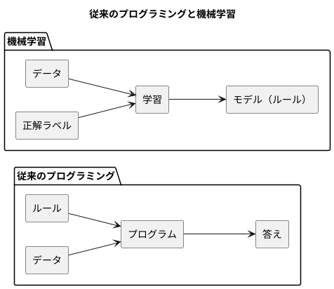
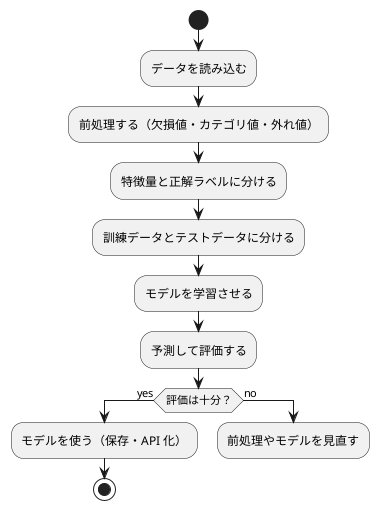

# 第 1 章: 機械学習とはじめてのテスト

## 1.1 はじめに

この章では、機械学習とは何かを確認したうえで、テスト駆動開発（TDD）で最初のプログラムを TypeScript で作ります。題材は「きのこの山派か、たけのこの里派か」を身長・体重・年代から判定する問題です。

この章ではまだ機械学習のアルゴリズムを使いません。人間が考えたルールで判定し、その正解率を測るところまで進みます。「ルールを人間が書く」とはどういうことかを先に体験しておくと、第 3 章で「ルールをデータから学ばせる」ことの意味がはっきりします。

[Python 版の第 1 章](../python/01-machine-learning-and-first-test.md)・[Kotlin 版の第 1 章](../kotlin/01-machine-learning-and-first-test.md) と同じ題材・同じ TODO リストで進めます。TypeScript 版では、構造的型付け・`undefined` の扱い・「型チェックとテストの実行が別の工程である」ことに注目しながら読んでください。

## 1.2 機械学習とは

### ルールを書くか、データに学ばせるか

従来のプログラミングでは、人間が判定のルールをコードとして書きます。

```typescript
export function predictByRule(features: Features): string {
  return features.ageGroup === KINOKO_AGE_GROUP ? "きのこ" : "たけのこ";
}
```

これはこの章で実際に作る関数です。`KINOKO_AGE_GROUP` は `20` で、「20 代ならきのこ派」というルールを表します。このルールは、人間がデータを眺めて立てた仮説にすぎません。データが増えたり傾向が変わったりすれば、人間がルールを書き直す必要があります。

機械学習では、ルールそのものをデータから導きます。人間が用意するのは「特徴量（判定の手がかり）」と「正解ラベル（本当の答え）」の組です。学習アルゴリズムがその組からルールを作り、未知のデータに当てはめて予測します。



### 機械学習のワークフロー

機械学習のプログラムは、おおむね次の流れで作ります。本シリーズの各章は、この流れのどこかを深掘りする構成になっています。



この章で扱うのは「データを読み込む」「特徴量と正解ラベルに分ける」「予測して評価する」の 3 つです。「学習させる」の代わりに、人間が書いたルールで予測します。

### 分類と回帰

| 種類 | 予測するもの | 例 |
|------|------------|-----|
| 分類 | どのグループに属するか（離散値） | きのこ派かたけのこ派か、アヤメの品種 |
| 回帰 | どれくらいの量か（連続値） | 映画の興行収入、住宅価格 |

この章の問題は、2 つのグループのどちらかを当てる分類です。

## 1.3 題材とデータ

### データの入手と配置

本シリーズの学習データは、書籍『スッキリわかる Python による機械学習入門』（インプレス, 2020）の配布データを使います。配布データは書籍購入者のみ利用できるため、リポジトリには含まれていません。[書籍サポートページ](https://sukkiri.jp/books/sukkiri_ml) から `sukkiri-ml-codes.zip` を入手し、リポジトリの `tmp/` に置いてから、リポジトリのルートで次を実行してください。

```bash
npx gulp data:setup
npx gulp data:check
```

`apps/data/sukkiri-ml/` に学習データが配置されます。このディレクトリは `.gitignore` の対象なので、誤ってコミットされることはありません。Python 版・Kotlin 版・TypeScript 版は同じデータを参照します。

### KvsT.csv

この章で使うのは `KvsT.csv` です。19 人分のデータが次の 4 列で記録されています。

| 列 | 意味 | 値 |
|----|------|-----|
| 身長 | 身長（cm） | 整数 |
| 体重 | 体重（kg） | 整数 |
| 年代 | 年代 | 10, 20, 30, 40 のいずれか |
| 派閥 | きのこの山派かたけのこの里派か | `きのこ` または `たけのこ` |

「身長」「体重」「年代」が特徴量、「派閥」が正解ラベルです。列名が日本語であることと、ファイルの先頭に BOM（バイトオーダーマーク）が付いていることに注意してください。

## 1.4 TODO リストの作成

仕様をそのままコードにするには大きすぎるので、まず TODO リストに分解します。

> TODO リスト
>
> 何をテストすべきだろうか——着手する前に、必要になりそうなテストをリストに書き出しておこう。
>
> — テスト駆動開発

**TODO リスト**:

- [ ] CSV を読み込む
  - [ ] BOM 付き CSV の 1 行を人物として読み込む
  - [ ] 複数行を行の順に読み込む
- [ ] 特徴量と正解ラベルに分ける
- [ ] ルールで派閥を判定する
  - [ ] 20 代ならきのこ派と判定する
  - [ ] 20 代以外ならたけのこ派と判定する
- [ ] 正解率を計算する
- [ ] 実データで正解率を表示する

## 1.5 開発環境の準備

### プロジェクトの構成

TypeScript の実装は `apps/node/` にあります。この章を書き終えた時点の構成です。

```text
apps/node/
├── package.json
├── package-lock.json
├── tsconfig.json
├── vitest.config.ts
├── eslint.config.mjs
├── .prettierrc
├── .npmrc
├── .nvmrc
├── src/
│   ├── dataset.ts
│   └── chapter01/
│       ├── kinoko-takenoko.ts
│       └── main.ts
└── test/
    ├── setup.test.ts
    ├── dataset.test.ts
    └── chapter01/
        ├── kinoko-takenoko.test.ts
        └── kvst-data.test.ts
```

Node.js は 22 を使います（`.nvmrc` に `22` と書いています）。依存パッケージは次のコマンドで入れます。

```bash
cd apps/node
npm ci
```

`npm ci` は `package-lock.json` に記録された正確な版をそのまま入れます。`package.json` の `scripts` に、品質チェックのコマンドをまとめています。

```json
{
  "name": "getting-started-ml",
  "version": "0.1.0",
  "description": "機械学習から始めるプログラミング入門（TypeScript 版）",
  "private": true,
  "type": "module",
  "engines": {
    "node": ">=22.12.0"
  },
  "scripts": {
    "test": "vitest run",
    "test:coverage": "vitest run --coverage",
    "lint": "eslint .",
    "format": "prettier --write .",
    "format:check": "prettier --check .",
    "typecheck": "tsc --noEmit",
    "check": "npm run format:check && npm run lint && npm run typecheck && npm test"
  },
  "devDependencies": {
    "@types/node": "22.20.3",
    "@vitest/coverage-v8": "5.0.1",
    "eslint": "10.10.0",
    "eslint-config-prettier": "10.1.8",
    "prettier": "3.9.7",
    "typescript": "6.0.3",
    "typescript-eslint": "8.70.0",
    "vitest": "5.0.1"
  }
}
```

`tsconfig.json` では、型チェックを厳しくする設定と、Node.js で `.ts` を直接実行するための設定をしています。

```json
{
  "compilerOptions": {
    "target": "ES2023",
    "lib": ["ES2023"],
    "module": "nodenext",
    "moduleResolution": "nodenext",
    "types": ["node"],
    "strict": true,
    "noUncheckedIndexedAccess": true,
    "noEmit": true,
    "allowImportingTsExtensions": true,
    "erasableSyntaxOnly": true,
    "verbatimModuleSyntax": true,
    "skipLibCheck": true,
    "forceConsistentCasingInFileNames": true
  },
  "include": ["src/**/*.ts", "test/**/*.ts", "*.config.ts"]
}
```

- `strict` は、`null`・`undefined` の扱いや暗黙の `any` などを厳しく検査する設定をまとめて有効にします
- `noUncheckedIndexedAccess` は、配列の要素を添字で取り出した値を「`undefined` かもしれない」として扱います。CSV の列のように「あるはず」の値が無い場合を、型で見落とさないための設定です（1.6 節で効果を見ます）
- `noEmit` は、JavaScript のファイルを出力せず型チェックだけを行う設定です。実行は Node.js が `.ts` を直接読みます
- `allowImportingTsExtensions`・`erasableSyntaxOnly`・`verbatimModuleSyntax` は、Node.js の **型除去** で実行するための設定です。Node.js 22 は型の注釈を取り除いて `.ts` を実行しますが、型を取り除くだけでは動かない構文（`enum` など）は使えず、import には `.ts` の拡張子を書く必要があります

設定ファイル全体と、ESLint・Prettier の詳細は第 5・6 章で扱います。

### 環境確認テスト

テスティングフレームワークが動くことを、最小のテストで確認します。

```typescript
// test/setup.test.ts
import { describe, expect, it } from "vitest";

describe("環境確認", () => {
  it("テスティングフレームワークが動作する", () => {
    expect(1 + 1).toBe(2);
  });
});
```

```bash
npx vitest run test/setup.test.ts
```

```text
 RUN  v5.0.1 .../apps/node

 Test Files  1 passed (1)
      Tests  1 passed (1)
```

Vitest では、`describe` でテストをまとめ、`it` の第 1 引数に仕様を文で書きます。テストの一覧がそのまま仕様の一覧として読めるので、本シリーズではテスト名を日本語で書きます。

## 1.6 CSV を読み込む

### テストファースト

TODO リストの最初の項目「BOM 付き CSV の 1 行を人物として読み込む」から始めます。実装より先にテストを書きます。

> テストファースト
>
> いつテストを書くべきだろうか——それはテスト対象のコードを書く前だ。
>
> — テスト駆動開発

テストでは学習データそのものは使いません。一時ディレクトリに、架空の値を 1 行だけ書いた CSV を作ります。

```typescript
// test/chapter01/kinoko-takenoko.test.ts
import { mkdtempSync, writeFileSync } from "node:fs";
import { tmpdir } from "node:os";
import { join } from "node:path";
import { describe, expect, it } from "vitest";
import { loadPeople } from "../../src/chapter01/kinoko-takenoko.ts";

describe("loadPeople", () => {
  it("BOM 付き CSV を読み込んで人物の配列を返す", () => {
    const csvFile = join(mkdtempSync(join(tmpdir(), "kvst-")), "kvst.csv");
    writeFileSync(csvFile, "\uFEFF身長,体重,年代,派閥\n165,58,30,きのこ\n");

    const people = loadPeople(csvFile);

    expect(people).toEqual([{ height: 165, weight: 58, ageGroup: 30, faction: "きのこ" }]);
  });
});
```

`"\uFEFF"` は BOM の文字です。配布データと同じ形式のファイルでテストするために、先頭に付けています。`toEqual` は、オブジェクトや配列を中身で比べます。

### Red: 失敗を確認する

```bash
npx vitest run
```

```text
 FAIL  test/chapter01/kinoko-takenoko.test.ts [ test/chapter01/kinoko-takenoko.test.ts ]
Error: Cannot find module '../../src/chapter01/kinoko-takenoko.ts' imported from test/chapter01/kinoko-takenoko.test.ts
 ❯ test/chapter01/kinoko-takenoko.test.ts:5:1
      3| import { join } from "node:path";
      4| import { describe, expect, it } from "vitest";
      5| import { loadPeople } from "../../src/chapter01/kinoko-takenoko.ts";
       | ^
```

実装のファイルが無いので、テストのファイルを読み込む段階で失敗します。

### Green: 仮実装

> 仮実装を経て本実装へ
>
> 失敗するテストを書いてから、最初に行う実装はどのようなものだろうか——ベタ書きの値を返そう。
>
> — テスト駆動開発

```typescript
// src/chapter01/kinoko-takenoko.ts
export interface Person {
  height: number;
  weight: number;
  ageGroup: number;
  faction: string;
}

export function loadPeople(csvFile: string): Person[] {
  return [{ height: 165, weight: 58, ageGroup: 30, faction: "きのこ" }];
}
```

`interface` は、オブジェクトが持つプロパティとその型を表します。TypeScript の型は **構造的** で、`Person` という名前で作ったかどうかではなく、同じ形のプロパティを持つかどうかで互換性を判断します。テストの期待値にオブジェクトリテラルをそのまま書けるのはこのためです。

```text
 Test Files  2 passed (2)
      Tests  2 passed (2)
```

### 三角測量

> 三角測量
>
> テストから最も慎重に一般化を引き出すやり方はどのようなものだろうか——2 つ以上の例があるときだけ、一般化を行うようにしよう。
>
> — テスト駆動開発

```typescript
  it("複数行の CSV を読み込んで行の順に人物の配列を返す", () => {
    const csvFile = join(mkdtempSync(join(tmpdir(), "kvst-")), "kvst.csv");
    writeFileSync(csvFile, "\uFEFF身長,体重,年代,派閥\n161,52,20,きのこ\n183,74,50,たけのこ\n");

    const people = loadPeople(csvFile);

    expect(people).toEqual([
      { height: 161, weight: 52, ageGroup: 20, faction: "きのこ" },
      { height: 183, weight: 74, ageGroup: 50, faction: "たけのこ" },
    ]);
  });
```

```text
 FAIL  test/chapter01/kinoko-takenoko.test.ts > loadPeople > 複数行の CSV を読み込んで行の順に人物の配列を返す
AssertionError: expected [ { height: 165, weight: 58, …(2) } ] to deeply equal [ …(2) ]

- Expected
+ Received

  [
    {
-     "ageGroup": 20,
+     "ageGroup": 30,
      "faction": "きのこ",
-     "height": 161,
-     "weight": 52,
-   },
-   {
-     "ageGroup": 50,
-     "faction": "たけのこ",
-     "height": 183,
-     "weight": 74,
+     "height": 165,
+     "weight": 58,
    },
  ]
```

Vitest は、期待値と実際の値の違いを差分で表示します。

ヘッダー行の列名から値を取り出す形に一般化します。

```typescript
import { readFileSync } from "node:fs";

export interface Person {
  height: number;
  weight: number;
  ageGroup: number;
  faction: string;
}

export function loadPeople(csvFile: string): Person[] {
  const [headerLine = "", ...lines] = readFileSync(csvFile, "utf-8").split("\n");
  const header = headerLine.split(",");
  const column = (values: string[], name: string): string => {
    const value = values[header.indexOf(name)];
    if (value === undefined) {
      throw new Error(`列 ${name} が見つかりません`);
    }
    return value;
  };
  return lines
    .filter((line) => line.trim() !== "")
    .map((line) => {
      const values = line.split(",");
      return {
        height: Number(column(values, "身長")),
        weight: Number(column(values, "体重")),
        ageGroup: Number(column(values, "年代")),
        faction: column(values, "派閥"),
      };
    });
}
```

- `const [headerLine = "", ...lines] = ...` は、配列の分割代入です。先頭をヘッダー行に、残りを `lines` に受け取ります。`= ""` は、空のファイルで先頭が無い場合の既定値です
- `column` は、列名から何列目かを調べて値を取り出す関数です。`header.indexOf(name)` は列名が見つからなければ `-1` を返し、`values[-1]` は `undefined` になります

`column` の中で `undefined` を確かめているのは、`tsconfig.json` の `noUncheckedIndexedAccess` のためです。この設定では、`values[...]` の型は `string` ではなく `string | undefined` になります。確かめずに `return values[header.indexOf(name)];` と書くと、型チェックで次のエラーになります。

```text
src/chapter01/kinoko-takenoko.ts(19,5): error TS2322: Type 'string | undefined' is not assignable to type 'string'.
  Type 'undefined' is not assignable to type 'string'.
```

「列が無い」という異常を黙って `undefined` のまま流さず、例外で知らせる実装にしています。

### Red: BOM の落とし穴

ところが、この実装では 2 つのテストがどちらも失敗しました。

```text
 FAIL  test/chapter01/kinoko-takenoko.test.ts > loadPeople > BOM 付き CSV を読み込んで人物の配列を返す
Error: 列 身長 が見つかりません
 ❯ column src/chapter01/kinoko-takenoko.ts:16:13
     14|     const value = values[header.indexOf(name)];
     15|     if (value === undefined) {
     16|       throw new Error(`列 ${name} が見つかりません`);
       |             ^
     17|     }
     18|     return value;
```

`readFileSync` は BOM を取り除かないので、先頭の列名が `"\uFEFF身長"` のまま残り、`"身長"` という列名で見つけられなかったのです。Python の `csv` モジュールや Kotlin の `readLines` と同じ落とし穴です。BOM 付きのファイルでテストを書いていたおかげで、この問題をテストで捕まえられました。また、列が無いときに例外を送出する実装にしていたので、原因がエラーメッセージにそのまま表れました。

ファイルの先頭の BOM を取り除きます。

```typescript
const BOM = "\uFEFF";
```

```typescript
  const text = readFileSync(csvFile, "utf-8");
  const [headerLine = "", ...lines] = (text.startsWith(BOM) ? text.slice(BOM.length) : text).split("\n");
```

```text
 Test Files  2 passed (2)
      Tests  3 passed (3)
```

**TODO リスト**:

- [x] CSV を読み込む
  - [x] BOM 付き CSV の 1 行を人物として読み込む
  - [x] 複数行を行の順に読み込む
- [ ] 特徴量と正解ラベルに分ける
- [ ] ルールで派閥を判定する
  - [ ] 20 代ならきのこ派と判定する
  - [ ] 20 代以外ならたけのこ派と判定する
- [ ] 正解率を計算する
- [ ] 実データで正解率を表示する

## 1.7 特徴量と正解ラベルに分ける

```typescript
describe("splitFeaturesAndLabels", () => {
  it("人物の配列を特徴量と正解ラベルに分ける", () => {
    const people = [
      { height: 161, weight: 52, ageGroup: 20, faction: "きのこ" },
      { height: 183, weight: 74, ageGroup: 50, faction: "たけのこ" },
    ];

    const { features, labels } = splitFeaturesAndLabels(people);

    expect(features).toEqual([
      { height: 161, weight: 52, ageGroup: 20 },
      { height: 183, weight: 74, ageGroup: 50 },
    ]);
    expect(labels).toEqual(["きのこ", "たけのこ"]);
  });
});
```

Vitest でテストを実行すると、実行時のエラーで失敗します。

```text
 FAIL  test/chapter01/kinoko-takenoko.test.ts > splitFeaturesAndLabels > 人物の配列を特徴量と正解ラベルに分ける
TypeError: splitFeaturesAndLabels is not a function
```

一方、型チェック（`tsc --noEmit`）では、実行する前に次のエラーになります。

```text
test/chapter01/kinoko-takenoko.test.ts(5,22): error TS2305: Module '"../../src/chapter01/kinoko-takenoko.ts"' has no exported member 'splitFeaturesAndLabels'.
```

ここに TypeScript の大事な性質が表れています。**Vitest はテストを実行するとき型を検査しません**。型の注釈を取り除いて JavaScript として実行するだけなので、型の誤りは「関数が無い」といった実行時のエラーとしてしか現れません。型の誤りを型として知らせるのは `tsc` です。本シリーズでは `npm run check` で、テストと型チェックを必ず両方実行します。

やることが明らかな変換なので、明白な実装で進めます。

> 明白な実装
>
> シンプルな操作を実現するにはどうすればよいだろうか——そのまま実装しよう。
>
> — テスト駆動開発

```typescript
export type Features = Omit<Person, "faction">;

export function splitFeaturesAndLabels(people: Person[]): { features: Features[]; labels: string[] } {
  return {
    features: people.map(({ height, weight, ageGroup }) => ({ height, weight, ageGroup })),
    labels: people.map((person) => person.faction),
  };
}
```

- `Omit<Person, "faction">` は、`Person` から `faction` を除いた型を作る **ユーティリティ型** です。特徴量の型を、人物の型から導いて書けます。`Person` に列が増えれば、特徴量の型も自動で増えます
- `({ height, weight, ageGroup }) => ({ height, weight, ageGroup })` は、引数のオブジェクトを分割代入で受け取り、3 つのプロパティだけのオブジェクトを返します
- 戻り値はオブジェクトにし、呼び出し側は `const { features, labels } = ...` と名前で受け取ります

## 1.8 ルールで派閥を判定する

20 代のテストを書き、仮実装で Green にします。

```typescript
describe("predictByRule", () => {
  it("20 代ならきのこ派と判定する", () => {
    expect(predictByRule({ height: 161, weight: 52, ageGroup: 20 })).toBe("きのこ");
  });
});
```

```typescript
export function predictByRule(features: Features): string {
  return "きのこ";
}
```

三角測量として、20 代以外のテストを追加します。

```typescript
  it("20 代以外ならたけのこ派と判定する", () => {
    expect(predictByRule({ height: 183, weight: 74, ageGroup: 50 })).toBe("たけのこ");
  });
```

```text
     × 20 代以外ならたけのこ派と判定する 5ms
AssertionError: expected 'きのこ' to be 'たけのこ' // Object.is equality
Expected: "たけのこ"
Received: "きのこ"
```

`toBe` は `Object.is` で比べます。文字列や数値のような値を比べるときに使い、オブジェクトや配列の中身を比べるときは `toEqual` を使います。

```typescript
/** 「20 代ならきのこ派」というルールの年代 */
const KINOKO_AGE_GROUP = 20;

export function predictByRule(features: Features): string {
  return features.ageGroup === KINOKO_AGE_GROUP ? "きのこ" : "たけのこ";
}
```

- `===` は、型を変換せずに比べる等価演算子です。JavaScript の `==` は `"20" == 20` を真にするので、本シリーズでは `===` だけを使います
- ルールの年代には名前を付けました。Kotlin 版では第 5 章で静的解析ツールの指摘を受けて定数にしましたが、TypeScript 版では最初から名前を付けています

## 1.9 正解率を計算する

すべて正解のテストと仮実装から始めます。

```typescript
describe("accuracy", () => {
  it("すべての予測が正解なら正解率は 1", () => {
    expect(accuracy(["きのこ", "たけのこ"], ["きのこ", "たけのこ"])).toBe(1);
  });
});
```

```typescript
export function accuracy(predictions: string[], labels: string[]): number {
  return 1;
}
```

三角測量として、4 件中 3 件が正解の場合を加えます。

```typescript
  it("4 件中 3 件の予測が正解なら正解率は 0.75", () => {
    const predictions = ["きのこ", "きのこ", "たけのこ", "たけのこ"];
    const labels = ["きのこ", "たけのこ", "たけのこ", "たけのこ"];

    expect(accuracy(predictions, labels)).toBe(0.75);
  });
```

```text
     × 4 件中 3 件の予測が正解なら正解率は 0.75 11ms
AssertionError: expected 1 to be 0.75 // Object.is equality
```

```typescript
export function accuracy(predictions: string[], labels: string[]): number {
  const correct = predictions.filter((prediction, i) => prediction === labels[i]).length;
  return correct / labels.length;
}
```

`filter` のコールバックは、2 つ目の引数に添字を受け取ります。同じ位置の正解ラベルと比べ、一致した予測の数を数えます。TypeScript の `number` 型は整数と小数を区別しない浮動小数点数なので、Kotlin 版のように整数どうしの割り算で小数が切り捨てられることはありません。

件数がずれるのは前処理のバグなので、黙って計算せずに例外で知らせることもテストで約束します。

```typescript
  it("予測と正解ラベルの件数が違えばエラーになる", () => {
    expect(() => accuracy(["きのこ"], ["きのこ", "たけのこ"])).toThrow("予測と正解ラベルの件数が違います");
  });
```

```text
     × 予測と正解ラベルの件数が違えばエラーになる 7ms
AssertionError: expected [Function] to throw an error
```

いまの実装は、件数が違っても `labels[i]` が `undefined` になるだけで、黙って計算を続けてしまいます。

```typescript
export function accuracy(predictions: string[], labels: string[]): number {
  if (predictions.length !== labels.length) {
    throw new Error("予測と正解ラベルの件数が違います");
  }
  const correct = predictions.filter((prediction, i) => prediction === labels[i]).length;
  return correct / labels.length;
}
```

`toThrow` には、例外が起きる処理を関数で包んで渡します。`expect(accuracy(...))` と直接書くと、`expect` に値が渡る前に例外が起きてテストそのものが失敗してしまうためです。

## 1.10 実データで正解率を表示する

### 学習データの場所を解決する

学習データの場所は、環境変数 `ML_DATA_DIR` で指定でき、指定が無ければ `apps/data/sukkiri-ml/` を使います。環境変数を読む関数を引数で受け取るようにすると、テストでは本物の環境変数を書き換えずに済みます。

```typescript
// test/dataset.test.ts
import { describe, expect, it } from "vitest";
import { dataDir } from "../src/dataset.ts";

describe("dataDir", () => {
  it("環境変数 ML_DATA_DIR が指定されていればそのディレクトリを返す", () => {
    const env: Record<string, string> = { ML_DATA_DIR: "/tmp/ml-data" };

    expect(dataDir((name) => env[name])).toBe("/tmp/ml-data");
  });

  it("環境変数が無ければ apps の data ディレクトリを返す", () => {
    expect(dataDir(() => undefined)).toBe("../data/sukkiri-ml");
  });
});
```

```text
 FAIL  test/dataset.test.ts [ test/dataset.test.ts ]
Error: Cannot find module '../src/dataset.ts' imported from test/dataset.test.ts
```

```typescript
// src/dataset.ts
/** 学習データのディレクトリ。環境変数 ML_DATA_DIR が無ければ apps/data/sukkiri-ml を使う。 */
export function dataDir(
  getenv: (name: string) => string | undefined = (name) => process.env[name],
): string {
  return getenv("ML_DATA_DIR") ?? "../data/sukkiri-ml";
}
```

- 引数 `getenv` の型 `(name: string) => string | undefined` は「文字列を受け取り、文字列か `undefined` を返す関数」です。既定値は本物の環境変数を読む関数なので、呼び出し側は `dataDir()` と書けます
- `??` は、左辺が `null` か `undefined` のときだけ右辺を使う演算子です。`||` と違い、空文字列は左辺のまま使います
- 既定の `../data/sukkiri-ml` は、テストや `main` を `apps/node/` で実行することを前提にした相対パスです

### データが無ければスキップする

実データを使うテストは、Vitest の `describe.skipIf` で、データが配置されていなければスキップします。表示のテストも合わせて、先にテストを書きました。

```typescript
// test/chapter01/kvst-data.test.ts
import { existsSync } from "node:fs";
import { join } from "node:path";
import { describe, expect, it } from "vitest";
import {
  accuracy,
  loadPeople,
  predictByRule,
  splitFeaturesAndLabels,
} from "../../src/chapter01/kinoko-takenoko.ts";
import { main } from "../../src/chapter01/main.ts";
import { dataDir } from "../../src/dataset.ts";

const csvFile = join(dataDir(), "KvsT.csv");

describe.skipIf(!existsSync(csvFile))("KvsT.csv の実データ", () => {
  it("実データから 19 人分を読み込む", () => {
    expect(loadPeople(csvFile)).toHaveLength(19);
  });

  it("ルールによる判定の正解率を実データで計算する", () => {
    const { features, labels } = splitFeaturesAndLabels(loadPeople(csvFile));

    const predictions = features.map(predictByRule);

    expect(accuracy(predictions, labels)).toBeCloseTo(14 / 19, 12);
  });

  it("実行するとデータ件数と正解率を表示する", () => {
    const lines: string[] = [];

    main((line) => lines.push(line));

    expect(lines).toEqual([
      "データ件数: 19",
      "ルールによる判定の正解率: 0.7368",
    ]);
  });
});
```

- `describe.skipIf(条件)` は、条件が真ならそのグループのテストをすべてスキップします
- `features.map(predictByRule)` は、関数をそのまま `map` に渡して各特徴量を判定します
- 浮動小数点数の比較には `toBeCloseTo` を使います。2 つ目の引数は、比べる小数点以下の桁数です
- `main` には、1 行を表示する関数を渡せるようにします。テストでは表示する代わりに配列に集め、Kotlin 版で標準出力を差し替えた `captureStdout` のような仕組みを使わずに済ませます

```text
 FAIL  test/chapter01/kvst-data.test.ts [ test/chapter01/kvst-data.test.ts ]
Error: Cannot find module '../../src/chapter01/main.ts' imported from test/chapter01/kvst-data.test.ts
```

### 結果を表示する

```typescript
// src/chapter01/main.ts
import { join } from "node:path";
import { dataDir } from "../dataset.ts";
import { accuracy, loadPeople, predictByRule, splitFeaturesAndLabels } from "./kinoko-takenoko.ts";

export function main(print: (line: string) => void = console.log): void {
  const people = loadPeople(join(dataDir(), "KvsT.csv"));
  const { features, labels } = splitFeaturesAndLabels(people);
  const predictions = features.map(predictByRule);
  print(`データ件数: ${people.length}`);
  print(`ルールによる判定の正解率: ${accuracy(predictions, labels).toFixed(4)}`);
}

// node src/chapter01/main.ts で直接実行したときだけ main を呼ぶ
if (import.meta.filename === process.argv[1]) {
  main();
}
```

- `toFixed(4)` は、小数点以下 4 桁の文字列にします。JavaScript の `toFixed` はロケールに依存しないので、Kotlin 版の `Locale.ROOT` のような指定は要りません
- `import.meta.filename` はこのファイルの絶対パス、`process.argv[1]` は `node` に渡したファイルの絶対パスです。両者が同じときだけ `main` を呼ぶので、テストから `import` したときには実行されません

`main` は Node.js で `.ts` を直接実行します。

```bash
node src/chapter01/main.ts
```

```text
データ件数: 19
ルールによる判定の正解率: 0.7368
```

第 1 章には乱数を使う処理が無いので、Python 版・Kotlin 版と同じ 19 件・0.7368 になります。

データが無い環境では、実データのテスト 3 件がスキップされます。

```bash
ML_DATA_DIR=/nonexistent npx vitest run --reporter=verbose
```

```text
 ↓ test/chapter01/kvst-data.test.ts > KvsT.csv の実データ > 実データから 19 人分を読み込む
 ↓ test/chapter01/kvst-data.test.ts > KvsT.csv の実データ > ルールによる判定の正解率を実データで計算する
 ↓ test/chapter01/kvst-data.test.ts > KvsT.csv の実データ > 実行するとデータ件数と正解率を表示する
...
 Test Files  3 passed | 1 skipped (4)
      Tests  11 passed | 3 skipped (14)
```

**TODO リスト**:

- [x] CSV を読み込む
  - [x] BOM 付き CSV の 1 行を人物として読み込む
  - [x] 複数行を行の順に読み込む
- [x] 特徴量と正解ラベルに分ける
- [x] ルールで派閥を判定する
  - [x] 20 代ならきのこ派と判定する
  - [x] 20 代以外ならたけのこ派と判定する
- [x] 正解率を計算する
- [x] 実データで正解率を表示する

## 1.11 リファクタリング

### テストの重複をまとめる

CSV を読み込むテストでは、ヘッダー行と CSV の書き出しが重複していました。ヘッダーを定数に、書き出しをヘルパー関数にまとめます。判定のテストも、Kotlin 版と同じく「準備・実行・確認」が読み取れる形にそろえました。

```typescript
const HEADER = "\uFEFF身長,体重,年代,派閥\n";

function writeCsv(rows: string): string {
  const csvFile = join(mkdtempSync(join(tmpdir(), "kvst-")), "kvst.csv");
  writeFileSync(csvFile, HEADER + rows);
  return csvFile;
}

describe("loadPeople", () => {
  it("BOM 付き CSV を読み込んで人物の配列を返す", () => {
    const csvFile = writeCsv("165,58,30,きのこ\n");

    const people = loadPeople(csvFile);

    expect(people).toEqual([
      { height: 165, weight: 58, ageGroup: 30, faction: "きのこ" },
    ]);
  });
```

```typescript
describe("predictByRule", () => {
  it("20 代ならきのこ派と判定する", () => {
    const features = { height: 161, weight: 52, ageGroup: 20 };

    expect(predictByRule(features)).toBe("きのこ");
  });
```

### コードスタイルを整える

コードの整形には [Prettier](https://prettier.io/)、静的解析には [ESLint](https://eslint.org/) と typescript-eslint を使います。`npm run format` で整形し、`npm run check` で整形・静的解析・型チェック・テストをまとめて確かめます（設定は第 5 章で扱います）。

```bash
npm run format
npm run check
```

Prettier の既定では 1 行を 80 文字に収めるので、この章で書いた長い行は折り返されました。本文のコードは書いた時点のもの、次の完成コードは整形した後のものです。

```text
> getting-started-ml@0.1.0 check
> npm run format:check && npm run lint && npm run typecheck && npm test

> getting-started-ml@0.1.0 format:check
> prettier --check .

All matched files use Prettier code style!

> getting-started-ml@0.1.0 lint
> eslint .

> getting-started-ml@0.1.0 typecheck
> tsc --noEmit

> getting-started-ml@0.1.0 test
> vitest run

 Test Files  4 passed (4)
      Tests  14 passed (14)
```

<details>
<summary>この章の完成コード（src/chapter01/kinoko-takenoko.ts）</summary>

```typescript
import { readFileSync } from "node:fs";

const BOM = "\uFEFF";

export interface Person {
  height: number;
  weight: number;
  ageGroup: number;
  faction: string;
}

export function loadPeople(csvFile: string): Person[] {
  const text = readFileSync(csvFile, "utf-8");
  const [headerLine = "", ...lines] = (
    text.startsWith(BOM) ? text.slice(BOM.length) : text
  ).split("\n");
  const header = headerLine.split(",");
  const column = (values: string[], name: string): string => {
    const value = values[header.indexOf(name)];
    if (value === undefined) {
      throw new Error(`列 ${name} が見つかりません`);
    }
    return value;
  };
  return lines
    .filter((line) => line.trim() !== "")
    .map((line) => {
      const values = line.split(",");
      return {
        height: Number(column(values, "身長")),
        weight: Number(column(values, "体重")),
        ageGroup: Number(column(values, "年代")),
        faction: column(values, "派閥"),
      };
    });
}

export type Features = Omit<Person, "faction">;

export function splitFeaturesAndLabels(people: Person[]): {
  features: Features[];
  labels: string[];
} {
  return {
    features: people.map(({ height, weight, ageGroup }) => ({
      height,
      weight,
      ageGroup,
    })),
    labels: people.map((person) => person.faction),
  };
}

/** 「20 代ならきのこ派」というルールの年代 */
const KINOKO_AGE_GROUP = 20;

export function predictByRule(features: Features): string {
  return features.ageGroup === KINOKO_AGE_GROUP ? "きのこ" : "たけのこ";
}

export function accuracy(predictions: string[], labels: string[]): number {
  if (predictions.length !== labels.length) {
    throw new Error("予測と正解ラベルの件数が違います");
  }
  const correct = predictions.filter(
    (prediction, i) => prediction === labels[i],
  ).length;
  return correct / labels.length;
}
```

</details>

## 1.12 まとめ

この章では、機械学習のワークフローのうち「読み込む」「特徴量と正解ラベルに分ける」「予測して評価する」を、TypeScript の TDD で実装しました。

1. **型チェックとテストは別の工程** — Vitest は型を検査しないので、型の誤りは `tsc` で見つける。`npm run check` で両方を実行する
2. **構造的型付け** — `interface` と `Omit` で型を表し、テストではオブジェクトリテラルをそのまま期待値にした
3. **`undefined` を見落とさない** — `noUncheckedIndexedAccess` で、配列から取り出した値が無い場合を型で扱い、列が無ければ例外で知らせた
4. **関数を引数で渡す** — 環境変数を読む関数や、1 行を表示する関数を引数にして、テストで差し替えられるようにした
5. **学習データと切り離したテスト** — 架空の値の CSV で単体テストを書き、実データのテストは `describe.skipIf` でスキップした

人間が書いた「20 代ならきのこ派」というルールの正解率は、Python 版・Kotlin 版と同じ 0.7368 でした。次の章では、欠損値を含むアヤメのデータを型付きのレコードに読み込み、シード付きの乱数生成器を作って訓練データとテストデータに分けます。
