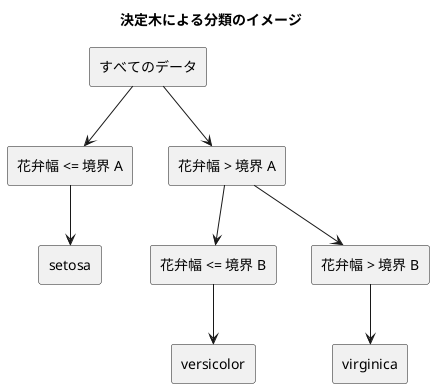

# 第 3 章: 決定木による分類と明白な実装

## 3.1 はじめに

第 1 章では「20 代ならきのこ派」というルールを人間が書き、第 2 章では欠損値を補完したアヤメのデータを訓練データとテストデータに分けました。この章では、「どの特徴量のどこで区切るか」をデータから自動で探すアルゴリズム、**決定木** を自作します。

自作したあとは、JavaScript の機械学習ライブラリ [ml-cart](https://github.com/mljs/decision-tree-cart) に同じデータを学習させ、予測を突き合わせます。[Python 版の第 3 章](../python/03-decision-tree-and-obvious-implementation.md) では scikit-learn と予測がすべて一致し、[Kotlin 版の第 3 章](../kotlin/03-decision-tree-and-obvious-implementation.md) では Tribuo と深さ 3 以上で 1 件ずつ違いました。TypeScript 版では、ml-cart の 3 つの癖をテストで突き止めます。

TypeScript 版では、木を **判別可能なユニオン** で表し、`never` で場合分けの漏れを型チェックに見つけさせる書き方に注目してください。

## 3.2 決定木の仕組み

### データを 2 つに分けることを繰り返す

決定木は、データを「ある特徴量がある値以下か、より大きいか」で 2 つに分けることを繰り返します。分けた先で同じラベルばかりになったら、そこで分けるのをやめて、そのラベルを予測に使います。



### どこで分けるかをジニ不純度で決める

「よい分け方」とは、分けた後のそれぞれのグループで、ラベルがなるべく 1 種類にそろう分け方です。そろい具合を数値にしたものが **ジニ不純度** です。

ジニ不純度 = 1 − Σ（各ラベルの割合）²

| グループのラベル | 割合 | ジニ不純度 |
|----------------|------|-----------|
| setosa ×3 | setosa 1.0 | 1 − 1.0² = 0 |
| setosa ×1、virginica ×1 | 0.5、0.5 | 1 − (0.5² + 0.5²) = 0.5 |
| 3 品種 ×1 ずつ | 1/3 ずつ | 1 − 3 × (1/3)² = 2/3 |

ラベルが 1 種類にそろうと 0、混ざるほど大きくなります。分け方の候補ごとに、分けた後の左右のジニ不純度を件数で重み付けして平均し、最も小さくなる分け方を選びます。

## 3.3 TODO リストの作成

**TODO リスト**:

- [ ] ジニ不純度を計算する
- [ ] 最良の分割を探す
  - [ ] ラベルを完全に分けられる境界を見つける
  - [ ] 複数の特徴量から最良の特徴量と境界を選ぶ
  - [ ] ラベルが 1 種類なら分割しない
- [ ] 決定木を学習して予測する
  - [ ] 1 種類のラベルだけを学習したらそのラベルを予測する
  - [ ] 境界の左右で異なるラベルを予測する
- [ ] 木の深さを制限する
- [ ] 学習した木を読める形で表示する
- [ ] ml-cart の決定木と突き合わせる
  - [ ] 文字列のラベルで学習・予測できるようにする
  - [ ] 予測が一致しない場合は原因を突き止める
- [ ] 実データで深さと正解率の関係を表示する

## 3.4 ジニ不純度を計算する

### 仮実装から始める

ラベルが 1 種類ならジニ不純度は 0 です。

```typescript
// test/chapter03/decision-tree.test.ts
import { describe, expect, it } from "vitest";
import { gini } from "../../src/chapter03/decision-tree.ts";

describe("gini", () => {
  it("1 種類のラベルだけならジニ不純度は 0", () => {
    expect(gini(["Iris-setosa", "Iris-setosa", "Iris-setosa"])).toBe(0);
  });
});
```

```text
 FAIL  test/chapter03/decision-tree.test.ts [ test/chapter03/decision-tree.test.ts ]
Error: Cannot find module '../../src/chapter03/decision-tree.ts' imported from test/chapter03/decision-tree.test.ts
```

```typescript
// src/chapter03/decision-tree.ts
export function gini(labels: readonly string[]): number {
  return 0;
}
```

### 三角測量

```typescript
  it("2 種類のラベルが半分ずつならジニ不純度は 0.5", () => {
    expect(gini(["Iris-setosa", "Iris-virginica"])).toBe(0.5);
  });
```

```text
     × 2 種類のラベルが半分ずつならジニ不純度は 0.5 5ms
AssertionError: expected +0 to be 0.5 // Object.is equality
      Tests  1 failed | 1 passed (2)
```

2 つの例が揃ったので、定義どおりに一般化します。

```typescript
function countLabels(labels: readonly string[]): Map<string, number> {
  const counts = new Map<string, number>();
  for (const label of labels) {
    counts.set(label, (counts.get(label) ?? 0) + 1);
  }
  return counts;
}

export function gini(labels: readonly string[]): number {
  const total = labels.length;
  let sumOfSquares = 0;
  for (const count of countLabels(labels).values()) {
    sumOfSquares += (count / total) ** 2;
  }
  return 1 - sumOfSquares;
}
```

- `Map` は、キーと値の組を **追加した順に** 覚えるデータ構造です。ラベルごとの出現回数を数えるのに使います。Python 版の `Counter`、Kotlin 版の `groupingBy { it }.eachCount()` に当たります
- `counts.get(label) ?? 0` は、まだ数えていないラベル（`get` が `undefined` を返す）なら 0 から数え始めます

3 品種が 1 件ずつの場合も確かめておきます。2/3 は小数で正確に表せないので、`toBeCloseTo` で比べます。

```typescript
  it("3 種類のラベルが同じ数ならジニ不純度は 3 分の 2", () => {
    const labels = ["Iris-setosa", "Iris-versicolor", "Iris-virginica"];

    expect(gini(labels)).toBeCloseTo(2 / 3, 12);
  });
```

```text
      Tests  3 passed (3)
```

## 3.5 最良の分割を探す

### 分割を表す型と仮実装

分割は「どの特徴量を」「どの値（境界）で」分けたか、「分けた後の不純度」の 3 つで表します。花弁幅が 0.2 と 0.7 の間でラベルが入れ替わるデータで、境界は隣り合う値の中点 0.45 にします。

```typescript
describe("bestSplit", () => {
  it("ラベルを完全に分けられる境界を見つける", () => {
    const x = [{ 花弁幅: 0.1 }, { 花弁幅: 0.2 }, { 花弁幅: 0.7 }, { 花弁幅: 0.8 }];
    const t = ["setosa", "setosa", "virginica", "virginica"];

    expect(bestSplit(x, t)).toEqual({ feature: "花弁幅", threshold: 0.45, impurity: 0 });
  });
});
```

```text
     × ラベルを完全に分けられる境界を見つける 4ms
TypeError: bestSplit is not a function
```

```typescript
export interface Split<K extends string> {
  feature: K;
  threshold: number;
  impurity: number;
}

export function bestSplit<K extends string>(
  x: readonly Record<K, number>[],
  t: readonly string[],
): Split<K> | null {
  return { feature: "花弁幅" as K, threshold: 0.45, impurity: 0 };
}
```

- 特徴量は第 2 章と同じく、列名をキーにしたレコード `Record<K, number>` で受け取ります。第 2 章の `prepareIris` が返す補完後の特徴量をそのまま渡せ、補完前の `number | null` のデータは型チェックで拒否されます
- 戻り値の型 `Split<K> | null` は、「分割できないときは `null` を返す」ことを型で表しています

### 三角測量

特徴量が 2 つあり、`花弁長さ` だけが完全に分けられる例と、そもそも分ける必要がない例を加えます。

```typescript
  it("複数の特徴量から不純度が最も小さくなる特徴量と境界を選ぶ", () => {
    const x = [
      { がく片長さ: 0.1, 花弁長さ: 0.2 },
      { がく片長さ: 0.3, 花弁長さ: 0.1 },
      { がく片長さ: 0.2, 花弁長さ: 0.9 },
      { がく片長さ: 0.4, 花弁長さ: 0.6 },
    ];
    const t = ["setosa", "setosa", "virginica", "virginica"];

    expect(bestSplit(x, t)).toEqual({ feature: "花弁長さ", threshold: 0.4, impurity: 0 });
  });

  it("ラベルが 1 種類なら分割しない", () => {
    const x = [{ 花弁幅: 0.1 }, { 花弁幅: 0.2 }, { 花弁幅: 0.7 }];
    const t = ["setosa", "setosa", "setosa"];

    expect(bestSplit(x, t)).toBeNull();
  });
```

```text
     × 複数の特徴量から不純度が最も小さくなる特徴量と境界を選ぶ 10ms
     × ラベルが 1 種類なら分割しない 1ms
AssertionError: expected { feature: '花弁幅', …(2) } to deeply equal { feature: '花弁長さ', …(2) }
- Expected
+ Received
-   "feature": "花弁長さ",
+   "feature": "花弁幅",
-   "threshold": 0.4,
+   "threshold": 0.45,
AssertionError: expected { feature: '花弁幅', …(2) } to be null
      Tests  2 failed | 4 passed (6)
```

特徴量ごとに値を並べ替え、隣り合う値の間をすべて境界の候補にして、分けた後の不純度が最小になる候補を選びます。

```typescript
export function bestSplit<K extends string>(
  x: readonly Record<K, number>[],
  t: readonly string[],
): Split<K> | null {
  if (gini(t) === 0) {
    return null;
  }
  const features = Object.keys(x[0] ?? {}) as K[];
  let best: Split<K> | null = null;
  for (const feature of features) {
    const pairs = x
      .map((row, i) => ({ value: row[feature], label: t[i] as string }))
      .toSorted((a, b) => a.value - b.value);
    for (let i = 1; i < pairs.length; i++) {
      const previous = pairs[i - 1] as { value: number };
      const current = pairs[i] as { value: number };
      if (current.value === previous.value) {
        continue;
      }
      const left = pairs.slice(0, i).map((pair) => pair.label);
      const right = pairs.slice(i).map((pair) => pair.label);
      const impurity =
        (left.length * gini(left) + right.length * gini(right)) / pairs.length;
      if (best === null || impurity < best.impurity) {
        best = {
          feature,
          threshold: (previous.value + current.value) / 2,
          impurity,
        };
      }
    }
  }
  return best;
}
```

- `Object.keys(x[0] ?? {})` で、先頭の行の列名を特徴量の一覧にします。JavaScript のオブジェクトはキーを追加した順に覚えているので、CSV の列の順になります。`Object.keys` は `string[]` を返すので、`as K[]` で列名の型に戻しています
- `toSorted` で値の順に並べ替えた新しい配列を作り、同じ値が続くところには境界を置かずに飛ばします
- `pairs[i - 1] as { value: number }` の `as` は、第 2 章と同じく `noUncheckedIndexedAccess` のためです。`i` は配列の範囲内です
- 不純度が「より小さい」ときだけ更新するので、同じ不純度の候補が複数あれば、先に見つかった（列の順・値の順で前の）候補が残ります

### 浮動小数点数の落とし穴

ところが、今度は仮実装のときに通っていた最初のテストが失敗しました。

```text
     × ラベルを完全に分けられる境界を見つける 11ms
AssertionError: expected { feature: '花弁幅', …(2) } to deeply equal { feature: '花弁幅', …(2) }
- Expected
+ Received
-   "threshold": 0.45,
+   "threshold": 0.44999999999999996,
      Tests  1 failed | 5 passed (6)
```

`(0.2 + 0.7) / 2` は、2 進数の浮動小数点数では 0.45 ちょうどにならず 0.44999999999999996 になります。仮実装はテストと同じ `0.45` というリテラルを返していたので、この差に気づけませんでした。Python 版・Kotlin 版と同じ落とし穴です。

実装は正しいので、テストの比較を変えます。Vitest の `expect.closeTo` は、`toEqual` の期待値の中に置ける **非対称マッチャー** です。オブジェクト全体は `toEqual` で比べたまま、境界の値だけを誤差を許して比べられます。

```typescript
    expect(bestSplit(x, t)).toEqual({
      feature: "花弁幅",
      threshold: expect.closeTo(0.45, 12),
      impurity: 0,
    });
```

Kotlin 版では、data class の比較で誤差を許せないので、フィールドごとに比べる関数を作りました。TypeScript 版では、テスティングフレームワークの機能で同じことを 1 行で書けます。2 つ目のテストも同じ形に書き直しました。

```text
      Tests  6 passed (6)
```

## 3.6 決定木を学習して予測する

### 仮実装

Python 版・Kotlin 版と同じく、`fit` で学習し `predict` で予測する形にします。

```typescript
describe("DecisionTree", () => {
  it("1 種類のラベルだけを学習するとそのラベルを予測する", () => {
    const x = [{ 花弁幅: 0.1 }, { 花弁幅: 0.2 }];
    const t = ["setosa", "setosa"];

    const model = new DecisionTree().fit(x, t);

    expect(model.predict([{ 花弁幅: 0.15 }, { 花弁幅: 0.9 }])).toEqual(["setosa", "setosa"]);
  });
});
```

```text
     × 1 種類のラベルだけを学習するとそのラベルを予測する 4ms
TypeError: DecisionTree is not a constructor
```

```typescript
export class DecisionTree<K extends string> {
  private label = "";

  fit(x: readonly Record<K, number>[], t: readonly string[]): this {
    this.label = t[0] ?? "";
    return this;
  }

  predict(x: readonly Record<K, number>[]): string[] {
    return x.map(() => this.label);
  }
}
```

`fit` の戻り値の型 `this` は、「このインスタンス自身を返す」ことを表します。`new DecisionTree().fit(x, t)` のように、作成と学習を 1 行で書けます。

### 三角測量

```typescript
  it("境界の左右で異なるラベルを予測する", () => {
    const x = [{ 花弁幅: 0.1 }, { 花弁幅: 0.2 }, { 花弁幅: 0.7 }, { 花弁幅: 0.8 }];
    const t = ["setosa", "setosa", "virginica", "virginica"];

    const model = new DecisionTree().fit(x, t);

    expect(model.predict([{ 花弁幅: 0.15 }, { 花弁幅: 0.75 }])).toEqual(["setosa", "virginica"]);
  });
```

```text
     × 境界の左右で異なるラベルを予測する 6ms
AssertionError: expected [ 'setosa', 'setosa' ] to deeply equal [ 'setosa', 'virginica' ]
      Tests  1 failed | 7 passed (8)
```

### 木を判別可能なユニオンで表す

木は「葉」と「節」の 2 種類のデータでできています。

- **葉**: 予測するラベルを持つ
- **節**: 分割と、左右の子（葉か節）を持つ

```typescript
export type Tree<K extends string> =
  | { kind: "leaf"; label: string }
  | { kind: "node"; split: Split<K>; left: Tree<K>; right: Tree<K> };
```

2 つの型をユニオン型（`|`）で並べ、どちらにも `kind` という共通のプロパティを持たせています。`kind` の値（`"leaf"` か `"node"`）で、どちらの型かを見分けられるユニオンを **判別可能なユニオン** と呼びます。Python 版の `Leaf | Node`、Kotlin 版の `sealed interface` に当たります。

木を作る処理と予測する処理は、どちらも **再帰** で書けます。

```typescript
function majority(labels: readonly string[]): string {
  let best = "";
  let bestCount = 0;
  for (const [label, count] of countLabels(labels)) {
    if (count > bestCount) {
      best = label;
      bestCount = count;
    }
  }
  return best;
}

export function buildTree<K extends string>(
  x: readonly Record<K, number>[],
  t: readonly string[],
): Tree<K> {
  const split = bestSplit(x, t);
  if (split === null) {
    return { kind: "leaf", label: majority(t) };
  }
  const goesLeft = x.map((row) => row[split.feature] <= split.threshold);
  const left = goesLeft.flatMap((isLeft, i) => (isLeft ? [i] : []));
  const right = goesLeft.flatMap((isLeft, i) => (isLeft ? [] : [i]));
  return {
    kind: "node",
    split,
    left: buildTree(pick(x, left), pick(t, left)),
    right: buildTree(pick(x, right), pick(t, right)),
  };
}

function pick<T>(items: readonly T[], positions: readonly number[]): T[] {
  return positions.map((i) => items[i] as T);
}

export function predictOne<K extends string>(
  tree: Tree<K>,
  row: Record<K, number>,
): string {
  switch (tree.kind) {
    case "leaf":
      return tree.label;
    case "node":
      return row[tree.split.feature] <= tree.split.threshold
        ? predictOne(tree.left, row)
        : predictOne(tree.right, row);
    default: {
      const unreachable: never = tree;
      return unreachable;
    }
  }
}

export class DecisionTree<K extends string> {
  tree: Tree<K> | null = null;

  fit(x: readonly Record<K, number>[], t: readonly string[]): this {
    this.tree = buildTree(x, t);
    return this;
  }

  predict(x: readonly Record<K, number>[]): string[] {
    const tree = this.tree;
    if (tree === null) {
      throw new Error("fit で学習してから predict を呼んでください");
    }
    return x.map((row) => predictOne(tree, row));
  }
}
```

- `majority` は、出現回数が最も多いラベルを返します。回数が「より多い」ときだけ更新するので、同数なら `Map` に先に追加された（そのデータの中で先に現れた）ラベルが残ります。この性質は 3.9 節で重要になります
- `flatMap((isLeft, i) => (isLeft ? [i] : []))` は、左に進む行の位置だけを集めます。`flatMap` は、コールバックが返した配列をつなげて 1 つの配列にします
- `switch (tree.kind)` の `case "leaf":` の中では、TypeScript が `tree` を葉の型に絞り込むので、`tree.label` と書けます。`case "node":` の中では節の型になり、`tree.split` や `tree.left` を使えます
- `predict` で `this.tree` をいったん `const tree` に受けているのは、`null` を確かめた結果を `map` のコールバックの中でも使うためです。プロパティのままでは、コールバックが呼ばれるまでに書き換わる可能性があるとして、絞り込みが引き継がれません

### never で場合分けの漏れを見つける

`predictOne` の `default` に書いた `const unreachable: never = tree;` は、「ここには到達しない」ことを型で表しています。`"leaf"` と `"node"` の `case` を通ったあとの `tree` は、TypeScript の型の上では何も残っていない型 `never` になるので、代入が型チェックを通ります。

この書き方の価値は、木の種類を増やしたときに分かります。試しに `Tree` に 3 つ目の種類 `{ kind: "unknown" }` を足すと、型チェックは次の誤りを報告しました。

```text
src/chapter03/decision-tree.ts(113,13): error TS2322: Type '{ kind: "unknown"; }' is not assignable to type 'never'.
src/chapter03/decision-tree.ts(149,4): error TS2366: Function lacks ending return statement and return type does not include 'undefined'.
```

1 行目は `predictOne` の `never` への代入が、2 行目は 3.8 節で作る `formatTree` が、新しい種類を扱っていないことを知らせています。`formatTree` には `default` を書いていませんが、戻り値の型が `string` なので、場合分けの漏れで「値を返さずに終わる道」ができると型チェックが気づきます。Kotlin 版の `sealed interface` と `when` の網羅性の検査を、TypeScript では型の絞り込みで実現しています。

```text
      Tests  8 passed (8)
```

## 3.7 木の深さを制限する

分割を止めずに続けると、訓練データを 1 件ずつ分け切るまで木が深くなります。訓練データを丸暗記した状態（**過学習**）になり、未知のデータで当たらなくなります。そこで深さの上限 `maxDepth` を指定できるようにします。

TypeScript には Kotlin の名前付き引数がないので、設定はオプションのオブジェクト `{ maxDepth: 1 }` で渡します。

```typescript
function threeSpecies(): { x: { 花弁幅: number }[]; t: string[] } {
  const x = [0.1, 0.2, 0.3, 0.5, 0.6, 0.9].map((value) => ({ 花弁幅: value }));
  const t = ["setosa", "setosa", "setosa", "versicolor", "versicolor", "virginica"];
  return { x, t };
}

describe("DecisionTree の深さの制限", () => {
  it("深さを制限しなければすべての訓練データを分け切る", () => {
    const { x, t } = threeSpecies();

    const model = new DecisionTree().fit(x, t);

    expect(model.predict(x)).toEqual(t);
  });

  it("深さを 1 に制限すると境界の先は多数派のラベルを予測する", () => {
    const { x, t } = threeSpecies();

    const model = new DecisionTree({ maxDepth: 1 }).fit(x, t);

    expect(model.predict([{ 花弁幅: 0.2 }, { 花弁幅: 0.95 }])).toEqual(["setosa", "versicolor"]);
  });

  it("学習する前に予測するとエラーになる", () => {
    expect(() => new DecisionTree().predict([{ 花弁幅: 0.1 }])).toThrow(
      "fit で学習してから predict を呼んでください",
    );
  });
});
```

Vitest では、次のように失敗しました。

```text
     × 深さを 1 に制限すると境界の先は多数派のラベルを予測する 12ms
AssertionError: expected [ 'setosa', 'virginica' ] to deeply equal [ 'setosa', 'versicolor' ]
      Tests  1 failed | 10 passed (11)
```

JavaScript では、コンストラクターに余分な引数を渡しても黙って無視されます。そのため Vitest では「深さが制限されていない」という予測の違いとして現れました。型チェックは、引数そのものの誤りとして知らせます。

```text
test/chapter03/decision-tree.test.ts(94,36): error TS2554: Expected 0 arguments, but got 1.
```

残りの深さを引数で受け取り、子を作るたびに 1 減らします。0 になったら分割せずに葉にします。`undefined` は「制限なし」を表します。

```typescript
export function buildTree<K extends string>(
  x: readonly Record<K, number>[],
  t: readonly string[],
  maxDepth: number | undefined,
): Tree<K> {
  const split = maxDepth === 0 ? null : bestSplit(x, t);
  if (split === null) {
    return { kind: "leaf", label: majority(t) };
  }
  const goesLeft = x.map((row) => row[split.feature] <= split.threshold);
  const left = goesLeft.flatMap((isLeft, i) => (isLeft ? [i] : []));
  const right = goesLeft.flatMap((isLeft, i) => (isLeft ? [] : [i]));
  const childDepth = maxDepth === undefined ? undefined : maxDepth - 1;
  return {
    kind: "node",
    split,
    left: buildTree(pick(x, left), pick(t, left), childDepth),
    right: buildTree(pick(x, right), pick(t, right), childDepth),
  };
}
```

```typescript
export interface DecisionTreeOptions {
  /** 木の深さの上限。省略すると制限しない */
  maxDepth?: number;
}

export class DecisionTree<K extends string> {
  readonly maxDepth: number | undefined;
  tree: Tree<K> | null = null;

  constructor(options: DecisionTreeOptions = {}) {
    this.maxDepth = options.maxDepth;
  }

  fit(x: readonly Record<K, number>[], t: readonly string[]): this {
    this.tree = buildTree(x, t, this.maxDepth);
    return this;
  }
```

- `maxDepth?: number` の `?` は、省略できるプロパティを表します。省略したときの値は `undefined` です
- `constructor(options: DecisionTreeOptions = {})` は、引数を省略したときに空のオブジェクトを使います

TypeScript には、コンストラクターの引数に `private readonly` を付けてプロパティの宣言を兼ねる書き方（パラメータープロパティ）もあります。しかし本シリーズでは `tsconfig.json` の `erasableSyntaxOnly` を有効にしているので、この書き方は使えません。試すと次の誤りになります。

```text
src/chapter03/decision-tree.ts(126,15): error TS1294: This syntax is not allowed when 'erasableSyntaxOnly' is enabled.
```

パラメータープロパティは、型の注釈を取り除くだけでなく「プロパティに代入する処理」を生み出す構文なので、Node.js の型除去では実行できないためです。

```text
      Tests  11 passed (11)
```

## 3.8 学習した木を表示する

決定木の長所は、学習した結果を人が読めることです。木をテキストで表示する `formatTree` を作ります。

```typescript
describe("formatTree", () => {
  it("葉だけの木はラベルを表示する", () => {
    expect(formatTree({ kind: "leaf", label: "setosa" })).toBe("setosa");
  });

  it("節は条件ごとに字下げして表示する", () => {
    const tree: Tree<"花弁幅" | "花弁長さ"> = {
      kind: "node",
      split: { feature: "花弁幅", threshold: 0.4, impurity: 0 },
      left: { kind: "leaf", label: "setosa" },
      right: {
        kind: "node",
        split: { feature: "花弁長さ", threshold: 0.75, impurity: 0 },
        left: { kind: "leaf", label: "versicolor" },
        right: { kind: "leaf", label: "virginica" },
      },
    };

    expect(formatTree(tree)).toBe(
      [
        "花弁幅 <= 0.4000",
        "  setosa",
        "花弁幅 > 0.4000",
        "  花弁長さ <= 0.7500",
        "    versicolor",
        "  花弁長さ > 0.7500",
        "    virginica",
      ].join("\n"),
    );
  });
});
```

テストの木は、オブジェクトリテラルを直接組み立てて作っています。型の注釈 `Tree<"花弁幅" | "花弁長さ">` を付けておくと、`kind` の綴りの誤りや、節に `split` を書き忘れた誤りを型チェックが知らせます。期待する表示は、行の配列を `join("\n")` でつないで見た目どおりに書きました。

```text
     × 葉だけの木はラベルを表示する 3ms
     × 節は条件ごとに字下げして表示する 1ms
TypeError: formatTree is not a function
```

```typescript
export function formatTree<K extends string>(tree: Tree<K>, indent = ""): string {
  switch (tree.kind) {
    case "leaf":
      return `${indent}${tree.label}`;
    case "node": {
      const { feature, threshold } = tree.split;
      return [
        `${indent}${feature} <= ${threshold.toFixed(4)}`,
        formatTree(tree.left, `${indent}  `),
        `${indent}${feature} > ${threshold.toFixed(4)}`,
        formatTree(tree.right, `${indent}  `),
      ].join("\n");
    }
  }
}
```

`toFixed(4)` は第 1 章と同じく、ロケールに依存せず小数点以下 4 桁にします。

```text
      Tests  13 passed (13)
```

## 3.9 ml-cart の決定木と突き合わせる

### ml-cart を導入する

[ml-cart](https://github.com/mljs/decision-tree-cart) 2.1.1 を追加します。

```bash
npm install ml-cart@2.1.1
```

ml-cart は型定義を同梱していないので、そのまま読み込むと `strict` の型チェックで「型定義が見つからない」という誤りになります。本リポジトリで使う範囲だけを、型宣言のファイルに書きました。

```typescript
// src/types/ml-cart.d.ts
// ml-cart は型定義を同梱しないので、本リポジトリで使う範囲だけを宣言する
declare module "ml-cart" {
  export interface DecisionTreeClassifierOptions {
    /** 分割の基準。ml-cart 2.1.1 は "gini" だけ */
    gainFunction?: "gini";
    /** 境界の決め方。ml-cart 2.1.1 は隣り合う値の平均（"mean"）だけ */
    splitFunction?: "mean";
    /** 件数がこの値以下になったら分割せずに葉にする（既定値 3） */
    minNumSamples?: number;
    maxDepth?: number;
    /** 利得がこの値以下なら分割しない（既定値 0.01） */
    gainThreshold?: number;
  }

  export class DecisionTreeClassifier {
    constructor(options?: DecisionTreeClassifierOptions);
    /** 正解ラベルは 0 始まりの整数 */
    train(trainingSet: number[][], trainingLabels: number[]): void;
    predict(toPredict: number[][]): number[];
  }
}
```

`declare module "ml-cart"` は、「`ml-cart` というモジュールはこういう型を持つ」という宣言です。中身の実装はありません。宣言が実物と食い違っていても型チェックでは分からないので、宣言した内容はパッケージのソースで確かめ、使い方は次の学習用テストで確かめます。`gainThreshold` の既定値は、後で説明するとおりテストで見つけたものです。

### 文字列のラベルで学習・予測するアダプター

ml-cart の `DecisionTreeClassifier` は、特徴量を数値の 2 次元配列、正解ラベルを 0 始まりの整数で受け取ります（文字列を渡すと `RangeError` になることを [ADR 003](../../../adr/003-typescript-ml-libraries.md) の調査で確かめています）。自作の決定木と同じ形（特徴量のレコードと文字列のラベル）で使えるように、変換する **アダプター** を作ります。

```typescript
// test/chapter03/ml-cart-adapter.test.ts
describe("trainMlCart", () => {
  it("文字列の正解ラベルで学習し、文字列のラベルで予測する", () => {
    const x = [0.1, 0.2, 0.3, 0.5, 0.6, 0.9].map((value) => ({ 花弁幅: value }));
    const t = ["setosa", "setosa", "setosa", "versicolor", "versicolor", "virginica"];

    const predict = trainMlCart(x, t, {});

    expect(predict([{ 花弁幅: 0.2 }, { 花弁幅: 0.55 }, { 花弁幅: 0.95 }])).toEqual([
      "setosa",
      "versicolor",
      "virginica",
    ]);
  });
});
```

```text
 FAIL  test/chapter03/ml-cart-adapter.test.ts [ test/chapter03/ml-cart-adapter.test.ts ]
Error: Cannot find module '../../src/chapter03/ml-cart-adapter.ts' imported from test/chapter03/ml-cart-adapter.test.ts
```

```typescript
// src/chapter03/ml-cart-adapter.ts
import { DecisionTreeClassifier } from "ml-cart";

export interface MlCartOptions {
  maxDepth?: number;
}

/**
 * ml-cart の決定木を、自作の決定木と同じ形（特徴量のレコードと文字列のラベル）で学習し、予測する関数を返す。
 * 条件をそろえるため、葉にする件数は 1、分割に必要な利得の下限は 0 にする。
 */
export function trainMlCart<K extends string>(
  x: readonly Record<K, number>[],
  t: readonly string[],
  options: MlCartOptions,
): (rows: readonly Record<K, number>[]) => string[] {
  const features = Object.keys(x[0] ?? {}) as K[];
  const toMatrix = (rows: readonly Record<K, number>[]) =>
    rows.map((row) => features.map((feature) => row[feature]));
  const classes = [...new Set(t)];
  const classifier = new DecisionTreeClassifier({
    gainFunction: "gini",
    minNumSamples: 1,
    gainThreshold: 0,
    maxDepth: options.maxDepth ?? Infinity,
  });
  classifier.train(
    toMatrix(x),
    t.map((label) => classes.indexOf(label)),
  );
  return (rows) =>
    classifier.predict(toMatrix(rows)).map((index) => classes[index] as string);
}
```

- `[...new Set(t)]` は、ラベルの重複を除いた配列です。`Set` も追加した順を覚えているので、訓練データで先に現れたラベルから 0、1、2 と番号が付きます
- 学習した結果は、予測する **関数** として返します。返した関数は `features`・`classes`・`classifier` を覚えているクロージャなので、呼び出し側はラベルの番号付けを意識せずに済みます
- `minNumSamples: 1` は、件数が 1 以下になるまで分割を続ける設定で、1 件になるまで分け切る自作の決定木に合わせています

### 予測が一致しない原因を突き止める

自作の決定木と同じ予測になることを確かめるテストを書いたところ、失敗しました。

```text
AssertionError: expected [ 'setosa', 'versicolor', …(3) ] to deeply equal [ 'setosa', 'setosa', …(3) ]
```

一致を前提にしてテストを直すのではなく、どこが違うのかを ml-cart のソースと、架空の小さなデータで調べました。見つかった違いは 3 つです。

**1. 境界ちょうどの値の左右**: テストで予測させた 0.4 と 0.75 は、訓練データの隣り合う値の中点、つまり境界ちょうどの値でした。自作の決定木は `値 <= 境界` を左に進めますが、ml-cart は `値 < 境界` を左に進めるので、境界ちょうどの値は右に進みます。

**2. 多数決が同数のときの選び方**: 同じ値の 2 件でラベルが違うと、分割できずにラベルが 1 件ずつの葉になります。自作の `majority` は葉の中で先に現れたラベルを選び、ml-cart は番号の小さいラベル、つまりアダプターの番号付けで **訓練データ全体で** 先に現れたラベルを選びます。

**3. 隠れた既定値の利得の下限**: ml-cart の `DecisionTreeClassifier` の既定の設定には、README に載っていない `gainThreshold: 0.01` が含まれていました。分割による不純度の減少（利得）が 0.01 以下なら分割しません。自作の決定木にはこの条件が無いので、アダプターでは `gainThreshold: 0` を指定しています。

それぞれを学習用テストに残し、最初のテストは境界ちょうどの値を避けた形に直しました。

```typescript
  it("境界ちょうどの値が無ければ自作の決定木と同じ予測をする", () => {
    const x = [0.1, 0.2, 0.3, 0.5, 0.6, 0.9].map((value) => ({ 花弁幅: value }));
    const t = ["setosa", "setosa", "setosa", "versicolor", "versicolor", "virginica"];
    const newX = [0.2, 0.45, 0.55, 0.8, 0.95].map((value) => ({ 花弁幅: value }));

    const predict = trainMlCart(x, t, {});

    expect(predict(newX)).toEqual(new DecisionTree().fit(x, t).predict(newX));
  });

  it("境界ちょうどの値を自作の決定木は左に、ml-cart は右に進める", () => {
    const x = [0.1, 0.2, 0.3, 0.5, 0.6, 0.9].map((value) => ({ 花弁幅: value }));
    const t = ["setosa", "setosa", "setosa", "versicolor", "versicolor", "virginica"];
    const onBoundary = [0.4, 0.75].map((value) => ({ 花弁幅: value }));

    const predict = trainMlCart(x, t, {});

    expect(new DecisionTree().fit(x, t).predict(onBoundary)).toEqual(["setosa", "versicolor"]);
    expect(predict(onBoundary)).toEqual(["versicolor", "virginica"]);
  });

  it("葉の多数決が同数のとき、自作は葉の中で先に現れたラベル、ml-cart は訓練データ全体で先に現れたラベルを選ぶ", () => {
    const x = [0.9, 0.1, 0.1].map((value) => ({ 花弁幅: value }));
    const t = ["b", "a", "b"];

    const predict = trainMlCart(x, t, {});

    expect(new DecisionTree().fit(x, t).predict([{ 花弁幅: 0.1 }])).toEqual(["a"]);
    expect(predict([{ 花弁幅: 0.1 }])).toEqual(["b"]);
  });
});

describe("ml-cart の既定の設定", () => {
  it("利得が 0.01 以下の分割はしない", () => {
    const x = Array.from({ length: 100 }, (_, i) => [i]);
    const y = x.map(([i]) => (i === 50 ? 1 : 0));

    const classifier = new DecisionTreeClassifier({ minNumSamples: 1 });
    classifier.train(x, y);

    expect(classifier.predict([[50]])).toEqual([0]);
  });

  it("アダプターは利得の下限を 0 にして、利得が小さい分割もする", () => {
    const x = Array.from({ length: 100 }, (_, i) => ({ f: i }));
    const t = x.map(({ f }) => (f === 50 ? "b" : "a"));

    const predict = trainMlCart(x, t, {});

    expect(predict([{ f: 50 }])).toEqual(["b"]);
  });
});
```

- 多数決のテストでは、全体では `b` が先に現れ（0.9 の行）、0.1 の 2 件の葉の中では `a` が先に現れるデータにしています
- 利得の下限のテストでは、100 件のうち 1 件だけラベルが違うデータを使います。その 1 件を切り出す最初の分割の利得は 0.01 よりずっと小さいので、既定の設定の ml-cart は分割せず、多数派の `0` を予測します

どれも「どちらを選んでも不純度は同じ」「どこで止めるか」という実装の方針の違いで、どちらかが間違っているわけではありません。ライブラリの README に書かれていない振る舞いは、テストを書いて初めて分かります。

### 実データで確かめる

第 2 章の `prepareIris` で前処理した iris で、深さごとに自作の決定木と ml-cart の予測を比べます。

```typescript
// test/chapter03/iris-data.test.ts
import { existsSync } from "node:fs";
import { join } from "node:path";
import { beforeAll, describe, expect, it } from "vitest";
import { accuracy } from "../../src/chapter01/kinoko-takenoko.ts";
import {
  type Feature,
  type TrainTestSplit,
  prepareIris,
} from "../../src/chapter02/iris-preprocessing.ts";
import { DecisionTree } from "../../src/chapter03/decision-tree.ts";
import { main } from "../../src/chapter03/main.ts";
import { trainMlCart } from "../../src/chapter03/ml-cart-adapter.ts";
import { dataDir } from "../../src/dataset.ts";

const csvFile = join(dataDir(), "iris.csv");

function countDifferences(
  split: TrainTestSplit<Record<Feature, number>, string>,
  maxDepth: number | undefined,
): number {
  const mine = new DecisionTree({ maxDepth })
    .fit(split.xTrain, split.tTrain)
    .predict(split.xTest);
  const library = trainMlCart(split.xTrain, split.tTrain, { maxDepth })(
    split.xTest,
  );
  return mine.filter((label, i) => label !== library[i]).length;
}

describe.skipIf(!existsSync(csvFile))("iris.csv の実データ", () => {
  let split: TrainTestSplit<Record<Feature, number>, string>;

  beforeAll(() => {
    split = prepareIris(csvFile, 0.3, 0);
  });

  it("深さ 2 の決定木はテストデータの 45 件中 44 件を正しく分類する", () => {
    const predictions = new DecisionTree({ maxDepth: 2 })
      .fit(split.xTrain, split.tTrain)
      .predict(split.xTest);

    expect(accuracy(predictions, split.tTest)).toBeCloseTo(44 / 45, 12);
  });

  it.each([1, 2, 4, 5, undefined])(
    "深さ %s では ml-cart とテストデータの予測が一致する",
    (maxDepth) => {
      expect(countDifferences(split, maxDepth)).toBe(0);
    },
  );

  it("深さ 3 では多数決が同数の葉に落ちる 1 件だけ ml-cart と予測が違う", () => {
    expect(countDifferences(split, 3)).toBe(1);
  });
```

- `it.each([...])` は、配列の値ごとに同じテストを繰り返す **パラメータ化テスト** です。テスト名の `%s` に値が入ります。Kotlin 版では `for` で回しましたが、Vitest ではテストが値ごとに別々に表示されます
- 正解率の計算には、第 1 章の `accuracy` をそのまま再利用しています

実データでは、深さ 3 だけ 1 件の予測が違いました。その行が落ちる自作の決定木の葉には、訓練データの versicolor と virginica が 1 件ずつ入っていて、多数決が同数でした。自作は葉の中で先に現れた versicolor を、ml-cart は訓練データ全体で先に現れた virginica を選んでいます。深さ 4 以上では、その葉がさらに分割されるので、予測が一致します。テストデータには、制限なしの木のある節の境界と同じ値を持つ行もありましたが、その節まで進む行は無かったので、境界ちょうどの値の左右の違いは予測に表れませんでした。

### データが無い環境で見つけた失敗

実データのテストを最初に書いたときは、`describe` の本体で `const split = prepareIris(csvFile, 0.3, 0);` と読み込んでいました。データのある環境ではすべて通りましたが、データの無い環境で実行すると、テストのファイルごと失敗しました。

```text
 FAIL  test/chapter03/iris-data.test.ts [ test/chapter03/iris-data.test.ts ]
Error: ENOENT: no such file or directory, open '.../nonexistent/iris.csv'
 ❯ loadIris src/chapter02/iris-preprocessing.ts:17:25
```

`describe.skipIf` はテストの **実行** を飛ばしますが、`describe` のコールバックそのものは、テストを集める段階で実行されます。そのため、スキップされるはずのグループの中でファイルを読み込み、ファイルが無いという例外が起きていました。読み込みを `beforeAll` の中に移すと、スキップされたグループでは呼ばれなくなります。第 1 章・第 2 章の実データのテストは、読み込みを `it` の中で行っていたので、この問題は起きていませんでした。

## 3.10 実データで深さと正解率を表示する

`main` の表示のテストも先に書きました（`iris-data.test.ts` の最後のテスト）。

```typescript
  it("実行すると深さごとの正解率と深さ 2 の決定木を表示する", () => {
    const lines: string[] = [];

    main((line) => lines.push(line));

    expect(lines).toEqual([
      "深さ\t訓練データ\tテストデータ",
      "1\t0.6952\t0.6000",
      "2\t0.9238\t0.9778",
      "3\t0.9429\t0.9556",
      "4\t0.9524\t0.9556",
      "5\t0.9810\t0.9111",
      "制限なし\t1.0000\t0.9333",
      "",
      "深さ 2 の決定木:",
      "花弁幅 <= 0.2750",
      "  Iris-setosa",
      "花弁幅 > 0.2750",
      "  花弁幅 <= 0.6900",
      "    Iris-versicolor",
      "  花弁幅 > 0.6900",
      "    Iris-virginica",
    ]);
  });
});
```

```text
 FAIL  test/chapter03/iris-data.test.ts [ test/chapter03/iris-data.test.ts ]
Error: Cannot find module '../../src/chapter03/main.ts' imported from test/chapter03/iris-data.test.ts
```

```typescript
// src/chapter03/main.ts
import { join } from "node:path";
import { accuracy } from "../chapter01/kinoko-takenoko.ts";
import { prepareIris } from "../chapter02/iris-preprocessing.ts";
import { dataDir } from "../dataset.ts";
import { DecisionTree, formatTree } from "./decision-tree.ts";

const TEST_SIZE = 0.3;
const SEED = 0;
const MAX_DEPTHS = [1, 2, 3, 4, 5, undefined];
const TREE_DEPTH_TO_SHOW = 2;

export function main(print: (line: string) => void = console.log): void {
  const split = prepareIris(join(dataDir(), "iris.csv"), TEST_SIZE, SEED);
  print("深さ\t訓練データ\tテストデータ");
  for (const maxDepth of MAX_DEPTHS) {
    const model = new DecisionTree({ maxDepth }).fit(
      split.xTrain,
      split.tTrain,
    );
    const train = accuracy(model.predict(split.xTrain), split.tTrain);
    const test = accuracy(model.predict(split.xTest), split.tTest);
    print(`${maxDepth ?? "制限なし"}\t${train.toFixed(4)}\t${test.toFixed(4)}`);
  }

  const shallow = new DecisionTree({ maxDepth: TREE_DEPTH_TO_SHOW }).fit(
    split.xTrain,
    split.tTrain,
  );
  if (shallow.tree !== null) {
    print("");
    print(`深さ ${TREE_DEPTH_TO_SHOW} の決定木:`);
    for (const line of formatTree(shallow.tree).split("\n")) {
      print(line);
    }
  }
}

// node src/chapter03/main.ts で直接実行したときだけ main を呼ぶ
if (import.meta.filename === process.argv[1]) {
  main();
}
```

- `new DecisionTree({ maxDepth })` は `{ maxDepth: maxDepth }` の省略形です。`maxDepth` が `undefined` のときは制限なしになります
- `${maxDepth ?? "制限なし"}` は、深さが `undefined` なら「制限なし」を表示します
- 最初は `print(formatTree(shallow.tree))` と 1 回で表示していましたが、`formatTree` は複数行の文字列を返すので、表示のテストで「1 行ずつ `print` を呼ぶ」期待と食い違いました。行ごとに分けて表示するように直しています

```bash
node src/chapter03/main.ts
```

```text
深さ	訓練データ	テストデータ
1	0.6952	0.6000
2	0.9238	0.9778
3	0.9429	0.9556
4	0.9524	0.9556
5	0.9810	0.9111
制限なし	1.0000	0.9333

深さ 2 の決定木:
花弁幅 <= 0.2750
  Iris-setosa
花弁幅 > 0.2750
  花弁幅 <= 0.6900
    Iris-versicolor
  花弁幅 > 0.6900
    Iris-virginica
```

この結果から 2 つのことが読み取れます。

- **木が深くなるほど訓練データの正解率は上がり、制限なしでは 1.0 になる**。訓練データを分け切っているからです
- **テストデータの正解率は深さ 2 の 0.9778 が最も高く、それより深くすると下がる**。深い木は訓練データの細かな違いまで覚えてしまい、未知のデータでは外れやすくなります。これが過学習です

深さ 2 の木は「花弁幅が 0.275 以下なら setosa、0.69 以下なら versicolor、それより大きければ virginica」と読めます。境界の値は Kotlin 版と同じ 0.275 と 0.69 になりました（テストデータの正解率は違います）。分割の行が違っても、花弁幅だけで 3 品種を分けるという木の形は、Python 版・Kotlin 版と同じです。

テストの実行結果です。

```bash
npm run check
```

```text
 Test Files  10 passed (10)
      Tests  63 passed (63)
```

第 3 章のテストは 27 件です。データが無い環境では、第 3 章の実データのテスト 8 件（パラメータ化した 5 件を含む）がスキップされます。

```text
 Test Files  7 passed | 3 skipped (10)
      Tests  49 passed | 14 skipped (63)
```

## 3.11 Notebook で探索する

TypeScript 版では Notebook による探索と可視化を扱いません。深さと正解率のグラフや特徴量の重要度は、[Python 版の 3.10 節](../python/03-decision-tree-and-obvious-implementation.md) か [Kotlin 版の 3.11 節](../kotlin/03-decision-tree-and-obvious-implementation.md) を参照してください。

<details>
<summary>この章の完成コード（src/chapter03/decision-tree.ts）</summary>

```typescript
function countLabels(labels: readonly string[]): Map<string, number> {
  const counts = new Map<string, number>();
  for (const label of labels) {
    counts.set(label, (counts.get(label) ?? 0) + 1);
  }
  return counts;
}

export function gini(labels: readonly string[]): number {
  const total = labels.length;
  let sumOfSquares = 0;
  for (const count of countLabels(labels).values()) {
    sumOfSquares += (count / total) ** 2;
  }
  return 1 - sumOfSquares;
}

export interface Split<K extends string> {
  feature: K;
  threshold: number;
  impurity: number;
}

export function bestSplit<K extends string>(
  x: readonly Record<K, number>[],
  t: readonly string[],
): Split<K> | null {
  if (gini(t) === 0) {
    return null;
  }
  const features = Object.keys(x[0] ?? {}) as K[];
  let best: Split<K> | null = null;
  for (const feature of features) {
    const pairs = x
      .map((row, i) => ({ value: row[feature], label: t[i] as string }))
      .toSorted((a, b) => a.value - b.value);
    for (let i = 1; i < pairs.length; i++) {
      const previous = pairs[i - 1] as { value: number };
      const current = pairs[i] as { value: number };
      if (current.value === previous.value) {
        continue;
      }
      const left = pairs.slice(0, i).map((pair) => pair.label);
      const right = pairs.slice(i).map((pair) => pair.label);
      const impurity =
        (left.length * gini(left) + right.length * gini(right)) / pairs.length;
      if (best === null || impurity < best.impurity) {
        best = {
          feature,
          threshold: (previous.value + current.value) / 2,
          impurity,
        };
      }
    }
  }
  return best;
}

export type Tree<K extends string> =
  | { kind: "leaf"; label: string }
  | { kind: "node"; split: Split<K>; left: Tree<K>; right: Tree<K> };

function majority(labels: readonly string[]): string {
  let best = "";
  let bestCount = 0;
  for (const [label, count] of countLabels(labels)) {
    if (count > bestCount) {
      best = label;
      bestCount = count;
    }
  }
  return best;
}

export function buildTree<K extends string>(
  x: readonly Record<K, number>[],
  t: readonly string[],
  maxDepth: number | undefined,
): Tree<K> {
  const split = maxDepth === 0 ? null : bestSplit(x, t);
  if (split === null) {
    return { kind: "leaf", label: majority(t) };
  }
  const goesLeft = x.map((row) => row[split.feature] <= split.threshold);
  const left = goesLeft.flatMap((isLeft, i) => (isLeft ? [i] : []));
  const right = goesLeft.flatMap((isLeft, i) => (isLeft ? [] : [i]));
  const childDepth = maxDepth === undefined ? undefined : maxDepth - 1;
  return {
    kind: "node",
    split,
    left: buildTree(pick(x, left), pick(t, left), childDepth),
    right: buildTree(pick(x, right), pick(t, right), childDepth),
  };
}

function pick<T>(items: readonly T[], positions: readonly number[]): T[] {
  return positions.map((i) => items[i] as T);
}

export function predictOne<K extends string>(
  tree: Tree<K>,
  row: Record<K, number>,
): string {
  switch (tree.kind) {
    case "leaf":
      return tree.label;
    case "node":
      return row[tree.split.feature] <= tree.split.threshold
        ? predictOne(tree.left, row)
        : predictOne(tree.right, row);
    default: {
      const unreachable: never = tree;
      return unreachable;
    }
  }
}

export interface DecisionTreeOptions {
  /** 木の深さの上限。省略すると制限しない */
  maxDepth?: number;
}

export class DecisionTree<K extends string> {
  readonly maxDepth: number | undefined;
  tree: Tree<K> | null = null;

  constructor(options: DecisionTreeOptions = {}) {
    this.maxDepth = options.maxDepth;
  }

  fit(x: readonly Record<K, number>[], t: readonly string[]): this {
    this.tree = buildTree(x, t, this.maxDepth);
    return this;
  }

  predict(x: readonly Record<K, number>[]): string[] {
    const tree = this.tree;
    if (tree === null) {
      throw new Error("fit で学習してから predict を呼んでください");
    }
    return x.map((row) => predictOne(tree, row));
  }
}

export function formatTree<K extends string>(
  tree: Tree<K>,
  indent = "",
): string {
  switch (tree.kind) {
    case "leaf":
      return `${indent}${tree.label}`;
    case "node": {
      const { feature, threshold } = tree.split;
      return [
        `${indent}${feature} <= ${threshold.toFixed(4)}`,
        formatTree(tree.left, `${indent}  `),
        `${indent}${feature} > ${threshold.toFixed(4)}`,
        formatTree(tree.right, `${indent}  `),
      ].join("\n");
    }
  }
}
```

</details>

## 3.12 まとめ

この章では、決定木を TDD で自作し、ml-cart の決定木と予測を突き合わせました。

1. **明白な実装と三角測量の使い分け** — ジニ不純度は定義がはっきりしているので 2 例目で一般化し、分割の探索は複数の特徴量と分割不要の例で三角測量した
2. **浮動小数点数の誤差** — 中点の計算で 0.45 が 0.44999999999999996 になることをテストが見つけ、`expect.closeTo` で境界の値だけを誤差込みで比べた
3. **判別可能なユニオンと never** — 木を `kind` で見分けるユニオン型で表し、場合分けの漏れを型チェックに見つけさせた。Vitest が無視する引数の誤りも、型チェックが知らせた
4. **ライブラリとの突き合わせ** — ml-cart と予測が一致しない原因を、境界ちょうどの値の左右・同数の多数決の選び方・README に無い利得の下限の 3 つに切り分け、学習用テストに残した
5. **過学習** — 深さを増やすと訓練データの正解率は上がるが、テストデータの正解率は深さ 2 を境に下がった

第 1 部では、データの読み込みから前処理、学習、評価までの基本サイクルを一通り体験しました。第 2 部では、ここまで使ってきたバージョン管理・パッケージ管理・静的解析・タスクランナー・CI を、それぞれ掘り下げます。
