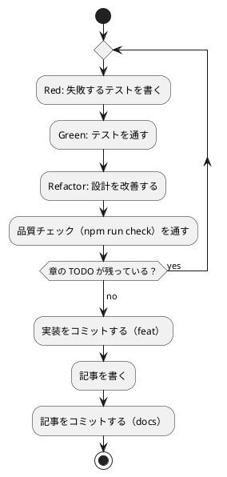

# 第 4 章: バージョン管理とデータ管理

## 4.1 はじめに

第 1 部では、TDD でデータを読み込み、前処理し、決定木で分類するプログラムを作りました。第 2 部では、そのプログラムを「変更を楽に安全にできる」状態に保つための道具立てを、バージョン管理（第 4 章）、パッケージ管理と静的解析（第 5 章）、タスクランナーと CI/CD（第 6 章）の順に整えます。

この章ではバージョン管理を扱います。機械学習のプロジェクトでは、コードに加えて **学習データ** と **学習済みモデル** というファイルが登場します。これらをコードと同じようにコミットしてよいとは限りません。この章では、Git で何を管理し、何を管理しないか、そして実験の結果を再現できるようにするには何を固定すればよいかを学びます。

Git の使い方は言語に依存しないので、[Python 版の第 4 章](../python/04-version-control-and-data-management.md)・[Kotlin 版の第 4 章](../kotlin/04-version-control-and-data-management.md) と同じ構成で進めます。TypeScript 版では、npm が作るファイルの除外、改行コードの固定、そして自作したシード付き乱数が再現性にどう効くかに注目してください。

## 4.2 コミットメッセージの重要性

コミット履歴は「なぜこの変更をしたのか」の記録です。機械学習のプロジェクトでは、「前処理を変えたら正解率が変わった」「ライブラリと予測が一致しない原因をテストに残した」といった変化の理由を、あとから追跡できることが特に重要になります。

コミットは次の 2 つを守ると追いやすくなります。

- **1 コミット 1 目的** — 機能追加と設定変更、実装と記事を 1 つのコミットに混ぜない
- **形式をそろえる** — 種類と対象がひと目で分かる書式でメッセージを書く

## 4.3 Conventional Commits

### フォーマット

本シリーズでは [Conventional Commits](https://www.conventionalcommits.org/ja/) の形式でコミットメッセージを書きます。

```text
<type>(<scope>): <subject>

<body>

<footer>
```

`scope` には変更の対象を書きます。本リポジトリでは、TypeScript 版の実装なら `node`（`apps/node` に置いているため）、記事シリーズなら `getting-start-ml`、Nix の環境定義なら `nix` のように書きます。

### コミットタイプ

| type | 用途 |
|------|------|
| `feat` | 新機能（章の実装など） |
| `fix` | バグ修正 |
| `test` | テストの追加・修正 |
| `refactor` | 振る舞いを変えないコードの変更 |
| `docs` | ドキュメントだけの変更（記事など） |
| `chore` | ビルドやツール、依存関係の変更 |
| `ci` | CI の設定の変更 |

### 実践例

本リポジトリの実際のコミット履歴から、TypeScript 版の計画から第 1 章の CI までを抜き出します（古い順）。

```text
d004ff6 docs(getting-start-ml): TypeScript 版執筆計画を追加
bdc7844 chore(nix): Node.js の環境を 22 に上げる
a72b0cf chore(node): TypeScript 6・Vitest 5・ESLint・Prettier による TypeScript プロジェクトの雛形を追加
12faae2 chore: apps/node の改行コードを LF に固定する
dc52f7b docs(adr): 003 TypeScript 版の機械学習・データ・API ライブラリの選定を追加
7aa68c3 feat(node): 第 1 章 きのこ派・たけのこ派をルールで判定する処理を追加
c552c85 docs(getting-start-ml): TypeScript 版トップと第 1 章を追加し、nav・シリーズ索引・進捗・執筆計画に反映
df070b7 ci(node): Nix と npm で TypeScript の整形・lint・型チェック・テストを実行する
```

`git log --oneline` で見ると、どのコミットが何のための変更かを type と scope だけで区別できます。環境（`chore(nix)`）、プロジェクトの設定（`chore(node)`）、実装（`feat(node)`）、記事（`docs`）、CI（`ci(node)`）を分けてあるので、たとえば「npm の設定だけを追いたい」ときは `chore(node)` のコミットだけを見れば済みます。

本文だけでは分からない理由は、メッセージの本文（body）に書きます。`12faae2` の本文は次のとおりで、なぜ改行コードを固定したのかが分かります（4.4 節で扱います）。

```text
chore: apps/node の改行コードを LF に固定する

Windows でチェックアウトしても Prettier の検査（既定は LF）が通るようにする。
```

## 4.4 何をコミットし、何をコミットしないか

機械学習のプロジェクトには、コミットしてはいけないファイルが増えます。理由は大きく 3 つあります。

| 分類 | 例 | コミットしない理由 |
|------|-----|------------------|
| 再配布できないもの | 学習データ | ライセンスで利用者が限られている |
| 再生成できるもの | `node_modules/`、カバレッジのレポート、ビルド成果物、学習済みモデル | 大きく、差分が読めず、`package-lock.json` とコードとデータから作り直せる |
| 秘匿すべきもの | `.env` の認証情報 | 漏洩すると取り返しがつかない |

### 学習データ

本シリーズの学習データは、書籍『スッキリわかる Python による機械学習入門』の配布データです。配布データの利用は書籍購入者に限られており、本リポジトリは公開されているので、データはコミットしません。ルートの `.gitignore` で、データの置き場所 `apps/data/` をまるごと除外しています。この設定は Python 版・Kotlin 版と共通です。

```text
# 依存関係
node_modules/

# 環境変数（暗号化済みの .env.vault とテンプレートの .env.example は管理対象）
.env

# 学習データ（書籍購入者のみ利用可のため再配布しない。docs/article/getting-start-ml/outline.md を参照）
apps/data/

# ビルド成果物・一時ファイル
site/
tmp/

# IDE・エディタの個人設定
.idea/workspace.xml
.vscode/

# Claude Code の個人設定
.claude/settings.local.json
# エージェントの作業用 worktree
.claude/worktrees/

# OS
.DS_Store
Thumbs.db
```

### TypeScript プロジェクト固有のファイル

`apps/node/.gitignore` では、npm と Vitest が作るディレクトリに加えて、ビルド成果物と学習済みモデルの保存先を除外しています。

```text
node_modules/
coverage/
dist/
model/
```

| パス | 中身 |
|------|------|
| `node_modules/` | `npm ci` で入れた依存パッケージ。執筆時点の CI のログでは 185 個のパッケージが入った |
| `coverage/` | `npm run test:coverage` が作るカバレッジのレポート（第 5 章） |
| `dist/` | JavaScript に変換したビルド成果物。本シリーズは Node.js が `.ts` を直接実行するので作らないが、`tsc` の出力先として慣例的に除外しておく |
| `model/` | 学習済みモデルの保存先（第 8 章で使う） |

`node_modules/` はルートの `.gitignore` にもありますが、`apps/node` の中だけを見ても分かるように、プロジェクト側にも書いています。

一方で、**`package-lock.json` はコミットします**。`package-lock.json` には、依存パッケージとその依存パッケージまでの正確な版と、ダウンロードしたファイルのハッシュが記録されています。これがあれば、`node_modules/` をコミットしなくても、`npm ci` でまったく同じ依存関係を作り直せます。`package-lock.json` は第 5 章で詳しく扱います。

学習済みモデルは、コードと学習データがあれば作り直せます。モデルのファイルをコミットするより、「どのコードとどのデータから、どの設定で作ったか」をコミットで追えるようにするほうが、再現性の面でも役に立ちます。

### 除外されていることを確かめる

`.gitignore` が意図どおりに効いているかは、`git check-ignore -v` で確認できます。どのファイルの何行目の規則で除外されたかが表示されます。

```bash
git check-ignore -v apps/data/sukkiri-ml/iris.csv apps/node/node_modules/ apps/node/coverage/ apps/node/dist/ apps/node/model/ tmp/sukkiri-ml-codes.zip
```

```text
.gitignore:8:apps/data/	apps/data/sukkiri-ml/iris.csv
apps/node/.gitignore:1:node_modules/	apps/node/node_modules/
apps/node/.gitignore:2:coverage/	apps/node/coverage/
apps/node/.gitignore:3:dist/	apps/node/dist/
apps/node/.gitignore:4:model/	apps/node/model/
.gitignore:12:tmp/	tmp/sukkiri-ml-codes.zip
```

`node_modules/` はルートの `.gitignore` の 2 行目にもありますが、表示されたのは `apps/node/.gitignore` の規則です。Git は、対象のファイルに近いディレクトリの `.gitignore` を優先します。

ディレクトリのパスは末尾に `/` を付けて指定しています。末尾が `/` の規則はディレクトリだけに当てはまるので、まだ存在しないパスを `/` なしで調べると、除外されていないように見えます。

データを配置したあとに `git status --short` を実行し、`apps/data/` 以下のファイルが一覧に出てこないことも確かめておきます。

### 改行コードを固定する

コミットするファイルの中身も、環境によって変わることがあります。Windows の Git は、既定の設定（`core.autocrlf=true`）でチェックアウトするときに改行コードを CRLF に変えます。一方、Prettier は既定で改行コードを LF にそろえるので、CRLF のファイルを検査すると失敗します。試しに `src/dataset.ts` を CRLF にして検査すると、次のようになりました。

```bash
npx prettier --check src/dataset.ts
```

```text
Checking formatting...
[warn] src/dataset.ts
[warn] Code style issues found in the above file. Run Prettier with --write to fix.
```

そこで、ルートの `.gitattributes` で `apps/node` 以下の改行コードを LF に固定しています。`text=auto` はテキストと判定したファイルだけを変換の対象にし、`eol=lf` はチェックアウトするときの改行コードを LF にします。

```text
*.nix text eol=lf
*.sh text eol=lf
Dockerfile text eol=lf
.vimrc text eol=lf
gradlew text eol=lf
apps/node/** text=auto eol=lf
```

設定が効いているかは、`git ls-files --eol` で確認できます。`i/` がリポジトリの中の改行コード、`w/` が作業ディレクトリの改行コード、`attr/` が当てはまった属性です。

```bash
git ls-files --eol apps/node/src/dataset.ts apps/node/package.json
```

```text
i/lf    w/lf    attr/text=auto eol=lf 	apps/node/package.json
i/lf    w/lf    attr/text=auto eol=lf 	apps/node/src/dataset.ts
```

`core.autocrlf=true` の Windows でも、作業ディレクトリの改行コードが LF になっています。Kotlin 版では `gradlew` だけを LF に固定しましたが、TypeScript 版は Prettier がすべてのファイルを検査するので、ディレクトリ全体に設定しました。

## 4.5 データの入手手順をコードにする

データをコミットしない代わりに、**データの入手と配置の手順** をリポジトリに残します。手順が文章だけだと、人によって置き場所がずれたり、ファイルが足りないまま実行して分かりにくいエラーになったりします。

本リポジトリでは、配置と確認を Gulp のタスクにしています（`ops/scripts/data.js`）。このタスクは言語に依存しないので、Python 版・Kotlin 版と同じものを使います。

```bash
npx gulp data:help
```

```text
学習データ（スッキリわかる Python による機械学習入門 配布データ）

  gulp data:setup   配布 ZIP を展開し、apps\data\sukkiri-ml に学習データを配置する
  gulp data:check   apps\data\sukkiri-ml に学習データが揃っているか確認する
  gulp data:help    このヘルプを表示する

環境変数:
  ML_DATA_ZIP       配布 ZIP のパス（既定 tmp/sukkiri-ml-codes.zip）

配布 ZIP は書籍購入者のみ利用できます。入手先: https://sukkiri.jp/books/sukkiri_ml
学習データはリポジトリにコミットしないでください（apps/data/ は .gitignore 対象）。
```

配布 ZIP を `tmp/` に置いてから `data:setup` を実行し、`data:check` で揃っているかを確かめます。失敗したときの表示は [Python 版の 4.5 節](../python/04-version-control-and-data-management.md) を参照してください。

```bash
npx gulp data:setup
npx gulp data:check
```

### プログラムからデータの場所を知る

TypeScript の実装は、第 1 章で作った `dataDir` でデータの場所を解決します。環境変数 `ML_DATA_DIR` があればその場所を、無ければ `apps/data/sukkiri-ml/` を使います。

```typescript
// src/dataset.ts
/** 学習データのディレクトリ。環境変数 ML_DATA_DIR が無ければ apps/data/sukkiri-ml を使う。 */
export function dataDir(
  getenv: (name: string) => string | undefined = (name) => process.env[name],
): string {
  return getenv("ML_DATA_DIR") ?? "../data/sukkiri-ml";
}
```

データの場所をコードに直接書かず、1 か所で解決するようにしておくと、CI や読者の環境など置き場所が違う場合にも環境変数だけで切り替えられます。環境変数を読む関数を引数で受け取る設計にしたので、テストでは `process.env` を書き換えずに、両方の場合を確かめられました。

既定の場所 `../data/sukkiri-ml` は、`apps/node` から見た相対パスです。npm scripts は `package.json` のあるディレクトリで実行されるので、`npm test` でも `node src/chapter01/main.ts` でも、`apps/node` で実行する限り同じ場所を指します。

Kotlin 版では、Gradle が環境変数の変化に気づくように、テストの入力として宣言する必要がありました。Vitest は実行のたびにすべてのテストを実行し、前回の結果を使い回さないので、TypeScript 版ではこの設定は要りません。

### データが無い環境でもテストを通す

コミットしないデータに依存するテストは、データの無い環境（CI や、データをまだ入手していない読者の環境）では失敗してしまいます。TypeScript 版では、Vitest の `describe.skipIf` で、データが無ければテストのグループごとスキップします。

```typescript
const csvFile = join(dataDir(), "iris.csv");

// ...

describe.skipIf(!existsSync(csvFile))("iris.csv の実データ", () => {
  let split: TrainTestSplit<Record<Feature, number>, string>;

  beforeAll(() => {
    split = prepareIris(csvFile, 0.3, 0);
  });

  // ...
});
```

データの無い場所を `ML_DATA_DIR` に指定すると、スキップされることを確かめられます。

```bash
ML_DATA_DIR=/nonexistent npx vitest run test/chapter03/iris-data.test.ts
```

```text
 Test Files  1 skipped (1)
      Tests  8 skipped (8)
```

すべてのテストを実行すると、実データを使う 3 つのファイルの 14 件がスキップされ、残りの 49 件が成功します。

```bash
ML_DATA_DIR=/nonexistent npm test
```

```text
 Test Files  7 passed | 3 skipped (10)
      Tests  49 passed | 14 skipped (63)
```

第 3 章で見たとおり、データの読み込みは `describe` の本体ではなく `beforeAll` や `it` の中に書きます。`describe` の本体は、スキップされるグループでもテストを集める段階で実行されるからです。

単体テストは架空の値で作ったデータで書き、実データのテストは `describe.skipIf` で守る、という 2 段構えにすると、CI ではデータ無しでも品質チェックが回り、手元ではデータを使った確認もできます。単体テストのデータに配布データの行をそのまま写さないことも大切です。テストのコードはコミットされるので、写した行はデータの再配布になってしまいます。

## 4.6 実験を再現できるようにする

機械学習の結果は、コードとデータが同じでも、次のものが違うと変わります。

| 変わる原因 | 固定する方法 | 本リポジトリでの置き場所 |
|-----------|------------|----------------------|
| 乱数（データの分割、モデルの初期値） | シードを指定する | 各章のコード（第 2 章の `seed`） |
| 乱数を作るアルゴリズム | 自作してテストで固定する | `src/chapter02/random.ts` と、そのテスト |
| ライブラリのバージョン | 正確な版を記録する | `apps/node/package.json`・`package-lock.json`（第 5 章） |
| Node.js のバージョン | 版を指定する | `apps/node/.nvmrc`、`package.json` の `engines`、Nix の環境定義（第 5・6 章） |

### 乱数のシード

JavaScript の `Math.random` にはシードを指定する方法がありません。そこで第 2 章では、シード付きの乱数生成器（mulberry32）を自作し、`shuffle` に渡してデータを並べ替えました。同じシード 0 で 2 回、シード 1 で 1 回、`Math.random` で 1 回、0〜9 の並べ替えを実行してみます。

```typescript
import { createRandom, shuffle } from "./src/chapter02/random.ts";

const items = [0, 1, 2, 3, 4, 5, 6, 7, 8, 9];
console.log(shuffle(items, createRandom(0)).join(", "));
console.log(shuffle(items, createRandom(0)).join(", "));
console.log(shuffle(items, createRandom(1)).join(", "));
console.log(shuffle(items, Math.random).join(", "));
```

2 回実行した結果です。

```text
3, 8, 6, 4, 5, 9, 7, 1, 0, 2
3, 8, 6, 4, 5, 9, 7, 1, 0, 2
7, 8, 3, 2, 1, 5, 9, 4, 0, 6
6, 4, 5, 8, 0, 9, 2, 7, 1, 3
```

```text
3, 8, 6, 4, 5, 9, 7, 1, 0, 2
3, 8, 6, 4, 5, 9, 7, 1, 0, 2
7, 8, 3, 2, 1, 5, 9, 4, 0, 6
8, 3, 1, 5, 9, 4, 2, 7, 0, 6
```

シードを指定した 3 行は、実行を繰り返しても同じ並びになり、シードを変えると並びが変わります。`Math.random` を使った最後の行だけが、実行のたびに変わりました。`shuffle` が乱数を作る関数を引数で受け取るので、同じ関数に `Math.random` を渡すだけで比べられます。

第 2 章では、この性質を次の 2 つのテストで固定しました。テストがあるので、うっかりシードを使わない実装に変えてしまっても気付けます。

```typescript
  it("同じシードなら同じ分け方になる", () => {
    const { x, t } = numberedDataset(10);

    const first = splitTrainTest(x, t, 0.3, 42);
    const second = splitTrainTest(x, t, 0.3, 42);

    expect(first.tTest).toEqual(second.tTest);
  });

  it("シードが違えば違う分け方になる", () => {
    const { x, t } = numberedDataset(10);

    const first = splitTrainTest(x, t, 0.3, 0);
    const second = splitTrainTest(x, t, 0.3, 1);

    expect(first.tTest).not.toEqual(second.tTest);
  });
```

### 乱数のアルゴリズムも固定する

シードを固定しても、乱数を作るアルゴリズムが変われば結果は変わります。Kotlin 版では、標準ライブラリの `Random(seed)` の乱数列が同じになるのは同じ版の Kotlin の間だけだと、Kotlin のドキュメントに書かれていました。

TypeScript 版では、乱数生成器を自作したので、アルゴリズムはリポジトリのコードそのものです。mulberry32 は 32 ビットの整数演算（`Math.imul`・ビット演算・符号なし右シフト）だけで書かれており、これらの演算の結果は ECMAScript の仕様で決まっているので、Node.js の版を変えても乱数列は変わりません。さらに第 2 章では、参照実装と同じ値を返すことをテストで固定しました。

```typescript
  it("mulberry32 の参照実装と同じ値を返す", () => {
    expect(take(createRandom(0), 3)).toEqual([
      0.26642920868471265, 0.0003297457005828619, 0.2232720274478197,
    ]);
  });
```

アルゴリズムをうっかり書き換えれば、このテストが失敗します。第 3 章の実データのテストが「45 件中 44 件」という数値を固定できているのは、シードとアルゴリズムの両方が固定されているからです。

### シードだけでは再現できないもの

それでも、すべての数値が Node.js の版から独立しているわけではありません。

- **ライブラリの乱数** — 第 10 章で使う ml-random-forest は、ライブラリの中で乱数を作ります（[ADR 003](../../../adr/003-typescript-ml-libraries.md)）。シードを指定できますが、乱数の作り方はライブラリの版に依存するので、版を固定する必要があります
- **数学関数** — ECMAScript の仕様は、`Math.exp`・`Math.log` などの結果を「実装が近似した値」と定めており、最後の桁まで一致することは保証していません。ロジスティック回帰など、これらの関数を使う計算の結果は、Node.js（V8）の版によって最後の桁が変わる可能性があります

同じ理由で、Python 版・Kotlin 版と TypeScript 版では、同じシード 0 でもテストデータに入る行が違います。乱数を作るアルゴリズムが NumPy・Kotlin・mulberry32 で違うためです。記事に載せる正解率などの数値は、シードと版を固定した実装を実データで動かした結果です。数値をテストで固定するときは、どのシードで得た値かを必ずコードに残します。

## 4.7 TDD とコミットのタイミング

TDD のサイクルとコミットは、次のように対応させると履歴が読みやすくなります。



- テストが通らない状態ではコミットしない
- 実装と記事は別のコミットにする
- 依存関係の追加（`chore`）、CI の変更（`ci`）も、それぞれ別のコミットにする
- 学習データ・モデル・`node_modules/` がステージングされていないことを、コミットの前に `git status` で確かめる

第 2 章と第 3 章の実際の履歴です。どちらの章も、ライブラリの追加を `chore` として先にコミットしてから、実装・記事の順にコミットしています。

```text
cea7716 chore(node): 第 2 章で使う csv-parse 7.0.2 を追加
9112aac feat(node): 第 2 章 iris の欠損値補完とシード付き乱数による訓練・テストデータ分割を追加
05628a4 refactor(node): 第 2 章 列ごとの値の組み立てを byColumn にまとめ、main の欠損数の合計に名前を付ける
f29fab3 docs(getting-start-ml): TypeScript 第 2 章 データの前処理と三角測量を追加
44a85fe chore(node): 第 3 章で使う ml-cart 2.1.1 と、その型宣言を追加
19f9857 feat(node): 第 3 章 決定木の自作と ml-cart との突き合わせを追加
df20b83 docs(getting-start-ml): TypeScript 第 3 章 決定木による分類と明白な実装を追加
```

`05628a4` は、振る舞いを変えないリファクタリングを実装とは別のコミットにしたものです。依存関係の追加が独立したコミットになっているので、「csv-parse をいつ、どの版で入れたか」を `git log -- apps/node/package.json` で追えます。

## 4.8 まとめ

この章では、機械学習のプロジェクトでのバージョン管理を学びました。

1. **Conventional Commits** — type と scope で、変更の種類と対象が分かるコミットメッセージを書く。理由は本文に書く
2. **コミットしないものを決める** — 再配布できない学習データ、再生成できる `node_modules/`・カバレッジのレポート・モデル、秘匿すべき認証情報を `.gitignore` で除外する。`package-lock.json` はコミットする
3. **改行コードを固定する** — `.gitattributes` で `apps/node` 以下を LF にし、Windows でも Prettier の検査が通るようにする
4. **入手手順をコードにする** — データを置く場所と確認方法を Gulp タスクにし、プログラムからは `dataDir` で場所を解決する
5. **データが無くてもテストを通す** — 実データのテストは `describe.skipIf` でスキップし、読み込みは `beforeAll` や `it` の中に書く
6. **再現性** — シードに加えて、乱数のアルゴリズムを自作とテストで固定する。ライブラリの乱数と数学関数の結果は、ライブラリと Node.js の版に依存する

次の章では、ライブラリと Node.js の版を固定する npm の仕組みと、コードの品質を機械的に確かめる静的解析ツールを扱います。
