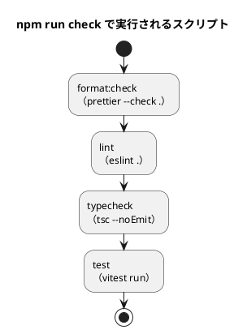
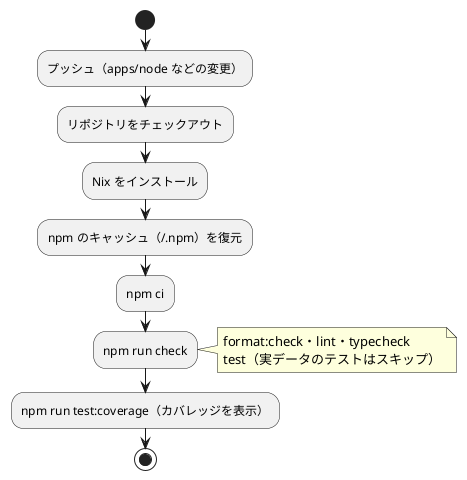

# 第 6 章: タスクランナーと CI/CD

## 6.1 はじめに

第 5 章までで、テスト（Vitest）、型チェック（`tsc`）、静的解析（ESLint）、整形（Prettier）、カバレッジ（@vitest/coverage-v8）がそろいました。ただ、コマンドを覚えて毎回正しい順番で実行するのは手間で、実行し忘れも起きます。

この章では、次の 2 つを整えます。

1. **タスクランナー** — npm scripts で品質チェックに名前を付け、`npm run check` の 1 つのコマンドで実行できるようにする
2. **CI/CD** — GitHub Actions で、プッシュのたびに同じ品質チェックを自動実行する

最後に、CI に載せるまでに起きた問題と、その調べ方を紹介します。

[Python 版の第 6 章](../python/06-task-runner-and-ci-cd.md) では tox を、[Kotlin 版の第 6 章](../kotlin/06-task-runner-and-ci-cd.md) では Gradle をタスクランナーにしました。TypeScript 版では、npm に組み込まれた npm scripts を使います。

## 6.2 タスクランナー — npm scripts

### scripts と check への集約

npm scripts は、`package.json` の `scripts` に名前とコマンドを書いておき、`npm run <名前>` で実行する仕組みです。本リポジトリの `scripts` は次のとおりです。

```json
  "scripts": {
    "test": "vitest run",
    "test:coverage": "vitest run --coverage",
    "lint": "eslint .",
    "format": "prettier --write .",
    "format:check": "prettier --check .",
    "typecheck": "tsc --noEmit",
    "check": "npm run format:check && npm run lint && npm run typecheck && npm test"
  },
```

`check` は、ほかの 4 つのスクリプトを `&&` でつないでいます。`&&` は「前のコマンドが成功したら次を実行する」という意味なので、どれか 1 つが失敗するとそこで止まり、`npm run check` 全体も失敗します。



順番は、速く終わり、直し方が機械的なものから並べています。書式の崩れは `npm run format` で直せるので最初に、テストの失敗は原因を考える必要があるので最後に置いています。

試しに、セミコロンの無い 1 行だけのファイル `src/lint-demo.ts` を置いて実行すると、最初の `format:check` で止まり、`lint` 以降は実行されませんでした。

```text
> getting-started-ml@0.1.0 check
> npm run format:check && npm run lint && npm run typecheck && npm test

> getting-started-ml@0.1.0 format:check
> prettier --check .

Checking formatting...
[warn] src/lint-demo.ts
[warn] Code style issues found in the above file. Run Prettier with --write to fix.
```

スクリプトの一覧は、`npm run` を引数なしで実行すると表示されます。

```bash
npm run
```

```text
Lifecycle scripts included in getting-started-ml@0.1.0:
  test
    vitest run
available via `npm run-script`:
  test:coverage
    vitest run --coverage
  lint
    eslint .
  format
    prettier --write .
  format:check
    prettier --check .
  typecheck
    tsc --noEmit
  check
    npm run format:check && npm run lint && npm run typecheck && npm test
```

`test` は npm があらかじめ意味を決めている名前（ライフサイクルスクリプト）で、`npm run test` の代わりに `npm test` と書けます。

### プロジェクトのツールを使う

npm scripts は、`node_modules/.bin` をコマンドの検索パスの先頭に加えてから実行します。そのため、`scripts` の `tsc` は、`package.json` で固定した TypeScript 6.0.3 の `tsc` です。

このことは、6.4 節の CI で意味を持ちます。CI が使う Nix の環境には TypeScript も入っていますが、その版は 5.9.3 でした。`npm run typecheck` は Nix の `tsc` ではなく、プロジェクトの `tsc` を使うので、CI でも手元と同じ版で型チェックできます。コマンドを直接実行するときも、`npx tsc` のように `npx` を付ければプロジェクトの版を使います。

### 章の main を実行する

各章の `main` は、Node.js で `.ts` のファイルを直接実行します。Kotlin 版の `runChapter` タスクのようなスクリプトは用意していません。コンパイルが要らないので、`node` のコマンドがそのまま章を実行する手順になるからです。

```bash
node src/chapter01/main.ts
```

```text
データ件数: 19
ルールによる判定の正解率: 0.7368
```

学習データが無いと、ファイルが見つからないという例外で終わります。テストと違い、`main` はデータがあることを前提にしています。

### タスクの実行

```bash
# 品質チェックをまとめて実行する（整形の検査・lint・型チェック・テスト）
npm run check

# 個別に実行する
npm test
npm run lint
npm run typecheck
npm run format:check
npm run test:coverage

# 整形する
npm run format

# 章の main を実行する（学習データが必要）
node src/chapter03/main.ts
```

学習データを配置した環境で `npm run check` を実行した結果です。

```text
> getting-started-ml@0.1.0 check
> npm run format:check && npm run lint && npm run typecheck && npm test

> getting-started-ml@0.1.0 format:check
> prettier --check .

Checking formatting...
All matched files use Prettier code style!

> getting-started-ml@0.1.0 lint
> eslint .

> getting-started-ml@0.1.0 typecheck
> tsc --noEmit

> getting-started-ml@0.1.0 test
> vitest run

 Test Files  10 passed (10)
      Tests  63 passed (63)
```

Kotlin 版の Gradle は、入力が変わらないタスクを飛ばす（`UP-TO-DATE`）ので、環境変数をテストの入力として宣言する必要がありました。npm scripts はそのような判断をせず、毎回すべてのコマンドを実行します。そのため、`ML_DATA_DIR` を変えれば、次の実行からそのまま反映されます。

### npm scripts と Gulp の役割分担

本リポジトリには、npm scripts のほかに、リポジトリ全体のタスクを担う Gulp（`ops/scripts/` と、ルートの `gulpfile.js`）があります。

| 道具 | 実行する場所 | 受け持つもの |
|------|------------|------------|
| npm scripts | `apps/node` | TypeScript 版の品質チェック（整形・lint・型チェック・テスト・カバレッジ） |
| Gulp | リポジトリのルート | 言語に依存しない作業（学習データの配置 `data:setup`、ドキュメントのビルド `mkdocs:build` など） |

学習データの配置は Python 版・Kotlin 版と共通なので Gulp に、TypeScript のツールは `apps/node` の `package.json` に置いています。Gulp もルートの `package.json` で npm から入れたツールですが、Gulp から `apps/node` のテストを呼ぶことはしていません。TypeScript 版の品質チェックは、`apps/node` だけで完結させています。

## 6.3 Notebook について

Python 版と Kotlin 版の第 6 章では、Notebook で探索し、出力セルを消してからコミットする仕組みを作りました。TypeScript 版では Notebook による探索と可視化を扱わないので、この仕組みも作っていません。Notebook の運用は、[Python 版の 6.3 節](../python/06-task-runner-and-ci-cd.md) か [Kotlin 版の 6.3 節](../kotlin/06-task-runner-and-ci-cd.md) を参照してください。

探索で分かったことをテストに移すという考え方は、TypeScript 版でも同じです。TypeScript 版では、探索の代わりに学習用テスト（第 2 章の csv-parse、第 3 章の ml-cart）でライブラリの振る舞いを確かめ、その結果をテストとして残しています。

## 6.4 GitHub Actions による CI

### ワークフロー設定

プッシュのたびに品質チェックを自動実行するため、`.github/workflows/node-ci.yml` を用意しています。

```yaml
name: Node CI

on:
  push:
    branches: [main, develop]
    paths:
      - "apps/node/**"
      - ".github/workflows/node-ci.yml"
      - "ops/nix/environments/node/**"
      - "flake.nix"
      - "flake.lock"
  pull_request:
    branches: [main]
    paths:
      - "apps/node/**"
      - ".github/workflows/node-ci.yml"
      - "ops/nix/environments/node/**"
      - "flake.nix"
      - "flake.lock"

permissions:
  contents: read

jobs:
  test:
    runs-on: ubuntu-latest

    steps:
      - name: Checkout the repository
        uses: actions/checkout@v4

      - name: Install Nix
        uses: cachix/install-nix-action@v30
        with:
          nix_path: nixpkgs=channel:nixos-unstable

      # npm ci が再利用するダウンロード済みのパッケージ（~/.npm）を保存する
      - name: Cache npm
        uses: actions/cache@v4
        with:
          path: ~/.npm
          key: ${{ runner.os }}-npm-${{ hashFiles('apps/node/package-lock.json') }}
          restore-keys: |
            ${{ runner.os }}-npm-

      - name: Install dependencies
        run: nix develop .#node --command bash -c "cd apps/node && npm ci"

      # 学習データは再配布できないため CI には配置しない。実データのテストはスキップされる
      - name: Run format check, lint, type check and tests
        run: nix develop .#node --command bash -c "cd apps/node && npm run check"

      # 実データのテストがスキップされるので、手元より低い値になる。下限は設けず表示だけする
      - name: Show coverage
        run: nix develop .#node --command bash -c "cd apps/node && npm run test:coverage"
```

### ワークフローのポイント

- **`paths` で対象を絞る** — TypeScript の実装・このワークフロー・Nix の環境定義が変わったときだけ実行します。記事だけの変更や、ほかの言語の変更では実行されません
- **Nix で環境をそろえる** — `nix develop .#node` で、`ops/nix/environments/node/shell.nix` に定義した環境に入ってからコマンドを実行します
- **`npm ci` で入れる** — 第 5 章のとおり、`package-lock.json` のとおりに入れ、`package.json` との食い違いがあれば失敗します
- **npm のキャッシュを使う** — `node_modules` ではなく、npm がダウンロードしたパッケージを保存する `~/.npm` をキャッシュします。`npm ci` は `node_modules` を消してから入れ直すので、`node_modules` を保存しても使われないためです。キャッシュのキーには `package-lock.json` のハッシュを使います
- **手元と同じコマンドを使う** — 各ステップは手元と同じ `npm run check` と `npm run test:coverage` を実行します
- **学習データは置かない** — 学習データは再配布できないので CI には置きません。実データのテストは `describe.skipIf` でスキップされます

### Nix の Node.js 環境

Nix の環境定義 `ops/nix/environments/node/shell.nix` は、TypeScript 版を書き始める前からリポジトリにありました。そのときは Node.js 20 を使う設定でしたが、Node.js 20 はサポートが終了しており、Vitest 5 の `engines` は `^22.12.0 || ^24.0.0 || >=26.0.0` なので、TypeScript 版のプロジェクトを作る前に 22 に上げました（`bdc7844 chore(nix): Node.js の環境を 22 に上げる`）。

```diff
   buildInputs = baseShell.buildInputs ++ (with packages; [
-    nodejs_20
+    nodejs_22
     nodePackages.npm
     nodePackages.typescript
     nodePackages.typescript-language-server
```

Nix が入れる Node.js の正確な版は、リポジトリの `flake.lock` が固定する nixpkgs で決まります。CI のログでは次のとおりでした。

```text
TypeScript development environment activated
  - Node.js: v22.21.1
  - npm: 10.9.4
  - TypeScript: Version 5.9.3
```

手元の Node.js は 22.18.0 なので、手元と CI で Node.js の版は一致していません。どちらも `engines` の `>=22.13.0` を満たしており、テストの数値も一致していますが、第 4 章で見たとおり、数学関数の結果は Node.js の版によって最後の桁が変わる可能性があります。浮動小数点数を比べるテストでは `toBeCloseTo` などで桁数を決めておくと、版の違いに影響されにくくなります。

### CI パイプラインの流れ



第 7 章以降のライブラリを追加したコミット（`8252915`）で、CI が成功したときのログの一部です。`package-lock.json` が変わったのでキーの完全一致はせず、`restore-keys` の `Linux-npm-` で前回のキャッシュを復元しています。

```text
Cache hit for restore-key: Linux-npm-75102ff568a21cb496461bc65ee39a5ccb361fc49a5a9097ff8c4547eb3c5b3c
Cache Size: ~36 MB (38093006 B)
Cache restored successfully
...
added 185 packages, and audited 186 packages in 2s
...
> getting-started-ml@0.1.0 check
> npm run format:check && npm run lint && npm run typecheck && npm test
...
 Test Files  7 passed | 3 skipped (10)
      Tests  49 passed | 14 skipped (63)
...
Statements   : 82.05% ( 160/195 )
Branches     : 79.16% ( 57/72 )
Functions    : 91.54% ( 65/71 )
Lines        : 80.55% ( 145/180 )
...
Cache saved with key: Linux-npm-3e94cb789ddc2db1e379c1ecc37e57275d042d6d084f094dddfead690fc63fe7
```

最初の CI の実行（`df070b7`）では、キャッシュが無かったので `Cache not found for input keys` と表示され、実行の最後に新しいキャッシュが保存されました。キャッシュを復元できた実行では、`npm ci` の中でパッケージのダウンロードが省かれます。ワークフロー全体は、執筆時点の 3 回の実行でどれも 50 秒前後でした。

CI には学習データが無いので、テストは 49 件が成功し、実データのテスト 14 件がスキップされました。カバレッジは、第 5 章で手元のデータなしの環境で計測した値と同じです。手元のデータありの環境（Statements 96.92%）より低いのは、実データのテストと、それが呼ぶ各章の `main` が実行されないためです。カバレッジの下限を設けていないのはこのためで、CI では表示だけにしています。

## 6.5 CI に載せるまでに起きた問題を調べる

Node CI は、執筆時点まで一度も失敗していません。その代わりに、プロジェクトを整える間に、手元で 4 つの問題が起きています。どれも「CI で初めて失敗する」前に見つけたものです。

### 1 つ目: Nix の Node.js が古い

TypeScript 版のプロジェクトを作る前に、使うツールの `engines` を確かめました。Vitest 5 は Node.js 22.12 以上を求めていましたが、Nix の環境定義は Node.js 20 でした。`.npmrc` の `engine-strict=true` のもとでは、Node.js 20 で `npm ci` を実行するとインストールが止まります。CI は Nix の環境で動くので、このまま載せれば CI だけが失敗していたはずです。先に Nix の環境を 22 に上げてから、プロジェクトを作りました（6.4 節）。

### 2 つ目: Windows でだけ整形の検査が失敗する

Windows の Git は、既定の設定でチェックアウトするときに改行コードを CRLF に変えます。Prettier は改行コードも書式として検査するので、CRLF のファイルがあると `prettier --check` が失敗します（第 4 章）。CI（Linux）では改行コードは変わらないので、この問題は手元の Windows でだけ起きます。`.gitattributes` で `apps/node` 以下を LF に固定し、どちらでも同じ結果になるようにしました（`12faae2`）。

### 3 つ目: データが無いとテストのファイルごと失敗する

第 3 章で、実データのテストの読み込みを `describe` の本体に書いたところ、データの無い環境ではテストのファイルごと失敗しました（`Error: ENOENT: no such file or directory`）。手元ではデータがあるので、すべて成功します。CI にはデータが無いので、そのままプッシュしていれば CI だけが失敗していたはずです。`ML_DATA_DIR=/nonexistent` を指定して、手元でデータの無い環境を再現して見つけました。読み込みを `beforeAll` に移して直しています。

### 4 つ目: engines の下限が依存関係より低い

第 5 章で、`engines` の `>=22.12.0` が、ESLint 10 の関連パッケージが求める `^22.13.0` より低いことが分かりました。手元（22.18.0）と CI（22.21.1）は両方の条件を満たしていたので、どこでも失敗は起きていません。Node.js 22.12.0 で実際に `npm ci` を実行して、`EBADENGINE` で止まることを確かめてから、下限を 22.13.0 に上げました。

### この経緯から学べること

- **CI の環境を手元で再現する** — データが無い、改行コードが違う、Node.js の版が違う、といった CI と手元の違いは、`ML_DATA_DIR=/nonexistent` や別の版の Node.js（`npx -p node@22.12.0`）で手元に作れます。CI で失敗してから直すより速く、CI の履歴も汚れません
- **宣言と事実を突き合わせる** — `engines` の「22.12.0 で動く」は、書いただけでは確かめられていない宣言でした。依存関係の `engines` を調べ、実際にその版で動かして初めて誤りが分かりました
- **「失敗しない」も疑う** — 4 つ目の問題は、手元でも CI でも失敗しないという形で潜んでいました。成功しているのは、条件を満たす環境でしか試していないからかもしれません

## 6.6 三種の神器と CI

第 4〜6 章で整えたものを、ソフトウェア開発の「三種の神器」（バージョン管理・テスティング・自動化）に当てはめると次のようになります。

| 三種の神器 | 道具 | 本シリーズでの使い方 |
|-----------|------|------------------|
| バージョン管理 | Git、Conventional Commits、`.gitignore`、`.gitattributes` | 学習データ・`node_modules/`・カバレッジのレポートをコミットしない。`package-lock.json` はコミットする。改行コードを LF に固定する |
| テスティング | Vitest、@vitest/coverage-v8 | 単体テストは架空の値、実データのテストは `describe.skipIf` でスキップ可能にする |
| 自動化 | npm（`package-lock.json`・npm scripts）、TypeScript、ESLint、Prettier、GitHub Actions、Nix、Gulp | 環境の再現、品質チェックの一括実行、データの配置、CI |

### 利用可能なコマンド一覧

| コマンド | 内容 | 実行する場所 |
|---------|------|------------|
| `npx gulp data:setup` | 学習データを配置する | リポジトリのルート |
| `npx gulp data:check` | 学習データの配置を確認する | リポジトリのルート |
| `npm ci` | `package-lock.json` のとおりに依存関係を入れる | `apps/node` |
| `npm run check` | 整形の検査・lint・型チェック・テストをまとめて実行する | `apps/node` |
| `npm run format` | コードを整形する | `apps/node` |
| `npm run test:coverage` | カバレッジを表示する | `apps/node` |
| `npm audit` | 依存関係の既知の脆弱性を確かめる | `apps/node` |
| `node src/chapter03/main.ts` | 章の `main` を実行する | `apps/node` |

## 6.7 まとめ

この章では、品質チェックを自動化し、どの環境でも同じ手順で実行できるようにしました。

1. **npm scripts** — 品質チェックに名前を付け、`&&` でつないだ `check` にまとめる。npm scripts は `node_modules/.bin` のツールを使うので、グローバルに入ったツールの版に左右されない
2. **役割分担** — TypeScript 版の品質チェックは `apps/node` の npm scripts で、言語に依存しない作業はリポジトリのルートの Gulp で行う
3. **GitHub Actions** — Nix で Node.js をそろえ、`npm ci` で依存関係を入れ、手元と同じ `npm run check` を実行する。`~/.npm` をキャッシュし、学習データの無い CI では実データのテストがスキップされるので、カバレッジは表示だけにする
4. **問題の調べ方** — CI と手元の違い（データ・改行コード・Node.js の版）を手元で再現し、宣言と事実を突き合わせ、「失敗しない」ことも疑う

第 2 部で、TDD を回し続けるための道具立てがそろいました。次の第 3 部では、回帰問題と、欠損値・カテゴリ値・外れ値を含む現実的なデータの前処理に取り組みます。
