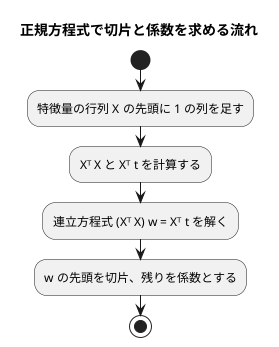

# 第 7 章: 線形回帰による数値予測

## 7.1 はじめに

第 1〜3 章では「きのこ派かたけのこ派か」「アヤメのどの品種か」という、グループを当てる **分類** を扱いました。この章からは、数値そのものを当てる **回帰** に進みます。題材は、映画の SNS での反響や主演俳優の露出度から、興行収入を予測する問題です。

この章では、最も基本的な回帰モデルである **線形回帰** を自作します。[Python 版の第 7 章](../python/07-linear-regression.md) は NumPy の行列演算を使い、[Kotlin 版の第 7 章](../kotlin/07-linear-regression.md) は演算子オーバーロードで `a * b` と書ける行列型を作りました。TypeScript には演算子オーバーロードが無いので、行列を `number[][]` で表し、積・転置・連立方程式の解を **関数** として TDD で作ります。

次に、JavaScript の機械学習ライブラリ [ml-regression-multivariate-linear](https://github.com/mljs/regression-multivariate-linear) と、行列のライブラリ [ml-matrix](https://github.com/mljs/matrix) に置き換えて結果を突き合わせます。外れ値の除去と回帰の評価指標（MAE・RMSE・決定係数 R²）も実装します。

TypeScript 版では、`null` になりうる値を確かめるまで使えない **型の絞り込み** が、外れ値の条件と正解ラベルの欠損をどう見つけるかに注目してください。

## 7.2 線形回帰とは

### 特徴量の重み付きの和で予測する

線形回帰は、予測値を「切片」と「特徴量ごとの係数 × 特徴量」の和で表すモデルです。この章のデータに当てはめると次の式になります。

```text
予測値 = 切片 + 係数1 × SNS1 + 係数2 × SNS2 + 係数3 × actor + 係数4 × original
```

学習とは、訓練データに対して予測値と実測値のずれが最も小さくなるように、切片と係数を決めることです。ずれの大きさには「誤差の 2 乗の合計」を使います。これを最小にする方法を **最小二乗法** と呼びます。

### 正規方程式

最小二乗法の解は、行列を使うと 1 つの式で求められます。特徴量を行列 `X`、実測値をベクトル `t`、切片と係数をまとめたベクトルを `w` とすると、誤差の 2 乗の合計を最小にする `w` は次の **正規方程式** を満たします。

```text
(Xᵀ X) w = Xᵀ t
```

`X` の先頭には、すべての値が 1 の列を足しておきます。この列にかかる係数が切片になります。



この流れに必要な行列の操作は、**積**・**転置**・**連立方程式を解く** の 3 つです。JavaScript の標準ライブラリには行列の型が無いので、この 3 つを関数として自作します。逆行列を作らずに連立方程式として解くのは、Python 版・Kotlin 版と同じく、そのほうが数値計算の誤差が小さくなるためです。

## 7.3 題材とデータ

この章で使うのは `cinema.csv` です。100 本の映画について、次の 6 列が記録されています。

| 列 | 内容 | 欠損値 | TypeScript 版での型 |
|----|------|-------|-------------------|
| cinema_id | 映画の ID | なし | `number \| null` |
| SNS1 | SNS での反響の数（1 つ目の指標） | 1 件 | `number \| null` |
| SNS2 | SNS での反響の数（2 つ目の指標） | なし | `number \| null` |
| actor | 主演俳優のメディア露出の指標 | 1 件 | `number \| null` |
| original | 原作の有無（0 または 1） | なし | `number \| null` |
| sales | 興行収入 | なし | `number \| null` |

「SNS1」「SNS2」「actor」「original」が特徴量、「sales」が正解ラベル（予測したい数値）です。`cinema_id` は映画を区別するための番号なので、特徴量には使いません。

型の列に注目してください。CSV を読み込む時点では、どの列に空欄があるかをプログラムは知りません。そこで第 2 章の iris と同じく、数値の列はすべて `number | null` として読み込みます。この型が、7.5 節と 7.11 節で型チェックの指摘につながります。

このデータには、SNS2 の値が大きいのに興行収入が低い、傾向から外れた映画が 1 本含まれています。このような **外れ値** は、最小二乗法の結果を大きく引っ張ります。誤差を 2 乗して足し合わせるので、大きく外れた 1 点の影響が大きくなるためです。

## 7.4 TODO リストの作成

**TODO リスト**:

- [ ] cinema.csv を読み込む
- [ ] 外れ値を取り除く
  - [ ] SNS2 が 1000 を超え、興行収入が 8500 未満の行を取り除く
  - [ ] 条件の片方だけを満たす行は残す
- [ ] 行列の関数を作る
  - [ ] 行列の積を求める
  - [ ] 転置行列を求める
  - [ ] 連立方程式を解く
- [ ] 正規方程式で線形回帰を学習する
  - [ ] 直線上の点から切片と係数を求める
  - [ ] 複数の特徴量から切片と係数を求める
- [ ] 学習したモデルで予測する
- [ ] 評価指標を計算する（MAE・RMSE・R²）
- [ ] ml.js のライブラリと結果が一致することを確かめる
- [ ] 外れ値の除去・分割・補完をまとめる
- [ ] 実データで学習・評価して表示する

外れ値の条件「SNS2 が 1000 を超え、興行収入が 8500 未満」は、書籍『スッキリわかる Python による機械学習入門』の同じデータでの分析手順に合わせたものです。散布図で外れ値を確かめる手順は、Python 版・Kotlin 版の Notebook で扱います。

## 7.5 データを読み込み外れ値を取り除く

### 読み込み

テストでは、架空の値を書いた CSV を一時ディレクトリに作ります。外れ値のテストもあわせて書き、まとめて Red を確認します。

```typescript
// test/chapter07/cinema-regression.test.ts
import { mkdtempSync, writeFileSync } from "node:fs";
import { tmpdir } from "node:os";
import { join } from "node:path";
import { describe, expect, it } from "vitest";
import {
  loadCinema,
  removeOutliers,
} from "../../src/chapter07/cinema-regression.ts";

const HEADER = "cinema_id,SNS1,SNS2,actor,original,sales\n";

function writeCsv(rows: string): string {
  const csvFile = join(mkdtempSync(join(tmpdir(), "cinema-")), "cinema.csv");
  writeFileSync(csvFile, HEADER + rows);
  return csvFile;
}

describe("loadCinema", () => {
  it("CSV を読み込み数値の列を数値にし空欄を欠損値にする", () => {
    const rows = loadCinema(writeCsv("1,,500,9000.5,1,9500\n"));

    expect(rows).toEqual([
      {
        cinema_id: 1,
        SNS1: null,
        SNS2: 500,
        actor: 9000.5,
        original: 1,
        sales: 9500,
      },
    ]);
  });
});

describe("removeOutliers", () => {
  it("SNS2 が 1000 を超え売上が 8500 未満の行を取り除く", () => {
    const rows = [
      { SNS2: 1200, sales: 8000 },
      { SNS2: 600, sales: 9500 },
    ];

    expect(removeOutliers(rows)).toEqual([{ SNS2: 600, sales: 9500 }]);
  });
});
```

```text
 FAIL  test/chapter07/cinema-regression.test.ts [ test/chapter07/cinema-regression.test.ts ]
Error: Cannot find module '../../src/chapter07/cinema-regression.ts' imported from test/chapter07/cinema-regression.test.ts
```

`removeOutliers` のテストでは、`SNS2` と `sales` の 2 つのプロパティだけを持つオブジェクトを渡しています。外れ値の判定に要らない列まで書かずに済むように、`removeOutliers` は「少なくともこの 2 つのプロパティを持つ行」なら何でも受け取れるようにします。

### Green: まず片方の条件だけで取り除く

読み込みは、第 2 章の `loadIris` と同じく csv-parse で行います。cinema.csv には文字列の列が無いので、見出し以外の値をすべて数値か `null` にします。外れ値の除去は、まず最初のテストが通る最小の実装として、SNS2 の条件だけで絞り込みます。

```typescript
// src/chapter07/cinema-regression.ts
import { readFileSync } from "node:fs";
import { parse } from "csv-parse/sync";

export const COLUMNS = [
  "cinema_id",
  "SNS1",
  "SNS2",
  "actor",
  "original",
  "sales",
] as const;
export type CinemaRow = Record<(typeof COLUMNS)[number], number | null>;

export function loadCinema(csvFile: string): CinemaRow[] {
  return parse<CinemaRow>(readFileSync(csvFile), {
    bom: true,
    columns: true,
    cast: (value, context) => {
      if (context.header) {
        return value;
      }
      return value === "" ? null : Number(value);
    },
  });
}

export function removeOutliers<R extends { SNS2: number | null }>(
  rows: readonly R[],
): R[] {
  return rows.filter((row) => row.SNS2 === null || row.SNS2 <= 1000);
}
```

- `<R extends { SNS2: number | null }>` は、型引数 `R` に **制約** を付けています。`R` は `SNS2` プロパティを持つ型なら何でもよく、ほかにどんなプロパティがあってもかまいません。戻り値も `R[]` なので、渡した行の型がそのまま返ります
- `filter` は、コールバックが `true` を返した要素だけを残した **新しい** 配列を返します

### 三角測量: 条件の片方だけを満たす行は残す

SNS2 が大きくても、興行収入も高ければ傾向どおりのデータです。2 つ目の例でこれを確かめます。

```typescript
  it("条件の片方だけを満たす行は残す", () => {
    const rows = [
      { SNS2: 1200, sales: 9800 },
      { SNS2: 600, sales: 8000 },
    ];

    expect(removeOutliers(rows)).toEqual(rows);
  });
```

```text
     × 条件の片方だけを満たす行は残す 8ms
AssertionError: expected [ { SNS2: 600, sales: 8000 } ] to deeply equal [ { SNS2: 1200, sales: 9800 }, …(1) ]
      Tests  1 failed | 2 passed (3)
```

外れ値の判定に `isOutlier` という名前を付け、条件の値を名前付きの定数にします。

```typescript
/** SNS2 がこの値を超え、かつ興行収入が OUTLIER_SALES 未満の映画を外れ値とする */
const OUTLIER_SNS2 = 1000;
const OUTLIER_SALES = 8500;

type OutlierColumns = Pick<CinemaRow, "SNS2" | "sales">;

function isOutlier({ SNS2, sales }: OutlierColumns): boolean {
  return (
    SNS2 !== null &&
    SNS2 > OUTLIER_SNS2 &&
    sales !== null &&
    sales < OUTLIER_SALES
  );
}

export function removeOutliers<R extends OutlierColumns>(
  rows: readonly R[],
): R[] {
  return rows.filter((row) => !isOutlier(row));
}
```

- `Pick<CinemaRow, "SNS2" | "sales">` は、`CinemaRow` から 2 つのプロパティだけを取り出した型 `{ SNS2: number | null; sales: number | null }` です。制約を `CinemaRow` の定義から作るので、列の型を変えたときに食い違いません
- `isOutlier` の引数は **分割代入** で `SNS2` と `sales` を取り出しています

### null の比較を型チェックが止める

`isOutlier` には `SNS2 !== null` と `sales !== null` の確認が入っています。これを省いて `SNS2 > OUTLIER_SNS2 && sales < OUTLIER_SALES` と書くと、テストは 3 件とも通ります。しかし型チェック（`npm run typecheck`）が次の誤りを出します。

```text
src/chapter07/cinema-regression.ts(35,5): error TS18047: 'SNS2' is possibly 'null'.
src/chapter07/cinema-regression.ts(35,28): error TS18047: 'sales' is possibly 'null'.
```

JavaScript では、`null` を数と比べると `null` が 0 として扱われます。`null > 1000` は `false`、`null < 8500` は `true` です。確認を省くと、「SNS2 が 1000 を超え、興行収入が空欄の映画」は外れ値として黙って取り除かれてしまいます。テストの例には空欄が無いので、Vitest では気付けません。

`SNS2 !== null &&` と書くと、その右側では TypeScript が `SNS2` を `number` に **絞り込み** ます。空欄の行は外れ値として扱わず、欠損値の補完（7.11 節）に任せます。

## 7.6 行列の関数を作る

### 行列の積: 仮実装

行列は、行の配列の配列 `number[][]` で表し、`Matrix` という型の別名を付けます。Vitest の `toEqual` は配列の中身を比べるので、テストで行列同士をそのまま比べられます。

```typescript
// test/chapter07/matrix.test.ts
import { describe, expect, it } from "vitest";
import { multiply } from "../../src/chapter07/matrix.ts";

describe("multiply", () => {
  it("行列の積を求める", () => {
    const a = [
      [1, 2],
      [3, 4],
    ];
    const b = [
      [5, 6],
      [7, 8],
    ];

    expect(multiply(a, b)).toEqual([
      [19, 22],
      [43, 50],
    ]);
  });
});
```

```text
 FAIL  test/chapter07/matrix.test.ts [ test/chapter07/matrix.test.ts ]
Error: Cannot find module '../../src/chapter07/matrix.ts' imported from test/chapter07/matrix.test.ts
```

仮実装では期待値をそのまま返します。

```typescript
// src/chapter07/matrix.ts
export type Matrix = number[][];

export function multiply(a: Matrix, b: Matrix): Matrix {
  return [
    [19, 22],
    [43, 50],
  ];
}
```

Kotlin 版は `operator fun times` で `a * b` と書けるようにしました。TypeScript（JavaScript）には演算子オーバーロードが無いので、`multiply(a, b)` という関数呼び出しで書きます。`type Matrix = number[][]` は新しい型を作るのではなく、既存の型に名前を付ける **型エイリアス** です。`number[][]` の値はそのまま `Matrix` として渡せます。

この仮実装には、ESLint が「引数 `a`・`b` を使っていない」と指摘します。

```text
  3:26  error  'a' is defined but never used  @typescript-eslint/no-unused-vars
  3:37  error  'b' is defined but never used  @typescript-eslint/no-unused-vars
```

仮実装は三角測量で一般化するまでの一時的なコードなので、この指摘は次の Green で消えます。コミットする前には `npm run check` で ESLint を通すので、仮実装が残ったままになることもありません。

### 三角測量: 行数と列数が違う行列

2 行 3 列の行列と 3 行 1 列の行列の積は、2 行 1 列になります。

```typescript
  it("行数と列数が違う行列の積を求める", () => {
    const a = [
      [1, 2, 3],
      [4, 5, 6],
    ];
    const b = [[1], [0], [2]];

    expect(multiply(a, b)).toEqual([[7], [16]]);
  });
```

```text
     × 行数と列数が違う行列の積を求める 5ms
AssertionError: expected [ [ 19, 22 ], [ 43, 50 ] ] to deeply equal [ [ 7 ], [ 16 ] ]
      Tests  1 failed | 1 passed (2)
```

積の i 行 j 列は、「左の行列の i 行目」と「右の行列の j 列目」の対応する要素を掛けて足したものです。右の行列の列を取り出してから、行と列の **内積** を求めます。

```typescript
export type Matrix = number[][];

function columnsOf(a: Matrix): Matrix {
  return (a[0] ?? []).map((_, j) => a.map((row) => row[j] as number));
}

function dot(u: readonly number[], v: readonly number[]): number {
  return u.reduce((sum, ui, i) => sum + ui * (v[i] as number), 0);
}

export function multiply(a: Matrix, b: Matrix): Matrix {
  const columns = columnsOf(b);
  return a.map((row) => columns.map((column) => dot(row, column)));
}
```

- `reduce` は、配列の要素を先頭から順にたたみ込みます。`sum` に 0 から始めて `ui * v[i]` を足していきます
- `noUncheckedIndexedAccess` を有効にしているので、`v[i]` の型は `number | undefined` です。ここでは `as number` で「範囲の中だ」と型チェックに伝えています

### 積を求められない場合と転置

左の列数と右の行数が違う行列は掛けられません。このときは例外にします。あわせて、行と列を入れ替える転置のテストも書きます。

```typescript
  it("左の列数と右の行数が違えば積を求められない", () => {
    const a = [[1, 2]];

    expect(() => multiply(a, a)).toThrow(
      "左の行列の列数 2 と右の行列の行数 1 が違います",
    );
  });
});

describe("transpose", () => {
  it("行と列を入れ替える", () => {
    const a = [
      [1, 2, 3],
      [4, 5, 6],
    ];

    expect(transpose(a)).toEqual([
      [1, 4],
      [2, 5],
      [3, 6],
    ]);
  });
});
```

```text
     × 左の列数と右の行数が違えば積を求められない 5ms
     × 行と列を入れ替える 1ms
AssertionError: expected [Function] to throw an error
TypeError: transpose is not a function
      Tests  2 failed | 2 passed (4)
```

1 つ目の失敗は、掛けられないはずの積が例外にならなかったことを示しています。このとき `multiply([[1, 2]], [[1, 2]])` は `[[NaN, NaN]]` を返していました。`dot` の中で `v[i]` が範囲の外（`undefined`）になり、`2 * undefined` が `NaN` になったためです。`as number` は型チェックを黙らせるだけで、実行時に値を確かめるわけではありません。

行数と列数を確かめてから掛けるようにし、列を取り出す処理を `transpose` として公開します。転置行列は「列を行として並べた行列」なので、`columnsOf` がそのまま転置になります。

```typescript
export function multiply(a: Matrix, b: Matrix): Matrix {
  const columnCount = a[0]?.length ?? 0;
  if (columnCount !== b.length) {
    throw new Error(
      `左の行列の列数 ${columnCount} と右の行列の行数 ${b.length} が違います`,
    );
  }
  const columns = transpose(b);
  return a.map((row) => columns.map((column) => dot(row, column)));
}

export function transpose(a: Matrix): Matrix {
  return (a[0] ?? []).map((_, j) => a.map((row) => row[j] as number));
}
```

`a[0]?.length` の `?.` は **オプショナルチェーン** です。`a[0]` が `undefined`（空の行列）なら、`.length` を読まずに `undefined` を返します。

### 連立方程式を解く: 仮実装と三角測量

`2x + y = 3`、`x + 3y = 5` の解は `x = 0.8`、`y = 1.4` です。行列で書くと `A w = b` の形になります。計算誤差を許して比べるため、第 3 章で使った `expect.closeTo` を行列の要素ごとに置く関数を用意します。

```typescript
function expectMatrixCloseTo(actual: Matrix, expected: Matrix): void {
  expect(actual).toEqual(
    expected.map((row) => row.map((value) => expect.closeTo(value, 9))),
  );
}

describe("solve", () => {
  it("連立方程式の解を求める", () => {
    const a = [
      [2, 1],
      [1, 3],
    ];
    const b = [[3], [5]];

    expectMatrixCloseTo(solve(a, b), [[0.8], [1.4]]);
  });
});
```

```text
     × 連立方程式の解を求める 3ms
TypeError: solve is not a function
      Tests  1 failed | 4 passed (5)
```

仮実装で Green にします。

```typescript
export function solve(a: Matrix, b: Matrix): Matrix {
  return [[0.8], [1.4]];
}
```

三角測量として、3 元の連立方程式を加えます。解 `(1, -2, 3)` から右辺を行列の積で作るので、期待値を手計算する必要がありません。

```typescript
  it("3 元の連立方程式の解を求める", () => {
    const a = [
      [4, 1, 2],
      [1, 3, 0],
      [2, 0, 5],
    ];
    const b = multiply(a, [[1], [-2], [3]]);

    expectMatrixCloseTo(solve(a, b), [[1], [-2], [3]]);
  });
```

```text
     × 3 元の連立方程式の解を求める 6ms
AssertionError: expected [ [ 0.8 ], [ 1.4 ] ] to deeply equal [ Array(3) ]
- Expected
+ Received
  [
    [
-     NumberCloseTo 1 (9 digits),
-   ],
-   [
-     NumberCloseTo -2 (9 digits),
+     0.8,
    ],
    [
-     NumberCloseTo 3 (9 digits),
+     1.4,
    ],
  ]
      Tests  1 failed | 5 passed (6)
```

差分の `NumberCloseTo 1 (9 digits)` は、`expect.closeTo(1, 9)` が期待値の位置に置かれていることを表します。

### ガウスの消去法

連立方程式は **ガウスの消去法** で解きます。右辺 `b` を右に並べた行列（拡大係数行列）を作り、上から順に「対角成分より下を 0 にする」操作（前進消去）を行ったあと、下の行から解を 1 つずつ決めていきます（後退代入）。まず Kotlin 版と同じ手順を、添字のループでそのまま書きました。

```typescript
export function solve(a: Matrix, b: Matrix): Matrix {
  const n = a.length;
  const augmented = a.map((row, i) => [...row, ...(b[i] as number[])]);
  const at = (i: number): number[] => augmented[i] as number[];
  for (let pivot = 0; pivot < n; pivot++) {
    for (let i = pivot + 1; i < n; i++) {
      const factor = (at(i)[pivot] as number) / (at(pivot)[pivot] as number);
      for (let j = pivot; j <= n; j++) {
        at(i)[j] = (at(i)[j] as number) - factor * (at(pivot)[j] as number);
      }
    }
  }
  const x = new Array<number>(n).fill(0);
  for (let i = n - 1; i >= 0; i--) {
    let known = 0;
    for (let j = i + 1; j < n; j++) {
      known += (at(i)[j] as number) * (x[j] as number);
    }
    x[i] = ((at(i)[n] as number) - known) / (at(i)[i] as number);
  }
  return x.map((value) => [value]);
}
```

- `[...row, ...b[i]]` の `...` は **スプレッド構文** で、2 つの配列の要素を並べた新しい配列を作ります
- `new Array<number>(n).fill(0)` は、長さ `n` の配列を 0 で埋めます

```text
      Tests  6 passed (6)
```

テストは通りましたが、`as number` と `as number[]` が 10 か所に並びました。`noUncheckedIndexedAccess` の下では、添字で読んだ値はすべて `number | undefined` になるからです。これは次の節でリファクタリングします。

### 対角成分が 0 の場合

この実装には弱点があります。`at(pivot)[pivot]` で割っているので、対角成分が 0 になると解けません。`y = 2`、`x = 3` を表す連立方程式で確かめます。

```typescript
  it("対角成分が 0 でも行を入れ替えて解を求める", () => {
    const a = [
      [0, 1],
      [1, 0],
    ];
    const b = [[2], [3]];

    expectMatrixCloseTo(solve(a, b), [[3], [2]]);
  });
```

```text
     × 対角成分が 0 でも行を入れ替えて解を求める 8ms
AssertionError: expected [ [ NaN ], [ NaN ] ] to deeply equal [ Array(2) ]
- Expected
+ Received
  [
    [
-     NumberCloseTo 3 (9 digits),
+     NaN,
    ],
    [
-     NumberCloseTo 2 (9 digits),
+     NaN,
    ],
  ]
      Tests  1 failed | 6 passed (7)
```

JavaScript の数の計算は、0 で割っても例外にならず、`Infinity` や `NaN`（非数）を返します。計算の失敗が黙って値に紛れ込むので、テストで値を確かめることが大切です。

消去の前に、その列で絶対値が最も大きい行を対角の位置に入れ替えます（**部分ピボット選択**）。0 で割ることを避けられるうえ、小さな値で割ることによる誤差の拡大も抑えられます。

```typescript
  for (let pivot = 0; pivot < n; pivot++) {
    let largest = pivot;
    for (let i = pivot + 1; i < n; i++) {
      if (
        Math.abs(at(i)[pivot] as number) >
        Math.abs(at(largest)[pivot] as number)
      ) {
        largest = i;
      }
    }
    [augmented[pivot], augmented[largest]] = [at(largest), at(pivot)];
    for (let i = pivot + 1; i < n; i++) {
```

`[a, b] = [b, a]` は、配列の **分割代入** で 2 つの値を入れ替える書き方です。右辺で先に `[b, a]` という配列を作ってから左辺に代入するので、一時変数が要りません。

```text
      Tests  7 passed (7)
```

### リファクタリング: 範囲の外を NaN にする

`as number` は「ここは範囲の中だ」という開発者の主張で、間違っていても型チェックは何も言いません。行数と列数の確認で見たとおり、主張が外れると `undefined` が計算に紛れ込みます。

そこで、「i 行 j 列の値を読む。範囲の外なら `NaN`」という関数 `get` を用意し、`as number` を無くしました。範囲の外を 0 などにすると誤った解が正しそうに見えてしまいますが、`NaN` は計算に混ざると結果全体が `NaN` になるので、テストで気付けます。

```typescript
/** i 行 j 列の値。範囲の外は NaN にし、計算に混ざれば結果が NaN になるようにする */
function get(m: Matrix, i: number, j: number): number {
  return m[i]?.[j] ?? Number.NaN;
}

export function solve(a: Matrix, b: Matrix): Matrix {
  const n = a.length;
  const augmented = a.map((row, i) => [...row, ...(b[i] ?? [])]);
  for (let pivot = 0; pivot < n; pivot++) {
    let largest = pivot;
    for (let i = pivot + 1; i < n; i++) {
      if (
        Math.abs(get(augmented, i, pivot)) >
        Math.abs(get(augmented, largest, pivot))
      ) {
        largest = i;
      }
    }
    [augmented[pivot], augmented[largest]] = [
      augmented[largest] ?? [],
      augmented[pivot] ?? [],
    ];
    for (let i = pivot + 1; i < n; i++) {
      const factor = get(augmented, i, pivot) / get(augmented, pivot, pivot);
      augmented[i] = (augmented[i] ?? []).map(
        (value, j) => value - factor * get(augmented, pivot, j),
      );
    }
  }
  const x: Matrix = augmented.map(() => [0]);
  for (let i = n - 1; i >= 0; i--) {
    let known = 0;
    for (let j = i + 1; j < n; j++) {
      known += get(augmented, i, j) * get(x, j, 0);
    }
    x[i] = [(get(augmented, i, n) - known) / get(augmented, i, i)];
  }
  return x;
}
```

- `m[i]?.[j] ?? Number.NaN` は、`m[i]` が無ければオプショナルチェーンで `undefined` になり、`??`（**null 合体演算子**）で `NaN` に置き換えます
- 解 `x` も 1 列の行列 `Matrix` にしたので、`get(x, j, 0)` で読めます
- 前進消去の行の更新は、`map` で新しい行を作って置き換える形にしました。消去済みの列（`j < pivot`）も計算しますが、後退代入では対角より右の列しか読まないので、結果は変わりません

`dot` と `transpose` の `as number` も、同じ考え方で `?? Number.NaN` に揃えました。

```typescript
function dot(u: readonly number[], v: readonly number[]): number {
  return u.reduce((sum, ui, i) => sum + ui * (v[i] ?? Number.NaN), 0);
}
```

```typescript
export function transpose(a: Matrix): Matrix {
  return (a[0] ?? []).map((_, j) => a.map((row) => row[j] ?? Number.NaN));
}
```

```text
      Tests  7 passed (7)
```

## 7.7 正規方程式で線形回帰を学習する

### 仮実装

学習結果は、切片と、列名ごとの係数の組として表します。最初のテストは、`t = 2x + 1` の直線上にある 4 点です。モデルの比較には、切片と係数を `expect.closeTo` で比べる関数を用意します。

```typescript
function expectModel<K extends string>(
  actual: LinearModel<K>,
  expected: LinearModel<K>,
): void {
  expect(actual).toEqual({
    intercept: expect.closeTo(expected.intercept, 9),
    coefficients: Object.fromEntries(
      Object.entries<number>(expected.coefficients).map(([name, value]) => [
        name,
        expect.closeTo(value, 9),
      ]),
    ),
  });
}

describe("fitLinearRegression", () => {
  it("直線上の点から切片と係数を求める", () => {
    const x = [{ x: 0 }, { x: 1 }, { x: 2 }, { x: 3 }];
    const t = [1, 3, 5, 7];

    const model = fitLinearRegression(x, t);

    expectModel(model, { intercept: 1, coefficients: { x: 2 } });
  });
});
```

```text
     × 直線上の点から切片と係数を求める 2ms
TypeError: fitLinearRegression is not a function
      Tests  1 failed | 3 passed (4)
```

`Object.entries<number>` の `<number>` は、値の型を明示しています。`coefficients` の型は `Record<K, number>` で、`K` は型引数です。型引数を含む型からは `Object.entries` が値の型を推論できず、省くと値が `unknown` になって `expect.closeTo(value, 9)` が型の誤りになりました。

```text
test/chapter07/cinema-regression.test.ts(66,24): error TS2345: Argument of type 'unknown' is not assignable to parameter of type 'number'.
```

モデルの型を `interface` で定義し、仮実装で Green にします。

```typescript
export interface LinearModel<K extends string> {
  intercept: number;
  coefficients: Record<K, number>;
}

export function fitLinearRegression<K extends string>(
  x: readonly Record<K, number>[],
  t: readonly number[],
): LinearModel<K> {
  return { intercept: 1, coefficients: { x: 2 } as Record<K, number> };
}
```

係数を `Record<K, number>` にしたので、係数と列名の対応が型に表れます。`K` は `x` の行の型から推論されるので、`x` に `{ x: 0 }` の配列を渡せば `LinearModel<"x">` になり、`model.coefficients.y` と打ち間違えると型の誤りになります。

モデルをクラスではなく、データだけを持つ `interface` にしたのは、`JSON.stringify` でそのまま保存でき、読み込んだ JSON をそのまま使えるようにするためです。第 15 章の予測 API で、学習済みのモデルをファイルに保存します。

### 三角測量: 複数の特徴量

2 つ目の例は、特徴量が 2 つあり、係数に負の値を含むデータにします。`t = 3a - 2b + 5` を満たす 5 点から、切片 5、係数 3 と -2 が求まるはずです。

```typescript
  it("複数の特徴量から切片と係数を求める", () => {
    const x = [
      { a: 0, b: 0 },
      { a: 1, b: 0 },
      { a: 0, b: 1 },
      { a: 2, b: 1 },
      { a: 1, b: 3 },
    ];
    const t = x.map(({ a, b }) => 3 * a - 2 * b + 5);

    const model = fitLinearRegression(x, t);

    expectModel(model, { intercept: 5, coefficients: { a: 3, b: -2 } });
  });
```

```text
     × 複数の特徴量から切片と係数を求める 7ms
AssertionError: expected { Object (intercept, coefficients) } to deeply equal { intercept: NumberCloseTo{…}, …(1) }
- Expected
+ Received
  {
    "coefficients": {
-     "a": NumberCloseTo 3 (9 digits),
-     "b": NumberCloseTo -2 (9 digits),
+     "x": 2,
    },
-   "intercept": NumberCloseTo 5 (9 digits),
+   "intercept": 1,
  }
      Tests  1 failed | 4 passed (5)
```

正規方程式を実装します。

```typescript
export function fitLinearRegression<K extends string>(
  x: readonly Record<K, number>[],
  t: readonly number[],
): LinearModel<K> {
  const features = Object.keys(x[0] ?? {}) as K[];
  const design = x.map((row) => [1, ...features.map((name) => row[name])]);
  const target = t.map((value) => [value]);
  const designT = transpose(design);
  const w = solve(multiply(designT, design), multiply(designT, target));
  const [intercept = Number.NaN, ...coefficients] = transpose(w)[0] ?? [];
  return {
    intercept,
    coefficients: Object.fromEntries(
      features.map((name, i) => [name, coefficients[i] ?? Number.NaN]),
    ) as Record<K, number>,
  };
}
```

| コード | 意味 |
|-------|------|
| `Object.keys(x[0] ?? {}) as K[]` | 最初の行のプロパティ名を特徴量の名前にする |
| `[1, ...features.map(...)]` | 各行の先頭に 1 を足す（計画行列） |
| `t.map((value) => [value])` | 実測値を 1 列の行列（列ベクトル）にする |
| `solve(multiply(designT, design), multiply(designT, target))` | `(Xᵀ X) w = Xᵀ t` を解く |
| `transpose(w)[0]` | 1 列の行列 `w` を 1 行にして、数の配列として取り出す |
| `[intercept = Number.NaN, ...coefficients]` | 先頭を切片、残りを特徴量の順の係数として分割代入する |

`Object.keys` の戻り値は `string[]` です。オブジェクトには型に書いていないプロパティがあってもよい（構造的型付け）ので、TypeScript は「キーは `K` だけ」とは推論しません。ここでは行の型が `Record<K, number>` だと分かっているので、`as K[]` で型を伝えています。

`solve(multiply(designT, design), multiply(designT, target))` は、正規方程式 `(Xᵀ X) w = Xᵀ t` を関数の入れ子で写した形です。Kotlin 版の `(design.transpose() * design).solve(...)` と比べると、演算子で書けない分、数式との距離は少し遠くなります。

```text
      Tests  12 passed (12)
```

## 7.8 学習したモデルで予測する

予測は、モデルと特徴量の行を受け取る関数にします。モデルに係数の無いプロパティが行にあっても、係数のある列だけを使うことも確かめます。

```typescript
describe("predict", () => {
  const model: LinearModel<"a" | "b"> = {
    intercept: 1,
    coefficients: { a: 2, b: -1 },
  };

  it("切片と係数から予測値を計算する", () => {
    const x = [
      { a: 1, b: 4 },
      { a: 3, b: 0.5 },
    ];

    expect(predict(model, x)).toEqual([-1, 6.5]);
  });

  it("係数の無いプロパティは予測に使わない", () => {
    const x = [
      { cinema_id: 1, a: 1, b: 4 },
      { cinema_id: 2, a: 3, b: 0.5 },
    ];

    expect(predict(model, x)).toEqual([-1, 6.5]);
  });
});
```

```text
     × 切片と係数から予測値を計算する 2ms
     × 係数の無いプロパティは予測に使わない 0ms
TypeError: predict is not a function
TypeError: predict is not a function
      Tests  2 failed | 5 passed (7)
```

2 つ目のテストで `cinema_id` を持つ行を `Record<"a" | "b", number>` の引数に渡せるのは、構造的型付けで「`a` と `b` を持つ」という条件を満たしているからです。Kotlin 版では「列の並び順が違っても列名で係数を対応させる」ことを確かめましたが、TypeScript のオブジェクトはもともとプロパティ名で値を読むので、並び順は問題になりません。代わりに、余分なプロパティが紛れ込んでも予測が変わらないことを確かめます。

計算式ははっきりしているので、明白な実装で進めます。係数の名前の順に列を取り出してから、行列の積を取ります。

```typescript
export function predict<K extends string>(
  model: LinearModel<K>,
  x: readonly Record<K, number>[],
): number[] {
  const features = Object.keys(model.coefficients) as K[];
  const matrix = x.map((row) => features.map((name) => row[name]));
  const weights = features.map((name) => [model.coefficients[name]]);
  return multiply(matrix, weights).map(
    ([value = Number.NaN]) => model.intercept + value,
  );
}
```

`multiply(matrix, weights)` は、行ごとに「特徴量 × 係数」の和を 1 列の行列として返します。`([value = Number.NaN]) =>` は、各行（要素 1 つの配列）を分割代入で取り出し、切片を足します。

```text
      Tests  14 passed (14)
```

## 7.9 評価指標を計算する

分類では「正解率」で評価しました。回帰の予測値はぴったり一致することがほとんどないため、「どれくらい外れたか」を数値にします。

| 指標 | 計算 | 読み方 |
|------|------|-------|
| MAE（平均絶対誤差） | 誤差の絶対値の平均 | 平均して実測値からどれだけ外れるか。単位は予測する値と同じ |
| RMSE（平均二乗誤差の平方根） | 誤差の 2 乗の平均の平方根 | 大きな誤差をより重く数える。単位は予測する値と同じ |
| R²（決定係数） | 1 - 誤差の 2 乗の合計 / 実測値と平均値の差の 2 乗の合計 | 1 に近いほど良い。「常に平均値を予測する」だけのモデルなら 0 |

### MAE: 仮実装と三角測量

実測値 3, 5, 7 に対して 2, 5, 9 と予測すると、誤差の絶対値は 1, 0, 2 なので MAE は 1 です。

```typescript
// test/chapter07/regression-metrics.test.ts
import { describe, expect, it } from "vitest";
import { meanAbsoluteError } from "../../src/chapter07/regression-metrics.ts";

describe("meanAbsoluteError", () => {
  const t = [3, 5, 7];

  it("誤差の絶対値の平均を求める", () => {
    expect(meanAbsoluteError(t, [2, 5, 9])).toBeCloseTo(1, 12);
  });
});
```

```text
 FAIL  test/chapter07/regression-metrics.test.ts [ test/chapter07/regression-metrics.test.ts ]
Error: Cannot find module '../../src/chapter07/regression-metrics.ts' imported from test/chapter07/regression-metrics.test.ts
```

仮実装で Green にします。

```typescript
// src/chapter07/regression-metrics.ts
export function meanAbsoluteError(
  t: readonly number[],
  y: readonly number[],
): number {
  return 1;
}
```

三角測量として、誤差が 2, 3, 0（平均 5/3）になる例を追加します。

```typescript
  it("予測が大きく外れるほど値が大きくなる", () => {
    expect(meanAbsoluteError(t, [1, 8, 7])).toBeCloseTo(5 / 3, 12);
  });
```

```text
     × 予測が大きく外れるほど値が大きくなる 3ms
AssertionError: expected 1 to be close to 1.6666666666666667, received difference is 0.6666666666666667, but expected 5e-13
      Tests  1 failed | 1 passed (2)
```

3 つの指標はどれも「実測値 - 予測値」（残差）から計算します。残差と平均に名前を付けます。

```typescript
function residuals(t: readonly number[], y: readonly number[]): number[] {
  return t.map((actual, i) => actual - (y[i] ?? Number.NaN));
}

function mean(values: readonly number[]): number {
  return values.reduce((sum, value) => sum + value, 0) / values.length;
}

export function meanAbsoluteError(
  t: readonly number[],
  y: readonly number[],
): number {
  return mean(residuals(t, y).map(Math.abs));
}
```

`map(Math.abs)` は、`Math.abs` という関数をそのまま `map` に渡しています。`map((r) => Math.abs(r))` と同じ意味です。

実測値と予測値の件数が違うときの振る舞いも、仕様としてテストに残します。

```typescript
  it("実測値と予測値の件数が違えばエラーになる", () => {
    expect(() => meanAbsoluteError(t, [1])).toThrow(
      "実測値と予測値の件数が違います",
    );
  });
```

```text
     × 実測値と予測値の件数が違えばエラーになる 5ms
AssertionError: expected [Function] to throw an error
      Tests  1 failed | 2 passed (3)
```

件数が違っても例外にならず、`NaN` を返していました。範囲の外の `y[i]` を `NaN` にしたので、結果が `NaN` になって知らせてはいます。しかし評価指標が `NaN` になった原因を後から探すより、件数の食い違いをその場で例外にするほうが原因がはっきりします。

```typescript
function residuals(t: readonly number[], y: readonly number[]): number[] {
  if (t.length !== y.length) {
    throw new Error("実測値と予測値の件数が違います");
  }
  return t.map((actual, i) => actual - (y[i] as number));
}
```

件数を確かめた後なので、`y[i]` は範囲の中です。ここでは `as number` の主張が確認で裏付けられています。

```text
      Tests  3 passed (3)
```

### RMSE と R²: 明白な実装

MAE と同じ形なので、RMSE と R² はテストを書いてから明白な実装で進めます。R² のテストでは、「すべて正解なら 1」と「誤差の 2 乗の合計 5、実測値と平均値の差の 2 乗の合計 8 なら 1 - 5/8」の 2 つを確かめます。

```typescript
describe("rootMeanSquaredError", () => {
  it("誤差の 2 乗の平均の平方根を求める", () => {
    expect(rootMeanSquaredError([3, 5, 7], [2, 5, 9])).toBeCloseTo(
      Math.sqrt(5 / 3),
      12,
    );
  });
});

describe("r2Score", () => {
  const t = [3, 5, 7];

  it("予測がすべて正解なら 1 になる", () => {
    expect(r2Score(t, [3, 5, 7])).toBeCloseTo(1, 12);
  });

  it("平均値を予測し続けるモデルより良い分だけ 1 に近づく", () => {
    expect(r2Score(t, [2, 5, 9])).toBeCloseTo(1 - 5 / 8, 12);
  });
});
```

```text
     × 誤差の 2 乗の平均の平方根を求める 4ms
     × 予測がすべて正解なら 1 になる 1ms
     × 平均値を予測し続けるモデルより良い分だけ 1 に近づく 0ms
TypeError: rootMeanSquaredError is not a function
TypeError: r2Score is not a function
TypeError: r2Score is not a function
      Tests  3 failed | 3 passed (6)
```

```typescript
export function rootMeanSquaredError(
  t: readonly number[],
  y: readonly number[],
): number {
  return Math.sqrt(mean(residuals(t, y).map((r) => r * r)));
}

function sumOfSquares(values: readonly number[]): number {
  return values.reduce((sum, value) => sum + value * value, 0);
}

export function r2Score(t: readonly number[], y: readonly number[]): number {
  const average = mean(t);
  const residual = sumOfSquares(residuals(t, y));
  const total = sumOfSquares(t.map((value) => value - average));
  return 1 - residual / total;
}
```

```text
      Tests  6 passed (6)
```

R² の分母 `total` は「常に平均値を予測した場合の誤差」です。R² は、モデルがその単純な予測よりどれだけ誤差を減らせたかの割合と読めます。

## 7.10 ml.js のライブラリに置き換える

### ライブラリの計算方法を読む

線形回帰には ml-regression-multivariate-linear を使います。B13 でライブラリを選んだとき（[ADR 003](../../../adr/003-typescript-ml-libraries.md)）、学習結果の `weights` が「係数の後ろに切片」の順に並ぶことを確かめていました。自作の `LinearModel` とは切片の位置が逆です。

なぜそう並ぶのかを、パッケージのソース（`node_modules/ml-regression-multivariate-linear/src/index.js`）で確かめました。

- `intercept` が `true`（既定値）なら、特徴量の行列の **最後** に 1 の列を足している（`x.addColumn(...)`）。自作は先頭に足したので、切片の位置が逆になる
- `Xᵀ X` の逆行列を **特異値分解（SVD）** で求め、`Xᵀ t` に掛けている。自作は逆行列を作らずに連立方程式として解いた
- `statistics` が `true`（既定値）なら、係数の標準誤差なども計算する

計算の手順は違っても、どちらも最小二乗解なので、係数と予測値は計算誤差の範囲で一致するはずです。これを学習用テストで確かめます。

### 学習用テストで確かめる

乱数で作った特徴量 3 列に、ノイズを加えたデータ（`t = 4 + 1.5a - 0.5b + 2c + ノイズ`、30 件）を用意します。乱数は第 2 章で作った `createRandom` です。

```typescript
// test/chapter07/ml-regression-adapter.test.ts
type Row = Record<"a" | "b" | "c", number>;

/** t = 4 + 1.5a - 0.5b + 2c に -0.5〜0.5 の一様な乱数を足した 30 件 */
function noisyDataset(): { x: Row[]; t: number[] } {
  const random = createRandom(0);
  const x = Array.from({ length: 30 }, () => ({
    a: random() * 10,
    b: random() * 10,
    c: random() * 10,
  }));
  const t = x.map(
    ({ a, b, c }) => 4 + 1.5 * a - 0.5 * b + 2 * c + (random() - 0.5),
  );
  return { x, t };
}

describe("ml-regression-multivariate-linear（学習用テスト）", () => {
  it("weights は係数の後ろに切片を並べる", () => {
    const x = [[0], [1], [2], [3]];
    const t = [[1], [3], [5], [7]];

    const regression = new MultivariateLinearRegression(x, t);

    expect(regression.weights).toEqual([
      [expect.closeTo(2, 9)],
      [expect.closeTo(1, 9)],
    ]);
  });

  it("predict は自作の predict と同じ予測値を返す", () => {
    const { x, t } = noisyDataset();
    const rows = x.map(({ a, b, c }) => [a, b, c]);

    const regression = new MultivariateLinearRegression(
      rows,
      t.map((value) => [value]),
    );

    expect(regression.predict(rows).map(([y]) => y)).toEqual(
      predict(fitLinearRegression(x, t), x).map((y) => expect.closeTo(y, 9)),
    );
  });
});
```

- Kotlin 版は `java.util.Random` の正規分布の乱数でノイズを作りました。JavaScript の標準ライブラリには正規分布の乱数もシード付きの乱数も無いので、自作の `createRandom` で -0.5〜0.5 の一様な乱数をノイズにしています
- `Array.from({ length: 30 }, () => ...)` は、長さ 30 の配列を、コールバックの戻り値で埋めて作ります
- ライブラリは、特徴量を `number[][]`（行ごとの数の配列）、正解を 1 列の行列 `number[][]` で受け取ります。レコードの配列から変換して渡します

学習用テストは、ライブラリの振る舞いを記録するテストなので、書いた時点で通ります。

```text
      Tests  2 passed (2)
```

連立方程式の解き方も、ml-matrix の `solve` と比べておきます。ml-matrix の `solve` は、正方行列なら **LU 分解**（部分ピボット選択付き）で解きます。7.6 節で自作が `NaN` を返した、対角成分が 0 の例で確かめます。

```typescript
describe("ml-matrix の solve（学習用テスト）", () => {
  it("対角成分が 0 の連立方程式も自作の solve と同じ解を返す", () => {
    const a = [
      [0, 1],
      [1, 0],
    ];
    const b = [[2], [3]];

    const library = mlSolve(new MlMatrix(a), new MlMatrix(b)).to2DArray();

    expect(library).toEqual(
      solve(a, b).map((row) => row.map((value) => expect.closeTo(value, 9))),
    );
  });
});
```

`import { Matrix as MlMatrix, solve as mlSolve } from "ml-matrix";` のように、`as` で名前を変えて読み込んでいます。自作の `Matrix` 型と `solve` 関数と名前がぶつかるためです。

### 自作と同じ形で返すアダプター

ライブラリの学習結果を、自作の `LinearModel` の形に変換するアダプターを作ります。変換しておけば、予測にも評価にも自作の `predict` や `r2Score` をそのまま使えます。まずテストを書きます。

```typescript
describe("trainMlLinearRegression", () => {
  it("ライブラリで学習した係数を自作の線形回帰と同じ形で返す", () => {
    const { x, t } = noisyDataset();

    const library = trainMlLinearRegression(x, t);
    const mine = fitLinearRegression(x, t);

    expect(library.intercept).toBeCloseTo(mine.intercept, 9);
    for (const name of ["a", "b", "c"] as const) {
      expect(library.coefficients[name]).toBeCloseTo(
        mine.coefficients[name],
        9,
      );
    }
  });
});
```

```text
 FAIL  test/chapter07/ml-regression-adapter.test.ts [ test/chapter07/ml-regression-adapter.test.ts ]
Error: Cannot find module '../../src/chapter07/ml-regression-adapter.ts' imported from test/chapter07/ml-regression-adapter.test.ts
```

```typescript
// src/chapter07/ml-regression-adapter.ts
import MultivariateLinearRegression from "ml-regression-multivariate-linear";
import type { LinearModel } from "./cinema-regression.ts";

/** ml-regression-multivariate-linear で学習し、自作と同じ LinearModel の形で返す */
export function trainMlLinearRegression<K extends string>(
  x: readonly Record<K, number>[],
  t: readonly number[],
): LinearModel<K> {
  const features = Object.keys(x[0] ?? {}) as K[];
  const regression = new MultivariateLinearRegression(
    x.map((row) => features.map((name) => row[name])),
    t.map((value) => [value]),
  );
  // weights は特徴量の係数の後ろに切片が並ぶ（1 列の行列）
  const weights = regression.weights.map(([w = Number.NaN]) => w);
  return {
    intercept: weights[features.length] ?? Number.NaN,
    coefficients: Object.fromEntries(
      features.map((name, i) => [name, weights[i] ?? Number.NaN]),
    ) as Record<K, number>,
  };
}
```

- ml-regression-multivariate-linear は型定義を同梱しているので、第 3 章の ml-cart のように `declare module` を書く必要はありません
- `import type` は、型だけを読み込む書き方です。`tsconfig.json` の `verbatimModuleSyntax` を有効にしているので、型だけを使う読み込みには `type` を付けます
- 切片は `weights` の最後（添字が特徴量の数と同じ位置）にあります

```text
      Tests  4 passed (4)
```

係数は小数第 9 位まで一致しました。自作版とライブラリの違いをまとめます。

| 観点 | 自作版 | ml-regression-multivariate-linear |
|------|-------|--------------------------------|
| 学習の呼び出し | `fitLinearRegression(x, t)` がデータだけのモデルを返す | `new MultivariateLinearRegression(x, t)` がメソッドを持つオブジェクトを作る |
| 入力 | レコードの配列と `number[]` | `number[][]` と 1 列の行列 `number[][]` |
| 1 の列 | 先頭に足す（切片が先頭） | 最後に足す（切片が最後） |
| 解き方 | 連立方程式をガウスの消去法で解く | `Xᵀ X` の逆行列を SVD で求める |
| 係数 | 列名つきの `Record` で持つ | 列名を持たず、並び順で対応する |

ライブラリは列名を持たないので、どの係数がどの特徴量かは、渡した列の順で覚えておく必要があります。アダプターで列名つきの `LinearModel` に変換したのは、この対応を型に残すためです。

## 7.11 外れ値の除去・分割・補完をまとめる

### 前処理を 1 つの関数にする

実データに対する前処理を 1 つの関数にまとめます。分割と補完には、第 2 章の `splitTrainTest`・`columnMeans`・`fillMissing` を使います。第 2 章で分割を型引数付きの `splitTrainTest<X, T>` にしたので、正解ラベルが数値の `TrainTestSplit<Record<Feature, number>, number>` として受け取れます。

外れ値の除去は、分割より前にデータ全体に対して行います。今回の条件はデータの取り違えのような「明らかにおかしい行」を除くためのもので、訓練データの統計量から決める値ではないからです。

```typescript
describe("prepareCinema", () => {
  it("外れ値を除き特徴量を選んで分割し欠損値を補完する", () => {
    const csvFile = writeCsv(
      "1,100,300,9000.0,0,9200\n" +
        "2,,400,9500.0,1,9800\n" +
        "3,300,500,,1,10100\n" +
        "4,150,1200,8800.0,0,8100\n" +
        "5,250,700,9900.0,1,10300\n" +
        "6,120,650,9100.0,0,9400\n",
    );

    const split = prepareCinema(csvFile, 0.4, 0);

    expect(Object.keys(split.xTrain[0] ?? {})).toEqual([...FEATURES]);
    expect([split.xTrain.length, split.xTest.length]).toEqual([3, 2]);
    expect([...split.tTrain, ...split.tTest]).not.toContain(8100);
    const rows = [...split.xTrain, ...split.xTest];
    expect(countMissing(rows, FEATURES)).toEqual({
      SNS1: 0,
      SNS2: 0,
      actor: 0,
      original: 0,
    });
  });
});
```

4 行目（SNS2 が 1200、興行収入が 8100）が外れ値です。残りの 5 行を 6:4 に分けると、テストデータは 5 × 0.4 = 2 行になります。欠損値の数は、第 2 章の `countMissing` で数えます。

```text
     × 外れ値を除き特徴量を選んで分割し欠損値を補完する 5ms
TypeError: prepareCinema is not a function
      Tests  1 failed | 7 passed (8)
```

### 型が正解ラベルの欠損を見つける

第 2 章の `prepareIris` と同じ手順で実装しました。特徴量は、第 2 章と同じく分割代入の残り（`...features`）で、`cinema_id` と `sales` 以外のプロパティを取り出します。

```typescript
export const FEATURES = ["SNS1", "SNS2", "actor", "original"] as const;
export type Feature = (typeof FEATURES)[number];
export const TARGET = "sales";
```

```typescript
export function prepareCinema(
  csvFile: string,
  testSize: number,
  seed: number,
): TrainTestSplit<Record<Feature, number>, number> {
  const rows = removeOutliers(loadCinema(csvFile));
  const x = rows.map(
    ({ cinema_id: _id, [TARGET]: _t, ...features }) => features,
  );
  const t = rows.map((row) => row[TARGET]);
  const split = splitTrainTest(x, t, testSize, seed);
  const means = columnMeans(split.xTrain, FEATURES);
  return {
    ...split,
    xTrain: fillMissing(split.xTrain, means),
    xTest: fillMissing(split.xTest, means),
  };
}
```

テストは通りました。ところが型チェックが次の誤りを出しました。

```text
src/chapter07/cinema-regression.ts(70,3): error TS2322: Type '{ xTrain: Record<"SNS1" | "SNS2" | "actor" | "original", number>[]; xTest: Record<"SNS1" | "SNS2" | "actor" | "original", number>[]; tTrain: (number | null)[]; tTest: (number | null)[]; }' is not assignable to type 'TrainTestSplit<Record<"SNS1" | "SNS2" | "actor" | "original", number>, number>'.
  Types of property 'tTrain' are incompatible.
    Type '(number | null)[]' is not assignable to type 'number[]'.
      Type 'number | null' is not assignable to type 'number'.
        Type 'null' is not assignable to type 'number'.
```

7.3 節で見たとおり、`sales` も `number | null` として読み込んでいます。特徴量の欠損は `fillMissing` で平均値に置き換えましたが、正解ラベルの欠損はそのまま `tTrain` に入ってしまう、という指摘です。

Kotlin 版では、整数の列（`Int?`）に平均値（`Double`）を入れようとして、実行時の例外で型の食い違いを知りました。TypeScript 版では、実行する前に型チェックが知らせてくれます。

正解ラベルを平均値で補うと、存在しない正解を学習させることになります。興行収入が空欄の行は、データの不備として例外にすることにし、まずテストを書きました。

```typescript
  it("興行収入が空欄の行があればエラーにする", () => {
    const csvFile = writeCsv("1,100,300,9000.0,0,\n");

    expect(() => prepareCinema(csvFile, 0.4, 0)).toThrow(
      "sales が空欄の行があります（cinema_id: 1）",
    );
  });
```

```text
     × 興行収入が空欄の行があればエラーにする 11ms
AssertionError: expected [Function] to throw an error
      Tests  1 failed | 8 passed (9)
```

`null` を確かめてから `number` を返す関数 `targetOf` を作り、`t` を作るところで使います。

```typescript
function targetOf(row: CinemaRow): number {
  const value = row[TARGET];
  if (value === null) {
    throw new Error(
      `${TARGET} が空欄の行があります（cinema_id: ${row.cinema_id}）`,
    );
  }
  return value;
}
```

```typescript
  const t = rows.map(targetOf);
```

`if (value === null)` の中で例外を投げるので、その後ろでは `value` が `number` に絞り込まれます。戻り値の型が `number` なので、`t` は `number[]` になり、型チェックも通りました。

```text
      Tests  26 passed (26)
```

## 7.12 実データで学習・評価する

### 結果を表示する

訓練データとテストデータを 8:2 に分け（シード 0）、自作の線形回帰で学習して、テストデータで評価します。

```typescript
// src/chapter07/main.ts
import { join } from "node:path";
import { dataDir } from "../dataset.ts";
import {
  FEATURES,
  fitLinearRegression,
  loadCinema,
  predict,
  prepareCinema,
  removeOutliers,
} from "./cinema-regression.ts";
import {
  meanAbsoluteError,
  r2Score,
  rootMeanSquaredError,
} from "./regression-metrics.ts";

const TEST_SIZE = 0.2;
const SEED = 0;

export function main(print: (line: string) => void = console.log): void {
  const csvFile = join(dataDir(), "cinema.csv");
  const rows = loadCinema(csvFile);
  const split = prepareCinema(csvFile, TEST_SIZE, SEED);
  const model = fitLinearRegression(split.xTrain, split.tTrain);
  const y = predict(model, split.xTest);
  const coefficients = FEATURES.map(
    (name) => `${name}=${model.coefficients[name].toFixed(4)}`,
  ).join(", ");
  print(`データ件数: ${rows.length}`);
  print(`外れ値を除いた件数: ${removeOutliers(rows).length}`);
  print(
    `訓練データ: ${split.xTrain.length} 件, テストデータ: ${split.xTest.length} 件`,
  );
  print(`切片: ${model.intercept.toFixed(2)}`);
  print(`係数: ${coefficients}`);
  print(
    `テストデータの評価: R2=${r2Score(split.tTest, y).toFixed(4)}, ` +
      `MAE=${meanAbsoluteError(split.tTest, y).toFixed(2)}, ` +
      `RMSE=${rootMeanSquaredError(split.tTest, y).toFixed(2)}`,
  );
}

// node src/chapter07/main.ts で直接実行したときだけ main を呼ぶ
if (import.meta.filename === process.argv[1]) {
  main();
}
```

`model.coefficients[name]` は、`noUncheckedIndexedAccess` を有効にしていても `number` です。`coefficients` の型が `Record<Feature, number>` で、`name` の型が `Feature` なので、キーが必ずあると型から分かるためです。`undefined` になりうるのは、配列の添字や、任意の文字列をキーにする型を読んだときです。

```bash
node src/chapter07/main.ts
```

```text
データ件数: 100
外れ値を除いた件数: 99
訓練データ: 79 件, テストデータ: 20 件
切片: 6299.63
係数: SNS1=1.0876, SNS2=0.4358, actor=0.2785, original=282.5378
テストデータの評価: R2=0.8124, MAE=238.01, RMSE=305.15
```

実データのテストでは、外れ値の件数、実データでもライブラリと R² が一致すること、表示内容を確かめます。

```typescript
// test/chapter07/cinema-data.test.ts
const csvFile = join(dataDir(), "cinema.csv");

describe.skipIf(!existsSync(csvFile))("cinema.csv の実データ", () => {
  it("実データから外れ値を 1 件取り除く", () => {
    const rows = loadCinema(csvFile);

    expect([rows.length, removeOutliers(rows).length]).toEqual([100, 99]);
  });

  it("実データで自作のモデルと ml-regression-multivariate-linear の R2 が一致する", () => {
    const split = prepareCinema(csvFile, 0.2, 0);

    const mine = predict(
      fitLinearRegression(split.xTrain, split.tTrain),
      split.xTest,
    );
    const library = predict(
      trainMlLinearRegression(split.xTrain, split.tTrain),
      split.xTest,
    );

    expect(r2Score(split.tTest, library)).toBeCloseTo(
      r2Score(split.tTest, mine),
      9,
    );
  });

  it("実行すると学習した係数と評価指標を表示する", () => {
    const lines: string[] = [];

    main((line) => lines.push(line));

    expect(lines).toEqual([
      "データ件数: 100",
      "外れ値を除いた件数: 99",
      "訓練データ: 79 件, テストデータ: 20 件",
      "切片: 6299.63",
      "係数: SNS1=1.0876, SNS2=0.4358, actor=0.2785, original=282.5378",
      "テストデータの評価: R2=0.8124, MAE=238.01, RMSE=305.15",
    ]);
  });
});
```

表示のテストは、先に `main` を書いてから実行結果をテストに固定したものです。Red を経ていないので、振る舞いを記録して後の変更から守るためのテストとして扱います。

### 係数を読む

係数は「ほかの特徴量を変えずに、その特徴量だけを 1 増やしたときの予測値の増え方」です。

- `original=282.5378` は、原作があると予測値が約 283 高くなることを表します
- `SNS1=1.0876` は、SNS1 が 100 増えると予測値が約 109 高くなることを表します

ただし、係数の大きさをそのまま特徴量の重要さとして比べることはできません。actor と original（0 か 1）のように、特徴量ごとに値の範囲が大きく違うからです。actor の係数 0.2785 は小さく見えますが、actor の値の幅は数千あるので、予測値への影響は小さくありません。特徴量の範囲をそろえてから比べる **標準化** は、第 9 章で扱います。

### 評価指標を読む

テストデータ 20 件での MAE は 238.01、RMSE は 305.15 でした。平均して 240 前後外れる予測です。RMSE が MAE より大きいのは、大きく外れた予測が一部にあり、それを 2 乗で重く数えているためです。R² の 0.8124 は、常に平均値を予測する場合と比べて、誤差の 2 乗の合計を約 81% 減らせたことを表します。

同じ手順でも、テストデータの R² は Python 版で 0.6811、Kotlin 版で 0.8469 でした。「Python 版・Kotlin 版との違い」で説明したとおり、乱数生成器が違うのでテストデータに入る映画が違い、評価の値も変わります。分け方によって R² がどれくらい揺れるかは、Kotlin 版の Notebook（7.13 節）で確かめています。

## 7.13 Notebook で探索する

TypeScript 版では Notebook による探索と可視化を扱いません。相関の確認、外れ値の散布図、実測値と予測値・残差のグラフ、分け方による R² の揺れは、[Python 版の 7.12 節](../python/07-linear-regression.md) か [Kotlin 版の 7.13 節](../kotlin/07-linear-regression.md) を参照してください。

## 7.14 品質チェック

### 型チェックと ESLint が見つけたこと

この章では、テストが通っているのに型チェックや ESLint が問題を見つけた場面が 4 つありました。

| 場面 | 指摘 | 対応 |
|------|------|------|
| 7.5 節 外れ値の判定 | `TS18047: 'SNS2' is possibly 'null'.` | `!== null` で絞り込んでから比べる |
| 7.6 節 仮実装 | `'a' is defined but never used` | 三角測量で一般化すると消える |
| 7.7 節 テストの比較関数 | `TS2345: Argument of type 'unknown' ...` | `Object.entries<number>` で値の型を明示する |
| 7.11 節 前処理 | `TS2322: Type '(number \| null)[]' is not assignable to type 'number[]'.` | 正解ラベルの欠損を例外にするテストを追加する |

Vitest は型の注釈を取り除いて実行するだけなので、型の誤りがあってもテストは通ります。`npm run check` は整形・ESLint・型チェック・テストを順に実行するので、どれか 1 つでも失敗すればコミットの前に気付けます。

### テストの実行結果

```bash
npx vitest run test/chapter07
```

第 7 章のテストは 29 件です。データが無い環境では、実データのテスト 3 件がスキップされます。リポジトリ全体では次のとおりです。

```text
 Test Files  11 passed | 4 skipped (15)
      Tests  75 passed | 17 skipped (92)
```

<details>
<summary>この章の完成コード（src/chapter07/cinema-regression.ts）</summary>

```typescript
import { readFileSync } from "node:fs";
import { parse } from "csv-parse/sync";
import {
  type TrainTestSplit,
  columnMeans,
  fillMissing,
  splitTrainTest,
} from "../chapter02/iris-preprocessing.ts";
import { multiply, solve, transpose } from "./matrix.ts";

export const COLUMNS = [
  "cinema_id",
  "SNS1",
  "SNS2",
  "actor",
  "original",
  "sales",
] as const;
export type CinemaRow = Record<(typeof COLUMNS)[number], number | null>;
export const FEATURES = ["SNS1", "SNS2", "actor", "original"] as const;
export type Feature = (typeof FEATURES)[number];
export const TARGET = "sales";

export function loadCinema(csvFile: string): CinemaRow[] {
  return parse<CinemaRow>(readFileSync(csvFile), {
    bom: true,
    columns: true,
    cast: (value, context) => {
      if (context.header) {
        return value;
      }
      return value === "" ? null : Number(value);
    },
  });
}

/** SNS2 がこの値を超え、かつ興行収入が OUTLIER_SALES 未満の映画を外れ値とする */
const OUTLIER_SNS2 = 1000;
const OUTLIER_SALES = 8500;

type OutlierColumns = Pick<CinemaRow, "SNS2" | "sales">;

function isOutlier({ SNS2, sales }: OutlierColumns): boolean {
  return (
    SNS2 !== null &&
    SNS2 > OUTLIER_SNS2 &&
    sales !== null &&
    sales < OUTLIER_SALES
  );
}

export function removeOutliers<R extends OutlierColumns>(
  rows: readonly R[],
): R[] {
  return rows.filter((row) => !isOutlier(row));
}

function targetOf(row: CinemaRow): number {
  const value = row[TARGET];
  if (value === null) {
    throw new Error(
      `${TARGET} が空欄の行があります（cinema_id: ${row.cinema_id}）`,
    );
  }
  return value;
}

export function prepareCinema(
  csvFile: string,
  testSize: number,
  seed: number,
): TrainTestSplit<Record<Feature, number>, number> {
  const rows = removeOutliers(loadCinema(csvFile));
  const x = rows.map(
    ({ cinema_id: _id, [TARGET]: _t, ...features }) => features,
  );
  const t = rows.map(targetOf);
  const split = splitTrainTest(x, t, testSize, seed);
  const means = columnMeans(split.xTrain, FEATURES);
  return {
    ...split,
    xTrain: fillMissing(split.xTrain, means),
    xTest: fillMissing(split.xTest, means),
  };
}

export interface LinearModel<K extends string> {
  intercept: number;
  coefficients: Record<K, number>;
}

export function fitLinearRegression<K extends string>(
  x: readonly Record<K, number>[],
  t: readonly number[],
): LinearModel<K> {
  const features = Object.keys(x[0] ?? {}) as K[];
  const design = x.map((row) => [1, ...features.map((name) => row[name])]);
  const target = t.map((value) => [value]);
  const designT = transpose(design);
  const w = solve(multiply(designT, design), multiply(designT, target));
  const [intercept = Number.NaN, ...coefficients] = transpose(w)[0] ?? [];
  return {
    intercept,
    coefficients: Object.fromEntries(
      features.map((name, i) => [name, coefficients[i] ?? Number.NaN]),
    ) as Record<K, number>,
  };
}

export function predict<K extends string>(
  model: LinearModel<K>,
  x: readonly Record<K, number>[],
): number[] {
  const features = Object.keys(model.coefficients) as K[];
  const matrix = x.map((row) => features.map((name) => row[name]));
  const weights = features.map((name) => [model.coefficients[name]]);
  return multiply(matrix, weights).map(
    ([value = Number.NaN]) => model.intercept + value,
  );
}
```

</details>

## 7.15 まとめ

この章では、回帰問題の基本となる線形回帰を、行列の関数から自作し、ml.js のライブラリと突き合わせました。

1. **演算子の無い行列** — 行列を `number[][]` の型エイリアスで表し、積・転置・連立方程式の解を関数で作った。正規方程式は `solve(multiply(designT, design), multiply(designT, target))` という関数の入れ子になった
2. **連立方程式と部分ピボット選択** — ガウスの消去法を三角測量で固め、対角成分が 0 のときに黙って `NaN` になる問題をテストで見つけて直した
3. **`as` と `??` の使い分け** — `noUncheckedIndexedAccess` の下で並んだ `as number` を、範囲の外を `NaN` にする `get` に置き換えた。`as` は確かめた後にだけ使う
4. **型の絞り込み** — `null` と数の比較や、正解ラベルの欠損を、テストが通った後に型チェックが見つけた。`!== null` や `targetOf` で絞り込み、欠損の扱いをテストで仕様にした
5. **ライブラリとの突き合わせ** — ml-regression-multivariate-linear が切片の列を最後に足し、逆行列を SVD で求めることをソースで確かめ、係数・予測値・R² が自作と一致することを学習用テストに残した

実データでは、テストデータの R² が 0.8124 になりました。

次の章では、欠損値や文字列の列が多いタイタニック号の乗客データを使い、より実践的な分類と前処理パイプラインを作ります。
