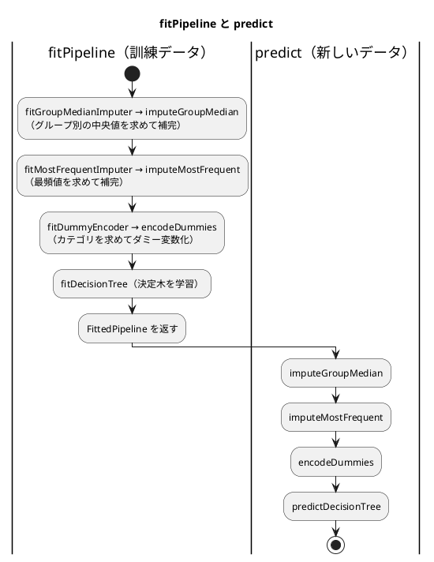

# 第 8 章: 実践的な分類と前処理パイプライン

## 8.1 はじめに

これまでの章のデータは、欠損値が少なく、特徴量もすべて数値でした。現実のデータはそうはいきません。この章で扱うタイタニック号の乗客データには、次の 3 つの難しさがあります。

- **欠損値が多い** — 年齢が 2 割近く欠けている
- **カテゴリ値がある** — 性別や乗船した港が文字列で記録されている
- **クラスが偏っている** — 生存者より死亡者のほうが多い

この章では、これらを 1 つずつ小さな部品として TDD で実装し、前処理からモデルまでを 1 つの **パイプライン** につなぎます。最後にそのパイプラインをファイルに保存し、読み込んで予測できるようにします。保存したモデルは、第 15 章で作る機械学習 API から使います。

[Python 版の第 8 章](../python/08-classification-and-preprocessing-pipeline.md) は scikit-learn の変換器・`Pipeline`・`class_weight` を、[Kotlin 版の第 8 章](../kotlin/08-classification-and-preprocessing-pipeline.md) は `interface Transformer` と Java のシリアライズを使いました。TypeScript 版には、次の 3 つの違いがあります。

- **学習した値はデータ、変換は関数にする** — 前処理の部品を、訓練データから求めた値（JSON にできるただのオブジェクト）と、その値を受け取って変換する関数に分ける。値を渡さなければ変換できないので、学習前に変換することはできない
- **クラスの重みを付けた決定木を自作する** — ml-cart の決定木にはクラスの重み付けが無い（[ADR 003](../../../adr/003-typescript-ml-libraries.md)）ので、第 3 章の決定木を重み付きに書き直す。ml-cart とは重み付けなしで突き合わせる
- **JSON で保存し、読み込むときに形を検証する** — `JSON.parse` の結果は型チェックを素通りするので、[zod](https://zod.dev/) のスキーマで形を確かめてから使う

「型は実行時に消える」ことに注目してください。この章の Red の多くは、型の上では正しく見えるのに、実行時の値が型と食い違っていたことから生まれています。

## 8.2 題材とデータ

### Survived.csv

`Survived.csv` には、乗客 891 人の情報が記録されています。

| 列 | 意味 | 値 | 欠損値 |
|----|------|-----|------|
| PassengerId | 乗客の番号 | 整数 | 0 件 |
| Survived | 生存したか（正解ラベル） | 1（生存）または 0（死亡） | 0 件 |
| Pclass | 客室クラス | 1, 2, 3 | 0 件 |
| Sex | 性別 | `male` または `female` | 0 件 |
| Age | 年齢 | 小数 | 177 件 |
| SibSp | 同乗した兄弟・配偶者の数 | 整数 | 0 件 |
| Parch | 同乗した親・子の数 | 整数 | 0 件 |
| Ticket | チケット番号 | 文字列 | 0 件 |
| Fare | 運賃 | 小数 | 0 件 |
| Cabin | 客室番号 | 文字列 | 687 件 |
| Embarked | 乗船した港 | `C`・`Q`・`S` | 2 件 |

正解ラベルは生存 342 人、死亡 549 人で、死亡のほうが 1.6 倍ほど多くなっています。列名は英語なので、TypeScript 版でもプロパティ名に列名をそのまま使います。

### 使う特徴量と、使わない列

特徴量には `Pclass`・`Sex`・`Age`・`SibSp`・`Parch`・`Fare`・`Embarked` の 7 列を使います。`PassengerId` と `Ticket` は乗客を区別するための値で、生存との関係は期待できません。`Cabin` は 891 件中 687 件が欠けているので、今回は使いません。

### 年齢はグループごとの中央値で補完する

年齢の欠損値を全体の平均値で補完すると、1 等客室の年配の乗客も、3 等客室の若い乗客も、同じ年齢で埋まってしまいます。そこで、客室クラスと性別の組み合わせ（グループ）ごとの中央値で補完します。平均値でなく中央値を使うのは、一部の高齢の乗客に値が引っ張られにくいからです。

グループ分けに正解ラベル（`Survived`）を使ってはいけません。予測するときには、その乗客が生存したかは分からないからです。グループ分けに使えるのは、予測の時点で分かっている特徴量だけです。

## 8.3 TODO リストの作成

**TODO リスト**:

- [ ] CSV を読み込む
- [ ] 年齢の欠損値を補完する
  - [ ] 同じグループの中央値で補完する
  - [ ] グループごとに異なる中央値で補完する
  - [ ] 訓練データで求めた中央値を、別のデータの補完に使う
  - [ ] 訓練データに無いグループは、全体の中央値で補完する
- [ ] 乗船した港の欠損値を、最も多い値で補完する
- [ ] カテゴリ値を 0 と 1 の列（ダミー変数）にする
  - [ ] 訓練データと別のデータで、同じ列を作る
- [ ] クラスの重みを付けた決定木を作る
- [ ] 前処理とモデルを 1 つのパイプラインにつなぐ
- [ ] モデルを保存して読み込む
- [ ] 正解率と、見つけた生存者の数で評価する
- [ ] 実データでクラスの重みの効果を確かめる

## 8.4 CSV を読み込む

### 列を型で表す

1 行を型で表します。特徴量の 7 列を `Passenger`（乗客 1 人分の特徴量）とし、残りの列を足したものを `SurvivedRow` にします。欠損値のある列は `| null` を付けます。

```typescript
// src/chapter08/survived-data.ts
/** 乗客 1 人分の特徴量 */
export interface Passenger {
  Pclass: number;
  Sex: string;
  Age: number | null;
  SibSp: number;
  Parch: number;
  Fare: number;
  Embarked: string | null;
}

export interface SurvivedRow extends Passenger {
  PassengerId: number;
  Survived: number;
  Ticket: string;
  Cabin: string | null;
}
```

`interface SurvivedRow extends Passenger` は、`Passenger` のプロパティをすべて受け継ぎ、4 つのプロパティを加えた型です。

### Red → Green: 第 2 章の読み込み方を使う

テストのデータは、架空の乗客 1 人分の CSV です。年齢と客室番号を空欄にしておきます。

```typescript
// test/chapter08/survived-classifier.test.ts
const HEADER =
  "\uFEFFPassengerId,Survived,Pclass,Sex,Age,SibSp,Parch,Ticket,Fare,Cabin,Embarked\n";

function writeCsv(rows: string): string {
  const directory = mkdtempSync(join(tmpdir(), "survived-"));
  const csvFile = join(directory, "survived.csv");
  writeFileSync(csvFile, HEADER + rows);
  return csvFile;
}

describe("loadSurvived", () => {
  it("BOM 付き CSV を読み込み、数値の列を数値に、空欄を null にする", () => {
    const rows = loadSurvived(writeCsv("1,0,3,male,,0,0,X-1,8.5,,S\n"));

    expect(rows[0]?.Pclass).toBe(3);
    expect(rows[0]?.Fare).toBe(8.5);
    expect(rows[0]?.Age).toBeNull();
    expect(rows[0]?.Cabin).toBeNull();
  });
});
```

```text
 FAIL  test/chapter08/survived-classifier.test.ts [ test/chapter08/survived-classifier.test.ts ]
Error: Cannot find module '../../src/chapter08/survived-data.ts' imported from test/chapter08/survived-classifier.test.ts
```

第 2 章の `loadIris` と同じく、csv-parse の `cast` で空欄を `null` に、それ以外を数値にします。第 2 章では正解ラベルの列だけを文字列のまま残しましたが、ここでは列名の行だけを残す形にしました。

```typescript
export function loadSurvived(csvFile: string): SurvivedRow[] {
  return parse<SurvivedRow>(readFileSync(csvFile), {
    bom: true,
    columns: true,
    cast: (value, context) => {
      if (context.header) {
        return value;
      }
      return value === "" ? null : Number(value);
    },
  });
}
```

### 三角測量: 文字列の列

性別 `Sex` と乗船した港 `Embarked` は、後でカテゴリ値として扱うので、文字列として読めていることを確かめます。

```typescript
  it("文字列の列は文字列のまま読み込む", () => {
    const rows = loadSurvived(writeCsv("1,0,3,male,,0,0,X-1,8.5,,S\n"));

    expect(rows[0]?.Sex).toBe("male");
    expect(rows[0]?.Embarked).toBe("S");
  });
```

```text
     × 文字列の列は文字列のまま読み込む 7ms
AssertionError: expected NaN to be 'male' // Object.is equality
- Expected:
"male"
+ Received:
NaN
      Tests  1 failed | 1 passed (2)
```

`Number("male")` は例外にならず、`NaN`（非数）を返します。そして型チェックは、この誤りに気づきません。`parse<SurvivedRow>` の型引数は「読み込んだ結果を `SurvivedRow` として扱う」という宣言で、`cast` が返す値が本当に `Sex: string` になっているかは確かめないからです。第 2 章で見た「型は実行時に確かめられていない」ことが、ここでも起きています。Kotlin 版では 1 文字の列が `Char` として読まれる、という逆向きの問題が起きました。型を推定するライブラリでも、型を宣言するだけの TypeScript でも、読み込んだ値の型はテストで確かめる必要があります。

文字列として残す列を並べ、それ以外を数値にします。

```typescript
const STRING_COLUMNS: readonly string[] = [
  "Sex",
  "Ticket",
  "Cabin",
  "Embarked",
];

export function loadSurvived(csvFile: string): SurvivedRow[] {
  return parse<SurvivedRow>(readFileSync(csvFile), {
    bom: true,
    columns: true,
    cast: (value, context) => {
      if (context.header) {
        return value;
      }
      if (value === "") {
        return null;
      }
      return STRING_COLUMNS.includes(String(context.column))
        ? value
        : Number(value);
    },
  });
}
```

`context.column` は、列名を指定した読み込み（`columns: true`）では列名の文字列ですが、型の上では列の番号（`number`）の場合も含むので、`String` で文字列にしてから比べています。

```text
      Tests  2 passed (2)
```

## 8.5 年齢をグループごとの中央値で補完する

### 学習した値と、変換する関数に分ける

Python 版は scikit-learn の変換器の約束（`fit` で値を求めて属性に覚え、`transform` で使う）に合わせ、Kotlin 版は `fit` が学習済みの別の型を返す `interface Transformer` を作りました。TypeScript 版は、1 つの部品を次の 2 つに分けます。

| 役割 | 形 | 例 |
|------|-----|-----|
| 訓練データから値を求める | `fit〜` 関数。求めた値をただのオブジェクトで返す | `fitGroupMedianImputer(x, "Age", ["Pclass", "Sex"])` |
| 求めた値で変換する | `〜` 関数。求めた値を引数で受け取る | `imputeGroupMedian(x, imputer)` |

変換する関数は、求めた値を引数で受け取らなければ呼べないので、`fit` する前に変換するコードは書けません。求めた値にはメソッドを持たせず、数値・文字列・配列・オブジェクトだけで作ります。こうしておくと、8.10 節でそのまま JSON にして保存できます。

`fit` と変換を分けておくと、**訓練データで `fit` し、テストデータには変換だけを使う** という、データリークを防ぐ使い方が自然に書けます。

### Red: 最初のテスト

同じグループ（1 等客室の女性）の中に、年齢 20・30・70 の乗客と、年齢が欠けた乗客がいるデータで試します。中央値は 30 です。テストのデータは、補完に必要な 3 つの列だけを持つオブジェクトです。

```typescript
describe("GroupMedianImputer", () => {
  it("同じグループの中央値で欠損値を補完する", () => {
    const x = [
      { Pclass: 1, Sex: "female", Age: 20 },
      { Pclass: 1, Sex: "female", Age: 30 },
      { Pclass: 1, Sex: "female", Age: 70 },
      { Pclass: 1, Sex: "female", Age: null },
    ];

    const imputer = fitGroupMedianImputer(x, "Age", ["Pclass", "Sex"]);

    const filled = imputeGroupMedian(x, imputer);
    expect(filled.map((row) => row.Age)).toEqual([20, 30, 70, 30]);
  });
});
```

```text
 FAIL  test/chapter08/survived-classifier.test.ts [ test/chapter08/survived-classifier.test.ts ]
Error: Cannot find module '../../src/chapter08/transformers.ts' imported from test/chapter08/survived-classifier.test.ts
```

### Green: 仮実装

補完した後の行の型から書きます。

```typescript
// src/chapter08/transformers.ts
/** 列 K の null を取り除いた行の型 */
export type Filled<R, K extends keyof R> = Omit<R, K> & {
  [P in K]: NonNullable<R[P]>;
};
```

- `Omit<R, K>` は、型 `R` から列 `K` を取り除いた型です
- `{ [P in K]: NonNullable<R[P]> }` は **マップ型** で、列 `K` の型から `null` と `undefined` を取り除きます
- 2 つを `&` でつなぐと、「列 `K` だけ `null` でなくなった `R`」になります。`Filled<Passenger, "Age">` の `Age` は `number` です

この型のおかげで、補完した後のデータを「年齢が `null` でないこと」を前提にする関数へ渡せます。8.9 節で、この型が前処理の順番の誤りを見つけます。

仮実装では、欠損値を 30 で埋めるだけにします。

```typescript
/** グループごとの中央値で補完するために、訓練データから求めた値 */
export interface GroupMedianImputer<K extends string, B extends string> {
  column: K;
  by: readonly B[];
}

export function fitGroupMedianImputer<K extends string, B extends string>(
  x: readonly (Record<K, number | null> & Record<B, unknown>)[],
  column: K,
  by: readonly B[],
): GroupMedianImputer<K, B> {
  return { column, by };
}

export function imputeGroupMedian<
  K extends string,
  B extends string,
  R extends Record<K, number | null> & Record<B, unknown>,
>(x: readonly R[], imputer: GroupMedianImputer<K, B>): Filled<R, K>[] {
  return x.map(
    (row) =>
      ({ ...row, [imputer.column]: row[imputer.column] ?? 30 }) as Filled<R, K>,
  );
}
```

- 補完する列 `K` とグループ分けに使う列 `B` を型引数にしたので、`Passenger` にも、テストの 3 列だけのオブジェクトにも使えます。`Record<K, number | null> & Record<B, unknown>` は「列 `K` は数値か `null`、列 `B` は何でもよい」という条件です
- `imputeGroupMedian` の型引数 `R` は、渡した行の型そのものです。補完に使わない列（`Passenger` の `Fare` など）も、型ごと結果に引き継がれます
- `{ ...row, [列名]: 値 }` は、行を **コピー** して 1 つの列だけを置き換えたオブジェクトを作ります。元の行は変更しません

### 三角測量: グループごとに異なる中央値

1 等客室の女性（40・50 → 中央値 45）と、3 等客室の男性（10・20 → 中央値 15）の 2 グループで試します。

```typescript
  it("グループごとに異なる中央値で補完する", () => {
    const x = [
      { Pclass: 1, Sex: "female", Age: 40 },
      { Pclass: 1, Sex: "female", Age: 50 },
      { Pclass: 1, Sex: "female", Age: null },
      { Pclass: 3, Sex: "male", Age: 10 },
      { Pclass: 3, Sex: "male", Age: 20 },
      { Pclass: 3, Sex: "male", Age: null },
    ];

    const imputer = fitGroupMedianImputer(x, "Age", ["Pclass", "Sex"]);

    const filled = imputeGroupMedian(x, imputer);
    expect(filled.map((row) => row.Age)).toEqual([40, 50, 45, 10, 20, 15]);
  });
```

```text
     × グループごとに異なる中央値で補完する 6ms
AssertionError: expected [ 40, 50, 30, 10, 20, 30 ] to deeply equal [ 40, 50, 45, 10, 20, 15 ]
      Tests  1 failed | 3 passed (4)
```

### 学習用テスト: 配列を Map のキーにできるか

グループごとに年齢を集めるには、`[客室クラス, 性別]` の組をキーにした `Map` が使えそうです。Kotlin 版では `listOf(1, "female")` をそのまま `Map` のキーにしました。JavaScript でも同じことができるかを、学習用テストで確かめます。

```typescript
describe("Map のキー（学習用テスト）", () => {
  it("配列のキーは要素の値ではなく、同じ配列かどうかで比べる", () => {
    const medians = new Map([[[1, "female"], 45]]);

    expect(medians.get([1, "female"])).toBeUndefined();
  });

  it("JSON の文字列にしたキーなら要素の値で引ける", () => {
    const medians = new Map([[JSON.stringify([1, "female"]), 45]]);

    expect(medians.get(JSON.stringify([1, "female"]))).toBe(45);
  });
});
```

2 つの学習用テストは、追加した時点で通ります。

JavaScript の `Map` は、配列やオブジェクトのキーを **同じ配列かどうか**（参照）で比べます。`[1, "female"]` と書くたびに別の配列が作られるので、要素が同じでも見つかりません。Kotlin の `List` は要素の値で等しさを比べるので、ここは言語の違いが出るところです。キーを `JSON.stringify` で `[1,"female"]` という文字列にすれば、文字列は値で比べられるので、グループのキーに使えます。

### Green: グループごとの中央値

```typescript
function median(values: readonly number[]): number {
  const sorted = values.toSorted((a, b) => a - b);
  const middle = Math.floor(sorted.length / 2);
  return sorted.length % 2 === 1
    ? (sorted[middle] as number)
    : ((sorted[middle - 1] as number) + (sorted[middle] as number)) / 2;
}

function groupKey<B extends string>(
  row: Record<B, unknown>,
  by: readonly B[],
): string {
  return JSON.stringify(by.map((name) => row[name]));
}

export function fitGroupMedianImputer<K extends string, B extends string>(
  x: readonly (Record<K, number | null> & Record<B, unknown>)[],
  column: K,
  by: readonly B[],
): GroupMedianImputer<K, B> {
  const groups = new Map<string, number[]>();
  for (const row of x) {
    const value = row[column];
    if (value === null) {
      continue;
    }
    const key = groupKey(row, by);
    groups.set(key, [...(groups.get(key) ?? []), value]);
  }
  const medians = new Map(
    [...groups].map(([key, values]) => [key, median(values)]),
  );
  return { column, by, medians };
}
```

`imputeGroupMedian` は、欠損値を `medians.get(groupKey(row, by))` で埋めるように変えます（`GroupMedianImputer` には `medians: Map<string, number>` を加えました）。

- `median` は、値を小さい順に並べ、件数が奇数なら真ん中の値、偶数なら真ん中の 2 つの平均を返します。`toSorted` は元の配列を変えずに並べ替えた新しい配列を返します。比較関数 `(a, b) => a - b` を省くと、数値が **文字列として** 並べ替えられる（10 が 9 より前になる）ので省けません
- 年齢が `null` の行は、グループに加える前に飛ばします。`value === null` を確かめた後では、`value` の型は `number` に絞り込まれています

```text
      Tests  6 passed (6)
```

### 訓練データで求めた値を別のデータに使う

データリークを防ぐための、この部品の一番大事な仕様です。訓練データ（2 等客室の男性 30・34 → 中央値 32）で `fit` し、別のデータを補完します。あわせて、訓練データに 1 人もいなかったグループの乗客を、全体の中央値で補完する仕様も書きます（訓練データの年齢 30・40・20 の中央値は 30）。

```typescript
  it("訓練データで求めた中央値を別のデータの補完に使う", () => {
    const train = [
      { Pclass: 2, Sex: "male", Age: 30 },
      { Pclass: 2, Sex: "male", Age: 34 },
    ];
    const other = [{ Pclass: 2, Sex: "male", Age: null }];

    const imputer = fitGroupMedianImputer(train, "Age", ["Pclass", "Sex"]);

    expect(imputeGroupMedian(other, imputer)[0]?.Age).toBe(32);
  });

  it("訓練データに無いグループは全体の中央値で補完する", () => {
    const train = [
      { Pclass: 1, Sex: "female", Age: 30 },
      { Pclass: 1, Sex: "female", Age: 40 },
      { Pclass: 3, Sex: "male", Age: 20 },
    ];
    const other = [{ Pclass: 2, Sex: "female", Age: null }];

    const imputer = fitGroupMedianImputer(train, "Age", ["Pclass", "Sex"]);

    expect(imputeGroupMedian(other, imputer)[0]?.Age).toBe(30);
  });
```

```text
     × 訓練データに無いグループは全体の中央値で補完する 4ms
AssertionError: expected undefined to be 30 // Object.is equality
- Expected:
30
+ Received:
undefined
      Tests  1 failed | 7 passed (8)
```

1 つ目は、`fit` と変換を分けてあるので追加した時点で通りました。2 つ目は、`Map` に無いキーを引いた `get` が `undefined` を返し、それがそのまま年齢に入りました。

見逃せないのは、戻り値の型の上では `Age` が `number` だったことです。`Map` の `get` の戻り値は `number | undefined` なので、本来は型チェックが知らせてくれるはずでした。知らせなかったのは、仮実装から残っている `as Filled<R, K>` が「この値は `Filled<R, K>` だ」と型チェックに **言い切った** からです。`as` は型を変換するのではなく、型チェックを黙らせるだけです。`as` を書いた式では、型の誤りを見つける役目をテストが担うことになります。

全体の中央値は `fit` で求めておき、グループの中央値が無ければ `??` で全体の中央値を使います。

```typescript
  const overallMedian = median([...groups.values()].flat());
  return { column, by, medians, overallMedian };
```

```typescript
  const { column, by, medians, overallMedian } = imputer;
  return x.map(
    (row) =>
      ({
        ...row,
        [column]:
          row[column] ?? medians.get(groupKey(row, by)) ?? overallMedian,
      }) as Filled<R, K>,
  );
```

`[...groups.values()].flat()` は、グループごとの年齢の配列をつないだ、`null` を除くすべての年齢です。`a ?? b ?? c` は、左から順に `null` でも `undefined` でもない最初の値を選びます。

```text
      Tests  8 passed (8)
```

元のデータを変更しないことも、テストで固定しておきます。スプレッド構文で行をコピーしているので、このテストは追加した時点で通ります。

```typescript
  it("元のデータは変更しない", () => {
    const x = [
      { Pclass: 1, Sex: "male", Age: 30 },
      { Pclass: 1, Sex: "male", Age: null },
    ];

    imputeGroupMedian(x, fitGroupMedianImputer(x, "Age", ["Pclass", "Sex"]));

    expect(x[1]?.Age).toBeNull();
  });
```

## 8.6 乗船した港を最頻値で補完する

`Embarked` は文字列なので、中央値は使えません。訓練データで最も多い値（最頻値）で補完します。仕組みは年齢の補完と同じなので、明白な実装で進めます。

```typescript
describe("MostFrequentImputer", () => {
  it("訓練データで最も多い値で欠損値を補完する", () => {
    const train = [
      { Embarked: "S" },
      { Embarked: "C" },
      { Embarked: "S" },
      { Embarked: null },
    ];
    const other = [{ Embarked: null }, { Embarked: "Q" }];

    const imputer = fitMostFrequentImputer(train, "Embarked");

    const filled = imputeMostFrequent(other, imputer);
    expect(filled.map((row) => row.Embarked)).toEqual(["S", "Q"]);
  });
});
```

```text
     × 訓練データで最も多い値で欠損値を補完する 5ms
TypeError: fitMostFrequentImputer is not a function
```

```typescript
/** 最も多い値で補完するために、訓練データから求めた値 */
export interface MostFrequentImputer<K extends string> {
  column: K;
  mostFrequent: string;
}

export function fitMostFrequentImputer<K extends string>(
  x: readonly Record<K, string | null>[],
  column: K,
): MostFrequentImputer<K> {
  const counts = new Map<string, number>();
  for (const row of x) {
    const value = row[column];
    if (value !== null) {
      counts.set(value, (counts.get(value) ?? 0) + 1);
    }
  }
  let mostFrequent = "";
  let mostCount = 0;
  for (const [value, count] of counts) {
    if (count > mostCount) {
      mostFrequent = value;
      mostCount = count;
    }
  }
  return { column, mostFrequent };
}

export function imputeMostFrequent<
  K extends string,
  R extends Record<K, string | null>,
>(x: readonly R[], imputer: MostFrequentImputer<K>): Filled<R, K>[] {
  const { column, mostFrequent } = imputer;
  return x.map(
    (row) =>
      ({ ...row, [column]: row[column] ?? mostFrequent }) as Filled<R, K>,
  );
}
```

値ごとの件数を `Map` で数え、最も多い値を選びます。`Map` は追加した順を覚えていて、件数が `>` で上回ったときだけ選び直すので、同数の値が複数あれば先に現れた値が選ばれます。第 3 章の `majority` と同じ選び方です。

```text
      Tests  10 passed (10)
```

## 8.7 カテゴリ値をダミー変数にする

### Red → Green: 素直な実装

決定木は、`male` のような文字列を直接扱えません。カテゴリごとに 0 と 1 の列を作る **ダミー変数** に変換します。まず、性別を `Sex_male` の 1 列にするテストを書きます。`male` と `female` の 2 列を作ると、片方がもう片方の裏返しになり情報が重複するので、最初のカテゴリの列を落とします。

```typescript
describe("DummyEncoder", () => {
  it("2 値のカテゴリを、最初のカテゴリを除いた 0 と 1 の列にする", () => {
    const x = [
      { Pclass: 1, Sex: "female" },
      { Pclass: 3, Sex: "male" },
      { Pclass: 2, Sex: "male" },
    ];

    const encoder = fitDummyEncoder(x, ["Sex"]);

    expect(encodeDummies(x, encoder)).toEqual([
      { Pclass: 1, Sex_male: 0 },
      { Pclass: 3, Sex_male: 1 },
      { Pclass: 2, Sex_male: 1 },
    ]);
  });
});
```

```text
     × 2 値のカテゴリを、最初のカテゴリを除いた 0 と 1 の列にする 4ms
TypeError: fitDummyEncoder is not a function
```

変換するデータ自身からカテゴリを求める、素直な実装にします。

```typescript
/** カテゴリの列 C を取り除き、ダミー変数の列（列名_カテゴリ）を加えた行の型 */
export type Encoded<R, C extends keyof R> = Omit<R, C> & Record<string, number>;

export interface DummyEncoder<C extends string> {
  columns: readonly C[];
}

export function fitDummyEncoder<C extends string>(
  x: readonly Record<C, string>[],
  columns: readonly C[],
): DummyEncoder<C> {
  return { columns };
}

function categoriesOf<C extends string>(
  x: readonly Record<C, string>[],
  column: C,
): string[] {
  return [...new Set(x.map((row) => row[column]))].toSorted();
}

export function encodeDummies<C extends string, R extends Record<C, string>>(
  x: readonly R[],
  encoder: DummyEncoder<C>,
): Encoded<R, C>[] {
  const dummies = encoder.columns.map(
    (column) => [column, categoriesOf(x, column).slice(1)] as const,
  );
  return x.map((row) => {
    const encoded: Record<string, unknown> = { ...row };
    for (const [column, categories] of dummies) {
      for (const category of categories) {
        encoded[`${column}_${category}`] = row[column] === category ? 1 : 0;
      }
      delete encoded[column];
    }
    return encoded as Encoded<R, C>;
  });
}
```

- `Encoded<R, C>` は、カテゴリの列を取り除き、名前が実行時に決まる数値の列を加えた型です。ダミー変数の列名（`Sex_male` など）はデータを見るまで分からないので、`Record<string, number>` としか書けません
- `categoriesOf` は、列の値を `Set` で重複なく集め、並べ替えます。`slice(1)` で最初のカテゴリを落とします
- 行をコピーした `encoded` に列を加え、最後に `delete` で元の列を取り除きます。コピーを書き換えているので、元の行は変わりません

```text
      Tests  11 passed (11)
```

### 三角測量: 別のデータにも同じ列を作る

Python 版で pandas の `get_dummies`、Kotlin 版で `pivotMatches` について確かめた落とし穴は、そのデータに含まれるカテゴリの列しか作らないことでした。素直な実装も同じ振る舞いをするはずです。仕様としてテストにします。

```typescript
  it("別のデータにも訓練データと同じ列を作る", () => {
    const train = [{ Embarked: "C" }, { Embarked: "Q" }, { Embarked: "S" }];
    const other = [{ Embarked: "S" }, { Embarked: "S" }];

    const encoder = fitDummyEncoder(train, ["Embarked"]);

    expect(encodeDummies(other, encoder)).toEqual([
      { Embarked_Q: 0, Embarked_S: 1 },
      { Embarked_Q: 0, Embarked_S: 1 },
    ]);
  });
```

```text
     × 別のデータにも訓練データと同じ列を作る 10ms
AssertionError: expected [ {}, {} ] to deeply equal [ …(2) ]
- Expected
+ Received
  [
-   {
-     "Embarked_Q": 0,
-     "Embarked_S": 1,
-   },
-   {
-     "Embarked_Q": 0,
-     "Embarked_S": 1,
-   },
+   {},
+   {},
  ]
      Tests  1 failed | 11 passed (12)
```

結果は空のオブジェクトでした。`S` しか無いデータでは、唯一のカテゴリである `S` まで「最初のカテゴリ」として落とされます。訓練データとテストデータ（や、API に届いた 1 人分のデータ）で別々に変換すると、列の数が変わり、モデルに渡せなくなります。

`fit` で訓練データのカテゴリを覚え、変換では覚えたカテゴリの列を作ります。

```typescript
export interface DummyEncoder<C extends string> {
  /** 列ごとの、ダミー変数にするカテゴリ（最初のカテゴリを除く） */
  dummies: Record<C, string[]>;
}

export function fitDummyEncoder<C extends string>(
  x: readonly Record<C, string>[],
  columns: readonly C[],
): DummyEncoder<C> {
  const dummies = Object.fromEntries(
    columns.map((column) => [column, categoriesOf(x, column).slice(1)]),
  ) as Record<C, string[]>;
  return { dummies };
}

export function encodeDummies<C extends string, R extends Record<C, string>>(
  x: readonly R[],
  encoder: DummyEncoder<C>,
): Encoded<R, C>[] {
  const columns = Object.keys(encoder.dummies) as C[];
  return x.map((row) => {
    const encoded: Record<string, unknown> = { ...row };
    for (const column of columns) {
      const categories = encoder.dummies[column];
      for (const category of categories) {
        encoded[`${column}_${category}`] = row[column] === category ? 1 : 0;
      }
      delete encoded[column];
    }
    return encoded as Encoded<R, C>;
  });
}
```

`Object.fromEntries` は `[キー, 値]` の組の配列からオブジェクトを作ります。オブジェクトも文字列のキーを追加した順に覚えているので、`Object.keys` は `Sex` → `Embarked` の順に列名を返し、ダミー変数の列はその順に末尾へ並びます。

```text
      Tests  12 passed (12)
```

## 8.8 クラスの重みを付けた決定木を作る

### なぜ自作するのか

死亡者のほうが多いデータで決定木を学習すると、死亡者を正しく分けることが優先され、生存者の見落としが増えがちです。scikit-learn では `class_weight="balanced"` を指定すると、少ないクラスの 1 件を重く数えて分割を選べます。

ところが、ml-cart の決定木はクラスの重み付けに対応していません（[ADR 003](../../../adr/003-typescript-ml-libraries.md)）。第 3 章の自作の決定木にも重みはありません。そこで、第 3 章の決定木を、1 件ごとの重みを受け取る形に書き直します。第 3 章のコードは変えず、この章の中に作ります。

### 重み付きのジニ不純度

重み付きのジニ不純度は、ラベルの **件数** の代わりに **重みの合計** で割合を求めます。

重み付きジニ不純度 = 1 − Σ（そのラベルの重みの合計 / 全体の重みの合計）²

重みがすべて 1 なら、第 3 章のジニ不純度と同じ値になるはずです。これを最初のテストにします。正解ラベルは、生存 1・死亡 0 の数値で表します。

```typescript
describe("weightedGini", () => {
  it("重みがすべて 1 なら第 3 章のジニ不純度と同じ値になる", () => {
    const labels = [0, 1, 1];

    expect(weightedGini(labels, [1, 1, 1])).toBe(gini(labels.map(String)));
  });
});
```

```text
 FAIL  test/chapter08/survived-classifier.test.ts [ test/chapter08/survived-classifier.test.ts ]
Error: Cannot find module '../../src/chapter08/decision-tree-classifier.ts' imported from test/chapter08/survived-classifier.test.ts
```

仮実装は、重みを無視して第 3 章の `gini` を呼ぶだけです。

```typescript
// src/chapter08/decision-tree-classifier.ts
import { gini } from "../chapter03/decision-tree.ts";

export function weightedGini(
  labels: readonly number[],
  weights: readonly number[],
): number {
  return gini(labels.map(String));
}
```

重みに差がある例で三角測量します。ラベル 0 の重みが 1、ラベル 1 の重みが 3 なら、割合は 0.25 と 0.75 で、不純度は 1 − (0.25² + 0.75²) = 0.375 です。

```typescript
  it("重みの大きいラベルほど多いものとして不純度を計算する", () => {
    expect(weightedGini([0, 1], [1, 3])).toBeCloseTo(0.375, 12);
  });
```

```text
     × 重みの大きいラベルほど多いものとして不純度を計算する 3ms
AssertionError: expected 0.5 to be close to 0.375, received difference is 0.125, but expected 5e-13
      Tests  1 failed | 13 passed (14)
```

```typescript
function sumWeightsByLabel(
  labels: readonly number[],
  weights: readonly number[],
): Map<number, number> {
  const sums = new Map<number, number>();
  labels.forEach((label, i) => {
    sums.set(label, (sums.get(label) ?? 0) + (weights[i] as number));
  });
  return sums;
}

function sum(values: readonly number[]): number {
  return values.reduce((total, value) => total + value, 0);
}

export function weightedGini(
  labels: readonly number[],
  weights: readonly number[],
): number {
  const total = sum(weights);
  let sumOfSquares = 0;
  for (const weight of sumWeightsByLabel(labels, weights).values()) {
    sumOfSquares += (weight / total) ** 2;
  }
  return 1 - sumOfSquares;
}
```

計算の形を第 3 章の `gini` とそろえてあります。重みがすべて 1 なら、重みの合計は件数と同じ整数になり、浮動小数点数の計算も同じ順に行われるので、1 つ目のテストは誤差を許容しない `toBe` のまま通ります。

```text
      Tests  14 passed (14)
```

### balanced の重み

scikit-learn の `balanced` と同じく、1 件の重みを「件数 / (クラスの数 × そのクラスの件数)」にします。ラベル 0 が 3 件、ラベル 1 が 1 件なら、0 の重みは 4 / (2 × 3)、1 の重みは 4 / (2 × 1) = 2 です。クラスごとの重みの合計は、どちらも 2 にそろいます。

```typescript
describe("balancedWeights", () => {
  it("少ないクラスほど 1 件の重みを大きくし、クラスごとの重みの合計をそろえる", () => {
    const weights = balancedWeights([0, 0, 0, 1]);

    expect(weights).toEqual([4 / 6, 4 / 6, 4 / 6, 2]);
    expect(weights[3]).toBeCloseTo(3 * (4 / 6), 12);
  });
});
```

```text
     × 少ないクラスほど 1 件の重みを大きくし、クラスごとの重みの合計をそろえる 4ms
TypeError: balancedWeights is not a function
```

定義どおりの明白な実装です。件数は、重みをすべて 1 にした `sumWeightsByLabel` で数えます。

```typescript
/** クラスの件数に反比例する重み（件数 / (クラスの数 × そのクラスの件数)）を 1 件ごとに求める */
export function balancedWeights(t: readonly number[]): number[] {
  const counts = sumWeightsByLabel(
    t,
    t.map(() => 1),
  );
  return t.map(
    (label) => t.length / (counts.size * (counts.get(label) as number)),
  );
}
```

### 重み付けなしなら第 3 章の決定木と同じ

木を作る処理は、第 3 章の `bestSplit`・`buildTree`・`predictOne` と同じ手順に、1 件ごとの重みを通すだけです。そこで、「重み付けなしなら第 3 章の決定木と同じ予測をする」ことを仕様にします。数値の特徴量 2 つと 0・1 のラベルを持つ架空のデータで、深さを 3 通りに変えて比べます。

```typescript
describe("fitDecisionTree", () => {
  const x = [
    { Fare: 8, Age: 30 },
    { Fare: 9, Age: 22 },
    { Fare: 13, Age: 18 },
    { Fare: 20, Age: 45 },
    { Fare: 60, Age: 25 },
    { Fare: 80, Age: 33 },
  ];
  const t = [0, 0, 1, 0, 1, 1];

  it.each([1, 2, undefined])(
    "重み付けなしなら第 3 章の決定木と同じ予測をする（深さ %s）",
    (maxDepth) => {
      const expected = new DecisionTree({ maxDepth })
        .fit(x, t.map(String))
        .predict(x);

      const tree = fitDecisionTree(x, t, { maxDepth, classWeight: "none" });

      expect(predictDecisionTree(tree, x).map(String)).toEqual(expected);
    },
  );
});
```

```text
     × 重み付けなしなら第 3 章の決定木と同じ予測をする（深さ 1） 5ms
     × 重み付けなしなら第 3 章の決定木と同じ予測をする（深さ 2） 1ms
     × 重み付けなしなら第 3 章の決定木と同じ予測をする（深さ undefined） 0ms
```

第 3 章で作った手順をなぞる明白な実装です。クラスの重みの指定は、まず `"none"` だけを持つ型にします。木は第 3 章と同じ判別可能なユニオンですが、JSON で保存することを見越して、分割の情報を節に直接持たせ、不純度は持たせません。

```typescript
export type ClassWeight = "none";

export type WeightedTree =
  | { kind: "leaf"; label: number }
  | {
      kind: "node";
      feature: string;
      threshold: number;
      left: WeightedTree;
      right: WeightedTree;
    };

export interface DecisionTreeOptions {
  /** 木の深さの上限。undefined なら制限しない */
  maxDepth: number | undefined;
  classWeight: ClassWeight;
}

export function fitDecisionTree(
  x: readonly Record<string, number>[],
  t: readonly number[],
  options: DecisionTreeOptions,
): WeightedTree {
  return buildTree(
    x,
    t,
    t.map(() => 1),
    options.maxDepth,
  );
}
```

`bestSplit`・`weightedMajority`・`buildTree`・`predictOne` は完成コードを参照してください。第 3 章との違いは次の 3 点です。

- 値と元の位置の組を値の順に並べ（`toSorted` は安定な並べ替えなので、同じ値の並び順は第 3 章と同じ）、同じ順でラベルと重みを取り出します
- 不純度を件数でなく重みの合計で重み付けし、葉のラベルを件数でなく重みの合計の多数決（`weightedMajority`）で決めます
- 第 3 章の `DecisionTree` はクラスで、学習した木をプロパティに持ちました。ここでは前処理と同じく、`fitDecisionTree` が学習した木（ただのデータ）を返し、`predictDecisionTree` がそれを受け取ります

特徴量の型を第 3 章の `Record<K, number>` から `Record<string, number>` に変えたのは、ダミー変数の列名が実行時に決まるからです。

```text
      Tests  18 passed (18)
```

### balanced で予測が変わる

`balanced` にすると予測が変わる例を作ります。運賃が 1 の乗客 4 人（全員死亡）と、2 の乗客 3 人（死亡 2 人・生存 1 人）です。分けられる境界は 1.5 しかないので、深さ 1 の木の右の葉には、死亡 2 人と生存 1 人が入ります。

- 重み付けなし: 死亡 2 件 対 生存 1 件で、右の葉は死亡（0）
- balanced: 死亡 6 件・生存 1 件なので、死亡の重みは 7 / 12、生存の重みは 7 / 2。右の葉は死亡 2 × 7/12 ≒ 1.17 対 生存 3.5 で、生存（1）

```typescript
  it("balanced にすると少ないクラスが混ざった葉でも少ないクラスを予測する", () => {
    const fares = [1, 1, 1, 1, 2, 2, 2].map((Fare) => ({ Fare }));
    const survived = [0, 0, 0, 0, 0, 0, 1];
    const newX = [{ Fare: 1 }, { Fare: 2 }];

    const none = fitDecisionTree(fares, survived, {
      maxDepth: 1,
      classWeight: "none",
    });
    const balanced = fitDecisionTree(fares, survived, {
      maxDepth: 1,
      classWeight: "balanced",
    });

    expect(predictDecisionTree(none, newX)).toEqual([0, 0]);
    expect(predictDecisionTree(balanced, newX)).toEqual([0, 1]);
  });
```

Vitest は型の誤りを無視して実行するので、テストは値の違いで失敗します。型チェックは、`"balanced"` がまだ指定できる値ではないことを知らせます。

```text
     × balanced にすると少ないクラスが混ざった葉でも少ないクラスを予測する 6ms
AssertionError: expected [ +0, +0 ] to deeply equal [ +0, 1 ]
- Expected
+ Received
  [
    0,
-   1,
+   0,
  ]
```

```text
test/chapter08/survived-classifier.test.ts(235,7): error TS2322: Type '"balanced"' is not assignable to type '"none"'.
```

指定できる値を配列にまとめ、その要素の型を `ClassWeight` にします。重みの作り方は `switch` で分けます。

```typescript
export const CLASS_WEIGHTS = ["none", "balanced"] as const;
export type ClassWeight = (typeof CLASS_WEIGHTS)[number];
```

```typescript
export function fitDecisionTree(
  x: readonly Record<string, number>[],
  t: readonly number[],
  options: DecisionTreeOptions,
): WeightedTree {
  return buildTree(
    x,
    t,
    classWeights(t, options.classWeight),
    options.maxDepth,
  );
}

function classWeights(
  t: readonly number[],
  classWeight: ClassWeight,
): number[] {
  switch (classWeight) {
    case "none":
      return t.map(() => 1);
    case "balanced":
      return balancedWeights(t);
    default: {
      const unreachable: never = classWeight;
      return unreachable;
    }
  }
}
```

```text
      Tests  19 passed (19)
```

- `CLASS_WEIGHTS` は、8.12 節で重み付けの有無を順に試すときにも使います。値の一覧と型を 1 か所で定義できるのが、`as const` の配列から型を作る書き方の利点です
- 第 3 章の `predictOne` と同じく、`default` の `never` で場合分けの漏れを型チェックに見つけさせます。`CLASS_WEIGHTS` に 3 つ目の値を足すと、ここが型の誤りになり、重みの作り方を書き忘れることがありません
- Python 版の `class_weight="balanced"` は文字列なので、`"balanse"` のような打ち間違いは実行するまで分かりません。TypeScript の文字列リテラル型では、打ち間違いが型の誤りになります。本シリーズでは `tsconfig.json` の `erasableSyntaxOnly` を有効にしていて `enum` を使えない（[第 1 章](01-machine-learning-and-first-test.md)）ので、Kotlin 版の `enum class` の代わりに文字列リテラル型を使います

## 8.9 前処理とモデルをパイプラインにつなぐ

### 特徴量と正解ラベルに分ける

使う特徴量の列を `FEATURES` にまとめ、特徴量と `Survived` 列に分ける関数を作ります。

```typescript
describe("splitFeaturesAndTarget", () => {
  it("特徴量の列と Survived 列に分ける", () => {
    const rows = [
      {
        PassengerId: 1,
        Survived: 1,
        Pclass: 2,
        Sex: "female",
        Age: 28,
        SibSp: 0,
        Parch: 1,
        Ticket: "X-2",
        Fare: 15,
        Cabin: null,
        Embarked: "C",
      },
    ];

    const { x, t } = splitFeaturesAndTarget(rows);

    expect(Object.keys(x[0] ?? {})).toEqual([...FEATURES]);
    expect(t).toEqual([1]);
  });
});
```

テスト用に、乗客のデータを作るヘルパーと、架空の乗客 8 人の訓練データ、予測に使う 2 人のデータも用意します。女性が生存、男性が死亡という単純な規則にしておくと、欠損値を含む新しい乗客の予測結果を期待値として書けます。

```typescript
type PassengerValues = [
  Pclass: number,
  Sex: string,
  Age: number | null,
  SibSp: number,
  Parch: number,
  Fare: number,
  Embarked: string | null,
];

function passengers(...rows: PassengerValues[]): Passenger[] {
  return rows.map(([Pclass, Sex, Age, SibSp, Parch, Fare, Embarked]) => ({
    Pclass,
    Sex,
    Age,
    SibSp,
    Parch,
    Fare,
    Embarked,
  }));
}

function trainingData(): { x: Passenger[]; t: number[] } {
  const x = passengers(
    [1, "female", 30, 0, 0, 80, "C"],
    [2, "female", null, 1, 0, 20, "S"],
    [3, "female", 22, 0, 1, 9, null],
    [3, "female", 18, 0, 0, 8, "Q"],
    [1, "male", 45, 0, 0, 60, "S"],
    [2, "male", null, 0, 0, 13, "S"],
    [3, "male", 25, 1, 0, 7, "S"],
    [3, "male", 33, 0, 0, 8, null],
  );
  return { x, t: [1, 1, 1, 1, 0, 0, 0, 0] };
}

function newPassengers(): Passenger[] {
  return passengers(
    [2, "female", null, 0, 0, 12, null],
    [1, "male", null, 1, 1, 70, "C"],
  );
}

describe("fitPipeline", () => {
  it("欠損値を含むデータで学習して予測できる", () => {
    const { x, t } = trainingData();

    const pipeline = fitPipeline(x, t, { maxDepth: 3, classWeight: "none" });

    expect(predict(pipeline, newPassengers())).toEqual([1, 0]);
  });
});
```

- `PassengerValues` は **ラベル付きのタプル型** です。要素の数と順番と型が決まった配列で、`Pclass:` のようなラベルは、エディタでの表示と読みやすさのためのものです。値を 1 つ飛ばしたり、順番を取り違えて文字列と数値を入れ替えたりすると、型の誤りになります
- `...rows` は **残余引数** で、乗客 1 人分のタプルを何個でも受け取ります
- 訓練データの 2 等客室の女性は 1 人だけで、年齢が欠けています。Kotlin 版では、このようなグループでパイプラインのテストが失敗しました（8.11 節で扱います）

```text
 FAIL  test/chapter08/survived-classifier.test.ts [ test/chapter08/survived-classifier.test.ts ]
Error: Cannot find module '../../src/chapter08/pipeline.ts' imported from test/chapter08/survived-classifier.test.ts
```

### パイプラインで学習して予測する

```typescript
// src/chapter08/survived-data.ts
export const FEATURES = [
  "Pclass",
  "Sex",
  "Age",
  "SibSp",
  "Parch",
  "Fare",
  "Embarked",
] as const;
export const TARGET = "Survived";
```

```typescript
export function splitFeaturesAndTarget(rows: readonly SurvivedRow[]): {
  x: Passenger[];
  t: number[];
} {
  return {
    x: rows.map(
      ({
        PassengerId: _id,
        Survived: _survived,
        Ticket: _ticket,
        Cabin: _cabin,
        ...features
      }) => features,
    ),
    t: rows.map((row) => row[TARGET]),
  };
}
```

第 2 章と同じく、分割代入で特徴量でない 4 列を取り除き、残り（`...features`）を返します。残りのプロパティは元の列の順に並ぶので、`Object.keys` の結果は `FEATURES` と同じ順になります。

パイプラインは、学習した部品の値をまとめた型と、それを作る関数・使う関数で表します。

```typescript
// src/chapter08/pipeline.ts
/** 学習済みの前処理とモデル。予測するときは、ここに覚えた値だけを使う */
export interface FittedPipeline {
  age: GroupMedianImputer<"Age", "Pclass" | "Sex">;
  embarked: MostFrequentImputer<"Embarked">;
  dummies: DummyEncoder<"Sex" | "Embarked">;
  tree: WeightedTree;
}

/** 前処理を順に学習・変換してから、決定木を学習する */
export function fitPipeline(
  x: readonly Passenger[],
  t: readonly number[],
  options: DecisionTreeOptions,
): FittedPipeline {
  const age = fitGroupMedianImputer(x, "Age", ["Pclass", "Sex"]);
  const ageFilled = imputeGroupMedian(x, age);
  const embarked = fitMostFrequentImputer(ageFilled, "Embarked");
  const complete = imputeMostFrequent(ageFilled, embarked);
  const dummies = fitDummyEncoder(complete, ["Sex", "Embarked"]);
  const tree = fitDecisionTree(encodeDummies(complete, dummies), t, options);
  return { age, embarked, dummies, tree };
}

/** 学習済みの前処理で、乗客のデータを決定木に渡せる数値の列にする */
export function transform(
  pipeline: FittedPipeline,
  x: readonly Passenger[],
): Record<string, number>[] {
  const ageFilled = imputeGroupMedian(x, pipeline.age);
  const complete = imputeMostFrequent(ageFilled, pipeline.embarked);
  return encodeDummies(complete, pipeline.dummies);
}

export function predict(
  pipeline: FittedPipeline,
  x: readonly Passenger[],
): number[] {
  return predictDecisionTree(pipeline.tree, transform(pipeline, x));
}
```

```text
      Tests  21 passed (21)
```

Python 版と Kotlin 版は、変換器のリストを受け取る汎用の `Pipeline` を作りました。TypeScript 版は、部品を順に呼ぶ関数を書いています。部品ごとに入力と出力の型が違う（年齢を補完すると `Age` が `number` に、港を補完すると `Embarked` が `string` に、ダミー変数にすると数値だけのレコードになる）ので、関数を順に呼ぶ形のほうが、各段階の型をそのまま型チェックに任せられるからです。

その効果を確かめるために、港の補完を飛ばして、年齢だけを補完したデータでダミー変数の値を求めるように書き換えてみます（`fitDummyEncoder(ageFilled, ...)`）。

```text
src/chapter08/pipeline.ts(38,35): error TS2345: Argument of type 'Filled<Passenger, "Age">[]' is not assignable to parameter of type 'readonly Record<"Sex" | "Embarked", string>[]'.
  Type 'Filled<Passenger, "Age">' is not assignable to type 'Record<"Sex" | "Embarked", string>'.
    Types of property 'Embarked' are incompatible.
      Type 'string | null' is not assignable to type 'string'.
        Type 'null' is not assignable to type 'string'.
```

`Embarked` にまだ `null` が残っていることを、型チェックが知らせました。前処理の順番の誤りを、実行する前に見つけられます（確かめた後、元に戻しています）。

`fitPipeline` と `predict` は、次のように各部品を順に呼び出します。



`fitPipeline` のときだけ各部品が値を求め、`predict` のときは求めた値を使うだけです。

## 8.10 モデルを保存して読み込む

### JSON で保存する

学習済みのパイプラインをファイルに保存しておけば、学習をやり直さずに予測だけを行えます。保存するのはモデル単体ではなく **パイプライン全体** です。前処理で求めた中央値やカテゴリも一緒に保存しないと、読み込んだ側で同じ前処理を再現できないからです。

```typescript
describe("saveModel と loadModel", () => {
  it("保存したパイプラインを読み込むと同じ予測をする", () => {
    const { x, t } = trainingData();
    const pipeline = fitPipeline(x, t, { maxDepth: 3, classWeight: "none" });
    const directory = mkdtempSync(join(tmpdir(), "model-"));
    const modelFile = join(directory, "model", "survived.json");

    saveModel(pipeline, modelFile);
    const loaded = loadModel(modelFile);

    expect(predict(loaded, newPassengers())).toEqual([1, 0]);
  });
});
```

```text
     × 保存したパイプラインを読み込むと同じ予測をする 5ms
TypeError: saveModel is not a function
```

`FittedPipeline` はメソッドを持たないただのデータなので、`JSON.stringify` で文字列にし、`JSON.parse` で戻せるはずです。

```typescript
export function saveModel(pipeline: FittedPipeline, modelFile: string): void {
  mkdirSync(dirname(modelFile), { recursive: true });
  writeFileSync(modelFile, JSON.stringify(pipeline));
}

export function loadModel(modelFile: string): FittedPipeline {
  return JSON.parse(readFileSync(modelFile, "utf8")) as FittedPipeline;
}
```

```text
     × 保存したパイプラインを読み込むと同じ予測をする 14ms
TypeError: medians.get is not a function
 ❯ src/chapter08/transformers.ts:61:34
     59|         ...row,
     60|         [column]:
     61|           row[column] ?? medians.get(groupKey(row, by)) ?? overallMedi…
       |                                  ^
 ❯ imputeGroupMedian src/chapter08/transformers.ts:56:12
 ❯ transform src/chapter08/pipeline.ts:50:21
 ❯ predict src/chapter08/pipeline.ts:59:45
      Tests  1 failed | 21 passed (22)
```

読み込んだパイプラインの `medians` は、`Map` ではありませんでした。`JSON.stringify` は、オブジェクトの列挙できるプロパティだけを書き出します。`Map` の中身はプロパティではないので、`{}` になります。読み込んだ側では、`medians` はメソッドを持たない空のオブジェクトで、`get` を呼べずに失敗しました。

`loadModel` の `as FittedPipeline` が、ここでも誤りを隠しています。型の上では `medians` は `Map` でしたが、実際には違いました。JSON にできる値は、文字列・数値・真偽値・`null`・配列・オブジェクトだけです。8.5 節で「求めた値は数値・文字列・配列・オブジェクトだけで作る」と決めたのに、グループを集めるのに便利な `Map` をそのまま残していました。`medians` を、文字列のキーを持つオブジェクト（`Record<string, number>`）に変えます。

```typescript
  /** グループのキー（JSON の文字列）ごとの中央値 */
  medians: Record<string, number>;
```

```typescript
  const medians = Object.fromEntries(
    [...groups].map(([key, values]) => [key, median(values)]),
  );
```

```typescript
        [column]: row[column] ?? medians[groupKey(row, by)] ?? overallMedian,
```

`noUncheckedIndexedAccess` を有効にしているので、`medians[キー]` の型は `number | undefined` です。無いキーを引くと `undefined` になることを、型が表しています。

```text
      Tests  22 passed (22)
```

失敗の原因は、8.5 節の `Map` の学習用テストに加えて残しておきます。

```typescript
  it("Map を JSON の文字列にすると中身が失われる", () => {
    const medians = new Map([['[1,"female"]', 45]]);

    expect(JSON.stringify({ medians })).toBe('{"medians":{}}');
  });
```

### 読み込んだ JSON の形を確かめる

Kotlin 版では、Java のシリアライズがファイルに書かれたクラスのオブジェクトを **何でも** 作ってしまう危険を、`ObjectInputFilter` の許可リストで防ぎました。`JSON.parse` は文字列・数値・配列・オブジェクトといった値を作るだけで、クラスのオブジェクトを作ったり処理を実行したりはしません。その点では安全です。

一方で、`JSON.parse` の戻り値の型は `any` で、何が入っているかは分かりません。`as FittedPipeline` と書いても、中身は確かめられていないことを、いま見たばかりです。形の違うファイルを読み込むとどうなるかを、テストに書きます。

```typescript
  it("パイプラインの形をしていないファイルは読み込まない", () => {
    const directory = mkdtempSync(join(tmpdir(), "model-"));
    const modelFile = join(directory, "unknown.json");
    writeFileSync(modelFile, JSON.stringify({ tree: { kind: "leaf" } }));

    expect(() => loadModel(modelFile)).toThrow();
  });
```

```text
     × パイプラインの形をしていないファイルは読み込まない 12ms
AssertionError: expected [Function] to throw an error
      Tests  1 failed | 23 passed (24)
```

形の違うファイルでも、`loadModel` は何も言わずに読み込みを終えました。このまま予測すると、`pipeline.age` が無いので、補完の途中で分かりにくい例外になります。誤りは、読み込んだ時点で分かるほうが原因を追いやすくなります。

[zod](https://zod.dev/) は、値の形を **スキーマ** で宣言し、実行時にその形かどうかを確かめるライブラリです。第 15 章の API で入力の検証に使うので、ここで先に使います（[ADR 003](../../../adr/003-typescript-ml-libraries.md)）。

```typescript
const treeSchema: z.ZodType<WeightedTree> = z.lazy(() =>
  z.discriminatedUnion("kind", [
    z.object({ kind: z.literal("leaf"), label: z.number() }),
    z.object({
      kind: z.literal("node"),
      feature: z.string(),
      threshold: z.number(),
      left: treeSchema,
      right: treeSchema,
    }),
  ]),
);

/** 保存したパイプラインの形。読み込んだ JSON がこの形でなければ読み込みを止める */
const pipelineSchema: z.ZodType<FittedPipeline> = z.object({
  age: z.object({
    column: z.literal("Age"),
    by: z.array(z.enum(["Pclass", "Sex"])),
    medians: z.record(z.string(), z.number()),
    overallMedian: z.number(),
  }),
  embarked: z.object({
    column: z.literal("Embarked"),
    mostFrequent: z.string(),
  }),
  dummies: z.object({
    dummies: z.object({
      Sex: z.array(z.string()),
      Embarked: z.array(z.string()),
    }),
  }),
  tree: treeSchema,
});

export function loadModel(modelFile: string): FittedPipeline {
  return pipelineSchema.parse(JSON.parse(readFileSync(modelFile, "utf8")));
}
```

- `z.object`・`z.number`・`z.literal` などを組み合わせて、`FittedPipeline` と同じ形を宣言します。`parse` は、値がスキーマに合えばその値を返し、合わなければ例外を投げます
- 木は自分自身を含む再帰的な型なので、`z.lazy` で「使うときに組み立てる」スキーマにします。`z.discriminatedUnion("kind", ...)` は、第 3 章の判別可能なユニオンと同じく、`kind` で場合を見分けます
- `z.ZodType<FittedPipeline>` と型を注釈したので、スキーマと `FittedPipeline` の型が食い違うと、型の誤りになります。試しに `overallMedian` を `z.string()` にすると、`The types of '_output.age.overallMedian' are incompatible between these types.` と知らせました。型とスキーマの二重管理を、型チェックが見張ります

```text
      Tests  24 passed (24)
```

形の違うファイルを読み込むと、zod は食い違った場所をすべて並べた `ZodError` を投げます。このテストのファイルでは、`age`・`embarked`・`dummies` が無いことと、`tree.label` が無いことの 4 つが報告されました。

```text
ZodError
[
  {
    "expected": "object",
    "code": "invalid_type",
    "path": [
      "age"
    ],
    "message": "Invalid input: expected object, received undefined"
  },
  ...
  {
    "expected": "number",
    "code": "invalid_type",
    "path": [
      "tree",
      "label"
    ],
    "message": "Invalid input: expected number, received undefined"
  }
]
```

### 乗客 1 人分を予測する

第 15 章の API は、乗客 1 人分のデータを受け取って予測を返します。そのための関数を用意しておきます。

```typescript
describe("predictPassenger", () => {
  it("乗客 1 人分のデータから、生存（1）か死亡（0）かを予測する", () => {
    const { x, t } = trainingData();
    const pipeline = fitPipeline(x, t, { maxDepth: 3, classWeight: "none" });
    const [female, male] = newPassengers() as [Passenger, Passenger];

    expect(predictPassenger(pipeline, female)).toBe(1);
    expect(predictPassenger(pipeline, male)).toBe(0);
  });
});
```

```typescript
/** 乗客 1 人分のデータから、生存（1）か死亡（0）かを予測する */
export function predictPassenger(
  pipeline: FittedPipeline,
  passenger: Passenger,
): number {
  return predict(pipeline, [passenger])[0] as number;
}
```

このテストは、次節の評価のテストと一緒に書いて Red を確かめました。型チェックは、`predictPassenger` がまだ無いことを知らせます。

```text
test/chapter08/survived-classifier.test.ts(17,3): error TS2305: Module '"../../src/chapter08/pipeline.ts"' has no exported member 'predictPassenger'.
```

1 人分の配列を渡すので、予測の配列には必ず 1 つの値が入ります。`noUncheckedIndexedAccess` では `[0]` の型が `number | undefined` になるので、`as number` で絞っています。

## 8.11 評価する

クラスの重みの効果を比べるために、正解率に加えて「実際の生存者のうち、何人を生存と予測できたか」を数えます。死亡者が多いデータでは、全員を死亡と予測しても正解率は 6 割を超えます。正解率だけを見ていると、生存者を見落とすモデルに気付けません（評価指標は第 11 章で詳しく扱います）。

```typescript
describe("evaluate", () => {
  it("正解率と見つけた生存者の数を求める", () => {
    const { x, t } = trainingData();
    const split = {
      xTrain: x,
      xTest: newPassengers(),
      tTrain: t,
      tTest: [1, 1],
    };
    const pipeline = fitPipeline(x, t, { maxDepth: 3, classWeight: "none" });

    expect(evaluate(pipeline, split)).toEqual({
      trainAccuracy: 1,
      testAccuracy: 0.5,
      foundSurvivors: 1,
      survivors: 2,
    });
  });
});
```

```text
 FAIL  test/chapter08/survived-classifier.test.ts [ test/chapter08/survived-classifier.test.ts ]
Error: Cannot find module '../../src/chapter08/evaluation.ts' imported from test/chapter08/survived-classifier.test.ts
```

```typescript
// src/chapter08/evaluation.ts
export interface Evaluation {
  trainAccuracy: number;
  testAccuracy: number;
  /** 実際の生存者のうち、生存と予測できた人数 */
  foundSurvivors: number;
  /** 実際の生存者の人数 */
  survivors: number;
}

function accuracy(
  predictions: readonly number[],
  labels: readonly number[],
): number {
  const correct = predictions.filter((p, i) => p === labels[i]).length;
  return correct / labels.length;
}

export function evaluate(
  pipeline: FittedPipeline,
  split: TrainTestSplit<Passenger, number>,
): Evaluation {
  const predictions = predict(pipeline, split.xTest);
  return {
    trainAccuracy: accuracy(predict(pipeline, split.xTrain), split.tTrain),
    testAccuracy: accuracy(predictions, split.tTest),
    foundSurvivors: predictions.filter(
      (p, i) => p === 1 && split.tTest[i] === 1,
    ).length,
    survivors: split.tTest.filter((t) => t === 1).length,
  };
}
```

- 訓練データとテストデータの組には、第 2 章の `TrainTestSplit` を再利用します。型は `TrainTestSplit<Passenger, number>` です。テストで渡したオブジェクトリテラルは、`TrainTestSplit` と書かなくても、形が同じなので受け取れます（構造的型付け）
- 第 1 章の `accuracy` は文字列のラベルを受け取るので、数値のラベル用に、同じ計算の関数をこのファイルの中に置いています

```text
      Tests  26 passed (26)
```

### Kotlin 版で見つかった仕様を残す

Kotlin 版では、8.9 節のパイプラインのテストが失敗しました。訓練データの 2 等客室の女性は 1 人だけで年齢が欠けているので、そのグループの中央値が求められず `null` になったためです。TypeScript 版では同じテストが最初から通りました。`fitGroupMedianImputer` は、年齢が `null` の行をグループに加える前に飛ばしているので、年齢がすべて欠けたグループは `Map` に現れず、「訓練データに無いグループ」と同じく全体の中央値で補完されるからです。

偶然通っていた振る舞いを、仕様として補完の単体テストに残しておきます（年齢 30・40 の中央値は 35）。

```typescript
  it("年齢がすべて欠けたグループは全体の中央値で補完する", () => {
    const x = [
      { Pclass: 1, Sex: "female", Age: 30 },
      { Pclass: 1, Sex: "female", Age: 40 },
      { Pclass: 2, Sex: "female", Age: null },
    ];

    const imputer = fitGroupMedianImputer(x, "Age", ["Pclass", "Sex"]);

    expect(imputeGroupMedian(x, imputer)[2]?.Age).toBe(35);
  });
```

```text
      Tests  27 passed (27)
```

**TODO リスト**:

- [x] CSV を読み込む
- [x] 年齢の欠損値を補完する
  - [x] 同じグループの中央値で補完する
  - [x] グループごとに異なる中央値で補完する
  - [x] 訓練データで求めた中央値を、別のデータの補完に使う
  - [x] 訓練データに無いグループは、全体の中央値で補完する
- [x] 乗船した港の欠損値を、最も多い値で補完する
- [x] カテゴリ値を 0 と 1 の列（ダミー変数）にする
  - [x] 訓練データと別のデータで、同じ列を作る
- [x] クラスの重みを付けた決定木を作る
- [x] 前処理とモデルを 1 つのパイプラインにつなぐ
- [x] モデルを保存して読み込む
- [x] 正解率と、見つけた生存者の数で評価する
- [ ] 実データでクラスの重みの効果を確かめる

## 8.12 実データでクラスの重みの効果を確かめる

### 実行する

Python 版と同じく、テストデータの割合 0.2・シード 0 で分け、深さ 5 の決定木でクラスの重みなし（`none`）と `balanced` を比べます。`balanced` のパイプラインを `apps/node/model/survived.json` に保存し、読み込んで架空の乗客 2 人を予測します。`model/` ディレクトリは `.gitignore` の対象です。

```typescript
// src/chapter08/main.ts
const TEST_SIZE = 0.2;
const SEED = 0;
const MAX_DEPTH = 5;

/** 学習済みのパイプラインの保存先（apps/node/model/ は .gitignore の対象） */
export const MODEL_FILE = "model/survived.json";

const NEW_PASSENGERS: Passenger[] = [
  {
    Pclass: 1,
    Sex: "female",
    Age: null,
    SibSp: 0,
    Parch: 0,
    Fare: 50,
    Embarked: "C",
  },
  {
    Pclass: 3,
    Sex: "male",
    Age: null,
    SibSp: 0,
    Parch: 0,
    Fare: 8,
    Embarked: "S",
  },
];

export function main(
  print: (line: string) => void = console.log,
  modelFile = MODEL_FILE,
): void {
  const rows = loadSurvived(join(dataDir(), "Survived.csv"));
  const { x, t } = splitFeaturesAndTarget(rows);
  const split = splitTrainTest(x, t, TEST_SIZE, SEED);
  const survivors = t.filter((label) => label === 1).length;
  print(
    `データ件数: ${rows.length}（生存 ${survivors}, 死亡 ${rows.length - survivors}）`,
  );
  print(
    `訓練データ: ${split.xTrain.length} 件, テストデータ: ${split.xTest.length} 件`,
  );

  const pipelines = Object.fromEntries(
    CLASS_WEIGHTS.map((classWeight) => [
      classWeight,
      fitPipeline(split.xTrain, split.tTrain, {
        maxDepth: MAX_DEPTH,
        classWeight,
      }),
    ]),
  ) as Record<ClassWeight, FittedPipeline>;
  for (const classWeight of CLASS_WEIGHTS) {
    const result = evaluate(pipelines[classWeight], split);
    print(
      `classWeight=${classWeight}: 訓練 ${result.trainAccuracy.toFixed(3)}, ` +
        `テスト ${result.testAccuracy.toFixed(3)}, ` +
        `生存者 ${result.survivors} 人中 ${result.foundSurvivors} 人を発見`,
    );
  }

  saveModel(pipelines.balanced, modelFile);
  const predictions = predict(loadModel(modelFile), NEW_PASSENGERS);
  print(`保存したモデル: ${basename(modelFile)}`);
  print(`架空の乗客の予測: [${predictions.join(", ")}]`);
}
```

- `modelFile` を引数にしたので、テストからは一時ディレクトリの保存先を渡せます。既定値の相対パスは、`apps/node/` で実行することを前提にしています
- `Record<ClassWeight, FittedPipeline>` は、`none` と `balanced` の両方のキーを持つオブジェクトの型です。`pipelines.balanced` のように、キーを打ち間違えずに取り出せます

```bash
node src/chapter08/main.ts
```

```text
データ件数: 891（生存 342, 死亡 549）
訓練データ: 712 件, テストデータ: 179 件
classWeight=none: 訓練 0.857, テスト 0.782, 生存者 67 人中 40 人を発見
classWeight=balanced: 訓練 0.836, テスト 0.743, 生存者 67 人中 50 人を発見
保存したモデル: survived.json
架空の乗客の予測: [1, 0]
```

Python 版では、`balanced` にするとテストデータの生存者 69 人のうち見つけられた人数が 45 人から 51 人に増えました。Kotlin 版の分割の深さ 5 では、逆に 46 人から 45 人に減りました。TypeScript 版の分割（第 2 章のとおり、テストデータに入る行が Python 版・Kotlin 版と違う）では、67 人のうち 40 人から 50 人に増えました。その代わり、テストデータの正解率は 0.782 から 0.743 に下がっています。死亡者を生存と予測する誤りが増えたからです。

読み込んだモデルは、年齢が欠けた架空の乗客 2 人（1 等客室の女性、3 等客室の男性）を、それぞれ生存（1）・死亡（0）と予測しました。欠損値の補完からダミー変数化まで、保存したパイプラインの中で行われています。

### 効果は深さによって変わる

深さを 1 から 10 まで変えて、見つけた生存者の数（テストデータの生存者は 67 人）と、テストデータの正解率を並べました。

| 深さ | 生存者（none） | 生存者（balanced） | テスト（none） | テスト（balanced） |
|------|--------------|------------------|--------------|------------------|
| 1 | 39 | 39 | 0.760 | 0.760 |
| 2 | 23 | 39 | 0.749 | 0.760 |
| 3 | 42 | 54 | 0.804 | 0.737 |
| 4 | 40 | 40 | 0.782 | 0.782 |
| 5 | 40 | 50 | 0.782 | 0.743 |
| 6 | 40 | 49 | 0.777 | 0.760 |
| 7 | 40 | 49 | 0.788 | 0.777 |
| 8 | 41 | 48 | 0.788 | 0.788 |
| 9 | 40 | 43 | 0.804 | 0.788 |
| 10 | 46 | 46 | 0.799 | 0.782 |

TypeScript 版の分割では、重みを付けて見つけた生存者が減った深さはありませんでした。ただし、深さ 1・4・10 では変わらず、深さ 3 では生存者が 12 人増える代わりにテストデータの正解率が 0.804 から 0.737 に下がりました。重みは分割の選び方を変えるので、どの深さでどちらに効くかは、データの分け方しだいです。

「`balanced` にすれば生存者の見落としが減る」は、この分割では多くの深さで成り立ちましたが、Kotlin 版の分割では成り立たない深さがありました。1 回の分割の結果から、いつでも成り立つ法則を導くことはできません。テストデータの結果を見て深さや重みを選び直すと、そのテストデータに合わせすぎた評価にもなります。本章では深さを Python 版と同じ 5 のままにし、選び方の正しい手順（交差検証）は第 11 章で扱います。

### 実データのテスト

実測した値と、ml-cart・第 3 章の決定木との突き合わせを、テストで固定します。

```typescript
// test/chapter08/survived-data.test.ts
const csvFile = join(dataDir(), "Survived.csv");

describe.skipIf(!existsSync(csvFile))("Survived.csv の実データ", () => {
  let split: TrainTestSplit<Passenger, number>;

  beforeAll(() => {
    const { x, t } = splitFeaturesAndTarget(loadSurvived(csvFile));
    split = splitTrainTest(x, t, 0.2, 0);
  });

  function evaluateWith(
    maxDepth: number,
    classWeight: ClassWeight,
  ): Evaluation {
    const options = { maxDepth, classWeight };
    return evaluate(fitPipeline(split.xTrain, split.tTrain, options), split);
  }

  /** 重み付けなしの自作の木と、前処理後のデータで学習した別の木の予測が違う件数 */
  function countDifferences(
    maxDepth: number,
    train: (
      x: Record<string, number>[],
      t: string[],
    ) => (rows: Record<string, number>[]) => string[],
  ): number {
    const options = { maxDepth, classWeight: "none" as const };
    const pipeline = fitPipeline(split.xTrain, split.tTrain, options);
    const xTrain = transform(pipeline, split.xTrain);
    const xTest = transform(pipeline, split.xTest);
    const other = train(xTrain, split.tTrain.map(String))(xTest);
    return predict(pipeline, split.xTest).filter(
      (label, i) => String(label) !== other[i],
    ).length;
  }

  it("実データの件数と欠損値の数を確認する", () => {
    const rows = loadSurvived(csvFile);

    const missing = (["Age", "Cabin", "Embarked"] as const).map(
      (column) => rows.filter((row) => row[column] === null).length,
    );

    expect(rows).toHaveLength(891);
    expect(missing).toEqual([177, 687, 2]);
  });

  it("深さ 5 では balanced にすると見つけられる生存者が増える", () => {
    expect(evaluateWith(5, "none").foundSurvivors).toBe(40);
    expect(evaluateWith(5, "balanced").foundSurvivors).toBe(50);
  });

  it("深さ 4 では balanced にしても評価が変わらない", () => {
    expect(evaluateWith(4, "balanced")).toEqual(evaluateWith(4, "none"));
  });

  it.each([1, 2, 3, 4, 5, 6])(
    "深さ %s では ml-cart と前処理後のテストデータの予測が一致する",
    (maxDepth) => {
      const mlCart = (x: Record<string, number>[], t: string[]) =>
        trainMlCart(x, t, { maxDepth });

      expect(countDifferences(maxDepth, mlCart)).toBe(0);
    },
  );

  it("深さ 7 では ml-cart と 8 件の予測が違う", () => {
    const mlCart = (x: Record<string, number>[], t: string[]) =>
      trainMlCart(x, t, { maxDepth: 7 });

    expect(countDifferences(7, mlCart)).toBe(8);
  });

  it("重み付けなしなら深さ 10 まで第 3 章の決定木と予測が一致する", () => {
    for (let maxDepth = 1; maxDepth <= 10; maxDepth++) {
      const chapter03 = (x: Record<string, number>[], t: string[]) => {
        const tree = new DecisionTree({ maxDepth }).fit(x, t);
        return (rows: Record<string, number>[]) => tree.predict(rows);
      };

      expect(countDifferences(maxDepth, chapter03)).toBe(0);
    }
  });
```

- `countDifferences` は、比べる相手の木の学習方法を関数（`train`）で受け取ります。第 3 章の `trainMlCart` は「学習して、予測する関数を返す」形だったので、第 3 章の `DecisionTree` も同じ形に包んでから渡しています
- 最後に、`main` を実行して表示とモデルの保存を確かめるテストがあります（完成コードを参照）

実データのテストは、実装を書いてから実データで値を確かめ、固定したものです。Red を経ていません。

- **ml-cart との突き合わせ** — 前処理した訓練データで、第 3 章の `trainMlCart`（葉にする件数 1、利得の下限 0）と重み付けなしの自作の木を学習させ、テストデータの予測を比べました。深さ 1〜6 は 179 件すべて一致し、深さ 7〜10 では 8・6・9・6 件の予測が違いました。違った行を自作の木でたどると、第 3 章で見つけた 3 つの違いのうち、境界ちょうどの値に当たった行はありませんでした。多数決が同数の葉に落ちた行は、深さ 9 で 2 件、深さ 10 で 4 件で、残り（深さ 7 の 8 件すべてを含む）は、木の形そのもの、つまり分割の選び方が違っていると考えられます。どの分割で違ったのかまでは、確かめていません
- **第 3 章の決定木との突き合わせ** — 重み付けなしの自作の木は、深さ 1〜10 のすべてで第 3 章の `DecisionTree` と予測が一致しました。重み付きに書き直しても、重みがすべて 1 なら第 3 章の木と同じ木になることを、実データでも確かめています

```bash
npx vitest run test/chapter08
```

```text
 Test Files  2 passed (2)
      Tests  39 passed (39)
```

第 8 章のテストは 39 件です。データが無い環境では、実データのテスト 12 件（パラメータ化した 6 件を含む）がスキップされます。

```bash
ML_DATA_DIR=/nonexistent npx vitest run test/chapter08
```

```text
 Test Files  1 passed | 1 skipped (2)
      Tests  27 passed | 12 skipped (39)
```

**TODO リスト**:

- [x] 実データでクラスの重みの効果を確かめる

## 8.13 Notebook で探索する

TypeScript 版では Notebook による探索と可視化を扱いません。クラス分布・性別と客室クラス別の生存率・木の深さと正解率のグラフ・混同行列・特徴量の重要度は、[Python 版の 8.12 節](../python/08-classification-and-preprocessing-pipeline.md) か [Kotlin 版の 8.13 節](../kotlin/08-classification-and-preprocessing-pipeline.md) を参照してください。

<details>
<summary>この章の完成コード（src/chapter08/survived-data.ts・transformers.ts）</summary>

```typescript
import { readFileSync } from "node:fs";
import { parse } from "csv-parse/sync";

export const FEATURES = [
  "Pclass",
  "Sex",
  "Age",
  "SibSp",
  "Parch",
  "Fare",
  "Embarked",
] as const;
export const TARGET = "Survived";

/** 乗客 1 人分の特徴量 */
export interface Passenger {
  Pclass: number;
  Sex: string;
  Age: number | null;
  SibSp: number;
  Parch: number;
  Fare: number;
  Embarked: string | null;
}

export interface SurvivedRow extends Passenger {
  PassengerId: number;
  Survived: number;
  Ticket: string;
  Cabin: string | null;
}

const STRING_COLUMNS: readonly string[] = [
  "Sex",
  "Ticket",
  "Cabin",
  "Embarked",
];

export function loadSurvived(csvFile: string): SurvivedRow[] {
  return parse<SurvivedRow>(readFileSync(csvFile), {
    bom: true,
    columns: true,
    cast: (value, context) => {
      if (context.header) {
        return value;
      }
      if (value === "") {
        return null;
      }
      return STRING_COLUMNS.includes(String(context.column))
        ? value
        : Number(value);
    },
  });
}

export function splitFeaturesAndTarget(rows: readonly SurvivedRow[]): {
  x: Passenger[];
  t: number[];
} {
  return {
    x: rows.map(
      ({
        PassengerId: _id,
        Survived: _survived,
        Ticket: _ticket,
        Cabin: _cabin,
        ...features
      }) => features,
    ),
    t: rows.map((row) => row[TARGET]),
  };
}
```

```typescript
/** 列 K の null を取り除いた行の型 */
export type Filled<R, K extends keyof R> = Omit<R, K> & {
  [P in K]: NonNullable<R[P]>;
};

/** グループごとの中央値で補完するために、訓練データから求めた値 */
export interface GroupMedianImputer<K extends string, B extends string> {
  column: K;
  by: readonly B[];
  /** グループのキー（JSON の文字列）ごとの中央値 */
  medians: Record<string, number>;
  overallMedian: number;
}

function median(values: readonly number[]): number {
  const sorted = values.toSorted((a, b) => a - b);
  const middle = Math.floor(sorted.length / 2);
  return sorted.length % 2 === 1
    ? (sorted[middle] as number)
    : ((sorted[middle - 1] as number) + (sorted[middle] as number)) / 2;
}

function groupKey<B extends string>(
  row: Record<B, unknown>,
  by: readonly B[],
): string {
  return JSON.stringify(by.map((name) => row[name]));
}

export function fitGroupMedianImputer<K extends string, B extends string>(
  x: readonly (Record<K, number | null> & Record<B, unknown>)[],
  column: K,
  by: readonly B[],
): GroupMedianImputer<K, B> {
  const groups = new Map<string, number[]>();
  for (const row of x) {
    const value = row[column];
    if (value === null) {
      continue;
    }
    const key = groupKey(row, by);
    groups.set(key, [...(groups.get(key) ?? []), value]);
  }
  const medians = Object.fromEntries(
    [...groups].map(([key, values]) => [key, median(values)]),
  );
  const overallMedian = median([...groups.values()].flat());
  return { column, by, medians, overallMedian };
}

export function imputeGroupMedian<
  K extends string,
  B extends string,
  R extends Record<K, number | null> & Record<B, unknown>,
>(x: readonly R[], imputer: GroupMedianImputer<K, B>): Filled<R, K>[] {
  const { column, by, medians, overallMedian } = imputer;
  return x.map(
    (row) =>
      ({
        ...row,
        [column]: row[column] ?? medians[groupKey(row, by)] ?? overallMedian,
      }) as Filled<R, K>,
  );
}

/** 最も多い値で補完するために、訓練データから求めた値 */
export interface MostFrequentImputer<K extends string> {
  column: K;
  mostFrequent: string;
}

export function fitMostFrequentImputer<K extends string>(
  x: readonly Record<K, string | null>[],
  column: K,
): MostFrequentImputer<K> {
  const counts = new Map<string, number>();
  for (const row of x) {
    const value = row[column];
    if (value !== null) {
      counts.set(value, (counts.get(value) ?? 0) + 1);
    }
  }
  let mostFrequent = "";
  let mostCount = 0;
  for (const [value, count] of counts) {
    if (count > mostCount) {
      mostFrequent = value;
      mostCount = count;
    }
  }
  return { column, mostFrequent };
}

export function imputeMostFrequent<
  K extends string,
  R extends Record<K, string | null>,
>(x: readonly R[], imputer: MostFrequentImputer<K>): Filled<R, K>[] {
  const { column, mostFrequent } = imputer;
  return x.map(
    (row) =>
      ({ ...row, [column]: row[column] ?? mostFrequent }) as Filled<R, K>,
  );
}

/** カテゴリの列 C を取り除き、ダミー変数の列（列名_カテゴリ）を加えた行の型 */
export type Encoded<R, C extends keyof R> = Omit<R, C> & Record<string, number>;

export interface DummyEncoder<C extends string> {
  /** 列ごとの、ダミー変数にするカテゴリ（最初のカテゴリを除く） */
  dummies: Record<C, string[]>;
}

function categoriesOf<C extends string>(
  x: readonly Record<C, string>[],
  column: C,
): string[] {
  return [...new Set(x.map((row) => row[column]))].toSorted();
}

export function fitDummyEncoder<C extends string>(
  x: readonly Record<C, string>[],
  columns: readonly C[],
): DummyEncoder<C> {
  const dummies = Object.fromEntries(
    columns.map((column) => [column, categoriesOf(x, column).slice(1)]),
  ) as Record<C, string[]>;
  return { dummies };
}

export function encodeDummies<C extends string, R extends Record<C, string>>(
  x: readonly R[],
  encoder: DummyEncoder<C>,
): Encoded<R, C>[] {
  const columns = Object.keys(encoder.dummies) as C[];
  return x.map((row) => {
    const encoded: Record<string, unknown> = { ...row };
    for (const column of columns) {
      const categories = encoder.dummies[column];
      for (const category of categories) {
        encoded[`${column}_${category}`] = row[column] === category ? 1 : 0;
      }
      delete encoded[column];
    }
    return encoded as Encoded<R, C>;
  });
}
```

</details>

<details>
<summary>この章の完成コード（src/chapter08/decision-tree-classifier.ts）</summary>

```typescript
function sumWeightsByLabel(
  labels: readonly number[],
  weights: readonly number[],
): Map<number, number> {
  const sums = new Map<number, number>();
  labels.forEach((label, i) => {
    sums.set(label, (sums.get(label) ?? 0) + (weights[i] as number));
  });
  return sums;
}

function sum(values: readonly number[]): number {
  return values.reduce((total, value) => total + value, 0);
}

export function weightedGini(
  labels: readonly number[],
  weights: readonly number[],
): number {
  const total = sum(weights);
  let sumOfSquares = 0;
  for (const weight of sumWeightsByLabel(labels, weights).values()) {
    sumOfSquares += (weight / total) ** 2;
  }
  return 1 - sumOfSquares;
}

/** クラスの件数に反比例する重み（件数 / (クラスの数 × そのクラスの件数)）を 1 件ごとに求める */
export function balancedWeights(t: readonly number[]): number[] {
  const counts = sumWeightsByLabel(
    t,
    t.map(() => 1),
  );
  return t.map(
    (label) => t.length / (counts.size * (counts.get(label) as number)),
  );
}

export const CLASS_WEIGHTS = ["none", "balanced"] as const;
export type ClassWeight = (typeof CLASS_WEIGHTS)[number];

export type WeightedTree =
  | { kind: "leaf"; label: number }
  | {
      kind: "node";
      feature: string;
      threshold: number;
      left: WeightedTree;
      right: WeightedTree;
    };

interface Candidate {
  feature: string;
  threshold: number;
  impurity: number;
}

function bestSplit(
  x: readonly Record<string, number>[],
  t: readonly number[],
  w: readonly number[],
): Candidate | null {
  if (weightedGini(t, w) === 0) {
    return null;
  }
  const total = sum(w);
  let best: Candidate | null = null;
  for (const feature of Object.keys(x[0] ?? {})) {
    const order = x
      .map((row, i) => ({ value: row[feature] as number, i }))
      .toSorted((a, b) => a.value - b.value);
    const labels = order.map(({ i }) => t[i] as number);
    const weights = order.map(({ i }) => w[i] as number);
    for (let i = 1; i < order.length; i++) {
      const previous = (order[i - 1] as { value: number }).value;
      const current = (order[i] as { value: number }).value;
      if (current === previous) {
        continue;
      }
      const left = weights.slice(0, i);
      const right = weights.slice(i);
      const impurity =
        (sum(left) * weightedGini(labels.slice(0, i), left) +
          sum(right) * weightedGini(labels.slice(i), right)) /
        total;
      if (best === null || impurity < best.impurity) {
        best = { feature, threshold: (previous + current) / 2, impurity };
      }
    }
  }
  return best;
}

function weightedMajority(t: readonly number[], w: readonly number[]): number {
  let best = 0;
  let bestWeight = 0;
  for (const [label, weight] of sumWeightsByLabel(t, w)) {
    if (weight > bestWeight) {
      best = label;
      bestWeight = weight;
    }
  }
  return best;
}

function pick<T>(items: readonly T[], positions: readonly number[]): T[] {
  return positions.map((i) => items[i] as T);
}

function buildTree(
  x: readonly Record<string, number>[],
  t: readonly number[],
  w: readonly number[],
  maxDepth: number | undefined,
): WeightedTree {
  const split = maxDepth === 0 ? null : bestSplit(x, t, w);
  if (split === null) {
    return { kind: "leaf", label: weightedMajority(t, w) };
  }
  const { feature, threshold } = split;
  const goesLeft = x.map((row) => (row[feature] as number) <= threshold);
  const left = goesLeft.flatMap((isLeft, i) => (isLeft ? [i] : []));
  const right = goesLeft.flatMap((isLeft, i) => (isLeft ? [] : [i]));
  const childDepth = maxDepth === undefined ? undefined : maxDepth - 1;
  return {
    kind: "node",
    feature,
    threshold,
    left: buildTree(pick(x, left), pick(t, left), pick(w, left), childDepth),
    right: buildTree(
      pick(x, right),
      pick(t, right),
      pick(w, right),
      childDepth,
    ),
  };
}

export interface DecisionTreeOptions {
  /** 木の深さの上限。undefined なら制限しない */
  maxDepth: number | undefined;
  classWeight: ClassWeight;
}

export function fitDecisionTree(
  x: readonly Record<string, number>[],
  t: readonly number[],
  options: DecisionTreeOptions,
): WeightedTree {
  return buildTree(
    x,
    t,
    classWeights(t, options.classWeight),
    options.maxDepth,
  );
}

function classWeights(
  t: readonly number[],
  classWeight: ClassWeight,
): number[] {
  switch (classWeight) {
    case "none":
      return t.map(() => 1);
    case "balanced":
      return balancedWeights(t);
    default: {
      const unreachable: never = classWeight;
      return unreachable;
    }
  }
}

function predictOne(tree: WeightedTree, row: Record<string, number>): number {
  switch (tree.kind) {
    case "leaf":
      return tree.label;
    case "node":
      return (row[tree.feature] as number) <= tree.threshold
        ? predictOne(tree.left, row)
        : predictOne(tree.right, row);
    default: {
      const unreachable: never = tree;
      return unreachable;
    }
  }
}

export function predictDecisionTree(
  tree: WeightedTree,
  x: readonly Record<string, number>[],
): number[] {
  return x.map((row) => predictOne(tree, row));
}
```

</details>

<details>
<summary>この章の完成コード（src/chapter08/pipeline.ts・evaluation.ts）</summary>

```typescript
import { mkdirSync, readFileSync, writeFileSync } from "node:fs";
import { dirname } from "node:path";
import { z } from "zod";
import {
  type DecisionTreeOptions,
  type WeightedTree,
  fitDecisionTree,
  predictDecisionTree,
} from "./decision-tree-classifier.ts";
import type { Passenger } from "./survived-data.ts";
import {
  type DummyEncoder,
  type GroupMedianImputer,
  type MostFrequentImputer,
  encodeDummies,
  fitDummyEncoder,
  fitGroupMedianImputer,
  fitMostFrequentImputer,
  imputeGroupMedian,
  imputeMostFrequent,
} from "./transformers.ts";

/** 学習済みの前処理とモデル。予測するときは、ここに覚えた値だけを使う */
export interface FittedPipeline {
  age: GroupMedianImputer<"Age", "Pclass" | "Sex">;
  embarked: MostFrequentImputer<"Embarked">;
  dummies: DummyEncoder<"Sex" | "Embarked">;
  tree: WeightedTree;
}

/** 前処理を順に学習・変換してから、決定木を学習する */
export function fitPipeline(
  x: readonly Passenger[],
  t: readonly number[],
  options: DecisionTreeOptions,
): FittedPipeline {
  const age = fitGroupMedianImputer(x, "Age", ["Pclass", "Sex"]);
  const ageFilled = imputeGroupMedian(x, age);
  const embarked = fitMostFrequentImputer(ageFilled, "Embarked");
  const complete = imputeMostFrequent(ageFilled, embarked);
  const dummies = fitDummyEncoder(complete, ["Sex", "Embarked"]);
  const tree = fitDecisionTree(encodeDummies(complete, dummies), t, options);
  return { age, embarked, dummies, tree };
}

/** 学習済みの前処理で、乗客のデータを決定木に渡せる数値の列にする */
export function transform(
  pipeline: FittedPipeline,
  x: readonly Passenger[],
): Record<string, number>[] {
  const ageFilled = imputeGroupMedian(x, pipeline.age);
  const complete = imputeMostFrequent(ageFilled, pipeline.embarked);
  return encodeDummies(complete, pipeline.dummies);
}

export function predict(
  pipeline: FittedPipeline,
  x: readonly Passenger[],
): number[] {
  return predictDecisionTree(pipeline.tree, transform(pipeline, x));
}

export function saveModel(pipeline: FittedPipeline, modelFile: string): void {
  mkdirSync(dirname(modelFile), { recursive: true });
  writeFileSync(modelFile, JSON.stringify(pipeline));
}

const treeSchema: z.ZodType<WeightedTree> = z.lazy(() =>
  z.discriminatedUnion("kind", [
    z.object({ kind: z.literal("leaf"), label: z.number() }),
    z.object({
      kind: z.literal("node"),
      feature: z.string(),
      threshold: z.number(),
      left: treeSchema,
      right: treeSchema,
    }),
  ]),
);

/** 保存したパイプラインの形。読み込んだ JSON がこの形でなければ読み込みを止める */
const pipelineSchema: z.ZodType<FittedPipeline> = z.object({
  age: z.object({
    column: z.literal("Age"),
    by: z.array(z.enum(["Pclass", "Sex"])),
    medians: z.record(z.string(), z.number()),
    overallMedian: z.number(),
  }),
  embarked: z.object({
    column: z.literal("Embarked"),
    mostFrequent: z.string(),
  }),
  dummies: z.object({
    dummies: z.object({
      Sex: z.array(z.string()),
      Embarked: z.array(z.string()),
    }),
  }),
  tree: treeSchema,
});

export function loadModel(modelFile: string): FittedPipeline {
  return pipelineSchema.parse(JSON.parse(readFileSync(modelFile, "utf8")));
}

/** 乗客 1 人分のデータから、生存（1）か死亡（0）かを予測する */
export function predictPassenger(
  pipeline: FittedPipeline,
  passenger: Passenger,
): number {
  return predict(pipeline, [passenger])[0] as number;
}
```

```typescript
import type { TrainTestSplit } from "../chapter02/iris-preprocessing.ts";
import { type FittedPipeline, predict } from "./pipeline.ts";
import type { Passenger } from "./survived-data.ts";

export interface Evaluation {
  trainAccuracy: number;
  testAccuracy: number;
  /** 実際の生存者のうち、生存と予測できた人数 */
  foundSurvivors: number;
  /** 実際の生存者の人数 */
  survivors: number;
}

function accuracy(
  predictions: readonly number[],
  labels: readonly number[],
): number {
  const correct = predictions.filter((p, i) => p === labels[i]).length;
  return correct / labels.length;
}

export function evaluate(
  pipeline: FittedPipeline,
  split: TrainTestSplit<Passenger, number>,
): Evaluation {
  const predictions = predict(pipeline, split.xTest);
  return {
    trainAccuracy: accuracy(predict(pipeline, split.xTrain), split.tTrain),
    testAccuracy: accuracy(predictions, split.tTest),
    foundSurvivors: predictions.filter(
      (p, i) => p === 1 && split.tTest[i] === 1,
    ).length,
    survivors: split.tTest.filter((t) => t === 1).length,
  };
}
```

</details>

<details>
<summary>この章の完成コード（test/chapter08/survived-data.test.ts）</summary>

```typescript
import { existsSync, mkdtempSync } from "node:fs";
import { tmpdir } from "node:os";
import { join } from "node:path";
import { beforeAll, describe, expect, it } from "vitest";
import {
  type TrainTestSplit,
  splitTrainTest,
} from "../../src/chapter02/iris-preprocessing.ts";
import { DecisionTree } from "../../src/chapter03/decision-tree.ts";
import { trainMlCart } from "../../src/chapter03/ml-cart-adapter.ts";
import type { ClassWeight } from "../../src/chapter08/decision-tree-classifier.ts";
import { type Evaluation, evaluate } from "../../src/chapter08/evaluation.ts";
import { main } from "../../src/chapter08/main.ts";
import {
  fitPipeline,
  predict,
  transform,
} from "../../src/chapter08/pipeline.ts";
import {
  type Passenger,
  loadSurvived,
  splitFeaturesAndTarget,
} from "../../src/chapter08/survived-data.ts";
import { dataDir } from "../../src/dataset.ts";

const csvFile = join(dataDir(), "Survived.csv");

describe.skipIf(!existsSync(csvFile))("Survived.csv の実データ", () => {
  let split: TrainTestSplit<Passenger, number>;

  beforeAll(() => {
    const { x, t } = splitFeaturesAndTarget(loadSurvived(csvFile));
    split = splitTrainTest(x, t, 0.2, 0);
  });

  function evaluateWith(
    maxDepth: number,
    classWeight: ClassWeight,
  ): Evaluation {
    const options = { maxDepth, classWeight };
    return evaluate(fitPipeline(split.xTrain, split.tTrain, options), split);
  }

  /** 重み付けなしの自作の木と、前処理後のデータで学習した別の木の予測が違う件数 */
  function countDifferences(
    maxDepth: number,
    train: (
      x: Record<string, number>[],
      t: string[],
    ) => (rows: Record<string, number>[]) => string[],
  ): number {
    const options = { maxDepth, classWeight: "none" as const };
    const pipeline = fitPipeline(split.xTrain, split.tTrain, options);
    const xTrain = transform(pipeline, split.xTrain);
    const xTest = transform(pipeline, split.xTest);
    const other = train(xTrain, split.tTrain.map(String))(xTest);
    return predict(pipeline, split.xTest).filter(
      (label, i) => String(label) !== other[i],
    ).length;
  }

  it("実データの件数と欠損値の数を確認する", () => {
    const rows = loadSurvived(csvFile);

    const missing = (["Age", "Cabin", "Embarked"] as const).map(
      (column) => rows.filter((row) => row[column] === null).length,
    );

    expect(rows).toHaveLength(891);
    expect(missing).toEqual([177, 687, 2]);
  });

  it("深さ 5 では balanced にすると見つけられる生存者が増える", () => {
    expect(evaluateWith(5, "none").foundSurvivors).toBe(40);
    expect(evaluateWith(5, "balanced").foundSurvivors).toBe(50);
  });

  it("深さ 4 では balanced にしても評価が変わらない", () => {
    expect(evaluateWith(4, "balanced")).toEqual(evaluateWith(4, "none"));
  });

  it.each([1, 2, 3, 4, 5, 6])(
    "深さ %s では ml-cart と前処理後のテストデータの予測が一致する",
    (maxDepth) => {
      const mlCart = (x: Record<string, number>[], t: string[]) =>
        trainMlCart(x, t, { maxDepth });

      expect(countDifferences(maxDepth, mlCart)).toBe(0);
    },
  );

  it("深さ 7 では ml-cart と 8 件の予測が違う", () => {
    const mlCart = (x: Record<string, number>[], t: string[]) =>
      trainMlCart(x, t, { maxDepth: 7 });

    expect(countDifferences(7, mlCart)).toBe(8);
  });

  it("重み付けなしなら深さ 10 まで第 3 章の決定木と予測が一致する", () => {
    for (let maxDepth = 1; maxDepth <= 10; maxDepth++) {
      const chapter03 = (x: Record<string, number>[], t: string[]) => {
        const tree = new DecisionTree({ maxDepth }).fit(x, t);
        return (rows: Record<string, number>[]) => tree.predict(rows);
      };

      expect(countDifferences(maxDepth, chapter03)).toBe(0);
    }
  });

  it("実行すると評価結果を表示してモデルを保存する", () => {
    const modelFile = join(
      mkdtempSync(join(tmpdir(), "model-")),
      "survived.json",
    );
    const lines: string[] = [];

    main((line) => lines.push(line), modelFile);

    expect(existsSync(modelFile)).toBe(true);
    expect(lines).toEqual([
      "データ件数: 891（生存 342, 死亡 549）",
      "訓練データ: 712 件, テストデータ: 179 件",
      "classWeight=none: 訓練 0.857, テスト 0.782, 生存者 67 人中 40 人を発見",
      "classWeight=balanced: 訓練 0.836, テスト 0.743, 生存者 67 人中 50 人を発見",
      "保存したモデル: survived.json",
      "架空の乗客の予測: [1, 0]",
    ]);
  });
});
```

</details>

## 8.14 まとめ

この章では、欠損値・カテゴリ値・クラスの偏りを含む現実的なデータで、前処理からモデルの保存までを TDD で実装しました。

1. **学習した値はデータ、変換は関数** — 補完とダミー変数化を、訓練データから求めた値（ただのオブジェクト）と、その値を受け取る変換の関数に分けた。値が無ければ変換できないので学習前の変換は書けず、値はそのまま JSON にできた
2. **型は実行時に消える** — `cast` が返した `NaN`、`as` で言い切った `undefined`、`Map` を JSON にして失われた中身は、どれも型の上では正しく見えた。`as` を書いた式と外部から来た値は、テストと zod のスキーマで確かめた
3. **型で段階を表す** — `Filled`・`Encoded` で前処理の各段階の型を表し、前処理の順番の誤りを型チェックが見つけることを確かめた。重みの指定は文字列リテラル型と `never` で、打ち間違いと書き忘れを防いだ
4. **ライブラリに無い機能は、既存の実装を広げて自作する** — ml-cart に無いクラスの重みを、第 3 章の決定木に重みを通す形で実装し、重みがすべて 1 なら第 3 章の木と同じ予測になることを、架空のデータと実データの両方で確かめた。ml-cart とは深さ 6 まで予測が一致した
5. **1 回の分割の結果を一般化しない** — `balanced` の効果は、TypeScript 版の分割の深さ 5 では生存者が 40 人から 50 人に増えたが、正解率は下がった。Kotlin 版の分割では減る深さもあった

次の章では、住宅価格のデータを使い、標準化や多項式特徴量など、特徴量そのものを作り変える方法を学びます。
