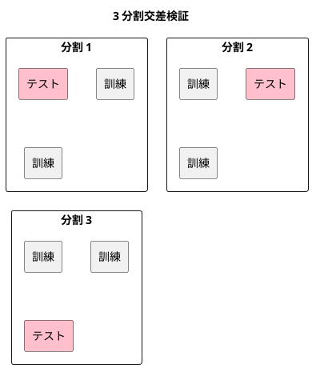

# 第 11 章: 評価指標と交差検証

## 11.1 はじめに

これまでの章では、分類モデルを正解率で評価してきました。しかし、1 つの指標と 1 回だけの訓練・テスト分割で「良いモデル」と判断すると、見落としが生まれます。

この章では、次の 2 つを TDD で自作し、JavaScript の機械学習ライブラリ [ml-confusion-matrix](https://github.com/mljs/confusion-matrix) と [ml-cross-validation](https://github.com/mljs/cross-validation) と突き合わせます。

- **評価指標**: 分類の混同行列・適合率・再現率・F 値と、回帰の MSE・RMSE・MAE
- **K 分割交差検証**: データを K 個に分け、訓練とテストを K 回入れ替えて評価する方法

あわせて、「どの指標で評価するか」を関数として受け渡す設計を学びます。評価の手順（分割して学習し、予測して採点する）を 1 つの関数にまとめ、採点に使う関数だけを差し替えられるようにします。

[Python 版の第 11 章](../python/11-evaluation-metrics-and-cross-validation.md)・[Kotlin 版の第 11 章](../kotlin/11-evaluation-metrics-and-cross-validation.md) と同じ題材を、同じ TODO リストで進めます。TypeScript 版では、評価関数を `(actual, predicted) => number` という **関数の型** で表し、型引数 `T` で分類（文字列のラベル）と回帰（数値）の両方に使えるようにします。交差検証の結果は **ジェネレーター** で返し、必要な分だけ計算する性質と、1 度しか取り出せない性質をテストで確かめます。

## 11.2 正解率だけでは足りない理由

`Survived.csv` は 891 人分の乗客データで、生存（`Survived` が 1）が 342 人、死亡（0）が 549 人です。全員を「死亡」と予測するだけのモデルでも、正解率は 549 / 891 = 0.6162 になります。このモデルは生存者を 1 人も見つけられないのに、正解率だけを見ると 6 割当たっているように見えます。

そこで、予測の当たり外れを 4 つに分けて数える **混同行列** を使います。ここでは「生存」を正例（見つけたいほう）とします。

| | 正例と予測 | 負例と予測 |
|---|-----------|-----------|
| **実際は正例** | TP（真陽性） | FN（偽陰性） |
| **実際は負例** | FP（偽陽性） | TN（真陰性） |

混同行列から、目的に応じた指標を求めます。

| 指標 | 式 | 意味 |
|------|-----|------|
| 適合率（precision） | TP / (TP + FP) | 正例と予測したうち、本当に正例だった割合 |
| 再現率（recall） | TP / (TP + FN) | 本当の正例のうち、正例と予測できた割合 |
| F 値（F1） | 2 × 適合率 × 再現率 / (適合率 + 再現率) | 適合率と再現率の調和平均 |

回帰では、予測と正解の差（誤差）を集計します。

| 指標 | 意味 |
|------|------|
| MSE（平均二乗誤差） | 誤差の 2 乗の平均 |
| RMSE（平均二乗誤差の平方根） | MSE の平方根。正解と同じ単位になる |
| MAE（平均絶対誤差） | 誤差の絶対値の平均 |

TypeScript 版では、回帰の 3 つの指標もこの章でまとめて作ります。どれも引数を（正解, 予測）の順にそろえ、11.8 節で同じ関数の型として扱えるようにします。

## 11.3 TODO リストの作成

**TODO リスト**:

- [ ] 混同行列を数える
  - [ ] 正例と負例の当たり外れを数える
  - [ ] どちらのラベルを正例にするかを指定できる
  - [ ] 正解と予測の件数が違えばエラーにする
- [ ] 適合率・再現率・F 値を求める
  - [ ] 分母が 0 のときは 0 にする
- [ ] MSE・RMSE・MAE を求める
- [ ] K 分割のテストデータを作る
  - [ ] ほぼ均等な件数に分ける
  - [ ] どの行もちょうど一度だけテストデータになる
  - [ ] シードで分け方が決まる
- [ ] 交差検証で分割ごとのスコアを求める
  - [ ] 評価関数を差し替えられる
  - [ ] 必要な分だけ学習する（遅延評価）
- [ ] 混同行列の指標を、正解と予測から求める評価関数に変える
- [ ] ml-confusion-matrix・ml-cross-validation と結果を突き合わせる
- [ ] 実データで交差検証の平均を表示する

## 11.4 混同行列を数える

### Red: 最初のテスト

評価指標のテストは `test/chapter11/` に置きます。正解と予測の配列から、正例 `1` についての混同行列を数えるテストを書きます（実装とテストは 11.11 節で `metrics.ts` と `cross-validation.ts` に分けます。それまでの Red の出力は、分ける前のファイル名 `evaluation.ts`・`evaluation.test.ts` のまま載せます）。

```typescript
// test/chapter11/evaluation.test.ts
import { describe, expect, it } from "vitest";
import { confusionMatrix } from "../../src/chapter11/evaluation.ts";

describe("confusionMatrix", () => {
  it("正例と負例の予測の当たり外れを数える", () => {
    const actual = [1, 1, 1, 0, 0];
    const predicted = [1, 1, 0, 1, 0];

    expect(confusionMatrix(actual, predicted, 1)).toEqual({
      tp: 2,
      fp: 1,
      fn: 1,
      tn: 1,
    });
  });
});
```

```bash
npx vitest run test/chapter11
```

```text
 FAIL  test/chapter11/evaluation.test.ts [ test/chapter11/evaluation.test.ts ]
Error: Cannot find module '../../src/chapter11/evaluation.ts' imported from test/chapter11/evaluation.test.ts
```

### Green: 仮実装

混同行列を表す `interface ConfusionMatrix` を定義し、期待値をそのまま返します。

```typescript
// src/chapter11/evaluation.ts
export interface ConfusionMatrix {
  tp: number;
  fp: number;
  fn: number;
  tn: number;
}

export function confusionMatrix(
  actual: readonly number[],
  predicted: readonly number[],
  positive: number,
): ConfusionMatrix {
  return { tp: 2, fp: 1, fn: 1, tn: 1 };
}
```

```text
      Tests  1 passed (1)
```

`toEqual` は、オブジェクトの中身を再帰的に比べます。`ConfusionMatrix` はクラスではなく `interface` なので、テストではオブジェクトリテラル `{ tp: 2, ... }` をそのまま期待値に書けます（構造的型付け）。

### 三角測量

どちらのラベルを正例とみなすかで、数え方は変わります。正例を `0` にする 2 つ目のテストで一般化を促します。

```typescript
  it("どちらのラベルを正例とするかで数え方が変わる", () => {
    const actual = [1, 1, 1, 0, 0, 0];
    const predicted = [1, 0, 0, 0, 0, 1];

    expect(confusionMatrix(actual, predicted, 0)).toEqual({
      tp: 2,
      fp: 2,
      fn: 1,
      tn: 1,
    });
  });
```

```text
     × どちらのラベルを正例とするかで数え方が変わる 6ms
AssertionError: expected { tp: 2, fp: 1, fn: 1, tn: 1 } to deeply equal { tp: 2, fp: 2, fn: 1, tn: 1 }
- Expected
+ Received
  {
    "fn": 1,
-   "fp": 2,
+   "fp": 1,
    "tn": 1,
    "tp": 2,
  }
      Tests  1 failed | 1 passed (2)
```

JavaScript の配列には、2 つの配列の同じ位置の要素を組にする `zip` がありません。正解と予測を組にする関数 `zipPredictions` を自分で書き、組ごとに「実際は正例か」「正例と予測したか」を求めてから数えます。

```typescript
function zipPredictions<T>(
  actual: readonly T[],
  predicted: readonly T[],
): [T, T][] {
  return actual.map((a, i) => [a, predicted[i] as T]);
}

export function confusionMatrix<T>(
  actual: readonly T[],
  predicted: readonly T[],
  positive: T,
): ConfusionMatrix {
  const pairs = zipPredictions(actual, predicted).map(([a, p]) => ({
    isPositive: a === positive,
    predictedPositive: p === positive,
  }));
  const count = (isPositive: boolean, predictedPositive: boolean) =>
    pairs.filter(
      (pair) =>
        pair.isPositive === isPositive &&
        pair.predictedPositive === predictedPositive,
    ).length;
  return {
    tp: count(true, true),
    fp: count(false, true),
    fn: count(true, false),
    tn: count(false, false),
  };
}
```

- ラベルは整数に限らず、Survived のように文字列で扱うこともあります。そこで、ラベルの型を **型引数** `T` にしました。`confusionMatrix(actual, predicted, 1)` と呼ぶと、引数から `T` は `number` に決まります。正解が数値の配列なのに正例を `"1"` と書くと、型チェックがエラーにします
- `[T, T][]` は「要素が 2 つの **タプル** の配列」の型です
- `predicted[i]` の型は、`noUncheckedIndexedAccess` のため `T | undefined` です。`as T` は「ここは `undefined` ではない」と型チェックに伝える **型アサーション** です

```text
      Tests  2 passed (2)
```

### 件数が違うときは黙って続けない

Python 版では `zip(actual, predicted, strict=True)` で、件数が違えば例外にしていました。件数の違いを見逃さないことを、テストで約束します。

```typescript
  it("正解と予測の件数が違えばエラーになる", () => {
    expect(() => confusionMatrix([1, 0, 1], [1, 0], 1)).toThrow(
      "正解と予測の件数が違います",
    );
  });
```

```text
     × 正解と予測の件数が違えばエラーになる 5ms
AssertionError: expected [Function] to throw an error
      Tests  1 failed | 2 passed (3)
```

このとき `confusionMatrix([1, 0, 1], [1, 0], 1)` は `{ tp: 1, fp: 0, fn: 1, tn: 1 }` を返していました。3 件目の予測 `predicted[2]` は `undefined` で、`undefined === 1` は偽なので「負例と予測した」ことになり、FN に数えられていたのです。`as T` は型チェックを黙らせるだけで、実行時の `undefined` は消えません。型アサーションを書いた場所では、その約束が本当に守られるかを自分で確かめる必要があります。

件数の確認を `zipPredictions` に入れます。正解と予測を組にする処理はこの関数に集まっているので、確認も 1 か所で済みます。

```typescript
function zipPredictions<T>(
  actual: readonly T[],
  predicted: readonly T[],
): [T, T][] {
  if (actual.length !== predicted.length) {
    throw new Error(
      `正解と予測の件数が違います（正解 ${actual.length} 件、予測 ${predicted.length} 件）`,
    );
  }
  return actual.map((a, i) => [a, predicted[i] as T]);
}
```

```text
      Tests  3 passed (3)
```

## 11.5 適合率・再現率・F 値

### 明白な実装

3 つの指標は定義どおりの式なので、テストをまとめて書き、明白な実装で進めます。同じ混同行列を使うので、`describe` の中の定数にしました。

```typescript
describe("適合率・再現率・F 値", () => {
  const cm = { tp: 3, fp: 1, fn: 2, tn: 4 };

  it("適合率は正例と予測したうち本当に正例だった割合", () => {
    expect(precision(cm)).toBeCloseTo(0.75, 12);
  });

  it("再現率は本当の正例のうち正例と予測できた割合", () => {
    expect(recall(cm)).toBeCloseTo(0.6, 12);
  });

  it("F 値は適合率と再現率の調和平均", () => {
    expect(f1Score(cm)).toBeCloseTo((2 * 0.75 * 0.6) / (0.75 + 0.6), 12);
  });
});
```

```text
     × 適合率は正例と予測したうち本当に正例だった割合 2ms
     × 再現率は本当の正例のうち正例と予測できた割合 0ms
     × F 値は適合率と再現率の調和平均 0ms
TypeError: precision is not a function
TypeError: recall is not a function
TypeError: f1Score is not a function
      Tests  3 failed | 3 passed (6)
```

まだ無い関数を import しても、Vitest ではファイルの読み込みは失敗せず、呼び出した時点で `is not a function` になります。存在しない export を見つけるのは型チェックの役目です。

```text
$ npx tsc --noEmit
test/chapter11/evaluation.test.ts(4,3): error TS2305: Module '"../../src/chapter11/evaluation.ts"' has no exported member 'f1Score'.
test/chapter11/evaluation.test.ts(5,3): error TS2305: Module '"../../src/chapter11/evaluation.ts"' has no exported member 'precision'.
test/chapter11/evaluation.test.ts(6,3): error TS2305: Module '"../../src/chapter11/evaluation.ts"' has no exported member 'recall'.
```

```typescript
export function precision(cm: ConfusionMatrix): number {
  return cm.tp / (cm.tp + cm.fp);
}

export function recall(cm: ConfusionMatrix): number {
  return cm.tp / (cm.tp + cm.fn);
}

export function f1Score(cm: ConfusionMatrix): number {
  const p = precision(cm);
  const r = recall(cm);
  return (2 * p * r) / (p + r);
}
```

JavaScript の数値は整数も小数も同じ `number` 型なので、Kotlin 版のように `toDouble()` で変換しなくても、`3 / 4` は 0.75 になります。

### 分母が 0 になる場合

モデルが正例を 1 件も予測しなければ、適合率の分母 TP + FP は 0 になります。このときの振る舞いをテストで決めます。Python 版・Kotlin 版と同じく 0 にします。

```typescript
  it("正例を 1 件も当てられなければ適合率と再現率と F 値は 0", () => {
    const missed = { tp: 0, fp: 0, fn: 3, tn: 5 };

    expect([precision(missed), recall(missed), f1Score(missed)]).toEqual([
      0, 0, 0,
    ]);
  });
```

```text
     × 正例を 1 件も当てられなければ適合率と再現率と F 値は 0 5ms
AssertionError: expected [ NaN, +0, NaN ] to deeply equal [ +0, +0, +0 ]
      Tests  1 failed | 6 passed (7)
```

Python 版では `ZeroDivisionError` の例外になりましたが、JavaScript では例外になりません。`0 / 0` は、浮動小数点数の規格（IEEE 754）どおり **NaN**（非数）になるからです。Kotlin 版と同じ結果です。NaN は計算を進めても NaN のまま広がり、平均を取るとスコア全体が NaN になります。

分母が 0 なら 0 を返す `ratio` を用意し、3 つの指標から使います。

```typescript
function ratio(numerator: number, denominator: number): number {
  return denominator === 0 ? 0 : numerator / denominator;
}

export function precision(cm: ConfusionMatrix): number {
  return ratio(cm.tp, cm.tp + cm.fp);
}

export function recall(cm: ConfusionMatrix): number {
  return ratio(cm.tp, cm.tp + cm.fn);
}

export function f1Score(cm: ConfusionMatrix): number {
  const p = precision(cm);
  const r = recall(cm);
  return ratio(2 * p * r, p + r);
}
```

```text
      Tests  7 passed (7)
```

**TODO リスト**:

- [x] 混同行列を数える
  - [x] 正例と負例の当たり外れを数える
  - [x] どちらのラベルを正例にするかを指定できる
  - [x] 正解と予測の件数が違えばエラーにする
- [x] 適合率・再現率・F 値を求める
  - [x] 分母が 0 のときは 0 にする
- [ ] MSE・RMSE・MAE を求める
- [ ] K 分割のテストデータを作る
- [ ] 交差検証で分割ごとのスコアを求める
- [ ] 混同行列の指標を、正解と予測から求める評価関数に変える
- [ ] ml-confusion-matrix・ml-cross-validation と結果を突き合わせる
- [ ] 実データで交差検証の平均を表示する

## 11.6 回帰の評価指標

誤差 -1・0・2 の 3 件について、MSE は (1 + 0 + 4) / 3、MAE は (1 + 0 + 2) / 3 = 1 です。

```typescript
describe("回帰の評価指標", () => {
  it("誤差の 2 乗の平均と平方根と絶対値の平均を求める", () => {
    const actual = [3, 5, 8];
    const predicted = [2, 5, 10];

    expect(meanSquaredError(actual, predicted)).toBeCloseTo(5 / 3, 12);
    expect(rootMeanSquaredError(actual, predicted)).toBeCloseTo(
      Math.sqrt(5 / 3),
      12,
    );
    expect(meanAbsoluteError(actual, predicted)).toBeCloseTo(1, 12);
  });
});
```

```text
     × 誤差の 2 乗の平均と平方根と絶対値の平均を求める 2ms
TypeError: meanSquaredError is not a function
      Tests  1 failed | 7 passed (8)
```

3 つとも、正解と予測の組を `zipPredictions` で作ってから集計します。

```typescript
function mean(values: readonly number[]): number {
  return values.reduce((sum, value) => sum + value, 0) / values.length;
}

export function meanSquaredError(
  actual: readonly number[],
  predicted: readonly number[],
): number {
  return mean(zipPredictions(actual, predicted).map(([a, p]) => (p - a) ** 2));
}

export function rootMeanSquaredError(
  actual: readonly number[],
  predicted: readonly number[],
): number {
  return Math.sqrt(meanSquaredError(actual, predicted));
}

export function meanAbsoluteError(
  actual: readonly number[],
  predicted: readonly number[],
): number {
  return mean(
    zipPredictions(actual, predicted).map(([a, p]) => Math.abs(p - a)),
  );
}
```

```text
      Tests  8 passed (8)
```

### 学習用テスト: 外れた予測への敏感さ

RMSE と MAE の違いを、学習用テストで確かめておきます。あわせて、回帰の指標にも件数の確認を求めるテストを足します。

```typescript
  it("大きく外れた予測があると RMSE は MAE より大きく増える", () => {
    const actual = [3, 5, 8, 10];
    const predicted = [2, 5, 10, 30];

    expect(rootMeanSquaredError(actual, predicted)).toBeCloseTo(
      Math.sqrt(101.25),
      12,
    );
    expect(meanAbsoluteError(actual, predicted)).toBeCloseTo(5.75, 12);
  });

  it("回帰の評価指標も正解と予測の件数が違えばエラーになる", () => {
    expect(() => meanSquaredError([1, 2], [1])).toThrow(
      "正解と予測の件数が違います",
    );
  });
```

```text
      Tests  10 passed (10)
```

4 件目だけ大きく外した予測（誤差 20）を加えると、MAE は 5.75 なのに対し、RMSE は誤差を 2 乗してから平均するので約 10.06 まで増えます。大きな外れを重く見たいなら RMSE、外れに引きずられずに典型的な誤差を知りたいなら MAE を使います。

件数のテストは、書いた時点で通りました。件数の確認を `zipPredictions` の 1 か所に置いたので、それを使う MSE にも最初から効いているからです。Kotlin 版では、混同行列・MSE・正解率のそれぞれで件数の確認が抜けていることをテストが見つけ、3 か所にそろった `require` をあとから共通の関数に取り出しました。TypeScript 版では、組を作る関数を最初に切り出したことで、同じ確認を繰り返し書かずに済んでいます。

## 11.7 K 分割交差検証

### なぜ分割を入れ替えるのか

第 2 章では、データを 1 回だけ訓練データとテストデータに分けました。この方法では、たまたま予測しやすい行がテストデータに集まると、評価が実力より良く出ます。K 分割交差検証では、データを K 個のグループに分け、1 つをテストデータ、残りを訓練データにして K 回評価し、その平均を見ます。どの行も一度だけテストデータになるので、分け方の偶然に左右されにくくなります。



### 仮実装と三角測量

10 件を 3 つに分けると、テストデータの件数は 4・3・3 になります（余りは先頭の分割に 1 件ずつ足します）。

```typescript
describe("kFold", () => {
  it("データを k 個のテストデータにほぼ均等に分ける", () => {
    const folds = kFold(10, 3, 0);

    expect(folds.map((fold) => fold.test.length)).toEqual([4, 3, 3]);
  });
});
```

```text
     × データを k 個のテストデータにほぼ均等に分ける 3ms
TypeError: kFold is not a function
      Tests  1 failed | 10 passed (11)
```

分割を表す `interface Fold` を定義し、行番号を 4 と 7 の位置で切る仮実装にします。

```typescript
export interface Fold {
  train: number[];
  test: number[];
}

export function kFold(nSamples: number, nSplits: number, seed: number): Fold[] {
  const positions = Array.from({ length: nSamples }, (_, i) => i);
  const tests = [
    positions.slice(0, 4),
    positions.slice(4, 7),
    positions.slice(7, 10),
  ];
  return tests.map((test) => ({
    train: positions.filter((i) => !test.includes(i)),
    test,
  }));
}
```

- `Array.from({ length: n }, (_, i) => i)` は、0 から n - 1 までの配列を作る定番の書き方です
- 訓練データは「テストデータ以外の行」です。`filter` と `includes` で、テストデータに含まれない行番号だけを残します

件数と分割数を変えたテストで、ベタ書きの切り位置を崩します。

```typescript
  it("件数と分割数が変わってもほぼ均等に分ける", () => {
    const folds = kFold(7, 2, 0);

    expect(folds.map((fold) => fold.test.length)).toEqual([4, 3]);
  });
```

```text
     × 件数と分割数が変わってもほぼ均等に分ける 7ms
AssertionError: expected [ 4, 3, +0 ] to deeply equal [ 4, 3 ]
- Expected
+ Received
+   0,
      Tests  1 failed | 11 passed (12)
```

Kotlin 版では、7 件しかないリストを 10 の位置で切ろうとして `IndexOutOfBoundsException` になりました。JavaScript の `slice` は範囲の外を指定しても例外にならず、空の配列を返します。そのため、件数 0 の 3 つ目の分割が黙って作られていました。

分割ごとの件数を求めてから、先頭から順に切り出します。

```typescript
  const positions = Array.from({ length: nSamples }, (_, i) => i);
  const sizes = Array.from(
    { length: nSplits },
    (_, i) => Math.floor(nSamples / nSplits) + (i < nSamples % nSplits ? 1 : 0),
  );
  let start = 0;
  const tests = sizes.map((size) => {
    const test = positions.slice(start, start + size);
    start += size;
    return test;
  });
```

- `sizes` は分割ごとの件数です。10 件を 3 分割なら、商 3 に、余り 1 を先頭から配って `[4, 3, 3]` になります
- `start` は次に切り出す位置です。`map` の中で書き換えながら進めます

```text
      Tests  12 passed (12)
```

### 分け方の性質をテストで固定する

交差検証として正しく使えることを、性質のテストで確かめます。

```typescript
  it("どの行もちょうど一度だけテストデータになる", () => {
    const folds = kFold(10, 3, 0);

    expect(
      folds.flatMap((fold) => fold.test).toSorted((a, b) => a - b),
    ).toEqual([0, 1, 2, 3, 4, 5, 6, 7, 8, 9]);
  });

  it("各分割の訓練データはテストデータ以外のすべての行", () => {
    const folds = kFold(10, 3, 0);

    for (const fold of folds) {
      expect(fold.train.filter((i) => fold.test.includes(i))).toEqual([]);
      expect(new Set([...fold.train, ...fold.test]).size).toBe(10);
    }
  });

  it("同じシードなら同じ分け方になる", () => {
    const first = kFold(10, 3, 42);
    const second = kFold(10, 3, 42);

    expect(first.map((fold) => fold.test)).toEqual(
      second.map((fold) => fold.test),
    );
  });

  it("シードが違えば違う分け方になる", () => {
    const first = kFold(10, 3, 0);
    const second = kFold(10, 3, 1);

    expect(first.map((fold) => fold.test)).not.toEqual(
      second.map((fold) => fold.test),
    );
  });
```

`toSorted` は、元の配列を変えずに並べ替えた新しい配列を返します（第 3 章）。比較関数 `(a, b) => a - b` を渡さないと、数値も文字列として並べ替えられる点に注意してください。

最後のテストだけが失敗します。いまの実装は先頭から順に分けているだけで、シードを使っていないからです。

```text
     × シードが違えば違う分け方になる 8ms
AssertionError: expected [ [ +0, 1, 2, 3 ], [ 4, 5, 6 ], …(1) ] to not deeply equal [ [ +0, 1, 2, 3 ], [ 4, 5, 6 ], …(1) ]
      Tests  1 failed | 15 passed (16)
```

第 2 章の `splitTrainTest` と同じく、シード付きの乱数生成器 `createRandom` と `shuffle` で行番号を並べ替えてから分けます。

```typescript
import { createRandom, shuffle } from "../chapter02/random.ts";
```

```typescript
  const positions = shuffle(
    Array.from({ length: nSamples }, (_, i) => i),
    createRandom(seed),
  );
```

```text
      Tests  16 passed (16)
```

データが元の並び（たとえば生存者が先頭に集まっている）のまま分けると、分割ごとに正例の割合が偏ります。並べ替えはそれを避けるためにも必要です。

## 11.8 評価関数を関数として渡す

### 交差検証の手順を 1 つの関数にする

交差検証の手順は、どのモデル・どの指標でも同じです。

1. 分割ごとに新しいモデルを作る
2. 訓練データで学習する
3. テストデータを予測し、評価関数で採点する

変わるのは「どのモデルを作るか」と「どう採点するか」だけなので、この 2 つを **関数として引数で受け取る** 高階関数 `crossValidate` にします。テストでは、訓練データの正解の平均を常に予測するだけのテスト用モデル `MeanModel` を使い、手で計算できる小さな例にします。

```typescript
type Row = { feature: number };

/** 訓練データの正解の平均値を常に予測するテスト用のモデル */
class MeanModel implements Model<Row, number> {
  private mean = 0;

  fit(_x: readonly Row[], t: readonly number[]): void {
    this.mean = t.reduce((sum, value) => sum + value, 0) / t.length;
  }

  predict(x: readonly Row[]): number[] {
    return x.map(() => this.mean);
  }
}

describe("crossValidate", () => {
  const x = [
    { feature: 10 },
    { feature: 20 },
    { feature: 30 },
    { feature: 40 },
  ];
  const t = [1, 2, 3, 4];
  const folds = [
    { train: [0, 1], test: [2, 3] },
    { train: [2, 3], test: [0, 1] },
  ];

  it("分割ごとに訓練データで学習してテストデータを評価する", () => {
    const scores = crossValidate(
      () => new MeanModel(),
      x,
      t,
      folds,
      meanAbsoluteError,
    );

    expect(scores).toEqual([2, 2]);
  });
});
```

1 つ目の分割は、正解 1・2 で学習して平均 1.5 を予測し、正解 3・4 との MAE が 2.0 になります。2 つ目の分割も同様に 2.0 です。

- `() => new MeanModel()` は「呼び出すと `MeanModel` を作る関数」です。Kotlin 版のコンストラクター参照 `::MeanModel` に当たります
- `meanAbsoluteError` は関数そのものを値として渡しています。TypeScript では関数も値なので、Kotlin の `::` のような記号は要りません
- `fit` の第 1 引数は使わないので、`_x` と先頭に `_` を付けました

```text
     × 分割ごとに訓練データで学習してテストデータを評価する 3ms
TypeError: crossValidate is not a function
      Tests  1 failed | 16 passed (17)
```

モデルに求めるのは `fit` と `predict` を持つことだけです。これを `interface Model<X, T>` で表します。特徴量の行の型を `X`、正解ラベルの型を `T` にしたので、分類（`T` が `string`）にも回帰（`T` が `number`）にも使えます。評価関数の型には `type` で `Metric<T>` という別名を付けます。まず仮実装です。

```typescript
export interface Model<X, T> {
  fit(x: readonly X[], t: readonly T[]): void;
  predict(x: readonly X[]): T[];
}

export type Metric<T> = (
  actual: readonly T[],
  predicted: readonly T[],
) => number;

export function crossValidate<X, T>(
  makeModel: () => Model<X, T>,
  x: readonly X[],
  t: readonly T[],
  folds: readonly Fold[],
  metric: Metric<T>,
): number[] {
  return [2, 2];
}
```

- `() => Model<X, T>` は「引数を取らず、`Model<X, T>` を返す関数」の型です
- `Metric<T>` は「正解と予測の配列を受け取り、数値を返す関数」の型です。`meanAbsoluteError` の型は `(actual: readonly number[], predicted: readonly number[]) => number` なので、`Metric<number>` としてそのまま渡せます
- `MeanModel` は `implements Model<Row, number>` と書きましたが、TypeScript は構造的型付けなので、`implements` が無くても `fit` と `predict` を持っていれば `Model` として渡せます。`implements` を書くと、メソッドの書き漏れをクラスの定義の場所で見つけられます

```text
      Tests  17 passed (17)
```

### 三角測量: 評価関数を差し替える

同じ分割に MSE を渡すテストを追加します。誤差は 1.5 と 2.5 なので、MSE は (2.25 + 6.25) / 2 = 4.25 です。

```typescript
  it("評価関数を差し替えると別の指標で評価する", () => {
    const scores = crossValidate(
      () => new MeanModel(),
      x,
      t,
      folds,
      meanSquaredError,
    );

    expect(scores).toEqual([4.25, 4.25]);
  });
```

```text
     × 評価関数を差し替えると別の指標で評価する 9ms
AssertionError: expected [ 2, 2 ] to deeply equal [ 4.25, 4.25 ]
      Tests  1 failed | 17 passed (18)
```

受け取った `makeModel` で分割ごとに新しいモデルを作り、受け取った `metric` で採点します。

```typescript
): number[] {
  return folds.map((fold) => {
    const model = makeModel();
    model.fit(pick(x, fold.train), pick(t, fold.train));
    return metric(pick(t, fold.test), model.predict(pick(x, fold.test)));
  });
}

function pick<T>(items: readonly T[], positions: readonly number[]): T[] {
  return positions.map((i) => items[i] as T);
}
```

`pick` は、行番号の配列で要素を取り出す関数です（第 2 章・第 3 章と同じもの）。分割ごとに新しいモデルを作るのは、前の分割で学習した状態を次の分割に持ち込まないためです。

```text
      Tests  18 passed (18)
```

### 必要な分だけ学習する: ジェネレーター

交差検証は、分割の数だけ学習を繰り返すので時間がかかります。「まず最初の分割のスコアだけ見たい」というときに、全分割を学習するのは無駄です。そこで、取り出したスコアの分だけ学習する、という振る舞いをテストで求めます。作ったモデルの数を数えるため、`makeModel` で数を数えます。

```typescript
  it("最初の分割のスコアだけを取り出すなら学習は 1 回で済む", () => {
    let created = 0;
    const makeModel = () => {
      created++;
      return new MeanModel();
    };

    const [first] = crossValidate(makeModel, x, t, folds, meanAbsoluteError);

    expect(first).toBe(2);
    expect(created).toBe(1);
  });
```

```text
     × 最初の分割のスコアだけを取り出すなら学習は 1 回で済む 6ms
AssertionError: expected 2 to be 1 // Object.is equality
      Tests  1 failed | 18 passed (19)
```

アロー関数は外側の変数 `created` を書き換えられます（クロージャ）。配列の `map` は、呼んだ時点ですべての要素を計算するので、先頭の 1 つしか使わなくても 2 つの分割を学習していました。

`function*` で **ジェネレーター関数** にします。ジェネレーターは、`yield` で値を 1 つ返すたびに処理を止め、次の値を求められたときに続きから再開します。

```typescript
export function* crossValidate<X, T>(
  makeModel: () => Model<X, T>,
  x: readonly X[],
  t: readonly T[],
  folds: readonly Fold[],
  metric: Metric<T>,
): Generator<number> {
  for (const fold of folds) {
    const model = makeModel();
    model.fit(pick(x, fold.train), pick(t, fold.train));
    yield metric(pick(t, fold.test), model.predict(pick(x, fold.test)));
  }
}
```

配列の分割代入 `const [first] = ...` は、配列だけでなくジェネレーターにも使えます。先頭の 1 つを取り出したところで止まるので、2 つ目の分割は学習されません。代わりに、最初の 2 つのテストが失敗しました。

```text
     × 分割ごとに訓練データで学習してテストデータを評価する 7ms
     × 評価関数を差し替えると別の指標で評価する 1ms
AssertionError: expected  to deeply equal [ 2, 2 ]
AssertionError: expected  to deeply equal [ 4.25, 4.25 ]
      Tests  2 failed | 17 passed (19)
```

ジェネレーターは配列ではないので、`toEqual` で配列と比べると一致しません。`expected` のあとが空に見えるのは、ジェネレーターのオブジェクトには表示できる中身が無いからです。スプレッド構文 `[...scores]` で配列に取り出してから比べる形に直しました。

```typescript
    expect([...scores]).toEqual([2, 2]);
```

```text
      Tests  19 passed (19)
```

遅延評価には注意点もあります。Kotlin 版の `Sequence` は取り出すたびに計算し直しましたが、JavaScript のジェネレーターは **1 度しか取り出せません**。この性質を学習用テストで確かめておきます。

```typescript
  it("ジェネレーターは 1 度しか取り出せず 2 度目は空になる", () => {
    let created = 0;
    const makeModel = () => {
      created++;
      return new MeanModel();
    };
    const scores = crossValidate(makeModel, x, t, folds, meanAbsoluteError);

    expect([...scores]).toEqual([2, 2]);
    expect([...scores]).toEqual([]);
    expect(created).toBe(2);
  });
```

```text
      Tests  20 passed (20)
```

1 度最後まで取り出したジェネレーターは終わった状態のまま残り、2 度目は何も返しません。例外にもならないので、同じスコアを 2 回使うと、2 回目は「スコアが 0 件」として静かに扱われます。同じスコアを何度も使うなら、一度 `[...scores]` で配列にしてから使います。

### 混同行列の指標を評価関数に変える

`crossValidate` が受け取る評価関数は「正解と予測から数値を返す関数」です。一方、`precision` などは混同行列を受け取ります。そこで、混同行列の指標と正例のラベルを受け取り、評価関数を **返す** 高階関数 `classificationMetric` を作ります。あわせて正解率 `accuracy` も評価関数として用意します。

```typescript
describe("分類の評価関数", () => {
  it("正解率は正解と予測が一致した割合", () => {
    expect(accuracy([1, 0, 1, 0], [1, 1, 1, 0])).toBeCloseTo(0.75, 12);
  });

  it("混同行列から求める指標を正解と予測から求める評価関数に変える", () => {
    const actual = [1, 1, 1, 0, 0];
    const predicted = [1, 0, 0, 1, 0];

    const precisionMetric = classificationMetric(precision, 1);
    const recallMetric = classificationMetric(recall, 1);

    expect(precisionMetric(actual, predicted)).toBeCloseTo(0.5, 12);
    expect(recallMetric(actual, predicted)).toBeCloseTo(1 / 3, 12);
  });
});
```

```text
     × 正解率は正解と予測が一致した割合 2ms
     × 混同行列から求める指標を正解と予測から求める評価関数に変える 1ms
TypeError: accuracy is not a function
TypeError: classificationMetric is not a function
      Tests  2 failed | 20 passed (22)
```

```typescript
export function accuracy<T>(
  actual: readonly T[],
  predicted: readonly T[],
): number {
  const pairs = zipPredictions(actual, predicted);
  return pairs.filter(([a, p]) => a === p).length / pairs.length;
}

export function classificationMetric<T>(
  score: (cm: ConfusionMatrix) => number,
  positive: T,
): Metric<T> {
  return (actual, predicted) =>
    score(confusionMatrix(actual, predicted, positive));
}
```

- `classificationMetric` は、アロー関数 `(actual, predicted) => ...` を返します。返された関数は、外側の引数 `score` と `positive` を覚えています（クロージャ）
- 戻り値の型が `Metric<T>` と決まっているので、返す関数の引数 `actual`・`predicted` の型は書かなくても `readonly T[]` だと推論されます
- 第 1 章にも `accuracy` がありますが、引数が（予測, 正解）の順で文字列専用です。この章では（正解, 予測）の順にそろえた型引数付きの `accuracy` を `src/chapter11/` に作りました。ファイル（モジュール）が違うので名前は衝突しません

正解率にも、件数が違う場合のテストを足しました。これも `zipPredictions` を使っているので、書いた時点で通ります。

```typescript
  it("正解率も正解と予測の件数が違えばエラーになる", () => {
    expect(() => accuracy([1, 0, 1], [1, 0])).toThrow(
      "正解と予測の件数が違います",
    );
  });
```

```text
      Tests  23 passed (23)
```

これで、指標を「正解と予測から数値を返す関数」という 1 つの形にそろえられました。交差検証の側は、渡された関数がどの指標なのかを知る必要がありません。

### 型引数で取り違えを防ぐ

`crossValidate` の型引数 `T` は、モデルの正解ラベルの型と評価関数の型の両方から決まります。回帰のモデル（`Model<..., number>`）に、文字列のラベル用の評価関数（`Metric<string>`）を渡すと、型チェックがエラーにします。試しに次のコードを型チェックすると、

```typescript
declare const makeModel: () => Model<{ feature: number }, number>;

crossValidate(
  makeModel,
  [{ feature: 1 }],
  [1],
  [],
  classificationMetric(precision, "1"),
);
```

```text
error TS2345: Argument of type '() => Model<{ feature: number; }, number>' is not assignable to parameter of type '() => Model<{ feature: number; }, string>'.
  Type 'Model<{ feature: number; }, number>' is not assignable to type 'Model<{ feature: number; }, string>'.
    Type 'number' is not assignable to type 'string'.
```

となりました（`declare const` は、値を用意せずに型だけを宣言する書き方です。確かめたあと、このコードは消しました）。回帰のモデルに適合率を渡すような取り違えは、実行する前に見つかります。

## 11.9 ml.js と突き合わせる

自作した指標と分割を、ml.js の [ml-confusion-matrix](https://github.com/mljs/confusion-matrix) 2.0.0 と [ml-cross-validation](https://github.com/mljs/cross-validation) 1.3.0 と突き合わせます。予測には、第 3 章の `trainMlCart` で学習した ml-cart の決定木を使います。

### 型宣言を書く

ml-confusion-matrix は型定義を同梱していますが、ml-cross-validation は同梱していません。第 3 章の ml-cart と同じく、使う範囲だけの型宣言を書きます。

```typescript
// src/types/ml-cross-validation.d.ts
// ml-cross-validation は型定義を同梱しないので、本リポジトリで使う範囲だけを宣言する
declare module "ml-cross-validation" {
  /** 依存する ml-confusion-matrix 0.4 系の混同行列（使うメソッドだけ） */
  export interface CrossValidationConfusionMatrix<T> {
    getTruePositiveCount(label: T): number;
    getFalsePositiveCount(label: T): number;
    getFalseNegativeCount(label: T): number;
    getTrueNegativeCount(label: T): number;
    getAccuracy(): number;
  }

  export interface FoldIndex {
    testIndex: number[];
    trainIndex: number[];
  }

  /** Math.random で行を並べ替え、k 個の分割の行番号を返す */
  export function getFolds(
    features: readonly unknown[],
    k?: number,
  ): FoldIndex[];

  /**
   * K 分割交差検証。分類器の代わりに、訓練データで学習してテストデータの予測を返す関数を渡す形。
   * 関数は分割数 k の後ろに渡す（README に無い順序。ソースで確認した）。
   * すべての分割の予測を 1 つの混同行列に足し合わせて返す。
   */
  export function kFold<F, T>(
    features: readonly F[],
    labels: readonly T[],
    k: number,
    callback: (trainFeatures: F[], trainLabels: T[], testFeatures: F[]) => T[],
  ): CrossValidationConfusionMatrix<T>;
}
```

型宣言を書くには、ライブラリのソースを読む必要がありました。そこで分かったことが 2 つあります。

- ml-cross-validation は、依存関係として ml-confusion-matrix の **0.4 系** を持っています。本リポジトリが直接使う 2.0.0 とは別の版なので、`kFold` が返す混同行列の型は、ml-confusion-matrix 2.0.0 の型定義を流用せず、使うメソッドだけを宣言しました
- `kFold` の関数を渡す使い方は README に例が無く（README は `leaveOneOut` の例だけ）、引数の並びは `kFold(features, labels, k, callback)` です。最初に `leaveOneOut` の例にならって `kFold(features, labels, callback, 3)` と呼ぶと、`Error: features and labels should have the same length` になりました。ソースでは、4 番目の引数が関数かどうかで引数の意味を入れ替えています

### ml-confusion-matrix と突き合わせる

架空の 10 件で ml-cart の決定木（深さ 1）を学習し、その予測を自作の指標と ml-confusion-matrix の両方で採点します。

```typescript
// test/chapter11/ml-evaluation.test.ts
import { ConfusionMatrix } from "ml-confusion-matrix";
import { getFolds, kFold as mlKFold } from "ml-cross-validation";
import { afterEach, describe, expect, it, vi } from "vitest";
import { createRandom } from "../../src/chapter02/random.ts";
import { trainMlCart } from "../../src/chapter03/ml-cart-adapter.ts";
import { crossValidate, kFold } from "../../src/chapter11/cross-validation.ts";
import {
  accuracy,
  confusionMatrix,
  f1Score,
  mean,
  precision,
  recall,
} from "../../src/chapter11/metrics.ts";
import { MlCartTree } from "./ml-cart-model.ts";

type Row = { feature: number };

const x: Row[] = [0.1, 0.2, 0.3, 0.4, 0.5, 0.6, 0.7, 0.8, 0.9, 1.0].map(
  (value) => ({
    feature: value,
  }),
);
const t = ["0", "0", "1", "0", "0", "1", "1", "0", "1", "1"];

describe("ml-confusion-matrix との突き合わせ", () => {
  const predicted = trainMlCart(x, t, { maxDepth: 1 })(x);
  const library = ConfusionMatrix.fromLabels(t, predicted);

  it("混同行列が ml-confusion-matrix と一致する", () => {
    const cm = confusionMatrix(t, predicted, "1");

    expect(cm).toEqual({
      tp: library.getTruePositiveCount("1"),
      fp: library.getFalsePositiveCount("1"),
      fn: library.getFalseNegativeCount("1"),
      tn: library.getTrueNegativeCount("1"),
    });
  });

  it("正解率と適合率と再現率と F 値が ml-confusion-matrix と一致する", () => {
    const cm = confusionMatrix(t, predicted, "1");

    expect(accuracy(t, predicted)).toBeCloseTo(library.getAccuracy(), 12);
    expect(precision(cm)).toBeCloseTo(
      library.getPositivePredictiveValue("1"),
      12,
    );
    expect(recall(cm)).toBeCloseTo(library.getTruePositiveRate("1"), 12);
    expect(f1Score(cm)).toBeCloseTo(library.getF1Score("1"), 12);
  });

  it("正例を 1 件も予測しなければ ml-confusion-matrix の適合率は NaN になる", () => {
    const neverPositive = ConfusionMatrix.fromLabels(
      ["1", "1", "1", "0"],
      ["0", "0", "0", "0"],
    );

    expect(neverPositive.getPositivePredictiveValue("1")).toBeNaN();
    expect(neverPositive.getTruePositiveRate("1")).toBe(0);
    expect(neverPositive.getF1Score("1")).toBe(0);
  });

  it("正解にも予測にも無いラベルを正例にすると ml-confusion-matrix は例外を投げる", () => {
    const onlyNegative = ConfusionMatrix.fromLabels<string>(
      ["0", "0"],
      ["0", "0"],
    );

    expect(() => onlyNegative.getTruePositiveCount("1")).toThrow(
      "The label does not exist",
    );
    expect(confusionMatrix(["0", "0"], ["0", "0"], "1")).toEqual({
      tp: 0,
      fp: 0,
      fn: 0,
      tn: 2,
    });
  });
});
```

- ml-confusion-matrix の適合率は `getPositivePredictiveValue`、再現率は `getTruePositiveRate` という名前です。どちらも、正例のラベルを呼び出すたびに渡します。自作の `positive` と同じ考え方です
- 最後のテストで `fromLabels<string>` と型引数を書いたのは、書かないと `["0", "0"]` から型引数が文字列リテラル型 `"0"` に推論され、`getTruePositiveCount("1")` が `Argument of type '"1"' is not assignable to parameter of type '"0"'` という型エラーになったからです

### ml-cross-validation と突き合わせる

ml-cross-validation の分け方を確かめます。

```typescript
describe("ml-cross-validation との突き合わせ", () => {
  afterEach(() => {
    vi.restoreAllMocks();
  });

  function libraryTestSizes(nSamples: number, nSplits: number): number[] {
    const features = Array.from({ length: nSamples }, (_, i) => i);
    return getFolds(features, nSplits).map((fold) => fold.testIndex.length);
  }

  it("余りの行を先頭ではなく最後の分割に足す", () => {
    expect(libraryTestSizes(10, 3)).toEqual([3, 3, 4]);
    expect(kFold(10, 3, 0).map((fold) => fold.test.length)).toEqual([4, 3, 3]);
    expect(libraryTestSizes(7, 2)).toEqual([3, 4]);
    expect(kFold(7, 2, 0).map((fold) => fold.test.length)).toEqual([4, 3]);
  });

  it("余りが分割数以上になると一度もテストデータにならない行が出る", () => {
    const tested = getFolds(
      Array.from({ length: 11 }, (_, i) => i),
      4,
    ).flatMap((fold) => fold.testIndex);

    expect(tested).toHaveLength(9);
    expect(kFold(11, 4, 0).flatMap((fold) => fold.test)).toHaveLength(11);
  });

  it("シードを受け取らないが Math.random を差し替えると分け方を再現できる", () => {
    const features = Array.from({ length: 10 }, (_, i) => i);

    vi.spyOn(Math, "random").mockImplementation(createRandom(0));
    const first = getFolds(features, 3);
    vi.spyOn(Math, "random").mockImplementation(createRandom(0));
    const second = getFolds(features, 3);

    expect(first).toEqual(second);
  });
```

`getFolds` は、件数を分割数で割った商（11 件を 4 分割なら 2 件）ずつ分割を作り、最後に残った行を最後の分割に足します。11 件を 4 分割すると、2 件ずつの分割が 5 つできて、残りの 1 件が 4 つ目の分割に足され、5 つ目の分割（2 件）は捨てられます。そのため 11 件のうち 9 件しかテストデータになりません。ソースのコメントにも「割り切れないときに余った観測は交差検証から除かれる」とあります。自作の `kFold` は余りを先頭から 1 件ずつ配るので、どの行も一度ずつテストデータになります。

`getFolds` はシードを受け取らず、`Math.random` で並べ替えます。`vi.spyOn(Math, "random").mockImplementation(...)` は、テストの間だけ `Math.random` を別の関数に差し替える Vitest の機能で、第 2 章の `createRandom(0)` を渡すと、分け方を再現できました。`afterEach` の `vi.restoreAllMocks()` で、テストごとに元の `Math.random` に戻しています。

最後に、関数を渡す形の `kFold` を確かめます。特徴量の代わりに行番号 `[i]` を渡し、関数の中で行番号から特徴量と正解を引いて ml-cart で学習・予測します。分割ごとの正解と予測を記録しておき、自作の混同行列と比べます。

```typescript
  it("すべての分割の予測を 1 つの混同行列に足し合わせる", () => {
    vi.spyOn(Math, "random").mockImplementation(createRandom(0));
    const rows = x.map((_, i): [number] => [i]);
    const perFold: { actual: string[]; predicted: string[] }[] = [];

    const pooled = mlKFold(rows, t, 3, (trainRows, trainLabels, testRows) => {
      const trainX = trainRows.map(([i]) => x[i] as Row);
      const testX = testRows.map(([i]) => x[i] as Row);
      const predicted = trainMlCart(trainX, trainLabels, { maxDepth: 1 })(
        testX,
      );
      perFold.push({
        actual: testRows.map(([i]) => t[i] as string),
        predicted,
      });
      return predicted;
    });

    const summed = perFold
      .map(({ actual, predicted }) => confusionMatrix(actual, predicted, "1"))
      .reduce((sum, cm) => ({
        tp: sum.tp + cm.tp,
        fp: sum.fp + cm.fp,
        fn: sum.fn + cm.fn,
        tn: sum.tn + cm.tn,
      }));
    expect(summed).toEqual({
      tp: pooled.getTruePositiveCount("1"),
      fp: pooled.getFalsePositiveCount("1"),
      fn: pooled.getFalseNegativeCount("1"),
      tn: pooled.getTrueNegativeCount("1"),
    });

    const weighted =
      perFold.reduce(
        (sum, { actual, predicted }) =>
          sum + accuracy(actual, predicted) * actual.length,
        0,
      ) / x.length;
    expect(pooled.getAccuracy()).toBeCloseTo(weighted, 12);
  });
});
```

- `(_, i): [number] => [i]` は、戻り値の型を要素 1 つのタプル `[number]` と書いたアロー関数です。こう書くと `([i]) => ...` の `i` が `number` になります。書かないと `number[]` と推論され、`i` が `number | undefined` になります
- ml-cross-validation の `kFold` は、分割ごとのスコアを返しません。すべての分割の予測を **1 つの混同行列に足し合わせて** 返します。そのため、その正解率は「分割ごとの正解率の平均」ではなく、「分割ごとの正解率をテストデータの件数で重み付けした平均」と一致します。分割の件数がそろっていなければ、2 つは違う値になります

### 同じ分割なら交差検証の平均も一致する

ml-cart の決定木を、この章の `Model` として使うアダプターを用意します。実データのテストからも使うので、テスト用の別ファイルにしました。

```typescript
// test/chapter11/ml-cart-model.ts
import { trainMlCart } from "../../src/chapter03/ml-cart-adapter.ts";
import type { Model } from "../../src/chapter11/cross-validation.ts";

/** ml-cart の決定木を第 11 章の Model として使うテスト用のアダプター */
export class MlCartTree<K extends string> implements Model<
  Record<K, number>,
  string
> {
  private readonly maxDepth: number;
  private predictor: ((rows: readonly Record<K, number>[]) => string[]) | null =
    null;

  constructor(maxDepth: number) {
    this.maxDepth = maxDepth;
  }

  fit(x: readonly Record<K, number>[], t: readonly string[]): void {
    this.predictor = trainMlCart(x, t, { maxDepth: this.maxDepth });
  }

  predict(x: readonly Record<K, number>[]): string[] {
    if (this.predictor === null) {
      throw new Error("fit で学習してから predict を呼んでください");
    }
    return this.predictor(x);
  }
}
```

最初はコンストラクターを `constructor(private readonly maxDepth: number) {}` と書きましたが、`tsc` が `error TS1294: This syntax is not allowed when 'erasableSyntaxOnly' is enabled.` を出しました。引数に `private` を付けてプロパティを宣言する書き方（パラメータープロパティ）は、型を取り除くだけでは JavaScript にならないので、Node.js の型除去で実行できません。プロパティの宣言と代入に分けて書きます。ファイル名が `.test.ts` で終わらないので、Vitest はこのファイルをテストとして実行しません。

```typescript
describe("ml-cart の決定木での交差検証", () => {
  it("同じ分割なら ml-confusion-matrix で採点した正解率の平均と一致する", () => {
    const rows = Array.from({ length: 20 }, (_, i) => ({
      feature: (i + 1) * 0.05,
    }));
    const labels = rows.map((_, i) =>
      (i + 1) % 3 === 0 || i + 1 > 12 ? "1" : "0",
    );
    const folds = kFold(20, 4, 0);

    const libraryScores = folds.map((fold) => {
      const trainX = fold.train.map((i) => rows[i] as Row);
      const trainT = fold.train.map((i) => labels[i] as string);
      const testX = fold.test.map((i) => rows[i] as Row);
      const testT = fold.test.map((i) => labels[i] as string);
      const predicted = trainMlCart(trainX, trainT, { maxDepth: 1 })(testX);
      return ConfusionMatrix.fromLabels(testT, predicted).getAccuracy();
    });

    const scores = [
      ...crossValidate(() => new MlCartTree(1), rows, labels, folds, accuracy),
    ];
    expect(mean(scores)).toBeCloseTo(mean(libraryScores), 12);
  });
});
```

`mean` は 11.11 節で `metrics.ts` から export したものです。

```text
      Tests  32 passed (32)
```

突き合わせで分かった ml.js の約束事をまとめます。

- ml-confusion-matrix の指標は、正例のラベルを呼び出すたびに指定する。混同行列の件数・正解率・適合率・再現率・F 値は、同じ予測なら自作と一致した
- 正例を一度も予測しない場合、ml-confusion-matrix の適合率は NaN になる（0 / 0 をそのまま計算する）。再現率と F 値は 0 になる。F 値は 2TP / (2TP + FP + FN) の式で求めるので、TP が 0 で FN が 1 件以上あれば 0 になる
- ml-confusion-matrix は、正解にも予測にも現れないラベルを正例に指定すると `The label does not exist` の例外を投げる。自作は、正例が 1 件も無ければ TP・FN を 0 と数える
- ml-cross-validation の `getFolds` は、余りを最後の分割に足し、余りが分割数以上だと一部の行をテストデータにしない。自作の `kFold` とは件数の配り方が違い、`Math.random` を使うので、同じ行の割り当てにはならない
- ml-cross-validation の `kFold` は、全分割の予測を 1 つの混同行列に足し合わせて返す。分割ごとのスコアの平均を求めるときは、自作の `kFold` の分割ごとに学習して ml-confusion-matrix で採点する

回帰の指標（MSE・RMSE・MAE）は、ADR 003 で選んだ ml.js のパッケージに評価の関数が無いので、突き合わせを省略しました。

## 11.10 実データで評価する

### CSV を読み込む

`Survived.csv` と `cinema.csv` を読み込む関数を、`src/chapter11/datasets.ts` に置きます。第 2 章の `loadIris` と同じく csv-parse を使い、数値の列だけを数値に、空欄を `null` にします。テストでは、架空の値の小さな CSV を一時ディレクトリに書き出して読み込みます。

```typescript
// test/chapter11/datasets.test.ts
import { mkdtempSync, rmSync, writeFileSync } from "node:fs";
import { tmpdir } from "node:os";
import { join } from "node:path";
import { afterAll, describe, expect, it } from "vitest";
import {
  loadCinema,
  loadSurvived,
  prepareCinema,
  prepareSurvived,
} from "../../src/chapter11/datasets.ts";

describe("CSV の読み込み", () => {
  const dir = mkdtempSync(join(tmpdir(), "chapter11-"));

  afterAll(() => {
    rmSync(dir, { recursive: true });
  });

  it("Survived の数値の列を数値にし空欄を null にする", () => {
    const csvFile = join(dir, "survived.csv");
    writeFileSync(
      csvFile,
      "\uFEFFPassengerId,Survived,Pclass,Sex,Age,Fare\n1,0,3,male,30,8\n2,1,1,female,,60\n",
    );

    expect(loadSurvived(csvFile)).toEqual([
      {
        PassengerId: "1",
        Survived: "0",
        Pclass: 3,
        Sex: "male",
        Age: 30,
        Fare: "8",
      },
      {
        PassengerId: "2",
        Survived: "1",
        Pclass: 1,
        Sex: "female",
        Age: null,
        Fare: "60",
      },
    ]);
  });

  it("cinema のすべての列を数値にし空欄を null にする", () => {
    const csvFile = join(dir, "cinema.csv");
    writeFileSync(
      csvFile,
      "cinema_id,SNS1,SNS2,actor,original,sales\n101,100,500,,0,9000\n",
    );

    expect(loadCinema(csvFile)).toEqual([
      {
        cinema_id: 101,
        SNS1: 100,
        SNS2: 500,
        actor: null,
        original: 0,
        sales: 9000,
      },
    ]);
  });
});
```

- `mkdtempSync` は、名前が重ならない一時ディレクトリを作ります。`afterAll` で、このグループのテストがすべて終わったあとに消します
- 本物の `Survived.csv` は先頭に BOM（`\uFEFF`）が付いているので、テストの CSV にも付けました

```text
     × Survived の数値の列を数値にし空欄を null にする 4ms
     × cinema のすべての列を数値にし空欄を null にする 1ms
TypeError: loadSurvived is not a function
TypeError: loadCinema is not a function
      Tests  2 failed | 3 passed (5)
```

（このときには、11.10 節の後半で作る前処理のテスト 3 件が先に通っていました。）

```typescript
/** 指定した列だけを数値（空欄は null）にして CSV を読み込む */
function loadCsv<T>(csvFile: string, numericColumns: readonly string[]): T[] {
  return parse<T>(readFileSync(csvFile), {
    bom: true,
    columns: true,
    cast: (value, context) => {
      if (context.header || !numericColumns.includes(String(context.column))) {
        return value;
      }
      return value === "" ? null : Number(value);
    },
  });
}

export function loadSurvived(csvFile: string): SurvivedRow[] {
  return loadCsv(csvFile, ["Pclass", "Age"]);
}

export function loadCinema(csvFile: string): CinemaRow[] {
  return loadCsv(csvFile, ["cinema_id", ...CINEMA_FEATURES, "sales"]);
}
```

`SurvivedRow` は、使う 4 列（`Survived`・`Pclass`・`Sex`・`Age`）だけを持つ型です。実際に読み込んだオブジェクトには `PassengerId` や `Fare` も文字列のまま入っていますが、型には書いていないので、プログラムからは使えません。`parse<T>` の型引数は「読み込んだ結果をこの型とみなす」という約束で、中身を確かめるわけではありません。約束が守られているかは、このテストで確かめています。`Survived` は数値にせず、文字列の正解ラベル `"0"`・`"1"` のまま使います。第 3 章の決定木が文字列のラベルを学習するからです。

### 簡略化した前処理

交差検証にかけるには、欠損値や文字列の列を数値にしておく必要があります。前処理パイプラインは第 8 章で詳しく扱うので、この章ではそれを簡略化したものを置きます。

- `Survived.csv`: 特徴量を客室クラス（`Pclass`）・年齢（`Age`、177 件の欠損を平均値で補完）・男性かどうか（`Sex` を 0/1 に変換した `male`）の 3 列にし、`Survived` を正解ラベルにする
- `cinema.csv`（100 件）: 特徴量を `SNS1`・`SNS2`・`actor`・`original` の 4 列にして欠損値（`SNS1` と `actor` に 1 件ずつ）を平均値で補完し、興行収入 `sales` を正解ラベルにする

```typescript
describe("prepareSurvived", () => {
  it("客室クラスと年齢と男性かどうかを特徴量にし生存を正解ラベルにする", () => {
    const rows = [
      { Survived: "0", Pclass: 3, Sex: "male", Age: 30 },
      { Survived: "1", Pclass: 1, Sex: "female", Age: 40 },
    ];

    const { x, t } = prepareSurvived(rows);

    expect(x).toEqual([
      { Pclass: 3, Age: 30, male: 1 },
      { Pclass: 1, Age: 40, male: 0 },
    ]);
    expect(t).toEqual(["0", "1"]);
  });
});
```

```text
 FAIL  test/chapter11/datasets.test.ts [ test/chapter11/datasets.test.ts ]
Error: Cannot find module '../../src/chapter11/datasets.ts' imported from test/chapter11/datasets.test.ts
```

```typescript
export interface SurvivedRow {
  Survived: string;
  Pclass: number;
  Sex: string;
  Age: number | null;
}

export const SURVIVED_FEATURES = ["Pclass", "Age", "male"] as const;
export type SurvivedFeature = (typeof SURVIVED_FEATURES)[number];

export function prepareSurvived(rows: readonly SurvivedRow[]): {
  x: Record<SurvivedFeature, number | null>[];
  t: string[];
} {
  return {
    x: rows.map((row) => ({
      Pclass: row.Pclass,
      Age: row.Age,
      male: row.Sex === "male" ? 1 : 0,
    })),
    t: rows.map((row) => row.Survived),
  };
}
```

年齢の欠損値を補完するテストを追加すると、年齢をそのまま使っているので失敗しました。

```typescript
  it("年齢の欠損値を年齢の平均値で補完する", () => {
    const rows = [
      { Survived: "0", Pclass: 3, Sex: "male", Age: 20 },
      { Survived: "1", Pclass: 1, Sex: "female", Age: null },
      { Survived: "1", Pclass: 2, Sex: "female", Age: 40 },
    ];

    const { x } = prepareSurvived(rows);

    expect(x.map((row) => row.Age)).toEqual([20, 30, 40]);
  });
```

```text
     × 年齢の欠損値を年齢の平均値で補完する 5ms
AssertionError: expected [ 20, null, 40 ] to deeply equal [ 20, 30, 40 ]
      Tests  1 failed | 1 passed (2)
```

補完には、第 2 章の `columnMeans` と `fillMissing` をそのまま使います。どちらも列名の型 `K` を型引数に持つので、`Survived` の特徴量の列名 `SurvivedFeature` でも使えます。戻り値の特徴量の型も `Record<SurvivedFeature, number>`、つまり `null` を含まない型に変わりました。

```typescript
export function prepareSurvived(rows: readonly SurvivedRow[]): {
  x: Record<SurvivedFeature, number>[];
  t: string[];
} {
  const features = rows.map((row) => ({
    Pclass: row.Pclass,
    Age: row.Age,
    male: row.Sex === "male" ? 1 : 0,
  }));
  return {
    x: fillMissing(features, columnMeans(features, SURVIVED_FEATURES)),
    t: rows.map((row) => row.Survived),
  };
}
```

`columnMeans` には 3 列すべてを渡しています。Kotlin 版は年齢の列だけの平均を渡しましたが、TypeScript 版の `fillMissing` は、行の列名と平均値の列名が同じ型 `K` であることを求めるからです。欠損があるのは年齢だけなので、ほかの 2 列の平均は使われません。

`cinema.csv` の前処理も、テストを先に書いてから作りました（`prepareCinema is not a function` で失敗することを確かめています）。

```typescript
describe("prepareCinema", () => {
  it("興行収入を正解ラベルにし特徴量の欠損値を平均値で補完する", () => {
    const rows = [
      {
        cinema_id: 101,
        SNS1: 100,
        SNS2: 500,
        actor: null,
        original: 0,
        sales: 9000,
      },
      {
        cinema_id: 102,
        SNS1: null,
        SNS2: 600,
        actor: 20,
        original: 1,
        sales: 9500,
      },
      {
        cinema_id: 103,
        SNS1: 300,
        SNS2: 700,
        actor: 40,
        original: 0,
        sales: 10000,
      },
    ];

    const { x, t } = prepareCinema(rows);

    expect(x).toEqual([
      { SNS1: 100, SNS2: 500, actor: 30, original: 0 },
      { SNS1: 200, SNS2: 600, actor: 20, original: 1 },
      { SNS1: 300, SNS2: 700, actor: 40, original: 0 },
    ]);
    expect(t).toEqual([9000, 9500, 10000]);
  });
});
```

```typescript
export const CINEMA_FEATURES = ["SNS1", "SNS2", "actor", "original"] as const;
export type CinemaFeature = (typeof CINEMA_FEATURES)[number];

export type CinemaRow = Record<CinemaFeature, number | null> & {
  cinema_id: number;
  sales: number;
};

export function prepareCinema(rows: readonly CinemaRow[]): {
  x: Record<CinemaFeature, number>[];
  t: number[];
} {
  const features = rows.map(
    ({ cinema_id: _id, sales: _sales, ...features }) => features,
  );
  return {
    x: fillMissing(features, columnMeans(features, CINEMA_FEATURES)),
    t: rows.map((row) => row.sales),
  };
}
```

`({ cinema_id: _id, sales: _sales, ...features }) => features` は、ID と正解ラベルを取り除いた残りの列を `features` に集める分割代入です。第 2 章の `splitFeaturesAndTarget` と同じ書き方です。

ここでは平均値をデータ全体から求めてから交差検証にかけているので、テストデータの情報が補完値に少し混ざります。訓練データだけから補完値を求める正しい手順は、第 8 章の前処理パイプラインで扱います。

### モデルを Model にする

第 3 章の `DecisionTree` は、この章の `Model` とメソッドの形が少し違います（`fit` が `this` を返す、コンストラクターがオプションのオブジェクトを受け取る）。包むだけのアダプターを作ります。線形回帰は、ADR 003 で第 7 章の突き合わせ先に選んだ ml-regression-multivariate-linear を包みます。この章の関心は評価なので、モデルはライブラリのものを使います。

```typescript
// test/chapter11/models.test.ts
import { describe, expect, it } from "vitest";
import { DecisionTree } from "../../src/chapter03/decision-tree.ts";
import {
  DecisionTreeModel,
  LinearRegressionModel,
} from "../../src/chapter11/models.ts";

describe("DecisionTreeModel", () => {
  it("第 3 章の決定木と同じ予測をする", () => {
    const x = [0.1, 0.2, 0.3, 0.6, 0.7, 0.9].map((value) => ({
      feature: value,
    }));
    const t = ["0", "0", "1", "1", "0", "1"];
    const newX = [0.15, 0.35, 0.8].map((value) => ({ feature: value }));

    const model = new DecisionTreeModel(1);
    model.fit(x, t);

    expect(model.predict(newX)).toEqual(
      new DecisionTree({ maxDepth: 1 }).fit(x, t).predict(newX),
    );
  });
});

describe("LinearRegressionModel", () => {
  it("切片と係数から予測する", () => {
    // t = 1 + 2 * a - b がちょうど成り立つデータ
    const x = [
      { a: 1, b: 0 },
      { a: 2, b: 1 },
      { a: 3, b: 5 },
      { a: 4, b: 2 },
    ];
    const t = [3, 4, 2, 7];

    const model = new LinearRegressionModel();
    model.fit(x, t);

    const [predicted] = model.predict([{ a: 10, b: 3 }]);
    expect(predicted).toBeCloseTo(18, 9);
  });

  it("学習する前に予測するとエラーになる", () => {
    expect(() => new LinearRegressionModel().predict([{ a: 1 }])).toThrow(
      "fit で学習してから predict を呼んでください",
    );
  });
});
```

```text
 FAIL  test/chapter11/models.test.ts [ test/chapter11/models.test.ts ]
Error: Cannot find module '../../src/chapter11/models.ts' imported from test/chapter11/models.test.ts
```

```typescript
// src/chapter11/models.ts
import MultivariateLinearRegression from "ml-regression-multivariate-linear";
import { DecisionTree } from "../chapter03/decision-tree.ts";
import type { Model } from "./cross-validation.ts";

/** 第 3 章の決定木を第 11 章の Model として使うアダプター */
export class DecisionTreeModel<K extends string> implements Model<
  Record<K, number>,
  string
> {
  private readonly tree: DecisionTree<K>;

  constructor(maxDepth?: number) {
    this.tree = new DecisionTree<K>({ maxDepth });
  }

  fit(x: readonly Record<K, number>[], t: readonly string[]): void {
    this.tree.fit(x, t);
  }

  predict(x: readonly Record<K, number>[]): string[] {
    return this.tree.predict(x);
  }
}

/** ml-regression-multivariate-linear の線形回帰を第 11 章の Model として使うアダプター */
export class LinearRegressionModel<K extends string> implements Model<
  Record<K, number>,
  number
> {
  private features: K[] = [];
  private regression: MultivariateLinearRegression | null = null;

  fit(x: readonly Record<K, number>[], t: readonly number[]): void {
    this.features = Object.keys(x[0] ?? {}) as K[];
    this.regression = new MultivariateLinearRegression(
      this.toMatrix(x),
      t.map((value) => [value]),
    );
  }

  predict(x: readonly Record<K, number>[]): number[] {
    const regression = this.regression;
    if (regression === null) {
      throw new Error("fit で学習してから predict を呼んでください");
    }
    return regression.predict(this.toMatrix(x)).map(([y]) => y as number);
  }

  private toMatrix(rows: readonly Record<K, number>[]): number[][] {
    return rows.map((row) => this.features.map((feature) => row[feature]));
  }
}
```

ml-regression-multivariate-linear は、特徴量も正解も 2 次元の配列（行列）で受け取り、予測も 2 次元の配列で返します。正解は `[value]` と 1 列の行列にして渡し、予測は各行の先頭の値を取り出します。

`DecisionTreeModel` は `Model<..., string>`、`LinearRegressionModel` は `Model<..., number>` を実装します。`crossValidate` に渡すと、`T` がそれぞれ `string` と `number` に決まり、渡せる評価関数の型も `Metric<string>`・`Metric<number>` に絞られます（11.8 節）。

### 交差検証の実験

`src/chapter11/experiments.ts` で、Survived には深さ 2 の決定木、cinema には線形回帰を使い、5 分割交差検証の平均を求めます。評価指標は「名前 → 評価関数」のオブジェクトで渡すので、指標を増やすときはオブジェクトに 1 行足すだけです。先に、名前ごとに平均を返すことをテストで決めます。

```typescript
// test/chapter11/experiments.test.ts
import { describe, expect, it } from "vitest";
import {
  meanAbsoluteError,
  rootMeanSquaredError,
} from "../../src/chapter11/metrics.ts";
import { evaluate } from "../../src/chapter11/experiments.ts";

/** どんな入力にも 0 を予測するテスト用のモデル */
const zeroModel = () => ({
  fit: () => {},
  predict: (x: readonly { feature: number }[]) => x.map(() => 0),
});

describe("evaluate", () => {
  it("評価関数ごとに交差検証のスコアの平均を名前を付けて返す", () => {
    const x = Array.from({ length: 10 }, (_, i) => ({ feature: i }));
    const t = x.map(() => 2);

    const scores = evaluate(zeroModel, x, t, {
      RMSE: rootMeanSquaredError,
      MAE: meanAbsoluteError,
    });

    expect(Object.keys(scores)).toEqual(["RMSE", "MAE"]);
    expect(scores).toEqual({ RMSE: 2, MAE: 2 });
  });
});
```

`zeroModel` はクラスではなく、`fit` と `predict` を持つオブジェクトを返す関数です。構造的型付けなので、これだけで `() => Model<{ feature: number }, number>` として渡せます。正解がすべて 2 なので、どの分割でも RMSE と MAE は 2 になります。

```text
 FAIL  test/chapter11/experiments.test.ts [ test/chapter11/experiments.test.ts ]
Error: Cannot find module '../../src/chapter11/experiments.ts' imported from test/chapter11/experiments.test.ts
```

```typescript
export const N_SPLITS = 5;
export const SEED = 0;
const TREE_DEPTH = 2;
const SURVIVED = "1";

export const SURVIVED_METRICS: Record<string, Metric<string>> = {
  正解率: accuracy,
  適合率: classificationMetric(precision, SURVIVED),
  再現率: classificationMetric(recall, SURVIVED),
  F値: classificationMetric(f1Score, SURVIVED),
};

export const CINEMA_METRICS: Record<string, Metric<number>> = {
  RMSE: rootMeanSquaredError,
  MAE: meanAbsoluteError,
};

export function evaluate<X, T>(
  makeModel: () => Model<X, T>,
  x: readonly X[],
  t: readonly T[],
  metrics: Record<string, Metric<T>>,
): Record<string, number> {
  const folds = kFold(x.length, N_SPLITS, SEED);
  return Object.fromEntries(
    Object.entries(metrics).map(([name, metric]) => [
      name,
      mean([...crossValidate(makeModel, x, t, folds, metric)]),
    ]),
  );
}

export function evaluateSurvived(csvFile: string): Record<string, number> {
  const { x, t } = prepareSurvived(loadSurvived(csvFile));
  return evaluate(
    () => new DecisionTreeModel(TREE_DEPTH),
    x,
    t,
    SURVIVED_METRICS,
  );
}

export function evaluateCinema(csvFile: string): Record<string, number> {
  const { x, t } = prepareCinema(loadCinema(csvFile));
  return evaluate(() => new LinearRegressionModel(), x, t, CINEMA_METRICS);
}
```

- `正解率: accuracy` のように、オブジェクトのキーには日本語もそのまま書けます。`accuracy` は型引数を持つ関数ですが、代入先の型が `Metric<string>` なので `T` は `string` に決まります
- JavaScript のオブジェクトは、数値に見えない文字列のキーを **追加した順** に並べます。`Object.entries` で取り出すと、書いた順に指標が並びます。テストの `Object.keys(scores)` で、その順を確かめています
- `Object.fromEntries` は、`[名前, 値]` の組の配列からオブジェクトを作ります。`Object.entries` の逆です
- `mean([...crossValidate(...)])` は、ジェネレーターを配列に取り出してから平均します。評価関数ごとに新しいジェネレーターを作るので、11.8 節の「1 度しか取り出せない」性質は問題になりません。学習は「分割数 × 指標の数」だけ行われます

```text
      Tests  1 passed (1)
```

`main` では、指標ごとに桁数をそろえて表示します。

```typescript
// src/chapter11/main.ts
import { join } from "node:path";
import { dataDir } from "../dataset.ts";
import { N_SPLITS, evaluateCinema, evaluateSurvived } from "./experiments.ts";

export function main(print: (line: string) => void = console.log): void {
  print(`Survived（決定木、${N_SPLITS} 分割交差検証の平均）`);
  const survived = evaluateSurvived(join(dataDir(), "Survived.csv"));
  for (const [name, score] of Object.entries(survived)) {
    print(`  ${name}: ${score.toFixed(4)}`);
  }
  print(`cinema（線形回帰、${N_SPLITS} 分割交差検証の平均）`);
  const cinema = evaluateCinema(join(dataDir(), "cinema.csv"));
  for (const [name, score] of Object.entries(cinema)) {
    print(`  ${name}: ${score.toFixed(2)}`);
  }
}

// node src/chapter11/main.ts で直接実行したときだけ main を呼ぶ
if (import.meta.filename === process.argv[1]) {
  main();
}
```

```bash
node src/chapter11/main.ts
```

```text
Survived（決定木、5 分割交差検証の平均）
  正解率: 0.7845
  適合率: 0.7909
  再現率: 0.6280
  F値: 0.6839
cinema（線形回帰、5 分割交差検証の平均）
  RMSE: 411.02
  MAE: 327.89
```

Survived の決定木は、正解率 0.7845 で「全員死亡」の 0.6162 を上回ります。ただし再現率は 0.6280 で、実際の生存者の 4 割近くを見逃しています。適合率 0.7909 は、「生存」と予測したときの当たりやすさを示します。このモデルは見逃しが多いことが、正解率だけでは見えなかった性質です。

cinema の線形回帰は RMSE が 411.02、MAE が 327.89（どちらも興行収入と同じ単位）です。RMSE が MAE より大きいのは、11.6 節で見たとおり、大きく外した予測がいくつか含まれているためです。

交差検証の分け方が Python 版・Kotlin 版と違うので（シード付きの乱数を自作しているため）、値は一致しませんが、「正解率より再現率が低い」「RMSE が MAE より大きい」という読み取れる傾向は同じです。

### 実データのテスト

実データのテストでは、この値を固定するとともに、同じ分割で ml-cart の決定木を学習し、ml-confusion-matrix で採点した平均と、自作の交差検証の平均が一致することも確かめます。

```typescript
// test/chapter11/data.test.ts
function expectScores(
  actual: Record<string, number>,
  expected: Record<string, number>,
  digits: number,
): void {
  expect(Object.keys(actual)).toEqual(Object.keys(expected));
  for (const [name, value] of Object.entries(expected)) {
    expect(actual[name], name).toBeCloseTo(value, digits);
  }
}

describe.skipIf(!existsSync(survivedCsv))("Survived.csv の実データ", () => {
  it("決定木を 5 分割交差検証で評価する", () => {
    expectScores(
      evaluateSurvived(survivedCsv),
      { 正解率: 0.7845, 適合率: 0.7909, 再現率: 0.628, F値: 0.6839 },
      4,
    );
  });

  it("同じ分割なら ml-cart の決定木を ml-confusion-matrix で採点した平均と一致する", () => {
    const { x, t } = prepareSurvived(loadSurvived(survivedCsv));
    const folds = kFold(x.length, N_SPLITS, SEED);

    const evaluations = folds.map((fold) => {
      const model = new MlCartTree(2);
      model.fit(
        fold.train.map((i) => x[i] as (typeof x)[number]),
        fold.train.map((i) => t[i] as string),
      );
      const predicted = model.predict(
        fold.test.map((i) => x[i] as (typeof x)[number]),
      );
      return ConfusionMatrix.fromLabels(
        fold.test.map((i) => t[i] as string),
        predicted,
      );
    });

    expectScores(
      evaluate(() => new MlCartTree(2), x, t, SURVIVED_METRICS),
      {
        正解率: mean(evaluations.map((cm) => cm.getAccuracy())),
        適合率: mean(
          evaluations.map((cm) => cm.getPositivePredictiveValue("1")),
        ),
        再現率: mean(evaluations.map((cm) => cm.getTruePositiveRate("1"))),
        F値: mean(evaluations.map((cm) => cm.getF1Score("1"))),
      },
      12,
    );
  });

  it("深さ 2 では自作の決定木と ml-cart の決定木の交差検証の平均が一致する", () => {
    const { x, t } = prepareSurvived(loadSurvived(survivedCsv));

    expectScores(
      evaluateSurvived(survivedCsv),
      evaluate(() => new MlCartTree(2), x, t, SURVIVED_METRICS),
      12,
    );
  });
});
```

- `expect(actual[name], name)` の第 2 引数は、失敗したときに表示するメッセージです。どの指標で失敗したかが分かります
- `toBeCloseTo(value, 4)` は、差が 0.00005 未満なら一致とみなします。表示した小数第 4 位の値と比べられます
- `(typeof x)[number]` は「配列 `x` の要素の型」です。型に名前を付けなくても、変数から取り出せます

Kotlin 版では、自作の決定木と Tribuo の決定木は同点の扱いが違い、深さ 2 でも適合率と再現率が違いました。TypeScript 版では、深さ 2 の自作の決定木と ml-cart の決定木の予測が、5 つの分割すべてで一致し、平均も一致しました。第 3 章で見た 2 つの違い（境界ちょうどの値の左右、多数決が同数のときの選び方）が、この深さでは予測に表れなかったということです。深さを 3 以上にすると一致しなくなることもあるので、自作と ml-cart を同じモデルとみなしてよいのは、このテストで確かめた深さ 2 の場合だけです。

`main` の表示のテストと cinema のテストは、実データで出力を確かめてから値を固定したので、Red を経ていません（完成コードの `data.test.ts` を参照してください）。

データが無い環境では、実データのテスト 5 件がスキップされます。

```bash
ML_DATA_DIR=/nonexistent npx vitest run test/chapter11
```

```text
 Test Files  6 passed | 1 skipped (7)
      Tests  41 passed | 5 skipped (46)
```

## 11.11 リファクタリング

### 関心事でファイルを分ける

ここまでの評価指標と交差検証は、すべて `evaluation.ts` に書いていました。Kotlin 版では、静的解析の detekt が「1 つのファイルに関数が多すぎる」（TooManyFunctions）と指摘したことがきっかけでファイルを分けました。本リポジトリの ESLint の設定（typescript-eslint の推奨ルール）には、同じルールがありません。道具が指摘しなくても、見直すと、このファイルには 2 つの関心事がありました。

| ファイル | 中身 |
|---------|------|
| `metrics.ts` | 正解と予測から数値を求める評価指標（混同行列・適合率・再現率・F 値・MSE・RMSE・MAE・正解率・`Metric`・`classificationMetric`・`mean`） |
| `cross-validation.ts` | データの分け方と、分割ごとに学習・採点する手順（`Fold`・`kFold`・`Model`・`crossValidate`） |

`cross-validation.ts` は `metrics.ts` の `Metric` を使いますが、`metrics.ts` は交差検証を知りません。依存の向きが一方向なので、きれいに分けられます。テストも同じ区切りで `metrics.test.ts` と `cross-validation.test.ts` に分けました。

TypeScript では、ファイル（モジュール）が違えば import し直す必要があります。`models.ts`・`experiments.ts`・テストの import を、新しいファイルに向けて直しました。`experiments.ts` が独自に持っていた平均の関数は、`metrics.ts` の `mean` を export して共通にしています。

```typescript
// src/chapter11/cross-validation.ts
import { createRandom, shuffle } from "../chapter02/random.ts";
import type { Metric } from "./metrics.ts";
```

`import type` は、型だけを import する書き方です。`verbatimModuleSyntax` を有効にしているので、型だけの import には `type` を付ける必要があります（第 2 章）。型除去のあと、この行はまるごと消えます。

最後に、すべての品質チェックを実行します。

```bash
npm run check
```

第 11 章のテストは 46 件すべて通ります。データが無い環境では、実データのテスト 5 件がスキップされ、残りの 41 件が通ります。整形・静的解析・型チェックもすべて通りました。

<details>
<summary>この章の完成コード（src/chapter11/metrics.ts）</summary>

```typescript
export interface ConfusionMatrix {
  tp: number;
  fp: number;
  fn: number;
  tn: number;
}

export type Metric<T> = (
  actual: readonly T[],
  predicted: readonly T[],
) => number;

function zipPredictions<T>(
  actual: readonly T[],
  predicted: readonly T[],
): [T, T][] {
  if (actual.length !== predicted.length) {
    throw new Error(
      `正解と予測の件数が違います（正解 ${actual.length} 件、予測 ${predicted.length} 件）`,
    );
  }
  return actual.map((a, i) => [a, predicted[i] as T]);
}

export function mean(values: readonly number[]): number {
  return values.reduce((sum, value) => sum + value, 0) / values.length;
}

export function confusionMatrix<T>(
  actual: readonly T[],
  predicted: readonly T[],
  positive: T,
): ConfusionMatrix {
  const pairs = zipPredictions(actual, predicted).map(([a, p]) => ({
    isPositive: a === positive,
    predictedPositive: p === positive,
  }));
  const count = (isPositive: boolean, predictedPositive: boolean) =>
    pairs.filter(
      (pair) =>
        pair.isPositive === isPositive &&
        pair.predictedPositive === predictedPositive,
    ).length;
  return {
    tp: count(true, true),
    fp: count(false, true),
    fn: count(true, false),
    tn: count(false, false),
  };
}

function ratio(numerator: number, denominator: number): number {
  return denominator === 0 ? 0 : numerator / denominator;
}

export function precision(cm: ConfusionMatrix): number {
  return ratio(cm.tp, cm.tp + cm.fp);
}

export function recall(cm: ConfusionMatrix): number {
  return ratio(cm.tp, cm.tp + cm.fn);
}

export function f1Score(cm: ConfusionMatrix): number {
  const p = precision(cm);
  const r = recall(cm);
  return ratio(2 * p * r, p + r);
}

export function meanSquaredError(
  actual: readonly number[],
  predicted: readonly number[],
): number {
  return mean(zipPredictions(actual, predicted).map(([a, p]) => (p - a) ** 2));
}

export function rootMeanSquaredError(
  actual: readonly number[],
  predicted: readonly number[],
): number {
  return Math.sqrt(meanSquaredError(actual, predicted));
}

export function meanAbsoluteError(
  actual: readonly number[],
  predicted: readonly number[],
): number {
  return mean(
    zipPredictions(actual, predicted).map(([a, p]) => Math.abs(p - a)),
  );
}

export function accuracy<T>(
  actual: readonly T[],
  predicted: readonly T[],
): number {
  const pairs = zipPredictions(actual, predicted);
  return pairs.filter(([a, p]) => a === p).length / pairs.length;
}

export function classificationMetric<T>(
  score: (cm: ConfusionMatrix) => number,
  positive: T,
): Metric<T> {
  return (actual, predicted) =>
    score(confusionMatrix(actual, predicted, positive));
}
```

</details>

<details>
<summary>この章の完成コード（src/chapter11/cross-validation.ts）</summary>

```typescript
import { createRandom, shuffle } from "../chapter02/random.ts";
import type { Metric } from "./metrics.ts";

export interface Fold {
  train: number[];
  test: number[];
}

export function kFold(nSamples: number, nSplits: number, seed: number): Fold[] {
  const positions = shuffle(
    Array.from({ length: nSamples }, (_, i) => i),
    createRandom(seed),
  );
  const sizes = Array.from(
    { length: nSplits },
    (_, i) => Math.floor(nSamples / nSplits) + (i < nSamples % nSplits ? 1 : 0),
  );
  let start = 0;
  const tests = sizes.map((size) => {
    const test = positions.slice(start, start + size);
    start += size;
    return test;
  });
  return tests.map((test) => ({
    train: positions.filter((i) => !test.includes(i)),
    test,
  }));
}

export interface Model<X, T> {
  fit(x: readonly X[], t: readonly T[]): void;
  predict(x: readonly X[]): T[];
}

function pick<T>(items: readonly T[], positions: readonly number[]): T[] {
  return positions.map((i) => items[i] as T);
}

export function* crossValidate<X, T>(
  makeModel: () => Model<X, T>,
  x: readonly X[],
  t: readonly T[],
  folds: readonly Fold[],
  metric: Metric<T>,
): Generator<number> {
  for (const fold of folds) {
    const model = makeModel();
    model.fit(pick(x, fold.train), pick(t, fold.train));
    yield metric(pick(t, fold.test), model.predict(pick(x, fold.test)));
  }
}
```

</details>

<details>
<summary>この章の完成コード（src/chapter11/datasets.ts）</summary>

```typescript
import { readFileSync } from "node:fs";
import { parse } from "csv-parse/sync";
import { columnMeans, fillMissing } from "../chapter02/iris-preprocessing.ts";

export interface SurvivedRow {
  Survived: string;
  Pclass: number;
  Sex: string;
  Age: number | null;
}

export const SURVIVED_FEATURES = ["Pclass", "Age", "male"] as const;
export type SurvivedFeature = (typeof SURVIVED_FEATURES)[number];

export function prepareSurvived(rows: readonly SurvivedRow[]): {
  x: Record<SurvivedFeature, number>[];
  t: string[];
} {
  const features = rows.map((row) => ({
    Pclass: row.Pclass,
    Age: row.Age,
    male: row.Sex === "male" ? 1 : 0,
  }));
  return {
    x: fillMissing(features, columnMeans(features, SURVIVED_FEATURES)),
    t: rows.map((row) => row.Survived),
  };
}

export const CINEMA_FEATURES = ["SNS1", "SNS2", "actor", "original"] as const;
export type CinemaFeature = (typeof CINEMA_FEATURES)[number];

export type CinemaRow = Record<CinemaFeature, number | null> & {
  cinema_id: number;
  sales: number;
};

export function prepareCinema(rows: readonly CinemaRow[]): {
  x: Record<CinemaFeature, number>[];
  t: number[];
} {
  const features = rows.map(
    ({ cinema_id: _id, sales: _sales, ...features }) => features,
  );
  return {
    x: fillMissing(features, columnMeans(features, CINEMA_FEATURES)),
    t: rows.map((row) => row.sales),
  };
}

/** 指定した列だけを数値（空欄は null）にして CSV を読み込む */
function loadCsv<T>(csvFile: string, numericColumns: readonly string[]): T[] {
  return parse<T>(readFileSync(csvFile), {
    bom: true,
    columns: true,
    cast: (value, context) => {
      if (context.header || !numericColumns.includes(String(context.column))) {
        return value;
      }
      return value === "" ? null : Number(value);
    },
  });
}

export function loadSurvived(csvFile: string): SurvivedRow[] {
  return loadCsv(csvFile, ["Pclass", "Age"]);
}

export function loadCinema(csvFile: string): CinemaRow[] {
  return loadCsv(csvFile, ["cinema_id", ...CINEMA_FEATURES, "sales"]);
}
```

</details>

## 11.12 Notebook で探索する

TypeScript 版では Notebook による探索と可視化を扱いません。混同行列のタイル図や ROC 曲線、木の深さごとの AUC、分割ごとのスコアのばらつきは、[Python 版の 11.12 節](../python/11-evaluation-metrics-and-cross-validation.md) か [Kotlin 版の 11.12 節](../kotlin/11-evaluation-metrics-and-cross-validation.md) を参照してください。

## 11.13 まとめ

この章では、モデルを多面的に、偶然に左右されにくく評価する方法を TDD で実装しました。

1. **混同行列と適合率・再現率・F 値** — 正解率だけでは見えない、見逃しと誤検出のバランスを数値にした。分母が 0 のときに例外ではなく NaN になる JavaScript の振る舞いを、テストで捕まえた
2. **件数の確認** — 足りない予測は `undefined` になり、型アサーションでは防げないことをテストで確かめ、正解と予測を組にする `zipPredictions` の 1 か所で確認した
3. **K 分割交差検証** — 範囲の外でも例外にならない `slice` の振る舞いをテストが見つけ、件数の配り方・行の重複のなさ・シードによる再現性を性質のテストで固定した
4. **関数の型と型引数による評価の設計** — `() => Model<X, T>` と `Metric<T>` を受け取る `crossValidate` と、評価関数を返す `classificationMetric` で、手順と採点を分けた。型引数で分類と回帰の取り違えを型チェックで防いだ
5. **ジェネレーターによる遅延評価** — 取り出した分だけ学習し、1 度しか取り出せない性質をテストで確かめた
6. **ml.js との突き合わせ** — 同じ予測・同じ分割なら、自作の指標と交差検証が ml-confusion-matrix と一致することを確かめた。適合率の NaN、余りの行を捨てる分け方、全分割を足し合わせる混同行列、README に無い引数の順序を、学習用テストと型宣言に残した

Survived の決定木は、5 分割交差検証で正解率 0.7845、適合率 0.7909、再現率 0.6280 でした。正解率だけでは分からなかった「見逃しの多さ」が、再現率と混同行列で見えるようになりました。

次の章では、正則化によって過学習を抑え、交差検証を使ってモデルの設定を選ぶ方法を学びます。
