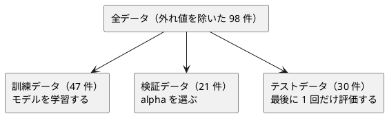

# 第 12 章: 正則化とモデル選択

## 12.1 はじめに

特徴量を増やすと、モデルは訓練データにいくらでも合わせられるようになります。その結果、訓練データでは高い精度が出るのに、未知のデータでは精度が落ちる **過学習** が起こります。

この章では、過学習を抑える **正則化** を学びます。リッジ回帰を行列の計算で自作し、正則化の強さ `alpha` を検証データで選ぶ **モデル選択** を実装します。係数を 0 にして特徴量を絞り込むラッソ回帰は、[ml-regression-lasso](https://github.com/mljs/regression-lasso) で試します。

[Python 版の第 12 章](../python/12-regularization-and-model-selection.md)・[Kotlin 版の第 12 章](../kotlin/12-regularization-and-model-selection.md) と同じ流れで進めます。TypeScript 版では、次の 3 点に注目してください。

- 行列の計算を [ml-matrix](https://github.com/mljs/matrix) に任せ、12.2 節の式をメソッドの連鎖で書く
- 実験の結果を `readonly` のプロパティと読み取り専用の配列で表し、書き換えを型チェックで防ぐ。ただし `readonly` は実行時には消える
- ml-regression-lasso の `lambda` が何を意味するかをソースで読み、学習用テストで確かめる。既定の設定では収束しないまま結果を返すことも、テストで突き止める

## 12.2 過学習と正則化

### 係数が大きくなりすぎる

線形回帰は、予測値と正解の差（誤差）の二乗和が最小になるように係数を決めます。特徴量が多いと、訓練データの細かな揺れにまで合わせようとして、係数の絶対値が大きくなりがちです。係数が大きいモデルは、入力が少し変わっただけで予測が大きく変わるので、未知のデータに弱くなります。

### 係数の大きさに罰則を加える

正則化は、誤差の二乗和に「係数の大きさ」への罰則を加えて最小化します。

| 手法 | 最小化するもの | 係数への効果 |
|------|--------------|------------|
| 線形回帰 | 誤差の二乗和 | 制約なし |
| リッジ回帰 | 誤差の二乗和 + `alpha` × 係数の二乗和 | 全体を小さく縮める |
| ラッソ回帰 | 誤差の二乗和 + `alpha` × 係数の絶対値の和 | 一部の係数をちょうど 0 にする |

`alpha` は正則化の強さです。0 なら線形回帰と同じで、大きくするほど係数は小さくなります。大きすぎると、今度は訓練データにも合わなくなります（学習不足）。ちょうどよい `alpha` はデータによって違うので、実験して選びます。

### リッジ回帰の解き方

リッジ回帰は式を変形すると、行列の計算で係数を直接求められます。特徴量の行列を `X`、正解を `t` として、それぞれから平均を引いた（中心化した）うえで、次の連立一次方程式を解きます。

```text
(Xᵀ X + alpha × I) w = Xᵀ t
```

`I` は単位行列です。切片は「正解の平均 − 特徴量の平均と係数の内積」で求めます。中心化してから解くのは、切片には罰則をかけないためです。線形回帰の正規方程式に `alpha × I` の項が加わっただけで、必要なのは行列の積・転置・足し算・数との積・単位行列と、連立方程式の解法です。どれも ml-matrix にあります。

## 12.3 題材とデータ

### Boston.csv

この章で使うのは `Boston.csv` です。100 件の地区について、住宅価格（`PRICE`）と 13 個の特徴量が記録されています。この章ではそのうち次の 3 つを使います。

| 列 | 意味 | TypeScript 版での型 |
|----|------|-------------------|
| RM | 住居の平均部屋数 | `number` |
| PTRATIO | 生徒と教師の比率 | `number` |
| LSTAT | 低所得者の割合（%） | `number` |
| PRICE | 住宅価格（正解ラベル） | `number` |

この 4 列には欠損値がありません。学習データの入手と配置は [第 1 章](01-machine-learning-and-first-test.md) の「題材とデータ」を参照してください。

### 過学習が起きやすい状況を作る

3 つの特徴量をそれぞれ標準化（平均 0・標準偏差 1）したうえで、2 乗の列と、2 つの列の積（交互作用）の列を加えます。3 列が 9 列に増え、100 件のデータに対しては過学習が起きやすい状況になります。多項式特徴量と標準化、外れ値の扱いは [第 9 章](09-feature-engineering.md) で詳しく扱います。この章では、正則化の効果を確かめるのに必要な最小限の前処理だけを章の中に用意します。

### 訓練・検証・テストの 3 つに分ける

`alpha` をテストデータの結果で選ぶと、テストデータに合わせてモデルを選んだことになり、テストデータが「未知のデータ」ではなくなります。そこで、データを次の 3 つに分けます。



分割には [第 2 章](02-data-preprocessing-and-triangulation.md) で作った `splitTrainTest` を 2 回使います。1 回目で全体を訓練用とテスト用に、2 回目で訓練用をさらに訓練データと検証データに分けます。件数は Python 版・Kotlin 版と同じですが、乱数生成器が違うので、それぞれに入る行は一致しません。

## 12.4 TODO リストの作成

**TODO リスト**:

- [ ] リッジ回帰を自作する
  - [ ] `alpha` が 0 なら最小二乗法と同じ係数と切片になる
  - [ ] 特徴量が 2 つでも係数と切片を求める
  - [ ] `alpha` を大きくすると係数が小さくなる
  - [ ] `alpha` が 0 なら ml-regression-multivariate-linear の線形回帰と同じ係数になる
  - [ ] 係数と切片から予測する
- [ ] 正則化の強さごとの実験結果を、書き換えられない値として記録する
- [ ] 検証データの決定係数が最も高い実験を選ぶ
- [ ] 0 になった係数の特徴量名を返す
- [ ] ml-regression-lasso でラッソ回帰を表す
- [ ] 標準化してから 2 次の多項式特徴量を作る
- [ ] 外れ値の行を除く
- [ ] 実データを 3 つに分けて、線形回帰・リッジ回帰・ラッソ回帰を比べる

## 12.5 リッジ回帰を自作する

### Red: 最小二乗法と同じになるテスト

`alpha` が 0 のリッジ回帰は線形回帰と同じです。`t = 2x + 1` の上に並ぶ 3 点なら、係数は 2、切片は 1 になるはずです。特徴量は `number[][]`（1 行が 1 件）で渡します。この章の特徴量は多項式特徴量まで作ると列の名前より位置で扱うほうが自然なので、第 2 章・第 3 章のようなレコードではなく、行列の形にします。

```typescript
// test/chapter12/regularization.test.ts
describe("fitRidge", () => {
  it("alpha が 0 なら最小二乗法と同じ係数と切片になる", () => {
    const x = [[1], [2], [3]];
    const t = [3, 5, 7];

    const model = fitRidge(x, t, 0);

    expect(model.coefficients).toEqual([expect.closeTo(2, 12)]);
    expect(model.intercept).toBeCloseTo(1, 12);
  });
```

```bash
npx vitest run test/chapter12
```

```text
 FAIL  test/chapter12/regularization.test.ts [ test/chapter12/regularization.test.ts ]
Error: Cannot find module '../../src/chapter12/regularization.ts' imported from test/chapter12/regularization.test.ts
```

### Green: 仮実装

学習結果を表す `RegularizedModel` を定義し、期待値をそのまま返します。Kotlin 版と同じく、12.8 節のラッソ回帰の結果にも同じ型を使うので、`RegularizedModel`（正則化したモデル）と名付けました。

```typescript
// src/chapter12/regularization.ts
export interface RegularizedModel {
  readonly coefficients: readonly number[];
  readonly intercept: number;
}

export function fitRidge(
  x: readonly (readonly number[])[],
  t: readonly number[],
  alpha: number,
): RegularizedModel {
  return { coefficients: [2], intercept: 1 };
}
```

- 引数の型 `readonly (readonly number[])[]` は、「読み取り専用の、読み取り専用の数値の配列の配列」です。関数が受け取った配列を書き換えないことを、型で約束しています
- 呼び出し側は、普通の `number[][]` をそのまま渡せます。書き換えられる配列は、読み取り専用の配列として扱っても問題が無いからです

### 三角測量

特徴量が 2 つのデータで、`t = 3x₁ − x₂ + 4` を当てさせます。

```typescript
  it("特徴量が 2 つでも係数と切片を求める", () => {
    const x = [
      [1, 0],
      [0, 1],
      [1, 1],
      [2, 1],
    ];
    const t = x.map(([x1 = 0, x2 = 0]) => 3 * x1 - 1 * x2 + 4);

    const model = fitRidge(x, t, 0);

    expect(model.coefficients).toEqual([
      expect.closeTo(3, 9),
      expect.closeTo(-1, 9),
    ]);
    expect(model.intercept).toBeCloseTo(4, 9);
  });
```

`([x1 = 0, x2 = 0]) => ...` は、各行の配列を分割代入で受け取ります。`noUncheckedIndexedAccess` のもとでは配列の要素は `number | undefined` になるので、既定値 `= 0` を付けて `number` にしています。

```text
 FAIL  test/chapter12/regularization.test.ts > fitRidge > 特徴量が 2 つでも係数と切片を求める
AssertionError: expected [ 2 ] to deeply equal [ NumberCloseTo 3 (9 digits), …(1) ]

- Expected
+ Received

  [
-   NumberCloseTo 3 (9 digits),
-   NumberCloseTo -1 (9 digits),
+   2,
  ]
```

### 行列の計算を ml-matrix に任せる

12.2 節の式を実装するには、`Xᵀ X + alpha × I` を作って連立方程式を解く必要があります。Kotlin 版は第 7 章で自作した行列型に足りない演算を拡張関数で足しましたが、TypeScript 版では、ml.js の行列ライブラリ ml-matrix を使います。[ADR 003](../../../adr/003-typescript-ml-libraries.md) で、連立方程式を解く `solve` があることを確かめています。

```typescript
import { Matrix, solve } from "ml-matrix";

export function fitRidge(
  x: readonly (readonly number[])[],
  t: readonly number[],
  alpha: number,
): RegularizedModel {
  const xMatrix = new Matrix(x.map((row) => [...row]));
  const xMeans = xMatrix.mean("column");
  const tMean = average(t);
  const xc = xMatrix.clone().subRowVector(xMeans);
  const tc = Matrix.columnVector(t.map((value) => value - tMean));
  const xct = xc.transpose();
  const coefficients = solve(
    xct.mmul(xc).add(Matrix.eye(xMatrix.columns).mul(alpha)),
    xct.mmul(tc),
  ).to1DArray();
  const intercept =
    tMean -
    xMeans.reduce((sum, mean, i) => sum + mean * (coefficients[i] ?? 0), 0);
  return { coefficients, intercept };
}
```

- `new Matrix(...)` は、書き換えられる `number[][]` を受け取ります。読み取り専用の配列はそのまま渡せないので、`x.map((row) => [...row])` で各行をコピーしてから渡しています
- `xMatrix.mean("column")` は列ごとの平均値、`subRowVector(xMeans)` は各行から平均値を引いた中心化です
- `xct.mmul(xc).add(Matrix.eye(xMatrix.columns).mul(alpha))` が `Xᵀ X + alpha × I` です。`mmul` は行列の積、`mul` は数との積、`Matrix.eye` は単位行列です。TypeScript には演算子の多重定義が無いので、Kotlin 版の `xc.transpose() * xc + alpha * identity(...)` のようには書けず、メソッドを連鎖させます
- ml-matrix の `add`・`mul`・`subRowVector` は、呼び出した行列 **そのもの** を書き換えて返します。`xMatrix.clone()` で複製してから中心化しているのは、`xMatrix` を書き換えないためです。`xct.mmul(xc)` と `Matrix.eye(...)` は新しい行列を返すので、その上で `add`・`mul` を呼んでも元の行列は変わりません
- `solve(A, b)` は `A w = b` を解きます。結果は 1 列の行列なので、`to1DArray()` で係数の配列にします

平均値を求める `average` は、次の節の決定係数でも使うので、小さな関数にしました。

```typescript
function average(values: readonly number[]): number {
  return values.reduce((sum, value) => sum + value, 0) / values.length;
}
```

```text
 Test Files  1 passed (1)
      Tests  2 passed (2)
```

### 正則化の効果と ml-regression-multivariate-linear との突き合わせ

乱数で作った人工データ（特徴量 4 列、30 件）で、正則化の性質を確かめます。1 つ目は「`alpha` を大きくすると係数の絶対値の合計が小さくなる」こと、2 つ目は「`alpha` が 0 なら線形回帰のライブラリと同じ係数と切片になる」ことです。Python 版は scikit-learn の `Ridge` と、Kotlin 版は第 7 章の線形回帰と突き合わせました。TypeScript 版では、[ADR 003](../../../adr/003-typescript-ml-libraries.md) で選んだ重回帰のライブラリ ml-regression-multivariate-linear を相手にします。リッジ回帰そのもののパッケージは、ml.js には見つかりませんでした。

人工データは、テストの補助関数のファイルに用意します。ファイル名が `.test.ts` で終わらないので、Vitest はテストとして集めません。

```typescript
// test/chapter12/random-dataset.ts
import { createRandom } from "../../src/chapter02/random.ts";

/** -1 以上 1 未満の一様乱数で作った特徴量と、その線形和に雑音を加えた正解 */
export function randomDataset(
  weights: readonly number[],
  size: number,
  noise: number,
  seed = 0,
): { x: number[][]; t: number[] } {
  const random = createRandom(seed);
  const uniform = () => random() * 2 - 1;
  const x = Array.from({ length: size }, () => weights.map(() => uniform()));
  const t = x.map(
    (row) =>
      row.reduce((sum, value, i) => sum + value * (weights[i] ?? 0), 0) +
      noise * uniform(),
  );
  return { x, t };
}
```

第 2 章で自作したシード付きの乱数生成器 `createRandom` を再利用しています。シードを固定しているので、毎回同じデータになります。

```typescript
  it("alpha を大きくすると係数の絶対値の合計が小さくなる", () => {
    const { x, t } = randomDataset([1.5, -2, 0.5, 3], 30, 0.5);

    const weak = fitRidge(x, t, 0.1);
    const strong = fitRidge(x, t, 100);

    expect(absSum(strong.coefficients)).toBeLessThan(absSum(weak.coefficients));
  });

  it("alpha が 0 なら ml-regression-multivariate-linear と同じ係数と切片になる", () => {
    const { x, t } = randomDataset([1.5, -2, 0.5, 3], 30, 0.5);

    const model = fitRidge(x, t, 0);
    const weights = new MultivariateLinearRegression(
      x,
      t.map((value) => [value]),
    ).weights.map(([w = NaN]) => w);

    expect(model.coefficients).toEqual(
      weights.slice(0, -1).map((w) => expect.closeTo(w, 9)),
    );
    expect(model.intercept).toBeCloseTo(weights.at(-1) ?? NaN, 9);
  });
});
```

係数の絶対値の合計は、テストファイルの末尾に置いた補助関数で求めます。

```typescript
function absSum(values: readonly number[]): number {
  return values.reduce((sum, value) => sum + Math.abs(value), 0);
}
```

- ml-regression-multivariate-linear は、正解を 1 列の行列（`[[7], [5], ...]`）で受け取ります。`weights` も 1 行に 1 要素の 2 次元配列なので、`map(([w = NaN]) => w)` で 1 次元にしています
- [ADR 003](../../../adr/003-typescript-ml-libraries.md) で確かめたとおり、`weights` は係数の後ろに切片が並びます。`slice(0, -1)` で最後以外を係数に、`at(-1)` で最後を切片として取り出しています
- `import MultivariateLinearRegression from "ml-regression-multivariate-linear"` は、CommonJS のパッケージのデフォルト export の読み込みです（ADR 003）

```text
 Test Files  1 passed (1)
      Tests  4 passed (4)
```

2 つとも実装を変えずに通りました。どちらも仕様を示すテストとして残します。

### 予測する

予測は「特徴量と係数の内積 + 切片」です。

```typescript
describe("predict", () => {
  it("係数と切片から予測値を計算する", () => {
    const model = { coefficients: [3, -1], intercept: 4 };

    expect(
      predict(model, [
        [1, 2],
        [0, 0],
      ]),
    ).toEqual([5, 4]);
  });
});
```

```text
 FAIL  test/chapter12/regularization.test.ts > predict > 係数と切片から予測値を計算する
TypeError: predict is not a function
```

第 1〜3 章の Red は「モジュールが見つからない」でしたが、今回はモジュールはあって、その中に `predict` がありません。Vitest は型チェックをせずにモジュールを変換して実行するので、存在しない名前付き export は `undefined` になり、呼び出した時点で `TypeError` になります。

```typescript
export function predict(
  model: RegularizedModel,
  x: readonly (readonly number[])[],
): number[] {
  return x.map((row) =>
    row.reduce(
      (sum, value, i) => sum + value * (model.coefficients[i] ?? 0),
      model.intercept,
    ),
  );
}
```

`reduce` の初期値に切片を渡し、そこに「値 × 係数」を足していきます。テストの `model` はオブジェクトリテラルで、`RegularizedModel` と宣言していませんが、形が同じなのでそのまま渡せます（構造的型付け）。

```text
 Test Files  1 passed (1)
      Tests  5 passed (5)
```

## 12.6 実験結果を記録して選ぶ

### 書き換えられない実験結果

`alpha` ごとに学習し、訓練データと検証データの決定係数（R²）、係数の絶対値の合計を記録します。まず決定係数を求める `r2Score` と、`alpha` ごとの実験を行う `runRidgeExperiments` のテストを書きます。決定係数は [第 7 章](07-linear-regression.md) と同じ定義ですが、この章では章の中に用意します。

```typescript
describe("r2Score", () => {
  it("予測がすべて正解なら 1、正解の平均を予測するなら 0", () => {
    const t = [1, 2, 3, 6];

    expect(r2Score(t, t)).toBe(1);
    expect(r2Score(t, [3, 3, 3, 3])).toBe(0);
  });
});

describe("runRidgeExperiments", () => {
  const { x, t } = randomDataset([1.5, -2, 0.5, 3], 30, 0.5);
  const [xTrain, xValid, tTrain, tValid] = [
    x.slice(0, 20),
    x.slice(20),
    t.slice(0, 20),
    t.slice(20),
  ];

  it("正則化の強さごとに 1 件ずつ実験結果を記録する", () => {
    const experiments = runRidgeExperiments(
      { xTrain, tTrain, xValid, tValid },
      [0.1, 1, 10],
    );

    expect(experiments.map((e) => e.alpha)).toEqual([0.1, 1, 10]);
  });

  it("スプレッド構文で一部を変えた実験結果を作っても元の実験結果は変わらない", () => {
    const original = runRidgeExperiments(
      { xTrain, tTrain, xValid, tValid },
      [1],
    )[0] as Experiment;

    const changed = { ...original, alpha: 2 };

    expect(original.alpha).toBe(1);
    expect(changed.alpha).toBe(2);
    expect(changed.validationScore).toBe(original.validationScore);
  });
});
```

- 先頭の 20 件を訓練用、残りの 10 件を検証用にしています
- 訓練データと検証データは、`{ xTrain, tTrain, xValid, tValid }` という 1 つのオブジェクトで渡します。Kotlin 版は 4 つの引数で渡しましたが、同じ型の引数が並ぶと順番を取り違えやすいので、名前で渡せるオブジェクトにしました
- `{ ...original, alpha: 2 }` は、`original` のプロパティをすべて写したうえで `alpha` だけを変えた **新しい** オブジェクトです。Kotlin 版の `copy(alpha = 2.0)` に当たります
- `[0]` の結果は `noUncheckedIndexedAccess` で `Experiment | undefined` になるので、`as Experiment` で型を決めています

```text
 FAIL  test/chapter12/regularization.test.ts > r2Score > 予測がすべて正解なら 1、正解の平均を予測するなら 0
TypeError: r2Score is not a function
 FAIL  test/chapter12/regularization.test.ts > runRidgeExperiments > 正則化の強さごとに 1 件ずつ実験結果を記録する
TypeError: runRidgeExperiments is not a function
 FAIL  test/chapter12/regularization.test.ts > runRidgeExperiments > スプレッド構文で一部を変えた実験結果を作っても元の実験結果は変わらない
TypeError: runRidgeExperiments is not a function
```

実験結果を `Experiment` として定義し、`alpha` ごとに 1 件ずつ作ります。

```typescript
/** 決定係数（R²）。1 - 残差の二乗和 / 正解の平均からの偏差の二乗和 */
export function r2Score(t: readonly number[], y: readonly number[]): number {
  const mean = average(t);
  const residual = t.reduce(
    (sum, value, i) => sum + (value - (y[i] ?? NaN)) ** 2,
    0,
  );
  const total = t.reduce((sum, value) => sum + (value - mean) ** 2, 0);
  return 1 - residual / total;
}

function average(values: readonly number[]): number {
  return values.reduce((sum, value) => sum + value, 0) / values.length;
}

export interface ValidationSplit {
  readonly xTrain: readonly (readonly number[])[];
  readonly tTrain: readonly number[];
  readonly xValid: readonly (readonly number[])[];
  readonly tValid: readonly number[];
}

export interface Experiment {
  readonly alpha: number;
  readonly trainScore: number;
  readonly validationScore: number;
  readonly coefficientAbsSum: number;
}

export function runRidgeExperiments(
  split: ValidationSplit,
  alphas: readonly number[],
): readonly Experiment[] {
  return alphas.map((alpha) => {
    const model = fitRidge(split.xTrain, split.tTrain, alpha);
    return {
      alpha,
      trainScore: r2Score(split.tTrain, predict(model, split.xTrain)),
      validationScore: r2Score(split.tValid, predict(model, split.xValid)),
      coefficientAbsSum: model.coefficients.reduce(
        (sum, value) => sum + Math.abs(value),
        0,
      ),
    };
  });
}
```

- `average` は 12.5 節で `fitRidge` のために作った関数で、`r2Score` でも使います
- `r2Score` の `y[i] ?? NaN` は、予測の件数が足りないときに `NaN` にして、結果も `NaN` にするためです。`?? 0` にすると、足りない予測を「0 と予測した」ことにしてしまい、誤りに気づけません
- `ValidationSplit` は、訓練データと検証データの組です。12.9 節でデータセットの型をこの型の拡張として定義し、そのまま `runRidgeExperiments` に渡します

```text
 Test Files  1 passed (1)
      Tests  8 passed (8)
```

`Experiment` のプロパティはすべて `readonly` で、戻り値の型 `readonly Experiment[]` は読み取り専用の配列です。確かめるために、次のコードを一時的に書いて型チェックしてみました（確かめた後に削除しています）。

```typescript
export function probeImmutability(experiments: readonly Experiment[]): void {
  (experiments[0] as Experiment).alpha = 2;
  experiments.push(experiments[0] as Experiment);
}
```

```bash
npx tsc --noEmit
```

```text
test/chapter12/immutability-probe.ts(4,34): error TS2540: Cannot assign to 'alpha' because it is a read-only property.
test/chapter12/immutability-probe.ts(5,15): error TS2339: Property 'push' does not exist on type 'readonly Experiment[]'.
```

読み取り専用の配列の型には `push` などの書き換えるメソッドが無く、`readonly` のプロパティには代入できません。Kotlin の `val` と読み取り専用の `List` と同じく、書き換えるコードを「書けなくする」仕組みです。

ただし、Kotlin と違って `readonly` は **型の上だけ** の約束です。同じ代入を、型チェックの誤りを抑える `@ts-expect-error` を付けて Node.js で実行すると、代入はそのまま成功しました。

```typescript
const experiments: readonly Experiment[] = [
  { alpha: 1, trainScore: 0.9, validationScore: 0.7, coefficientAbsSum: 1 },
];
// @ts-expect-error 読み取り専用のプロパティに代入する
experiments[0].alpha = 2;
console.log(experiments[0]?.alpha);
```

```text
2
```

Node.js の型除去は型の注釈を取り除くだけなので、`readonly` も実行時には残りません。Vitest も型チェックをしないので、書き換えを防ぐ役目を担うのは `npm run check` の中の `tsc --noEmit` です。実行時にも書き換えを防ぎたければ `Object.freeze` がありますが、この章では型チェックで防げれば十分なので使っていません。

### 検証データで最もよい実験を選ぶ

テストでは、実験結果を直接作る小さな補助関数を用意します。

```typescript
function experiment(alpha: number, validationScore: number): Experiment {
  return { alpha, trainScore: 0.9, validationScore, coefficientAbsSum: 1 };
}

describe("bestExperiment", () => {
  it("検証データの決定係数が最も高い実験を選ぶ", () => {
    const experiments = [experiment(0.1, 0.7), experiment(1, 0.6)];

    expect(bestExperiment(experiments).alpha).toBe(0.1);
  });
```

```text
 FAIL  test/chapter12/regularization.test.ts > bestExperiment > 検証データの決定係数が最も高い実験を選ぶ
TypeError: bestExperiment is not a function
```

先頭を返す仮実装で Green にします。`experiments[0]` の型は `Experiment | undefined` なので、`as Experiment` で戻り値の型に合わせています。

```typescript
export function bestExperiment(experiments: readonly Experiment[]): Experiment {
  return experiments[0] as Experiment;
}
```

最もよい実験が途中にある例で三角測量します。

```typescript
  it("最も高い実験が途中にあってもそれを選ぶ", () => {
    const experiments = [
      experiment(0.1, 0.5),
      experiment(1, 0.8),
      experiment(10, 0.6),
    ];

    expect(bestExperiment(experiments).alpha).toBe(1);
  });
```

```text
 FAIL  test/chapter12/regularization.test.ts > bestExperiment > 最も高い実験が途中にあってもそれを選ぶ
AssertionError: expected 0.1 to be 1 // Object.is equality

- Expected
+ Received

- 1
+ 0.1
```

JavaScript の配列には Kotlin の `maxBy` や Python の `max(..., key=...)` に当たるメソッドが無いので、`reduce` で「それまでの最良」と比べながら 1 つに畳み込みます。

```typescript
export function bestExperiment(experiments: readonly Experiment[]): Experiment {
  return experiments.reduce((best, e) =>
    e.validationScore > best.validationScore ? e : best,
  );
}
```

- 初期値を渡さない `reduce` は、先頭の要素を初期値にして 2 番目から畳み込みます。戻り値の型は要素の型 `Experiment` になるので、`as` も要りません
- 空の配列に対しては、`TypeError: Reduce of empty array with no initial value` を投げます。空の実験から「最もよい実験」は選べないので、例外になるのは妥当な振る舞いです
- 検証データの決定係数が同じ実験が複数あるときは、`>` で比べているので先に現れたほうが残ります

```text
 Test Files  1 passed (1)
      Tests  10 passed (10)
```

## 12.7 0 になった係数の特徴量名を返す

ラッソ回帰の結果を読み取るために、「係数が 0 になった特徴量名を返す」関数を作ります。

```typescript
describe("zeroCoefficientNames", () => {
  it("0 になった係数の特徴量名を返す", () => {
    expect(zeroCoefficientNames([0, 1.5, 0], ["RM", "LSTAT", "RM^2"])).toEqual([
      "RM",
      "RM^2",
    ]);
  });
});
```

```text
 FAIL  test/chapter12/regularization.test.ts > zeroCoefficientNames > 0 になった係数の特徴量名を返す
TypeError: zeroCoefficientNames is not a function
```

```typescript
export function zeroCoefficientNames(
  coefficients: readonly number[],
  featureNames: readonly string[],
): string[] {
  return featureNames.filter((_, i) => coefficients[i] === 0);
}
```

`filter` のコールバックは、要素と位置を受け取ります。名前そのものは使わないので、1 つ目の引数を `_` にしています。

浮動小数点数を `=== 0` で比べていますが、ラッソ回帰の係数は計算の結果「ほぼ 0」になるのではなく、ちょうど 0 に設定されるので、この比較で問題ありません。これは次の節の学習用テストで確かめます。

```text
 Test Files  1 passed (1)
      Tests  11 passed (11)
```

## 12.8 ml-regression-lasso でラッソ回帰を表す

### lambda の意味をソースで読む

ラッソ回帰は、係数の絶対値に罰則をかけると式が微分できない点を含むため、リッジ回帰のように 1 回の行列計算では解けず、座標降下法などの反復計算が必要になります。Python 版・Kotlin 版と同じく自作はせず、ライブラリを使います。

[ADR 003](../../../adr/003-typescript-ml-libraries.md) で選んだ ml-regression-lasso 0.1.2 は、`new LassoRegression(x, y, { lambda })` で学習します。README には「`lambda` は L1 の項に掛ける定数」とだけ書かれていて、Python 版の scikit-learn の `alpha` や Kotlin 版の Tribuo の `alpha` と同じ尺度かは分かりません。そこで、パッケージに同梱されているソース（`src/index.ts`）を読みました。学習の中心は次の部分です。

```typescript
      //standarize the x and y matrices and get input stats.
      this.xStats = standardize(x, false);
      this.yStats = standardize(y, false);
```

```typescript
  _softThresholding(rho: AbstractMatrix, n: number, lambda: number) {
    for (let c = 0; c < rho.columns; c++) {
      const rhoi = rho.get(0, c);
      if (rhoi < -lambda * n) {
        rho.set(0, c, rhoi + n * lambda);
      } else if (rhoi > lambda * n) {
        rho.set(0, c, rhoi - lambda * n);
      } else {
        rho.set(0, c, 0);
      }
    }
  }
```

読み取れることは 3 つです。

- 学習の前に、特徴量 **と正解の両方** を標準化している（`standardize(..., false)` は件数 `n` で割る標準偏差）
- 座標降下法の 1 回の更新で、`lambda × n` を境に値を 0 に近づけ、境の内側ならちょうど 0 にしている（ソフト閾値処理）。係数が「ほぼ 0」ではなく「ちょうど 0」になるのは、この `rho.set(0, c, 0)` のためです
- 学習した係数は、最後に標準化を戻して元の尺度にしている

更新式と合わせて読むと、標準化した特徴量 `Xs` と標準化した正解 `ts` について、次の値を最小化しています。

```text
(1/2n) × 誤差の二乗和（Xs と ts で計算） + lambda × 係数の絶対値の和
```

形は scikit-learn の `Lasso` と同じですが、**正解まで標準化してから** 罰則をかけている点が違います。特徴量が 1 つなら、標準化した特徴量と正解の最小二乗の係数は、2 つの相関係数そのものです。したがって `lambda` は「相関係数の尺度」で係数を 0 に近づける量で、相関係数の絶対値より大きな `lambda` では係数がちょうど 0 になるはずです。scikit-learn の `alpha`（正解の単位のまま）とも、Kotlin 版で使った Tribuo の `alpha` とも尺度が違うので、同じ数値を渡しても同じ結果にはなりません。

### 学習用テストで lambda の意味を確かめる

読み取った内容を、学習用テストにします。まず `lambda` が 0 なら最小二乗法と同じになること、次に特徴量が 1 つのデータで「相関係数の尺度」であることを確かめます。`x = [1, 2, 3, 4]`・`t = [2, 1, 4, 3]` は、平均からの偏差の積の和が 3、それぞれの偏差の二乗和が 5 なので、相関係数は 3 / 5 = 0.6 です。標準偏差が同じなので、元の尺度の係数も 0.6 になるはずです。

```typescript
// test/chapter12/lasso.test.ts
describe("fitLasso（ml-regression-lasso の学習用テスト）", () => {
  it("lambda が 0 なら最小二乗法（alpha が 0 のリッジ回帰）と同じ係数と切片になる", () => {
    const { x, t } = randomDataset([1.5, -2, 0.5, 3], 30, 0.5);

    const model = fitLasso(x, t, 0);
    const expected = fitRidge(x, t, 0);

    expect(model.coefficients).toEqual(
      expected.coefficients.map((c) => expect.closeTo(c, 6)),
    );
    expect(model.intercept).toBeCloseTo(expected.intercept, 6);
  });

  describe("特徴量が 1 つなら、lambda は相関係数の尺度で係数を縮める", () => {
    // x と t の相関係数は 0.6、どちらも標準偏差は同じ
    const x = [[1], [2], [3], [4]];
    const t = [2, 1, 4, 3];

    it("lambda が 0 なら係数は相関係数と同じ 0.6", () => {
      expect(fitLasso(x, t, 0).coefficients).toEqual([expect.closeTo(0.6, 12)]);
    });

    it("lambda が 0.2 なら係数は 0.6 - 0.2 = 0.4", () => {
      const model = fitLasso(x, t, 0.2);

      expect(model.coefficients).toEqual([expect.closeTo(0.4, 12)]);
      expect(model.intercept).toBeCloseTo(1.5, 12);
    });

    it("lambda が相関係数より大きければ係数はちょうど 0", () => {
      expect(fitLasso(x, t, 0.7).coefficients).toEqual([0]);
    });
  });

  it("予測に役立たない特徴量の係数がちょうど 0 になる", () => {
    const { x, t } = randomDataset([3, -2, 0, 0], 50, 0.1);

    const model = fitLasso(x, t, 0.2);

    expect(
      zeroCoefficientNames(model.coefficients, [
        "x1",
        "x2",
        "noise1",
        "noise2",
      ]),
    ).toEqual(["noise1", "noise2"]);
  });
});
```

- `lambda` が 0.2 のときの切片 1.5 は、「正解の平均 2.5 − 係数 0.4 × 特徴量の平均 2.5」です
- 最後のテストの人工データは、重みが 0 の 2 列（`noise1`・`noise2`）を含みます。この 2 列の係数だけがちょうど 0 になるはずです

```text
 FAIL  test/chapter12/lasso.test.ts [ test/chapter12/lasso.test.ts ]
Error: Cannot find module '../../src/chapter12/lasso.ts' imported from test/chapter12/lasso.test.ts
```

### Green: 行列を渡して weights を読み替える

ml-regression-lasso は正解を 1 列の行列で受け取り、`weights` に「係数の行の後ろに切片の行」を並べて返します。ml-regression-multivariate-linear と同じ並びなので、同じ方法で係数と切片に分けます。

```typescript
// src/chapter12/lasso.ts
import { LassoRegression } from "ml-regression-lasso";
import type { RegularizedModel } from "./regularization.ts";

export function fitLasso(
  x: readonly (readonly number[])[],
  t: readonly number[],
  lambda: number,
): RegularizedModel {
  const lasso = new LassoRegression(
    x.map((row) => [...row]),
    t.map((value) => [value]),
    { lambda },
  );
  // weights は特徴量ごとの係数の行の後ろに、切片の行が並ぶ（出力が 1 列なので各行は 1 要素）
  const weights = (lasso.weights ?? []).map(([w = NaN]) => w);
  return {
    coefficients: weights.slice(0, -1),
    intercept: weights.at(-1) ?? NaN,
  };
}
```

- `LassoRegression` は名前付きの export で読み込みます。デフォルト export はクラスではなくオブジェクトであることを、ADR 003 の調査で確かめています
- ml-regression-lasso 0.1.2 は、`package.json` の `typings` で型定義を同梱しています。第 3 章の ml-cart のような型宣言を書かなくても、`strict` の型チェックが通りました
- 型定義では `weights` が `number[][] | undefined`（学習前は無い）なので、`?? []` で空の配列にしています

```text
 Test Files  1 passed (1)
      Tests  5 passed (5)
```

5 つとも通りました。`lambda` は、ソースから読み取ったとおり「特徴量と正解を標準化した尺度」の罰則で、特徴量が 1 つなら相関係数から `lambda` を引いた値（0 より小さくはならない）が係数になります。予測に役立たない特徴量の係数は、ちょうど 0 になりました。

### 既定の設定では収束しないまま結果を返す

ソースを読んだとき、もう 1 つ気になる点がありました。反復の上限 `maxIter` の既定値は 200 回、収束の判定値 `tolerance` の既定値は 1e-5 で、上限に達したときは例外にならず、`converged` プロパティを `false` にするだけです。

座標降下法は、特徴量どうしの相関が強いと収束が遅くなります。2 列がほぼ同じ値を持つ人工データで、この振る舞いを学習用テストにしました。あわせて、そのようなデータでも `lambda` が 0 なら最小二乗法と同じ係数になるという、`fitLasso` への期待もテストにします。

```typescript
/** 2 列がほぼ同じ値（強い相関）を持つデータ。座標降下法の収束が遅くなる */
function collinearDataset(): { x: number[][]; t: number[] } {
  const random = createRandom(0);
  const x = Array.from({ length: 30 }, () => {
    const a = random() * 2 - 1;
    return [a, a + 0.1 * (random() * 2 - 1)];
  });
  const t = x.map(([a = 0, b = 0]) => a + b + 0.1 * (random() * 2 - 1));
  return { x, t };
}

describe("ml-regression-lasso の収束", () => {
  it("既定の反復回数（200 回）では収束せず、例外にならずに converged が false になる", () => {
    const { x, t } = collinearDataset();

    const lasso = new LassoRegression(
      x,
      t.map((value) => [value]),
      { lambda: 0 },
    );

    expect(lasso.converged).toBe(false);
  });

  it("強い相関のある特徴量でも、lambda が 0 なら最小二乗法と同じ係数になる", () => {
    const { x, t } = collinearDataset();

    const model = fitLasso(x, t, 0);
    const expected = fitRidge(x, t, 0);

    expect(model.coefficients).toEqual(
      expected.coefficients.map((c) => expect.closeTo(c, 6)),
    );
  });
});
```

```text
 FAIL  test/chapter12/lasso.test.ts > ml-regression-lasso の収束 > 強い相関のある特徴量でも、lambda が 0 なら最小二乗法と同じ係数になる
AssertionError: expected [ 1.1343824793356396, …(1) ] to deeply equal [ NumberCloseTo{…}, NumberCloseTo{…} ]

- Expected
+ Received

  [
-   NumberCloseTo 0.8618917269268701 (6 digits),
-   NumberCloseTo 1.1373697828588651 (6 digits),
+   1.1343824793356396,
+   0.8792834014707374,
  ]
```

1 つ目のテストは通り、2 つ目は失敗しました。最小二乗法の係数は 0.862 と 1.137 なのに、ml-regression-lasso は 1.134 と 0.879 を返しています。途中で反復を打ち切ったので、2 列の係数の配分が収束する前の値のままになっています。しかも、この誤った結果を例外なしに返します。

`fitLasso` では、判定値を 1e-10、上限を 10 万回にして、ほぼ完全に収束させます。

```typescript
/** 収束の判定値（1 回の反復での係数の変化の大きさ）。既定値は 1e-5 */
const TOLERANCE = 1e-10;
/** 反復の上限。既定値は 200 */
const MAX_ITERATIONS = 100_000;
```

```typescript
    { lambda, tolerance: TOLERANCE, maxIter: MAX_ITERATIONS },
```

```text
 Test Files  1 passed (1)
      Tests  7 passed (7)
```

上限を増やしても、データによっては収束しないことがあります。そのときに誤った係数を黙って使わないよう、収束しなければ例外にします。テストでは上限を既定値と同じ 200 回に下げて、収束しない状況を作ります。

```typescript
  it("反復の上限までに収束しなければ例外にする", () => {
    const { x, t } = collinearDataset();

    expect(() => fitLasso(x, t, 0, { maxIterations: 200 })).toThrow(
      "ラッソ回帰の座標降下法が 200 回の反復で収束しませんでした",
    );
  });
```

```text
 FAIL  test/chapter12/lasso.test.ts > ml-regression-lasso の収束 > 反復の上限までに収束しなければ例外にする
AssertionError: expected [Function] to throw an error
```

```text
test/chapter12/lasso.test.ts(94,36): error TS2554: Expected 3 arguments, but got 4.
```

Vitest の失敗に加えて、`tsc --noEmit` は「引数は 3 つのはずが 4 つある」と知らせました。第 2 章で見たとおり、Vitest は余分な引数を無視して実行するので、引数の誤りに気づけるのは型チェックだけです。上限を 4 つ目の省略できる引数で受け取り、`converged` を確かめます。

```typescript
/** 収束の判定値（1 回の反復での係数の変化の大きさ）。ml-regression-lasso の既定値は 1e-5 */
const TOLERANCE = 1e-10;

export interface LassoOptions {
  /** 反復の上限。ml-regression-lasso の既定値は 200 */
  maxIterations?: number;
}

/**
 * ml-regression-lasso でラッソ回帰を学習する。lambda は、特徴量と正解をそれぞれ
 * 標準化した尺度での L1 の罰則の強さ（特徴量が 1 つなら相関係数を lambda だけ 0 に近づける）
 */
export function fitLasso(
  x: readonly (readonly number[])[],
  t: readonly number[],
  lambda: number,
  { maxIterations = 100_000 }: LassoOptions = {},
): RegularizedModel {
  const lasso = new LassoRegression(
    x.map((row) => [...row]),
    t.map((value) => [value]),
    { lambda, tolerance: TOLERANCE, maxIter: maxIterations },
  );
  if (!lasso.converged) {
    throw new Error(
      `ラッソ回帰の座標降下法が ${maxIterations} 回の反復で収束しませんでした`,
    );
  }
  // weights は特徴量ごとの係数の行の後ろに、切片の行が並ぶ（出力が 1 列なので各行は 1 要素）
  const weights = (lasso.weights ?? []).map(([w = NaN]) => w);
  return {
    coefficients: weights.slice(0, -1),
    intercept: weights.at(-1) ?? NaN,
  };
}
```

- `{ maxIterations = 100_000 }: LassoOptions = {}` は、4 つ目の引数を分割代入で受け取り、省略されたら空のオブジェクト、`maxIterations` が無ければ 10 万回にする書き方です。第 3 章の `DecisionTree` の `options` と同じく、設定をオブジェクトで渡します
- `100_000` の `_` は、数値を読みやすく区切る記号で、値は 100000 です
- `lambda` の意味をドキュメンテーションコメントに書きました。呼び出す人がソースを読まなくても、Python 版・Kotlin 版の `alpha` と尺度が違うことが分かります

```text
      Tests  26 passed (26)
```

リッジ回帰の置き換えは省略します。ml.js にリッジ回帰のパッケージが無く（ADR 003）、ml-regression-lasso は L1 の罰則しか持たないためです。自作のリッジ回帰は、`alpha` が 0 の場合に ml-regression-multivariate-linear と突き合わせ、12.10 節で実データでも ml-regression-lasso の `lambda` が 0 の結果と突き合わせます。

**TODO リスト**:

- [x] リッジ回帰を自作する
- [x] 正則化の強さごとの実験結果を、書き換えられない値として記録する
- [x] 検証データの決定係数が最も高い実験を選ぶ
- [x] 0 になった係数の特徴量名を返す
- [x] ml-regression-lasso でラッソ回帰を表す
- [ ] 標準化してから 2 次の多項式特徴量を作る
- [ ] 外れ値の行を除く
- [ ] 実データを 3 つに分けて、線形回帰・リッジ回帰・ラッソ回帰を比べる

## 12.9 最小限の前処理

### 標準化と多項式特徴量

前処理は `src/chapter12/boston-features.ts` に分けます。訓練データの平均値と標準偏差で標準化し、2 次の項を加えます。1 列 `[1, 2, 3]` を標準化すると `[-1.2247…, 0, 1.2247…]` になり、その 2 乗の列が加わります。前処理の入力は、第 2 章と同じく列の名前をキーにしたレコードです。

```typescript
// test/chapter12/boston-features.test.ts
function closeTo(values: readonly number[]) {
  return values.map((value) => expect.closeTo(value, 12));
}

describe("fitPolynomialScaler", () => {
  it("訓練データで標準化してから 2 乗の列を加える", () => {
    const x = [{ RM: 1 }, { RM: 2 }, { RM: 3 }];

    const scaler = fitPolynomialScaler(x, ["RM"]);

    const z = 1.224744871391589;
    expect(scaler.transform(x)).toEqual([
      closeTo([-z, z * z]),
      closeTo([0, 0]),
      closeTo([z, z * z]),
    ]);
  });
```

```text
 FAIL  test/chapter12/boston-features.test.ts [ test/chapter12/boston-features.test.ts ]
Error: Cannot find module '../../src/chapter12/boston-features.ts' imported from test/chapter12/boston-features.test.ts
```

学習（`fitPolynomialScaler`）と変換（`transform`）を分けるのは、テストデータを「訓練データの平均値と標準偏差」で標準化するためです。学習した結果は、`transform` を持つオブジェクトとして返します。

```typescript
export interface PolynomialScaler<K extends string> {
  readonly inputNames: readonly K[];
  readonly means: readonly number[];
  readonly stds: readonly number[];
  transform(rows: readonly Record<K, number>[]): number[][];
}

function mean(values: readonly number[]): number {
  return values.reduce((sum, value) => sum + value, 0) / values.length;
}

/** 平均値と、件数 n で割る標準偏差（母標準偏差）を訓練データから求める */
export function fitPolynomialScaler<K extends string>(
  rows: readonly Record<K, number>[],
  columns: readonly K[],
): PolynomialScaler<K> {
  const values = columns.map((column) => rows.map((row) => row[column]));
  const means = values.map(mean);
  const stds = values.map((column, i) =>
    Math.sqrt(mean(column.map((value) => (value - (means[i] ?? 0)) ** 2))),
  );
  return {
    inputNames: columns,
    means,
    stds,
    transform: (target) =>
      target.map((row) => {
        const z = columns.map(
          (column, i) => (row[column] - (means[i] ?? 0)) / (stds[i] ?? 1),
        );
        return [
          ...z,
          ...z.flatMap((zi, i) => z.slice(i).map((zj) => zi * zj)),
        ];
      }),
  };
}
```

- 型引数 `K` は列の名前の型です。`fitPolynomialScaler(x, ["RM"])` と呼ぶと `K` は `"RM"` と推論され、`transform` には `RM` を持つレコードしか渡せなくなります
- 標準偏差は件数 `n` で割ります（母標準偏差）。Python 版で `std(ddof=0)` と明示していたのと同じです
- 2 次の項は、`i <= j` の列の組ごとに `z[i] * z[j]` を作ります。`z.slice(i)` が「i 番目以降の列」なので、`i == j` なら 2 乗、`i < j` なら交互作用です

```text
 Test Files  1 passed (1)
      Tests  1 passed (1)
```

テストデータを訓練データの値で標準化することと、特徴量名を返すことをテストで固定します。

```typescript
  it("テストデータも訓練データの平均値と標準偏差で標準化する", () => {
    const train = [{ RM: 1 }, { RM: 2 }, { RM: 3 }];
    const test = [{ RM: 2 }];

    const scaler = fitPolynomialScaler(train, ["RM"]);

    expect(scaler.transform(test)).toEqual([closeTo([0, 0])]);
  });

  it("2 つの特徴量から 2 乗と交互作用の列を作り名前を付ける", () => {
    const x = [
      { RM: 1, LSTAT: 3 },
      { RM: 2, LSTAT: 1 },
      { RM: 3, LSTAT: 2 },
    ];

    const scaler = fitPolynomialScaler(x, ["RM", "LSTAT"]);

    expect(scaler.featureNames).toEqual([
      "RM",
      "LSTAT",
      "RM^2",
      "RM LSTAT",
      "LSTAT^2",
    ]);
    expect(scaler.transform(x).map((row) => row.length)).toEqual([5, 5, 5]);
  });
```

```text
 FAIL  test/chapter12/boston-features.test.ts > fitPolynomialScaler > 2 つの特徴量から 2 乗と交互作用の列を作り名前を付ける
AssertionError: expected undefined to deeply equal [ 'RM', 'LSTAT', 'RM^2', …(2) ]
```

```text
test/chapter12/boston-features.test.ts(40,19): error TS2339: Property 'featureNames' does not exist on type 'PolynomialScaler<"RM" | "LSTAT">'.
```

型チェックの誤りには、推論された列の名前の型 `"RM" | "LSTAT"` が表れています。

特徴量名と変換で同じ「列の組」を使うので、組の一覧を `pairs` に取り出し、両方から使います。あわせて、平均値と標準偏差を列ごとのオブジェクト `{ column, mean, std }` にまとめ直しました。最初の実装では `means[i] ?? 0` のように、別々の配列を位置で引くたびに `undefined` の扱いを書く必要があり、読みにくかったからです。外から使われていなかった `inputNames`・`means`・`stds` は、インターフェースから外しました。

```typescript
export interface PolynomialScaler<K extends string> {
  readonly featureNames: readonly string[];
  transform(rows: readonly Record<K, number>[]): number[][];
}
```

```typescript
/** 平均値と、件数 n で割る標準偏差（母標準偏差）を訓練データから求める */
export function fitPolynomialScaler<K extends string>(
  rows: readonly Record<K, number>[],
  columns: readonly K[],
): PolynomialScaler<K> {
  const stats = columnStats(rows, columns, 0);
  // 2 次の項を作る列の組（i <= j）。[0, 0] は 1 列目の 2 乗、[0, 1] は 1 列目と 2 列目の積
  const pairs = columns.flatMap((_, i) =>
    columns.slice(i).map((_, k) => [i, i + k] as const),
  );
  return {
    featureNames: [
      ...columns,
      ...pairs.map(([i, j]) =>
        i === j ? `${columns[i]}^2` : `${columns[i]} ${columns[j]}`,
      ),
    ],
    transform: (target) =>
      target.map((row) => {
        const z = stats.map((s) => (row[s.column] - s.mean) / s.std);
        return [...z, ...pairs.map(([i, j]) => (z[i] ?? NaN) * (z[j] ?? NaN))];
      }),
  };
}
```

- `[i, i + k] as const` は、長さ 2 の読み取り専用のタプル `readonly [number, number]` です。`as const` が無いと `number[]` と推論され、`([i, j]) =>` の `i`・`j` が `number | undefined` になります
- 特徴量名は scikit-learn の `PolynomialFeatures` と同じく `RM^2`・`RM LSTAT` の形にしました
- `columnStats` は、次の外れ値の除去でも使う列ごとの平均値と標準偏差です（後で示します）

```text
      Tests  19 passed (19)
```

### 外れ値を除く

Python 版と同じく、`RM`・`PTRATIO`・`LSTAT`・`PRICE` のどれかで、平均から標準偏差の 3 倍より離れた値（**z スコア** の絶対値が 3 を超える値）を持つ行を除きます。実データでは 2 件が該当します。値が 11 個の 1 と 1 個の 100 なら、100 の z スコアは 3 を超えます。

```typescript
describe("removeOutliers", () => {
  it("平均から標準偏差の 3 倍より離れた値を持つ行を除く", () => {
    const rows = [...Array<number>(11).fill(1), 100].map((RM) => ({ RM }));

    expect(removeOutliers(rows, ["RM"], 3)).toEqual(Array(11).fill({ RM: 1 }));
  });
```

`Array<number>(11).fill(1)` は、1 が 11 個の配列です。`Array(11)` だけだと要素の型が `any` になるので、型引数で `number` を指定しています。`.map((RM) => ({ RM }))` は、`{ RM: RM }` の省略形でレコードを作ります。

```text
 FAIL  test/chapter12/boston-features.test.ts > removeOutliers > 平均から標準偏差の 3 倍より離れた値を持つ行を除く
TypeError: removeOutliers is not a function
```

最後の行を除く仮実装で Green にします。

```typescript
export function removeOutliers<R extends Record<K, number>, K extends string>(
  rows: readonly R[],
  columns: readonly K[],
  threshold: number,
): R[] {
  return rows.slice(0, -1);
}
```

型引数は 2 つです。`R` は行の型、`K` は判定に使う列の名前の型で、`R extends Record<K, number>` は「行は少なくとも列 `K` に数値を持つ」という制約です。戻り値を `R[]` にしているので、判定に使わない列（実データの `CRIME` など）を持つ行を渡しても、同じ型の行が返ります。

2 つの例で三角測量します。

```typescript
  it("外れ値が無ければすべての行を残す", () => {
    const rows = [{ RM: 5 }, { RM: 6 }, { RM: 7 }];

    expect(removeOutliers(rows, ["RM"], 3)).toHaveLength(3);
  });

  it("指定した列の値だけで外れ値を判定する", () => {
    const rows = [...Array<number>(11).fill(0), 100].map((ZN) => ({
      RM: 1,
      ZN,
    }));

    expect(removeOutliers(rows, ["RM"], 3)).toHaveLength(12);
  });
```

```text
 FAIL  test/chapter12/boston-features.test.ts > removeOutliers > 外れ値が無ければすべての行を残す
AssertionError: expected [ { RM: 5 }, { RM: 6 } ] to have a length of 3 but got 2
 FAIL  test/chapter12/boston-features.test.ts > removeOutliers > 指定した列の値だけで外れ値を判定する
AssertionError: expected [ { RM: 1, ZN: +0 }, …(10) ] to have a length of 12 but got 11
```

列ごとの z スコアを計算し、どれか 1 列でもしきい値を超えた行を除きます。外れ値の判定には、pandas の `std` の既定と同じ、件数 `n - 1` で割る標本標準偏差を使います。多項式特徴量の標準化（`n` で割る）とは割る数だけが違うので、列ごとの平均値と標準偏差を求める処理を `columnStats` にまとめ、割る数を `ddof`（`n` から引く数）で指定するようにしました。

```typescript
/** 列ごとの平均値と標準偏差。標準偏差は偏差の二乗和を件数 n - ddof で割って求める */
function columnStats<K extends string>(
  rows: readonly Record<K, number>[],
  columns: readonly K[],
  ddof: 0 | 1,
): { column: K; mean: number; std: number }[] {
  return columns.map((column) => {
    const values = rows.map((row) => row[column]);
    const m = mean(values);
    const squares = values.reduce((sum, value) => sum + (value - m) ** 2, 0);
    return {
      column,
      mean: m,
      std: Math.sqrt(squares / (values.length - ddof)),
    };
  });
}

/**
 * 列ごとの z スコア（標準偏差は件数 n - 1 で割る標本標準偏差）の絶対値が
 * threshold を超える値を 1 つでも持つ行を除く
 */
export function removeOutliers<R extends Record<K, number>, K extends string>(
  rows: readonly R[],
  columns: readonly K[],
  threshold: number,
): R[] {
  const stats = columnStats(rows, columns, 1);
  const isOutlier = (row: R) =>
    stats.some((s) => Math.abs((row[s.column] - s.mean) / s.std) > threshold);
  return rows.filter((row) => !isOutlier(row));
}
```

- `ddof: 0 | 1` は、0 か 1 のどちらかだけを受け付ける型です（リテラル型のユニオン）。`columnStats(rows, columns, 2)` と書くと型チェックの誤りになります
- `isOutlier` は、外側の `stats`・`threshold` をそのまま使う関数です
- 3 つ目のテストの `RM` はすべて 1 なので、標準偏差が 0 になり、z スコアは `0 / 0` で `NaN` です。`NaN > 3` は `false` なので、行は除かれません

```text
      Tests  22 passed (22)
```

z スコアによる判定は、外れ値そのものが平均と標準偏差を引っ張るため、外れ値が多いデータでは見逃しが起きます。より頑健な方法は第 9 章で扱います。

### 3 つに分けて特徴量を作る

ここまでの部品を `prepareBoston` にまとめます。テストでは、一時ディレクトリに 10 行の架空の CSV を書き出して使い、件数と列数を確かめます。10 件をテストの割合 0.3 で分けると訓練用 7 件・テスト 3 件、訓練用 7 件を検証の割合 0.3 で分けると訓練 4 件・検証 3 件です。

```typescript
describe("prepareBoston", () => {
  it("訓練データと検証データとテストデータに分けて多項式特徴量を作る", () => {
    const lines = Array.from(
      { length: 10 },
      (_, i) => `low,6.${i},1${i}.5,${i + 3}.2,2${i}.0`,
    );
    const csvFile = join(mkdtempSync(join(tmpdir(), "chapter12-")), "b.csv");
    writeFileSync(
      csvFile,
      `CRIME,RM,PTRATIO,LSTAT,PRICE\n${lines.join("\n")}\n`,
    );

    const dataset = prepareBoston(csvFile, 0.3, 0.3, 0);

    const shapes = [dataset.xTrain, dataset.xValid, dataset.xTest].map((x) => [
      x.length,
      x[0]?.length,
    ]);
    expect(shapes).toEqual([
      [4, 9],
      [3, 9],
      [3, 9],
    ]);
    expect(
      [dataset.tTrain, dataset.tValid, dataset.tTest].map((t) => t.length),
    ).toEqual([4, 3, 3]);
    expect(dataset.featureNames.slice(0, 3)).toEqual([
      "RM",
      "PTRATIO",
      "LSTAT",
    ]);
  });
});
```

`mkdtempSync(join(tmpdir(), "chapter12-"))` は、OS の一時ディレクトリの中に `chapter12-` で始まる名前の新しいディレクトリを作ります。

```text
 FAIL  test/chapter12/boston-features.test.ts > prepareBoston > 訓練データと検証データとテストデータに分けて多項式特徴量を作る
TypeError: prepareBoston is not a function
```

標準化の平均値と標準偏差は、訓練データ（4 件のほう）だけから求めます。

```typescript
import { readFileSync } from "node:fs";
import { parse } from "csv-parse/sync";
import { splitTrainTest } from "../chapter02/iris-preprocessing.ts";
import type { ValidationSplit } from "./regularization.ts";

export const FEATURES = ["RM", "PTRATIO", "LSTAT"] as const;
export type Feature = (typeof FEATURES)[number];
export const TARGET = "PRICE";
export const OUTLIER_THRESHOLD = 3;

export type BostonRow = Record<Feature | typeof TARGET, number>;

export interface BostonDataset extends ValidationSplit {
  readonly xTest: readonly (readonly number[])[];
  readonly tTest: readonly number[];
  readonly featureNames: readonly string[];
}

/** Boston.csv のうち、この章で使う列だけを数値として読み込む */
export function loadBoston(csvFile: string): BostonRow[] {
  const records = parse<Record<string, string>>(readFileSync(csvFile), {
    bom: true,
    columns: true,
  });
  return records.map((record) => ({
    RM: Number(record.RM),
    PTRATIO: Number(record.PTRATIO),
    LSTAT: Number(record.LSTAT),
    PRICE: Number(record.PRICE),
  }));
}

export function prepareBoston(
  csvFile: string,
  testSize: number,
  validationSize: number,
  seed: number,
): BostonDataset {
  const rows = removeOutliers(
    loadBoston(csvFile),
    [...FEATURES, TARGET],
    OUTLIER_THRESHOLD,
  );
  const x = rows.map(({ [TARGET]: _target, ...features }) => features);
  const t = rows.map((row) => row[TARGET]);
  const outer = splitTrainTest(x, t, testSize, seed);
  const inner = splitTrainTest(
    outer.xTrain,
    outer.tTrain,
    validationSize,
    seed,
  );
  const scaler = fitPolynomialScaler(inner.xTrain, FEATURES);
  return {
    xTrain: scaler.transform(inner.xTrain),
    tTrain: inner.tTrain,
    xValid: scaler.transform(inner.xTest),
    tValid: inner.tTest,
    xTest: scaler.transform(outer.xTest),
    tTest: outer.tTest,
    featureNames: scaler.featureNames,
  };
}
```

- `loadBoston` は、第 2 章の `loadIris` と違って、csv-parse の `cast` を使わずに、必要な 4 列だけを `Number` で数値に変換します。`CRIME` のような文字列の列や、この章で使わない列を型に含めずに済みます
- `BostonDataset` は `ValidationSplit` を `extends` で拡張したインターフェースです。`BostonDataset` の値は `ValidationSplit` としても使えるので、`runRidgeExperiments(dataset, ALPHAS)` のようにそのまま渡せます
- `({ [TARGET]: _target, ...features }) => features` は、第 2 章と同じく、正解の列を取り除いた残りを特徴量にする分割代入です。`features` の型は `{ RM: number; PTRATIO: number; LSTAT: number }` と推論されます
- `splitTrainTest` の 2 回目には、1 回目の訓練用（`outer.xTrain`・`outer.tTrain`）を渡します。第 2 章でジェネリクスにしておいたので、正解ラベルが数値でもそのまま使えます

```text
      Tests  23 passed (23)
```

## 12.10 実データで比べる

### 結果を表示する

`node src/chapter12/main.ts` で、次の順に結果を表示します。

1. `alpha` ごとの実験を訓練データと検証データで行う
2. 検証データで `alpha` を選ぶ
3. 線形回帰（`alpha=0`）と選んだリッジ回帰を、テストデータで 1 回だけ評価する
4. ml-regression-lasso のラッソ回帰で 0 になった係数を表示する
5. 分け方（シード）を変えて、手順 1〜3 を繰り返す

5 つ目は、Kotlin 版が Notebook で行った「分け方による結果の違い」の確認です。TypeScript 版では Notebook を扱わないので、プログラムの表示に含めました。

表示のテストを先に書きます。値は、実装を実データで動かして確かめたものです。あわせて、実データでも ml-regression-lasso の `lambda` が 0 の結果が自作の最小二乗法と一致することを確かめます。9 列には標準化した列と、その 2 乗や積の列が含まれるので、12.8 節の収束の問題が起きていないかの確認にもなります。

```typescript
// test/chapter12/boston-data.test.ts
import { existsSync } from "node:fs";
import { join } from "node:path";
import { beforeAll, describe, expect, it } from "vitest";
import {
  type BostonDataset,
  prepareBoston,
} from "../../src/chapter12/boston-features.ts";
import { fitLasso } from "../../src/chapter12/lasso.ts";
import { main } from "../../src/chapter12/main.ts";
import { fitRidge } from "../../src/chapter12/regularization.ts";
import { dataDir } from "../../src/dataset.ts";

const csvFile = join(dataDir(), "Boston.csv");

describe.skipIf(!existsSync(csvFile))("Boston.csv の実データ", () => {
  let dataset: BostonDataset;

  beforeAll(() => {
    dataset = prepareBoston(csvFile, 0.3, 0.3, 0);
  });

  it("外れ値を除いて訓練データと検証データとテストデータに分ける", () => {
    expect(
      [dataset.tTrain, dataset.tValid, dataset.tTest].map((t) => t.length),
    ).toEqual([47, 21, 30]);
  });

  it("lambda が 0 のラッソ回帰は、自作の最小二乗法と同じ係数と切片になる", () => {
    const lasso = fitLasso(dataset.xTrain, dataset.tTrain, 0);
    const linear = fitRidge(dataset.xTrain, dataset.tTrain, 0);

    expect(lasso.coefficients).toEqual(
      linear.coefficients.map((c) => expect.closeTo(c, 6)),
    );
    expect(lasso.intercept).toBeCloseTo(linear.intercept, 6);
  });

  it("実行すると正則化の実験結果を表示する", () => {
    const lines: string[] = [];

    main((line) => lines.push(line));

    expect(lines).toEqual([
      "データ件数: 98（外れ値 2 件を除外）",
      "訓練データ: 47 件, 検証データ: 21 件, テストデータ: 30 件",
      "特徴量: RM, PTRATIO, LSTAT, RM^2, RM PTRATIO, RM LSTAT, PTRATIO^2, PTRATIO LSTAT, LSTAT^2",
      "alpha\t訓練 R²\t検証 R²\t係数の絶対値の合計",
      "0\t0.8928\t0.7180\t20.570",
      "0.1\t0.8928\t0.7224\t20.050",
      "1\t0.8912\t0.7444\t17.147",
      "10\t0.8721\t0.7537\t12.526",
      "100\t0.6923\t0.6076\t6.751",
      "検証データで選んだ alpha: 10",
      "テストデータの決定係数: 線形回帰 0.2242, リッジ回帰 0.5704",
      "ラッソ回帰（lambda=0.05）で係数が 0 になった特徴量: RM PTRATIO, RM LSTAT, PTRATIO^2, PTRATIO LSTAT, LSTAT^2",
      "",
      "シード\t選んだ alpha\t線形回帰\tリッジ回帰",
      "0\t10\t0.2242\t0.5704",
      "1\t10\t0.6491\t0.7522",
      "2\t10\t0.7926\t0.7825",
      "3\t10\t0.7543\t0.8086",
      "4\t100\t0.3684\t0.5670",
    ]);
  });
});
```

```text
 FAIL  test/chapter12/boston-data.test.ts [ test/chapter12/boston-data.test.ts ]
Error: Cannot find module '../../src/chapter12/main.ts' imported from test/chapter12/boston-data.test.ts
```

```typescript
// src/chapter12/main.ts
import { join } from "node:path";
import { dataDir } from "../dataset.ts";
import {
  type BostonDataset,
  FEATURES,
  OUTLIER_THRESHOLD,
  TARGET,
  loadBoston,
  prepareBoston,
  removeOutliers,
} from "./boston-features.ts";
import { fitLasso } from "./lasso.ts";
import {
  type Experiment,
  bestExperiment,
  fitRidge,
  predict,
  r2Score,
  runRidgeExperiments,
  zeroCoefficientNames,
} from "./regularization.ts";

const TEST_SIZE = 0.3;
const VALIDATION_SIZE = 0.3;
const SEED = 0;
const ALPHAS = [0, 0.1, 1, 10, 100];
const LASSO_LAMBDA = 0.05;
const SEEDS_TO_COMPARE = [0, 1, 2, 3, 4];

interface Comparison {
  experiments: readonly Experiment[];
  best: Experiment;
  linearScore: number;
  ridgeScore: number;
}

/** 検証データで alpha を選び、線形回帰と選んだリッジ回帰をテストデータで 1 回だけ評価する */
function compareOnTestData(dataset: BostonDataset): Comparison {
  const experiments = runRidgeExperiments(dataset, ALPHAS);
  const best = bestExperiment(experiments);
  const score = (alpha: number) =>
    r2Score(
      dataset.tTest,
      predict(fitRidge(dataset.xTrain, dataset.tTrain, alpha), dataset.xTest),
    );
  return {
    experiments,
    best,
    linearScore: score(0),
    ridgeScore: score(best.alpha),
  };
}

export function main(print: (line: string) => void = console.log): void {
  const csvFile = join(dataDir(), "Boston.csv");
  const rows = loadBoston(csvFile);
  const kept = removeOutliers(rows, [...FEATURES, TARGET], OUTLIER_THRESHOLD);
  const dataset = prepareBoston(csvFile, TEST_SIZE, VALIDATION_SIZE, SEED);
  print(
    `データ件数: ${kept.length}（外れ値 ${rows.length - kept.length} 件を除外）`,
  );
  print(
    `訓練データ: ${dataset.tTrain.length} 件, 検証データ: ${dataset.tValid.length} 件, テストデータ: ${dataset.tTest.length} 件`,
  );
  print(`特徴量: ${dataset.featureNames.join(", ")}`);

  const { experiments, best, linearScore, ridgeScore } =
    compareOnTestData(dataset);
  print("alpha\t訓練 R²\t検証 R²\t係数の絶対値の合計");
  for (const e of experiments) {
    print(
      `${e.alpha}\t${e.trainScore.toFixed(4)}\t${e.validationScore.toFixed(4)}\t${e.coefficientAbsSum.toFixed(3)}`,
    );
  }
  print(`検証データで選んだ alpha: ${best.alpha}`);
  print(
    `テストデータの決定係数: 線形回帰 ${linearScore.toFixed(4)}, リッジ回帰 ${ridgeScore.toFixed(4)}`,
  );

  const lasso = fitLasso(dataset.xTrain, dataset.tTrain, LASSO_LAMBDA);
  const zeros = zeroCoefficientNames(lasso.coefficients, dataset.featureNames);
  print(
    `ラッソ回帰（lambda=${LASSO_LAMBDA}）で係数が 0 になった特徴量: ${zeros.join(", ")}`,
  );

  print("");
  print("シード\t選んだ alpha\t線形回帰\tリッジ回帰");
  for (const seed of SEEDS_TO_COMPARE) {
    const c = compareOnTestData(
      prepareBoston(csvFile, TEST_SIZE, VALIDATION_SIZE, seed),
    );
    print(
      `${seed}\t${c.best.alpha}\t${c.linearScore.toFixed(4)}\t${c.ridgeScore.toFixed(4)}`,
    );
  }
}

// node src/chapter12/main.ts で直接実行したときだけ main を呼ぶ
if (import.meta.filename === process.argv[1]) {
  main();
}
```

- `compareOnTestData` は、シード 0 の表示とシードごとの比較の両方で使う手順を 1 つにまとめた関数です。`export` していないので、このファイルの中だけで使えます
- `const { experiments, best, linearScore, ridgeScore } = compareOnTestData(dataset);` は、戻り値のオブジェクトを分割代入で受け取ります
- ラッソ回帰の `lambda` は 0.05 にしました。12.8 節で確かめたとおり、標準化した尺度の値なので、Python 版・Kotlin 版の `alpha=0.5` とは比べられません

```bash
node src/chapter12/main.ts
```

```text
データ件数: 98（外れ値 2 件を除外）
訓練データ: 47 件, 検証データ: 21 件, テストデータ: 30 件
特徴量: RM, PTRATIO, LSTAT, RM^2, RM PTRATIO, RM LSTAT, PTRATIO^2, PTRATIO LSTAT, LSTAT^2
alpha	訓練 R²	検証 R²	係数の絶対値の合計
0	0.8928	0.7180	20.570
0.1	0.8928	0.7224	20.050
1	0.8912	0.7444	17.147
10	0.8721	0.7537	12.526
100	0.6923	0.6076	6.751
検証データで選んだ alpha: 10
テストデータの決定係数: 線形回帰 0.2242, リッジ回帰 0.5704
ラッソ回帰（lambda=0.05）で係数が 0 になった特徴量: RM PTRATIO, RM LSTAT, PTRATIO^2, PTRATIO LSTAT, LSTAT^2

シード	選んだ alpha	線形回帰	リッジ回帰
0	10	0.2242	0.5704
1	10	0.6491	0.7522
2	10	0.7926	0.7825
3	10	0.7543	0.8086
4	100	0.3684	0.5670
```

### 結果を読む

- **過学習している**: 線形回帰（`alpha=0`）は訓練データの R² が 0.8928、検証データでは 0.7180 ですが、テストデータでは 0.2242 まで下がります
- **正則化で検証データの精度が上がる**: `alpha` を大きくすると係数の絶対値の合計が小さくなり、訓練データの R² は少しずつ下がる一方、検証データの R² は `alpha=10` で 0.7537 まで上がります
- **強すぎると学習不足になる**: `alpha=100` では訓練データの R² が 0.6923 まで下がり、検証データの R² も 0.6076 に下がります
- **テストデータでも改善した**: 検証データで選んだ `alpha=10` のリッジ回帰は、テストデータの R² が 0.5704 で、線形回帰の 0.2242 を大きく上回りました
- **ラッソ回帰は特徴量を絞る**: `RM PTRATIO`・`RM LSTAT`・`PTRATIO^2`・`PTRATIO LSTAT`・`LSTAT^2` の係数が 0 になり、残ったのは元の 3 列と `RM^2` の 4 列でした

4 つ目は Python 版と同じ向きの結果で、Kotlin 版（リッジ回帰がテストデータで線形回帰を下回った）とは逆です。3 つの版は、分割の手順は同じでも乱数生成器が違い、訓練・検証・テストに入る行が違います。シード 0 の TypeScript 版では、検証データでは 0.7180 だった線形回帰が、テストデータでは 0.2242 まで下がりました。係数の大きな線形回帰は、テストデータにたまたま入った行の予測を大きく外したと考えられ、正則化で係数を縮めた効果がはっきり表れています。

では、「検証データで選んだリッジ回帰はテストデータでも線形回帰より良い」と言えるでしょうか。シードを変えた 5 回の結果を見ると、次のことが分かります。

- 選ばれた `alpha` は、5 回中 4 回が 10、1 回が 100 でした
- リッジ回帰がテストデータで線形回帰を上回ったのは 5 回中 4 回で、シード 2 だけは 0.7825 と、線形回帰の 0.7926 をわずかに下回りました
- 線形回帰のテストデータの R² は 0.2242〜0.7926 と、分け方によって大きくばらつきました。リッジ回帰は 0.5670〜0.8086 で、ばらつきが小さくなっています

Kotlin 版の 5 回ではリッジ回帰が上回ったのは 1 回だけだったので、「いつでも良い」とは言えません。データが 100 件と少ないと、検証データ 21 件で選んだ `alpha` の良し悪しが、分け方の運に左右されます。1 回の分け方の結果だけで判断しない方法として、[第 11 章](11-evaluation-metrics-and-cross-validation.md) の交差検証があります。

### 実データのテスト

データが無い環境では、実データのテスト 3 件がスキップされます。

```bash
ML_DATA_DIR=/nonexistent npx vitest run test/chapter12
```

```text
 Test Files  3 passed | 1 skipped (4)
      Tests  26 passed | 3 skipped (29)
```

第 12 章のテストは、データのある環境で 29 件すべて通ります。

## 12.11 Notebook で探索する

TypeScript 版では Notebook による探索と可視化を扱いません。`alpha` と係数の変化、`alpha` と決定係数のグラフは、[Python 版の 12.10 節](../python/12-regularization-and-model-selection.md) か [Kotlin 版の 12.11 節](../kotlin/12-regularization-and-model-selection.md) を参照してください。分け方による結果の違いは、12.10 節で `main` の表示に含めました。

## 12.12 品質チェック

`npm run check` は、整形の確認（Prettier）・ESLint・型チェック・テストを順に実行します（第 5 章・第 6 章）。この章のコードは、書いたあとに `npx prettier --write` で整形しました。1 行が 80 文字を超える箇所が折り返され、たとえば `columnStats` の戻り値のオブジェクトは、1 行から 5 行に分かれました。ESLint の指摘はありませんでした。

```bash
npm run check
```

```text
 Test Files  14 passed (14)
      Tests  92 passed (92)
```

データが無い環境では、第 12 章の実データのテスト 3 件を含む 17 件がスキップされます。

```text
 Test Files  10 passed | 4 skipped (14)
      Tests  75 passed | 17 skipped (92)
```

<details>
<summary>この章の完成コード（src/chapter12/regularization.ts）</summary>

```typescript
import { Matrix, solve } from "ml-matrix";

export interface RegularizedModel {
  readonly coefficients: readonly number[];
  readonly intercept: number;
}

export function predict(
  model: RegularizedModel,
  x: readonly (readonly number[])[],
): number[] {
  return x.map((row) =>
    row.reduce(
      (sum, value, i) => sum + value * (model.coefficients[i] ?? 0),
      model.intercept,
    ),
  );
}

/** 決定係数（R²）。1 - 残差の二乗和 / 正解の平均からの偏差の二乗和 */
export function r2Score(t: readonly number[], y: readonly number[]): number {
  const mean = average(t);
  const residual = t.reduce(
    (sum, value, i) => sum + (value - (y[i] ?? NaN)) ** 2,
    0,
  );
  const total = t.reduce((sum, value) => sum + (value - mean) ** 2, 0);
  return 1 - residual / total;
}

function average(values: readonly number[]): number {
  return values.reduce((sum, value) => sum + value, 0) / values.length;
}

export interface ValidationSplit {
  readonly xTrain: readonly (readonly number[])[];
  readonly tTrain: readonly number[];
  readonly xValid: readonly (readonly number[])[];
  readonly tValid: readonly number[];
}

export interface Experiment {
  readonly alpha: number;
  readonly trainScore: number;
  readonly validationScore: number;
  readonly coefficientAbsSum: number;
}

export function runRidgeExperiments(
  split: ValidationSplit,
  alphas: readonly number[],
): readonly Experiment[] {
  return alphas.map((alpha) => {
    const model = fitRidge(split.xTrain, split.tTrain, alpha);
    return {
      alpha,
      trainScore: r2Score(split.tTrain, predict(model, split.xTrain)),
      validationScore: r2Score(split.tValid, predict(model, split.xValid)),
      coefficientAbsSum: model.coefficients.reduce(
        (sum, value) => sum + Math.abs(value),
        0,
      ),
    };
  });
}

export function bestExperiment(experiments: readonly Experiment[]): Experiment {
  return experiments.reduce((best, e) =>
    e.validationScore > best.validationScore ? e : best,
  );
}

export function zeroCoefficientNames(
  coefficients: readonly number[],
  featureNames: readonly string[],
): string[] {
  return featureNames.filter((_, i) => coefficients[i] === 0);
}

export function fitRidge(
  x: readonly (readonly number[])[],
  t: readonly number[],
  alpha: number,
): RegularizedModel {
  const xMatrix = new Matrix(x.map((row) => [...row]));
  const xMeans = xMatrix.mean("column");
  const tMean = average(t);
  const xc = xMatrix.clone().subRowVector(xMeans);
  const tc = Matrix.columnVector(t.map((value) => value - tMean));
  const xct = xc.transpose();
  const coefficients = solve(
    xct.mmul(xc).add(Matrix.eye(xMatrix.columns).mul(alpha)),
    xct.mmul(tc),
  ).to1DArray();
  const intercept =
    tMean -
    xMeans.reduce((sum, mean, i) => sum + mean * (coefficients[i] ?? 0), 0);
  return { coefficients, intercept };
}
```

</details>

## 12.13 まとめ

この章では、リッジ回帰を TDD で自作し、検証データで正則化の強さを選ぶモデル選択を実装しました。

1. **行列の計算をライブラリに任せる** — リッジ回帰の閉形式の解を ml-matrix の `mmul`・`add`・`solve` で書き、`alpha` が 0 のときの係数を ml-regression-multivariate-linear と突き合わせた。ml-matrix の演算が呼び出した行列そのものを書き換えることに注意した
2. **書き換えられない実験結果** — `readonly` のプロパティと読み取り専用の配列で、書き換えるコードを型チェックの誤りにした。`readonly` は実行時には消えることも確かめた
3. **検証データによるモデル選択** — テストデータを最後の 1 回の評価に取っておき、`alpha` は検証データで選んだ
4. **ライブラリの前提を学習用テストで押さえる** — ml-regression-lasso の `lambda` が「特徴量と正解を標準化した尺度」の罰則であることをソースで読み、相関係数の例で確かめた。既定の反復回数では収束しないまま結果を返すことを突き止め、上限を上げたうえで、収束しなければ例外にした
5. **1 回の分け方の結果を信じすぎない** — シード 0 ではリッジ回帰がテストデータで線形回帰を大きく上回ったが、シードを変えると逆になる場合もあり、Kotlin 版では逆の結果が多かった

次の章では、教師なし学習の 1 つ目として、主成分分析による次元削減を扱います。
