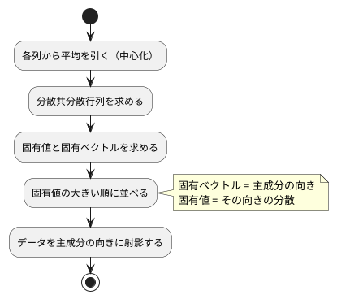

# 第 13 章: 主成分分析による次元削減

## 13.1 はじめに

ここまでの章では、正解ラベルのあるデータで予測をしてきました。この章から扱う **教師なし学習** では、正解ラベルを使わずに、データそのものの構造を調べます。

最初に扱うのは **主成分分析（PCA）** です。住宅価格のデータには 15 個もの列がありますが、列どうしは互いに関係しあっていて、実際にはもっと少ない数の「軸」で大部分を説明できることがあります。主成分分析は、データのばらつきを最もよく説明する新しい軸を探し、たくさんの列を少数の軸に要約します。

[Python 版の第 13 章](../python/13-principal-component-analysis.md) では、NumPy の固有値分解で主成分分析を自作し、scikit-learn の `PCA` と突き合わせました。[Kotlin 版の第 13 章](../kotlin/13-principal-component-analysis.md) では、Tribuo に主成分分析が無いため、突き合わせの代わりに主成分が満たすべき性質をテストにしました。

TypeScript 版では、行列の計算と固有値分解に [ml-matrix](https://github.com/mljs/matrix) を使い、主成分分析を自作します。ml.js には主成分分析のパッケージ [ml-pca](https://github.com/mljs/pca) があるので、最後に ml-pca と寄与率・主成分を突き合わせます。途中で、固有値の **並び順** と固有ベクトルの **符号** という、ライブラリによって振る舞いが違う 2 つの点に出会います。

## 13.2 主成分分析とは

### ばらつきが最も大きい方向を探す

2 つの列が強く相関しているデータを散布図にすると、点は斜めの帯のように並びます。このとき、帯に沿った方向の 1 本の軸を取れば、2 つの列の情報をほぼ 1 つの数値で表せます。この「ばらつき（分散）が最も大きい方向」が **第 1 主成分** です。第 2 主成分は、第 1 主成分と直交する方向のうち、ばらつきが最も大きい方向です。

### 分散共分散行列の固有ベクトル

主成分は、次の手順で求められます。



**分散共分散行列** は、対角に各列の分散、それ以外に 2 列の共分散を並べた行列です。この行列の **固有ベクトル** が主成分の向き、**固有値** がその向きのデータの分散になります。行列 `A` の固有ベクトル `v` と固有値 `λ` は、`A v = λ v`（`A` を掛けても向きが変わらず、長さだけが `λ` 倍になる）を満たします。

### 寄与率

各主成分の固有値を、固有値の合計で割った値を **寄与率** と呼びます。その主成分が、データ全体のばらつきのうち何割を説明しているかを表します。第 1 主成分から順に寄与率を足したものが **累積寄与率** です。「累積寄与率が 0.8 に届くまでの主成分を使う」のように、残す軸の数を決める目安に使います。

## 13.3 題材とデータ

この章では、第 9 章と同じ `Boston.csv`（100 件）を、住宅価格 `PRICE` も含めたすべての列で使います。

| 列の種類 | 列 | 注意点 |
|---------|-----|-------|
| 数値 | ZN, INDUS, CHAS, NOX, RM, AGE, DIS, RAD, TAX, PTRATIO, B, LSTAT, PRICE | NOX と RAD に欠損値が 1 件ずつある |
| カテゴリ | CRIME | `high`・`low`・`very_low` の 3 種類の文字列 |

第 2 章と同じく csv-parse で読み、CRIME だけを文字列のまま残し、ほかの列は数値に、空欄は `null` にします。欠損値の件数は、第 2 章の `countMissing` で数えて確かめました。

主成分分析は数値しか扱えず、欠損値があると計算できません。また、列ごとに単位や桁（TAX は数百、NOX は 1 未満）が違うと、桁の大きい列のばらつきが主成分を支配してしまいます。そこで次の前処理をしてから主成分分析をします。

1. 欠損値を列の平均値で補完する
2. CRIME をダミー変数（`low`・`very_low` の 2 列）に置き換える
3. すべての列を平均 0・標準偏差 1 に標準化する

欠損値の補完・ダミー変数・標準化は第 9 章で詳しく扱います。この章では、主成分分析に必要な最小限の前処理だけを章の中に用意します。

データは、1 行を `number[]` にした配列の配列（`number[][]`）で表します。行列の計算は ml-matrix の `Matrix` に任せ、関数の引数と戻り値は `number[][]` にそろえます。

## 13.4 TODO リストの作成

**TODO リスト**:

- [ ] 分散共分散行列を求める
  - [ ] 2 列の分散と共分散を並べる
  - [ ] 3 列でも各列の分散と 2 列ずつの共分散を並べる
- [ ] ml-matrix の固有値分解の振る舞いを確かめる
- [ ] 主成分を求める
  - [ ] 完全に相関する 2 列なら第 1 主成分だけで分散をすべて説明する
  - [ ] 寄与率の大きい順に、指定した数だけ並ぶ
  - [ ] 主成分の向き（符号）をそろえる
  - [ ] 主成分が固有ベクトルの性質を満たす
- [ ] データを主成分の向きに射影する
- [ ] 累積寄与率がしきい値に届く主成分の数を求める
- [ ] 主成分への影響が大きい列を求める
- [ ] Boston を前処理する（欠損値の補完・ダミー変数・標準化）
- [ ] 実データで寄与率と主成分の意味を表示する
- [ ] ml-pca と突き合わせる

## 13.5 分散共分散行列を求める

### Red

`[1, 3, 5]` と `[2, 6, 10]` の 2 列は、2 列目がちょうど 1 列目の 2 倍です。分散は n − 1 で割ると 4 と 16、共分散は 8 になります。

```typescript
// test/chapter13/pca.test.ts
import { describe, expect, it } from "vitest";
import { covarianceMatrix } from "../../src/chapter13/pca.ts";

function closeToMatrix(expected: number[][]): unknown[][] {
  return expected.map((row) => row.map((value) => expect.closeTo(value, 9)));
}

describe("covarianceMatrix", () => {
  it("2 列の分散と共分散を並べた行列を返す", () => {
    const x = [
      [1, 2],
      [3, 6],
      [5, 10],
    ];

    expect(covarianceMatrix(x)).toEqual(
      closeToMatrix([
        [4, 8],
        [8, 16],
      ]),
    );
  });
});
```

計算で求めた小数は誤差を含むので、完全一致では比べられません。`expect.closeTo(value, 9)` は、小数第 9 位までの誤差を許して数値と一致する **非対称マッチャー** です。`closeToMatrix` は、期待する行列の要素をすべて `expect.closeTo` に置き換えたものを作ります。`toEqual` に渡すと、行数・列数は完全に一致し、要素は誤差を許して比べます。

```text
 FAIL  test/chapter13/pca.test.ts [ test/chapter13/pca.test.ts ]
Error: Cannot find module '../../src/chapter13/pca.ts' imported from .../apps/node/test/chapter13/pca.test.ts
 Test Files  1 failed (1)
      Tests  no tests
```

### Green: 仮実装から三角測量へ

期待する行列をそのまま返す仮実装で Green にします。

```typescript
// src/chapter13/pca.ts
export function covarianceMatrix(_x: number[][]): number[][] {
  return [
    [4, 8],
    [8, 16],
  ];
}
```

三角測量には、手で計算できる 3 列の例を用意します。3 列目 `[0, 1, 5]` の平均は 2、平均との差は `[-2, -1, 3]` です。1 列目の差 `[-2, 0, 2]` との積の和は 10 なので共分散は 10 / 2 = 5、2 乗の和は 14 なので分散は 7 になります。

```typescript
  it("3 列でも各列の分散と 2 列ずつの共分散を並べる", () => {
    const x = [
      [1, 2, 0],
      [3, 6, 1],
      [5, 10, 5],
    ];

    expect(covarianceMatrix(x)).toEqual(
      closeToMatrix([
        [4, 8, 5],
        [8, 16, 10],
        [5, 10, 7],
      ]),
    );
  });
```

```text
 FAIL  test/chapter13/pca.test.ts > covarianceMatrix > 3 列でも各列の分散と 2 列ずつの共分散を並べる
AssertionError: expected [ [ 4, 8 ], [ 8, 16 ] ] to deeply equal [ [ …(3) ], [ …(3) ], [ …(3) ] ]
- Expected
+ Received
  [
    [
      4,
      8,
-     NumberCloseTo 5 (9 digits),
    ],
    [
      8,
      16,
-     NumberCloseTo 10 (9 digits),
-   ],
-   [
-     NumberCloseTo 5 (9 digits),
-     NumberCloseTo 10 (9 digits),
-     NumberCloseTo 7 (9 digits),
    ],
  ]
      Tests  1 failed | 1 passed (2)
```

差分を見ると、3 列目と 3 行目がまるごと足りないことが分かります。

中心化した行列 `Xc` を使うと、分散共分散行列は `Xcᵀ Xc / (n − 1)` と書けます。転置と積は ml-matrix の `Matrix` に任せます。

```typescript
import { Matrix } from "ml-matrix";

export function columnMeans(x: number[][]): number[] {
  return new Matrix(x).mean("column");
}

export function covarianceMatrix(x: number[][]): number[][] {
  const centered = new Matrix(x).subRowVector(columnMeans(x));
  return centered
    .transpose()
    .mmul(centered)
    .div(x.length - 1)
    .to2DArray();
}
```

- `mean("column")` は列ごとの平均を配列で返します
- `subRowVector(means)` は、各行から `means` を要素ごとに引きます。ml-matrix の演算の多くは **行列そのものを書き換えて** 自分を返すので、引数の `x` を書き換えないよう、`new Matrix(x)` で複製してから引いています
- `mmul` は行列の積、`div` はすべての要素を割る演算、`to2DArray` は `number[][]` に戻す関数です

```text
 Test Files  1 passed (1)
      Tests  2 passed (2)
```

## 13.6 ml-matrix の固有値分解を確かめる

### 学習用テストを書く

固有値分解は、自分で実装すると数値計算の難しい部分に踏み込むことになります。ここでは ml-matrix の `EVD`（EigenvalueDecomposition）を使います。初めて使うライブラリの振る舞いは、使う前に学習用テストで確かめます。

[ADR 003](../../../adr/003-typescript-ml-libraries.md) の調査で、`EVD` の `realEigenvalues` は小さい順に並ぶことが分かっていました。Kotlin 版で使った Tribuo は大きい順でした。並び順はライブラリによって違うので、ml-matrix の振る舞いをテストに固定しておきます。

```typescript
// test/chapter13/ml-matrix-evd-learning.test.ts
import { EVD, Matrix } from "ml-matrix";
import { describe, expect, it } from "vitest";

function round(values: number[]): number[] {
  return values.map((value) => Math.round(value * 1e9) / 1e9);
}

describe("ml-matrix の EVD（学習用テスト）", () => {
  const symmetric = new Matrix([
    [2, 1],
    [1, 2],
  ]);

  it("対称行列の固有値を小さい順に返す", () => {
    const evd = new EVD(symmetric);

    expect(round(evd.realEigenvalues)).toEqual([1, 3]);
  });

  it("対角成分の並びに関係なく固有値を小さい順に並べ替える", () => {
    const diagonal = new Matrix([
      [1, 0, 0],
      [0, 5, 0],
      [0, 0, 3],
    ]);

    const evd = new EVD(diagonal);

    expect(round(evd.realEigenvalues)).toEqual([1, 3, 5]);
  });

  it("i 番目の固有ベクトルは固有ベクトル行列の i 列目で、行列を掛けると i 番目の固有値倍になる", () => {
    const evd = new EVD(symmetric);

    for (let i = 0; i < 2; i++) {
      const v = evd.eigenvectorMatrix.getColumnVector(i);
      const av = symmetric.mmul(v).to1DArray();
      const lambda = evd.realEigenvalues[i] as number;
      expect(av).toEqual(
        v.to1DArray().map((value) => expect.closeTo(lambda * value, 9)),
      );
    }
  });

  it("対称でない行列では、複素数の固有値の虚部を imaginaryEigenvalues に返す", () => {
    const rotation = new Matrix([
      [0, -1],
      [1, 0],
    ]);

    const evd = new EVD(rotation);

    expect(round(evd.imaginaryEigenvalues)).toEqual([1, -1]);
  });
});
```

- 固有値は計算誤差を含むので、小数第 9 位で丸めてから配列として比べています
- `noUncheckedIndexedAccess` により、`evd.realEigenvalues[i]` の型は `number | undefined` になります。`i` はループの範囲内なので、`as number` で `number` として扱っています

```text
 Test Files  1 passed (1)
      Tests  4 passed (4)
```

学習用テストは、ライブラリの振る舞いを記録するテストなので、実装を書かずに通るのが普通です。

### ソースで裏付ける

テストの例がたまたま小さい順になった可能性もあるので、ml-matrix 6.15.0 のソース（`src/dc/evd.js`）を確認しました。

- 行列が対称なら、対称行列用の計算（`tred2` と `tql2`）を使う。`tql2` の最後で、固有値を小さい順に並べ替え、固有ベクトルの列も同じ順に入れ替える
- 対称かどうかは `isSymmetric()` で判定し、`(i, j)` 要素と `(j, i)` 要素が完全に一致するかで決める。一致しなければ一般の行列用の計算（`orthes` と `hqr2`）を使い、並べ替えない
- `assumeSymmetric: true` を渡すと、判定を省いて対称行列として扱う

分散共分散行列は、`(i, j)` 要素と `(j, i)` 要素を同じ掛け算の和で求めるので、計算誤差があっても完全に対称になります。したがって、`covarianceMatrix` の結果は常に並べ替えられた固有値で返ってきます。

## 13.7 主成分を求める

### 完全に相関する 2 列

先ほどの 2 列のデータは、点がすべて `(1, 2)` 方向の直線上にあります。したがって第 1 主成分は長さ 1 の `(1, 2) / √5`、寄与率は第 1 主成分が 1、第 2 主成分が 0 になるはずです。

```typescript
function closeToList(expected: number[]): unknown[] {
  return expected.map((value) => expect.closeTo(value, 9));
}

describe("fitPca", () => {
  it("完全に相関する 2 列なら第 1 主成分だけで分散をすべて説明する", () => {
    const x = [
      [1, 2],
      [3, 6],
      [5, 10],
    ];

    const model = fitPca(x, 2);

    expect(model.components[0]).toEqual(
      closeToList([1 / Math.sqrt(5), 2 / Math.sqrt(5)]),
    );
    expect(model.explainedVarianceRatio).toEqual(closeToList([1, 0]));
  });
});
```

`expect.closeTo` は絶対誤差で比べるので、計算でごく小さな値が出ても 0 との比較が成り立ちます。

```text
 FAIL  test/chapter13/pca.test.ts > fitPca > 完全に相関する 2 列なら第 1 主成分だけで分散をすべて説明する
TypeError: fitPca is not a function
      Tests  1 failed | 2 passed (3)
```

```text
test/chapter13/pca.test.ts(2,28): error TS2305: Module '"../../src/chapter13/pca.ts"' has no exported member 'fitPca'.
```

1 つ目は Vitest、2 つ目は `tsc --noEmit` の出力です。Vitest は型を取り除いて実行するだけなので、存在しない関数の import は実行時の `TypeError` として見つかり、型チェックでは `TS2305` として見つかります。

13.2 節の手順をそのまま実装します。学習した結果は、Kotlin 版と同じ形の `PcaModel` にまとめます。

```typescript
import { EVD, Matrix } from "ml-matrix";

/** 学習した主成分分析のモデル。components の 1 行が 1 つの主成分を表す */
export interface PcaModel {
  mean: number[];
  components: number[][];
  explainedVariance: number[];
  explainedVarianceRatio: number[];
}
```

```typescript
export function fitPca(x: number[][], nComponents: number): PcaModel {
  const evd = new EVD(covarianceMatrix(x));
  // EVD は固有値を小さい順に返すので、大きい順に並べ替える
  const order = evd.realEigenvalues.map((_, i) => i).reverse();
  const eigenvalues = order.map((i) => evd.realEigenvalues[i] as number);
  const total = eigenvalues.reduce((sum, value) => sum + value, 0);
  const selected = order.slice(0, nComponents);
  return {
    mean: columnMeans(x),
    components: selected.map((i) => evd.eigenvectorMatrix.getColumn(i)),
    explainedVariance: eigenvalues.slice(0, nComponents),
    explainedVarianceRatio: eigenvalues
      .slice(0, nComponents)
      .map((value) => value / total),
  };
}
```

- 学習用テストで確かめたとおり、固有値は小さい順です。位置の配列 `[0, 1, …]` を `reverse()` で逆順にして、大きい順の位置 `order` を作ります
- 固有ベクトルは列に並んでいるので、`getColumn(i)` で 1 本ずつ取り出し、`components` の 1 行を 1 つの主成分にしています

```text
 Test Files  1 passed (1)
      Tests  3 passed (3)
```

### 寄与率の順と、すり抜けた符号のテスト

乱数で作った 4 列の人工データで、寄与率が大きい順に並ぶことを確かめます。2 つの隠れた変数を 4 列に混ぜ、小さなノイズを加えたデータです。TypeScript には正規分布の乱数が無いので、第 2 章のシード付き乱数 `createRandom` から **ボックス＝ミュラー法** で作ります。このデータは第 13 章の複数のテストファイルで使うので、`test/chapter13/mixed-dataset.ts` に置きました（ファイル名が `.test.ts` で終わらないので、Vitest はテストとして実行しません）。

```typescript
// test/chapter13/mixed-dataset.ts
import { createRandom } from "../../src/chapter02/random.ts";

/** 平均 0・標準偏差 1 の正規分布の乱数（ボックス＝ミュラー法） */
function gaussian(random: () => number): number {
  return (
    Math.sqrt(-2 * Math.log(1 - random())) * Math.cos(2 * Math.PI * random())
  );
}

/** 2 つの隠れた変数を 4 列に混ぜ、小さなノイズを加えた 40 行の架空のデータ */
export function mixedDataset(): number[][] {
  const random = createRandom(0);
  const mixing = [
    [2, 0.5],
    [0.3, 1],
    [1, -1],
    [0, 0.2],
  ];
  return Array.from({ length: 40 }, () => {
    const base = [gaussian(random), gaussian(random)];
    return mixing.map(
      (weights) =>
        weights.reduce((sum, w, i) => sum + w * (base[i] as number), 0) +
        gaussian(random) * 0.1,
    );
  });
}
```

`random()` は 0 以上 1 未満の値を返すので、`1 - random()` は 0 になりません。`Math.log(0)` を避けるための書き方です。

```typescript
  it("主成分は寄与率の大きい順に指定した数だけ並ぶ", () => {
    const model = fitPca(mixedDataset(), 3);

    const ratios = model.explainedVarianceRatio;
    expect(ratios).toHaveLength(3);
    expect(ratios).toEqual([...ratios].sort((a, b) => b - a));
  });
```

`sort` は配列そのものを並べ替えるので、`[...ratios]` で複製してから並べ替え、元の順と比べています。

固有ベクトル `v` が主成分の向きなら、逆向きの `−v` も同じ直線を表す固有ベクトルです。どちらの符号が返るかは計算方法によって決まり、決まった規則はありません。Python 版・Kotlin 版と同じく、「絶対値が最大の要素が正になる」ように向きをそろえる、という仕様にします。まず、負の相関を持つ 2 列で第 1 主成分の向きを確かめるテストを書きました。

```typescript
  it("主成分の向きは絶対値が最大の要素が正になるようにそろえる", () => {
    const x = [
      [1, -2],
      [3, -6],
      [5, -10],
    ];

    const model = fitPca(x, 1);

    expect(model.components[0]).toEqual(
      closeToList([-1 / Math.sqrt(5), 2 / Math.sqrt(5)]),
    );
  });
```

Red になるはずでしたが、実際には **2 つとも通ってしまいました**。

```text
 Test Files  1 passed (1)
      Tests  5 passed (5)
```

寄与率の順は `reverse()` で並べているので通って当然ですが、符号のテストは、向きをそろえる処理がまだ無いのに通っています。ml-matrix がたまたま期待どおりの向きを返しただけです。Red を確認できないテストは、何も確かめていないのと同じです。

ml-matrix が逆向きを返す例を探すため、`(1, 2)` 方向と `(1, −2)` 方向の直線上のデータで、向きをそろえる前の主成分を一時的なスクリプトで表示しました。

```text
PROBE pos [[0.4472135954999579,0.8944271909999159],[-0.8944271909999159,0.4472135954999579]]
PROBE neg [[-0.4472135954999579,0.8944271909999159],[-0.8944271909999159,-0.4472135954999579]]
```

どちらも第 2 主成分は、絶対値が最大の要素 `−0.894` が負でした。Kotlin 版で Tribuo が返した値と、符号まで同じです。そこで Kotlin 版と同じく、`(1, 2)` 方向のデータの **第 2 主成分** で向きを確かめるテストに書き直します。

```typescript
  it("主成分の向きは絶対値が最大の要素が正になるようにそろえる", () => {
    const x = [
      [1, 2],
      [3, 6],
      [5, 10],
    ];

    const model = fitPca(x, 2);

    expect(model.components[1]).toEqual(
      closeToList([2 / Math.sqrt(5), -1 / Math.sqrt(5)]),
    );
  });
```

```text
 FAIL  test/chapter13/pca.test.ts > fitPca > 主成分の向きは絶対値が最大の要素が正になるようにそろえる
AssertionError: expected [ -0.8944271909999159, …(1) ] to deeply equal [ NumberCloseTo{…}, NumberCloseTo{…} ]
- Expected
+ Received
  [
-   NumberCloseTo 0.8944271909999159 (9 digits),
-   NumberCloseTo -0.4472135954999579 (9 digits),
+   -0.8944271909999159,
+   0.4472135954999579,
  ]
      Tests  1 failed | 4 passed (5)
```

今度は期待どおり Red になりました。各主成分について、絶対値が最大の要素の符号（1 か −1）を行全体に掛ける `normalizeSigns` を実装し、`fitPca` から使います。

```typescript
/** 固有ベクトルは符号が逆でも同じ向きを表すので、絶対値が最大の要素が正になるようにそろえる */
export function normalizeSigns(components: number[][]): number[][] {
  return components.map((row) => {
    const largest = row.reduce((a, b) => (Math.abs(b) > Math.abs(a) ? b : a));
    return row.map((value) => value * Math.sign(largest));
  });
}
```

```typescript
    components: normalizeSigns(
      selected.map((i) => evd.eigenvectorMatrix.getColumn(i)),
    ),
```

- `reduce` の初期値を省くと、先頭の要素から始めて、絶対値の大きいほうを残していきます。残るのは絶対値が最大の **要素そのもの**（符号付き）です
- `Math.sign` は、正なら 1、負なら −1 を返します

`normalizeSigns` にも、Python 版・Kotlin 版と同じ専用のテストを足して振る舞いを固定します。

```typescript
describe("normalizeSigns", () => {
  it("絶対値が最大の要素が正になるように主成分の向きをそろえる", () => {
    const components = [
      [0.6, -0.8],
      [-0.8, 0.6],
    ];

    expect(normalizeSigns(components)).toEqual(
      closeToMatrix([
        [-0.6, 0.8],
        [0.8, -0.6],
      ]),
    );
  });
});
```

```text
 Test Files  1 passed (1)
      Tests  6 passed (6)
```

### 主成分が満たすべき性質をテストにする

ml-pca との突き合わせは 13.13 節で行いますが、その前に、主成分分析の結果が満たすべき **性質** もテストにしておきます。ライブラリと突き合わせるテストは「ライブラリと同じ」ことしか保証しませんが、性質のテストは「数学的に正しい」ことを保証します。

- 主成分は長さ 1 で、互いに直交する。主成分を並べた行列 `C` と転置の積 `C Cᵀ` は単位行列になる
- 主成分 `v` は分散共分散行列 `A` の固有ベクトルで、`A v` は `v` の「その主成分の分散」倍になる

```typescript
  it("主成分は長さ 1 で互いに直交する", () => {
    const model = fitPca(mixedDataset(), 3);

    const c = new Matrix(model.components);
    const gram = c.mmul(c.transpose()).to2DArray();

    expect(gram).toEqual(closeToMatrix(Matrix.eye(3).to2DArray()));
  });

  it("主成分は分散共分散行列に掛けると分散の倍数になる固有ベクトル", () => {
    const x = mixedDataset();

    const model = fitPca(x, 3);

    const covariance = new Matrix(covarianceMatrix(x));
    model.components.forEach((component, i) => {
      const variance = model.explainedVariance[i] as number;
      const projected = covariance.mmul(Matrix.columnVector(component));
      expect(projected.to1DArray()).toEqual(
        closeToList(component.map((value) => value * variance)),
      );
    });
  });
```

`Matrix.eye(3)` は 3 × 3 の単位行列、`Matrix.columnVector(component)` は配列を 1 列の行列（列ベクトル）にします。

```text
 Test Files  1 passed (1)
      Tests  8 passed (8)
```

どちらのテストも、実装を変えずに通ります。固有値分解をどう計算しても満たすべき性質なので、ml-matrix の版を上げたときや、自前の計算に差し替えたときの安全網になります。

## 13.8 データを主成分の向きに射影する

データを主成分の軸で表し直すには、平均を引いてから主成分の向きとの内積を取ります。平均が `(1, 2)`、主成分が `(0.6, 0.8)` のモデルに `(2, 3)` を渡すと、`(1, 1)` と `(0.6, 0.8)` の内積で 1.4 になります。

```typescript
describe("transform", () => {
  it("平均を引いてから主成分の向きに射影する", () => {
    const model: PcaModel = {
      mean: [1, 2],
      components: [[0.6, 0.8]],
      explainedVariance: [1],
      explainedVarianceRatio: [1],
    };

    const x = [
      [2, 3],
      [1, 2],
    ];

    expect(transform(model, x)).toEqual(closeToMatrix([[1.4], [0]]));
  });
});
```

テストの `PcaModel` は、学習を経由せずにオブジェクトリテラルで直接組み立てています。`PcaModel` はただのデータの形（`interface`）なので、射影だけをテストできます。`import` では `type PcaModel` と書き、型だけの import であることを明示します（`verbatimModuleSyntax` の規則です）。

## 13.9 必要な主成分の数を求める

寄与率が `[0.5, 0.25, 0.25]` のとき、累積寄与率は `[0.5, 0.75, 1]` です。しきい値 0.75 に届くのは 2 つ目です。射影のテストと一緒に書きました。

```typescript
describe("componentsNeeded", () => {
  it("累積寄与率がしきい値に届くまでの主成分の数を返す", () => {
    expect(componentsNeeded([0.5, 0.25, 0.25], 0.75)).toBe(2);
  });
});
```

```text
 FAIL  test/chapter13/pca.test.ts > transform > 平均を引いてから主成分の向きに射影する
TypeError: transform is not a function
 FAIL  test/chapter13/pca.test.ts > componentsNeeded > 累積寄与率がしきい値に届くまでの主成分の数を返す
TypeError: componentsNeeded is not a function
      Tests  2 failed | 8 passed (10)
```

`transform` は明白な実装、`componentsNeeded` は 2 を返す仮実装で Green にします。

```typescript
export function transform(model: PcaModel, x: number[][]): number[][] {
  return new Matrix(x)
    .subRowVector(model.mean)
    .mmul(new Matrix(model.components).transpose())
    .to2DArray();
}

export function componentsNeeded(
  _ratios: number[],
  _threshold: number,
): number {
  return 2;
}
```

`components` の 1 行が 1 つの主成分なので、データの行列に `components` の転置を掛けると、1 行のデータが「主成分ごとの座標」の 1 行に変わります。仮実装の引数名の先頭の `_` は、使わない引数であることを示します。

```text
      Tests  10 passed (10)
```

しきい値を 0.8 に上げると 3 つ必要になる例で三角測量します。

```typescript
  it("しきい値を上げると必要な主成分の数が増える", () => {
    expect(componentsNeeded([0.5, 0.25, 0.25], 0.8)).toBe(3);
  });
```

```text
 FAIL  test/chapter13/pca.test.ts > componentsNeeded > しきい値を上げると必要な主成分の数が増える
AssertionError: expected 2 to be 3 // Object.is equality
- Expected
+ Received
- 3
+ 2
      Tests  1 failed | 10 passed (11)
```

累積和を求めて、しきい値に届く最初の位置を `findIndex` で求めます。位置は 0 から数えるので、個数にするには 1 を足します。

```typescript
/** 先頭から順に足した途中経過を並べる（[0.5, 0.25, 0.25] なら [0.5, 0.75, 1]） */
function cumulativeSum(values: number[]): number[] {
  return values.reduce<number[]>(
    (sums, value) => [...sums, (sums.at(-1) ?? 0) + value],
    [],
  );
}

export function componentsNeeded(ratios: number[], threshold: number): number {
  return cumulativeSum(ratios).findIndex((sum) => sum >= threshold) + 1;
}
```

- JavaScript の配列には Kotlin の `runningReduce` に当たるメソッドが無いので、`reduce` で途中経過の配列を組み立てています。`reduce<number[]>` の型引数で、初期値の空配列 `[]` が `number[]` であることを伝えています
- `sums.at(-1)` は末尾の要素です。空配列では `undefined` になるので、`?? 0` で 0 から始めます

あわせて、`covarianceMatrix` と `transform` に同じ中心化の処理が重複していたので、モジュールの外に公開しない関数に切り出しました。

```typescript
/** 各行から列の平均を引く（元の配列は変えない） */
function center(x: number[][], means: number[]): Matrix {
  return new Matrix(x).subRowVector(means);
}

export function covarianceMatrix(x: number[][]): number[][] {
  const centered = center(x, columnMeans(x));
  return centered
    .transpose()
    .mmul(centered)
    .div(x.length - 1)
    .to2DArray();
}
```

```typescript
export function transform(model: PcaModel, x: number[][]): number[][] {
  return center(x, model.mean)
    .mmul(new Matrix(model.components).transpose())
    .to2DArray();
}
```

`fitPca` も、「固有値を大きい順に並べた配列」と「選んだ分だけの配列」を別々に作っていたので、選んだ位置から一度に作る形に整理しました。完成形は章末のコードを参照してください。

```text
      Tests  15 passed (15)
```

（第 13 章のディレクトリをまとめて実行したので、13.6 節の学習用テスト 4 件を含みます。）

テストの寄与率に `[0.5, 0.25, 0.25]` を選んだのは、2 進数で誤差なく表せる値だからです。`[0.6, 0.3, 0.1]` のような値では、次のように誤差が入ります。

```bash
node -p "0.6 + 0.3"
node -p "[0.6, 0.3, 0.1].reduce((a, b) => a + b)"
```

```text
0.8999999999999999
0.9999999999999999
```

0.6 + 0.3 は浮動小数点数では 0.9 に届かないので、しきい値 0.9 で `componentsNeeded([0.6, 0.3, 0.1], 0.9)` を呼ぶと、2 ではなく 3 が返ります。テストの例を選ぶときは、このような誤差が入り込まない値を使うか、許容誤差を明示します。

## 13.10 主成分への影響が大きい列を求める

主成分の各要素は、元の列がその主成分にどれだけ強く関わるかを表します。絶対値の大きい順に列名を並べると、主成分の意味を読み取る手がかりになります。

```typescript
describe("topLoadings", () => {
  it("係数の絶対値が大きい順に列名と係数を返す", () => {
    const component = [0.1, -0.7, 0.5];

    expect(topLoadings(component, ["ZN", "DIS", "TAX"], 2)).toEqual([
      ["DIS", -0.7],
      ["TAX", 0.5],
    ]);
  });
});
```

```text
 FAIL  test/chapter13/pca.test.ts > topLoadings > 係数の絶対値が大きい順に列名と係数を返す
TypeError: topLoadings is not a function
```

```typescript
export function topLoadings(
  component: number[],
  columns: string[],
  k: number,
): [string, number][] {
  return columns
    .map((column, i): [string, number] => [column, component[i] as number])
    .sort(([, a], [, b]) => Math.abs(b) - Math.abs(a))
    .slice(0, k);
}
```

- 列名と係数の組は、Kotlin の `Pair` の代わりに **タプル型** `[string, number]` で表します。`map` のコールバックに戻り値の型 `: [string, number]` を書かないと、`(string | number)[]` と推論されてしまいます
- `sort` の比較関数の引数 `([, a], [, b])` は、タプルの 2 つ目の要素だけを取り出す分割代入です。`map` で作った新しい配列を並べ替えるので、引数の配列は書き換えません

```text
 Test Files  2 passed (2)
      Tests  16 passed (16)
```

（`Test Files` が 2 になっているのは、13.6 節の学習用テストのファイルも同じディレクトリにあるからです。）

## 13.11 Boston を前処理する

### ダミー変数

前処理は `src/chapter13/boston-standardized.ts` に分けます。テストには、CRIME の 3 種類と欠損値を含む 4 行の架空のデータを使います。

```typescript
// test/chapter13/boston-standardized.test.ts
import { describe, expect, it } from "vitest";
import { standardizeBoston } from "../../src/chapter13/boston-standardized.ts";

const COLUMNS = ["RM", "PRICE"] as const;

function bostonLike() {
  return [
    { CRIME: "high", RM: 5, PRICE: 10 },
    { CRIME: "low", RM: 6, PRICE: 20 },
    { CRIME: "very_low", RM: null, PRICE: 30 },
    { CRIME: "low", RM: 7, PRICE: 40 },
  ];
}

describe("standardizeBoston", () => {
  it("CRIME をダミー変数の列に置き換える", () => {
    const table = standardizeBoston(bostonLike(), COLUMNS);

    expect(table.columns).toEqual(["RM", "PRICE", "low", "very_low"]);
  });
});
```

実データの 13 個の数値の列をテストに全部書くのは大変なので、`standardizeBoston` は数値の列の名前を引数で受け取る設計にしました。第 2 章の `columnMeans(rows, columns)` と同じ考え方です。

```text
 FAIL  test/chapter13/boston-standardized.test.ts [ test/chapter13/boston-standardized.test.ts ]
Error: Cannot find module '../../src/chapter13/boston-standardized.ts' imported from .../apps/node/test/chapter13/boston-standardized.test.ts
```

まずダミー変数だけを実装します。カテゴリを名前の順に並べて最初の `high` を除き、残りの `low`・`very_low` の列を足します。`low` も `very_low` も 0 なら `high` だと分かるので、3 列目は情報として重複するからです。

```typescript
// src/chapter13/boston-standardized.ts
const CRIME = "CRIME";

/** 数値の列と、カテゴリの列 CRIME を持つ 1 行 */
export type BostonLikeRow<K extends string> = Record<K, number | null> & {
  [CRIME]: string;
};

/** 列名と、1 行を数値の配列で表したデータ */
export interface NumericTable {
  columns: string[];
  x: number[][];
}

export function standardizeBoston<K extends string>(
  rows: readonly BostonLikeRow<K>[],
  columns: readonly K[],
): NumericTable {
  const crime = rows.map((row) => row[CRIME]);
  const categories = [...new Set(crime)].sort().slice(1);
  return {
    columns: [...columns, ...categories],
    x: rows.map((row, i) => [
      ...columns.map((column) => row[column] ?? 0),
      ...categories.map((category) => (crime[i] === category ? 1 : 0)),
    ]),
  };
}
```

- `BostonLikeRow<K>` は、`K` の列が `number | null`、`CRIME` の列が `string` の行です。第 2 章の `IrisRow` と同じく、2 つの型を `&`（交差型）で合わせています。`[CRIME]` は、定数 `CRIME` の値 `"CRIME"` をプロパティ名に使う書き方です
- テストの `bostonLike()` の戻り値には型を書いていませんが、構造的型付けにより `BostonLikeRow<"RM" | "PRICE">[]` として受け取れます
- `[...new Set(crime)]` で重複を除き、`sort()` で名前の順に並べ、`slice(1)` で最初の 1 つを除いています
- 行列の値は `number` でなければならないので、欠損値は `?? 0` で仮に 0 にしています。欠損値の扱いは次のテストで決めます

```text
      Tests  1 passed (1)
```

### 補完と標準化

次に、欠損値の補完と標準化を求めるテストを足します。標準偏差は、Python 版の `std(ddof=0)`・Kotlin 版と同じく件数 n で割ります。

```typescript
  it("欠損値を補完してから各列を平均 0 と標準偏差 1 にそろえる", () => {
    const table = standardizeBoston(bostonLike(), COLUMNS);

    table.columns.forEach((column, j) => {
      const values = table.x.map((row) => row[j] as number);
      const mean = values.reduce((sum, v) => sum + v, 0) / values.length;
      const variance =
        values.reduce((sum, v) => sum + (v - mean) ** 2, 0) / values.length;
      expect({ column, mean, std: Math.sqrt(variance) }).toEqual({
        column,
        mean: expect.closeTo(0, 9),
        std: expect.closeTo(1, 9),
      });
    });
  });
```

列名・平均・標準偏差を 1 つのオブジェクトにして比べると、失敗したときに **どの列で** 失敗したのかが差分に出ます。

```text
 FAIL  test/chapter13/boston-standardized.test.ts > standardizeBoston > 欠損値を補完してから各列を平均 0 と標準偏差 1 にそろえる
AssertionError: expected { column: 'RM', mean: 4.5, …(1) } to deeply equal { column: 'RM', …(2) }
- Expected
+ Received
  {
    "column": "RM",
-   "mean": NumberCloseTo 0 (9 digits),
-   "std": NumberCloseTo 1 (9 digits),
+   "mean": 4.5,
+   "std": 2.692582403567252,
  }
```

RM の平均 4.5 は、欠損値を 0 にした `5, 6, 0, 7` の平均です。数値の列とダミー変数の列を、列ごとの配列にしてから標準化する形に書き直しました。

```typescript
/** 平均 0・標準偏差 1 にそろえる（標準偏差は件数 n で割る） */
function standardize(values: number[]): number[] {
  const mean = values.reduce((sum, v) => sum + v, 0) / values.length;
  const variance =
    values.reduce((sum, v) => sum + (v - mean) ** 2, 0) / values.length;
  return values.map((v) => (v - mean) / Math.sqrt(variance));
}

export function standardizeBoston<K extends string>(
  rows: readonly BostonLikeRow<K>[],
  columns: readonly K[],
): NumericTable {
  const crime = rows.map((row) => row[CRIME]);
  const categories = [...new Set(crime)].sort().slice(1);
  const numeric = columns.map((column) =>
    rows.map((row) => row[column] ?? 0),
  );
  const dummies = categories.map((category) =>
    crime.map((value) => (value === category ? 1 : 0)),
  );
  const standardized = [...numeric, ...dummies].map(standardize);
  return {
    columns: [...columns, ...categories],
    x: rows.map((_, i) => standardized.map((values) => values[i] as number)),
  };
}
```

`numeric` と `dummies` は「1 列を 1 つの配列」にした形です。列ごとに標準化してから、最後に `x` で「1 行を 1 つの配列」の形に組み替えています。

```text
      Tests  2 passed (2)
```

### 仮の 0 を見逃さないテスト

テストは通りましたが、欠損値はまだ仮の 0 のままです。それなのにテスト名の「欠損値を補完してから」が通ってしまうのは、**どんな値で補完しても、標準化すれば平均 0・標準偏差 1 になる** からです。このテストは標準化を確かめていても、補完の値を確かめていません。

そこで、補完の値が結果に表れる例を足します。RM の `5, 6, (欠損), 7` を平均 6 で補完すると `5, 6, 6, 7` になります。平均は 6、分散は `(1 + 0 + 0 + 1) / 4 = 0.5` なので、標準化すると `−√2, 0, 0, √2` になるはずです。

```typescript
  it("欠損値は同じ列の平均値で補完する", () => {
    const table = standardizeBoston(bostonLike(), COLUMNS);

    // RM は 5・6・7 の平均 6 で補完されて 5・6・6・7 になり、標準偏差は √0.5
    const rm = table.x.map((row) => row[0]);
    expect(rm).toEqual(
      [-Math.SQRT2, 0, 0, Math.SQRT2].map((v) => expect.closeTo(v, 9)),
    );
  });
```

```text
 FAIL  test/chapter13/boston-standardized.test.ts > standardizeBoston > 欠損値は同じ列の平均値で補完する
AssertionError: expected [ 0.18569533817705186, …(3) ] to deeply equal [ NumberCloseTo{…}, …(3) ]
- Expected
+ Received
  [
-   NumberCloseTo -1.4142135623730951 (9 digits),
-   NumberCloseTo 0 (9 digits),
-   NumberCloseTo 0 (9 digits),
-   NumberCloseTo 1.4142135623730951 (9 digits),
+   0.18569533817705186,
+   0.5570860145311556,
+   -1.671258043593467,
+   0.9284766908852594,
  ]
      Tests  1 failed | 2 passed (3)
```

仮の 0 が 3 行目で −1.67 として表れ、Red になりました。欠損値を除いた列の平均は、第 2 章の `columnMeans` で求められます。

```typescript
import { columnMeans } from "../chapter02/iris-preprocessing.ts";
```

```typescript
  const means = columnMeans(rows, columns);
  const numeric = columns.map((column) =>
    rows.map((row) => row[column] ?? means[column]),
  );
```

第 2 章の `columnMeans` は `Record<K, number | null>[]` を受け取るので、`BostonLikeRow<K>[]` をそのまま渡せます。交差型の行は、`Record<K, number | null>` の性質も持っているからです。

```text
      Tests  19 passed (19)
```

Kotlin 版では、欠損値の `null` を `Number` として扱おうとして例外になり、補完が必要なことに気づきました。TypeScript 版では、`number | null` を `number[][]` に入れるには何かの値が必要なことを型チェックが教えてくれますが、仮の値を置くとテストをすり抜けてしまいます。仮実装を書いたら、その仮の値を見分けられるテストがあるかを確かめます。

**TODO リスト**:

- [x] 分散共分散行列を求める
  - [x] 2 列の分散と共分散を並べる
  - [x] 3 列でも各列の分散と 2 列ずつの共分散を並べる
- [x] ml-matrix の固有値分解の振る舞いを確かめる
- [x] 主成分を求める
  - [x] 完全に相関する 2 列なら第 1 主成分だけで分散をすべて説明する
  - [x] 寄与率の大きい順に、指定した数だけ並ぶ
  - [x] 主成分の向き（符号）をそろえる
  - [x] 主成分が固有ベクトルの性質を満たす
- [x] データを主成分の向きに射影する
- [x] 累積寄与率がしきい値に届く主成分の数を求める
- [x] 主成分への影響が大きい列を求める
- [x] Boston を前処理する（欠損値の補完・ダミー変数・標準化）
- [ ] 実データで寄与率と主成分の意味を表示する
- [ ] ml-pca と突き合わせる

## 13.12 実データで要約する

### 表示のテストを先に書く

この章は、訓練データとテストデータに分けず、乱数も使いません。これまでの章では、分割の乱数が言語ごとに違うため、数値が Python 版・Kotlin 版と一致しませんでした。この章では、前処理と固有値分解が同じなら、表示される値も一致するはずです。そこで、Python 版・Kotlin 版の出力を期待値にして、表示のテストを先に書きました。

```typescript
// test/chapter13/boston-pca-data.test.ts
const csvFile = join(dataDir(), "Boston.csv");

describe.skipIf(!existsSync(csvFile))("Boston.csv の実データ", () => {
  let table: NumericTable;

  beforeAll(() => {
    table = loadStandardizedBoston(csvFile);
  });

  it("CRIME をダミー変数にして 15 列の標準化済みデータにする", () => {
    expect([table.x.length, table.columns.length]).toEqual([100, 15]);
  });

  it("実データの主成分も分散共分散行列の固有ベクトルになる", () => {
    const model = fitPca(table.x, 15);

    const covariance = new Matrix(covarianceMatrix(table.x));
    model.components.forEach((component, i) => {
      const variance = model.explainedVariance[i] as number;
      const projected = covariance.mmul(Matrix.columnVector(component));
      expect(projected.to1DArray()).toEqual(
        component.map((value) => expect.closeTo(value * variance, 9)),
      );
    });
    expect(model.explainedVarianceRatio.reduce((a, b) => a + b)).toBeCloseTo(
      1,
      9,
    );
  });

  it("実行すると寄与率と主成分の解釈を表示する", () => {
    const lines: string[] = [];

    main((line) => lines.push(line));

    expect(lines).toEqual([
      "データ件数: 100, 列数: 15",
      "寄与率: PC1 0.4110, PC2 0.1448, PC3 0.1019, PC4 0.0645, PC5 0.0623, PC6 0.0581",
      "累積寄与率が 0.8 に届く主成分の数: 6（累積寄与率 0.8427）",
      "第 1 主成分で影響の大きい列: INDUS 0.359, NOX 0.350, TAX 0.328",
      "第 2 主成分で影響の大きい列: PRICE 0.444, low 0.423, RM 0.405",
    ]);
  });
});
```

データを読み込む処理は、`describe` の本体ではなく `beforeAll` の中に書きます。`describe` の本体はテストを集める段階で実行されるので、そこで読み込むと、データの無い環境では `skipIf` でスキップする前に失敗します（第 3 章で出会った失敗です）。

```text
 FAIL  test/chapter13/boston-pca-data.test.ts [ test/chapter13/boston-pca-data.test.ts ]
Error: Cannot find module '../../src/chapter13/main.ts' imported from .../apps/node/test/chapter13/boston-pca-data.test.ts
```

```text
test/chapter13/boston-pca-data.test.ts(7,3): error TS2724: '"../../src/chapter13/boston-standardized.ts"' has no exported member named 'loadStandardizedBoston'. Did you mean 'standardizeBoston'?
test/chapter13/boston-pca-data.test.ts(9,22): error TS2307: Cannot find module '../../src/chapter13/main.ts' or its corresponding type declarations.
test/chapter13/boston-pca-data.test.ts(46,11): error TS7006: Parameter 'line' implicitly has an 'any' type.
```

3 つ目の型エラーは、`main` の型が分からないため、コールバックの引数 `line` の型も推論できなかったことによる連鎖的なエラーです。

### 結果を表示する

CSV を読む関数は、第 2 章の `loadIris` と同じ形です。

```typescript
export const NUMERIC_COLUMNS = [
  "ZN",
  "INDUS",
  "CHAS",
  "NOX",
  "RM",
  "AGE",
  "DIS",
  "RAD",
  "TAX",
  "PTRATIO",
  "B",
  "LSTAT",
  "PRICE",
] as const;
export type NumericColumn = (typeof NUMERIC_COLUMNS)[number];
```

```typescript
export function loadBoston(csvFile: string): BostonLikeRow<NumericColumn>[] {
  return parse<BostonLikeRow<NumericColumn>>(readFileSync(csvFile), {
    bom: true,
    columns: true,
    cast: (value, context) => {
      if (context.header || context.column === CRIME) {
        return value;
      }
      return value === "" ? null : Number(value);
    },
  });
}

export function loadStandardizedBoston(csvFile: string): NumericTable {
  return standardizeBoston(loadBoston(csvFile), NUMERIC_COLUMNS);
}
```

```typescript
// src/chapter13/main.ts
import { join } from "node:path";
import { dataDir } from "../dataset.ts";
import { loadStandardizedBoston } from "./boston-standardized.ts";
import { componentsNeeded, fitPca, topLoadings } from "./pca.ts";

const THRESHOLD = 0.8;
const TOP_K = 3;
const COMPONENTS_TO_EXPLAIN = 2;

function formatLoadings(loadings: [string, number][]): string {
  return loadings
    .map(([column, value]) => `${column} ${value.toFixed(3)}`)
    .join(", ");
}

export function main(print: (line: string) => void = console.log): void {
  const { columns, x } = loadStandardizedBoston(join(dataDir(), "Boston.csv"));
  const model = fitPca(x, columns.length);
  const ratios = model.explainedVarianceRatio;
  const needed = componentsNeeded(ratios, THRESHOLD);
  const shown = ratios.slice(0, needed);
  print(`データ件数: ${x.length}, 列数: ${columns.length}`);
  print(
    "寄与率: " + shown.map((r, i) => `PC${i + 1} ${r.toFixed(4)}`).join(", "),
  );
  const cumulative = shown.reduce((sum, r) => sum + r, 0);
  print(
    `累積寄与率が ${THRESHOLD} に届く主成分の数: ${needed}（累積寄与率 ${cumulative.toFixed(4)}）`,
  );
  model.components.slice(0, COMPONENTS_TO_EXPLAIN).forEach((component, i) => {
    const loadings = topLoadings(component, columns, TOP_K);
    print(`第 ${i + 1} 主成分で影響の大きい列: ${formatLoadings(loadings)}`);
  });
}

// node src/chapter13/main.ts で直接実行したときだけ main を呼ぶ
if (import.meta.filename === process.argv[1]) {
  main();
}
```

- `const { columns, x } = ...` は、戻り値のオブジェクトからプロパティを取り出す分割代入です
- 表示する主成分の数 `2` にも、何の数かが分かるように `COMPONENTS_TO_EXPLAIN` という名前を付けました

```text
 Test Files  4 passed (4)
      Tests  22 passed (22)
```

3 件とも一度で通りました。表示は Python 版・Kotlin 版と小数第 4 位（係数は第 3 位）まで一致しています。

```bash
node src/chapter13/main.ts
```

```text
データ件数: 100, 列数: 15
寄与率: PC1 0.4110, PC2 0.1448, PC3 0.1019, PC4 0.0645, PC5 0.0623, PC6 0.0581
累積寄与率が 0.8 に届く主成分の数: 6（累積寄与率 0.8427）
第 1 主成分で影響の大きい列: INDUS 0.359, NOX 0.350, TAX 0.328
第 2 主成分で影響の大きい列: PRICE 0.444, low 0.423, RM 0.405
```

NumPy の `eigh`・Tribuo・ml-matrix という別々の固有値分解から、同じ主成分と寄与率が得られています。主成分の向きがそろっているのは、3 つの版で同じ `normalizeSigns` の規則を決めたからです。

### 結果を読む

- **第 1 主成分だけで 4 割を説明する**: 15 列のばらつきのうち 41.1% を、1 本の軸で説明できます
- **15 列を 6 本の軸に要約できる**: 累積寄与率 0.8 を目安にすると、6 つの主成分で全体の 84.3% を説明できます
- **第 1 主成分は「産業化・都市化」の軸と読める**: 非小売業の土地の割合（INDUS）、窒素酸化物の濃度（NOX）、固定資産税率（TAX）が同じ向きに強く効いています
- **第 2 主成分は「住環境のよさ」の軸と読める**: 住宅価格（PRICE）、部屋数（RM）、犯罪率が低い地区（low）が同じ向きに効いています

主成分の「意味」は計算で決まるものではなく、係数を見た人間の解釈です。符号の向きも `normalizeSigns` の規則で決めたものなので、「値が大きいほど都市化している」のか「小さいほど」なのかは、係数の符号とあわせて読む必要があります。

## 13.13 ml-pca と突き合わせる

### 寄与率と主成分を比べる

最後に、自作の主成分分析を ml-pca の `PCA` と突き合わせます。ml-pca は型定義を同梱しているので、`declare module` は要りません。`new PCA(x)` で学習し、`getExplainedVariance()` で寄与率、`getEigenvectors()` で固有ベクトルを取り出せます。ml-pca の固有ベクトルも、ml-matrix と同じく **列** に主成分が並ぶと予想して、転置してから比べるテストを書きました。

```typescript
// test/chapter13/ml-pca.test.ts
import { PCA } from "ml-pca";
import { describe, expect, it } from "vitest";
import { fitPca } from "../../src/chapter13/pca.ts";
import { mixedDataset } from "./mixed-dataset.ts";

function closeToMatrix(expected: number[][]): unknown[][] {
  return expected.map((row) => row.map((value) => expect.closeTo(value, 9)));
}

describe("ml-pca との突き合わせ", () => {
  const x = mixedDataset();
  const mine = fitPca(x, 4);
  const library = new PCA(x);

  it("寄与率が自作の主成分分析と一致する", () => {
    expect(library.getExplainedVariance()).toEqual(
      mine.explainedVarianceRatio.map((r) => expect.closeTo(r, 9)),
    );
  });

  it("固有ベクトル行列の列が主成分で、自作の主成分と一致する", () => {
    const components = library.getEigenvectors().transpose().to2DArray();

    expect(components).toEqual(closeToMatrix(mine.components));
  });
});
```

```text
 FAIL  test/chapter13/ml-pca.test.ts > ml-pca との突き合わせ > 固有ベクトル行列の列が主成分で、自作の主成分と一致する
AssertionError: expected [ [ 0.8969911932123978, …(3) ], …(3) ] to deeply equal [ [ NumberCloseTo{…}, …(3) ], …(3) ]
- Expected
+ Received
@@ -10,17 +10,17 @@
      -0.6355849889011608,
      0.7265121041910364,
      -0.13286316865032505,
    ],
    [
-     NumberCloseTo -0.3761249795365023 (9 digits),
-     NumberCloseTo 0.7558398968485149 (9 digits),
-     NumberCloseTo 0.5272673101020808 (9 digits),
-     NumberCloseTo -0.09604808065967661 (9 digits),
+     0.37612497953650187,
+     -0.755839896848515,
+     -0.52726731010208,
+     0.0960480806596846,
    ],
    [
-     NumberCloseTo -0.058116575126593184 (9 digits),
-     NumberCloseTo -0.010473615704592872 (9 digits),
-     NumberCloseTo 0.15324529532598194 (9 digits),
-     NumberCloseTo 0.9864221441807154 (9 digits),
+     0.058116575126596196,
+     0.010473615704586721,
+     -0.1532452953259862,
+     -0.9864221441807146,
    ],
  ]
      Tests  1 failed | 1 passed (2)
```

寄与率は一致しました。主成分は、第 1・第 2 主成分が一致し（差分の `@@ -10,17 +10,17 @@` より前の行）、第 3・第 4 主成分は **すべての要素の符号が逆** でした。列に主成分が並ぶという予想は当たっていて、違うのは符号だけです。ml-pca は、主成分の向きをそろえる処理をしていません。

自作の主成分と同じ規則で向きをそろえてから比べるように、テストを直します。ml-pca が返す値の意味を確かめるテストなので、固有値（主成分の分散）の比較も足しました。

```typescript
import { fitPca, normalizeSigns } from "../../src/chapter13/pca.ts";
```

```typescript
/** ml-pca の固有ベクトル行列は列が主成分なので、転置して 1 行を 1 つの主成分にする */
function componentsOf(pca: PCA): number[][] {
  return pca.getEigenvectors().transpose().to2DArray();
}
```

```typescript
  it("固有値は n − 1 で割った分散で、自作の主成分の分散と一致する", () => {
    expect(library.getEigenvalues()).toEqual(
      mine.explainedVariance.map((v) => expect.closeTo(v, 9)),
    );
  });

  it("主成分の向きをそろえると、自作の主成分と一致する", () => {
    expect(normalizeSigns(componentsOf(library))).toEqual(
      closeToMatrix(mine.components),
    );
  });
```

### 符号の違いを学習用テストに残す

符号が合わなかったことは、ml-pca を使う人が次にもつまずく点です。学習用テストとして記録しておきます。

調べてみると、ml-pca の既定の計算方法は、分散共分散行列の固有値分解ではなく **特異値分解（SVD）** でした。`method: "covarianceMatrix"` を指定すると、自作と同じく分散共分散行列を固有値分解します。こちらでは、第 1 主成分の符号が SVD と逆になりました。

```typescript
describe("ml-pca の主成分の符号（学習用テスト）", () => {
  const x = mixedDataset();

  it("向きをそろえないと、第 3・第 4 主成分の符号が自作と逆になる", () => {
    const mine = fitPca(x, 4).components;
    const library = componentsOf(new PCA(x));

    const flipped = library.map((component, i) =>
      component.every(
        (value, j) => Math.abs(value + (mine[i]?.[j] as number)) < 1e-9,
      ),
    );

    expect(flipped).toEqual([false, false, true, true]);
  });

  it("計算方法（SVD と分散共分散行列）を変えると、第 1 主成分の符号が変わる", () => {
    const svd = componentsOf(new PCA(x));
    const covariance = componentsOf(new PCA(x, { method: "covarianceMatrix" }));

    expect(covariance[0]).toEqual(
      svd[0]?.map((value) => expect.closeTo(-value, 9)),
    );
  });
});
```

`flipped` は、各主成分について「すべての要素が、自作の主成分の要素と足して 0 になる（符号がちょうど逆）」かどうかを並べた配列です。

同じライブラリでも、計算方法を変えるだけで主成分の符号が変わります。13.7 節で「どちらの符号が返るかは計算方法によって決まり、決まった規則はない」と書いたことを、実際に確かめられました。主成分の符号に依存するコード（係数の解釈や、射影した値の比較）を書くときは、`normalizeSigns` のような規則でそろえてから使います。

### 実データでも突き合わせる

実データのテストにも、ml-pca との突き合わせを足しました。

```typescript
  it("ml-pca と寄与率・主成分が一致する", () => {
    const mine = fitPca(table.x, 15);
    const library = new PCA(table.x);

    expect(library.getExplainedVariance()).toEqual(
      mine.explainedVarianceRatio.map((r) => expect.closeTo(r, 9)),
    );
    const components = library.getEigenvectors().transpose().to2DArray();
    expect(normalizeSigns(components)).toEqual(
      mine.components.map((row) => row.map((v) => expect.closeTo(v, 9))),
    );
  });
```

```text
 Test Files  5 passed (5)
      Tests  28 passed (28)
```

Boston の 15 列でも、15 個すべての主成分の寄与率と、向きをそろえた主成分が、小数第 9 位まで ml-pca と一致しました。

| 検証の手段 | 何を確かめたか |
|-----------|--------------|
| 学習用テスト（`ml-matrix-evd-learning.test.ts`） | ml-matrix の `EVD` が、固有値を小さい順に並べ、固有ベクトルを列に置き、対称でない行列では複素数の固有値の虚部も返すこと |
| 性質のテスト（`pca.test.ts`） | 主成分が長さ 1 で直交し、分散共分散行列の固有ベクトルになっていること |
| ライブラリとの突き合わせ（`ml-pca.test.ts`） | 寄与率・固有値・向きをそろえた主成分が ml-pca と一致すること。ml-pca の主成分の符号が自作や計算方法によって変わること |
| 実データのテスト（`boston-pca-data.test.ts`） | 実データでも固有ベクトルの性質と ml-pca との一致が成り立ち、表示が Python 版・Kotlin 版の結果と一致すること |

他の章では、自作の実装をライブラリに置き換えて終わりにしてきました。この章の自作の実装は、計算が難しい固有値分解だけを ml-matrix に任せ、前後の中心化・分散共分散行列・並べ替え・符号・射影を自分で書いたものです。ml-pca と結果が一致したので、どちらを使っても構いません。ただし ml-pca を使う場合は、主成分の符号をそろえる処理を自分で加える必要があります。

## 13.14 Notebook で探索する

TypeScript 版では Notebook による探索と可視化を扱いません。累積寄与率のグラフ、第 1・第 2 主成分の散布図、CRIME ごとの主成分の平均は、[Python 版の第 13 章](../python/13-principal-component-analysis.md) か [Kotlin 版の 13.14 節](../kotlin/13-principal-component-analysis.md) を参照してください。

## 13.15 品質チェック

第 13 章のテストだけを実行します。

```bash
npx vitest run test/chapter13
```

```text
 Test Files  5 passed (5)
      Tests  28 passed (28)
```

第 13 章のテストは 28 件です。データが無い環境では、実データのテスト 4 件がスキップされます。

```text
 Test Files  4 passed | 1 skipped (5)
      Tests  24 passed | 4 skipped (28)
```

整形・静的解析・型チェック・テストをまとめて実行する `npm run check` も通ります。

```bash
npm run check
```

<details>
<summary>この章の完成コード（src/chapter13/pca.ts）</summary>

```typescript
import { EVD, Matrix } from "ml-matrix";

/** 学習した主成分分析のモデル。components の 1 行が 1 つの主成分を表す */
export interface PcaModel {
  mean: number[];
  components: number[][];
  explainedVariance: number[];
  explainedVarianceRatio: number[];
}

export function columnMeans(x: number[][]): number[] {
  return new Matrix(x).mean("column");
}

/** 各行から列の平均を引く（元の配列は変えない） */
function center(x: number[][], means: number[]): Matrix {
  return new Matrix(x).subRowVector(means);
}

export function covarianceMatrix(x: number[][]): number[][] {
  const centered = center(x, columnMeans(x));
  return centered
    .transpose()
    .mmul(centered)
    .div(x.length - 1)
    .to2DArray();
}

/** 固有ベクトルは符号が逆でも同じ向きを表すので、絶対値が最大の要素が正になるようにそろえる */
export function normalizeSigns(components: number[][]): number[][] {
  return components.map((row) => {
    const largest = row.reduce((a, b) => (Math.abs(b) > Math.abs(a) ? b : a));
    return row.map((value) => value * Math.sign(largest));
  });
}

export function fitPca(x: number[][], nComponents: number): PcaModel {
  const evd = new EVD(covarianceMatrix(x));
  const eigenvalues = evd.realEigenvalues;
  const total = eigenvalues.reduce((sum, value) => sum + value, 0);
  // EVD は固有値を小さい順に返すので、後ろから大きい順に nComponents 個を選ぶ
  const selected = eigenvalues
    .map((_, i) => i)
    .reverse()
    .slice(0, nComponents);
  const variances = selected.map((i) => eigenvalues[i] as number);
  return {
    mean: columnMeans(x),
    components: normalizeSigns(
      selected.map((i) => evd.eigenvectorMatrix.getColumn(i)),
    ),
    explainedVariance: variances,
    explainedVarianceRatio: variances.map((value) => value / total),
  };
}

export function transform(model: PcaModel, x: number[][]): number[][] {
  return center(x, model.mean)
    .mmul(new Matrix(model.components).transpose())
    .to2DArray();
}

/** 先頭から順に足した途中経過を並べる（[0.5, 0.25, 0.25] なら [0.5, 0.75, 1]） */
function cumulativeSum(values: number[]): number[] {
  return values.reduce<number[]>(
    (sums, value) => [...sums, (sums.at(-1) ?? 0) + value],
    [],
  );
}

export function componentsNeeded(ratios: number[], threshold: number): number {
  return cumulativeSum(ratios).findIndex((sum) => sum >= threshold) + 1;
}

export function topLoadings(
  component: number[],
  columns: string[],
  k: number,
): [string, number][] {
  return columns
    .map((column, i): [string, number] => [column, component[i] as number])
    .sort(([, a], [, b]) => Math.abs(b) - Math.abs(a))
    .slice(0, k);
}
```

</details>

<details>
<summary>この章の完成コード（src/chapter13/boston-standardized.ts）</summary>

```typescript
import { readFileSync } from "node:fs";
import { parse } from "csv-parse/sync";
import { columnMeans } from "../chapter02/iris-preprocessing.ts";

const CRIME = "CRIME";

export const NUMERIC_COLUMNS = [
  "ZN",
  "INDUS",
  "CHAS",
  "NOX",
  "RM",
  "AGE",
  "DIS",
  "RAD",
  "TAX",
  "PTRATIO",
  "B",
  "LSTAT",
  "PRICE",
] as const;
export type NumericColumn = (typeof NUMERIC_COLUMNS)[number];

/** 数値の列と、カテゴリの列 CRIME を持つ 1 行 */
export type BostonLikeRow<K extends string> = Record<K, number | null> & {
  [CRIME]: string;
};

/** 列名と、1 行を数値の配列で表したデータ */
export interface NumericTable {
  columns: string[];
  x: number[][];
}

/** 平均 0・標準偏差 1 にそろえる（標準偏差は件数 n で割る） */
function standardize(values: number[]): number[] {
  const mean = values.reduce((sum, v) => sum + v, 0) / values.length;
  const variance =
    values.reduce((sum, v) => sum + (v - mean) ** 2, 0) / values.length;
  return values.map((v) => (v - mean) / Math.sqrt(variance));
}

export function standardizeBoston<K extends string>(
  rows: readonly BostonLikeRow<K>[],
  columns: readonly K[],
): NumericTable {
  const crime = rows.map((row) => row[CRIME]);
  const categories = [...new Set(crime)].sort().slice(1);
  const means = columnMeans(rows, columns);
  const numeric = columns.map((column) =>
    rows.map((row) => row[column] ?? means[column]),
  );
  const dummies = categories.map((category) =>
    crime.map((value) => (value === category ? 1 : 0)),
  );
  const standardized = [...numeric, ...dummies].map(standardize);
  return {
    columns: [...columns, ...categories],
    x: rows.map((_, i) => standardized.map((values) => values[i] as number)),
  };
}

export function loadBoston(csvFile: string): BostonLikeRow<NumericColumn>[] {
  return parse<BostonLikeRow<NumericColumn>>(readFileSync(csvFile), {
    bom: true,
    columns: true,
    cast: (value, context) => {
      if (context.header || context.column === CRIME) {
        return value;
      }
      return value === "" ? null : Number(value);
    },
  });
}

export function loadStandardizedBoston(csvFile: string): NumericTable {
  return standardizeBoston(loadBoston(csvFile), NUMERIC_COLUMNS);
}
```

</details>

## 13.16 まとめ

この章では、主成分分析を分散共分散行列と固有値分解から組み立て、ml-pca と突き合わせました。

1. **分散共分散行列** — ml-matrix の転置と積で `Xcᵀ Xc / (n − 1)` を求めた。ml-matrix の演算は行列そのものを書き換えるので、引数を複製してから計算した
2. **学習用テストで並び順を固定する** — ml-matrix の `EVD` は固有値を小さい順に返す（Tribuo は大きい順）ことをテストとソースで確かめ、`reverse()` で大きい順に並べた
3. **すり抜けたテストを Red にする** — 符号のテストがライブラリの偶然で通っていたことに気づき、逆向きが返る例を探してテストを書き直してから `normalizeSigns` を実装した。欠損値の仮の 0 も、標準化のテストをすり抜けていたので、補完の値が表れるテストを足した
4. **ライブラリとの突き合わせと性質のテストを両方持つ** — ml-pca とは寄与率・固有値が一致し、主成分は符号だけが違った。ml-pca は符号をそろえず、計算方法によって符号が変わることを学習用テストに残した
5. **次元削減と解釈** — Boston の 15 列を累積寄与率 0.8 を目安に 6 本の軸へ要約し、分割も乱数も使わないことで、Python 版・Kotlin 版と同じ寄与率と主成分が得られることを確かめた

次の章では、同じく教師なし学習の K-means で、データを似たもの同士のグループに分けます。
