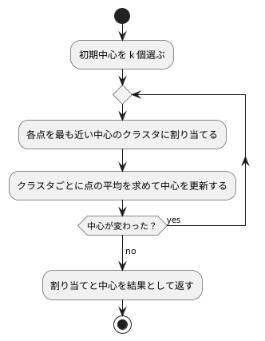

# 第 14 章: K-means によるクラスタリング

## 14.1 はじめに

これまでの章では、正解ラベル（派閥・品種・生存・価格など）が付いたデータから予測のルールを学ばせてきました。このような学習を **教師あり学習** と呼びます。

この章では、正解ラベルの無いデータから、似たもの同士のグループ（クラスタ）を見つける **クラスタリング** を扱います。正解を教えずにデータの構造を見つけるので、**教師なし学習** の一種です。代表的なアルゴリズムである **K-means** を TDD で自作し、JavaScript のライブラリ [ml-kmeans](https://github.com/mljs/kmeans) と結果を突き合わせます。

題材は、卸売業者の顧客ごとの商品カテゴリ別の支出額です。「どんな買い方をする顧客のグループがあるか」を、データだけから探します。

[Python 版の第 14 章](../python/14-k-means-clustering.md) と同じ TODO リストで進めます。Python 版は NumPy のブロードキャストで点と中心を配列のまま計算し、[Kotlin 版の第 14 章](../kotlin/14-k-means-clustering.md) はコレクションの関数で書きました。TypeScript 版では、点を `readonly number[]` で表し、配列のメソッド（`map`・`filter`・`reduce`）を組み合わせて書きます。

Kotlin 版では、Tribuo の K-means に初期中心を渡せなかったので、SSE の大きさを比べることしかできませんでした。ml-kmeans は初期中心を配列で受け取れるので、TypeScript 版では Python 版と同じく、**同じ初期中心から始めたときの割り当て・中心・反復回数** まで突き合わせます。

## 14.2 K-means の仕組み

K-means は、クラスタ数 k を人間が決め、次の 2 つの手順を交互に繰り返してクラスタを作ります。

1. **割り当て**: 各点を、最も近いクラスタの中心に割り当てる
2. **更新**: クラスタごとに、割り当てられた点の平均を新しい中心にする

中心が動かなくなったら（割り当てが変わらなくなったら）終わりです。



クラスタのまとまりの良さは **SSE**（Sum of Squared Errors、誤差平方和）で測ります。各点と、その点が属するクラスタの中心との距離の 2 乗を合計した値で、小さいほど各クラスタの点が中心の近くにまとまっています。

K-means には、最初に選ぶ中心（初期中心）によって結果が変わるという性質があります。この章では、この性質もテストで確かめながら実装します。そのため、初期中心を **引数で受け取る** 設計にします。乱数で選ぶ処理と分けておけば、テストでは決まった初期中心を渡して結果を固定でき、ライブラリにも同じ初期中心を渡して突き合わせられます。

## 14.3 題材とデータ

この章で使うのは `Wholesale.csv` です。データの入手と配置は [第 1 章](01-machine-learning-and-first-test.md) の「題材とデータ」を参照してください。440 件の顧客について、次の 8 列が記録されています。欠損値はありません。

| 列 | 意味 | TypeScript での型 |
|----|------|-----------------|
| Channel | 販売チャネルの区分 | `number` |
| Region | 地域の区分 | `number` |
| Fresh | 生鮮食品の支出額 | `number` |
| Milk | 乳製品の支出額 | `number` |
| Grocery | 食料雑貨の支出額 | `number` |
| Frozen | 冷凍食品の支出額 | `number` |
| Detergents_Paper | 洗剤・紙製品の支出額 | `number` |
| Delicassen | 惣菜の支出額 | `number` |

Channel と Region は区分を表す番号で、大小に意味がありません。この章では支出額の 6 列だけを使って、買い方の似た顧客をまとめます。

支出額の列は、列によって桁が大きく違います。距離で近さを測る K-means では、このままだと値の大きい列が距離をほぼ決めてしまいます。そこで、クラスタリングの前に列ごとに **標準化** します。

## 14.4 TODO リストの作成

**TODO リスト**:

- [ ] 支出額の列を読み込む
- [ ] 列ごとに標準化する
- [ ] 各点を最も近い中心のクラスタに割り当てる
- [ ] 割り当てた点の平均で中心を更新する
  - [ ] 点が 1 つも無いクラスタの中心はそのままにする
- [ ] SSE を計算する
- [ ] 中心が変わらなくなるまで割り当てと更新を繰り返す
- [ ] 初期中心をシードで選ぶ
- [ ] クラスタ数ごとの SSE を求める（エルボー法）
- [ ] 初期中心を変えて繰り返し、SSE が最小の結果を選ぶ
- [ ] ml-kmeans と突き合わせる
- [ ] クラスタごとの特徴をまとめる
- [ ] 実データでクラスタリングして結果を表示する

## 14.5 支出額の列を読み込む

テストでは、架空の値を 1 行だけ書いた CSV を一時ディレクトリに作ります。第 2 章の `loadIris` のテストと同じ書き方です。

```typescript
// test/chapter14/spending.test.ts
import { mkdtempSync, writeFileSync } from "node:fs";
import { tmpdir } from "node:os";
import { join } from "node:path";
import { describe, expect, it } from "vitest";
import { loadSpending } from "../../src/chapter14/spending.ts";

const HEADER =
  "Channel,Region,Fresh,Milk,Grocery,Frozen,Detergents_Paper,Delicassen\n";

function writeCsv(rows: string): string {
  const csvFile = join(mkdtempSync(join(tmpdir(), "wholesale-")), "w.csv");
  writeFileSync(csvFile, HEADER + rows);
  return csvFile;
}

describe("loadSpending", () => {
  it("Channel と Region を除いた支出額の列を数値として読み込む", () => {
    const rows = loadSpending(writeCsv("1,2,100,200,300,400,500,600\n"));

    expect(rows).toEqual([
      {
        Fresh: 100,
        Milk: 200,
        Grocery: 300,
        Frozen: 400,
        Detergents_Paper: 500,
        Delicassen: 600,
      },
    ]);
  });
});
```

```text
 FAIL  test/chapter14/spending.test.ts [ test/chapter14/spending.test.ts ]
Error: Cannot find module '../../src/chapter14/spending.ts' imported from test/chapter14/spending.test.ts
```

```typescript
// src/chapter14/spending.ts
import { readFileSync } from "node:fs";
import { parse } from "csv-parse/sync";

export const SPENDING_COLUMNS = [
  "Fresh",
  "Milk",
  "Grocery",
  "Frozen",
  "Detergents_Paper",
  "Delicassen",
] as const;
export type SpendingColumn = (typeof SPENDING_COLUMNS)[number];
export type Spending = Record<SpendingColumn, number>;

type WholesaleRow = Spending & { Channel: number; Region: number };

export function loadSpending(csvFile: string): Spending[] {
  const rows = parse<WholesaleRow>(readFileSync(csvFile), {
    bom: true,
    columns: true,
    cast: (value, context) => (context.header ? value : Number(value)),
  });
  return rows.map(({ Channel, Region, ...spending }) => spending);
}
```

- 列名は第 2 章と同じく `as const` の配列から型を作ります。このデータは列名が英語なので、プロパティ名も英語のままです
- すべての列が数値なので、`cast` では列名の行（`context.header`）以外をすべて `Number` に変換します。第 2 章で見たとおり、`cast` は列名の行にも呼ばれます
- `({ Channel, Region, ...spending }) => spending` は **分割代入** と **残余プロパティ** で、Channel と Region を取り出した残りを新しいオブジェクトにします。取り出した 2 つは使いませんが、第 2 章で ESLint に設定した `ignoreRestSiblings` により、残余プロパティと並べて取り出した変数は未使用として指摘されません

```text
      Tests  1 passed (1)
```

## 14.6 列ごとに標準化する

標準化は、各列から平均を引き、標準偏差で割る変換です。変換後の各列は平均 0、標準偏差 1 になり、列の桁の違いが距離に影響しなくなります。

Kotlin 版は [第 9 章](09-feature-engineering.md) の `Standardizer` を再利用しましたが、TypeScript 版の第 14 章は第 9 章と並行して書いたので、この章の中に小さな関数として持ちます。標準偏差は、第 9 章と同じく件数で割る `ddof = 0` で求めます。K-means で扱いやすい「点の配列」を返します。

```typescript
describe("standardize", () => {
  it("列ごとに平均 0・標準偏差 1 の点の配列に変換する", () => {
    const rows = [
      { Fresh: 10, Milk: 5 },
      { Fresh: 20, Milk: 5 },
      { Fresh: 30, Milk: 8 },
    ];

    const points = standardize(rows, ["Fresh", "Milk"]);

    for (const column of [0, 1]) {
      const values = points.map((point) => point[column] as number);
      const mean = values.reduce((sum, v) => sum + v, 0) / values.length;
      const variance =
        values.reduce((sum, v) => sum + (v - mean) ** 2, 0) / values.length;
      expect(mean).toBeCloseTo(0, 12);
      expect(Math.sqrt(variance)).toBeCloseTo(1, 12);
    }
  });
});
```

テストでは、標準化した値の平均と標準偏差を、素朴な式で求め直して確かめています。列は 2 つだけの架空のデータで、`standardize` は列名を引数で受け取ります。

```text
     × 列ごとに平均 0・標準偏差 1 の点の配列に変換する 2ms
TypeError: standardize is not a function
      Tests  1 failed | 1 passed (2)
```

点を表す型を、K-means 本体のファイルに用意します。

```typescript
// src/chapter14/kmeans.ts
/** 1 つの点。座標（特徴量）の値を並べた配列。 */
export type Point = readonly number[];
```

```typescript
// src/chapter14/spending.ts
function mean(values: readonly number[]): number {
  return values.reduce((sum, value) => sum + value, 0) / values.length;
}

/** 列ごとに平均を引き、標準偏差（件数で割る ddof = 0）で割った点の配列にする。 */
export function standardize<K extends string>(
  rows: readonly Record<K, number>[],
  columns: readonly K[],
): Point[] {
  const stats = columns.map((column) => {
    const values = rows.map((row) => row[column]);
    const center = mean(values);
    const std = Math.sqrt(mean(values.map((value) => (value - center) ** 2)));
    return { center, std };
  });
  return rows.map((row) =>
    columns.map((column, j) => {
      const { center, std } = stats[j] as { center: number; std: number };
      return (row[column] - center) / std;
    }),
  );
}
```

- `type Point = readonly number[]` は、読み取り専用の数値の配列に `Point` という別名を付けます。Kotlin 版の `typealias Point = List<Double>` と同じく新しい型を作るわけではないので、`[0, 1]` をそのまま `Point` として渡せます
- `readonly` を付けると、`push` や `point[0] = 1` のような書き換えが型チェックでエラーになります。K-means の関数は点や中心を書き換えずに、いつも新しい配列を返すので、そのことを型で表しています
- `standardize` はジェネリクスで列名の型 `K` を受け取るので、テストの 2 列のデータにも、実データの 6 列にも使えます。1 行を 1 つの点、1 列を 1 つの特徴量とする形は、Python 版の NumPy の 2 次元配列と同じです

```text
      Tests  2 passed (2)
```

## 14.7 各点を最も近い中心に割り当てる

ここからは K-means の本体です。まず 1 次元の例でテストを書きます。0 と 1 は中心 0 に近く、9 と 10 は中心 10 に近いので、クラスタ番号は `[0, 0, 1, 1]` です。

```typescript
// test/chapter14/kmeans.test.ts
describe("assignClusters", () => {
  it("各点を最も近い中心のクラスタに割り当てる", () => {
    const points = [[0], [1], [9], [10]];
    const centers = [[0], [10]];

    expect(assignClusters(points, centers)).toEqual([0, 0, 1, 1]);
  });
});
```

```text
     × 各点を最も近い中心のクラスタに割り当てる 3ms
TypeError: assignClusters is not a function
      Tests  1 failed | 2 passed (3)
```

仮実装で Green にします。

```typescript
export function assignClusters(
  points: readonly Point[],
  centers: readonly Point[],
): number[] {
  return [0, 0, 1, 1];
}
```

```text
      Tests  3 passed (3)
```

三角測量として、2 次元で、中心の並び順も変えた例を追加します。

```typescript
  it("2 次元の点をユークリッド距離で最も近い中心に割り当てる", () => {
    const points = [
      [0, 0],
      [5, 4],
      [1, 0],
    ];
    const centers = [
      [5, 5],
      [0, 0],
    ];

    expect(assignClusters(points, centers)).toEqual([1, 0, 1]);
  });
```

```text
     × 2 次元の点をユークリッド距離で最も近い中心に割り当てる 5ms
AssertionError: expected [ +0, +0, 1, 1 ] to deeply equal [ 1, +0, 1 ]

- Expected
+ Received

  [
+   0,
+   0,
    1,
-   0,
    1,
  ]

      Tests  1 failed | 3 passed (4)
```

点と中心の距離の 2 乗を求める関数と、値が最小になる番号を求める関数を用意します。

```typescript
export function squaredDistance(a: Point, b: Point): number {
  return a.reduce((sum, x, j) => sum + (x - (b[j] as number)) ** 2, 0);
}

/** 値が最小になる要素の番号。同じ値なら先に現れた番号を返す。 */
function argmin(values: readonly number[]): number {
  return values.reduce(
    (best, value, i) => (value < (values[best] as number) ? i : best),
    0,
  );
}

export function assignClusters(
  points: readonly Point[],
  centers: readonly Point[],
): number[] {
  return points.map((point) =>
    argmin(centers.map((center) => squaredDistance(point, center))),
  );
}
```

- `squaredDistance` は、`reduce` で座標ごとの差の 2 乗を足し合わせます。`b[j]` は `noUncheckedIndexedAccess` により `number | undefined` になるので、2 つの点の次元が同じという前提を `as number` で書いています
- JavaScript の配列には Kotlin の `minBy` や NumPy の `argmin` に当たるメソッドが無いので、`argmin` を `reduce` で書きました。`<` で比べているので、距離が同じ中心が複数あれば、先に現れた番号のままになります。Python 版の `argmin`、Kotlin 版の `minBy` と同じ振る舞いです
- 最も近い中心を選ぶだけなら、平方根を取る必要はありません。距離の大小関係は 2 乗しても変わらないからです

```text
      Tests  4 passed (4)
```

## 14.8 中心を更新する

割り当てた点の平均を、新しい中心にします。

```typescript
describe("updateCenters", () => {
  it("クラスタごとに割り当てられた点の平均を新しい中心にする", () => {
    const points = [
      [0, 0],
      [2, 0],
      [10, 10],
      [10, 12],
    ];
    const previous = [
      [0, 0],
      [0, 0],
    ];

    expect(updateCenters(points, [0, 0, 1, 1], previous)).toEqual([
      [1, 0],
      [10, 11],
    ]);
  });

  it("点が 1 つも割り当てられなかったクラスタは中心を変えない", () => {
    const points = [
      [0, 0],
      [2, 4],
    ];
    const previous = [
      [0, 0],
      [99, 99],
    ];

    expect(updateCenters(points, [0, 0], previous)).toEqual([
      [1, 2],
      [99, 99],
    ]);
  });
});
```

2 つ目のテストは、どの点も割り当てられなかったクラスタの扱いです。初期中心の選び方によっては、実際に起こります。`updateCenters` に前回の中心を渡しているのは、このときに中心をそのまま残すためです。

```text
     × クラスタごとに割り当てられた点の平均を新しい中心にする 3ms
     × 点が 1 つも割り当てられなかったクラスタは中心を変えない 1ms
TypeError: updateCenters is not a function
TypeError: updateCenters is not a function
      Tests  2 failed | 4 passed (6)
```

まず、クラスタごとに平均を取るだけの実装を書いてみます。

```typescript
function mean(values: readonly number[]): number {
  return values.reduce((sum, value) => sum + value, 0) / values.length;
}

export function updateCenters(
  points: readonly Point[],
  labels: readonly number[],
  previousCenters: readonly Point[],
): Point[] {
  return previousCenters.map((previous, k) => {
    const members = points.filter((_, i) => labels[i] === k);
    return previous.map((_, j) => mean(members.map((p) => p[j] as number)));
  });
}
```

`filter` のコールバックは、要素と番号の両方を受け取ります。クラスタ番号が `k` の点だけを取り出し、座標ごとに平均を求めます。

```text
     × 点が 1 つも割り当てられなかったクラスタは中心を変えない 8ms
AssertionError: expected [ [ 1, 2 ], [ NaN, NaN ] ] to deeply equal [ [ 1, 2 ], [ 99, 99 ] ]

- Expected
+ Received

@@ -2,9 +2,9 @@
    [
      1,
      2,
    ],
    [
-     99,
-     99,
+     NaN,
+     NaN,
    ],
  ]

      Tests  1 failed | 5 passed (6)
```

1 つ目のテストは通りましたが、空のクラスタの中心が `NaN` になりました。空の配列の合計 0 を件数 0 で割ると、JavaScript では例外にならず `NaN`（非数）になります。3 つの言語で、同じ失敗の現れ方が違います。

| 言語 | 空のクラスタの平均 |
|------|------------------|
| Python（NumPy） | 警告を出して `nan` を返す |
| Kotlin | 空のリストの `first()` が例外を投げる |
| TypeScript | 警告も例外も無く `NaN` を返す |

TypeScript では何も知らせずに `NaN` が混ざり、そのあとの距離の計算もすべて `NaN` になります。空のクラスタのテストを先に書いていなければ、気づくのは実データで結果がおかしくなったときでした。点があるクラスタだけ中心を更新するように直します。

```typescript
export function updateCenters(
  points: readonly Point[],
  labels: readonly number[],
  previousCenters: readonly Point[],
): Point[] {
  return previousCenters.map((previous, k) => {
    const members = points.filter((_, i) => labels[i] === k);
    if (members.length === 0) {
      return previous;
    }
    return previous.map((_, j) => mean(members.map((p) => p[j] as number)));
  });
}
```

点が無ければ前回の中心をそのまま返します。中心は `readonly` なので、同じ配列を新しい中心のリストに入れても、あとで書き換えられる心配はありません。

```text
      Tests  6 passed (6)
```

## 14.9 SSE を計算する

```typescript
describe("sumOfSquaredErrors", () => {
  it("各点と所属するクラスタの中心との距離の 2 乗を合計する", () => {
    const points = [
      [0, 0],
      [2, 0],
      [10, 10],
      [10, 12],
    ];
    const centers = [
      [1, 0],
      [10, 11],
    ];

    expect(sumOfSquaredErrors(points, [0, 0, 1, 1], centers)).toBe(4);
  });
});
```

4 点とも中心からの距離が 1 なので、SSE は 1 × 4 = 4 です。

```text
     × 各点と所属するクラスタの中心との距離の 2 乗を合計する 2ms
TypeError: sumOfSquaredErrors is not a function
      Tests  1 failed | 6 passed (7)
```

仮実装です。

```typescript
export function sumOfSquaredErrors(
  points: readonly Point[],
  labels: readonly number[],
  centers: readonly Point[],
): number {
  return 4;
}
```

三角測量として、中心から遠い点を含む例を追加します。距離の 2 乗は 1 と 9 なので、SSE は 10 です。

```typescript
  it("中心から離れた点ほど誤差が大きくなる", () => {
    expect(sumOfSquaredErrors([[0], [4]], [0, 0], [[1]])).toBe(10);
  });
```

```text
     × 中心から離れた点ほど誤差が大きくなる 5ms
AssertionError: expected 4 to be 10 // Object.is equality
      Tests  1 failed | 7 passed (8)
```

14.7 節の `squaredDistance` を再利用します。

```typescript
export function sumOfSquaredErrors(
  points: readonly Point[],
  labels: readonly number[],
  centers: readonly Point[],
): number {
  return points.reduce(
    (sum, point, i) =>
      sum + squaredDistance(point, centers[labels[i] as number] as Point),
    0,
  );
}
```

`centers[labels[i] as number]` は、`i` 番目の点が属するクラスタの中心です。添字でたどるたびに `undefined` の可能性を型チェックが指摘するので、クラスタ番号と中心の数が合っているという前提を `as` で書いています。

```text
      Tests  8 passed (8)
```

## 14.10 中心が変わらなくなるまで繰り返す

### 結果を型で表す

割り当てと更新を組み合わせて、K-means の全体を作ります。結果は、クラスタ番号・中心・SSE に、**中心を更新した回数**（反復回数）を加えた `KMeansResult` で返します。反復回数は、あとで ml-kmeans と突き合わせるために持たせます。

2 つのグループがはっきり分かれた 4 点を用意し、あえて同じグループの 2 点を初期中心にします。

```typescript
function twoGroups(): number[][] {
  return [
    [0, 0],
    [0, 1],
    [10, 10],
    [10, 11],
  ];
}

describe("kmeans", () => {
  it("割り当てが変わらなくなるまで割り当てと中心の更新を繰り返す", () => {
    const result = kmeans(twoGroups(), [
      [0, 0],
      [0, 1],
    ]);

    expect(result).toEqual({
      labels: [0, 0, 1, 1],
      centers: [
        [0, 0.5],
        [10, 10.5],
      ],
      sse: 1,
      iterations: 3,
    });
  });
});
```

1 回目の更新では割り当てが `[0, 1, 1, 1]` で、中心は (0, 0) と (20/3, 22/3) になります。2 回目の更新で割り当てが `[0, 0, 1, 1]` に変わり、中心は (0, 0.5) と (10, 10.5) になります。3 回目の更新では割り当ても中心も変わらないので、そこで止まります。止まったことを確かめた 3 回目も数えて、反復回数は 3 です。

```text
     × 割り当てが変わらなくなるまで割り当てと中心の更新を繰り返す 3ms
TypeError: kmeans is not a function
      Tests  1 failed | 8 passed (9)
```

```typescript
export interface KMeansResult {
  labels: number[];
  centers: readonly Point[];
  sse: number;
  /** 中心を更新した回数（中心が変わらなかった最後の更新を含む） */
  iterations: number;
}

function samePoints(a: readonly Point[], b: readonly Point[]): boolean {
  return a.every((point, k) => point.every((x, j) => x === b[k]?.[j]));
}

export function kmeans(
  points: readonly Point[],
  initialCenters: readonly Point[],
): KMeansResult {
  let centers = initialCenters;
  let iterations = 0;
  while (true) {
    const next = updateCenters(
      points,
      assignClusters(points, centers),
      centers,
    );
    iterations++;
    const converged = samePoints(next, centers);
    centers = next;
    if (converged) {
      break;
    }
  }
  const labels = assignClusters(points, centers);
  const sse = sumOfSquaredErrors(points, labels, centers);
  return { labels, centers, sse, iterations };
}
```

- JavaScript の `===` は、配列を **同じオブジェクトかどうか** で比べます。`[0] === [0]` は `false` なので、中心が変わったかどうかは `samePoints` で座標ごとに比べます。Kotlin 版は `List` の `==` が要素ごとの比較だったので、この関数は要りませんでした
- 同じ点の集合から同じ順で平均を計算すれば同じ浮動小数点数になるので、ここでは許容誤差を設けずに `===` で比べています
- `b[k]?.[j]` の `?.` は **オプショナルチェーン** です。`b[k]` が `undefined` なら、例外にせず `undefined` を返します
- Vitest の `toEqual` は、Kotlin の data class の比較と同じく、オブジェクトの中身を再帰的に比べます。クラスタ番号・中心・SSE・反復回数を 1 回でまとめて確かめられます

Python 版の `while True` と `break` と同じ形です。Kotlin 版は `generateSequence` で「中心の無限の列」を作り、止める条件と分けて書きました。TypeScript にもジェネレーター関数（`function*`）で同じ書き方がありますが、ここでは反復回数も数えたいので、素直なループにしました。

```text
      Tests  9 passed (9)
```

### 最大反復回数

`while (true)` は、万一収束しなかったときに止まりません。最大反復回数を指定できるようにします。反復を 1 回で打ち切った場合、中心は 1 回だけ更新された位置になり、クラスタ番号はその中心に合わせて割り当て直したものになるはずです。浮動小数点数の中心は、第 3 章で使った `expect.closeTo` で比べます。

```typescript
  it("最大反復回数に達したら収束していなくても打ち切る", () => {
    const result = kmeans(
      twoGroups(),
      [
        [0, 0],
        [0, 1],
      ],
      { maxIterations: 1 },
    );

    expect(result.centers).toEqual([
      [0, 0],
      [expect.closeTo(20 / 3, 9), expect.closeTo(22 / 3, 9)],
    ]);
    expect(result.labels).toEqual([0, 0, 1, 1]);
    expect(result.iterations).toBe(1);
  });
```

```text
     × 最大反復回数に達したら収束していなくても打ち切る 9ms
AssertionError: expected [ [ +0, 0.5 ], [ 10, 10.5 ] ] to deeply equal [ [ +0, +0 ], …(1) ]

- Expected
+ Received

  [
    [
      0,
-     0,
+     0.5,
    ],
    [
-     NumberCloseTo 6.666666666666667 (9 digits),
-     NumberCloseTo 7.333333333333333 (9 digits),
+     10,
+     10.5,
    ],
  ]

      Tests  1 failed | 9 passed (10)
```

テストは、余分な第 3 引数を無視して最後まで反復した結果で失敗しました。第 2 章で見たとおり、Vitest は型チェックをしないので、引数の数の間違いは `tsc` で分かります。

```text
test/chapter14/kmeans.test.ts(123,7): error TS2554: Expected 2 arguments, but got 3.
```

第 3 章の `DecisionTree` と同じく、オプションをオブジェクトで受け取ります。

```typescript
export function kmeans(
  points: readonly Point[],
  initialCenters: readonly Point[],
  { maxIterations = 300 }: { maxIterations?: number } = {},
): KMeansResult {
  let centers = initialCenters;
  let iterations = 0;
  while (iterations < maxIterations) {
    const next = updateCenters(
      points,
      assignClusters(points, centers),
      centers,
    );
    iterations++;
    const converged = samePoints(next, centers);
    centers = next;
    if (converged) {
      break;
    }
  }
  const labels = assignClusters(points, centers);
  const sse = sumOfSquaredErrors(points, labels, centers);
  return { labels, centers, sse, iterations };
}
```

- `{ maxIterations = 300 }: { maxIterations?: number } = {}` は、引数のオブジェクトを分割代入で受け取り、`maxIterations` が無ければ 300 にします。引数そのものを省略したときは `{}` を使います
- ループを抜けたあとで、最終的な中心に対してもう一度割り当てます。打ち切ったときでも、返すクラスタ番号と中心が食い違わないようにするためです

`maxIterations` の既定値を 300 にしたので、最初のテストはそのまま通ります。

```text
      Tests  10 passed (10)
```

## 14.11 初期中心をシードで選ぶ

初期中心は、データの中から重複なく k 点を選ぶことにします。第 2 章の訓練データとテストデータの分割と同じく、シードで乱数を固定して再現できるようにします。

```typescript
function numberedPoints(size: number): number[][] {
  return Array.from({ length: size }, (_, i) => [i, i * 2]);
}

describe("chooseInitialCenters", () => {
  it("データの中から重複なくクラスタ数だけ点を選ぶ", () => {
    const points = numberedPoints(10);

    const centers = chooseInitialCenters(points, 3, 0);

    expect(new Set(centers.map((center) => center.join(","))).size).toBe(3);
    for (const center of centers) {
      expect(points).toContainEqual(center);
    }
  });
});
```

- `Array.from({ length: size }, (_, i) => ...)` は、番号から要素を作って長さ `size` の配列にします
- 重複が無いことは、点を `"0,0"` のような文字列にして `Set` の大きさで確かめます。`Set` も配列を同じオブジェクトかどうかで区別するので、配列のまま入れると重複を見つけられません
- `toContainEqual` は、配列の中に中身の等しい要素があるかを確かめます

```text
     × データの中から重複なくクラスタ数だけ点を選ぶ 4ms
TypeError: chooseInitialCenters is not a function
      Tests  1 failed | 10 passed (11)
```

仮実装として、先頭の k 点を返します。

```typescript
export function chooseInitialCenters(
  points: readonly Point[],
  nClusters: number,
  seed: number,
): Point[] {
  return points.slice(0, nClusters);
}
```

```text
      Tests  11 passed (11)
```

シードについてのテストを 2 つ追加します。

```typescript
  it("同じシードなら同じ点を選ぶ", () => {
    const points = numberedPoints(10);

    expect(chooseInitialCenters(points, 3, 42)).toEqual(
      chooseInitialCenters(points, 3, 42),
    );
  });

  it("シードが違えば違う点を選ぶ", () => {
    const points = numberedPoints(10);

    expect(chooseInitialCenters(points, 3, 0)).not.toEqual(
      chooseInitialCenters(points, 3, 1),
    );
  });
```

```text
     × シードが違えば違う点を選ぶ 5ms
AssertionError: expected [ [ +0, +0 ], [ 1, 2 ], [ 2, 4 ] ] to not deeply equal [ [ +0, +0 ], [ 1, 2 ], [ 2, 4 ] ]
      Tests  1 failed | 12 passed (13)
```

先頭から選ぶ仮実装は、シードを変えても同じ点を返してしまいます。第 2 章で作った `createRandom`（シード付きの乱数生成器）と `shuffle`（Fisher–Yates のシャッフル）で番号を並べ替え、先頭の k 個を選びます。

```typescript
import { createRandom, shuffle } from "../chapter02/random.ts";
```

```typescript
export function chooseInitialCenters(
  points: readonly Point[],
  nClusters: number,
  seed: number,
): Point[] {
  const indices = points.map((_, i) => i);
  return shuffle(indices, createRandom(seed))
    .slice(0, nClusters)
    .map((i) => points[i] as Point);
}
```

```text
      Tests  13 passed (13)
```

## 14.12 エルボー法でクラスタ数を選ぶ

K-means では、クラスタ数 k を人間が決める必要があります。k を増やすほど各点は近い中心を持てるので、SSE は小さくなります。k を点の数と同じにすれば SSE は 0 ですが、それではグループ分けになりません。

**エルボー法** は、k を 1 から順に増やして SSE をグラフにし、減り方が急に緩やかになる k（肘のように曲がる点）を選ぶ方法です。

クラスタ数ごとの SSE を求める関数を作ります。前節までの 2 グループの例では、k = 1 のときの中心は全 4 点の平均 (5, 5.5) で SSE は 201、k = 2 のときは 1 です。

```typescript
describe("sseByClusterCount", () => {
  it("クラスタ数ごとにクラスタリングしたときの SSE を求める", () => {
    expect(sseByClusterCount(twoGroups(), [1, 2], 0)).toEqual(
      new Map([
        [1, 201],
        [2, 1],
      ]),
    );
  });
});
```

```text
     × クラスタ数ごとにクラスタリングしたときの SSE を求める 3ms
TypeError: sseByClusterCount is not a function
      Tests  1 failed | 13 passed (14)
```

```typescript
export function sseByClusterCount(
  points: readonly Point[],
  clusterCounts: readonly number[],
  seed: number,
): Map<number, number> {
  return new Map(
    clusterCounts.map((n) => [
      n,
      kmeans(points, chooseInitialCenters(points, n, seed)).sse,
    ]),
  );
}
```

`new Map([[キー, 値], ...])` は、キーと値の組の配列から `Map` を作ります。`Map` はキーを追加した順を保つので、クラスタ数の順に SSE を取り出せます。Vitest の `toEqual` は `Map` の中身も比べられます。

```text
      Tests  14 passed (14)
```

## 14.13 局所解と複数回の試行

### 実データで起きたこと

ここまでの関数で、標準化した実データのエルボー法を試してみました。初期中心 1 通りで k = 1 から 10 までの SSE を求め、シードを 0 から 9 まで変えて比べた結果の一部です（小数第 2 位まで）。

| k | シード 0 | シード 3 | シード 6 |
|---|---------|---------|---------|
| 5 | 1128.63 | 1243.05 | 1270.14 |
| 6 | 1000.51 | 1166.37 | 990.32 |
| 7 | 921.98 | 908.81 | 953.48 |
| 8 | 1014.89 | 777.72 | 876.40 |
| 9 | 959.72 | 666.15 | 826.60 |
| 10 | 877.65 | 711.59 | 841.31 |

シード 0 では、k = 7 の 921.98 から k = 8 の 1014.89 へ、k を増やしたのに SSE が増えています。シード 3 とシード 6 でも、k = 9 から k = 10 で SSE が増えました。k = 5 の SSE も、シードによって 1128.63 から 1270.14 まで変わります。初期中心 1 通りでは、選んだシードによって曲線の形が変わり、エルボー法のグラフの曲がり方を正しく読めません。

K-means は「今より SSE が下がる方向」にしか中心を動かさないので、初期中心によっては、最もよい分け方にたどり着く前に止まることがあります。これを **局所解** と呼びます。

### 局所解をテストで再現する

1 次元に 3 組の点を並べた例で確かめます。3 つのクラスタに分けるなら、0 と 1、10 と 11、20 と 21 に分けるのが最適で、SSE は 0.5 × 3 = 1.5 です。ところが、左の組から 2 点・中央の組から 1 点を初期中心にすると、0 と 1 が別々のクラスタのまま、残りの 4 点が 1 つのクラスタにまとめられて止まります。

あわせて、初期中心の候補を受け取って SSE が最小の結果を返す関数のテストも書きます。

```typescript
function threePairs(): number[][] {
  return [0, 1, 10, 11, 20, 21].map((x) => [x]);
}

describe("bestKMeans", () => {
  it("初期中心によっては局所解に陥る", () => {
    const stuck = kmeans(threePairs(), [[0], [1], [10]]);

    expect(stuck.sse).toBe(101);
  });

  it("複数の初期中心の候補のうち SSE が最小の結果を返す", () => {
    const candidates = [
      [[0], [1], [10]],
      [[0], [10], [20]],
    ];

    const result = bestKMeans(threePairs(), candidates);

    expect(result.sse).toBe(1.5);
    expect(result.centers).toEqual([[0.5], [10.5], [20.5]]);
  });
});
```

```text
     × 複数の初期中心の候補のうち SSE が最小の結果を返す 4ms
TypeError: bestKMeans is not a function
      Tests  1 failed | 15 passed (16)
```

```typescript
export function bestKMeans(
  points: readonly Point[],
  initialCenterCandidates: readonly (readonly Point[])[],
): KMeansResult {
  return initialCenterCandidates
    .map((initialCenters) => kmeans(points, initialCenters))
    .reduce((best, result) => (result.sse < best.sse ? result : best));
}
```

- 初期値を渡さない `reduce` は、先頭の要素を初期値にして残りを畳み込みます。ここでは SSE が小さいほうを残していくので、最小の `KMeansResult` が返ります。候補が空の配列だと `TypeError` になりますが、呼び出し側は必ず 1 つ以上の候補を渡します
- `readonly (readonly Point[])[]` は「点の配列（初期中心の組）」の読み取り専用の配列です

1 つ目のテストは、すでにある `kmeans` の性質を確かめるテストで、実装を足さずに通りました。SSE は最適な分け方の 1.5 に対して 101 です。

```text
      Tests  16 passed (16)
```

### エルボー法でも複数回試す

エルボー法でも、初期中心を何通りか試した最小の SSE で比べるようにします。局所解がある 3 組の点で、試行回数 `nInit` を指定するテストを書きます。

最初は Python 版・Kotlin 版と同じくシード 0 で書きましたが、`tsc` が引数の数の間違いを指摘しただけで、テストは実装を足す前から通ってしまいました。TypeScript 版の乱数生成器では、シード 0 の初期中心 1 通りで、たまたま最適な分け方にたどり着くからです。シードを 0 から 19 まで調べると、8・12・13・14 の初期中心 1 通りで SSE が 101 の局所解に止まりました。テストでは、局所解に止まるシード 8 を使います。

```typescript
  it("初期中心を変えて繰り返し最小の SSE を使う", () => {
    expect(sseByClusterCount(threePairs(), [3], 8, 10)).toEqual(
      new Map([[3, 1.5]]),
    );
  });
```

```text
     × 初期中心を変えて繰り返し最小の SSE を使う 8ms
AssertionError: expected Map{ 3 => 101 } to deeply equal Map{ 3 => 1.5 }

- Expected
+ Received

  Map {
-   3 => 1.5,
+   3 => 101,
  }

      Tests  1 failed | 16 passed (17)
```

局所解の例は「どのシードでも局所解に止まる」わけではないので、Red を確かめずに書いたテストは、何も確かめていないことがあります。

シードを 1 ずつずらして初期中心の候補を `nInit` 通り作り、`bestKMeans` に渡す関数を追加します。

```typescript
export function kmeansWithRestarts(
  points: readonly Point[],
  nClusters: number,
  seed: number,
  nInit = 10,
): KMeansResult {
  const candidates = Array.from({ length: nInit }, (_, i) =>
    chooseInitialCenters(points, nClusters, seed + i),
  );
  return bestKMeans(points, candidates);
}

export function sseByClusterCount(
  points: readonly Point[],
  clusterCounts: readonly number[],
  seed: number,
  nInit = 10,
): Map<number, number> {
  return new Map(
    clusterCounts.map((n) => [
      n,
      kmeansWithRestarts(points, n, seed, nInit).sse,
    ]),
  );
}
```

`nInit = 10` のように既定値を書いた引数は、型注釈を省いても既定値から `number` と推論されます。`nInit` の既定値を 10 にしたので、最初のエルボー法のテストはそのまま通ります。

```text
      Tests  17 passed (17)
```

## 14.14 ml-kmeans と突き合わせる

### 同じ初期中心を渡す

ml-kmeans 7.0.1 は、ESM のパッケージで型定義も同梱しています（[ADR 003](../../../adr/003-typescript-ml-libraries.md)）。`kmeans(データ, クラスタ数, オプション)` の `initialization` に、`'kmeans++'`・`'random'`・`'mostDistant'` の初期化の方法か、初期中心そのもの（`number[][]`）を渡せます。結果の `clusters` がクラスタ番号、`centroids` が中心、`iterations` が反復回数です。

自作の `kmeans` と同じ形の結果を返すアダプターを作り、同じ初期中心から始めた結果が **まるごと一致する** ことをテストに書きます。

```typescript
// test/chapter14/ml-kmeans-adapter.test.ts
import { describe, expect, it } from "vitest";
import { kmeans } from "../../src/chapter14/kmeans.ts";
import { trainMlKMeans } from "../../src/chapter14/ml-kmeans-adapter.ts";

function twoGroups(): number[][] {
  return [
    [0, 0],
    [0, 1],
    [10, 10],
    [10, 11],
  ];
}

describe("trainMlKMeans", () => {
  it("同じ初期中心なら割り当て・中心・SSE・反復回数が自作と一致する", () => {
    const initialCenters = [
      [0, 0],
      [0, 1],
    ];

    expect(trainMlKMeans(twoGroups(), initialCenters)).toEqual(
      kmeans(twoGroups(), initialCenters),
    );
  });
});
```

```text
 FAIL  test/chapter14/ml-kmeans-adapter.test.ts [ test/chapter14/ml-kmeans-adapter.test.ts ]
Error: Cannot find module '../../src/chapter14/ml-kmeans-adapter.ts' imported from test/chapter14/ml-kmeans-adapter.test.ts
```

```typescript
// src/chapter14/ml-kmeans-adapter.ts
import { kmeans } from "ml-kmeans";
import { type KMeansResult, type Point, sumOfSquaredErrors } from "./kmeans.ts";

const MAX_ITERATIONS = 300;

// ml-kmeans は書き換え可能な number[][] を受け取るので、読み取り専用の点を写す
function toMatrix(points: readonly Point[]): number[][] {
  return points.map((point) => [...point]);
}

/** ml-kmeans に初期中心を渡して学習し、自作の kmeans と同じ形の結果にする。 */
export function trainMlKMeans(
  points: readonly Point[],
  initialCenters: readonly Point[],
): KMeansResult {
  const result = kmeans(toMatrix(points), initialCenters.length, {
    initialization: toMatrix(initialCenters),
    maxIterations: MAX_ITERATIONS,
  });
  return {
    labels: result.clusters,
    centers: result.centroids,
    sse: sumOfSquaredErrors(points, result.clusters, result.centroids),
    iterations: result.iterations,
  };
}
```

- ml-kmeans の型定義は、データを `number[][]` で受け取ります。`readonly Point[]` をそのまま渡すと、読み取り専用の配列を書き換え可能な配列として渡すことになるので、型チェックが止めます

  ```text
  src/chapter14/ml-kmeans-adapter.ts(16,25): error TS2345: Argument of type 'readonly Point[]' is not assignable to parameter of type 'number[][]'.
    The type 'readonly Point[]' is 'readonly' and cannot be assigned to the mutable type 'number[][]'.
  ```

  そこで `toMatrix` でスプレッド構文（`[...point]`）を使って写してから渡します。ライブラリが配列を書き換えても、自作の側の点は変わりません
- 最大反復回数は、ml-kmeans の既定値の 100 ではなく、自作と同じ 300 を明示します
- SSE は、ml-kmeans の中心とクラスタ番号から自作の `sumOfSquaredErrors` で求めます。SSE の定義を共通にしておけば、比べているのが「中心の見つけ方」だけになります

```text
      Tests  18 passed (18)
```

局所解に止まる初期中心でも、ml-kmeans が自作と同じ局所解に止まることも確かめます。

```typescript
  it("局所解に陥る初期中心なら ml-kmeans も同じ局所解になる", () => {
    const points = [0, 1, 10, 11, 20, 21].map((x) => [x]);

    expect(trainMlKMeans(points, [[0], [1], [10]]).sse).toBe(101);
  });
```

### ml-kmeans の癖を学習用テストに残す

ml-kmeans のソースを読むと、1 回の反復は「現在の中心に割り当てる → 中心を更新する → 前の中心との距離が許容誤差（既定値 `1e-6`）以下なら収束とみなす」の順で、返す `clusters` は **更新する前の中心** への割り当てです。自作の `kmeans` は、ループを抜けたあとで最終的な中心に割り当て直していました。収束していれば 2 つは同じですが、反復を打ち切ったときは違うはずです。これを学習用テストで確かめます。

```typescript
import { kmeans as mlKMeans } from "ml-kmeans";
```

```typescript
describe("ml-kmeans の癖", () => {
  it("反復を打ち切ると、クラスタ番号は更新前の中心への割り当てのまま返る", () => {
    const result = mlKMeans(twoGroups(), 2, {
      initialization: [
        [0, 0],
        [0, 1],
      ],
      maxIterations: 1,
    });

    expect(result.clusters).toEqual([0, 1, 1, 1]);
    expect(result.centroids).toEqual([
      [0, 0],
      [expect.closeTo(20 / 3, 9), expect.closeTo(22 / 3, 9)],
    ]);
  });

  it("maxIterations に 0 を渡すと上限なしになる", () => {
    const result = mlKMeans(twoGroups(), 2, {
      initialization: [
        [0, 0],
        [0, 1],
      ],
      maxIterations: 0,
    });

    expect(result.iterations).toBe(3);
  });
});
```

- `import { kmeans as mlKMeans }` は、名前付きの import に別名を付けます。自作の `kmeans` と名前がぶつからないようにしています
- 1 つ目のテスト: 1 回で打ち切ると、中心は 1 回更新された (0, 0) と (20/3, 22/3) なのに、クラスタ番号は初期中心への割り当て `[0, 1, 1, 1]` のままです。14.10 節の自作の結果（`[0, 0, 1, 1]`）とは、ここだけが違います
- 2 つ目のテスト: ml-kmeans の `kmeans` は、`maxIterations` が 0 なら上限を無くします。自作の `kmeans` に 0 を渡すと 1 回も更新しないので、同じ 0 でも意味が逆です

どちらも、自作とライブラリを同じ条件で突き合わせるときに気をつける点です。アダプターでは `maxIterations` を 300 に固定し、収束するまで反復させています。

```text
      Tests  21 passed (21)
```

### k-means++ でも複数回試す

ml-kmeans の既定の初期化は **k-means++** です。1 つ目の中心をランダムに選び、2 つ目からは、すでに選んだ中心から遠い点ほど選ばれやすくする方法で、互いに離れた初期中心になりやすくなります。`seed` を指定すれば、選び方を再現できます。

自作と条件をそろえるため、ml-kmeans の k-means++ でもシードを変えて `nInit` 回学習し、最小の SSE を使えるようにします。

```typescript
describe("mlKMeansBestSse", () => {
  it("k-means++ でもシードを変えて繰り返し最小の SSE を使える", () => {
    const points = [0, 1, 10, 11, 20, 21].map((x) => [x]);

    expect(mlKMeansBestSse(points, 3, 0, 10)).toBe(1.5);
  });
});
```

```text
     × k-means++ でもシードを変えて繰り返し最小の SSE を使える 3ms
TypeError: mlKMeansBestSse is not a function
      Tests  1 failed | 21 passed (22)
```

```typescript
/** ml-kmeans の k-means++ をシードを変えて nInit 回学習し、最小の SSE を返す。 */
export function mlKMeansBestSse(
  points: readonly Point[],
  nClusters: number,
  seed: number,
  nInit = 10,
): number {
  const matrix = toMatrix(points);
  const sses = Array.from({ length: nInit }, (_, i) => {
    const result = kmeans(matrix, nClusters, {
      initialization: "kmeans++",
      seed: seed + i,
      maxIterations: MAX_ITERATIONS,
    });
    return sumOfSquaredErrors(points, result.clusters, result.centroids);
  });
  return Math.min(...sses);
}
```

`Math.min(...sses)` は、スプレッド構文で配列を引数に展開して最小値を求めます。

```text
      Tests  22 passed (22)
```

## 14.15 実データでクラスタリングする

### クラスタごとの特徴をまとめる

クラスタに分けただけでは、それぞれがどんなグループかは分かりません。クラスタごとの件数と、元の単位での平均支出額を並べる関数を作ります。クラスタの番号自体には意味がないので、件数の多い順に並べます。

```typescript
describe("summarizeClusters", () => {
  it("クラスタごとの件数と平均を件数の多い順に並べる", () => {
    const rows = [
      { Fresh: 100, Milk: 20 },
      { Fresh: 300, Milk: 40 },
      { Fresh: 1000, Milk: 900 },
    ];

    const summary = summarizeClusters(rows, ["Fresh", "Milk"], [1, 1, 0]);

    expect(summary).toEqual([
      { cluster: 1, count: 2, means: { Fresh: 200, Milk: 30 } },
      { cluster: 0, count: 1, means: { Fresh: 1000, Milk: 900 } },
    ]);
  });
});
```

```text
     × クラスタごとの件数と平均を件数の多い順に並べる 3ms
TypeError: summarizeClusters is not a function
      Tests  1 failed | 22 passed (23)
```

```typescript
export interface ClusterSummary<K extends string> {
  cluster: number;
  count: number;
  means: Record<K, number>;
}

/** クラスタごとの件数と列ごとの平均を、件数の多い順に並べる。 */
export function summarizeClusters<K extends string>(
  rows: readonly Record<K, number>[],
  columns: readonly K[],
  labels: readonly number[],
): ClusterSummary<K>[] {
  const groups = new Map<number, Record<K, number>[]>();
  rows.forEach((row, i) => {
    const cluster = labels[i] as number;
    const members = groups.get(cluster) ?? [];
    members.push(row);
    groups.set(cluster, members);
  });
  return [...groups]
    .map(([cluster, members]) => ({
      cluster,
      count: members.length,
      means: Object.fromEntries(
        columns.map((column) => [
          column,
          mean(members.map((row) => row[column])),
        ]),
      ) as Record<K, number>,
    }))
    .sort((a, b) => b.count - a.count);
}
```

- 行をクラスタ番号ごとに `Map` にまとめます。ES2024 には同じことをする `Map.groupBy` がありますが、本プロジェクトの `tsconfig.json` は `lib` を ES2023 にしているので、型チェックが通りません。ここでは `forEach` で書きました
- `[...groups]` で `Map` を `[キー, 値]` の組の配列にし、`map` で要約に変換します。`Object.fromEntries` は、`[列名, 平均]` の組の配列からオブジェクトを作ります。第 2 章の `byColumn` と同じく、型は `Record<K, number>` と `as` で書きます
- 配列の `sort` は安定な並べ替え（ES2019 以降の仕様）なので、件数が同じクラスタは元の順のまま並びます

```text
      Tests  23 passed (23)
```

### 実データのテスト

実データで確かめることも、データが無ければスキップするテストとして書きます。Kotlin 版と同じく、「クラスタ数を増やすほど SSE が小さくなる」ことも確かめるつもりでした。

```typescript
// test/chapter14/wholesale-data.test.ts
import { existsSync } from "node:fs";
import { join } from "node:path";
import { beforeAll, describe, expect, it } from "vitest";
import { type Point, sseByClusterCount } from "../../src/chapter14/kmeans.ts";
import {
  loadSpending,
  SPENDING_COLUMNS,
  standardize,
  type Spending,
} from "../../src/chapter14/spending.ts";
import { dataDir } from "../../src/dataset.ts";

const csvFile = join(dataDir(), "Wholesale.csv");

describe.skipIf(!existsSync(csvFile))("Wholesale.csv の実データ", () => {
  let rows: Spending[];
  let points: Point[];

  beforeAll(() => {
    rows = loadSpending(csvFile);
    points = standardize(rows, SPENDING_COLUMNS);
  });

  it("440 件の支出額 6 列を読み込む", () => {
    expect([rows.length, Object.keys(rows[0] as Spending).length]).toEqual([
      440, 6,
    ]);
  });

  it("標準化したデータのクラスタ数 1 の SSE は件数と列数の積になる", () => {
    const sse = sseByClusterCount(points, [1], 0);

    expect(sse.get(1)).toBeCloseTo(440 * 6, 6);
  });

  it("クラスタ数を増やすほど SSE が小さくなる", () => {
    const sse = [
      ...sseByClusterCount(points, [1, 2, 3, 4, 5, 6, 7, 8, 9, 10], 0).values(),
    ];

    expect(sse.slice(1).every((after, i) => after < (sse[i] as number))).toBe(
      true,
    );
  });
});
```

```text
     × クラスタ数を増やすほど SSE が小さくなる 257ms
AssertionError: expected false to be true // Object.is equality
      Tests  1 failed | 25 passed (26)
```

初期中心を 10 通り試しているのに、SSE が減らない組がありました。ところが、`every` の結果を `true` と比べるテストでは、「どこで」減らなかったのかが分かりません。隣り合う SSE を 1 組ずつ `toBeLessThan` で比べる形に書き直すと、失敗したときに値が表示されます。

```typescript
    sse.slice(1).forEach((after, i) => {
      expect(after).toBeLessThan(sse[i] as number);
    });
```

```text
     × クラスタ数を増やすほど SSE が小さくなる 207ms
AssertionError: expected 705.7716874756551 to be less than 666.1546414361594
      Tests  1 failed | 25 passed (26)
```

k = 10 の SSE（705.77）が k = 9 の SSE（666.15）より大きくなっていました。k = 10 では、10 通りの初期中心のどれもが局所解に止まったということです。試行回数を増やして k = 8〜10 の最小の SSE を調べました。

| 初期中心の数 | k = 8 | k = 9 | k = 10 |
|------------|-------|-------|--------|
| 10 | 777.72 | 666.15 | 705.77 |
| 20 | 777.72 | 666.15 | 617.18 |
| 50 | 766.44 | 666.15 | 606.10 |
| 100 | 752.53 | 659.47 | 606.10 |

20 通りに増やすと、k = 10 の SSE は k = 9 より小さくなりました。k が大きいほど初期中心の選び方の組み合わせが増え、ランダムに選んだ初期中心 10 通りでは局所解を避けきれなかったのです。Python 版・Kotlin 版では 10 通りで足りていましたが、それは乱数生成器が選んだ初期中心がたまたま良かったからで、10 通りで足りる保証はありません。

実装は正しいので、テストを、分かったことをそのまま表す 3 つに分けます。

```typescript
  it("クラスタ数 1〜9 では、クラスタ数を増やすほど SSE が小さくなる", () => {
    const sse = [
      ...sseByClusterCount(points, [1, 2, 3, 4, 5, 6, 7, 8, 9], 0).values(),
    ];

    sse.slice(1).forEach((after, i) => {
      expect(after).toBeLessThan(sse[i] as number);
    });
  });

  it("初期中心 10 通りでは、クラスタ数 10 が局所解に止まり SSE がクラスタ数 9 より大きい", () => {
    const sse = sseByClusterCount(points, [9, 10], 0);

    expect(sse.get(10)).toBeGreaterThan(sse.get(9) as number);
  });

  it("初期中心を 20 通りに増やすと、クラスタ数 10 の SSE がクラスタ数 9 より小さくなる", () => {
    const sse = sseByClusterCount(points, [9, 10], 0, 20);

    expect(sse.get(10)).toBeLessThan(sse.get(9) as number);
  });
```

`sseByClusterCount` は、クラスタ数ごとにシード 0 から `nInit` 個の初期中心を試すので、`[9, 10]` だけを渡しても、k = 9 と k = 10 の SSE は 1〜10 をまとめて求めたときと同じです。

```text
      Tests  28 passed (28)
```

表示を固定するテストは、`main` を書く前に書き、Red を確かめました。数値は、ここまでの関数で実データを計算して確かめた値です。

```typescript
  it("実行すると SSE・ml-kmeans との一致・クラスタごとの件数と平均支出額を表示する", () => {
    const lines: string[] = [];

    main((line) => lines.push(line));

    expect(lines).toEqual([
      "データ件数: 440（支出額 6 列）",
      "クラスタ数ごとの SSE（初期中心 10 通りの最小値）:",
      "クラスタ数\t自作\tml-kmeans（k-means++）",
      "1\t2640.00\t2640.00",
      "2\t1954.18\t1954.65",
      "3\t1608.43\t1614.50",
      "4\t1333.17\t1325.98",
      "5\t1070.46\t1058.77",
      "6\t989.84\t918.42",
      "7\t891.23\t827.49",
      "8\t777.72\t742.61",
      "9\t666.15\t661.47",
      "10\t705.77\t597.87",
      "同じ初期中心で ml-kmeans と結果が一致した数: 100 / 100",
      "",
      "クラスタ数 5 のクラスタごとの件数と平均支出額:",
      "クラスタ\t件数\tFresh\tMilk\tGrocery\tFrozen\tDetergents_Paper\tDelicassen",
      "1\t277\t9203\t2969\t3773\t2594\t967\t983",
      "3\t96\t5509\t10556\t16478\t1420\t7199\t1659",
      "2\t54\t36043\t5007\t6118\t6736\t1006\t2593",
      "4\t11\t16911\t34864\t46126\t3245\t23008\t4177",
      "0\t2\t34782\t30367\t16898\t48702\t756\t26776",
    ]);
  });
```

```text
 FAIL  test/chapter14/wholesale-data.test.ts [ test/chapter14/wholesale-data.test.ts ]
Error: Cannot find module '../../src/chapter14/main.ts' imported from test/chapter14/wholesale-data.test.ts
```

### 実行して結果を表示する

エルボー法の SSE を自作と ml-kmeans（k-means++）で並べ、自作の試行と同じ初期中心 100 通り（k = 1〜10 × シード 10 通り）で ml-kmeans と結果が一致するかを数え、クラスタ数 5 でのクラスタごとの特徴を表示します。

```typescript
// src/chapter14/main.ts
import { join } from "node:path";
import { isDeepStrictEqual } from "node:util";
import { dataDir } from "../dataset.ts";
import {
  chooseInitialCenters,
  kmeans,
  kmeansWithRestarts,
  sseByClusterCount,
} from "./kmeans.ts";
import { mlKMeansBestSse, trainMlKMeans } from "./ml-kmeans-adapter.ts";
import {
  loadSpending,
  SPENDING_COLUMNS,
  standardize,
  summarizeClusters,
} from "./spending.ts";

const SEED = 0;
const N_INIT = 10;
const CLUSTER_COUNTS = [1, 2, 3, 4, 5, 6, 7, 8, 9, 10];
const N_CLUSTERS = 5;

export function main(print: (line: string) => void = console.log): void {
  const rows = loadSpending(join(dataDir(), "Wholesale.csv"));
  const points = standardize(rows, SPENDING_COLUMNS);
  print(`データ件数: ${rows.length}（支出額 ${SPENDING_COLUMNS.length} 列）`);
  print(`クラスタ数ごとの SSE（初期中心 ${N_INIT} 通りの最小値）:`);
  print("クラスタ数\t自作\tml-kmeans（k-means++）");
  for (const [n, sse] of sseByClusterCount(
    points,
    CLUSTER_COUNTS,
    SEED,
    N_INIT,
  )) {
    const library = mlKMeansBestSse(points, n, SEED, N_INIT);
    print(`${n}\t${sse.toFixed(2)}\t${library.toFixed(2)}`);
  }

  // 自作の試行と同じ初期中心を ml-kmeans に渡し、結果がすべて一致するかを数える
  const initialCenterCandidates = CLUSTER_COUNTS.flatMap((n) =>
    Array.from({ length: N_INIT }, (_, i) =>
      chooseInitialCenters(points, n, SEED + i),
    ),
  );
  const matched = initialCenterCandidates.filter((initialCenters) =>
    isDeepStrictEqual(
      kmeans(points, initialCenters),
      trainMlKMeans(points, initialCenters),
    ),
  ).length;
  print(
    `同じ初期中心で ml-kmeans と結果が一致した数: ${matched} / ${initialCenterCandidates.length}`,
  );

  const result = kmeansWithRestarts(points, N_CLUSTERS, SEED, N_INIT);
  print("");
  print(`クラスタ数 ${N_CLUSTERS} のクラスタごとの件数と平均支出額:`);
  print(["クラスタ", "件数", ...SPENDING_COLUMNS].join("\t"));
  for (const summary of summarizeClusters(
    rows,
    SPENDING_COLUMNS,
    result.labels,
  )) {
    const means = SPENDING_COLUMNS.map((column) =>
      summary.means[column].toFixed(0),
    );
    print([summary.cluster, summary.count, ...means].join("\t"));
  }
}

// node src/chapter14/main.ts で直接実行したときだけ main を呼ぶ
if (import.meta.filename === process.argv[1]) {
  main();
}
```

- `for (const [n, sse] of map)` は、`Map` の各エントリーをキーと値に分解して受け取ります
- Node.js の `isDeepStrictEqual` は、Vitest の `toEqual` と同じくオブジェクトの中身を再帰的に比べる関数です。テストの外でも「結果がまるごと一致するか」を判定できます。中心の座標も許容誤差なしで比べています
- `flatMap` は、クラスタ数ごとに作った初期中心の配列を 1 つの配列につなげます

```bash
node src/chapter14/main.ts
```

```text
データ件数: 440（支出額 6 列）
クラスタ数ごとの SSE（初期中心 10 通りの最小値）:
クラスタ数	自作	ml-kmeans（k-means++）
1	2640.00	2640.00
2	1954.18	1954.65
3	1608.43	1614.50
4	1333.17	1325.98
5	1070.46	1058.77
6	989.84	918.42
7	891.23	827.49
8	777.72	742.61
9	666.15	661.47
10	705.77	597.87
同じ初期中心で ml-kmeans と結果が一致した数: 100 / 100

クラスタ数 5 のクラスタごとの件数と平均支出額:
クラスタ	件数	Fresh	Milk	Grocery	Frozen	Detergents_Paper	Delicassen
1	277	9203	2969	3773	2594	967	983
3	96	5509	10556	16478	1420	7199	1659
2	54	36043	5007	6118	6736	1006	2593
4	11	16911	34864	46126	3245	23008	4177
0	2	34782	30367	16898	48702	756	26776
```

### 結果を読む

k = 1 の SSE がちょうど 2640.00 になっているのは偶然ではありません。標準化した各列は平均 0・分散 1 なので、全点の平均を中心にしたときの SSE は「件数 × 列数」= 440 × 6 = 2640 になります。自作と ml-kmeans のどちらでも同じ値です。

**同じ初期中心から始めると**、100 通りすべてで、自作と ml-kmeans のクラスタ番号・中心・SSE・反復回数が一致しました。中心の座標は、許容誤差なしで一致しています。ml-kmeans の収束の判定は「中心の移動が `1e-6` 以下」、自作は「中心が完全に変わらない」で条件が違いますが、このデータでは、割り当てが変わらなくなった反復で中心の移動がちょうど 0 になるので、同じ回数で止まりました。Kotlin 版では Tribuo に初期中心を渡せず、ここまでは確かめられませんでした。

**初期化の違う SSE を比べると**、k = 2・3 では自作（ランダムに選んだ初期中心）の SSE のほうが小さく、k = 4 以上では ml-kmeans（k-means++）のほうが小さくなりました。差は k = 10 で最も大きく、自作は局所解に止まった 705.77、ml-kmeans は 597.87 です。互いに離れた点を初期中心に選びやすい k-means++ のほうが、k が大きいときに局所解を避けやすかったと読めます。ml-kmeans の k = 5 の SSE 1058.77 は、Python 版の scikit-learn・Kotlin 版の Tribuo（どちらも k-means++ で 10 通り）と同じ値でした。

**エルボー法で読むと**、自作の SSE の減り方は、k = 3 → 4 で 275.26、k = 4 → 5 で 262.71 のあと、k = 5 → 6 で 80.62 に急に小さくなります。k = 5 に肘があると読めるので、Python 版と同じくクラスタ数を 5 にしました。ml-kmeans の SSE でも、k = 4 → 5 で 267.21、k = 5 → 6 で 140.35、k = 6 → 7 で 90.93 と、5 を過ぎると減り方が緩やかになります。エルボーが 1 点に決まらないときは、クラスタを解釈できるかどうかも合わせて判断します。

クラスタ数 5 の結果は、次のように読めます。

- **277 件のクラスタ**: どの支出額も少なめの、最も多いグループ
- **96 件のクラスタ**: Grocery・Milk・Detergents_Paper が多めのグループ
- **54 件のクラスタ**: Fresh が突出して多いグループ
- **11 件のクラスタ**: Milk・Grocery・Detergents_Paper が非常に多いグループ
- **2 件のクラスタ**: Frozen と Delicassen が極端に多い顧客。グループというより外れ値に近い存在です

この結果は、件数も平均支出額も Python 版と同じでした（SSE も 1070.46 で一致します）。TypeScript 版と Python 版は乱数生成器が違うので選ぶ初期中心は違いますが、10 通りの中の最良の試行が、同じ解にたどり着いています。Kotlin 版は 4 件のクラスタができる別の解でした。2 件のクラスタができたように、K-means は外れ値にも中心を 1 つ割いてしまいます。外れ値の扱いは [第 9 章](09-feature-engineering.md) で扱います。

テストの実行結果です。第 14 章のテストは、データのある環境で 29 件すべて通ります。

```bash
npx vitest run test/chapter14
```

```text
 Test Files  4 passed (4)
      Tests  29 passed (29)
```

データが無い環境では、実データのテスト 6 件がスキップされ、残りの 23 件が通ります。

```text
 Test Files  3 passed | 1 skipped (4)
      Tests  23 passed | 6 skipped (29)
```

## 14.16 Notebook で探索する

TypeScript 版では Notebook による探索と可視化を扱いません。エルボー法の折れ線グラフ、クラスタごとの中心の棒グラフ、クラスタで色分けした散布図は、[Python 版の 14.16 節](../python/14-k-means-clustering.md) か [Kotlin 版の 14.16 節](../kotlin/14-k-means-clustering.md) を参照してください。表示される SSE とクラスタは、それぞれの版の実装の値です。

## 14.17 リファクタリング

最後に `npm run check` で、整形・静的解析・型チェック・テストを確かめました。Prettier が `kmeans.ts` の長い行（`updateCenters` の呼び出しなど）を折り返したほかに指摘はありませんでしたが、コードを見直すと、平均を求める `mean` が `kmeans.ts`（中心の更新）と `spending.ts`（標準化・要約）の 2 か所に同じ内容で書かれていました。

Kotlin 版では、detekt の指摘をきっかけに、データを準備して結果をまとめる処理（`Spending.kt`）と K-means のアルゴリズム（`KMeans.kt`）を分けました。TypeScript 版は、最初から `spending.ts` と `kmeans.ts` に分けて書いてきたので、重複だけを取り除きます。`spending.ts` はすでに `kmeans.ts` の `Point` を使っているので、`mean` を `kmeans.ts` から export し、`spending.ts` の `mean` を消して import に置き換えました。

```typescript
// src/chapter14/spending.ts
import { mean, type Point } from "./kmeans.ts";
```

`import { mean, type Point }` のように、値の import と型の import を 1 行に並べられます。`verbatimModuleSyntax` の設定では、型だけの import に `type` を付けます（第 2 章）。

```bash
npm run check
```

```text
 Test Files  14 passed (14)
      Tests  92 passed (92)
```

これは、第 1〜3 章と第 14 章のテストを合わせた件数です。

<details>
<summary>この章の完成コード（src/chapter14/kmeans.ts）</summary>

```typescript
import { createRandom, shuffle } from "../chapter02/random.ts";

/** 1 つの点。座標（特徴量）の値を並べた配列。 */
export type Point = readonly number[];

export function squaredDistance(a: Point, b: Point): number {
  return a.reduce((sum, x, j) => sum + (x - (b[j] as number)) ** 2, 0);
}

/** 値が最小になる要素の番号。同じ値なら先に現れた番号を返す。 */
function argmin(values: readonly number[]): number {
  return values.reduce(
    (best, value, i) => (value < (values[best] as number) ? i : best),
    0,
  );
}

export function assignClusters(
  points: readonly Point[],
  centers: readonly Point[],
): number[] {
  return points.map((point) =>
    argmin(centers.map((center) => squaredDistance(point, center))),
  );
}

export function mean(values: readonly number[]): number {
  return values.reduce((sum, value) => sum + value, 0) / values.length;
}

export function updateCenters(
  points: readonly Point[],
  labels: readonly number[],
  previousCenters: readonly Point[],
): Point[] {
  return previousCenters.map((previous, k) => {
    const members = points.filter((_, i) => labels[i] === k);
    if (members.length === 0) {
      return previous;
    }
    return previous.map((_, j) => mean(members.map((p) => p[j] as number)));
  });
}

export function sumOfSquaredErrors(
  points: readonly Point[],
  labels: readonly number[],
  centers: readonly Point[],
): number {
  return points.reduce(
    (sum, point, i) =>
      sum + squaredDistance(point, centers[labels[i] as number] as Point),
    0,
  );
}

export interface KMeansResult {
  labels: number[];
  centers: readonly Point[];
  sse: number;
  /** 中心を更新した回数（中心が変わらなかった最後の更新を含む） */
  iterations: number;
}

function samePoints(a: readonly Point[], b: readonly Point[]): boolean {
  return a.every((point, k) => point.every((x, j) => x === b[k]?.[j]));
}

export function kmeans(
  points: readonly Point[],
  initialCenters: readonly Point[],
  { maxIterations = 300 }: { maxIterations?: number } = {},
): KMeansResult {
  let centers = initialCenters;
  let iterations = 0;
  while (iterations < maxIterations) {
    const next = updateCenters(
      points,
      assignClusters(points, centers),
      centers,
    );
    iterations++;
    const converged = samePoints(next, centers);
    centers = next;
    if (converged) {
      break;
    }
  }
  const labels = assignClusters(points, centers);
  const sse = sumOfSquaredErrors(points, labels, centers);
  return { labels, centers, sse, iterations };
}

export function chooseInitialCenters(
  points: readonly Point[],
  nClusters: number,
  seed: number,
): Point[] {
  const indices = points.map((_, i) => i);
  return shuffle(indices, createRandom(seed))
    .slice(0, nClusters)
    .map((i) => points[i] as Point);
}

export function bestKMeans(
  points: readonly Point[],
  initialCenterCandidates: readonly (readonly Point[])[],
): KMeansResult {
  return initialCenterCandidates
    .map((initialCenters) => kmeans(points, initialCenters))
    .reduce((best, result) => (result.sse < best.sse ? result : best));
}

export function kmeansWithRestarts(
  points: readonly Point[],
  nClusters: number,
  seed: number,
  nInit = 10,
): KMeansResult {
  const candidates = Array.from({ length: nInit }, (_, i) =>
    chooseInitialCenters(points, nClusters, seed + i),
  );
  return bestKMeans(points, candidates);
}

export function sseByClusterCount(
  points: readonly Point[],
  clusterCounts: readonly number[],
  seed: number,
  nInit = 10,
): Map<number, number> {
  return new Map(
    clusterCounts.map((n) => [
      n,
      kmeansWithRestarts(points, n, seed, nInit).sse,
    ]),
  );
}
```

</details>

<details>
<summary>この章の完成コード（src/chapter14/spending.ts）</summary>

```typescript
import { readFileSync } from "node:fs";
import { parse } from "csv-parse/sync";
import { mean, type Point } from "./kmeans.ts";

export const SPENDING_COLUMNS = [
  "Fresh",
  "Milk",
  "Grocery",
  "Frozen",
  "Detergents_Paper",
  "Delicassen",
] as const;
export type SpendingColumn = (typeof SPENDING_COLUMNS)[number];
export type Spending = Record<SpendingColumn, number>;

type WholesaleRow = Spending & { Channel: number; Region: number };

export function loadSpending(csvFile: string): Spending[] {
  const rows = parse<WholesaleRow>(readFileSync(csvFile), {
    bom: true,
    columns: true,
    cast: (value, context) => (context.header ? value : Number(value)),
  });
  return rows.map(({ Channel, Region, ...spending }) => spending);
}

/** 列ごとに平均を引き、標準偏差（件数で割る ddof = 0）で割った点の配列にする。 */
export function standardize<K extends string>(
  rows: readonly Record<K, number>[],
  columns: readonly K[],
): Point[] {
  const stats = columns.map((column) => {
    const values = rows.map((row) => row[column]);
    const center = mean(values);
    const std = Math.sqrt(mean(values.map((value) => (value - center) ** 2)));
    return { center, std };
  });
  return rows.map((row) =>
    columns.map((column, j) => {
      const { center, std } = stats[j] as { center: number; std: number };
      return (row[column] - center) / std;
    }),
  );
}

export interface ClusterSummary<K extends string> {
  cluster: number;
  count: number;
  means: Record<K, number>;
}

/** クラスタごとの件数と列ごとの平均を、件数の多い順に並べる。 */
export function summarizeClusters<K extends string>(
  rows: readonly Record<K, number>[],
  columns: readonly K[],
  labels: readonly number[],
): ClusterSummary<K>[] {
  const groups = new Map<number, Record<K, number>[]>();
  rows.forEach((row, i) => {
    const cluster = labels[i] as number;
    const members = groups.get(cluster) ?? [];
    members.push(row);
    groups.set(cluster, members);
  });
  return [...groups]
    .map(([cluster, members]) => ({
      cluster,
      count: members.length,
      means: Object.fromEntries(
        columns.map((column) => [
          column,
          mean(members.map((row) => row[column])),
        ]),
      ) as Record<K, number>,
    }))
    .sort((a, b) => b.count - a.count);
}
```

</details>

<details>
<summary>この章の完成コード（src/chapter14/ml-kmeans-adapter.ts）</summary>

```typescript
import { kmeans } from "ml-kmeans";
import { type KMeansResult, type Point, sumOfSquaredErrors } from "./kmeans.ts";

const MAX_ITERATIONS = 300;

// ml-kmeans は書き換え可能な number[][] を受け取るので、読み取り専用の点を写す
function toMatrix(points: readonly Point[]): number[][] {
  return points.map((point) => [...point]);
}

/** ml-kmeans に初期中心を渡して学習し、自作の kmeans と同じ形の結果にする。 */
export function trainMlKMeans(
  points: readonly Point[],
  initialCenters: readonly Point[],
): KMeansResult {
  const result = kmeans(toMatrix(points), initialCenters.length, {
    initialization: toMatrix(initialCenters),
    maxIterations: MAX_ITERATIONS,
  });
  return {
    labels: result.clusters,
    centers: result.centroids,
    sse: sumOfSquaredErrors(points, result.clusters, result.centroids),
    iterations: result.iterations,
  };
}

/** ml-kmeans の k-means++ をシードを変えて nInit 回学習し、最小の SSE を返す。 */
export function mlKMeansBestSse(
  points: readonly Point[],
  nClusters: number,
  seed: number,
  nInit = 10,
): number {
  const matrix = toMatrix(points);
  const sses = Array.from({ length: nInit }, (_, i) => {
    const result = kmeans(matrix, nClusters, {
      initialization: "kmeans++",
      seed: seed + i,
      maxIterations: MAX_ITERATIONS,
    });
    return sumOfSquaredErrors(points, result.clusters, result.centroids);
  });
  return Math.min(...sses);
}
```

</details>

## 14.18 まとめ

この章では、K-means を TDD で自作し、エルボー法でクラスタ数を選び、ml-kmeans と同じ初期中心から始めた結果を突き合わせました。

1. **教師なし学習** — 正解ラベルの無いデータから、SSE が小さくなるようにクラスタを見つけた。距離で近さを測るので、列ごとに標準化した
2. **配列のメソッドで書く K-means** — 点を `readonly number[]` で表し、`map`・`filter`・`reduce` で割り当て・更新・SSE を書いた。空のクラスタは、TypeScript では例外にならず `NaN` として静かに混ざるので、テストで先に押さえた
3. **配列の比較** — `===` は配列を同じオブジェクトかどうかで比べるので、中心が変わったかどうかは座標ごとに比べた。テストでは `toEqual`、テストの外では `isDeepStrictEqual` で中身を比べた
4. **初期中心を引数で受け取る設計** — 決まった初期中心で局所解をテストで再現し、初期中心を変えた複数回の試行で最小の SSE を選んだ。局所解に止まるかどうかはシードによるので、Red を確かめてからテストのシードを決めた。実データでは、ランダムな初期中心 10 通りでも k = 10 が局所解に止まることをテストが見つけた
5. **ライブラリとの突き合わせ** — ml-kmeans に同じ初期中心を渡すと、実データの 100 通りすべてで割り当て・中心・SSE・反復回数が一致した。打ち切ったときのクラスタ番号と `maxIterations: 0` の意味が自作と違うことを学習用テストに残した

次の章では、第 7 章と第 8 章で作ったモデルを、Hono で機械学習の API として届けます。
