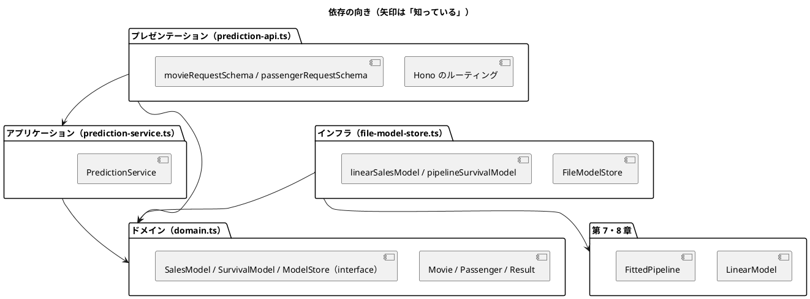

# 第 15 章: 機械学習 API とモジュール設計

## 15.1 はじめに

ここまでの章で、映画の興行収入を予測する線形回帰（第 7 章）と、乗客の生存を予測する前処理パイプライン（第 8 章）を作りました。どちらも学習と評価はできますが、使えるのは TypeScript のコードを書ける人だけです。

最終章では、この 2 つのモデルを **HTTP API** として公開します。API にすれば、Web アプリケーションや別の言語のプログラムから、JSON を送るだけで予測を使えます。

API を作るときに問題になるのは、機械学習そのものより **周辺の設計** です。

- HTTP の処理とモデルの処理が 1 つの関数に混ざると、どちらかを変えるたびに全体を壊しやすい
- 学習済みモデルのファイルが無いと、テストが動かない
- 不正な入力やモデルの読み込み失敗を、利用者にどう伝えるか

この章では、[Hono](https://hono.dev/) と [zod](https://zod.dev/) を使い、処理を **レイヤー（層）** に分けて、これらの問題を TDD で解いていきます。[Python 版の第 15 章](../python/15-machine-learning-api-and-module-design.md)・[Kotlin 版の第 15 章](../kotlin/15-machine-learning-api-and-module-design.md) と同じ構成で進めます。TypeScript 版では、次の 3 点に注目してください。

- **構造的部分型の約束** — `interface` を満たすオブジェクトリテラルが、そのままスタブになる
- **判別可能なユニオンで失敗を表す** — 標準ライブラリに `Result` が無いので、`{ ok: true; value }` と `{ ok: false; error }` のユニオンで自作する
- **型は実行時に消える** — HTTP の本文は型チェックを素通りするので、zod のスキーマで検証してからドメインの型にする

## 15.2 レイヤードアーキテクチャ

### 4 つの層と依存の向き

API を次の 4 つの層に分けます。

| 層 | ファイル | 責務 | 知っているもの |
|----|---------|------|--------------|
| ドメイン | `domain.ts` | 入力（映画・乗客）と予測結果の型、失敗を表す `Result`、「モデル」と「モデルの置き場」の約束（`interface`） | 何も知らない |
| アプリケーション | `prediction-service.ts` | 予測のユースケース（モデルを読み込んで予測する、ヘルスチェック） | ドメイン |
| インフラ | `file-model-store.ts` | モデルのファイルへの保存・読み込みと、第 7・8 章のモデルをドメインの約束に合わせるアダプター | ドメイン、第 7・8 章 |
| プレゼンテーション | `prediction-api.ts` | Hono のエンドポイント、zod による入力の検証、HTTP ステータスコード | ドメイン、アプリケーション |



ポイントは、**アプリケーション層がインフラ層を知らない** ことです。`PredictionService` は「モデルの置き場（`ModelStore`）から読み込んで予測する」ことしか知らず、それがファイルなのか、テスト用のスタブなのかを気にしません。

Kotlin 版と同じく、プレゼンテーション層の `createApp` は、組み立て済みの `PredictionService` を引数で受け取ります。どの置き場を使うかを決めるのは、サーバーを起動する `main.ts`（15.7 節）です。このため、API の層もインフラ層を知りません。

### インサイドアウトで進める

TDD の進め方には、外側（API）から作る **アウトサイドイン** と、内側（ドメイン・サービス）から作る **インサイドアウト** があります。この章ではインサイドアウトを選びます。

- 予測の中身（第 7・8 章のモデル）はすでにテスト済みで、新しく決めるのは「それをどう包むか」だけ
- 内側の層は外側を知らないので、内側から作ると、各段階でスタブが最小限で済む
- API の形（URL・JSON）は、内側の型が決まってから zod のスキーマに写すだけになる

## 15.3 TODO リストの作成

**TODO リスト**:

- [ ] 予測サービス（アプリケーション層）
  - [ ] 映画の特徴量から興行収入を予測する
  - [ ] 乗客の特徴量から生存・死亡を予測する
  - [ ] モデルが無ければ `ModelNotFoundError` の失敗を返す
  - [ ] ヘルスチェックで各モデルを読み込めるかを返す
- [ ] モデルの保存と読み込み（インフラ層）
  - [ ] 保存した線形回帰モデルを読み込んで興行収入を予測する
  - [ ] 保存したパイプラインを読み込んで生存を判定する
  - [ ] モデルファイルが無ければ `ModelNotFoundError` の失敗を返す（パスは見せない）
  - [ ] モデルファイルの形が違えば、例外を投げずに失敗を返す
- [ ] HTTP API（プレゼンテーション層）
  - [ ] `POST /cinema/sales` で興行収入を返す
  - [ ] `POST /survived` で生存の予測を返す
  - [ ] `GET /health` でモデルの状態を返す
  - [ ] 不正な入力には 422 を返す
  - [ ] モデルが無ければ 503 を返す
- [ ] 実データで学習したモデルで API を動かす

## 15.4 予測サービスを作る

### オブジェクトリテラルをスタブにする

最初のテストは「映画の特徴量から興行収入を予測する」です。本物のモデルの代わりに、`sns1` に 1000 を足すだけの **スタブ** を使います。スタブなら学習データもモデルファイルも要らず、期待値も一目で分かります。

最初に書いたテストです（あとで 15.6 節のリファクタリングで、スタブを別のファイルに移します）。

```typescript
// test/chapter15/prediction-service.test.ts（最初の版）
import { describe, expect, it } from "vitest";
import type { ModelStore, SalesModel } from "../../src/chapter15/domain.ts";
import { PredictionService } from "../../src/chapter15/prediction-service.ts";

const stubSalesModel: SalesModel = {
  predictSales: (movie) => 1000 + movie.sns1,
};

const stubModelStore: ModelStore = {
  loadSalesModel: () => ({ ok: true, value: stubSalesModel }),
};

describe("predictSales", () => {
  it("映画の特徴量から興行収入を予測する", () => {
    const service = new PredictionService(stubModelStore);

    const prediction = service.predictSales({
      sns1: 200,
      sns2: 500,
      actor: 3000,
      original: 1,
    });

    expect(prediction).toEqual({ ok: true, value: { sales: 1200 } });
  });
});
```

Kotlin 版では、スタブを `class StubSalesModel : SalesModel` のように **約束を実装すると宣言したクラス** として書きました。TypeScript の `interface` は、メソッドの形が合っていれば約束を満たしたとみなす **構造的部分型** です。宣言もクラスも要らず、`predictSales` を持つオブジェクトリテラルがそのまま `SalesModel` になります。Python 版の `Protocol` と同じ考え方です。

変数に `: SalesModel` と型を注釈しているのは、約束を満たしていることを型チェックに確かめさせるためです。注釈があるので、`(movie) => ...` の `movie` の型も `Movie` と推論されます。

```bash
npx vitest run test/chapter15
```

```text
 FAIL  test/chapter15/prediction-service.test.ts [ test/chapter15/prediction-service.test.ts ]
Error: Cannot find module '../../src/chapter15/prediction-service.ts' imported from test/chapter15/prediction-service.test.ts
```

見つからないと言われたのは `prediction-service.ts` だけで、同じく存在しない `domain.ts` は出てきません。`import type` は型だけの import なので、Vitest がテストを実行する前に型を取り除くとき、**import の文ごと消える** からです（Node.js の型除去でも同じです）。型チェックでは、どちらのファイルも見つからないことが分かります。

```bash
npm run typecheck
```

```text
test/chapter15/prediction-service.test.ts(2,45): error TS2307: Cannot find module '../../src/chapter15/domain.ts' or its corresponding type declarations.
test/chapter15/prediction-service.test.ts(3,35): error TS2307: Cannot find module '../../src/chapter15/prediction-service.ts' or its corresponding type declarations.
test/chapter15/prediction-service.test.ts(6,18): error TS7006: Parameter 'movie' implicitly has an 'any' type.
```

### 判別可能なユニオンで Result を作る

モデルの読み込みは失敗しうる処理です。Kotlin 版は標準ライブラリの `Result` を使いましたが、TypeScript の標準ライブラリには同じ役割の型がありません。そこで、第 3 章の決定木の木と同じく、**判別可能なユニオン** で自作します。

最初の実装です。

```typescript
// src/chapter15/domain.ts（最初の版）
export interface Movie {
  sns1: number;
  sns2: number;
  actor: number;
  original: number;
}

export interface SalesPrediction {
  sales: number;
}

/** 成功した値か、失敗の原因のどちらかを持つ */
export type Result<T> = { ok: true; value: T } | { ok: false; error: Error };

/** 映画の特徴量から興行収入を予測するモデルの約束 */
export interface SalesModel {
  predictSales(movie: Movie): number;
}

/** 学習済みモデルの置き場の約束 */
export interface ModelStore {
  loadSalesModel(): Result<SalesModel>;
}
```

```typescript
// src/chapter15/prediction-service.ts（最初の版）
import type { ModelStore, Movie, Result, SalesPrediction } from "./domain.ts";

export class PredictionService {
  readonly #store: ModelStore;

  constructor(store: ModelStore) {
    this.#store = store;
  }

  predictSales(movie: Movie): Result<SalesPrediction> {
    const loaded = this.#store.loadSalesModel();
    return loaded.ok
      ? { ok: true, value: { sales: loaded.value.predictSales(movie) } }
      : loaded;
  }
}
```

```text
 Test Files  1 passed (1)
      Tests  1 passed (1)
```

- `ok` が **判別子** です。`loaded.ok` が `true` の枝では `loaded` の型が `{ ok: true; value: SalesModel }` に絞り込まれるので、`loaded.value` を使えます。`false` の枝の `loaded` は `{ ok: false; error: Error }` で、`Result<SalesPrediction>` の失敗の側とも同じ形なので、そのまま返せます
- `#store` は JavaScript の **プライベートフィールド** です。TypeScript の `private` と違い、実行時にもクラスの外から読めません。本シリーズの `tsconfig.json` は `erasableSyntaxOnly` を有効にしているので、`constructor(private readonly store: ModelStore)` のような **パラメータプロパティ** は書けません（型除去だけでは JavaScript にならない構文だからです）。フィールドを宣言し、コンストラクタで代入します

### 生存予測・モデルが無い場合・ヘルスチェック

残りのサービスの振る舞いをテストに書きます。モデルが無い状態を表す `emptyModelStore` も、オブジェクトリテラルで用意します。

```typescript
// test/chapter15/prediction-service.test.ts（途中の版）
const stubSurvivalModel: SurvivalModel = {
  survives: (passenger) => passenger.sex === "female",
};

const stubModelStore: ModelStore = {
  loadSalesModel: () => ({ ok: true, value: stubSalesModel }),
  loadSurvivalModel: () => ({ ok: true, value: stubSurvivalModel }),
};

const emptyModelStore: ModelStore = {
  loadSalesModel: () => ({
    ok: false,
    error: new ModelNotFoundError("cinema"),
  }),
  loadSurvivalModel: () => ({
    ok: false,
    error: new ModelNotFoundError("survived"),
  }),
};
```

```typescript
  it("モデルが無ければ ModelNotFoundError の失敗を返す", () => {
    const service = new PredictionService(emptyModelStore);

    const prediction = service.predictSales(MOVIE);

    expect(prediction.ok).toBe(false);
    if (!prediction.ok) {
      expect(prediction.error).toBeInstanceOf(ModelNotFoundError);
      expect(prediction.error.message).toBe(
        "学習済みモデル cinema が見つかりません",
      );
    }
  });
```

乗客の予測とヘルスチェックのテストも同じ形で書きました（この章の最後に完成したテストを載せています）。

```text
 ❯ test/chapter15/prediction-service.test.ts (6 tests | 5 failed) 7ms
     × モデルが無ければ ModelNotFoundError の失敗を返す 2ms
     × 生存と判定されれば生存と予測する 0ms
     × 死亡と判定されれば死亡と予測する 0ms
     × モデルを読み込めればそれぞれ true を返す 0ms
     × モデルが無ければそれぞれ false を返す 0ms

 FAIL  test/chapter15/prediction-service.test.ts > predictSales > モデルが無ければ ModelNotFoundError の失敗を返す
TypeError: ModelNotFoundError is not a constructor
 FAIL  test/chapter15/prediction-service.test.ts > predictSurvival > 生存と判定されれば生存と予測する
TypeError: service.predictSurvival is not a function
...
 FAIL  test/chapter15/prediction-service.test.ts > health > モデルを読み込めればそれぞれ true を返す
TypeError: service.health is not a function
```

`ModelNotFoundError` はクラスなので、`import type` ではなく値として import しています（`type ModelStore` などの型と並べて、型の側にだけ `type` を付けています）。まだ存在しないクラスを `new` したので、「コンストラクタではない」という実行時のエラーになりました。

`if (!prediction.ok)` の中で `prediction.error` を確かめているのは、判別可能なユニオンの絞り込みをテストでも使うためです。`if` が無いと、`prediction.error` は成功の側に存在しないので、型チェックでエラーになります。

ドメインに、乗客・生存予測の型と、例外とモデルの約束を足します。

```typescript
export interface Passenger {
  pclass: number;
  sex: string;
  age: number | null;
  sibSp: number;
  parch: number;
  fare: number;
  embarked: string | null;
}
```

```typescript
export interface SurvivalPrediction {
  survived: boolean;
}

/** 成功した値か、失敗の原因のどちらかを持つ */
export type Result<T> = { ok: true; value: T } | { ok: false; error: Error };

/** 学習済みモデルが見つからないことを表す。メッセージにはファイルのパスを含めない */
export class ModelNotFoundError extends Error {
  readonly model: string;

  constructor(model: string) {
    super(`学習済みモデル ${model} が見つかりません`);
    this.name = "ModelNotFoundError";
    this.model = model;
  }
}

/** 映画の特徴量から興行収入を予測するモデルの約束 */
export interface SalesModel {
  predictSales(movie: Movie): number;
}

/** 乗客が生存するかを判定するモデルの約束 */
export interface SurvivalModel {
  survives(passenger: Passenger): boolean;
}

/** 学習済みモデルの置き場の約束。読み込めなければ失敗の Result を返す */
export interface ModelStore {
  loadSalesModel(): Result<SalesModel>;
  loadSurvivalModel(): Result<SurvivalModel>;
}
```

- 年齢（`age`）と乗船港（`embarked`）は欠損しうるので、`number | null`・`string | null` にしています
- `ModelNotFoundError` のメッセージにはモデル名だけを入れ、ファイルのパスは入れません。Python 版では、実際にサーバーを動かしてから応答にパスが漏れていることに気づき、あとから直しました（Python 版の 15.6 節）。TypeScript 版も Kotlin 版と同じく、その学びを最初から取り入れています
- `this.name` に名前を入れておくと、ログやテストの失敗で `ModelNotFoundError: 学習済みモデル cinema が見つかりません` のように表示されます

生存モデルの約束が確率ではなく「生存するか」（`boolean`）なのは、Kotlin 版と同じ理由です。第 8 章の決定木は葉に多数派のラベルだけを持ち、ラベルごとの件数を持っていないので、確率を返せません。

サービスには、`Result` の成功の値だけを変換する `mapResult` を用意し、予測とヘルスチェックを書きます。

```typescript
// src/chapter15/prediction-service.ts
import type {
  ModelStore,
  Movie,
  Passenger,
  Result,
  SalesPrediction,
  SurvivalPrediction,
} from "./domain.ts";

/** 成功していれば値を変換し、失敗していれば失敗をそのまま返す */
function mapResult<T, U>(
  result: Result<T>,
  transform: (value: T) => U,
): Result<U> {
  return result.ok ? { ok: true, value: transform(result.value) } : result;
}

export class PredictionService {
  readonly #store: ModelStore;

  constructor(store: ModelStore) {
    this.#store = store;
  }

  predictSales(movie: Movie): Result<SalesPrediction> {
    return mapResult(this.#store.loadSalesModel(), (model) => ({
      sales: model.predictSales(movie),
    }));
  }

  predictSurvival(passenger: Passenger): Result<SurvivalPrediction> {
    return mapResult(this.#store.loadSurvivalModel(), (model) => ({
      survived: model.survives(passenger),
    }));
  }

  health(): Record<"cinema" | "survived", boolean> {
    return {
      cinema: this.#store.loadSalesModel().ok,
      survived: this.#store.loadSurvivalModel().ok,
    };
  }
}
```

```text
 Test Files  1 passed (1)
      Tests  6 passed (6)
```

- `mapResult` は、Kotlin の `Result.map` に当たる関数です。「読み込めたら予測する」を、`if` を書かずに 1 つの式で書けます
- ヘルスチェックは、読み込みの結果の `ok` を見るだけです。Python 版の `_can_load` のように例外を捕まえる必要はありません
- `health` の戻り値の型 `Record<"cinema" | "survived", boolean>` は、キーの打ち間違いや書き忘れを型チェックで見つけるためのものです

## 15.5 モデルを保存して読み込む

### アダプターで第 7・8 章のモデルを約束に合わせる

インフラ層では、モデルをファイルに保存・読み込みします。第 7 章の線形回帰は `predict(model, rows)`、第 8 章のパイプラインは `predictPassenger(pipeline, passenger)` という関数で、どちらも列名が `SNS1`・`Pclass` のような CSV の列名です。ドメインの `predictSales(movie)`・`survives(passenger)` とは合わないので、間を取り持つ **アダプター** を作ります。

テストでは、係数を手で決めた線形回帰モデルと、架空の 8 人の乗客で学習したパイプラインを使います。どちらも学習データ無しで動きます。

```typescript
function passenger(sex: string): Passenger {
  return {
    pclass: 2,
    sex,
    age: null,
    sibSp: 0,
    parch: 0,
    fare: 20,
    embarked: null,
  };
}

/** 架空の 8 人の乗客。女性は生存、男性は死亡 */
function fictionalPassengers(): { x: SurvivedPassenger[]; t: number[] } {
  const rows: [number, string, number | null, number, string | null][] = [
    [1, "female", 25, 60, "C"],
    [2, "female", 35, 30, "S"],
    [3, "female", 18, 10, "Q"],
    [3, "female", null, 9, "S"],
    [1, "male", 40, 55, "C"],
    [2, "male", 28, 15, "S"],
    [3, "male", 22, 8, null],
    [3, "male", null, 7, "S"],
  ];
  return {
    x: rows.map(([Pclass, Sex, Age, Fare, Embarked]) => ({
      Pclass,
      Sex,
      Age,
      SibSp: 0,
      Parch: 0,
      Fare,
      Embarked,
    })),
    t: [1, 1, 1, 1, 0, 0, 0, 0],
  };
}

function valueOf<T>(result: Result<T>): T {
  if (!result.ok) {
    throw result.error;
  }
  return result.value;
}
```

```typescript
let directory: string;

beforeEach(() => {
  directory = mkdtempSync(join(tmpdir(), "model-"));
});

describe("興行収入のモデル", () => {
  it("保存した線形回帰モデルを読み込んで興行収入を予測する", () => {
    const store = new FileModelStore(directory);
    store.saveSalesModel({
      intercept: 100,
      coefficients: { SNS1: 1, SNS2: 2, actor: 0.5, original: 10 },
    });

    const model = valueOf(store.loadSalesModel());

    expect(
      model.predictSales({ sns1: 10, sns2: 20, actor: 100, original: 1 }),
    ).toBeCloseTo(210, 9);
  });

  it("モデルファイルが無ければ ModelNotFoundError の失敗を返す", () => {
    const store = new FileModelStore(directory);

    const result = store.loadSalesModel();

    expect(result.ok).toBe(false);
    if (!result.ok) {
      expect(result.error).toBeInstanceOf(ModelNotFoundError);
      expect(result.error.message).not.toContain(directory);
    }
  });

  it("モデルファイルの形が違えば例外を投げずに失敗を返す", () => {
    writeFileSync(join(directory, "cinema.json"), '{"intercept": "高い"}');
    const store = new FileModelStore(directory);

    const result = store.loadSalesModel();

    expect(result.ok).toBe(false);
    if (!result.ok) {
      expect(result.error).not.toBeInstanceOf(ModelNotFoundError);
    }
  });
});
```

- 一時ディレクトリは `beforeEach` でテストごとに作ります。前のテストが保存したファイルが、次のテストの「ファイルが無い」場合を壊さないようにするためです
- `valueOf` は、成功していれば値を返し、失敗していれば原因の例外を投げるテスト用の関数です。読み込めなければ例外でテストが失敗すればよいので、このように使います
- 「形が違えば」のテストは、TODO リストに加えた TypeScript 版だけの項目です。`JSON.parse` の結果は型チェックを素通りするので（第 8 章）、読み込むときに形を確かめ、確かめられなければ例外を外に飛び出させずに失敗の `Result` にします

```text
 FAIL  test/chapter15/file-model-store.test.ts [ test/chapter15/file-model-store.test.ts ]
Error: Cannot find module '../../src/chapter15/file-model-store.ts' imported from test/chapter15/file-model-store.test.ts
```

アダプターは、ドメインの値を第 7・8 章の列名に写し替えて、それぞれのモデルに渡します。

```typescript
/** 第 7 章の線形回帰モデルを、ドメインの SalesModel の約束に合わせるアダプター */
export function linearSalesModel(model: LinearModel<Feature>): SalesModel {
  return {
    predictSales: (movie) =>
      predictLinear(model, [
        {
          SNS1: movie.sns1,
          SNS2: movie.sns2,
          actor: movie.actor,
          original: movie.original,
        },
      ])[0] as number,
  };
}

/** 第 8 章の学習済みパイプラインを、ドメインの SurvivalModel の約束に合わせるアダプター */
export function pipelineSurvivalModel(pipeline: FittedPipeline): SurvivalModel {
  return {
    survives: (passenger) =>
      predictPassenger(pipeline, {
        Pclass: passenger.pclass,
        Sex: passenger.sex,
        Age: passenger.age,
        SibSp: passenger.sibSp,
        Parch: passenger.parch,
        Fare: passenger.fare,
        Embarked: passenger.embarked,
      }) === 1,
  };
}
```

- Kotlin 版はアダプターを `class LinearSalesModel(...) : SalesModel` として書きましたが、TypeScript 版は **オブジェクトリテラルを返す関数** にしました。約束が構造的部分型なので、クラスを作らなくても、戻り値の型 `SalesModel` を満たすオブジェクトを返せば足ります
- 第 7 章の `predict` は、第 15 章の中で別の意味の「予測」と紛らわしいので、`predict as predictLinear` と別名で import しています
- 列名の写し替えを 1 か所に書いておけば、JSON の項目名（15.6 節）・ドメインの型・CSV の列名が違っていても、それぞれを別々に変えられます
- 乗客の年齢・乗船港が `null` のときは、第 8 章のパイプラインが訓練データの値で補完します

### 保存の形式

保存の形式は、どちらのモデルも JSON です。

| モデル | ファイル | 保存と読み込み |
|--------|---------|--------------|
| 第 7 章の `LinearModel<Feature>` | `cinema.json` | この章で `JSON.stringify` し、zod の `linearModelSchema` で検証して読み込む |
| 第 8 章の `FittedPipeline` | `survived.json` | 第 8 章の `saveModel`・`loadModel`（zod で検証する）をそのまま使う |

第 7 章の `LinearModel` は、切片と係数だけを持つただのオブジェクトなので、`JSON.stringify` でそのまま保存できます。Kotlin 版では、第 7 章の data class に手を加えないために、保存専用の形（`LinearModelFile`）をインフラ層に置きました。TypeScript 版では型とデータが分かれているので、保存専用の形は要らず、読み込むときの **スキーマ** だけをインフラ層に置きます。

```typescript
/** 保存した線形回帰モデルの形。読み込んだ JSON がこの形でなければ読み込みを止める */
const linearModelSchema: z.ZodType<LinearModel<Feature>> = z.object({
  intercept: z.number(),
  coefficients: z.object({
    SNS1: z.number(),
    SNS2: z.number(),
    actor: z.number(),
    original: z.number(),
  }),
});
```

`z.ZodType<LinearModel<Feature>>` と型を注釈したので、スキーマと第 7 章の型が食い違うと型チェックが知らせます。第 8 章で `pipelineSchema` に使ったのと同じ書き方です。

### モデルの置き場

モデルの保存と読み込みをまとめた `FileModelStore` です。

```typescript
/** 学習済みモデルをディレクトリのファイルに保存し、読み込む */
export class FileModelStore implements ModelStore {
  readonly #modelDir: string;

  constructor(modelDir: string) {
    this.#modelDir = modelDir;
  }

  saveSalesModel(model: LinearModel<Feature>): void {
    mkdirSync(this.#modelDir, { recursive: true });
    writeFileSync(this.#salesModelFile(), JSON.stringify(model));
  }

  saveSurvivalModel(pipeline: FittedPipeline): void {
    saveModel(pipeline, this.#survivalModelFile());
  }

  loadSalesModel(): Result<SalesModel> {
    return load(SALES_MODEL, this.#salesModelFile(), (file) =>
      linearSalesModel(
        linearModelSchema.parse(JSON.parse(readFileSync(file, "utf8"))),
      ),
    );
  }

  loadSurvivalModel(): Result<SurvivalModel> {
    return load(SURVIVAL_MODEL, this.#survivalModelFile(), (file) =>
      pipelineSurvivalModel(loadModel(file)),
    );
  }

  #salesModelFile(): string {
    return join(this.#modelDir, `${SALES_MODEL}.json`);
  }

  #survivalModelFile(): string {
    return join(this.#modelDir, `${SURVIVAL_MODEL}.json`);
  }
}

/** ファイルが無ければ ModelNotFoundError の失敗を、読み込みで例外が起きればその失敗を返す */
function load<T>(
  model: string,
  file: string,
  read: (file: string) => T,
): Result<T> {
  if (!existsSync(file)) {
    return { ok: false, error: new ModelNotFoundError(model) };
  }
  try {
    return { ok: true, value: read(file) };
  } catch (error) {
    return {
      ok: false,
      error: error instanceof Error ? error : new Error(String(error)),
    };
  }
}
```

- `load` は、ファイルが無ければ `ModelNotFoundError` の失敗を、あれば `read` の結果を返します。`read` が例外を投げたとき（JSON として読めない、スキーマに合わない）は、`catch` で失敗の `Result` にします。Kotlin 版の `runCatching` に当たる処理です
- `catch (error)` の `error` の型は `unknown` です。JavaScript では `throw "文字列"` のように `Error` 以外も投げられるので、`instanceof Error` で確かめ、そうでなければ `Error` に包みます
- `class FileModelStore implements ModelStore` の `implements` は、構造的部分型の言語では **必須ではありません**。書いておくと、約束を満たしていないことがクラスの定義の位置で分かり、読む人にも「この約束の実装だ」と伝わります
- `#salesModelFile()` のように、メソッドにも `#` を付けてプライベートにできます

モデルはリクエストのたびにファイルから読み込みます。学習し直したモデルをサーバーの再起動なしで使える反面、リクエストごとにファイルを読む分だけ遅くなります。アクセスが多い API では、読み込んだモデルをキャッシュする設計を検討してください。

```text
 Test Files  2 passed (2)
      Tests  11 passed (11)
```

## 15.6 Hono でエンドポイントを作る

### app.request でサーバーを起動せずにテストする

Hono のアプリケーションには、サーバーを起動せずにリクエストを送れる `app.request` があります。Web 標準の `Request` を受け取り、`Response` を返す関数としてアプリケーションを呼び出すので、ポートもネットワークも使いません。テストごとに置き場（スタブ）を選んでサービスを組み立て、API に渡します。

サービスのテストで使ったスタブを API のテストでも使うので、ここでリファクタリングとして `test/chapter15/stubs.ts` に移しました（この章の最後に載せています）。ファイル名が `.test.ts` で終わらないので、Vitest はこのファイルをテストとして実行しません。

最初のテストです。

```typescript
// test/chapter15/prediction-api.test.ts（最初の版）
import { describe, expect, it } from "vitest";
import type { ModelStore } from "../../src/chapter15/domain.ts";
import { createApp } from "../../src/chapter15/prediction-api.ts";
import { PredictionService } from "../../src/chapter15/prediction-service.ts";
import { stubModelStore } from "./stubs.ts";

const MOVIE_JSON = { sns1: 200, sns2: 500, actor: 3000, original: 1 };

/** スタブの置き場を使うサービスで API を組み立て、JSON を POST する */
function postJson(store: ModelStore, path: string, body: unknown) {
  return createApp(new PredictionService(store)).request(path, {
    method: "POST",
    headers: { "Content-Type": "application/json" },
    body: JSON.stringify(body),
  });
}

describe("POST /cinema/sales", () => {
  it("映画の特徴量を送ると予測した興行収入を返す", async () => {
    const response = await postJson(
      stubModelStore,
      "/cinema/sales",
      MOVIE_JSON,
    );

    expect(response.status).toBe(200);
    expect(await response.json()).toEqual({ sales: 1200 });
  });
});
```

- 送る JSON はオブジェクトリテラルで書き、`JSON.stringify` で本文にします。返ってきた本文は `response.json()` で読み、JSON の形で比べます。API の約束は JSON の形なので、TypeScript の型ではなく値で比べています
- Kotlin 版の `testApplication` は、`suspend` なレシーバー付きの関数型でテストを書きました。TypeScript 版は `async` の関数で `await` するだけです

```text
 FAIL  test/chapter15/prediction-api.test.ts [ test/chapter15/prediction-api.test.ts ]
Error: Cannot find module '../../src/chapter15/prediction-api.ts' imported from test/chapter15/prediction-api.test.ts
```

最小限の実装です。

```typescript
// src/chapter15/prediction-api.ts（最初の版）
import { Hono } from "hono";
import type { Movie } from "./domain.ts";
import type { PredictionService } from "./prediction-service.ts";

export function createApp(service: PredictionService): Hono {
  const app = new Hono();
  app.post("/cinema/sales", async (c) => {
    const movie = await c.req.json<Movie>();
    const prediction = service.predictSales(movie);
    if (!prediction.ok) {
      throw prediction.error;
    }
    return c.json({ sales: prediction.value.sales });
  });
  return app;
}
```

- `app.post(パス, ハンドラー)` でエンドポイントを登録します。ハンドラーの引数 `c` は **コンテキスト** で、リクエストの読み取り（`c.req`）と応答の作成（`c.json`）をまとめて持ちます
- `createApp` は `Hono` のインスタンスを返す関数です。本番の起動とテストで同じ関数を使い、テストでは `app.request`、本番では 15.7 節の `serve` にアプリケーションを渡します

```text
 Test Files  4 passed (4)
      Tests  12 passed (12)
```

### 入力の検証とエラー応答をテストに書く

残りのエンドポイントと、不正な入力・モデルが無い場合のテストを追加します。API を組み立てる部分を `appWith` に分け、JSON として読めない本文も送れるようにしました。

```typescript
const MOVIE_JSON = { sns1: 200, sns2: 500, actor: 3000, original: 1 };
const PASSENGER_JSON = {
  pclass: 1,
  sex: "female",
  age: null,
  sib_sp: 0,
  parch: 0,
  fare: 50,
  embarked: "C",
};

/** スタブの置き場を使うサービスで API を組み立てる */
function appWith(store: ModelStore) {
  return createApp(new PredictionService(store));
}

/** スタブの置き場を使うサービスで API を組み立て、JSON を POST する */
function postJson(store: ModelStore, path: string, body: unknown) {
  return appWith(store).request(path, {
    method: "POST",
    headers: { "Content-Type": "application/json" },
    body: JSON.stringify(body),
  });
}
```

```typescript
  it.each([
    ["sns1", -1],
    ["actor", "多い"],
    ["original", 2],
  ])("特徴量が不正なら 422 を返す（%s=%s）", async (field, value) => {
    const response = await postJson(stubModelStore, "/cinema/sales", {
      ...MOVIE_JSON,
      [field]: value,
    });

    expect(response.status).toBe(422);
  });

  it("JSON として読めなければ 422 を返す", async () => {
    const response = await appWith(stubModelStore).request("/cinema/sales", {
      method: "POST",
      headers: { "Content-Type": "application/json" },
      body: "{",
    });

    expect(response.status).toBe(422);
    expect(await response.json()).toEqual({
      detail: ["JSON の形式が正しくありません"],
    });
  });

  it("モデルが無ければ 503 を返す", async () => {
    const response = await postJson(
      emptyModelStore,
      "/cinema/sales",
      MOVIE_JSON,
    );

    expect(response.status).toBe(503);
    expect(await response.json()).toEqual({
      detail: "学習済みモデル cinema が見つかりません",
    });
  });
```

- `it.each` は、表の各行で同じテストを繰り返します。テスト名の `%s` に行の値が入るので、どの値で失敗したかがテスト名で分かります
- `{ ...MOVIE_JSON, [field]: value }` は、スプレッド構文で 1 つの項目だけを差し替えたオブジェクトを作ります。`[field]` は、変数の値をキーにする **計算されたプロパティ名** です

乗客の API（`/survived`）とヘルスチェック（`/health`）のテストも同じ形で書きました（この章の最後に載せています）。実行すると、16 件中 15 件が失敗しました。

```text
 FAIL  test/chapter15/prediction-api.test.ts > POST /cinema/sales > 特徴量が不正なら 422 を返す（sns1=-1）
 FAIL  test/chapter15/prediction-api.test.ts > POST /cinema/sales > 特徴量が不正なら 422 を返す（actor=多い）
 FAIL  test/chapter15/prediction-api.test.ts > POST /cinema/sales > 特徴量が不正なら 422 を返す（original=2）
AssertionError: expected 200 to be 422 // Object.is equality
 FAIL  test/chapter15/prediction-api.test.ts > POST /cinema/sales > JSON として読めなければ 422 を返す
AssertionError: expected 500 to be 422 // Object.is equality
 FAIL  test/chapter15/prediction-api.test.ts > POST /cinema/sales > モデルが無ければ 503 を返す
AssertionError: expected 500 to be 503 // Object.is equality
 FAIL  test/chapter15/prediction-api.test.ts > POST /survived > 乗客の特徴量を送ると生存の予測を返す
AssertionError: expected 404 to be 200 // Object.is equality
...
 FAIL  test/chapter15/prediction-api.test.ts > GET /health > 読み込めないモデルがあれば degraded を返す
AssertionError: expected 404 to be 200 // Object.is equality

      Tests  15 failed | 1 passed (16)
```

失敗の内容から、次のことが分かります。

- **不正な値は 3 つとも 200 で通ってしまう**。負の値（`sns1` が −1）や範囲外の値（`original` が 2）だけでなく、**数値の項目に文字列（`actor` が `"多い"`）を送っても 200** でした。`c.req.json<Movie>()` の `<Movie>` は「`Movie` だと思って扱う」という型の上の宣言にすぎず、実行時には何も確かめません。スタブのモデルは `sns1` しか使わないので、`actor` が文字列のまま計算が終わりました
- **JSON として読めないと 500**。`c.req.json()` が `SyntaxError` を投げ、Hono の既定のエラー処理が 500 を返しました
- **モデルが無いと、`throw` した `ModelNotFoundError` がそのまま 500 になる**
- **まだ作っていないエンドポイントは 404**

Kotlin 版では、kotlinx.serialization が本文を読むときに型を検査したので、文字列の `actor` は例外になりました。TypeScript では型が実行時に消えるので、外から来た値は、型の検査も含めて自分で確かめる必要があります。

### zod のスキーマで入力を検証する

HTTP の本文を、zod のスキーマで検証します。Kotlin 版は値の範囲の検証を関数で書きましたが、zod では型の検査と値の範囲の検査を、1 つのスキーマにまとめて宣言できます。

```typescript
function notNegative(field: string) {
  return z
    .number({ error: `${field} は数値にしてください` })
    .nonnegative({ error: `${field} は 0 以上にしてください` });
}

function notNegativeInt(field: string) {
  return z
    .int({ error: `${field} は整数にしてください` })
    .nonnegative({ error: `${field} は 0 以上にしてください` });
}

function oneOf<
  const T extends readonly [string | number, ...(string | number)[]],
>(field: string, values: T) {
  return z.literal(values, {
    error: `${field} は ${values.join("、")} のどれかにしてください`,
  });
}

/** 映画の API の入力。JSON の項目名はドメインの Movie と同じ */
const movieRequestSchema = z.object({
  sns1: notNegative("sns1"),
  sns2: notNegative("sns2"),
  actor: notNegative("actor"),
  original: oneOf("original", [0, 1]),
});

/** 乗客の API の入力。年齢と乗船港は省略でき、欠損値の補完は第 8 章のパイプラインに任せる */
const passengerRequestSchema = z
  .object({
    pclass: oneOf("pclass", [1, 2, 3]),
    sex: oneOf("sex", ["male", "female"]),
    age: notNegative("age").nullish(),
    sib_sp: notNegativeInt("sib_sp"),
    parch: notNegativeInt("parch"),
    fare: notNegative("fare"),
    embarked: oneOf("embarked", ["C", "Q", "S"]).nullish(),
  })
  .transform((request): Passenger => ({
    pclass: request.pclass,
    sex: request.sex,
    age: request.age ?? null,
    sibSp: request.sib_sp,
    parch: request.parch,
    fare: request.fare,
    embarked: request.embarked ?? null,
  }));
```

- `z.number()` は数値か、`.nonnegative()` は 0 以上かを確かめます。`{ error: ... }` で、検証に失敗したときのメッセージを日本語にしています。指定しなければ、zod の既定の英語のメッセージ（文字列の `actor` なら `Invalid input: expected number, received string`、−1 なら `Too small: expected number to be >=0`）になります
- `z.literal([1, 2, 3])` は、並べた値のどれかであることを確かめます。`oneOf` の型引数の `const` 修飾子は、`[1, 2, 3]` を `number[]` ではなくリテラルの組 `readonly [1, 2, 3]` として推論させるためのものです。そのおかげで、検証した値の型も `1 | 2 | 3` になります
- `.nullish()` は、`null` と省略（`undefined`）の両方を許します。年齢と乗船港は省略でき、欠損値の補完は第 8 章のパイプラインに任せます
- `.transform(...)` は、検証した値をドメインの型に写し替えます。JSON の項目名 `sib_sp`（Python 版の API と同じ形）を、ドメインの `sibSp` に対応させるのはここです。映画は JSON の項目名とドメインの型が同じなので、写し替えは要りません

本文を読んで検証する処理は、2 つのエンドポイントで共通にします。

```typescript
/** 入力の検証結果。正しければ値を、不正なら理由の一覧を持つ */
type Validated<T> = { ok: true; value: T } | { ok: false; errors: string[] };

/** 本文を JSON として読み、スキーマで検証してドメインの型にする */
async function validate<T>(
  c: Context,
  schema: z.ZodType<T, unknown>,
): Promise<Validated<T>> {
  let body: unknown;
  try {
    body = await c.req.json();
  } catch {
    return { ok: false, errors: ["JSON の形式が正しくありません"] };
  }
  const parsed = schema.safeParse(body);
  return parsed.success
    ? { ok: true, value: parsed.data }
    : { ok: false, errors: parsed.error.issues.map((issue) => issue.message) };
}
```

- `Validated<T>` は、Kotlin 版の sealed interface `Validated` に当たる判別可能なユニオンです。`Result<T>` と違い、失敗の側は例外ではなく **理由の一覧** を持ちます。1 回のリクエストで、不正な項目をまとめて返せます
- `safeParse` は、検証に失敗しても例外を投げず、`success` で判別できる結果を返します。`parse` は失敗すると例外を投げるので、入力の検証のように「失敗が普通に起きる」場面では `safeParse` を使います
- `z.ZodType<T, unknown>` の 2 つ目の型引数は、スキーマが受け取る値の型です。乗客のスキーマは `.transform` で入力と出力の型が違うので、入力の型を `unknown` にして、どちらのスキーマも受け取れるようにしています
- `catch` の後ろに `(error)` を書いていないのは、例外の中身を使わないためです。JSON として読めなかったことだけを、固定のメッセージで返します

### 例外を HTTP のステータスコードに変換する

残るのはモデルが無い場合です。Hono の `app.onError` で、ハンドラーから投げられた例外の種類ごとに応答を決めます。

```typescript
/** 成功していれば値を返し、失敗していれば原因の例外を投げる */
function valueOrThrow<T>(result: Result<T>): T {
  if (!result.ok) {
    throw result.error;
  }
  return result.value;
}

export function createApp(service: PredictionService): Hono {
  const app = new Hono();

  app.post("/cinema/sales", async (c) => {
    const movie = await validate(c, movieRequestSchema);
    if (!movie.ok) {
      return c.json({ detail: movie.errors }, 422);
    }
    return c.json(valueOrThrow(service.predictSales(movie.value)));
  });

  app.post("/survived", async (c) => {
    const passenger = await validate(c, passengerRequestSchema);
    if (!passenger.ok) {
      return c.json({ detail: passenger.errors }, 422);
    }
    return c.json(valueOrThrow(service.predictSurvival(passenger.value)));
  });

  app.get("/health", (c) => {
    const models = service.health();
    const status = Object.values(models).every(Boolean) ? "ok" : "degraded";
    return c.json({ status, models });
  });

  // ドメインの例外を HTTP のステータスコードに変換する。内部の情報は応答に出さない
  app.onError((error, c) => {
    if (error instanceof ModelNotFoundError) {
      return c.json({ detail: error.message }, 503);
    }
    console.error(error);
    return c.json({ detail: "予測中にエラーが発生しました" }, 500);
  });

  return app;
}
```

- `ModelNotFoundError` はドメインの例外で、HTTP を知りません。HTTP のステータスコード **503 Service Unavailable**（一時的に提供できない）に変換するのはプレゼンテーション層の仕事です。サービスは失敗を `Result` で返し、エンドポイントの `valueOrThrow` で例外に戻してから、`onError` に変換を任せています。Kotlin 版の `getOrThrow` と `StatusPages` と同じ分担です
- それ以外の例外は、ログに書き出したうえで、内部の情報を含まない固定のメッセージの 500 を返します。`onError` を入れる前の Red では、Hono の既定の処理が例外をログに書き出し、本文 `Internal Server Error` の 500 を返していました
- `c.json(値, 422)` のように、2 つ目の引数でステータスコードを指定します
- ヘルスチェックの `Object.values(models).every(Boolean)` は、すべてのモデルが `true` かを確かめます。`Boolean` を関数として渡すと、各値を真偽値に変換した結果で判定します

```text
 Test Files  4 passed (4)
      Tests  27 passed (27)
```

## 15.7 実データで学習したモデルで動かす

### 学習と保存

第 7・8 章と同じ条件（テストデータの割合 0.2、シード 0、決定木の深さ 5、`classWeight: "balanced"`）でモデルを学習し、保存する処理を作ります。

```typescript
// src/chapter15/training.ts
import { join } from "node:path";
import { splitTrainTest } from "../chapter02/iris-preprocessing.ts";
import {
  fitLinearRegression,
  prepareCinema,
} from "../chapter07/cinema-regression.ts";
import { fitPipeline } from "../chapter08/pipeline.ts";
import {
  loadSurvived,
  splitFeaturesAndTarget,
} from "../chapter08/survived-data.ts";
import type { FileModelStore } from "./file-model-store.ts";

const TEST_SIZE = 0.2;
const SEED = 0;
const MAX_DEPTH = 5;

/** 第 7・8 章と同じ条件でモデルを学習し、置き場に保存する */
export function trainAndSaveModels(
  dataDirectory: string,
  store: FileModelStore,
): void {
  const cinema = prepareCinema(
    join(dataDirectory, "cinema.csv"),
    TEST_SIZE,
    SEED,
  );
  store.saveSalesModel(fitLinearRegression(cinema.xTrain, cinema.tTrain));

  const { x, t } = splitFeaturesAndTarget(
    loadSurvived(join(dataDirectory, "Survived.csv")),
  );
  const survived = splitTrainTest(x, t, TEST_SIZE, SEED);
  store.saveSurvivalModel(
    fitPipeline(survived.xTrain, survived.tTrain, {
      maxDepth: MAX_DEPTH,
      classWeight: "balanced",
    }),
  );
}
```

### 統合テスト

ここまでのテストは、層ごとにスタブを使って切り離していました。**統合テスト** では、実データで学習したモデルをインフラ層で読み込み、サービス・API まで本物をつないで確かめます。学習は時間がかかるので、`beforeAll` で 1 回だけ行います。

```typescript
const hasTrainingData =
  existsSync(join(dataDir(), "cinema.csv")) &&
  existsSync(join(dataDir(), "Survived.csv"));

function postJson(app: Hono, path: string, body: unknown) {
  return app.request(path, {
    method: "POST",
    headers: { "Content-Type": "application/json" },
    body: JSON.stringify(body),
  });
}

describe.skipIf(!hasTrainingData)("実データで学習したモデル", () => {
  let app: Hono;

  // 学習は時間がかかるので、describe の中で 1 回だけ行う
  beforeAll(() => {
    const store = new FileModelStore(mkdtempSync(join(tmpdir(), "model-")));
    trainAndSaveModels(dataDir(), store);
    app = createApp(new PredictionService(store));
  });

  it("学習したモデルを保存するとヘルスチェックが ok になる", async () => {
    const response = await app.request("/health");

    expect(await response.json()).toEqual({
      status: "ok",
      models: { cinema: true, survived: true },
    });
  });

  it("学習した線形回帰モデルで興行収入を予測する", async () => {
    const response = await postJson(app, "/cinema/sales", {
      sns1: 200,
      sns2: 500,
      actor: 3000,
      original: 1,
    });

    expect(response.status).toBe(200);
    const { sales } = (await response.json()) as { sales: number };
    expect(sales).toBeCloseTo(7853.14, 2);
  });
```

- データが無い環境では、`describe.skipIf` で `describe` ごとスキップされ、`beforeAll` の学習も行われません。学習を `describe` の本体ではなく `beforeAll` に書いているのはそのためです（第 3 章）
- Web 標準の `Response` の `json()` は `Promise<any>` を返します。`any` のままだと打ち間違いも型チェックを素通りするので、`as { sales: number }` で形を宣言しています。この `as` が実際の値と合っていることは、次の行の検査で確かめています

```text
 FAIL  test/chapter15/trained-models.test.ts [ test/chapter15/trained-models.test.ts ]
Error: Cannot find module '../../src/chapter15/training.ts' imported from test/chapter15/trained-models.test.ts
```

期待値の 7853.14 は、最初に仮の値 0 を書いてテストを失敗させ、その失敗で表示された実測値から決めました。

```text
     × 学習した線形回帰モデルで興行収入を予測する 6ms
AssertionError: expected 7853.142203407966 to be close to +0, received difference is 7853.142203407966, but expected 0.005
      Tests  1 failed | 3 passed (4)
```

仮の値のままでは意味が無いので、実測値が妥当かを第 7 章の係数（切片 6299.63、SNS1 1.0876、SNS2 0.4358、actor 0.2785、original 282.5378）で手計算して確かめました。6299.63 + 1.0876 × 200 + 0.4358 × 500 + 0.2785 × 3000 + 282.5378 × 1 ≈ 7853.09 となり、係数の丸めの範囲で一致します。このように、実装が先にある値を固定するテストは **特性テスト** と呼ばれ、以後の変更で結果が変わっていないことを守ります。Python 版の 7895.31・Kotlin 版の 7830.42 と値が違うのは、訓練データに入った行が違うためです（第 2 章）。

生存予測の統合テストでは、1 等客室の女性が生存、3 等客室の男性が死亡と予測されることを確かめています（`test/chapter15/trained-models.test.ts`）。

### 学習してサーバーを起動する

`main.ts` は、学習済みモデルを `apps/node/model/` に保存してから、[@hono/node-server](https://github.com/honojs/node-server) の `serve` でサーバーを起動します。このディレクトリは `.gitignore` の対象です（第 4 章）。

表示のテスト（`trainAndReport`）を先に書き、`main.ts` が無いことによる失敗を確かめてから実装しました。

```typescript
describe.skipIf(!hasTrainingData)("trainAndReport", () => {
  it("学習するとモデルを保存して起動する URL を表示する", () => {
    const modelDir = mkdtempSync(join(tmpdir(), "model-"));
    const lines: string[] = [];

    trainAndReport(modelDir, (line) => lines.push(line));

    expect(lines).toEqual([
      "学習済みモデルを保存しました: cinema.json, survived.json",
      "API を起動します: http://127.0.0.1:8015",
    ]);
    expect(existsSync(join(modelDir, "cinema.json"))).toBe(true);
    expect(existsSync(join(modelDir, "survived.json"))).toBe(true);
  });
});
```

```text
 FAIL  test/chapter15/trained-models.test.ts [ test/chapter15/trained-models.test.ts ]
Error: Cannot find module '../../src/chapter15/main.ts' imported from test/chapter15/trained-models.test.ts
```

```typescript
// src/chapter15/main.ts
import { type ServerType, serve } from "@hono/node-server";
import { dataDir } from "../dataset.ts";
import {
  FileModelStore,
  SALES_MODEL,
  SURVIVAL_MODEL,
} from "./file-model-store.ts";
import { createApp } from "./prediction-api.ts";
import { PredictionService } from "./prediction-service.ts";
import { trainAndSaveModels } from "./training.ts";

/** 学習済みモデルの保存先（apps/node/model/ は .gitignore の対象） */
export const MODEL_DIR = "model";
export const HOSTNAME = "127.0.0.1";
export const PORT = 8015;

export function trainAndReport(
  modelDir: string,
  print: (line: string) => void = console.log,
): void {
  trainAndSaveModels(dataDir(), new FileModelStore(modelDir));
  print(
    `学習済みモデルを保存しました: ${SALES_MODEL}.json, ${SURVIVAL_MODEL}.json`,
  );
  print(`API を起動します: http://${HOSTNAME}:${PORT}`);
}

export function startServer(modelDir: string, port: number): ServerType {
  const app = createApp(new PredictionService(new FileModelStore(modelDir)));
  return serve({ fetch: app.fetch, hostname: HOSTNAME, port });
}

export function main(print: (line: string) => void = console.log): void {
  trainAndReport(MODEL_DIR, print);
  startServer(MODEL_DIR, PORT);
}

// node src/chapter15/main.ts で直接実行したときだけ main を呼ぶ
if (import.meta.filename === process.argv[1]) {
  main();
}
```

- `serve({ fetch: app.fetch, ... })` は、Node.js の HTTP サーバーを起動し、届いたリクエストを Hono の `app.fetch` に渡します。`app.fetch` は Web 標準の `Request` を受け取り `Response` を返す関数で、テストの `app.request` と同じ入口です。テストで確かめたアプリケーションが、そのまま本番のサーバーで動きます
- ここで初めて、ファイルの置き場（`FileModelStore`）とサービスを組み立てます
- `serve` は起動したサーバー（`ServerType`）を返し、プロセスはサーバーが止まるまで終わりません。表示のテストは、サーバーを起動しない `trainAndReport` だけを対象にしています

サーバーの起動も、テストに残しておきます。ポートに 0 を渡すと、空いているポートを OS が選ぶので、ほかのプロセスとポートがぶつかりません。

```typescript
// test/chapter15/server.test.ts
import { mkdtempSync } from "node:fs";
import type { AddressInfo } from "node:net";
import { tmpdir } from "node:os";
import { join } from "node:path";
import { describe, expect, it } from "vitest";
import { startServer } from "../../src/chapter15/main.ts";

describe("startServer", () => {
  it("起動したサーバーに HTTP でヘルスチェックを送れる", async () => {
    // ポート 0 を渡すと、空いているポートを OS が選ぶ
    const server = startServer(mkdtempSync(join(tmpdir(), "model-")), 0);
    try {
      if (!server.listening) {
        await new Promise((resolve) => server.once("listening", resolve));
      }
      const { port } = server.address() as AddressInfo;

      const response = await fetch(`http://127.0.0.1:${port}/health`);

      expect(await response.json()).toEqual({
        status: "degraded",
        models: { cinema: false, survived: false },
      });
    } finally {
      server.close();
    }
  });
});
```

- 学習済みモデルの無い一時ディレクトリで起動するので、ヘルスチェックは `degraded` になります。学習データが無い環境でも動くテストです
- `server.close()` を `finally` に書き、テストが失敗してもサーバーを止めます。止め忘れると、Vitest のプロセスが終わらなくなります
- `fetch` は、Node.js 18 以降に組み込まれた Web 標準の HTTP クライアントです

```bash
node src/chapter15/main.ts
```

```text
学習済みモデルを保存しました: cinema.json, survived.json
API を起動します: http://127.0.0.1:8015
```

別のターミナルから `curl` でリクエストを送ります。

```bash
curl -s http://127.0.0.1:8015/health
```

```text
{"status":"ok","models":{"cinema":true,"survived":true}}
```

```bash
curl -s -X POST http://127.0.0.1:8015/cinema/sales -H "Content-Type: application/json" -d '{"sns1": 200, "sns2": 500, "actor": 3000, "original": 1}'
```

```text
{"sales":7853.142203407966}
```

```bash
curl -s -X POST http://127.0.0.1:8015/survived -H "Content-Type: application/json" -d '{"pclass": 1, "sex": "female", "sib_sp": 0, "parch": 0, "fare": 50.0}'
```

```text
{"survived":true}
```

```bash
curl -s -X POST http://127.0.0.1:8015/survived -H "Content-Type: application/json" -d '{"pclass": 3, "sex": "male", "sib_sp": 0, "parch": 0, "fare": 8.0, "embarked": "S"}'
```

```text
{"survived":false}
```

`pclass` に 4 を送ると、検証で見つかった理由を返します。

```bash
curl -s -w "\nHTTP %{http_code}\n" -X POST http://127.0.0.1:8015/survived -H "Content-Type: application/json" -d '{"pclass": 4, "sex": "male", "sib_sp": 0, "parch": 0, "fare": 8.0}'
```

```text
{"detail":["pclass は 1、2、3 のどれかにしてください"]}
HTTP 422
```

`actor` に文字列を送ると、zod の型の検査が、どの項目が数値でないかを返します。Kotlin 版は型の合わない入力を固定のメッセージで返しましたが、TypeScript 版は型の検査もスキーマの一部なので、項目ごとの理由を返せます。

```bash
curl -s -w "\nHTTP %{http_code}\n" -X POST http://127.0.0.1:8015/cinema/sales -H "Content-Type: application/json" -d '{"sns1": 200, "sns2": 500, "actor": "多い", "original": 1}'
```

```text
{"detail":["actor は数値にしてください"]}
HTTP 422
```

JSON として読めない本文には、固定のメッセージを返します。

```bash
curl -s -w "\nHTTP %{http_code}\n" -X POST http://127.0.0.1:8015/cinema/sales -H "Content-Type: application/json" -d '{"sns1": 200,'
```

```text
{"detail":["JSON の形式が正しくありません"]}
HTTP 422
```

`model/cinema.json` を一時的に別名にしてから送ると、ヘルスチェックは `degraded` になり、興行収入の予測は 503 を返します。応答に内部のパスは含まれません。

```text
{"status":"degraded","models":{"cinema":false,"survived":true}}
```

```text
{"detail":"学習済みモデル cinema が見つかりません"}
HTTP 503
```

確認が終わったら、サーバーを起動したターミナルで Ctrl+C を押して停止します。

### テストの実行結果

```bash
npx vitest run test/chapter15
```

第 15 章のテストは 33 件すべて通ります。

```text
 Test Files  5 passed (5)
      Tests  33 passed (33)
```

データが無い環境では、統合テストと表示のテストの 5 件がスキップされます。スタブと架空のデータを使った 28 件は、学習データが無くても動きます。

```text
 Test Files  4 passed | 1 skipped (5)
      Tests  28 passed | 5 skipped (33)
```

<details>
<summary>この章の完成コード（src/chapter15/domain.ts）</summary>

```typescript
export interface Movie {
  sns1: number;
  sns2: number;
  actor: number;
  original: number;
}

export interface Passenger {
  pclass: number;
  sex: string;
  age: number | null;
  sibSp: number;
  parch: number;
  fare: number;
  embarked: string | null;
}

export interface SalesPrediction {
  sales: number;
}

export interface SurvivalPrediction {
  survived: boolean;
}

/** 成功した値か、失敗の原因のどちらかを持つ */
export type Result<T> = { ok: true; value: T } | { ok: false; error: Error };

/** 学習済みモデルが見つからないことを表す。メッセージにはファイルのパスを含めない */
export class ModelNotFoundError extends Error {
  readonly model: string;

  constructor(model: string) {
    super(`学習済みモデル ${model} が見つかりません`);
    this.name = "ModelNotFoundError";
    this.model = model;
  }
}

/** 映画の特徴量から興行収入を予測するモデルの約束 */
export interface SalesModel {
  predictSales(movie: Movie): number;
}

/** 乗客が生存するかを判定するモデルの約束 */
export interface SurvivalModel {
  survives(passenger: Passenger): boolean;
}

/** 学習済みモデルの置き場の約束。読み込めなければ失敗の Result を返す */
export interface ModelStore {
  loadSalesModel(): Result<SalesModel>;
  loadSurvivalModel(): Result<SurvivalModel>;
}
```

</details>

<details>
<summary>この章の完成コード（src/chapter15/file-model-store.ts）</summary>

```typescript
import { existsSync, mkdirSync, readFileSync, writeFileSync } from "node:fs";
import { join } from "node:path";
import { z } from "zod";
import {
  type Feature,
  type LinearModel,
  predict as predictLinear,
} from "../chapter07/cinema-regression.ts";
import {
  type FittedPipeline,
  loadModel,
  predictPassenger,
  saveModel,
} from "../chapter08/pipeline.ts";
import {
  type ModelStore,
  type Result,
  type SalesModel,
  type SurvivalModel,
  ModelNotFoundError,
} from "./domain.ts";

export const SALES_MODEL = "cinema";
export const SURVIVAL_MODEL = "survived";

/** 第 7 章の線形回帰モデルを、ドメインの SalesModel の約束に合わせるアダプター */
export function linearSalesModel(model: LinearModel<Feature>): SalesModel {
  return {
    predictSales: (movie) =>
      predictLinear(model, [
        {
          SNS1: movie.sns1,
          SNS2: movie.sns2,
          actor: movie.actor,
          original: movie.original,
        },
      ])[0] as number,
  };
}

/** 第 8 章の学習済みパイプラインを、ドメインの SurvivalModel の約束に合わせるアダプター */
export function pipelineSurvivalModel(pipeline: FittedPipeline): SurvivalModel {
  return {
    survives: (passenger) =>
      predictPassenger(pipeline, {
        Pclass: passenger.pclass,
        Sex: passenger.sex,
        Age: passenger.age,
        SibSp: passenger.sibSp,
        Parch: passenger.parch,
        Fare: passenger.fare,
        Embarked: passenger.embarked,
      }) === 1,
  };
}

/** 保存した線形回帰モデルの形。読み込んだ JSON がこの形でなければ読み込みを止める */
const linearModelSchema: z.ZodType<LinearModel<Feature>> = z.object({
  intercept: z.number(),
  coefficients: z.object({
    SNS1: z.number(),
    SNS2: z.number(),
    actor: z.number(),
    original: z.number(),
  }),
});

/** 学習済みモデルをディレクトリのファイルに保存し、読み込む */
export class FileModelStore implements ModelStore {
  readonly #modelDir: string;

  constructor(modelDir: string) {
    this.#modelDir = modelDir;
  }

  saveSalesModel(model: LinearModel<Feature>): void {
    mkdirSync(this.#modelDir, { recursive: true });
    writeFileSync(this.#salesModelFile(), JSON.stringify(model));
  }

  saveSurvivalModel(pipeline: FittedPipeline): void {
    saveModel(pipeline, this.#survivalModelFile());
  }

  loadSalesModel(): Result<SalesModel> {
    return load(SALES_MODEL, this.#salesModelFile(), (file) =>
      linearSalesModel(
        linearModelSchema.parse(JSON.parse(readFileSync(file, "utf8"))),
      ),
    );
  }

  loadSurvivalModel(): Result<SurvivalModel> {
    return load(SURVIVAL_MODEL, this.#survivalModelFile(), (file) =>
      pipelineSurvivalModel(loadModel(file)),
    );
  }

  #salesModelFile(): string {
    return join(this.#modelDir, `${SALES_MODEL}.json`);
  }

  #survivalModelFile(): string {
    return join(this.#modelDir, `${SURVIVAL_MODEL}.json`);
  }
}

/** ファイルが無ければ ModelNotFoundError の失敗を、読み込みで例外が起きればその失敗を返す */
function load<T>(
  model: string,
  file: string,
  read: (file: string) => T,
): Result<T> {
  if (!existsSync(file)) {
    return { ok: false, error: new ModelNotFoundError(model) };
  }
  try {
    return { ok: true, value: read(file) };
  } catch (error) {
    return {
      ok: false,
      error: error instanceof Error ? error : new Error(String(error)),
    };
  }
}
```

</details>

<details>
<summary>この章の完成コード（src/chapter15/prediction-api.ts）</summary>

```typescript
import { type Context, Hono } from "hono";
import { z } from "zod";
import { type Passenger, type Result, ModelNotFoundError } from "./domain.ts";
import type { PredictionService } from "./prediction-service.ts";

function notNegative(field: string) {
  return z
    .number({ error: `${field} は数値にしてください` })
    .nonnegative({ error: `${field} は 0 以上にしてください` });
}

function notNegativeInt(field: string) {
  return z
    .int({ error: `${field} は整数にしてください` })
    .nonnegative({ error: `${field} は 0 以上にしてください` });
}

function oneOf<
  const T extends readonly [string | number, ...(string | number)[]],
>(field: string, values: T) {
  return z.literal(values, {
    error: `${field} は ${values.join("、")} のどれかにしてください`,
  });
}

/** 映画の API の入力。JSON の項目名はドメインの Movie と同じ */
const movieRequestSchema = z.object({
  sns1: notNegative("sns1"),
  sns2: notNegative("sns2"),
  actor: notNegative("actor"),
  original: oneOf("original", [0, 1]),
});

/** 乗客の API の入力。年齢と乗船港は省略でき、欠損値の補完は第 8 章のパイプラインに任せる */
const passengerRequestSchema = z
  .object({
    pclass: oneOf("pclass", [1, 2, 3]),
    sex: oneOf("sex", ["male", "female"]),
    age: notNegative("age").nullish(),
    sib_sp: notNegativeInt("sib_sp"),
    parch: notNegativeInt("parch"),
    fare: notNegative("fare"),
    embarked: oneOf("embarked", ["C", "Q", "S"]).nullish(),
  })
  .transform((request): Passenger => ({
    pclass: request.pclass,
    sex: request.sex,
    age: request.age ?? null,
    sibSp: request.sib_sp,
    parch: request.parch,
    fare: request.fare,
    embarked: request.embarked ?? null,
  }));

/** 入力の検証結果。正しければ値を、不正なら理由の一覧を持つ */
type Validated<T> = { ok: true; value: T } | { ok: false; errors: string[] };

/** 本文を JSON として読み、スキーマで検証してドメインの型にする */
async function validate<T>(
  c: Context,
  schema: z.ZodType<T, unknown>,
): Promise<Validated<T>> {
  let body: unknown;
  try {
    body = await c.req.json();
  } catch {
    return { ok: false, errors: ["JSON の形式が正しくありません"] };
  }
  const parsed = schema.safeParse(body);
  return parsed.success
    ? { ok: true, value: parsed.data }
    : { ok: false, errors: parsed.error.issues.map((issue) => issue.message) };
}

/** 成功していれば値を返し、失敗していれば原因の例外を投げる */
function valueOrThrow<T>(result: Result<T>): T {
  if (!result.ok) {
    throw result.error;
  }
  return result.value;
}

export function createApp(service: PredictionService): Hono {
  const app = new Hono();

  app.post("/cinema/sales", async (c) => {
    const movie = await validate(c, movieRequestSchema);
    if (!movie.ok) {
      return c.json({ detail: movie.errors }, 422);
    }
    return c.json(valueOrThrow(service.predictSales(movie.value)));
  });

  app.post("/survived", async (c) => {
    const passenger = await validate(c, passengerRequestSchema);
    if (!passenger.ok) {
      return c.json({ detail: passenger.errors }, 422);
    }
    return c.json(valueOrThrow(service.predictSurvival(passenger.value)));
  });

  app.get("/health", (c) => {
    const models = service.health();
    const status = Object.values(models).every(Boolean) ? "ok" : "degraded";
    return c.json({ status, models });
  });

  // ドメインの例外を HTTP のステータスコードに変換する。内部の情報は応答に出さない
  app.onError((error, c) => {
    if (error instanceof ModelNotFoundError) {
      return c.json({ detail: error.message }, 503);
    }
    console.error(error);
    return c.json({ detail: "予測中にエラーが発生しました" }, 500);
  });

  return app;
}
```

</details>

<details>
<summary>この章のテスト（test/chapter15/stubs.ts）</summary>

```typescript
import {
  type ModelStore,
  type Movie,
  type Passenger,
  type SalesModel,
  type SurvivalModel,
  ModelNotFoundError,
} from "../../src/chapter15/domain.ts";

/** sns1 に 1000 を足すだけの興行収入のモデル */
export const stubSalesModel: SalesModel = {
  predictSales: (movie) => 1000 + movie.sns1,
};

/** 女性なら生存と判定するだけのモデル */
export const stubSurvivalModel: SurvivalModel = {
  survives: (passenger) => passenger.sex === "female",
};

/** 常にスタブのモデルを返す置き場 */
export const stubModelStore: ModelStore = {
  loadSalesModel: () => ({ ok: true, value: stubSalesModel }),
  loadSurvivalModel: () => ({ ok: true, value: stubSurvivalModel }),
};

/** モデルが 1 つも無い置き場 */
export const emptyModelStore: ModelStore = {
  loadSalesModel: () => ({
    ok: false,
    error: new ModelNotFoundError("cinema"),
  }),
  loadSurvivalModel: () => ({
    ok: false,
    error: new ModelNotFoundError("survived"),
  }),
};

export const MOVIE: Movie = { sns1: 200, sns2: 500, actor: 3000, original: 1 };
export const PASSENGER: Passenger = {
  pclass: 1,
  sex: "female",
  age: null,
  sibSp: 0,
  parch: 0,
  fare: 50,
  embarked: "C",
};
```

</details>

<details>
<summary>この章のテスト（test/chapter15/prediction-service.test.ts）</summary>

```typescript
import { describe, expect, it } from "vitest";
import { ModelNotFoundError } from "../../src/chapter15/domain.ts";
import { PredictionService } from "../../src/chapter15/prediction-service.ts";
import { MOVIE, PASSENGER, emptyModelStore, stubModelStore } from "./stubs.ts";

describe("predictSales", () => {
  it("映画の特徴量から興行収入を予測する", () => {
    const service = new PredictionService(stubModelStore);

    const prediction = service.predictSales(MOVIE);

    expect(prediction).toEqual({ ok: true, value: { sales: 1200 } });
  });

  it("モデルが無ければ ModelNotFoundError の失敗を返す", () => {
    const service = new PredictionService(emptyModelStore);

    const prediction = service.predictSales(MOVIE);

    expect(prediction.ok).toBe(false);
    if (!prediction.ok) {
      expect(prediction.error).toBeInstanceOf(ModelNotFoundError);
      expect(prediction.error.message).toBe(
        "学習済みモデル cinema が見つかりません",
      );
    }
  });
});

describe("predictSurvival", () => {
  it("生存と判定されれば生存と予測する", () => {
    const service = new PredictionService(stubModelStore);

    expect(service.predictSurvival(PASSENGER)).toEqual({
      ok: true,
      value: { survived: true },
    });
  });

  it("死亡と判定されれば死亡と予測する", () => {
    const service = new PredictionService(stubModelStore);

    const prediction = service.predictSurvival({
      ...PASSENGER,
      pclass: 3,
      sex: "male",
      age: 30,
      fare: 8,
      embarked: "S",
    });

    expect(prediction).toEqual({ ok: true, value: { survived: false } });
  });
});

describe("health", () => {
  it("モデルを読み込めればそれぞれ true を返す", () => {
    const service = new PredictionService(stubModelStore);

    expect(service.health()).toEqual({ cinema: true, survived: true });
  });

  it("モデルが無ければそれぞれ false を返す", () => {
    const service = new PredictionService(emptyModelStore);

    expect(service.health()).toEqual({ cinema: false, survived: false });
  });
});
```

</details>

<details>
<summary>この章のテスト（test/chapter15/file-model-store.test.ts）</summary>

```typescript
import { mkdtempSync, writeFileSync } from "node:fs";
import { tmpdir } from "node:os";
import { join } from "node:path";
import { beforeEach, describe, expect, it } from "vitest";
import { fitPipeline } from "../../src/chapter08/pipeline.ts";
import type { Passenger as SurvivedPassenger } from "../../src/chapter08/survived-data.ts";
import {
  ModelNotFoundError,
  type Passenger,
  type Result,
} from "../../src/chapter15/domain.ts";
import { FileModelStore } from "../../src/chapter15/file-model-store.ts";

function passenger(sex: string): Passenger {
  return {
    pclass: 2,
    sex,
    age: null,
    sibSp: 0,
    parch: 0,
    fare: 20,
    embarked: null,
  };
}

/** 架空の 8 人の乗客。女性は生存、男性は死亡 */
function fictionalPassengers(): { x: SurvivedPassenger[]; t: number[] } {
  const rows: [number, string, number | null, number, string | null][] = [
    [1, "female", 25, 60, "C"],
    [2, "female", 35, 30, "S"],
    [3, "female", 18, 10, "Q"],
    [3, "female", null, 9, "S"],
    [1, "male", 40, 55, "C"],
    [2, "male", 28, 15, "S"],
    [3, "male", 22, 8, null],
    [3, "male", null, 7, "S"],
  ];
  return {
    x: rows.map(([Pclass, Sex, Age, Fare, Embarked]) => ({
      Pclass,
      Sex,
      Age,
      SibSp: 0,
      Parch: 0,
      Fare,
      Embarked,
    })),
    t: [1, 1, 1, 1, 0, 0, 0, 0],
  };
}

function valueOf<T>(result: Result<T>): T {
  if (!result.ok) {
    throw result.error;
  }
  return result.value;
}

let directory: string;

beforeEach(() => {
  directory = mkdtempSync(join(tmpdir(), "model-"));
});

describe("興行収入のモデル", () => {
  it("保存した線形回帰モデルを読み込んで興行収入を予測する", () => {
    const store = new FileModelStore(directory);
    store.saveSalesModel({
      intercept: 100,
      coefficients: { SNS1: 1, SNS2: 2, actor: 0.5, original: 10 },
    });

    const model = valueOf(store.loadSalesModel());

    expect(
      model.predictSales({ sns1: 10, sns2: 20, actor: 100, original: 1 }),
    ).toBeCloseTo(210, 9);
  });

  it("モデルファイルが無ければ ModelNotFoundError の失敗を返す", () => {
    const store = new FileModelStore(directory);

    const result = store.loadSalesModel();

    expect(result.ok).toBe(false);
    if (!result.ok) {
      expect(result.error).toBeInstanceOf(ModelNotFoundError);
      expect(result.error.message).not.toContain(directory);
    }
  });

  it("モデルファイルの形が違えば例外を投げずに失敗を返す", () => {
    writeFileSync(join(directory, "cinema.json"), '{"intercept": "高い"}');
    const store = new FileModelStore(directory);

    const result = store.loadSalesModel();

    expect(result.ok).toBe(false);
    if (!result.ok) {
      expect(result.error).not.toBeInstanceOf(ModelNotFoundError);
    }
  });
});

describe("生存のモデル", () => {
  it("保存したパイプラインを読み込んで生存を判定する", () => {
    const store = new FileModelStore(directory);
    const { x, t } = fictionalPassengers();
    store.saveSurvivalModel(
      fitPipeline(x, t, { maxDepth: 2, classWeight: "none" }),
    );

    const model = valueOf(store.loadSurvivalModel());

    expect(model.survives(passenger("female"))).toBe(true);
    expect(model.survives(passenger("male"))).toBe(false);
  });

  it("モデルファイルが無ければ ModelNotFoundError の失敗を返す", () => {
    const store = new FileModelStore(directory);

    const result = store.loadSurvivalModel();

    expect(result.ok).toBe(false);
    if (!result.ok) {
      expect(result.error).toBeInstanceOf(ModelNotFoundError);
      expect(result.error.message).not.toContain(directory);
    }
  });
});
```

</details>

<details>
<summary>この章のテスト（test/chapter15/prediction-api.test.ts）</summary>

```typescript
import { describe, expect, it } from "vitest";
import type { ModelStore } from "../../src/chapter15/domain.ts";
import { createApp } from "../../src/chapter15/prediction-api.ts";
import { PredictionService } from "../../src/chapter15/prediction-service.ts";
import { emptyModelStore, stubModelStore } from "./stubs.ts";

const MOVIE_JSON = { sns1: 200, sns2: 500, actor: 3000, original: 1 };
const PASSENGER_JSON = {
  pclass: 1,
  sex: "female",
  age: null,
  sib_sp: 0,
  parch: 0,
  fare: 50,
  embarked: "C",
};

/** スタブの置き場を使うサービスで API を組み立てる */
function appWith(store: ModelStore) {
  return createApp(new PredictionService(store));
}

/** スタブの置き場を使うサービスで API を組み立て、JSON を POST する */
function postJson(store: ModelStore, path: string, body: unknown) {
  return appWith(store).request(path, {
    method: "POST",
    headers: { "Content-Type": "application/json" },
    body: JSON.stringify(body),
  });
}

describe("POST /cinema/sales", () => {
  it("映画の特徴量を送ると予測した興行収入を返す", async () => {
    const response = await postJson(
      stubModelStore,
      "/cinema/sales",
      MOVIE_JSON,
    );

    expect(response.status).toBe(200);
    expect(await response.json()).toEqual({ sales: 1200 });
  });

  it.each([
    ["sns1", -1],
    ["actor", "多い"],
    ["original", 2],
  ])("特徴量が不正なら 422 を返す（%s=%s）", async (field, value) => {
    const response = await postJson(stubModelStore, "/cinema/sales", {
      ...MOVIE_JSON,
      [field]: value,
    });

    expect(response.status).toBe(422);
  });

  it("JSON として読めなければ 422 を返す", async () => {
    const response = await appWith(stubModelStore).request("/cinema/sales", {
      method: "POST",
      headers: { "Content-Type": "application/json" },
      body: "{",
    });

    expect(response.status).toBe(422);
    expect(await response.json()).toEqual({
      detail: ["JSON の形式が正しくありません"],
    });
  });

  it("モデルが無ければ 503 を返す", async () => {
    const response = await postJson(
      emptyModelStore,
      "/cinema/sales",
      MOVIE_JSON,
    );

    expect(response.status).toBe(503);
    expect(await response.json()).toEqual({
      detail: "学習済みモデル cinema が見つかりません",
    });
  });
});

describe("POST /survived", () => {
  it("乗客の特徴量を送ると生存の予測を返す", async () => {
    const response = await postJson(
      stubModelStore,
      "/survived",
      PASSENGER_JSON,
    );

    expect(response.status).toBe(200);
    expect(await response.json()).toEqual({ survived: true });
  });

  it("年齢と乗船港は省略できる", async () => {
    const { age: _age, embarked: _embarked, ...required } = PASSENGER_JSON;

    const response = await postJson(stubModelStore, "/survived", {
      ...required,
      sex: "male",
    });

    expect(response.status).toBe(200);
    expect(await response.json()).toEqual({ survived: false });
  });

  it.each([
    ["pclass", 4],
    ["sex", "unknown"],
    ["fare", -1],
    ["embarked", "X"],
  ])("特徴量が不正なら 422 を返す（%s=%s）", async (field, value) => {
    const response = await postJson(stubModelStore, "/survived", {
      ...PASSENGER_JSON,
      [field]: value,
    });

    expect(response.status).toBe(422);
  });

  it("不正な理由をまとめて返す", async () => {
    const response = await postJson(stubModelStore, "/survived", {
      ...PASSENGER_JSON,
      pclass: 4,
      fare: -1,
    });

    expect(await response.json()).toEqual({
      detail: [
        "pclass は 1、2、3 のどれかにしてください",
        "fare は 0 以上にしてください",
      ],
    });
  });

  it("モデルが無ければ 503 を返す", async () => {
    const response = await postJson(
      emptyModelStore,
      "/survived",
      PASSENGER_JSON,
    );

    expect(response.status).toBe(503);
  });
});

describe("GET /health", () => {
  it("すべてのモデルを読み込めれば ok を返す", async () => {
    const response = await appWith(stubModelStore).request("/health");

    expect(response.status).toBe(200);
    expect(await response.json()).toEqual({
      status: "ok",
      models: { cinema: true, survived: true },
    });
  });

  it("読み込めないモデルがあれば degraded を返す", async () => {
    const response = await appWith(emptyModelStore).request("/health");

    expect(response.status).toBe(200);
    expect(await response.json()).toEqual({
      status: "degraded",
      models: { cinema: false, survived: false },
    });
  });
});
```

</details>

<details>
<summary>この章のテスト（test/chapter15/trained-models.test.ts）</summary>

```typescript
import { existsSync, mkdtempSync } from "node:fs";
import { tmpdir } from "node:os";
import { join } from "node:path";
import type { Hono } from "hono";
import { beforeAll, describe, expect, it } from "vitest";
import { FileModelStore } from "../../src/chapter15/file-model-store.ts";
import { trainAndReport } from "../../src/chapter15/main.ts";
import { createApp } from "../../src/chapter15/prediction-api.ts";
import { PredictionService } from "../../src/chapter15/prediction-service.ts";
import { trainAndSaveModels } from "../../src/chapter15/training.ts";
import { dataDir } from "../../src/dataset.ts";

const hasTrainingData =
  existsSync(join(dataDir(), "cinema.csv")) &&
  existsSync(join(dataDir(), "Survived.csv"));

function postJson(app: Hono, path: string, body: unknown) {
  return app.request(path, {
    method: "POST",
    headers: { "Content-Type": "application/json" },
    body: JSON.stringify(body),
  });
}

describe.skipIf(!hasTrainingData)("実データで学習したモデル", () => {
  let app: Hono;

  // 学習は時間がかかるので、describe の中で 1 回だけ行う
  beforeAll(() => {
    const store = new FileModelStore(mkdtempSync(join(tmpdir(), "model-")));
    trainAndSaveModels(dataDir(), store);
    app = createApp(new PredictionService(store));
  });

  it("学習したモデルを保存するとヘルスチェックが ok になる", async () => {
    const response = await app.request("/health");

    expect(await response.json()).toEqual({
      status: "ok",
      models: { cinema: true, survived: true },
    });
  });

  it("学習した線形回帰モデルで興行収入を予測する", async () => {
    const response = await postJson(app, "/cinema/sales", {
      sns1: 200,
      sns2: 500,
      actor: 3000,
      original: 1,
    });

    expect(response.status).toBe(200);
    const { sales } = (await response.json()) as { sales: number };
    expect(sales).toBeCloseTo(7853.14, 2);
  });

  it("学習したパイプラインで 1 等客室の女性は生存と予測する", async () => {
    const response = await postJson(app, "/survived", {
      pclass: 1,
      sex: "female",
      sib_sp: 0,
      parch: 0,
      fare: 50,
    });

    expect(await response.json()).toEqual({ survived: true });
  });

  it("学習したパイプラインで 3 等客室の男性は死亡と予測する", async () => {
    const response = await postJson(app, "/survived", {
      pclass: 3,
      sex: "male",
      sib_sp: 0,
      parch: 0,
      fare: 8,
      embarked: "S",
    });

    expect(await response.json()).toEqual({ survived: false });
  });
});

describe.skipIf(!hasTrainingData)("trainAndReport", () => {
  it("学習するとモデルを保存して起動する URL を表示する", () => {
    const modelDir = mkdtempSync(join(tmpdir(), "model-"));
    const lines: string[] = [];

    trainAndReport(modelDir, (line) => lines.push(line));

    expect(lines).toEqual([
      "学習済みモデルを保存しました: cinema.json, survived.json",
      "API を起動します: http://127.0.0.1:8015",
    ]);
    expect(existsSync(join(modelDir, "cinema.json"))).toBe(true);
    expect(existsSync(join(modelDir, "survived.json"))).toBe(true);
  });
});
```

</details>

## 15.8 まとめ

この章では、第 7・8 章のモデルを HTTP API として公開し、その周辺の設計を TDD で固めました。

1. **レイヤードアーキテクチャ** — ドメイン・アプリケーション・インフラ・プレゼンテーションに分け、依存の向きを内側に向けた。置き場の組み立ては `main.ts` に置き、API の層もインフラ層を知らないようにした
2. **構造的部分型の約束と判別可能なユニオン** — モデルと置き場の約束を `interface` で書き、オブジェクトリテラルをそのままスタブやアダプターにした。読み込みの失敗は自作の `Result` で表し、サービスは `mapResult` と `ok` だけで、失敗の分岐を書かずに済んだ
3. **アダプター** — 第 7・8 章のモデルに手を加えず、ドメインの約束に合わせた。どちらも JSON で保存し、読み込むときは zod のスキーマで形を確かめ、確かめられなければ失敗の `Result` にした
4. **型は実行時に消える** — `c.req.json<Movie>()` の型引数は何も確かめず、文字列の `actor` が 200 で通った。HTTP の本文は zod の `safeParse` で型と値の範囲をまとめて検証し、`onError` でモデルが無いことを 503 に変換して、内部のパスを応答に出さないようにした
5. **テストの粒度の使い分け** — `app.request` とスタブで学習データ無しに動くテスト、ポート 0 で実際に起動するテスト、実データで学習したモデルをつなぐ統合テストを分け、統合テストはデータが無ければスキップした

### シリーズの振り返り

第 1 章の「20 代ならきのこ派」という手書きのルールから始まり、TypeScript 版でも次の順に進んできました。

| 部 | 章 | 学んだこと | TypeScript 版で効いた言語の機能 |
|----|----|-----------|------------------------------|
| 第 1 部 | 第 1〜3 章 | データを読み込み、前処理し、決定木をデータから学ばせる基本サイクル | 型付きレコード、`as const` とリテラル型、判別可能なユニオンと `never` |
| 第 2 部 | 第 4〜6 章 | その過程を支えるバージョン管理・静的解析・CI | `strict` 系のオプション、型宣言の自作、npm scripts |
| 第 3 部 | 第 7〜9 章 | 回帰と、現実のデータの前処理 | ジェネリクス、学習した値と変換の関数の分離、zod による JSON の検証 |
| 第 4 部 | 第 10〜12 章 | 複数のモデルの比較と評価 | 構造的部分型による共通化、`readonly` |
| 第 5 部 | 第 13〜15 章 | 正解の無いデータの扱いと、モデルを API として届けるまで | 判別可能なユニオンによる `Result`、Hono と zod |

どの章でも、アルゴリズムはまずテストで仕様を決めて自作し、次に ml.js 系のライブラリと突き合わせました。TypeScript 版では、ライブラリに無い機能（クラスの重み付け・標準化・リッジ回帰）を自作で埋め、ライブラリの癖（正解ラベルが整数だけ、切片が無い、収束しないまま結果を返す）を学習用テストで記録してきました。機械学習のライブラリが成熟していない環境では、自作の実装が「正解」の基準になり、それを支えるのがテストです。

### 次の言語へ

本シリーズの第 1 波は、Python・Kotlin・TypeScript の 3 言語で同じ章構成を書き上げました。次は、3 言語の違いを横断して比べる統合解説と、第 2 波の言語（Java・C#・F#・Scala・Rust・Go）に進む予定です（[執筆計画](../outline.md)）。

TypeScript 版では、Python 版・Kotlin 版では意識しなかった違いがいくつも見えてきました。型は実行時に消えるので外から来た値は自分で確かめる必要があること、約束は形で満たされること、シード付きの乱数すら自作が要ること。同じ題材を別の言語で書くと、言語とエコシステムの設計の違いが、そのままプログラムの書き方の違いとして見えてきます。
