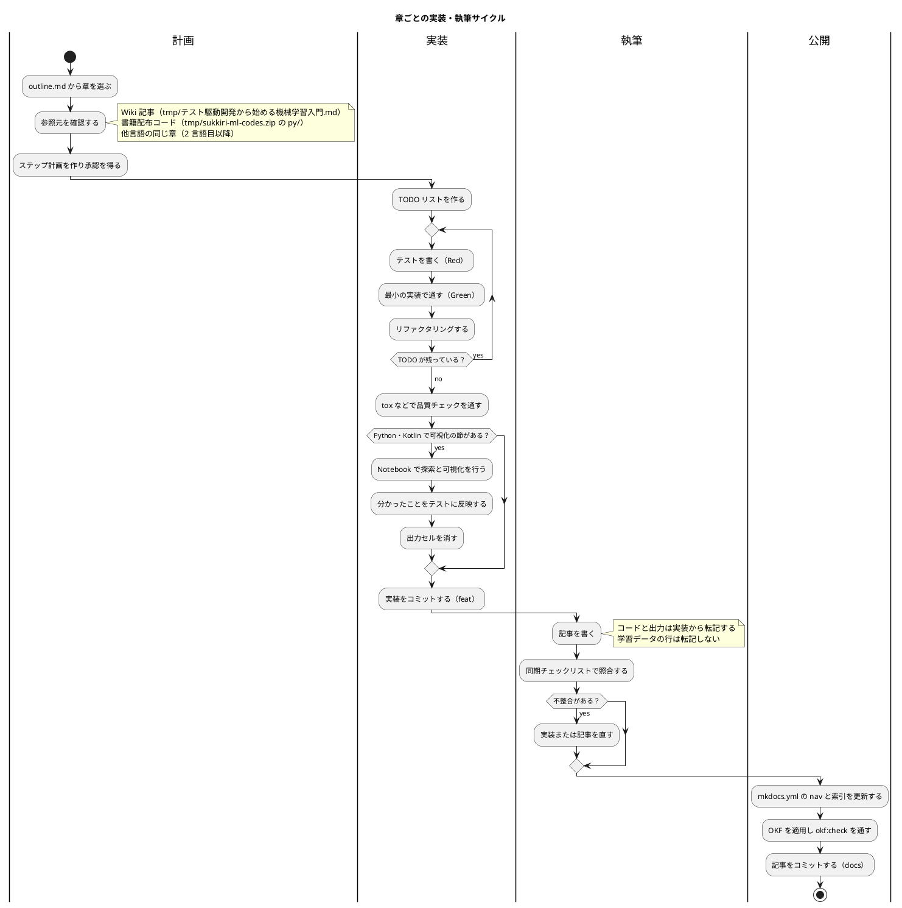

# 執筆ワークフロー

## 概要

本シリーズは [執筆計画アウトライン](outline.md) に定義した構成に従い、章ごとに **実装 → 執筆** の順で進める。記事に載せるコードと出力は、`apps/{env}/` で動作を確認した実装と実行結果から転記する。

## ワークフロー図



## 執筆ルール

### 1. 章の選択

- `outline.md` の Bolt 計画の順に進める
- 1 言語目（Python）で章の節構成を確定し、2 言語目以降は同じ節構成に合わせる
- 言語ごとの焦点は `outline.md` の章別執筆計画に従う

### 2. 参照元

| 部 | Wiki 記事 | 書籍配布コード |
|----|-----------|---------------|
| 第 1 部: 機械学習と TDD の基本サイクル | 1 章・3 章・4 章 | `py/chap04.py`・`py/chap05.py` |
| 第 2 部: 開発環境と自動化 | 2 章 | — |
| 第 3 部: 回帰と実践的な前処理 | 5 章・6 章・7 章 | `py/chap06.py`〜`py/chap08.py`・`py/chap10.py` |
| 第 4 部: モデルの改善と評価 | — | `py/chap11.py`〜`py/chap13.py` |
| 第 5 部: 教師なし学習と実運用 | 8 章 | `py/chap14.py`・`py/chap15.py` |

参照元の数値（件数・正解率・係数など）は記事に転記しない。書籍配布コードは分析手順の参照にとどめ、記事にもサンプルコードにも転記しない。

### 3. 学習データの扱い

- 学習データは `apps/data/sukkiri-ml/` に置き、コミットしない（`npx gulp data:setup` で配置）
- 単体テストのフィクスチャは架空の値で自作する。配布データの行をコピーしない
- 実データを使うテストは、データが無ければスキップする
- 記事では列名とデータの形（型・欠損の有無・件数）だけを説明し、配布データの行を転記しない

### 4. 執筆フォーマット

```markdown
# 第 N 章: 章タイトル

## N.1 はじめに

## N.2 〜（節）

### Red: 〜

\```python
# テストコード
\```

\```text
実行結果（実際の出力から転記）
\```

### Green: 〜

<details>
<summary>この章の完成コード（ファイルパス）</summary>

\```python
# 完成コード
\```

</details>

## N.M まとめ
```

- 読者が実行するコマンドは、プロンプト記号（`$`）を付けずにコピーしてそのまま動く形で書く
- 実行結果は `text` のコードブロックに、実際の出力から必要な行を抜き出して載せる
- TODO リストなどのリストの前には空行を入れる
- テスト駆動開発の用語（TODO リスト・仮実装・三角測量・明白な実装）を初めて使う節では、『テスト駆動開発』の該当箇所を引用する

### 5. 実装同期チェックリスト

- [ ] 記事のコードが `apps/{env}/` の実コードと一致している
- [ ] 記事の実行結果が、実際に実行した出力と一致している
- [ ] 記事の数値（件数・正解率など）が、実データで計測した値と一致している
- [ ] 途中段階のコード（仮実装など）が、実際にその状態で実行した結果と一致している
- [ ] 学習データの行が記事・テストコードに含まれていない
- [ ] 完成コードの折りたたみが最終版になっている
- [ ] 品質チェック（テスト・リンター・フォーマッター・型チェック）が通っている

## MkDocs への反映

章を書いたら次を更新する。

1. `mkdocs.yml` の nav に章を追加する
2. シリーズの [目次](index.md) の章構成表で、その言語の列にリンクを張る
3. 言語別トップ（`{言語}/index.md`）の章構成表で、章にリンクを張り「未執筆」を外す
4. OKF を適用して `npx gulp okf:check` を通す
5. `npx gulp mkdocs:build` でビルドできることを確認する

## 進捗管理

| 言語 | 第 1 部 | 第 2 部 | 第 3 部 | 第 4 部 | 第 5 部 | 付録 | 状況 |
|------|--------|--------|--------|--------|--------|------|------|
| Python | 完了 | 完了 | 完了 | 完了 | 完了 | 完了 | B1〜B6 完了 |
| Kotlin | 完了 | 完了 | 完了 | 完了 | 完了 | —（Python 版の付録 A を案内） | B7〜B12 完了 |
| TypeScript | 未着手 | 未着手 | 未着手 | 未着手 | 未着手 | — | — |
| 多言語統合解説 | — | — | — | — | — | — | 未着手 |
