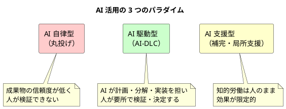
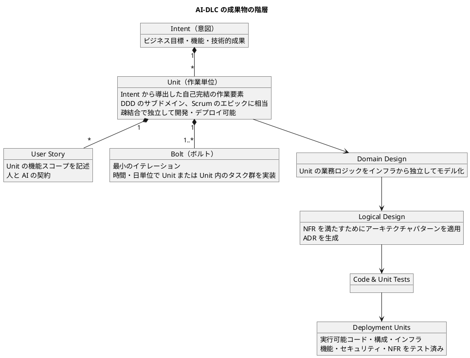
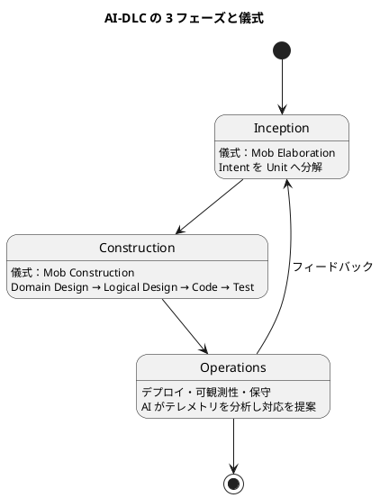
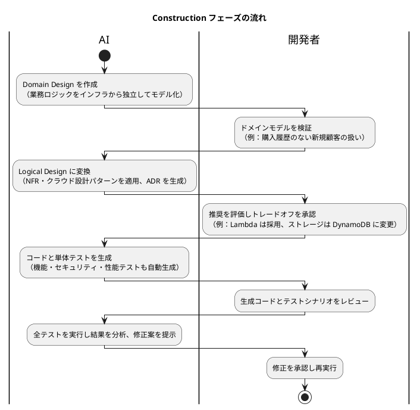
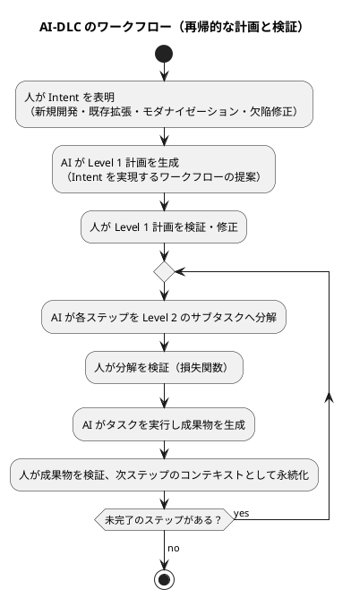
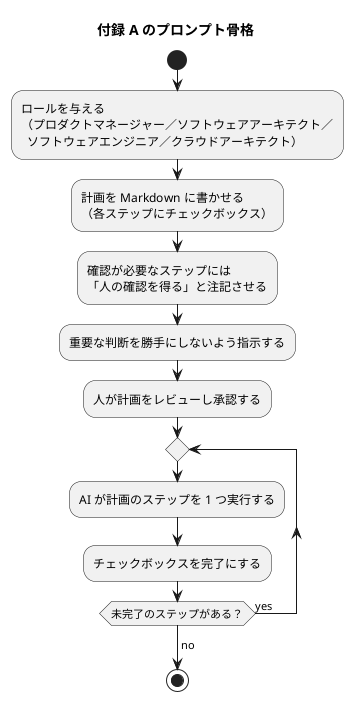
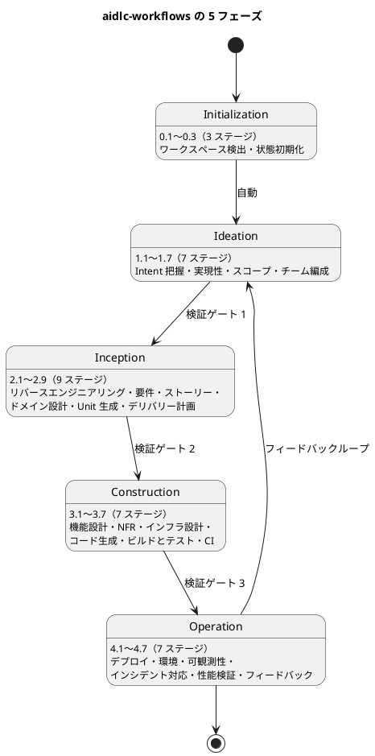
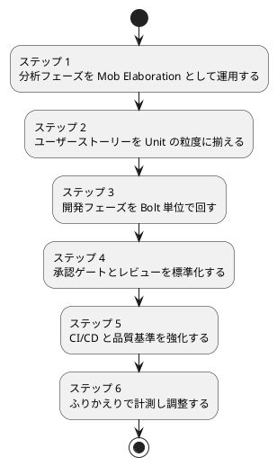

# AI-DLC 導入ガイド

このドキュメントは、AWS が提唱する **AI-DLC（AI-Driven Development Lifecycle）** を日本語で整理し、本プロジェクトの開発ライフサイクル（[開発ガイド](開発ガイド.md)）と Skills 体系に組み込むための手順をまとめたものです。

一次情報は次の 3 つです。本ガイドと一次情報で差異がある場合は一次情報を正とします。

| 情報源 | 位置づけ |
| :--- | :--- |
| AI-DLC Method Definition Paper（Raja SP, AWS） | 方法論の定義。原則・成果物・フェーズ・儀式・実践例・プロンプト |
| AWS DevOps Blog「AI-Driven Development Life Cycle」 | 方法論の公式紹介記事 |
| awslabs/aidlc-workflows | 方法論を Claude Code・Kiro・Codex CLI などで実行する参照実装 |

---

## 1. AI-DLC とは

### 1.1 AI 支援時代から AI 駆動時代へ

ソフトウェア工学の歴史は、低水準で差別化にならない作業を抽象化し、開発者が複雑な問題解決に集中できるようにしてきた歴史です。機械語から高級言語へ、そして API とライブラリの活用へと進み、LLM の登場でコード生成・バグ検出・テスト生成が自然言語で行えるようになりました。論文はこれを **AI 支援（AI-Assisted）時代** と呼びます。AI が細粒度の個別タスクを強化する段階です。

いま AI の適用範囲は、要件の精緻化・計画・タスク分解・設計・開発者とのリアルタイム協働へ広がっています。AI が開発プロセスそのものを組み立てる **AI 駆動（AI-Driven）時代** の始まりです。ところが既存の開発手法は「人間主導の長期プロセス」を前提に設計されており、AI の速度・柔軟性・エージェント的能力と噛み合いません。既存手法に AI を後付けすると、AI の可能性を制限するだけでなく、古い非効率を温存します。

AI-DLC は、AI を **中心的な協働者（central collaborator）** として据え直し、ワークフロー・ロール・イテレーションを AI 前提で再設計した AI ネイティブの方法論です。

### 1.2 位置づけ



AI-DLC は「丸投げ」と「補完」の中間に位置します。AI が計画・分解・生成を担い、人は検証・意思決定・監督に責任を持ちます。

---

## 2. AI-DLC が解決しようとしている課題

### 2.1 従来手法の根本問題

従来の SDLC やアジャイル手法は、月・週単位の長いイテレーションを前提に設計されています。その前提から、デイリースタンドアップやレトロスペクティブといった儀式が生まれました。AI を適切に使うとサイクルは時間・日単位になり、継続的でリアルタイムな検証とフィードバックが必要になります。多くの従来儀式はその文脈では意味を失います。

論文は次のような問いを投げかけます。

- AI が「簡単・普通・難しい」の境界を薄めるなら、ストーリーポイントによる工数見積もりは依然として重要か
- ベロシティという指標は依然として有効か。ビジネス価値に置き換えるべきではないか

最大のボトルネックは **人間同士の認識合わせ** です。準備・会議・持ち帰り・再準備・再会議という往復が、本質的でない活動に時間を奪います。

### 2.2 生産性ギャップの実態

「AI で生産性が 10 倍になる」という期待に対し、計測された結果はより控えめです。

| 調査 | 結果 |
| :--- | :--- |
| ThoughtWorks の調査 | 実測の生産性向上は 10〜15% 程度 |
| METR の実験（開発者 16 名・約 250 件の issue） | 自己申告では約 23% 速くなったと感じたが、実測では約 20% 遅かった |

体感と実測が乖離する原因は、AI を使う「やり方」にあります。AI-DLC はこのギャップを埋めるための **プロセス側の答え** です。

### 2.3 ソフトウェア品質のコスト

論文は、Scrum や Kanban が DDD などの設計技法をスコープ外にして各チームに委ねてきた結果、品質面の「空白地帯」が生まれたと指摘します。米国だけでソフトウェア品質問題のコストは 2022 年に 2.41 兆ドルと推計されています。AI-DLC は設計技法を方法論の中核に組み込むことで、この空白を埋めようとしています。

---

## 3. AI-DLC の 10 の基本原則

論文の第 II 章は、方法論のフェーズ・ロール・成果物・儀式を形づくる 10 の原則を定義しています。導入判断の根拠になるため、すべて押さえておきます。

| # | 原則 | 要点 |
| :--- | :--- | :--- |
| 1 | 後付けではなく再設計する（Reimagine rather than Retrofit） | 既存手法に AI を後付けせず、第一原理から手法を再設計する。「速い馬車ではなく自動車が必要」 |
| 2 | 会話の方向を逆転する（Reverse the Conversation Direction） | 人が AI に頼むのではなく、AI が会話を起点にして駆動する。人は承認者として要所で検証・選択・決定する |
| 3 | 設計技法を中核に統合する（Integration of Design Techniques into the Core） | DDD・BDD・TDD を方法論の中核に置く。論文は DDD フレーバーを扱い、AI が計画とタスク分解の中で設計技法を適用する |
| 4 | AI の能力に合わせる（Align with AI Capability） | 現在の AI は意図をそのまま実行可能コードに翻訳できるほど信頼できない。人が検証・決定・監督の最終責任を持つ |
| 5 | 複雑なシステム構築を対象にする（Cater to Building Complex Systems） | 継続的な機能適応・高い構造的複雑さ・トレードオフ管理を要するシステムが対象。単純なものはローコード／ノーコードに任せる |
| 6 | 人との共生を高めるものは残す（Retain What Enhances Human Symbiosis） | ユーザーストーリー（人と AI の契約）やリスク台帳など、人の検証とリスク低減に不可欠な成果物は残し、リアルタイム利用に最適化する |
| 7 | 馴染みを通じて移行を容易にする（Facilitate Transition through Familiarity） | 実践者が 1 日で使い始められること。既存用語との対応関係を保ちながら新しい用語を導入する（スプリント→ボルト） |
| 8 | 責務を集約して効率化する（Streamline Responsibilities for Efficiency） | AI がタスク分解と判断を担うことで、インフラ・フロント・バックエンド・DevOps・セキュリティの専門分業を越える。プロダクトオーナーと開発者は残す |
| 9 | ステージを最小化しフローを最大化する（Minimise Stages, Maximise Flow） | 引き継ぎと遷移を最小化する。ただし人の検証ポイントは「損失関数」として残し、下流の無駄を早期に刈り取る |
| 10 | 固定的なワークフローを持たない（No Hard-wired, Opinionated SDLC Workflows） | 新規開発・リファクタリング・欠陥修正などの経路ごとにワークフローを固定せず、AI が意図に応じた Level 1 計画を提案し、人が検証する |

### 3.1 Google Maps のアナロジー

原則 2 を説明するために論文が挙げるのが Google Maps です。人は目的地（意図）を設定し、システムが道順（タスク分解と推奨）を示します。人は道中で監督し、必要に応じて経路を修正します。AI-DLC における人と AI の関係はこれと同じです。

### 3.2 損失関数としての人間の検証

原則 9 と第 III 章のワークフローに共通する考え方が、人間の検証を **損失関数（loss function）** に見立てることです。各ステップで人が検証することで、誤りが下流で雪だるま式に膨らむ前に捕捉・修正します。AI が生成したコードが「即席セメント（quick-cement）」のように硬直化せず、将来のイテレーションでも適応可能な状態を保つための仕組みです。

---

## 4. コアフレームワーク：成果物

論文の第 III 章は、AI-DLC の成果物・フェーズ・ワークフローを定義しています。まず成果物です。



| 成果物 | 定義 | 誰が作り、誰が検証するか |
| :--- | :--- | :--- |
| Intent（意図） | 達成したいことを表す高水準の目的宣言。ビジネス目標・機能・技術的成果（例：性能スケーリング）のいずれでもよい。AI によるタスク分解の起点 | 人（プロダクトオーナー）が表明する |
| Unit（作業単位） | Intent から導出された、測定可能な価値を提供する自己完結の作業要素。DDD のサブドメインや Scrum のエピックに相当し、ユーザーストーリーの集合を含む。互いに疎結合で、独立した開発とデプロイを可能にする | AI が分解し、開発者とプロダクトオーナーが検証・調整する |
| Bolt（ボルト） | AI-DLC における最小のイテレーション。Unit またはその中のタスク群を高速に実装する。Scrum のスプリントに相当するが、週ではなく時間・日単位。1 つの Unit は複数の Bolt で、並列にも逐次にも実行できる | AI が計画し、開発者とプロダクトオーナーが検証する |
| Domain Design | Unit の中核業務ロジックを、インフラから独立してモデル化したもの。集約・値オブジェクト・エンティティ・ドメインイベント・リポジトリ・ファクトリなど DDD の戦略的・戦術的要素を含む | AI が作成し、開発者が検証する |
| Logical Design | Domain Design を非機能要件に合わせて拡張したもの。CQRS やサーキットブレーカーなどのアーキテクチャパターンを選択し、ADR を生成する | AI が作成し、開発者が ADR を検証する |
| Code & Unit Tests | Logical Design から生成されるコードと単体テスト。AI が単体テストを実行し、結果を分析して修正案を提示する | AI が生成し、開発者がレビューする |
| Deployment Units | パッケージ化された実行可能コード（コンテナイメージ・サーバーレス関数）、構成（Helm チャート）、インフラ（Terraform・CloudFormation）。機能・セキュリティ・NFR・運用リスクについてテスト済み | AI がテストを生成・実行し、人がテストシナリオを検証・調整する |

成果物はすべて永続化され、AI がライフサイクル全体で参照する **コンテキストメモリ** になります。また成果物同士はリンクされ、前方・後方のトレーサビリティ（例：ドメインモデルの要素から特定のユーザーストーリーへ）を保ちます。

### 4.1 用語の対応表

原則 7 に従い、AI-DLC は既存用語との関係を保ちながら新しい用語を導入しています。

| 従来の用語 | AI-DLC の用語 | 変わる点 |
| :--- | :--- | :--- |
| スプリント | Bolt（ボルト） | 4〜6 週間から時間・日単位へ。継続的なサイクル |
| エピック／サブドメイン | Unit（作業単位） | AI が分解し、疎結合・高凝集で並列実行を前提にする |
| バックログリファインメント | Mob Elaboration（モブエラボレーション） | AI が初期案を出し、モブ全員でその場で精緻化する |
| ペア／モブプログラミング | Mob Construction（モブコンストラクション） | AI が選択肢を提示し、チームがその場で技術判断する |
| ストーリーポイント・ベロシティ | （再考の対象） | AI が難易度の境界を薄めるため、ビジネス価値への置き換えを示唆 |

---

## 5. フェーズと儀式

### 5.1 3 フェーズの全体像



### 5.2 Inception（開始）フェーズ

Intent を捉え、開発可能な Unit に変換するフェーズです。儀式は **Mob Elaboration** で、ファシリテーターの進行のもと、共有画面のある 1 つの部屋で行います。

AI は Intent を User Story・受入条件・Unit に分解する初期案を提示します。このとき、ドメイン知識に加えて、下流での並列実行を可能にする疎結合・高凝集の原則を適用します。プロダクトオーナー・開発者・QA などの関係者（モブ）は、過剰設計や設計不足の部分を調整し、現実の制約に合わせて精緻化します。

Inception フェーズの成果物は、明確に定義された Unit と次の構成要素です。

| # | 成果物 | 内容 |
| :--- | :--- | :--- |
| a | PRFAQ | プレスリリースと FAQ の形式で、ビジネス意図・機能・期待効果を要約（任意） |
| b | User Stories | Unit の機能スコープ。人と AI の契約 |
| c | NFR 定義 | 非機能要件 |
| d | リスク記述 | 組織のリスク台帳と対応づけたリスク |
| e | 測定基準 | ビジネス意図にトレースできる測定基準 |
| f | 推奨 Bolt | Unit を構築するための Bolt の提案 |

Mob Elaboration は、数週間から数か月かかっていた逐次作業を数時間に圧縮しつつ、モブ内およびモブと AI の間に深い共通理解を作ります。

### 5.3 Construction（構築）フェーズ

Inception で定義した Unit を、テスト済みで運用可能な Deployment Unit に変換するフェーズです。儀式は **Mob Construction** で、Mob Elaboration と同様にチームが同じ部屋に集まり、ドメインモデル段階の統合仕様を交換し、意思決定して Bolt を届けます。



各ステップで AI がタスクを推奨し、設計パターン・UX・テストなどの選択肢を提示します。開発者は各ステップの出力を検証し、重要な判断を下します。

### 5.4 Operations（運用）フェーズ

デプロイ・可観測性・保守を担うフェーズです。AI はメトリクス・ログ・トレースなどのテレメトリを分析してパターン検出・異常検知・SLA 違反の予測を行い、事前定義されたインシデントランブックと連携して、リソースのスケーリング・性能チューニング・障害分離などの対応を提案します。開発者が承認すると AI が対応を実行します。開発者は、AI の洞察と提案が SLA とコンプライアンス要件に合致することを検証する役割を担います。

### 5.5 ワークフロー：Level 1 計画から再帰的分解へ

原則 10 のとおり、AI-DLC は経路ごとのワークフローを固定しません。



1. ビジネス意図を受け、AI が **Level 1 計画** を生成します。
2. 人が計画を透明にレビューし、ビジネス目標と工学的制約に合わせて修正します。
3. Level 1 の各ステップを AI が **Level 2** の実行可能なサブタスクへ分解し、人が再び検証します。
4. 各ステップの成果物は人の監督によって意味的に豊かなコンテキストへ育ち、次のステップの入力になります。

---

## 6. AI-DLC の実践例

論文の第 IV 章と第 V 章は、具体的なシナリオで各フェーズの相互作用を示しています。

### 6.1 グリーンフィールド開発

プロダクトオーナーが「クロスセル向けのレコメンデーションエンジンを開発する」という Intent を表明するシナリオです。

#### Inception（Mob Elaboration）

1. AI が明確化のための質問をする（「主要なユーザーは誰か」「達成すべきビジネス成果は何か」）
2. AI が明確化された意図を User Story・NFR・リスク記述に展開し、チームが検証・修正する
3. AI が凝集度の高いストーリーを Unit にまとめる（例：「ユーザーデータ収集」「レコメンデーションアルゴリズム選択」「API 統合」）
4. プロダクトオーナーが Unit を検証する。例：「ユーザーデータ収集」にプライバシー要件が欠けていることに気づき、GDPR の考慮を追加する
5. AI が PRFAQ を生成する（任意）
6. 開発者とプロダクトオーナーが PRFAQ とリスクを検証する

#### Construction（Mob Construction）

1. 開発者が AI とのセッションを開始し、AI が担当 Unit から着手するよう促す
2. AI が DDD で業務ロジックをモデル化する（例：Product・Customer・Purchase History のエンティティと関係）
3. 開発者がドメインモデルを検証する（例：購入履歴のない新規顧客をどう扱うか）
4. AI が Logical Design に変換し、NFR を適用する（例：イベント駆動設計、AWS Lambda）
5. 開発者が推奨を評価しトレードオフを承認する（例：Lambda は採用、ストレージは DynamoDB に変更）
6. AI が Unit ごとに実行コードを生成し、機能・セキュリティ・性能テストも自動生成する
7. 開発者がコードとテストをレビューする
8. AI が全テストを実行・分析し、修正案を提示する。開発者が承認して再実行する

#### Operations

1. AI が Deployment Unit にパッケージ化し、開発者がデプロイ構成を承認してステージング・本番へ展開する
2. AI がメトリクス・ログ・トレースを分析する（例：ピーク時のレイテンシ急増を検知しスケーリングを提案）
3. AI がプレイブックと連携して対応を提案する（例：DynamoDB のスループット増加、API Gateway のトラフィック再配分）
4. 開発者が提案を検証・承認し、解決を監視する

### 6.2 ブラウンフィールド開発

既存システムへの機能追加・NFR 最適化・技術的負債の返済（リファクタリング・欠陥修正）を扱うシナリオです。Inception と Operations はグリーンフィールドと同じで、Construction に **前処理** が加わります。

1. AI が既存コードを高水準のモデル表現に **昇格（elevate）** させる。静的モデル（コンポーネント・責務・関係）と動的モデル（主要ユースケースを実現するコンポーネント間の相互作用）の 2 種類
2. 開発者がプロダクトマネージャーと協力して、AI がリバースエンジニアリングしたモデルをレビュー・検証・修正する
3. 以降はグリーンフィールドと同じ流れで進む

既存コードをそのまま渡すのではなく、意味的に豊かなモデルへ昇格させてから渡すことで、AI に渡すコンテキストを簡潔かつ正確に保ちます。

---

## 7. プロンプトパターン

論文の付録 A は、AI-DLC を実践するためのプロンプト例を示しています。個々の文面よりも、すべてのプロンプトに共通する **構造** が重要です。

### 7.1 セットアップ

最初に、成果物の置き場所と作業の進め方を AI に宣言します。

- すべてのドキュメントは `aidlc-docs/` 配下に置く
- 計画は `aidlc-docs/plans/`、要件は `aidlc-docs/requirements/`、ユーザーストーリーは `aidlc-docs/story-artifacts/`、設計は `aidlc-docs/design-artifacts/` に置く
- 使ったプロンプトは順番に `aidlc-docs/prompts.md` に記録する
- AI は計画を Markdown で作成し、人が承認するまで作業しない

### 7.2 計画・承認・実行のパターン

Inception の User Story 作成、Unit 分割、Construction のコンポーネントモデル作成、コード生成、アーキテクチャ、IaC 構築のどのプロンプトも、次の同じ骨格を持っています。



| 要素 | 指示の内容 |
| :--- | :--- |
| ロール | 「あなたは経験豊富な○○です」とフェーズに応じた専門家ロールを与える |
| 計画ファースト | 作業前に手順をチェックボックス付きの Markdown 計画として書かせる |
| 確認ポイントの明示 | 人の判断が必要なステップには、その旨を計画内に注記させる |
| 判断の留保 | 「重要な判断を勝手にしない」と明示する |
| 承認ゲート | 計画を提示して人のレビューと承認を求める。承認後にのみ実行する |
| 1 ステップずつ | 承認した計画をそのまま 1 ステップずつ実行し、完了ごとにチェックボックスを更新する |
| 参照の明示 | 入力となる成果物（ストーリーファイル・コンポーネントモデル・既存コード）をパスで指定する |

このパターンは、原則 2（会話の方向の逆転）と原則 9（損失関数としての人間の検証）をプロンプトの形に落としたものです。

---

## 8. メリット

| 観点 | 効果 |
| :--- | :--- |
| 開発速度 | 数週間かかっていた作業が数時間〜数日に短縮される。Mob Elaboration は数か月の逐次作業を数時間に圧縮する |
| 品質 | 継続的なすり合わせと各ステップの人間の検証により、意図と成果物のずれが早期に是正される |
| イノベーション | ルーティン作業から解放され、創造的な探求に時間を使える |
| 市場対応力 | フィードバックへの対応サイクルが短くなる |
| 開発者体験 | 認知負荷が下がり、本質的な判断に集中できる |
| 並列性 | 疎結合な Unit により、複数チーム・複数 Bolt の並列実行が可能になる |

---

## 9. 実践のベストプラクティス

### 9.1 タスク分解

- **スコープを狭く限定する** — 「EC サイトを構築する」ではなく「注文 API の SQL インジェクション対策を確認する」のように、1 回のやり取りで完結する粒度にします。
- **セマンティクス密度を高める** — 曖昧な言葉を避け、ドメイン用語と制約を明示します。
- **コードの意味的コンテキストを渡す** — 関連するモジュール・型・既存実装を参照として渡します。

### 9.2 コンテキストウィンドウ管理

- 投入する情報量を絞り、本当に必要なファイルだけを渡します。
- 話題が変わったら過去のやり取りをリセットします。
- 使っていない MCP サーバーは無効化し、ツール定義でコンテキストを浪費しないようにします。

### 9.3 既存コードベースへの適用

- まずコードベースの **セマンティックコンテキスト**（静的モデルと動的モデル）を AI に構築させます（第 6.2 節）。
- 新規実装では「既存の ○○ と同じ方式で」と **既存実装をリファレンスとして指示** します。

### 9.4 開発環境と CI/CD

- 実装が速くなるほど **デプロイがボトルネック** になることを認識します。
- dev／integration／pre-prod の環境を整備し、いつでも検証できる状態を保ちます。
- 節約できた時間は QA と CI/CD の強化に再投資します。

### 9.5 チーム運営

- 会議で分断されない **連続した集中時間** を確保します。Mob Elaboration や Mob Construction は「同じ部屋・共有画面」で集中して行います。
- **シングルピザチーム** を基本単位にします。目安はフルスタック開発者 1 名・ビジネス担当 1 名・スペシャリスト 1 名です。原則 8 のとおり、AI が専門分業の壁を越えることを前提にします。
- 採用する言語・フレームワークは LLM の訓練データとの相性も考慮します。

### 9.6 AI との向き合い方

- **AI はインターンとして扱う** — 優秀だが、成果物は必ずチェックします。
- **コードは全行理解する** — AI が書いたコードでも、理解せずにマージしません。
- **品質基準を引き上げる** — 生成コストが下がった分、テスト・ドキュメント・レビューの水準を上げます。

---

## 10. 実務適用に向けた課題と採用戦略

### 10.1 課題

| 課題 | 内容 | 対策の方向性 |
| :--- | :--- | :--- |
| セキュリティ・コンプライアンス | コードや機密情報を AI に渡すことへの制約 | 利用可能なモデル・データ範囲を組織ポリシーとして定義する。リスク台帳を成果物に組み込む（原則 6） |
| 既存制度との整合 | 見積・工数管理・承認プロセスが従来 SDLC 前提 | Bolt 単位の計画と報告を既存制度に翻訳する。ベロシティからビジネス価値への指標転換を検討する |
| コードレビュー体制 | 生成量の増加にレビュアーの知識と時間が追いつかない | レビュー観点の標準化と AI によるレビュー支援を組み合わせる。人の検証を損失関数として要所に集中させる |

### 10.2 論文が示す 2 つの採用戦略

AI-DLC は既存のアジャイル手法から大きく逸脱しないよう設計されていますが、論文は次の 2 つの採用アプローチを推奨しています。

| アプローチ | 内容 |
| :--- | :--- |
| 実践による学習（Learning by Practicing） | AI-DLC は Mob Elaboration・Mob Construction といった **儀式の集合** であり、グループで実践できる。ドキュメントや座学ではなく、現実の課題を題材に儀式を実践して身につける。AWS はこれを「AI-DLC Unicorn Gym」というフィールドオファリングとして提供している |
| 開発者体験ツールへの組み込み | SDLC 横断のオーケストレーションツールに AI-DLC を組み込み、開発者が意識せずに実践できるようにする。参照実装 aidlc-workflows はこの方向の公式実装 |

---

## 11. 参照実装：awslabs/aidlc-workflows

AWS は方法論を実行可能にした参照実装を公開しています。論文の 3 フェーズを **5 フェーズ 33 ステージ** に具体化し、Claude Code・Kiro CLI・Codex CLI・Cursor・opencode・GitHub Copilot の各ハーネスで同一の方法論を実行できます。導入方針を決める際の具体例として、主要な設計を押さえておきます。

### 11.1 方法論の原則（実装版）

参照実装は論文の原則を、エージェントが従う 7 つの運用原則に落とし込んでいます。

| # | 原則 | 内容 |
| :--- | :--- | :--- |
| 1 | ユーザーが決め、AI が実行する | 重要な判断はすべて承認ゲートを通り、人がレビュー・修正・上書きする |
| 2 | 適応的な深さ | 単純なプロジェクトは重いステージを飛ばし、複雑なプロジェクトは完全にカバーする |
| 3 | トレース可能な成果物 | 各ステージがバージョン管理された Markdown を生成し、完全な意思決定記録を作る |
| 4 | 複数ロールの専門性 | 各ステージをドメイン専門家のエージェントペルソナが導く |
| 5 | 創発的な振る舞いを持たない | エージェントは規定のプロトコルに従う。承認メニュー・完了メッセージ・状態遷移は標準化される |
| 6 | 仮定より質問 | 迷ったら聞く。不完全な回答は貧弱な設計につながる |
| 7 | 矛盾の検出 | すべての回答をスコープ・リスク・技術の観点でクロスチェックする |

### 11.2 5 フェーズ 33 ステージ



| フェーズ | ステージ | 主な成果物 |
| :--- | :--- | :--- |
| 0. Initialization | 0.1 Workspace Scaffold、0.2 Workspace Detection、0.3 State Initialization | 状態ファイル、監査ログ |
| 1. Ideation | 1.1 Intent Capture & Framing、1.2 Market Research、1.3 Feasibility & Constraints、1.4 Scope Definition、1.5 Team Formation、1.6 Rough Mockups、1.7 Approval & Handoff | Intent 文書、ステークホルダーマップ、実現性評価、RAID ログ、スコープ定義、モブ編成計画、ワイヤーフレーム、イニシアチブ概要 |
| 2. Inception | 2.1 Reverse Engineering（ブラウンフィールドのみ）、2.2 Practices Discovery、2.3 Requirements Analysis、2.4 User Stories、2.5 Refined Mockups、2.6 Domain Design、2.7 Units Generation、2.8 Contract Design、2.9 Delivery Planning | 要件、ストーリー、ペルソナ、コンポーネントと ADR、Unit 定義と依存 DAG、契約サマリー、Bolt 計画 |
| 3. Construction | 3.1 Functional Design、3.2 NFR Requirements、3.3 NFR Design、3.4 Infrastructure Design、3.5 Code Generation、3.6 Build and Test、3.7 CI Pipeline | エンティティ・ルール・機能仕様、NFR 仕様、IaC 設計、アプリケーションコード、テスト結果、CI 設定 |
| 4. Operation | 4.1 Deployment Pipeline、4.2 Environment Provisioning、4.3 Deployment Execution、4.4 Observability Setup、4.5 Incident Response、4.6 Performance Validation、4.7 Feedback & Optimization | CD 設定、ロールバック手順、環境台帳、ダッシュボードと SLO、ランブック、負荷テスト結果、SLO レポートとコスト分析 |

論文との対応は次のとおりです。

- 論文の Inception は、実装では Ideation（イニシアチブの検証）と Inception（要件の精緻化）に分かれています。
- 論文の Domain Design と Logical Design は、実装では Inception の 2.6 Domain Design と Construction の 3.1〜3.4（機能設計・NFR・インフラ設計）に対応します。
- 論文のブラウンフィールドにおける「コードのモデルへの昇格」は、実装では 2.1 Reverse Engineering（開発者エージェントのコードスキャン → アーキテクトエージェントの統合）です。
- 各フェーズ境界の **検証ゲート** は、成果物の存在・トレーサビリティ・孤立した成果物の有無を自動チェックします。

Construction の実行方式には設計上の教訓が記されています。当初は Unit ごと・ステージごとに承認ゲートを置いたため、3 Unit のプロジェクトで 15 回のゲートが必要になり「子守り」と呼ばれました。次に全 Unit をまとめて最後に 1 回レビューする方式にしたところ、15 Unit で 15,000 行のコードが一度に届き検証不能になりました。現在は **ステージ優先（stage-major）** の中間路線で、最初の Construction ステージのゲート（ウォーキングスケルトン）を通過した時点で、残りを自律実行するか各ステージでゲートを置くかを 1 回だけ選びます。

### 11.3 スコープ・深さ・テスト戦略

原則 2「適応的な深さ」を実現するため、参照実装は 3 つの独立した調整軸を持ちます。

| 軸 | 制御対象 | 選択肢 |
| :--- | :--- | :--- |
| スコープ | どのステージを実行するか | enterprise（33）、feature（33）、classic（26）、workshop（26）、mvp（23）、infra（13）、refactor（10）、security-patch（10）、express（10）、bugfix（9）、poc（8） |
| 深さ | 各ステージの成果物の詳細度 | Minimal（1〜2 ページ、要点のみ）、Standard（完全な成果物、簡潔な根拠）、Comprehensive（コンプライアンス相互参照を含む詳細版） |
| テスト戦略 | 生成するテストの量と種類 | Minimal（要件ごとに 1 テスト、5〜15 件）、Standard（コンポーネントごとに 5〜8 件、単体 75%・統合 20%・E2E 5%）、Comprehensive（コンポーネントごとに 10〜15 件、全種類） |

スコープは「fix」「refactor」「poc」などの意図中のキーワードから自動判定されます。キーワードが無い自由記述の場合は **コンポーザーエージェント** が、意図の曖昧さ・コードベースの構造的不確実性・検証の不確実性・リスク・未解決の仮定の 5 要素から「実装エントロピー」を推定し、成果物に必要な最小限のステージ構成を提案します。原則 10「固定的なワークフローを持たない」の実装です。

### 11.4 エージェント構成：小さなモブ、幅広いエージェント

参照実装は 14 のエージェントペルソナを持ちます。数十の狭い専門家ではなく **11 の幅広いドメインエージェント** で構成しているのは、狭い専門家の連鎖はウォーターフォールの引き継ぎを再現してしまうからです。人間の 3〜5 名のモブが要件からデプロイまでを担うのと同じモデルです。

| 種類 | エージェント | 主な担当 |
| :--- | :--- | :--- |
| ドメイン（11） | product（プロダクトマネージャー）、design（UX デザイナー）、delivery（デリバリーマネージャー）、architect（ソリューションアーキテクト）、aws-platform（AWS 基盤）、compliance（コンプライアンス）、devsecops（DevSecOps）、developer（開発者）、quality（QA）、pipeline-deploy（パイプラインとデプロイ）、operations（SRE） | ステージの主担当または支援 |
| レビュアー（2） | product-lead（要件・ストーリー・UX を審査）、architecture-reviewer（設計成果物を審査） | 成果物を作らず、READY／NOT-READY の判定と指摘表を出す。人の最終判断は奪わない |
| コンポーザー（1） | composer | 意図からステージ構成を提案する |

エージェント同士は直接呼び合わず、必ず **コンダクター**（`/aidlc` セッション）が委譲します。ステージごとに通信トポロジーが定義されており、inline（コンダクターがペルソナを演じる）、subagent（ハブ・アンド・スポーク）、pipeline（連鎖）、mob（メッシュ、User Stories ステージがショーケース）の 4 種類があります。

### 11.5 対話モードと承認ゲート

各ステージで入力を集めるとき、3 つの対話モードから選べます。どのモードも最終的には **質問ファイル** に決定を記録し、それが正本になります。

| モード | 向いている場面 |
| :--- | :--- |
| Guide Me | エージェントが構造化された質問で導く。漏れなく進めたいとき |
| Edit File | 質問ファイルを直接編集する。すでに答えが決まっているとき |
| Chat | 自由な対話から決定を抽出する。要件がまだ固まっていないとき |

Initialization を除くすべてのステージは **承認ゲート** で終わります。「承認」か「変更依頼」を選び、変更依頼が 3 回以上続くと「現状のまま受け入れる」という逃げ道が現れて無限ループを防ぎます。承認は、監査ログに人間のターンが記録されていないと受け付けられません。自動化で人が不在の場合は明示的にそのことを宣言する必要があり、承認ゲートは待ち続けます。これが原則 1「ユーザーが決め、AI が実行する」を機械的に担保する仕組みです。

### 11.6 状態・監査・学習ループ

| 仕組み | 内容 |
| :--- | :--- |
| 状態ファイル | Intent ごとに進捗の唯一の正本を持つ。ステージは `[ ]` 未着手、`[-]` 進行中、`[?]` 承認待ち、`[R]` 修正中、`[x]` 完了、`[S]` スキップの 6 状態を遷移する |
| 監査ログ | 追記専用の 98 種類のイベント（ワークフロー・フェーズ・ステージ・ゲート承認／却下・質問回答・成果物作成・レビュー・Bolt など 24 カテゴリ）。状態ファイルが壊れても監査ログから再構築できる |
| ソース束縛レビュー | コード生成のレビュー受領証は、変更したソースファイルの一覧とフィンガープリントに束縛される。レビュー後に未申告の変更があれば完了を拒否する |
| 自己学習ガードレール | 人がエージェントの振る舞いを修正すると、その修正は組織レベルまたはプロジェクトレベルの恒久的なガードレールになり、同じ誤りを繰り返さない |
| 知識の分離 | 方法論の知識は出荷されたエージェント定義に、チームの標準は別ディレクトリに置く。アップグレードで上書きされない |

論文の「成果物はコンテキストメモリであり、前方・後方にトレース可能である」という要件が、状態ファイル・監査ログ・検証ゲートとして実装されています。

---

## 12. 始め方・リソース

| リソース | 概要 |
| :--- | :--- |
| [AI-DLC Method Definition Paper](https://prod.d13rzhkk8cj2z0.amplifyapp.com/) | 方法論の定義。原則・成果物・フェーズ・儀式・実践例・プロンプト付録（PDF 8 ページ） |
| [AI-Driven Development Life Cycle（AWS DevOps Blog）](https://aws.amazon.com/blogs/devops/ai-driven-development-life-cycle/) | AWS 公式ブログ。3 フェーズと用語の紹介。Amazon Q Developer のルール機能や Kiro のカスタムワークフローでの実践を推奨 |
| [AI-Driven Development Lifecycle Workshop](https://catalog.us-east-1.prod.workshops.aws/workshops/e1a0e9ed-f484-4d68-ba0e-357d2e134ad1/en-US) | ハンズオン形式のワークショップ（2〜3 時間） |
| [Introduction to AI-DLC（AWS Skill Builder）](https://explore.skillbuilder.aws/learn/courses/ai-dlc) | 公式学習コース。修了証を取得できる |
| [AWS Builder Center](https://aws.amazon.com/developer/) | 開発者向けコミュニティハブ |
| [awslabs/aidlc-workflows](https://github.com/awslabs/aidlc-workflows) | 参照実装。5 フェーズ 33 ステージ、14 エージェント、11 スコープ、承認ゲートと監査ログ。`docs/guide/` にユーザーガイド、`core/knowledge/` に各エージェントの方法論知識 |

推奨する学習順序は次のとおりです。

1. AWS 公式ブログで全体像を掴む
2. Method Definition Paper で 10 の原則と成果物の定義を読む（本ガイド第 3〜7 章）
3. Skill Builder のコースとワークショップで反復サイクルを体験する
4. aidlc-workflows をインストールし、`poc` または `workshop` スコープで小さな課題を一巡する
5. 自分のプロジェクトの規模に合わせてスコープ・深さ・テスト戦略を調整する

参照実装のインストールと起動は次のとおりです。

```bash
# macOS / Linux
curl -fsSL https://github.com/awslabs/aidlc-workflows/releases/latest/download/install.sh | sh
aidlc config --harness claude

# Claude Code 内で起動
/aidlc Build a REST API for inventory management
/aidlc bugfix Fix the login timeout issue
/aidlc --scope feature --depth standard --test-strategy standard
```

---

## 13. 本プロジェクトへの導入

本プロジェクトは XP（[エクストリームプログラミング](エクストリームプログラミング.md)）に基づく [開発ガイド](開発ガイド.md) と、`.claude/skills/` の Skills 体系をすでに持っています。AI-DLC を別プロセスとして持ち込むのではなく、**既存のライフサイクルを AI-DLC の原則で読み替える** ことで導入します。

### 13.1 XP と AI-DLC の対応

| XP | AI-DLC | 備考 |
| :--- | :--- | :--- |
| 計画ゲーム | Inception（Mob Elaboration） | AI が Intent を Unit とストーリーに分解し、人が優先順位と受入条件を決める |
| イテレーション | Bolt | 時間・日単位の短いサイクル。イテレーション内で複数の Bolt を回す |
| ユーザーストーリー | User Story（Unit の構成要素） | 原則 6 のとおり AI-DLC でもそのまま残る。人と AI の契約 |
| ペアプログラミング | Mob Construction | AI が選択肢を提示し、人が技術判断とレビューを行う |
| テスト駆動開発 | 設計技法の中核統合（原則 3） | 論文は DDD フレーバーを扱うが、TDD フレーバーの存在を明記している。TDD の規律は変えない |
| リファクタリング | ブラウンフィールドの Construction | コードをモデルに昇格させてから変更する |
| 継続的インテグレーション | Construction 3.7 CI Pipeline／Operation | デプロイがボトルネックになる前に CI/CD を整える |
| 小さなリリース | Deployment Unit | Unit 単位で独立してデプロイ可能にする |
| ウォーキングスケルトン | 最初の Bolt | 参照実装でも最初の Construction ゲートをウォーキングスケルトンと呼ぶ |

AI-DLC は「AI が実行し人が監督する」構図と、成果物・儀式・承認ゲートの形を提供します。XP は「何を監督すべきか」の規律（テスト・リファクタリング・シンプルな設計・小さなリリース）を提供します。両者は競合せず補完関係にあります。

### 13.2 参照実装のステージと Skills の対応

参照実装の 33 ステージを本プロジェクトの Skills に対応づけると、現状で何が揃っていて何が不足しているかが見えます。

| 参照実装のフェーズ／ステージ | 本プロジェクトの活動 | 対応するスキル |
| :--- | :--- | :--- |
| 1.1 Intent Capture、1.4 Scope Definition、1.7 Approval & Handoff | 戦略・インセプションデッキ | `analyzing-business-strategy`、`analyzing-business-architecture`、`analyzing-inception-deck` |
| 1.3 Feasibility & Constraints | 技術スタック選定・ADR | `analyzing-tech-stack`、`creating-adr` |
| 1.6 Rough Mockups、2.5 Refined Mockups | UI 設計 | `analyzing-ui-design` |
| 2.1 Reverse Engineering | 既存コードの分析 | `orchestrating-analysis`（既存プロジェクトの場合） |
| 2.3 Requirements Analysis | 要件定義（RDRA 2.0） | `analyzing-requirements` |
| 2.4 User Stories | ユースケース・ユーザーストーリー | `analyzing-usecases` |
| 2.6 Domain Design | ドメインモデル・データモデル設計 | `analyzing-domain-model`、`analyzing-data-model` |
| 2.7 Units Generation、2.9 Delivery Planning | リリース計画・イテレーション計画・開発戦略 | `planning-releases`、`creating-development-strategy`、`opening-iteration` |
| 3.1 Functional Design、3.3 NFR Design | アーキテクチャ設計 | `analyzing-architecture` |
| 3.2 NFR Requirements | 非機能要件 | `analyzing-non-functional` |
| 3.4 Infrastructure Design | インフラ設計・プロビジョニング | `operating-provision` |
| 3.5 Code Generation | TDD による実装 | `developing-backend`、`developing-frontend` |
| 3.6 Build and Test | テスト戦略・品質管理 | `analyzing-test-strategy`、`operating-qt` |
| 3.7 CI Pipeline、4.1 Deployment Pipeline、4.3 Deployment Execution | CI/CD・デプロイ | `operating-cicd`、`operating-deploy` |
| 4.2 Environment Provisioning | 環境構築 | `operating-setup` |
| 4.4〜4.7 Observability〜Feedback | 運用要件・イテレーションクローズ | `analyzing-operation`、`closing-iteration`、`tracking-progress` |
| レビュアーエージェント | マルチパースペクティブレビュー | `analyzing-review`、`developing-review`、`operating-review` |
| 検証ゲート | 計画と設計の整合性検証 | `validating-iteration-plan`、`validating-design` |
| 状態ファイル・監査ログ | OKF による来歴・検証状態の記録 | `apply-okf`、`creating-journal` |

各スキルは「AI が計画を提示し、人が確認し、AI が成果物を生成する」流れになっており、AI-DLC の反復サイクルをそのまま体現しています。

### 13.3 成果物の置き場所の対応

論文の付録 A は `aidlc-docs/` 配下の分類を示しています。本プロジェクトでは [ドキュメント構成ガイド](ドキュメント構成ガイド.md) の `docs/` 構成がすでにその役割を果たします。

| aidlc-docs/ の分類 | 本プロジェクトの配置 |
| :--- | :--- |
| plans/ | `docs/development/`（リリース計画・イテレーション計画） |
| requirements/ | `docs/requirements/` |
| story-artifacts/ | `docs/requirements/`（ユースケース・ユーザーストーリー） |
| design-artifacts/ | `docs/design/`、`docs/adr/` |
| prompts.md | `docs/journal/`（判断と学びの記録） |

### 13.4 導入ステップ

段階的に導入し、各段階で効果を確認してから次に進みます。



#### ステップ 1：分析フェーズを Mob Elaboration として運用する

- `orchestrating-analysis` に従い、インセプションデッキ・要件定義・ユースケースを AI に生成させます。
- チーム全員が同じ画面を見て AI の質問に答え、提案を検証する場を設けます。準備→会議→持ち帰りの往復をやめ、その場で決めます。
- Inception の成果物（ストーリー・NFR・リスク・測定基準・推奨 Bolt）が揃っているかを確認します。
- 生成物は `docs/` 配下に永続化し、[OKF 導入ガイド](OKF導入ガイド_V0.2.md) に従って来歴と検証状態を記録します。

#### ステップ 2：ユーザーストーリーを Unit の粒度に揃える

- `analyzing-usecases` で導出したストーリーを、疎結合・高凝集な Unit にまとめます。Unit は独立して開発・デプロイできる単位です。
- 受入条件・関連する設計ドキュメント・参照すべき既存実装をストーリーに紐づけ、セマンティクス密度を高めます。
- 既存プロジェクトでは、変更前にコードを静的モデルと動的モデルに昇格させてから AI に渡します（第 6.2 節）。

#### ステップ 3：開発フェーズを Bolt 単位で回す

- `orchestrating-development` と `developing-backend`／`developing-frontend` に従い、TDD の Red-Green-Refactor を AI に実行させます。
- 各 Bolt の冒頭で、第 7 章のプロンプトパターン（ロール・計画・確認ポイント・承認・1 ステップずつ）を使って AI に計画を書かせ、承認してから実行させます。
- 人は各 Bolt の終わりに **コードを全行理解し**、テストとレビューで検証します。
- コンテキストは絞り、Bolt が変わるたびに会話をリセットします。

#### ステップ 4：承認ゲートとレビューを標準化する

- 本プロジェクトの実行ルール（新規ファイル作成・構造変更・セキュリティ・本番環境は確認必須）を、AI-DLC における承認ゲートとして明文化します。
- `developing-review` のマルチパースペクティブレビューを、参照実装のレビュアーエージェントと同じ位置（成果物生成後・承認ゲート前）に置きます。レビューは指摘を出すだけで、最終判断は人が行います。
- 変更依頼が繰り返される場合は「現状のまま受け入れて次へ進む」判断も選択肢に含め、完璧を求めて止まらないようにします。

#### ステップ 5：CI/CD と品質基準を強化する

- `operating-cicd` で CI/CD を整備し、生成速度に配置が追いつく状態にします。
- 節約した時間を `operating-qt` によるコード品質管理と、テスト・ドキュメントの水準向上に再投資します。

#### ステップ 6：ふりかえりで計測し調整する

- `closing-iteration` のふりかえりで、体感ではなく **実測**（リードタイム・欠陥数・ビジネス価値）を確認します。第 2.2 節の生産性ギャップを踏まえ、効果が出ていない箇所はタスク分解やコンテキスト管理を見直します。
- 人が AI の振る舞いを修正した内容は、参照実装の自己学習ガードレールにならって `CLAUDE.md`・`PROJECT.md`・各スキルに反映し、同じ誤りを繰り返さないようにします。

### 13.5 導入時の注意点

- **TDD と品質基準を緩めない** — AI-DLC は速度を上げる方法論であり、「よいソフトウェア」の条件（変更を楽に安全にできて役に立つ）を変えるものではありません。原則 4 のとおり、人が検証・決定・監督の最終責任を持ちます。
- **対象を見極める** — 原則 5 のとおり、AI-DLC はトレードオフ管理を要する複雑なシステムが対象です。単純な自動化はローコード／ノーコードや軽量なスコープで十分です。
- **馴染みを活かす** — 原則 7 のとおり、既存の XP 用語との対応（第 13.1 節）を保ち、チームが 1 日で使い始められるようにします。
- **記録を残す** — 判断と学びは `creating-journal`、技術的意思決定は `creating-adr` で記録し、次の Bolt のコンテキストとして再利用します。

---

## 参考文献

- [AI-Driven Development Lifecycle (AI-DLC) Method Definition（Raja SP, AWS）](https://prod.d13rzhkk8cj2z0.amplifyapp.com/)
- [AI-Driven Development Life Cycle - AWS DevOps Blog](https://aws.amazon.com/blogs/devops/ai-driven-development-life-cycle/)
- [awslabs/aidlc-workflows - GitHub](https://github.com/awslabs/aidlc-workflows)
- [AI-DLC（AI-Driven Development Lifecycle）まとめ - Qiita](https://qiita.com/koyakimu/items/67541ef17d7dbab3ad39)
- [開発ガイド](開発ガイド.md)
- [エクストリームプログラミング](エクストリームプログラミング.md)
- [よいソフトウェアとは](よいソフトウェアとは.md)
- [ドキュメント構成ガイド](ドキュメント構成ガイド.md)
- [OKF 導入ガイド（Open Knowledge Format v0.2）](OKF導入ガイド_V0.2.md)
