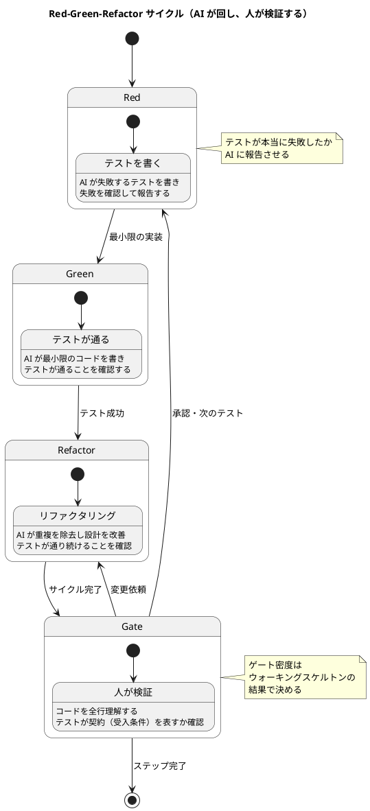
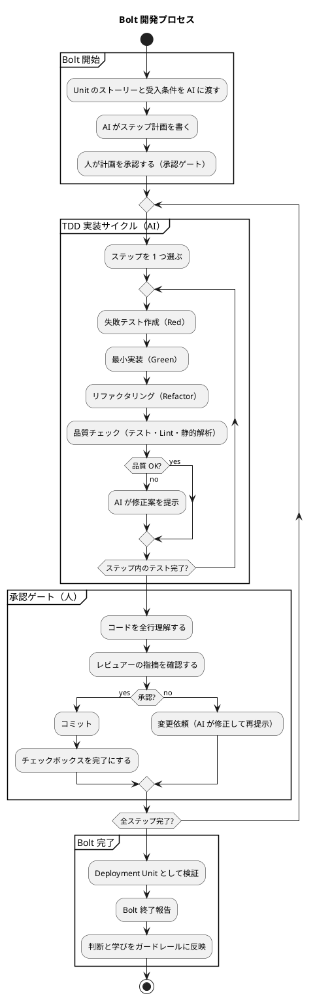
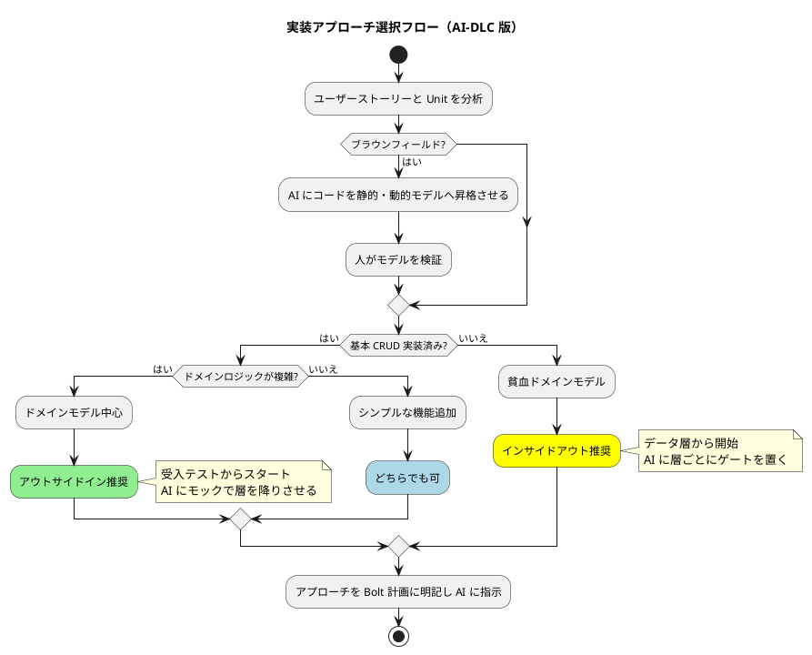
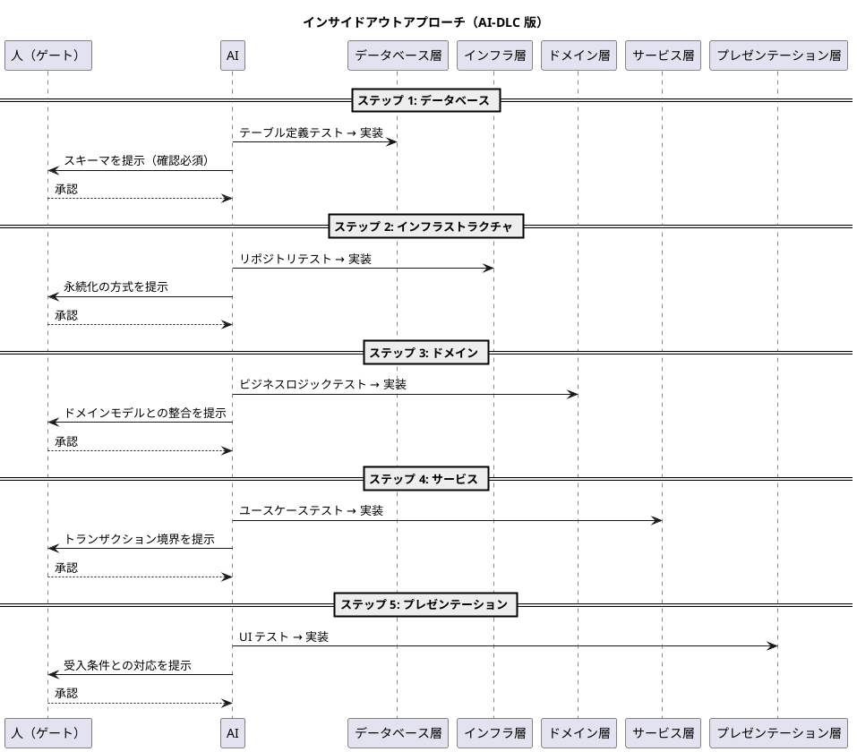
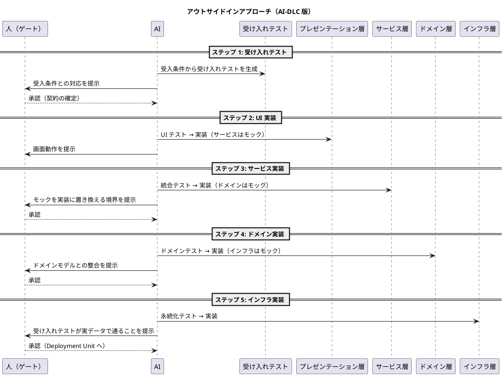
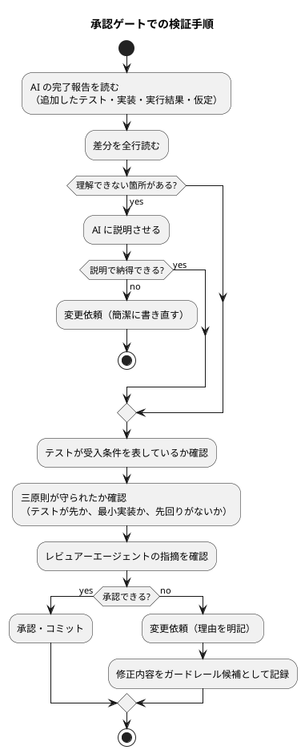
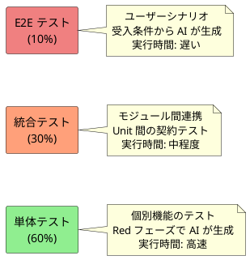
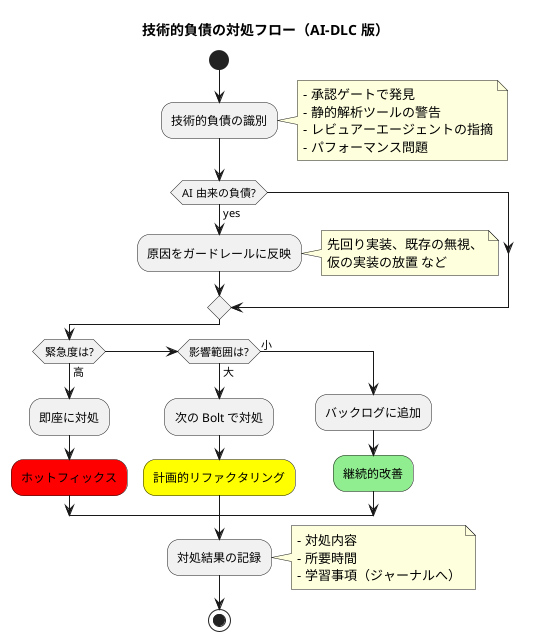

# コーディングとテストガイド（AI-DLC 版）

## 概要

このガイドは、[コーディングとテストガイド](コーディングとテストガイド.md)（XP 版）を AI-DLC の原則で読み替えたものです。AI-DLC の背景と用語は [AI-DLC 導入ガイド](AI-DLC導入ガイド.md) を、Bolt の計画は [リリース・イテレーション計画ガイド（AI-DLC 版）](リリース・イテレーション計画ガイド_AI-DLC版.md) を、実装の契約となるストーリーは [ユースケース作成ガイド（AI-DLC 版）](ユースケース作成ガイド_AI-DLC版.md) を参照してください。

XP 版との最大の違いは、**Red-Green-Refactor を回すのが AI で、各サイクルの成果物を検証するのが人** になることです。AI-DLC の論文は、設計技法を方法論の中核に置くと述べ、DDD・BDD・TDD それぞれのフレーバーがあると明記しています。本ガイドは **TDD フレーバー** の AI-DLC です。TDD の三原則・テストピラミッド・リファクタリングの規律は XP 版から変えません。変わるのは、誰がコードを書き、誰が何を検証するかです。

| 観点 | XP 版 | AI-DLC 版 |
| :--- | :--- | :--- |
| コードを書く | 開発者（ペア） | AI が生成し、開発者が全行を理解して検証する |
| TODO リスト | 開発者が作る | AI がチェックボックス付きのステップ計画として書き、人が承認する |
| Red-Green-Refactor | 開発者が回す | AI が回し、サイクルごと（または Bolt ごと）に人が承認ゲートで検証する |
| 単位 | イテレーション（1〜4 週間） | Bolt（時間〜日） |
| コードレビュー | ペア・プルリクエスト | 承認ゲート。レビュアーエージェントの指摘を材料に人が判断する |
| 品質チェック | コミット前に開発者が実行 | AI が実行し結果を分析、人が確認する |
| コミット | 開発者 | 承認ゲート通過後に人が行う（または人の承認のもとで AI が行う） |
| ふりかえり | イテレーション末 | Bolt 末。判断と学びをガードレールにする |
| 儀式 | ペアプログラミング | Mob Construction（同じ部屋・共有画面で技術判断） |

---

## 基本原則

### TDD の三原則（変えない）

1. **失敗するテストを書くまで、プロダクションコードを書いてはならない**
2. **失敗するテストは、失敗するのに十分なだけ書く**
3. **現在失敗しているテストを成功させる以上のプロダクションコードを書いてはならない**

AI は「一度にたくさん書く」ことが得意なため、放っておくと三原則を破ります。テストを書かずに実装を生成する、失敗を確認せずに次へ進む、テストが要求する以上の機能を先回りして実装する、といった振る舞いです。AI-DLC 版では、三原則を **AI への指示（ガードレール）** として明示し、承認ゲートで守られているかを検証します。

### AI-DLC における追加原則

| 原則 | 内容 |
| :--- | :--- |
| AI が実行し、人が検証する | AI がサイクルを回し、人は各ゲートで成果物を検証・承認する |
| コードは全行理解する | AI が書いたコードでも、理解していないコードはマージしない |
| 検証は損失関数 | 早い段階のゲートで誤りを刈り取る。ウォーキングスケルトンで AI の出力品質を確かめてからゲート密度を決める |
| 品質基準を引き上げる | 生成コストが下がった分、テスト・静的解析・ドキュメントの水準を上げる |
| 修正はガードレールにする | 人が AI の振る舞いを修正した内容は `CLAUDE.md`・`PROJECT.md`・スキルに反映し、同じ修正を繰り返さない |

### Red-Green-Refactor サイクル（AI-DLC 版）



---

## Bolt 開発フロー

### 全体プロセス

XP 版のイテレーション開発フローを Bolt に置き換えます。TODO リストは AI が書くステップ計画、コードレビューは承認ゲート、受け入れは Deployment Unit の検証になります。



### 承認ゲートの密度

Bolt の最初のステップ（ウォーキングスケルトン）のゲートを通過した時点で、残りのステップをどう進めるかを 1 回だけ決めます。

| 選択 | 内容 | 向いている場合 |
| :--- | :--- | :--- |
| 各サイクルでゲート | Red-Green-Refactor ごとに人が検証する | 初めてのコードベース、AI の出力品質が未知、規制対象 |
| 各ステップでゲート | ステップ（複数サイクル）ごとに人が検証する | 通常の Bolt。既定の密度 |
| 自律実行 | 失敗時と Bolt 完了時だけ人が検証する | ウォーキングスケルトンの品質が十分、確認必須の操作を含まない |

自律実行を選んでも、次の場合は必ず停止して人に判断を求めます。

- テストが失敗し、AI の修正案でも通らない
- 新規ファイル作成・スキーマ変更・外部ライブラリ導入・セキュリティ・本番環境に関わる操作
- AI が置いた仮定が未確認
- 計画に無いステップが必要になった

---

## アプローチ戦略

### インサイドアウト vs アウトサイドイン

XP 版の選択フローはそのまま有効です。AI-DLC 版では、選択の結果を **AI に明示的に指示** します。AI は指示がなければ全層を一度に生成しようとするためです。



### インサイドアウトアプローチ

データベース層から順に上位層へ進めます。AI には **層ごとに 1 ステップ** として計画させ、層の境界を承認ゲートにします。



### アウトサイドインアプローチ

受入テストから始めて内側へ進めます。AI にはモックで外側から降りさせ、**モックを実装に置き換えるタイミング** を承認ゲートにします。



### ブラウンフィールドでの前処理

既存コードに手を入れる場合、AI に直接コードを渡すのではなく、まず **静的モデル（コンポーネント・責務・関係）と動的モデル（主要ユースケースの相互作用）に昇格** させ、人が検証してから変更に入ります。変更対象を「既存の ○○ と同じ方式で」と参照させることで、コードベースの規約から外れた生成を防ぎます。

---

## TDD 実装の詳細手順

### 1. ステップ計画（TODO リストの AI-DLC 版）

XP 版の TODO リストは、AI が書く **チェックボックス付きのステップ計画** になります。[AI-DLC 導入ガイド](AI-DLC導入ガイド.md#7-プロンプトパターン) のプロンプト骨格で書かせます。

```markdown
あなたは経験豊富なソフトウェアエンジニアです。
docs/requirements/<project>/stories.md のストーリー「ユーザー登録」と受入条件を参照し、
実装のステップをチェックボックス付きの Markdown 計画として
docs/development/<project>/bolt_<n>_plan.md に書いてください。

規約:
- テスト駆動開発の三原則に従う。テストを書き、失敗を確認してから実装する
- アプローチはインサイドアウト。層ごとに 1 ステップにする
- 各ステップは 1 回のやり取りで完結する粒度にする
- 人の確認が必要なステップ（新規ファイル、スキーマ変更、ライブラリ追加、
  セキュリティ）にはその旨を注記する
- 既存の apps/<project>/src/.../Order.java と同じ規約で書く
- 置いた仮定は計画の末尾に列挙する
計画ができたらレビューと承認を求め、承認後に 1 ステップずつ実行し、
完了したステップのチェックボックスを更新してください。
```

```markdown
## Bolt 3 計画：ユーザー登録（AI が作成、人が承認）

- [ ] 1. User エンティティ
  - [ ] 1.1 必須フィールドの検証（Red → Green → Refactor）
  - [ ] 1.2 メールアドレスの形式検証
  - [ ] 1.3 パスワードの強度チェック ※ハッシュ方式は要確認
- [ ] 2. UserRepository
  - [ ] 2.1 save()  ※テーブル追加（スキーマ変更）のため要確認
  - [ ] 2.2 findByEmail()
  - [ ] 2.3 existsByEmail()
- [ ] 3. UserService
  - [ ] 3.1 register()
  - [ ] 3.2 重複チェック
- [ ] 4. UserController
  - [ ] 4.1 POST /users  ※既存の OrderController と同じ規約
  - [ ] 4.2 バリデーションとエラーハンドリング

### AI の仮定
- パスワードのハッシュには既存の依存関係にある BCrypt を使う（要確認）
- メールアドレスの一意性は DB 制約とアプリ側の両方で担保する（要確認）
```

計画の検証観点は次のとおりです。

| 観点 | 確認内容 |
| :--- | :--- |
| 三原則 | 各ステップがテストから始まる順序になっているか |
| 粒度 | 1 ステップが 1 回のやり取りで完結するか。大きすぎるステップはないか |
| 確認ポイント | 確認必須の操作に注記があるか |
| 参照 | 既存実装・規約・ドメイン用語を参照しているか |
| 仮定 | 列挙された仮定に答えたか。答えていない仮定で AI が進んでいないか |
| スコープ | ストーリーに無い機能を先回りしていないか |

### 2. Red フェーズ（AI が失敗するテストを書く）

AI にテストを書かせ、**実行して失敗したことを報告させます**。「テストを書きました」だけで進ませません。

```java
// UserTest.java（AI が生成）
@Test
void ユーザー作成時に必須フィールドが検証される() {
    // Given
    String email = "test@example.com";
    String password = "SecurePass123!";
    String name = "山田太郎";

    // When
    User user = new User(email, password, name);

    // Then
    assertThat(user.getEmail()).isEqualTo(email);
    assertThat(user.getName()).isEqualTo(name);
    // パスワードはハッシュ化されている
    assertThat(user.getPassword()).isNotEqualTo(password);
}

@Test
void 無効なメールアドレスで例外が発生する() {
    // Given
    String invalidEmail = "invalid-email";

    // When/Then
    assertThrows(IllegalArgumentException.class, () -> {
        new User(invalidEmail, "password", "name");
    });
}
```

```text
AI の報告例:
テストを 2 件追加し実行しました。結果: 2 件失敗（User クラスが存在しないためコンパイルエラー）。
次のステップで最小限の実装に進みます。
```

人の検証観点は次のとおりです。

- テストは **受入条件を表しているか**。実装の都合ではなく振る舞いを検証しているか
- 本当に失敗したか。失敗の理由は想定どおりか
- 1 つのテストが 1 つのことを検証しているか
- テスト名がドメイン用語で振る舞いを説明しているか

### 3. Green フェーズ（AI が最小限の実装を書く）

AI は「先回りして完成形を書く」傾向があります。**現在失敗しているテストを通す以上のコードを書かない** ことを指示し、検証します。

```java
// User.java（AI が生成した最小実装）
public class User {
    private String email;
    private String password;
    private String name;

    public User(String email, String password, String name) {
        if (!isValidEmail(email)) {
            throw new IllegalArgumentException("無効なメールアドレス");
        }
        this.email = email;
        this.password = hashPassword(password);
        this.name = name;
    }

    private boolean isValidEmail(String email) {
        return email != null && email.contains("@");
    }

    private String hashPassword(String password) {
        // 最小実装。ハッシュ方式は Refactor で確定（要確認の仮定）
        return "hashed_" + password;
    }

    // getters...
}
```

人の検証観点は次のとおりです。

- テストが要求する以上の機能（未テストの分岐・将来用のフィールド・汎用化）が入っていないか
- 「仮の実装」に印が付いているか。AI が仮の実装を本実装として扱っていないか
- 全テストが通ったことを AI が報告しているか（新しいテストだけでなく既存テストも）

### 4. Refactor フェーズ（AI が設計を改善する）

AI に重複の除去と設計改善をさせ、**テストが通り続けること** を確認させます。設計判断（値オブジェクトの抽出・ライブラリの採用）は承認ゲートで人が決めます。

```java
// User.java（リファクタリング後。値オブジェクトへの分割は人が承認）
public class User {
    private final Email email;
    private final Password password;
    private final Name name;

    public User(String email, String password, String name) {
        this.email = new Email(email);
        this.password = new Password(password);
        this.name = new Name(name);
    }

    // getters...
}

// Email.java（値オブジェクト）
public class Email {
    private static final Pattern VALID_EMAIL_PATTERN =
        Pattern.compile("^[A-Za-z0-9+_.-]+@[A-Za-z0-9.-]+\\.[A-Za-z]{2,}$");

    private final String value;

    public Email(String value) {
        if (value == null || !VALID_EMAIL_PATTERN.matcher(value).matches()) {
            throw new IllegalArgumentException("無効なメールアドレス: " + value);
        }
        this.value = value;
    }

    public String getValue() {
        return value;
    }
}

// Password.java（値オブジェクト。BCrypt の採用は仮定を確認して承認）
public class Password {
    private static final int MIN_LENGTH = 8;
    private final String hashedValue;

    public Password(String rawPassword) {
        validate(rawPassword);
        this.hashedValue = BCrypt.hashpw(rawPassword, BCrypt.gensalt());
    }

    private void validate(String password) {
        if (password == null || password.length() < MIN_LENGTH) {
            throw new IllegalArgumentException(
                "パスワードは" + MIN_LENGTH + "文字以上必要です"
            );
        }
    }

    public boolean matches(String rawPassword) {
        return BCrypt.checkpw(rawPassword, hashedValue);
    }
}
```

人の検証観点は次のとおりです。

- リファクタリングで振る舞いが変わっていないか（テストが同じまま通っているか）
- ドメインモデル設計（`docs/design/`）と整合しているか。AI が独自のモデルを作っていないか
- 抽出した値オブジェクト・クラスの名前がドメイン用語集と一致しているか
- コードベースの既存規約（パッケージ構成・命名・例外の扱い）に従っているか

### 5. 承認ゲートでの検証

サイクル（またはステップ）が終わったら、人が承認ゲートで検証します。「コードを全行理解する」がここの規律です。



---

## 品質チェックリスト

### 承認ゲート前の必須確認事項

XP 版の「コミット前の必須確認事項」は、AI-DLC 版では **AI が実行し、結果を報告** します。人は報告を確認し、必要に応じて自分でも実行します。

```bash
# AI が実行し、結果を承認ゲートで報告する
# 1. テスト実行
./gradlew test  # または npm test

# 2. コードフォーマット
./gradlew spotlessApply  # または npm run format

# 3. 静的解析
./gradlew check  # または npm run lint

# 4. ビルド確認
./gradlew build  # または npm run build

# 5. カバレッジ確認
./gradlew jacocoTestReport  # または npm run test:coverage
```

AI の報告には、実行したコマンド・結果・失敗があればその分析と修正案を含めさせます。「テストは通っています」という要約だけの報告は受け付けません。

### 品質基準

XP 版の基準はそのまま使い、AI-DLC 版では **引き上げる** 方向で運用します。生成コストが下がった分、基準を緩める理由はなくなります。

| 項目 | 基準 | 必須/推奨 | AI-DLC での補足 |
| :--- | :--- | :--- | :--- |
| テストカバレッジ | 80% 以上 | 必須 | テスト戦略の水準に応じて 90% 以上も検討 |
| 循環的複雑度 | 10 以下 | 必須 | AI は分岐を増やしやすい。超えたら分割を指示 |
| メソッドの行数 | 20 行以下 | 推奨 | |
| クラスの行数 | 200 行以下 | 推奨 | AI は 1 クラスに詰め込みやすい |
| 重複コード | 0% | 必須 | AI は既存コードを探さず似た実装を生成しやすい。既存実装の参照を指示 |
| コンパイラ警告 | 0 個 | 必須 | |
| Linter 警告 | 0 個 | 必須 | |
| 未使用コード | 0 個 | 必須 | AI が先回りで書いた未使用のメソッド・フィールドは削除 |

### AI 生成コードに固有の検証観点

| 観点 | 症状 | 対処 |
| :--- | :--- | :--- |
| 先回り実装 | テストされていない分岐・将来用のオプション引数・汎用化 | 削除。三原則をガードレールに追加 |
| 同型テスト | 実装をなぞるだけで振る舞いを検証しないテスト（実装をコピーした期待値） | 受入条件から期待値を書き直す |
| 過剰なモック | 検証対象までモックにして何も検証していない | モックは境界だけに限定する |
| 既存の無視 | 既存のユーティリティ・値オブジェクト・規約を使わず新規に作る | 既存実装を参照させる。ブラウンフィールドは静的モデルを先に渡す |
| 幻覚 API | 存在しないライブラリのメソッドや設定を使う | ビルド・型チェックで検出。依存関係の追加は確認必須 |
| 例外の握りつぶし | catch して何もしない、汎用例外で包む | エラーハンドリング方針をガードレールにする |
| 秘密情報の混入 | テストデータに本物らしい鍵・個人情報 | AI に渡す範囲を In/Out リストで制限する |

### ソース束縛レビュー

参照実装は、コード生成のレビューを **変更したソースファイルの一覧** に束縛します。レビュー後に未申告の変更があれば完了を拒否します。本プロジェクトでは次で代替します。

- AI に、ステップで作成・変更・削除したファイルの一覧を完了報告に含めさせる
- 人は `git diff --stat` と突き合わせ、報告に無い変更があれば理由を問う
- 承認後に AI が追加の変更をした場合は、再度ゲートを通す

---

## コミット規約

### コミットメッセージフォーマット

XP 版の Conventional Commits 形式はそのまま使います。

```text
<type>(<scope>): <subject>

<body>

<footer>
```

### タイプ一覧

| タイプ | 説明 | 例 |
| :--- | :--- | :--- |
| feat | 新機能追加 | `feat(auth): ユーザー認証機能を追加` |
| fix | バグ修正 | `fix(api): NullPointerException を修正` |
| docs | ドキュメント変更 | `docs(readme): インストール手順を更新` |
| style | コードスタイル変更 | `style: インデントを修正` |
| refactor | リファクタリング | `refactor(user): User クラスを値オブジェクトに分割` |
| test | テスト追加・修正 | `test(user): ユーザー登録のテストを追加` |
| chore | ビルド・ツール変更 | `chore(gradle): 依存関係を更新` |

### コミット単位と AI-DLC の追加規約

- **1 コミット = 1 論理的変更**（XP 版と同じ）
- ステップ計画の項目単位でコミットする
- **承認ゲートを通過してからコミットする**。未承認の生成物はコミットしない
- ビルドが通る状態でコミットする
- AI が生成したコミットには、AI の関与を footer に記す（本プロジェクトでは `Co-Authored-By` 行）
- コミットメッセージの body に、対応するストーリー・ステップ番号と、ゲートで確認した仮定を書く

```text
feat(user): User エンティティに値オブジェクトを導入

Bolt 3 ステップ 1.1〜1.3。受入条件 AC-01, AC-02 に対応。
パスワードのハッシュは既存依存の BCrypt を採用（ゲートで確認済み）。

Co-Authored-By: Claude <noreply@anthropic.com>
```

---

## テストの種類と戦略

### テストピラミッド

XP 版のテストピラミッドはそのまま使います。AI-DLC 版では、**テスト戦略の水準** によって各層の量を調整します。



### テスト戦略の水準

計画で選んだテスト戦略に従って、AI に生成させるテストの量と種類を指示します。

| 水準 | 単体 | 統合 | E2E・性能・セキュリティ | 目安 | 向いている場面 |
| :--- | :--- | :--- | :--- | :--- | :--- |
| Minimal | 受入条件ごとに 1 テスト。全コンポーネントに正常系 1 件 | 欠陥再現に必要な場合のみ | なし | 5〜15 件 | PoC、学習、小さな欠陥修正 |
| Standard | コンポーネントごとに 5〜8 件 | 主要な境界 | NFR が明示する場合のみ | 単体 75%・統合 20%・E2E 5% | 通常の機能開発 |
| Comprehensive | コンポーネントごとに 10〜15 件 | すべての境界 | すべて | 全種類 | 規制対象、監査が必要な機能 |

本番機能のテスト戦略は Standard 未満にしません。

### テスト作成のベストプラクティス

#### 1. AAA パターン（Arrange-Act-Assert）

```java
@Test
void 商品の在庫が減少する() {
    // Arrange（準備）
    Product product = new Product("商品A", 10);
    int orderQuantity = 3;

    // Act（実行）
    product.reduceStock(orderQuantity);

    // Assert（検証）
    assertThat(product.getStock()).isEqualTo(7);
}
```

#### 2. テストの命名規則

```java
// パターン1: 日本語での説明的な名前
@Test
void 在庫が不足している場合は注文できない() { }

// パターン2: Given-When-Then 形式
@Test
void given在庫10個_when15個注文_then在庫不足例外() { }

// パターン3: メソッド名_条件_期待結果
@Test
void reduceStock_在庫不足_IllegalStateException() { }
```

命名規則はプロジェクトで 1 つに決め、ガードレールとして AI に指示します。AI は指示がなければ既存テストの命名をまねますが、混在していると揺れます。

#### 3. テストデータの準備

```java
// テストフィクスチャの使用
public class UserTestFixture {
    public static User createDefaultUser() {
        return new User(
            "test@example.com",
            "password123",
            "テストユーザー"
        );
    }

    public static User createUserWithEmail(String email) {
        return new User(
            email,
            "password123",
            "テストユーザー"
        );
    }
}
```

AI にはフィクスチャの存在を伝え、テストごとにデータ生成コードを重複させないよう指示します。

#### 4. AI 生成テストのレビュー観点

| 観点 | 確認内容 |
| :--- | :--- |
| 受入条件との対応 | 各テストがどの受入条件を検証するか説明できるか |
| 期待値の出所 | 期待値が仕様（受入条件・業務ルール）から来ているか。実装の出力をコピーしていないか |
| 境界値 | 拡張（例外条件）と境界値がテストされているか |
| 独立性 | テスト間に順序依存・共有状態がないか |
| 可読性 | テストを読めば振る舞いが分かるか。AI 特有の冗長なコメントや不要なセットアップがないか |
| モックの範囲 | 境界（外部サービス・DB）だけをモックし、検証対象はモックしていないか |

---

## リファクタリングパターン

### よく使うリファクタリング手法

XP 版の手法はそのまま AI に指示できます。手法名で指示すると精度が上がります。

| パターン | 適用場面 | AI への指示例 |
| :--- | :--- | :--- |
| メソッド抽出 | 長いメソッドの分割 | 「検証ロジックを `validate` メソッドに抽出して」 |
| 変数抽出 | 複雑な式の簡略化 | 「この条件式を意図が分かる名前の変数に抽出して」 |
| クラス抽出 | 責務の分離 | 「メールアドレスを値オブジェクト `Email` として抽出して」 |
| メソッド移動 | 適切なクラスへの配置 | 「この計算は `Order` の責務なので移動して」 |
| 条件記述の分解 | 複雑な条件式の整理 | 「if の条件を業務ルール名のメソッドにして」 |
| ループの分割 | 単一責任の原則適用 | 「集計と通知を別のループに分けて」 |

### リファクタリング実施のタイミング

1. **Rule of Three（3 回ルール）**

     - 1 回目: そのまま実装
     - 2 回目: 重複に気づくが我慢
     - 3 回目: リファクタリング実施
     - AI は重複を検出しやすいが、**既存コードを探さず** 4 回目・5 回目の重複を生むことも多い。承認ゲートで「同じことをするコードが既にないか」を確認する

2. **コードの臭い（Code Smells）を検知したとき**

     - 長すぎるメソッド（20 行以上）
     - 大きすぎるクラス（200 行以上）
     - 長すぎるパラメータリスト（4 個以上）
     - データの群れ（同じ引数の組み合わせ）
     - スイッチ文の重複
     - AI に静的解析の結果を渡し、臭いの一覧と対処案を出させる。適用するかは人が決める

### 設計判断は人が持つ

リファクタリングのうち **設計判断を伴うもの**（集約の境界、値オブジェクトの抽出、アーキテクチャパターンの適用、ライブラリの採用）は、AI が提案し人が承認します。AI の提案には選択肢とトレードオフを含めさせ、判断の結果は ADR に記録します。

---

## 継続的な改善

### Bolt ふりかえりでの確認項目

XP 版のイテレーションふりかえりを Bolt ふりかえりに置き換え、AI-DLC の指標を加えます。

```markdown
## Bolt ふりかえりテンプレート

### Keep（継続すること）
- [ ] TDD サイクルを AI に守らせた
- [ ] 承認ゲートでコードを全行理解した
- [ ] 品質基準を維持した

### Problem（問題点）
- [ ] 変更依頼が多かったステップとその原因
- [ ] AI が三原則を破った場面
- [ ] 人の検証時間がボトルネックになった箇所
- [ ] 技術的負債の発生箇所

### Try（次に試すこと）
- [ ] ガードレールへの追加（CLAUDE.md・PROJECT.md・スキル）
- [ ] ゲート密度の調整
- [ ] プロンプト骨格の改善

### 数値指標
- テストカバレッジ: ___%
- ビルド成功率: ___%
- 承認ゲート通過数: ___ / 変更依頼数: ___（手戻り率 ___）
- リードタイム（ステップ計画承認 → Deployment Unit 検証）: ___ 時間
- 欠陥流出数: ___ 件
- ガードレールに追加した項目: ___ 件
```

### 修正をガードレールにする

人が AI の振る舞いを修正したら、同じ修正を次の Bolt で繰り返さないよう、修正内容をガードレールとして残します。参照実装の「自己学習ガードレール」に相当します。

| 修正の種類 | 反映先 |
| :--- | :--- |
| 全プロジェクト共通の規律（三原則、命名、例外の扱い） | `CLAUDE.md` または `ai-agent-guidelines` スキル |
| このプロジェクト固有の規約（パッケージ構成、既存ユーティリティ、テストフィクスチャ） | 各スキルの `PROJECT.md` |
| 特定のストーリー・Unit に関する判断 | Bolt 計画の「AI の仮定」欄と `docs/journal/` |
| 技術的意思決定 | ADR |

### 技術的負債の管理

AI-DLC の論文は、AI が生成したコードが硬直化して将来の変更を妨げる状態を **quick-cement（即席セメント）** と呼び、人の検証をそれを防ぐ損失関数と位置づけています。生成が速いほど負債も速く積み上がるため、XP 版の対処フローに「AI 由来の負債」の識別を加えます。



---

## 本プロジェクトの開発スキルへの適用

本プロジェクトの開発スキルは XP 版のガイドを前提にしています。AI-DLC 版で運用する場合の読み替えは次のとおりです。

| スキル | XP 版の運用 | AI-DLC 版の読み替え |
| :--- | :--- | :--- |
| `orchestrating-development` | TDD ワークフローの案内 | Bolt 開発フロー（ステップ計画 → サイクル → 承認ゲート → Bolt 完了）として案内。ゲート密度の選択を最初に行う |
| `developing-backend` | インサイドアウトの TDD | AI がステップ計画を書き、層ごとに承認ゲートを置く。三原則をプロンプトに明示 |
| `developing-frontend` | アウトサイドインの TDD | 受入テストの承認を契約の確定とし、モックを実装に置き換える境界をゲートにする |
| `developing-review` | マルチパースペクティブレビュー | 承認ゲートの材料として実行。AI 生成コード固有の観点（先回り・同型テスト・過剰モック・既存の無視）を加える。参照実装の architecture-reviewer に相当 |
| `git-commit` | Conventional Commits | 承認ゲート通過後にのみ実行。body にストーリー・ステップ・確認した仮定を記す |
| `operating-qt` | SonarQube による品質管理 | 品質基準を引き上げる根拠として使う。臭いの一覧を AI に渡して対処案を出させる |
| `creating-adr` | 技術的意思決定の記録 | リファクタリングの設計判断・ライブラリ採用を記録 |
| `closing-iteration` | ふりかえりと報告 | Bolt ふりかえり（本章）と、修正のガードレール反映 |
| `ai-agent-guidelines` | 実行ガイドライン | TDD の三原則・全行理解・仮の実装の明示をガードレールとして追記 |

---

## まとめ

コーディングとテストは、よいソフトウェアを作るための最も基本的で重要な活動です。AI-DLC ではコードを書くのが AI になりますが、TDD を中心とした規律の目的は変わりません。

1. **品質の作り込み** - AI にテストを先に書かせ、失敗を確認させてから実装させる
2. **設計の改善** - リファクタリングは AI に、設計判断は人に
3. **変更容易性** - テストによる安全網。AI が生成したコードほど安全網が要る
4. **ドキュメント性** - テストが受入条件と結びついた仕様書として機能する
5. **人の理解** - コードを全行理解し、理解できないものはマージしない

これらの実践により、AI の速度を活かしながら「変更を楽に安全にできて役に立つソフトウェア」の実現を目指します。
