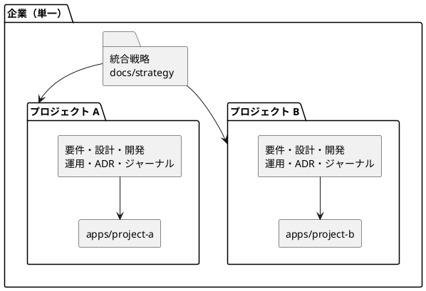

# ドキュメント構成ガイド

`docs/` 配下のディレクトリ構成と、アプリケーション本体（`apps/`）との対応関係を定義します。

## コンセプト：単一企業・統合戦略・複数プロジェクト

本ドキュメントバンドルは、次の 3 つを前提に構成します。

1. **単一企業** — ドキュメントの主体となる企業（事業主体）は 1 つです。
2. **統合戦略** — 企業分析・経営戦略・ビジネスアーキテクチャは企業全体で 1 つに統合し、プロジェクトごとに分割しません。すべてのプロジェクトは同じ戦略を参照します。
3. **複数プロジェクト** — 統合戦略の下で複数のプロジェクト（アプリケーション）が並行して進みます。要件定義以降の成果物はプロジェクト別に管理し、戦略とのトレーサビリティを保ちます。



## 全体構成

```text
docs/
├── index.md              # バンドル全体の入口
├── log.md                # ドキュメント更新ログ
├── strategy/             # 【単一】企業戦略・ビジネスアーキテクチャ
├── requirements/         # 【プロジェクト別】要件定義（RDRA 2.0）
├── design/               # 【プロジェクト別】アーキテクチャ・モデル・品質方針
├── development/          # 【プロジェクト別】リリース計画・イテレーション管理
├── operation/            # 【プロジェクト別】環境構築・デプロイ・運用手順
├── adr/                  # 【プロジェクト別】Architecture Decision Records
├── journal/              # 【プロジェクト別】開発ジャーナル
├── review/               # 【プロジェクト別】分析・開発レビュー結果の記録
├── article/              # 【共通】学習用の記事シリーズ
├── reference/            # 【共通】開発ガイドライン・ベストプラクティス
├── template/             # 【共通】各種ドキュメントのテンプレート
└── assets/               # 【共通】MkDocs 用スタイル・スクリプト
apps/
├── project-a/            # プロジェクト A のアプリケーション本体
└── project-b/            # プロジェクト B のアプリケーション本体
```

## 単一（企業共通）のディレクトリ

### docs/strategy

企業分析、経営戦略、ビジネスアーキテクチャ、インセプションデッキを置きます。企業で 1 つの統合戦略として管理するため、**プロジェクト別のサブディレクトリは作りません**。

- 各プロジェクトの要件定義は、この統合戦略を上流として参照します。
- プロジェクト固有の判断が必要になった場合も、戦略文書自体は分割せず、プロジェクト別カテゴリ（要件定義・ADR）側に記録します。

### docs/reference・docs/template・docs/article・docs/assets

企業・プロジェクトを問わず共有するリソースです。プロジェクト別のサブディレクトリは作りません。

## プロジェクト別のディレクトリ

次の 7 カテゴリは、**プロジェクト単位のサブディレクトリ**で区切ります。

| カテゴリ | 内容 |
| :--- | :--- |
| `docs/requirements/` | 要件定義書、ユースケース、ユーザーストーリー |
| `docs/design/` | アーキテクチャ設計、データモデル、ドメインモデル、UI 設計、テスト戦略、非機能要件 |
| `docs/development/` | リリース計画、イテレーション計画、開発戦略、進捗レポート |
| `docs/operation/` | 環境セットアップ手順書、コマンドリファレンス、デプロイ手順 |
| `docs/adr/` | アーキテクチャ上の意思決定記録 |
| `docs/journal/` | 開発ジャーナル（判断と学びの記録） |
| `docs/review/` | 分析・開発・UI/UX・運用レビュー結果の記録 |

### ディレクトリ構造の規約

```text
docs/<category>/
├── index.md              # カテゴリ索引：プロジェクト一覧へのリンク
├── project-a/
│   ├── index.md          # プロジェクト A のカテゴリ内の入口
│   └── *.md              # 実ドキュメント
└── project-b/
    ├── index.md
    └── *.md
```

- カテゴリ直下の `index.md` は**プロジェクト一覧の索引**とし、実ドキュメントはプロジェクトのサブディレクトリに置きます。
- プロジェクトのサブディレクトリには必ず `index.md` を置き、そのプロジェクトのドキュメント一覧を管理します。

## apps との対応

アプリケーション本体は `apps/` 配下に、**ドキュメントと同じプロジェクト識別子**でディレクトリを区切って配置します。

| ドキュメント | アプリケーション |
| :--- | :--- |
| `docs/requirements/project-a/` | `apps/project-a/` |
| `docs/design/project-a/` | `apps/project-a/` |
| `docs/development/project-a/` | `apps/project-a/` |
| `docs/operation/project-a/` | `apps/project-a/` |
| `docs/adr/project-a/` | `apps/project-a/` |
| `docs/journal/project-a/` | `apps/project-a/` |
| `docs/review/project-a/` | `apps/project-a/` |

プロジェクト識別子が一致していることで、ドキュメントからコードへ（またはその逆へ）迷わず辿れます。

### プロジェクト識別子の命名規約

- 英小文字とハイフンのケバブケース（例：`inventory-service`、`sales-portal`）とします。
- `docs/` 配下のサブディレクトリ名と `apps/` 配下のディレクトリ名は**完全一致**させます。
- 一度決めた識別子は変更しません。やむを得ず変更する場合は `docs/` と `apps/` を同時に改名し、`docs/log.md` に理由を記録します。

## 新しいプロジェクトを追加する手順

1. プロジェクト識別子を決めます（命名規約に従う）。
2. `apps/<project>/` を作成し、アプリケーションの雛形を配置します。
3. プロジェクト別 7 カテゴリに `<project>/index.md` を作成します（最初は空の索引で構いません。`journal/`・`review/` は最初のドキュメント作成時でも可）。
4. 各カテゴリ直下の `index.md` にプロジェクトのエントリを追加します。
5. `apply-okf` スキルでフロントマター付与・`docs/log.md` への記録・適合性検証を行います。

## 補足

- 戦略に対する変更は全プロジェクトに影響します。`docs/strategy` を更新した際は、各プロジェクトの要件定義との整合を確認してください。
- 本ガイドと実際の構成が食い違った場合は、構成を直すか本ガイドを更新し、放置しないでください。
