# ユースケース作成ガイド（AI-DLC 版）

## はじめに

このガイドは、[ユースケース作成ガイド](ユースケース作成ガイド.md)（XP 版）を AI-DLC の原則で読み替えたものです。AI-DLC の背景と用語は [AI-DLC 導入ガイド](AI-DLC導入ガイド.md) を、計画への接続は [リリース・イテレーション計画ガイド（AI-DLC 版）](リリース・イテレーション計画ガイド_AI-DLC版.md) を参照してください。

XP 版との最大の違いは、**ユースケースとユーザーストーリーの初稿を AI が書き、人はそれを検証・修正する** ことです。AI-DLC の論文は、ユーザーストーリーを「人と AI の理解を揃える、明確に定義された契約」と位置づけ、方法論を再設計しても残すべき成果物としています。つまり、ユースケースの書き方の規律は XP 版から変わりません。変わるのは、誰が書き、誰が検証し、何のために使われるかです。

| 観点 | XP 版 | AI-DLC 版 |
| :--- | :--- | :--- |
| 初稿の作成者 | 開発者と顧客 | AI が Intent から提案し、モブが検証する |
| 作成の場 | 要件定義・計画ゲーム | Inception フェーズの Mob Elaboration（同じ部屋・共有画面） |
| ユースケースの役割 | 利害関係者との契約 | 利害関係者との契約であり、**AI に渡す実装の契約** |
| 上位の構造 | ビジネスプロセス | Intent → Unit → ユーザーストーリー |
| 記述の精度 | 人が読んで理解できる | 人が読んで理解でき、AI が一意に解釈できる（セマンティクス密度） |
| 例外条件の洗い出し | 人がブレインストーミング | AI が候補を網羅し、人が取捨選択する |
| テストへの変換 | 人がテストケースを設計 | AI が拡張からテストを生成し、人が受入条件で検証する |
| 検証の焦点 | 記述の品質 | 記述の品質に加えて、AI の過剰設計・設計不足・幻覚の検出 |

---

## ユースケースの基本概念

### ユースケースは人と AI の契約

ユースケースは、システムの振る舞いに関する利害関係者間の契約です。AI-DLC ではこれに **AI との契約** という役割が加わります。AI はユースケースとストーリーを読んでドメインモデル・コード・テストを生成するため、記述の曖昧さはそのまま実装のずれになります。

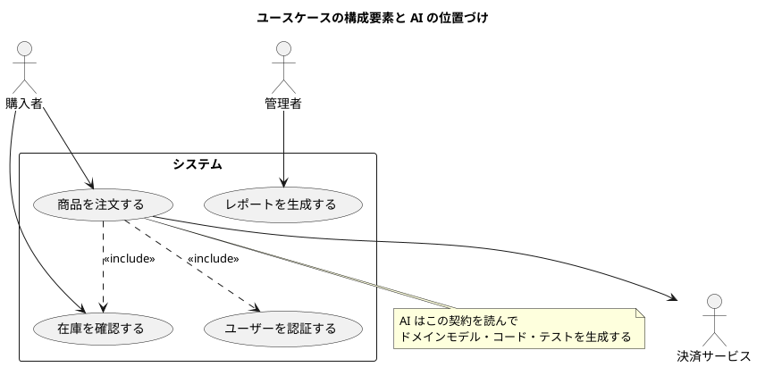

**注意**: AI エージェント自体はアクターではありません。AI は開発プロセスの協働者であり、システムの利用者ではないからです。ただし、システムが LLM を機能として呼び出す場合（例：問い合わせ文の分類）は、その LLM サービスを支援アクターとして扱います。

### AI-DLC の成果物との関係

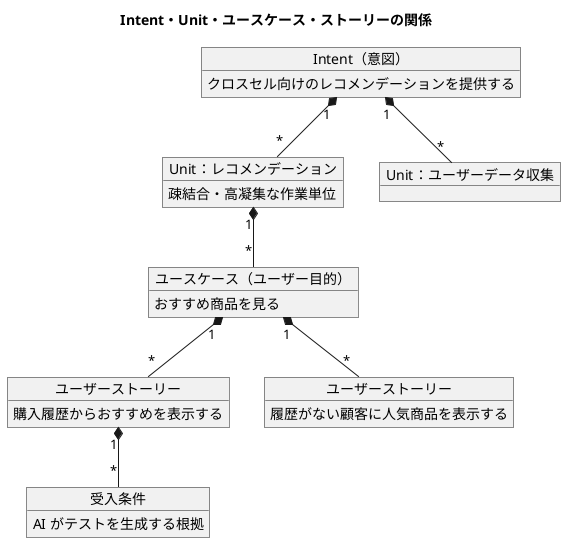

| AI-DLC の成果物 | XP 版の対応 | 誰が作り、誰が検証するか |
| :--- | :--- | :--- |
| Intent | ビジネスプロセス全体（要約レベルの上位） | 人（プロダクトオーナー）が表明する |
| Unit | 要約レベルユースケース、またはユーザー目的の集合 | AI が分解し、モブが検証する |
| ユースケース | ユーザー目的レベル | AI が提案し、モブが検証する |
| ユーザーストーリー | イテレーション単位の要求 | AI が導出し、モブが検証する。人と AI の契約 |
| 受入条件 | 受入テストの基準 | AI が提案し、人が確定する。AI のテスト生成の根拠 |

---

## 1. ユースケースの 3 つのレベルと AI-DLC の対応

### レベルの階層構造

XP 版の 3 レベル（要約・ユーザー目的・サブ機能）は、AI-DLC の成果物と Bolt の粒度に対応します。

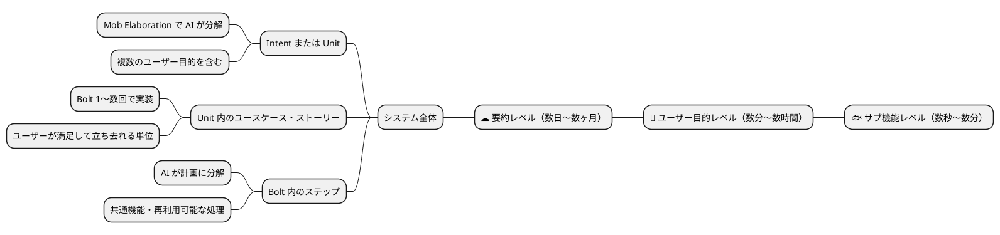

| レベル | AI-DLC での扱い | AI の役割 | 人の役割 |
| :--- | :--- | :--- | :--- |
| ☁️ 要約 | Intent、または Unit の集合 | Intent を Unit に分解する | Unit の独立性と粒度を検証する |
| 🌊 ユーザー目的 | Unit 内のユースケースとストーリー | ユースケース・ストーリー・受入条件を提案する | 契約として妥当かを検証し確定する |
| 🐟 サブ機能 | Bolt のステップ、または include されるユースケース | Bolt 計画でステップに分解する | ステップの順序と確認ポイントを検証する |

### レベル判定の質問

XP 版の判定質問はそのまま使います。AI-DLC ではさらに次を加えます。

#### ユーザー目的レベルの判定

- 主アクターはこれを実行した後で満足して立ち去れるか
- これは 1 回の作業セッションで完了するか
- **AI が 1 つの Unit の中で、数回の Bolt で実装できる大きさか**

#### 要約レベルの判定

- 複数のユーザー目的が含まれているか
- **Unit として切り出したとき、他の Unit と疎結合に保てるか**

#### サブ機能レベルの判定

- これだけでは目的が達成されないか
- **Bolt 計画のステップとして AI に渡せば足りるか（ユースケースとして独立させる必要がないか）**

---

## 2. スコープの定義

### 設計スコープの種類

XP 版の 3 つのスコープ（組織・システム・コンポーネント）はそのまま使います。AI-DLC では、スコープが **AI に渡すコンテキストの範囲** も決めます。

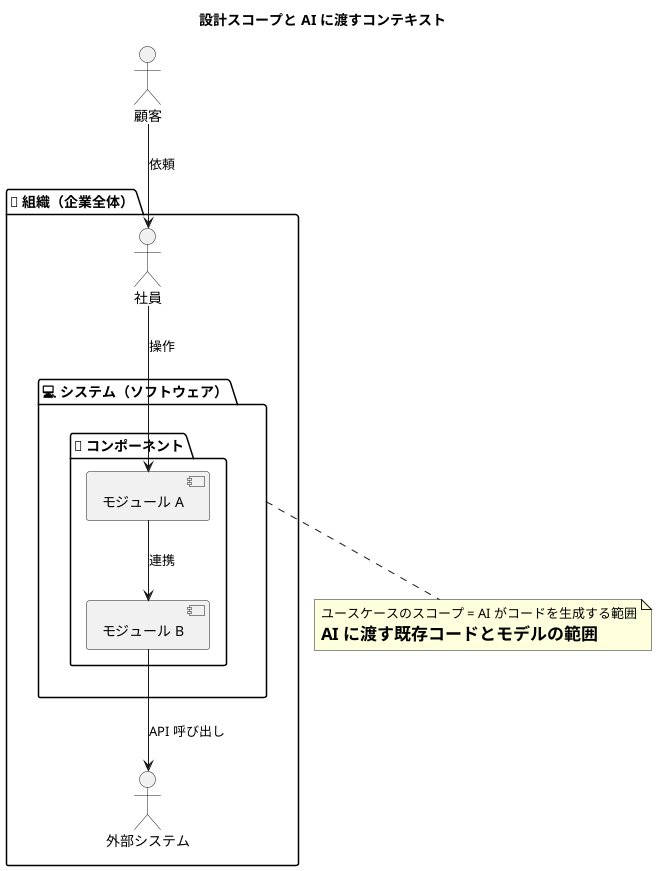

### In/Out リストの作成

XP 版の In/Out リストに、AI-DLC では「AI に任せる範囲」の列を加えます。組織のポリシー上 AI に渡せないもの（本番データ・機密情報・決済の秘密鍵など）を最初に明示します。

| トピック | In | Out | AI に任せる | 備考 |
| :--- | :---: | :---: | :---: | :--- |
| ユーザー認証 | ✓ | | 設計と実装 | 認証方式の選択は人が承認（確認必須） |
| 決済処理 | | ✓ | — | 外部サービス。契約テストのみ AI が生成。本番キーは渡さない |
| 在庫管理 | ✓ | | 設計と実装 | コア機能 |
| 配送手配 | | ✓ | — | 物流会社 API |
| レポート生成 | ✓ | | 実装のみ | 帳票レイアウトは人が指定 |

In/Out リストは参照実装の Scope Definition（Ideation 1.4）に相当し、以降のすべての AI 生成物の前提になります。

---

## 3. アクターの識別

### アクター分析

XP 版の 3 種類（主アクター・支援アクター・オフステージアクター）はそのまま使います。AI-DLC では AI にアクター候補を列挙させ、人が検証します。

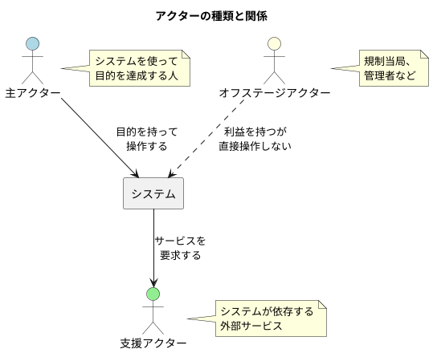

### AI が提案したアクターの検証観点

AI はもっともらしいアクターを生成しますが、実在しないロールや、組織に存在しない権限を持つアクターを作ることがあります。次の観点で検証します。

| 観点 | 確認内容 |
| :--- | :--- |
| 実在性 | そのロールは組織に実際に存在するか。既存の業務フロー（RDRA のビジネスコンテキスト）に登場するか |
| 目的の有無 | システムに対する明確な目的を持っているか。「システム」「管理者」のような汎用名で目的が曖昧になっていないか |
| 過剰な細分化 | 権限や画面が違うだけのロールを別アクターにしていないか |
| 見落とし | 規制当局・監査・運用担当などオフステージアクターが抜けていないか |
| AI の混同 | 開発を支援する AI エージェントをアクターに含めていないか |

### アクター・目的リスト

XP 版の表に、AI-DLC では「所属 Unit」を加えます。目的ごとに Unit を割り当てることで、Unit の凝集度を確認できます。

| アクター | 目的 | レベル | 優先度 | 頻度 | 所属 Unit |
| :--- | :--- | :---: | :---: | :--- | :--- |
| 購入者 | 商品を検索する | 🌊 | 高 | 100 回/日 | 商品カタログ |
| 購入者 | 注文する | 🌊 | 高 | 50 回/日 | 注文処理 |
| 購入者 | 注文履歴を確認する | 🌊 | 中 | 20 回/日 | 注文処理 |
| 購入者 | おすすめ商品を見る | 🌊 | 中 | 80 回/日 | レコメンデーション |
| 管理者 | 在庫を更新する | 🌊 | 高 | 30 回/日 | 在庫管理 |
| 管理者 | レポートを生成する | ☁️ | 中 | 5 回/日 | レポート |
| システム | 在庫を自動補充する | 🌊 | 高 | 10 回/日 | 在庫管理 |

---

## 4. ユースケース記述プロセス

### Mob Elaboration の流れ

AI-DLC では、ユースケースとストーリーは Inception フェーズの **Mob Elaboration** で作ります。ファシリテーターの進行のもと、プロダクトオーナー・開発者・QA が同じ画面を見ながら AI と対話します。

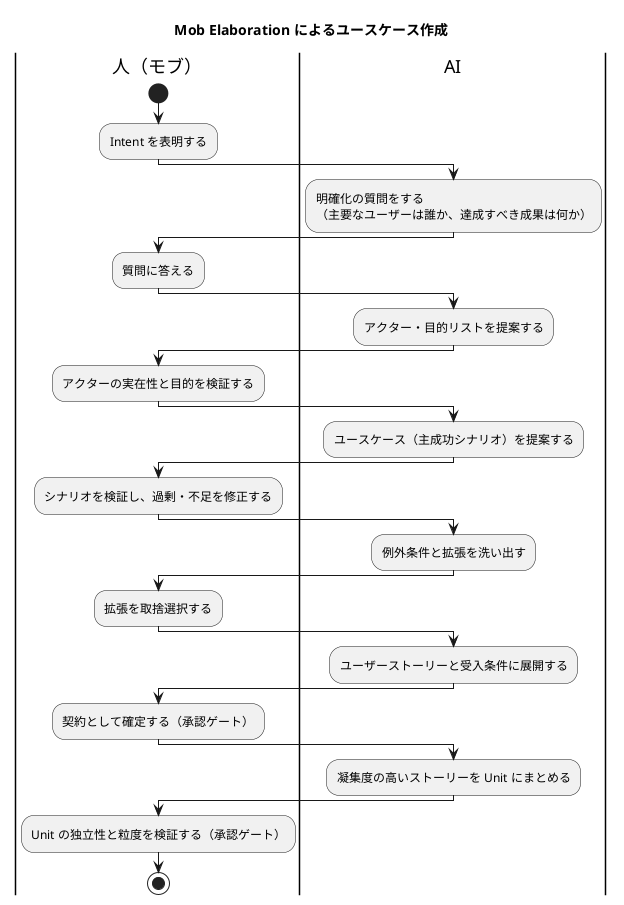

### 段階的詳細化と承認ゲート

XP 版の 4 つの精度レベルは、AI-DLC では承認ゲートの区切りになります。各レベルで AI が提案し、人が承認してから次に進みます。

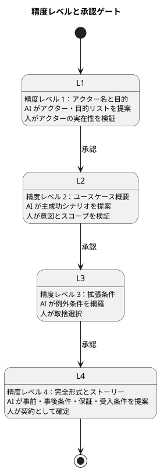

### 12 ステップの作成プロセスと分担

XP 版の 12 ステップを、AI と人の分担で整理します。

| # | ステップ | AI の役割 | 人の役割 |
| :--- | :--- | :--- | :--- |
| 1 | システムのスコープと境界を識別 | In/Out リストの候補を提案 | AI に渡せる範囲を含めて確定 |
| 2 | 主アクターの一覧作成 | 業務フローからアクター候補を列挙 | 実在性を検証 |
| 3 | ユーザー目的の洗い出し | アクター・目的リストを提案 | 目的の妥当性と優先度を判断 |
| 4 | 要約レベルユースケースの作成 | Intent を要約レベルに展開 | ビジネス価値との整合を検証 |
| 5 | 要約レベルの見直しと統合 | 重複・欠落を指摘 | 統合・分割を判断 |
| 6 | 詳細化するユースケースの選択 | 優先度と依存関係を提示 | 詳細化の順序を決定 |
| 7 | 利害関係者と保証の定義 | 利害関係者と利益の候補を提案 | 保証を確定 |
| 8 | 主成功シナリオの記述 | 3〜9 ステップのシナリオを提案 | 意図・スコープ・UI 漏れを検証 |
| 9 | 例外条件の洗い出し | 例外条件を網羅的に列挙 | 対象とする条件を取捨選択 |
| 10 | 拡張処理ステップの記述 | 拡張ステップを提案 | 業務ルールとの整合を検証 |
| 11 | 複雑なフローの分割と統合 | 分割案と include／extend を提案 | 分割の妥当性を判断 |
| 12 | 全体の整理と見直し | トレーサビリティと矛盾を検出 | 契約として承認 |

AI は「仮定より質問」を原則にします。情報が足りないときに AI がもっともらしく埋めるのではなく、質問させることが Mob Elaboration の品質を決めます。

---

## 5. ユースケーステンプレート

### 完全形式テンプレート（AI-DLC 版）

XP 版の完全形式に、AI-DLC のトレーサビリティ項目（Intent・Unit・リスク・測定基準）を加えます。

```markdown
# UC-[番号]: [スコープアイコン][ユースケース名][レベルアイコン]

**Intent**: [このユースケースが実現に寄与する Intent]

**Unit**: [所属する Unit]

**コンテキスト**: [一般的に起きる条件や状況の説明]

**スコープ**: [設計対象システム]

**レベル**: [要約/ユーザー目的/サブ機能]

**主アクター**: [目的を持つアクター]

**利害関係者と利益**:

- [利害関係者1]: [その利益]
- [利害関係者2]: [その利益]

**事前条件**:

- [すでに真であると想定している状態]

**トリガー**: [ユースケースを開始するイベント]

**最低保証**: [失敗時でも守られる利益]

**成功時保証**: [成功時に達成される状態]

**主成功シナリオ**:

1. [アクター]が[アクション]する
2. システムが[処理]する
3. ...

**拡張**:

- 1a. [条件]:
    - 1a1. [代替処理]
- 2-4a. [いつでも発生する条件]:
    - 2-4a1. [処理]

**技術およびデータのバリエーション**:

- ステップ1: [バリエーション]

**リスク**: [リスク台帳との対応。AI に渡せないデータ、確認必須の操作]

**測定基準**: [このユースケースの成功をどう測るか。Intent の測定基準へのトレース]

**AI の仮定**: [AI が置いた仮定と、その確認状況]
```

### 略式テンプレート（Bolt 向け）

```markdown
# [ユースケース名]

**Unit**: [所属する Unit]
**主アクター**: [アクター名]
**スコープ**: [システム名]
**レベル**: [レベル]

[主成功シナリオを段落形式で記述。システムの振る舞いと
アクターの相互作用を自然な文章で表現]

[代替パスや例外処理を段落形式で記述]

**頻度**: [実行頻度]
**参照する既存実装**: [AI が「同じ方式で」実装すべき既存コードのパス]
```

### ユーザーストーリー（人と AI の契約）

XP 版のユーザーストーリー形式に、AI が実装に使う項目を加えます。

```markdown
# [ストーリー名]

**Unit**: [所属する Unit]
**ユースケース**: UC-[番号]

**として**: [アクター]
**したい**: [目的/機能]
**なぜなら**: [ビジネス価値]

**受入条件**:

- [ ] [条件1：Given/When/Then で一意に判定できる形]
- [ ] [条件2]

**参照する成果物**:

- ドメインモデル: [パス]
- 既存実装: [パス]（同じ方式で実装する）
- ドメイン用語: [用語集のパス]

**確認ポイント**: [新規ファイル・スキーマ変更・外部連携など人の確認が必要な操作]

**AI の仮定**: [AI が置いた仮定。確認済みかどうか]
```

---

## 6. シナリオの書き方

### セマンティクス密度

XP 版の「良いステップの書き方」に、AI-DLC は **セマンティクス密度** の観点を加えます。ステップは人が読んで自然であると同時に、AI が一意に解釈できる必要があります。曖昧な語をドメイン用語と制約に置き換えます。

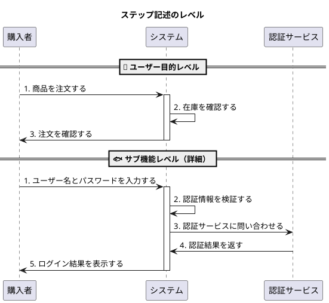

| 密度が低い記述 | 密度が高い記述 |
| :--- | :--- |
| システムがデータを処理する | システムが注文明細ごとに在庫引当を行う |
| ユーザーが情報を入力する | 購入者が配送先（氏名・住所・電話番号）を入力する |
| システムがチェックする | システムが注文金額が与信限度額以内であることを確認する |
| エラーの場合は通知する | 2a. 在庫が不足している場合、システムが不足数量を通知する |

### ステップ記述のガイドライン

#### やるべきこと

- ✅ アクターの意図を表現する
- ✅ 「誰が何をする」を明確にする
- ✅ 成功する目的として記述する
- ✅ 情報の流れを明確にする
- ✅ **ドメイン用語集の語を使う**（AI がドメインモデルと対応づけられる）
- ✅ **業務ルールを数値や条件で明示する**（AI がテストを生成できる）

#### 避けるべきこと

- ❌ UI の詳細を記述する
- ❌ 「チェックする」ではなく「確認する」
- ❌ 実装の詳細に踏み込む（AI が設計の選択肢を失う）
- ❌ IF 文を使う（拡張に記載）
- ❌ **「適切に」「必要に応じて」などの判断を AI に委ねる語**

### ステップ数の目安

XP 版と同じく 3〜9 ステップが理想です。AI は網羅的に書こうとして長くなる傾向があるため、10 ステップを超えた場合はサブユースケースへの分割を AI に提案させます。

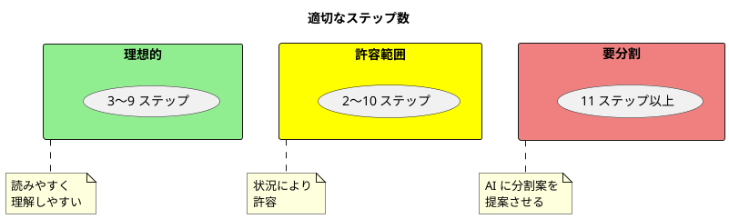

---

## 7. 拡張の記述

### AI による例外条件の網羅

XP 版では人が例外条件をブレインストーミングしていました。AI-DLC では AI に網羅的に列挙させ、人が取捨選択します。AI は入力異常・外部サービス障害・並行処理・権限・データ不整合といった観点を機械的に洗い出せるため、見落としが減ります。一方で、業務上あり得ない条件や対応不要な条件も含まれるため、人の判断が必要です。

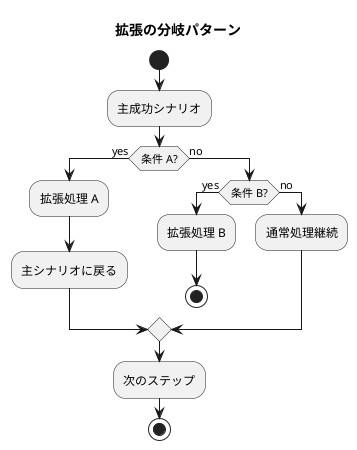

### 拡張の取捨選択の観点

| 観点 | 判断 |
| :--- | :--- |
| 業務上の発生可能性 | 実際に起こり得るか。起こらない条件は削除する |
| 利害関係者の利益 | 最低保証に関わる条件は必ず残す |
| 対応の所在 | 外部サービスや基盤で対応済みの条件は「技術バリエーション」に移す |
| テストの価値 | 受入テストとして残す価値があるか。テスト戦略の水準に合わせる |
| リスク台帳 | セキュリティ・コンプライアンスに関わる条件はリスク台帳と対応づける |

### 拡張の記述形式

```markdown
**主成功シナリオ**:

1. 購入者が商品を選択する
2. システムが在庫を確認する
3. 購入者が数量を指定する
4. システムが合計金額を計算する
5. 購入者が注文を確定する

**拡張**:

- 2a. 在庫がない:
    - 2a1. システムが在庫なしを通知する
    - 2a2. 購入者が別の商品を選択する（ステップ 1 へ）

- 3a. 数量が在庫を超える:
    - 3a1. システムが利用可能数量を表示する
    - 3a2. 購入者が数量を調整する

- 4a. 合計金額が与信限度額を超える:
    - 4a1. システムが限度額超過を通知する
    - 4a2. 購入者が数量を減らす（ステップ 3 へ）

- *a. 購入者がキャンセル:
    - *a1. システムがトランザクションを破棄する
    - *a2. 終了

**AI が提案し、削除した条件**:

- 2b. 在庫サービスがタイムアウト → 基盤のリトライで対応済み。技術バリエーションへ
- 5b. 同一注文の二重送信 → API の冪等性で対応。Unit「注文処理」の NFR へ
```

削除した条件も記録しておくと、AI が次の Bolt で同じ条件を再提案したときに判断を再利用できます。

---

## 8. データ記述の精度

### 3 段階のデータ精度と AI のコンテキスト

XP 版の 3 段階（ニックネーム → フィールド群 → 詳細仕様）はそのまま使います。AI-DLC では、精度レベル 2 以上を **ドメイン用語集** として整備し、AI に渡すコンテキストにします。

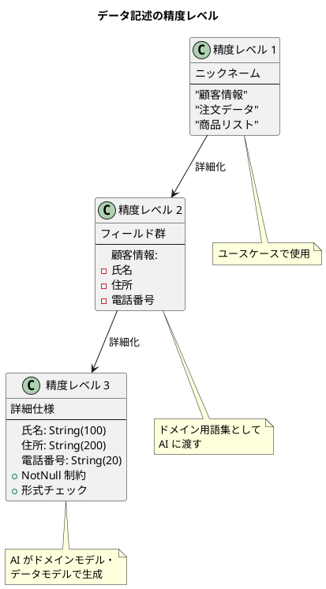

| 精度レベル | 誰が書くか | AI-DLC での用途 |
| :--- | :--- | :--- |
| 1（ニックネーム） | AI が提案、人が用語を統一 | ユースケースの本文 |
| 2（フィールド群） | AI が提案、人が業務知識で補正 | ドメイン用語集。ユースケース・ストーリー・ドメインモデルで共通に参照 |
| 3（詳細仕様） | AI がドメインモデル・データモデル設計で生成、人が検証 | Construction フェーズの成果物 |

ユースケース内で同じ概念を別の語で呼ぶと、AI は別のエンティティとして生成します。用語集の統一は AI-DLC では品質に直結します。

---

## 9. 品質チェックリスト

### ユースケース全体のチェック項目

XP 版のチェック項目はすべて有効です。AI-DLC 版ではそれらに加えて、AI 生成物に固有の観点を検証します。

| カテゴリ | チェック項目 | ✓ |
| :--- | :--- | :---: |
| **タイトル** | 動詞句で目的を表現しているか | □ |
| | システムが達成可能な目的か | □ |
| **スコープ** | 明確に定義されているか | □ |
| | ブラックボックスとして扱っているか | □ |
| | AI に渡せる範囲が In/Out リストと一致しているか | □ |
| **レベル** | 適切なレベルが選択されているか | □ |
| | 内容がレベルと一致しているか | □ |
| **主アクター** | 振る舞いを持っているか | □ |
| | システムへの明確な目的があるか | □ |
| | 実在するロールか（AI の幻覚ではないか） | □ |
| **事前条件** | 必須かつ検証可能か | □ |
| | ユースケース内で再チェックしていないか | □ |
| **保証** | 利害関係者の利益が守られているか | □ |
| | 成功時に目的が達成されるか | □ |
| **シナリオ** | 3〜9 ステップに収まっているか | □ |
| | トリガーから保証まで進んでいるか | □ |
| | 曖昧な語（適切に・必要に応じて）が残っていないか | □ |
| **トレーサビリティ** | Intent と Unit にたどれるか | □ |
| | 測定基準が Intent の測定基準に対応しているか | □ |
| **AI の仮定** | AI が置いた仮定が明示され、確認済みか | □ |

### AI 生成ユースケースに固有の検証観点

| 観点 | 症状 | 対処 |
| :--- | :--- | :--- |
| 過剰設計 | Intent に無い機能・拡張・アクターが足されている | 削除し、削除理由を記録する |
| 設計不足 | 業務上必須の制約・例外・利害関係者が落ちている | 業務知識で補い、AI に質問させるべきだった点をガードレールにする |
| 幻覚 | 存在しないロール・システム・業務ルールが登場する | 実在の業務フロー・システムコンテキストと照合する |
| UI 漏れ | 「ボタンを押す」「画面を表示する」など UI の記述が混入 | 意図の記述に置き換える |
| 実装漏れ | 「DynamoDB に保存する」など技術選択が混入 | 技術バリエーションか Logical Design に移す |
| 用語のゆれ | 同じ概念が別の語で書かれている | ドメイン用語集で統一する |
| 未確認の仮定 | 「〜と想定する」が確認されないまま残る | Mob Elaboration で回答し、記録する |

### ステップ記述のチェック項目

- □ 成功する目的として表現されているか
- □ アクターが明確か
- □ 意図が明確か
- □ UI 設計を含んでいないか
- □ 情報の流れが明確か
- □ 「確認する」を使っているか（「チェックする」ではなく）
- □ ドメイン用語集の語を使っているか
- □ 業務ルールが数値や条件で明示されているか

---

## 10. AI-DLC プロジェクトでの活用

### ユースケースから Unit とストーリーへ

XP 版では 1 つのユースケースをイテレーション単位のストーリーに分解しました。AI-DLC では、ストーリーを **凝集度の高い Unit** にまとめ、Unit を Bolt で実装します。

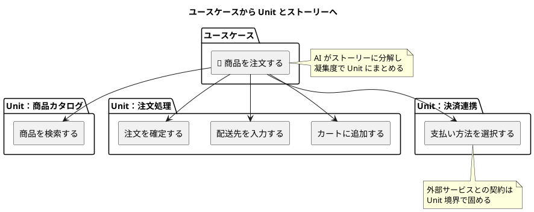

1 つのユースケースのストーリーが複数の Unit にまたがることは自然です。Unit の境界は「独立して開発・デプロイできるか」で決め、ユースケースの境界とは一致させません。

### ストーリーマップと依存関係

参照実装は Units Generation（Inception 2.7）で、Unit 定義・Unit 間の依存 DAG・Unit とストーリーの対応表を生成します。本プロジェクトでは次の 3 つを揃えます。

| 成果物 | 内容 | 用途 |
| :--- | :--- | :--- |
| Unit 定義 | 各 Unit の目的・含まれるストーリー・NFR・リスク | Bolt 計画の入力 |
| 依存 DAG | Unit 間の依存関係 | 並列に回せる Unit の特定、Bolt の順序 |
| ストーリーマップ | ユースケース × Unit × ストーリーの対応表 | トレーサビリティ、検証ゲートでの欠落検出 |

### Bolt 計画での利用

1. **リリース計画時**

     - Intent を要約レベルのユースケースと Unit に分解し、全体像を把握する
     - Unit ごとに複雑さとリスク（エントロピー評価）を評価する

2. **Bolt 計画時**

     - Unit 内のストーリーを AI に渡し、ステップ計画を書かせる
     - 受入条件を Bolt の完了条件にする

3. **実装時**

     - ユースケースとストーリーを AI の設計・実装の契約として渡す
     - 拡張から AI がテストを生成し、人が受入条件で検証する

### ユースケースから機能リストへ

XP 版の機能リストのストーリーポイント列は、AI-DLC 版では「AI 自律度」に置き換えます。AI がどれだけ自律的に実装でき、人の確認がどこで必要かを表します。

```markdown
## UC-001: 商品を注文する

### 抽出された機能リストと AI 自律度

| ID | 機能 | Unit | 優先度 | AI 自律度 | 確認ポイント |
| :--- | :--- | :--- | :--- | :--- | :--- |
| F1.1 | 商品検索機能 | 商品カタログ | 必須 | 高 | なし |
| F1.2 | カート追加機能 | 注文処理 | 必須 | 高 | なし |
| F1.3 | 在庫確認機能 | 在庫管理 | 必須 | 中 | 在庫引当の業務ルール |
| F1.4 | 配送先入力機能 | 注文処理 | 必須 | 高 | 個人情報の保存方式 |
| F1.5 | 支払い処理機能 | 決済連携 | 必須 | 低 | 外部 API 契約、本番キーは渡さない |
| F1.6 | 注文確認メール送信 | 注文処理 | 重要 | 中 | メール送信基盤の選択 |
| F1.7 | 注文履歴保存 | 注文処理 | 重要 | 高 | スキーマ変更 |
```

---

## 11. テストケースへの変換

### AI によるテスト生成と人の検証

XP 版では人がユースケースの各パスからテストケースを設計しました。AI-DLC では AI が主成功シナリオと拡張からテストを生成し、人は **受入条件で検証** します。

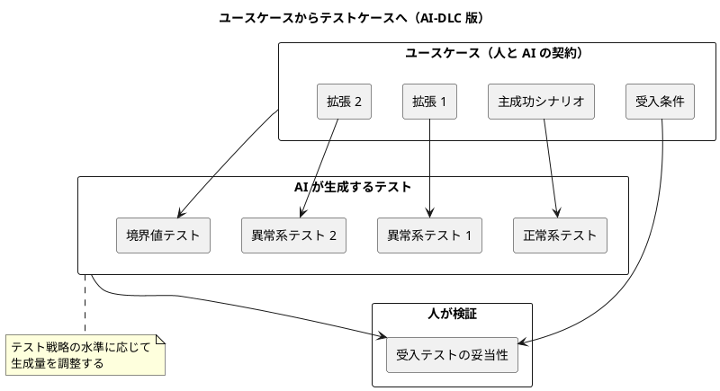

### テスト戦略との対応

生成するテストの量は、計画で選んだテスト戦略に従います。

| テスト戦略 | ユースケースからの生成方針 |
| :--- | :--- |
| Minimal | 受入条件ごとに 1 テスト。主成功シナリオの正常系は必ず含める |
| Standard | 主成功シナリオ・すべての拡張・境界値。単体と統合を含む |
| Comprehensive | Standard に加え、NFR（性能・セキュリティ）の受入テストと E2E |

### テストケーステンプレート

```markdown
## テストケース: [ユースケース名]_[パス]

**基になるユースケース**: UC-XXX
**ストーリー**: [ストーリー名]
**受入条件**: [対応する受入条件]
**テストパス**: 主成功シナリオ/拡張 XX

**事前条件**:

- [システムの初期状態]
- [必要なテストデータ]

**入力**:
1. [入力データ 1]
2. [入力データ 2]

**期待結果**:

- [期待される出力]
- [期待される状態変化]
- [期待される副作用]

**事後条件**:

- [システムの最終状態]

**生成**: AI / **検証**: [検証した人と日時]
```

受入条件を Given/When/Then で一意に判定できる形にしておくと、AI のテスト生成の精度が上がり、人の検証も受入条件との突合だけで済みます。

---

## 12. ブラウンフィールドでのユースケース

既存システムに機能を追加する場合、AI-DLC はまずコードを **静的モデルと動的モデル** に昇格させます。動的モデルは「主要ユースケースを実現するコンポーネント間の相互作用」であり、ユースケースそのものです。

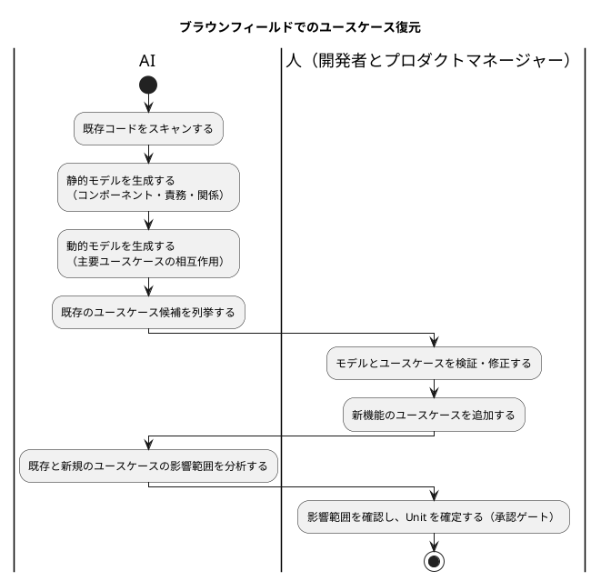

### 復元したユースケースの検証観点

| 観点 | 確認内容 |
| :--- | :--- |
| 実装と業務の乖離 | コードから復元した振る舞いが、現在の業務と一致しているか。使われていない経路はないか |
| 暗黙の業務ルール | コードに埋め込まれた条件分岐が、業務ルールとして明文化されているか |
| 影響範囲 | 新機能のユースケースが既存のどのユースケースの拡張・事前条件に影響するか |
| 用語のずれ | コードの命名とドメイン用語集が対応しているか |

---

## 13. プロンプトパターン

[AI-DLC 導入ガイド](AI-DLC導入ガイド.md#7-プロンプトパターン) の骨格（ロール・計画・確認ポイント・承認・1 ステップずつ）をユースケース作成に適用します。

### ユースケースとストーリーの作成

```markdown
あなたは経験豊富なプロダクトマネージャーです。
次の Intent から、システムの振る舞いに関する契約となるユースケースと
ユーザーストーリーを作成します。

作業の前に、手順をチェックボックス付きの Markdown 計画として
docs/requirements/<project>/usecase_plan.md に書いてください。
人の確認が必要なステップにはその旨を注記し、
重要な判断（スコープの境界、アクターの追加、業務ルールの解釈）は勝手にしないでください。
情報が足りない場合は仮定で埋めずに質問してください。
計画ができたらレビューと承認を求め、承認後に 1 ステップずつ実行してください。

Intent: <<達成したいことの宣言>>
参照する成果物:
- 業務フロー・システムコンテキスト: docs/requirements/<project>/
- ドメイン用語集: docs/design/<project>/glossary.md
- In/Out リスト: docs/requirements/<project>/scope.md

出力の規約:
- ユースケースは docs/reference/ユースケース作成ガイド_AI-DLC版.md の完全形式テンプレートに従う
- 主成功シナリオは 3〜9 ステップ、UI と実装の詳細を書かない
- 受入条件は Given/When/Then で一意に判定できる形にする
- 置いた仮定は「AI の仮定」欄に明記する
```

### 例外条件の洗い出し

```markdown
UC-001 の主成功シナリオについて、各ステップで起こり得る例外条件を
次の観点で網羅的に列挙してください。
- 入力の異常（欠落・形式・範囲）
- 外部サービスの障害・タイムアウト
- 並行処理・二重送信
- 権限・認証
- データ不整合・状態の矛盾
- 業務ルール違反

各条件について、発生可能性と利害関係者への影響を付記してください。
採用するかどうかは私が判断します。勝手に拡張へ追記しないでください。
```

### Unit へのまとめ

```markdown
あなたは経験豊富なソフトウェアアーキテクトです。
docs/requirements/<project>/stories.md のユーザーストーリーを、
独立して開発・デプロイできる複数の Unit にまとめてください。
各 Unit は凝集度の高いストーリーを含み、Unit 間は疎結合にします。

計画を units_plan.md に書き、承認後に実行してください。
出力:
- Unit ごとの定義（目的・含まれるストーリー・NFR・リスク）
- Unit 間の依存関係（DAG）
- ユースケース × Unit × ストーリーの対応表
Unit の境界について判断に迷う点は質問してください。
```

### ブラウンフィールドのリバースエンジニアリング

```markdown
あなたは経験豊富なソフトウェアエンジニアです。
apps/<project>/ の既存コードから、次を復元してください。
1. 静的モデル：コンポーネント・責務・関係
2. 動的モデル：主要なユースケースを実現するコンポーネント間の相互作用
3. 既存のユースケース候補（ユーザー目的レベル）

コードに埋め込まれた条件分岐は、業務ルールの候補として別に列挙してください。
使われていない経路や不明な意図は、推測せずに「要確認」として印を付けてください。
計画を re_plan.md に書き、承認後に実行してください。
```

---

## 14. よくある問題と対策

### 問題パターンと解決策

XP 版の問題パターンはすべて有効です。AI-DLC 版ではさらに AI 特有の問題を加えます。

| 問題 | 症状 | 解決策 |
| :--- | :--- | :--- |
| スコープ不明確 | 要求が増え続ける | In/Out リスト作成。AI に渡せる範囲も明示 |
| レベル混在 | ステップが不均一 | レベルアイコン使用。AI に分割案を出させる |
| UI 記述 | 実装に依存 | 意図の記述に変更。AI のガードレールに追加 |
| 長すぎる | 10 ステップ以上 | サブユースケース分割 |
| 曖昧な記述 | 解釈が複数。AI の実装が意図とずれる | 具体例とドメイン用語の追加。セマンティクス密度を上げる |
| 保証なし | 目的が不明 | 利害関係者分析 |
| 過剰設計 | AI が Intent に無い機能を足す | 削除し、削除理由を記録。Intent を狭く書く |
| 幻覚アクター | 存在しないロールが登場 | 業務フロー・システムコンテキストとの照合を承認ゲートに組み込む |
| 仮定の放置 | 「〜と想定」が確認されずに実装まで進む | 「AI の仮定」欄を必須にし、承認ゲートで確認する |
| 用語のゆれ | AI が同じ概念を別エンティティで生成 | ドメイン用語集を先に整備し、AI に参照させる |
| 例外の過剰 | AI が対応不要な例外まで拡張に入れる | 取捨選択の観点（第 7 章）で判断し、削除した条件を記録 |

### アンチパターン

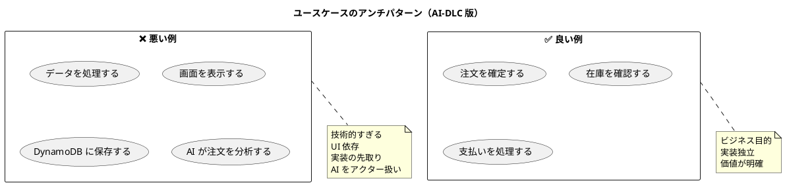

---

## 15. 本プロジェクトの分析スキルへの適用

本プロジェクトの分析スキルは XP 版のガイドを前提にしています。AI-DLC 版で運用する場合の読み替えは次のとおりです。

| スキル | XP 版の運用 | AI-DLC 版の読み替え |
| :--- | :--- | :--- |
| `analyzing-requirements` | RDRA 2.0 で要件を整理 | ビジネスコンテキスト・システムコンテキストを AI に渡す前提情報として整備。アクターの実在性検証の根拠にする |
| `analyzing-usecases` | ユースケース → ストーリーを導出 | Mob Elaboration の手順（第 4 章）で AI に初稿を書かせ、モブが検証。ストーリーを Unit にまとめ、依存 DAG とストーリーマップを追加で生成 |
| `analyzing-domain-model` | ドメインモデル設計 | ドメイン用語集を先に整備し、ユースケースとドメインモデルで共通に参照 |
| `analyzing-review` | 分析成果物のマルチパースペクティブレビュー | AI 生成ユースケースの検証観点（第 9 章）をレビュー観点に加える。参照実装の product-lead レビュアーに相当 |
| `analyzing-test-strategy` | テスト戦略の策定 | テスト戦略の水準（Minimal／Standard／Comprehensive）を決め、ユースケースからのテスト生成方針に反映 |
| `validating-iteration-plan` | 計画と設計の整合性検証 | ユースケース × Unit × ストーリーの対応表で、Bolt 計画からのトレーサビリティを検証 |
| `creating-journal` | 判断と学びの記録 | 削除した拡張条件・確認した仮定・AI の振る舞いへの修正を記録し、ガードレールに反映 |

ユースケースとストーリーの配置は [ドキュメント構成ガイド](ドキュメント構成ガイド.md) に従い、`docs/requirements/<project>/` に置きます。ドメイン用語集は `docs/design/<project>/` に置き、ユースケース・ドメインモデル・データモデルから共通に参照します。

---

## まとめ

### ユースケース作成の原則（AI-DLC 版）

1. **契約として書く**

     - ユースケースとストーリーは利害関係者との契約であり、AI に渡す実装の契約でもある
     - 人が読んで自然で、AI が一意に解釈できる記述にする

2. **AI が書き、人が検証する**

     - 初稿・例外条件の網羅・テスト生成は AI に任せる
     - 過剰設計・設計不足・幻覚・仮定の放置を人が検証する

3. **段階的詳細化を承認ゲートにする**

     - 精度レベルごとに承認し、誤りを下流に流さない
     - 削除した条件と確認した仮定を記録し、次の Bolt に再利用する

4. **Unit とテストにつなげる**

     - ストーリーを凝集度で Unit にまとめ、依存 DAG で並列性を確保する
     - 受入条件を Given/When/Then で書き、AI のテスト生成と人の検証の基準にする

### クイックリファレンス

#### アイコン凡例

- 🏢 組織スコープ
- 💻 システムスコープ
- 💾 コンポーネントスコープ
- ☁️ 要約レベル（Intent・Unit）
- 🌊 ユーザー目的レベル（Unit 内のユースケース・ストーリー）
- 🐟 サブ機能レベル（Bolt のステップ）

#### 記述の黄金律

- 3〜9 ステップ
- アクターの意図を記述
- UI 詳細と実装詳細は書かない
- 成功する目的として表現
- ドメイン用語集の語を使う
- 業務ルールは数値と条件で明示する
- AI の仮定は必ず明記し、承認ゲートで確認する

このガイドを参考に、AI と協働してプロジェクトに適したユースケースを作成し、AI-DLC の開発プロセスに統合してください。
