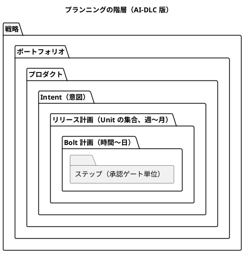
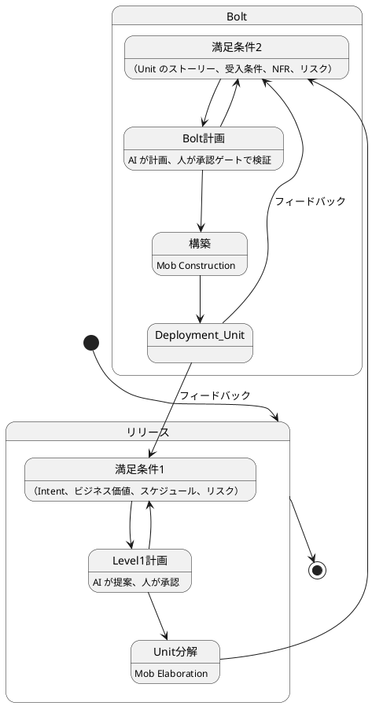
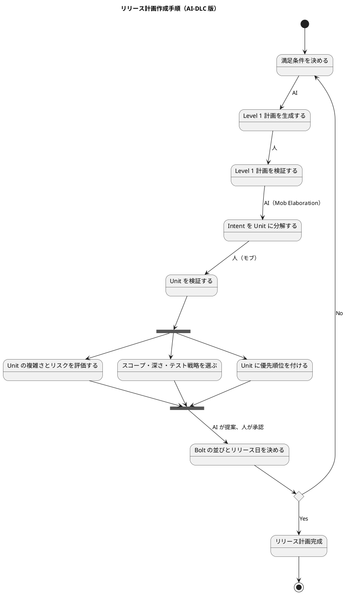
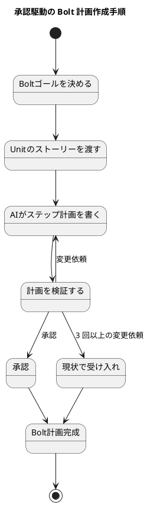
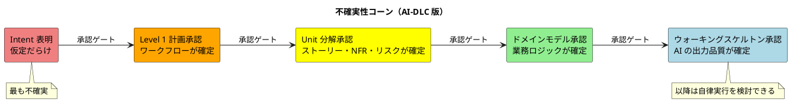
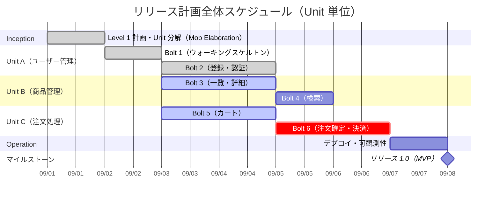
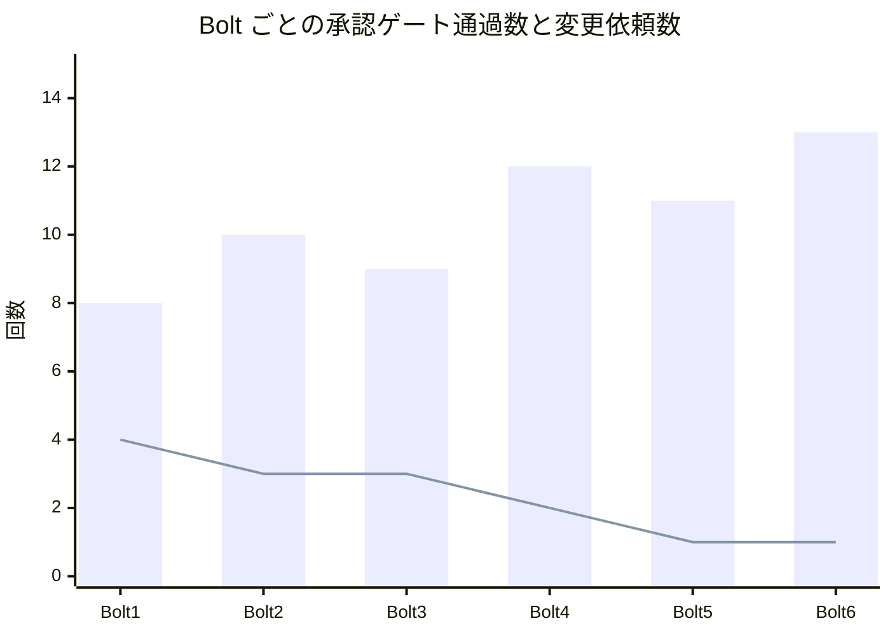
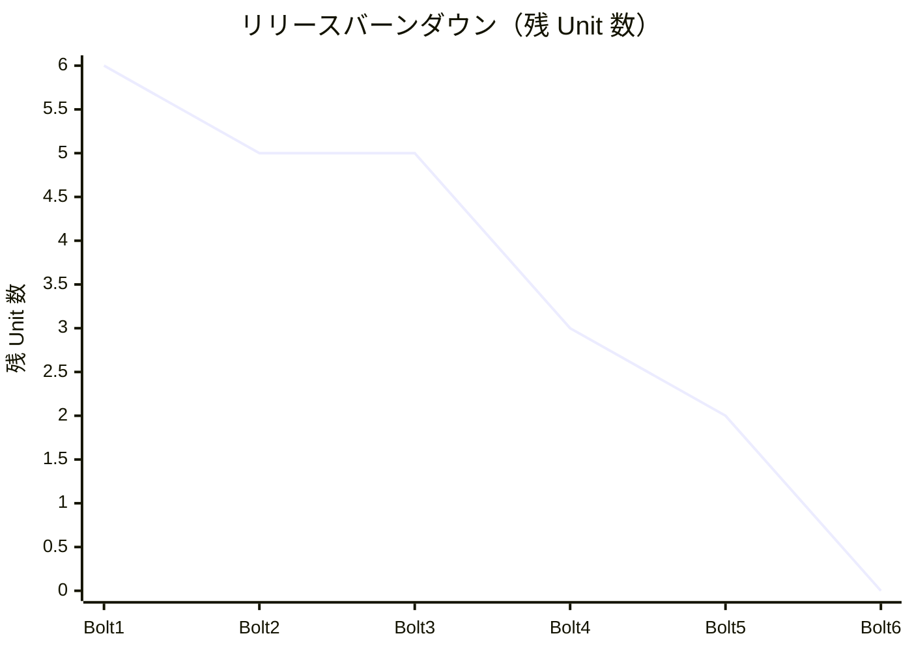

# リリース・イテレーション計画ガイド（AI-DLC 版）

## はじめに

このガイドは、[リリース・イテレーション計画ガイド](リリース・イテレーション計画ガイド.md)（XP 版）を AI-DLC の原則で読み替えたものです。AI-DLC の背景と用語は [AI-DLC 導入ガイド](AI-DLC導入ガイド.md) を参照してください。

XP 版との最大の違いは、**計画を作るのが AI で、検証と承認をするのが人** になることです。人がストーリーを見積もり、タスクに分解し、コミットする代わりに、AI が Intent を Unit と Bolt に分解して計画を提案し、人は承認ゲートで検証・修正・承認します。XP 版で扱っていた見積もり・ベロシティ・バーンダウンといった道具は、AI-DLC ではその前提が変わるため、何を残し何を置き換えるかを本ガイドで明確にします。

| 観点 | XP 版 | AI-DLC 版 |
| :--- | :--- | :--- |
| 計画の作成者 | チーム（人） | AI が提案し、人が検証・承認する |
| 計画の単位 | ユーザーストーリー → タスク | Intent → Unit → Bolt → ステップ |
| イテレーション | 1〜4 週間 | Bolt：時間〜日単位 |
| 見積もり | ストーリーポイント・理想時間 | 複雑さ・リスク・不確実性の評価と、スコープ・深さ・テスト戦略の選択 |
| コミットメント | チームが「できる」と宣言する | 人が承認ゲートで計画を承認する |
| 進捗の可視化 | ベロシティ・バーンダウン | Unit と Bolt の状態、承認ゲートの通過数、リードタイム、ビジネス価値 |
| 日次の儀式 | デイリースタンドアップ | 承認ゲートでのリアルタイム検証（Mob Elaboration・Mob Construction） |
| 記録 | タスクボード・終了報告 | 状態ファイル・監査ログ・承認ゲート単位の報告 |

---

## 計画の基本概念

### AI-DLC における計画づくりの原則

XP 版の 3 原則（計画づくりの重視・変化の促進・フィーチャ中心）はそのまま有効です。AI-DLC はそこに次の 4 つを加えます。

- **AI が計画し、人が検証する**:

  AI が Level 1 計画（ワークフロー全体）を提案し、人が検証・修正する。各ステップはさらに AI が Level 2 に分解し、人が再び検証する

- **検証は損失関数**:

  各承認ゲートでの人の検証は、誤りが下流で膨らむ前に刈り取るための仕組み。ゲートを省くほど速くなるが、手戻りのリスクが増える

- **固定のワークフローを持たない**:

  新規開発・機能追加・リファクタリング・欠陥修正で同じ計画テンプレートを使わない。AI が Intent に応じたステージ構成を提案する

- **価値で測る**:

  AI が難易度の境界を薄めるため、ストーリーポイントとベロシティは絶対的な指標ではなくなる。ビジネス価値・リードタイム・品質で計画を評価する



### AI-DLC の計画づくりプロセス



---

## 1. リリース計画作成プロセス

### 1.1 リリース計画の目的

リリース計画の目的は XP 版と同じく「いつどれだけの成果が出せるか」を判断することです。AI-DLC では、これを **Intent をどの Unit に分解し、どの順序で Bolt を回すか** として表現します。

### 1.2 リリース計画作成手順



#### ステップ 1：満足条件の決定

プロダクトオーナーと協力して以下を定義します。XP 版のスコープ・スケジュール・リソースに、AI-DLC の Intent とリスクが加わります。

- **Intent**:

  達成したいことの高水準の宣言。ビジネス目標・機能・技術的成果のいずれか

- **ビジネス価値**:

  Intent が実現したときに何がどう良くなるか。測定基準まで定義する

- **スケジュール**:

  いつまでに何を届けるか

- **リソース**:

  モブの構成（フルスタック開発者・ビジネス担当・スペシャリスト）と、AI に渡せるコード・データの範囲

- **リスク**:

  組織のリスク台帳と対応づけた制約（セキュリティ・コンプライアンス・既存制度）

#### ステップ 2：Level 1 計画の生成と検証

AI に Intent を渡し、実現までのワークフロー（Level 1 計画）を提案させます。人はこの計画を検証し、不要なステージを削り、足りないステージを足します。

```markdown
# Level 1 計画のプロンプト骨格
あなたは経験豊富なソフトウェアアーキテクトです。
次の Intent を実現するためのワークフローを、チェックボックス付きの
Markdown 計画として書いてください。
人の確認が必要なステップにはその旨を注記し、重要な判断は勝手にしないでください。
計画ができたらレビューと承認を求め、承認後に 1 ステップずつ実行してください。

Intent: <<達成したいことの宣言>>
```

Level 1 計画の検証観点は次のとおりです。

- 既存プロジェクト（ブラウンフィールド）なら、コードをモデルに昇格させるステップが含まれているか
- UI を持たない Intent にモックアップのステップが入っていないか
- セキュリティ・コンプライアンスの検証ステップが、組織のリスク台帳と対応しているか
- デプロイと可観測性のステップが、実装のスピードに見合っているか

#### ステップ 3：Intent の Unit への分解（Mob Elaboration）

AI に Intent を **Unit** へ分解させます。Unit は疎結合・高凝集な作業単位で、独立して開発・デプロイできることが条件です。モブ全員が同じ画面で AI の質問に答え、分解結果を検証します。

Unit ごとに次の成果物が揃っていることを確認します。

| 成果物 | 内容 |
| :--- | :--- |
| ユーザーストーリー | Unit の機能スコープ。人と AI の契約 |
| 受入条件 | ストーリーの完了を判断する条件 |
| NFR 定義 | Unit に固有の非機能要件 |
| リスク記述 | リスク台帳との対応 |
| 測定基準 | ビジネス意図にトレースできる指標 |
| 推奨 Bolt | Unit を構築するための Bolt の提案 |

分解の検証観点は次のとおりです。

- **独立性**: ある Unit の変更が他の Unit の再設計を要求しないか
- **粒度**: 1 つの Unit が 1 つのモブで数時間〜数日の Bolt 数回で完了する大きさか
- **過剰設計・設計不足**: AI が勝手に足した機能、逆に落とした制約はないか
- **トレーサビリティ**: すべてのストーリーが Intent に、すべての Unit が測定基準にたどれるか

#### ステップ 4：Unit の複雑さとリスクの評価

XP 版のストーリーポイント見積もりに相当するステップです。AI-DLC ではポイントを付けるのではなく、**AI がどれだけ自律的に進められるか** を評価します。参照実装のコンポーザーが使う 5 つの「実装エントロピー」を評価軸として使います。

| 評価軸 | 問い | 高いときの対応 |
| :--- | :--- | :--- |
| 意図の曖昧さ | ストーリーと受入条件は一意に解釈できるか | Mob Elaboration で追加の質問に答える |
| 構造的不確実性 | 変更対象のコードや境界は把握できているか | リバースエンジニアリングのステップを足す |
| 検証の不確実性 | 完了をテストで判定できるか | テスト戦略を上げる。受入テストを先に書く |
| リスク | セキュリティ・データ・既存制度への影響は | リスク台帳と照合し、承認ゲートを増やす |
| 未解決の仮定 | AI や人が置いた仮定は確認済みか | 仮定を明示し、確認してから着手する |

各軸を LOW／MED／HIGH の 3 段階で評価し、HIGH が多い Unit ほど承認ゲートを密にします。

#### ステップ 5：スコープ・深さ・テスト戦略の選択

Unit（または Intent 全体）に対して、どのステージを実行し、どの詳細度で成果物を作り、どれだけテストするかを決めます。

| 軸 | 選択肢 | 選び方 |
| :--- | :--- | :--- |
| スコープ | 全ステージ／設計中心／実装中心／修正のみ | 新機能は全ステージ、欠陥修正やリファクタリングは実装中心 |
| 深さ | Minimal／Standard／Comprehensive | 規制対象や監査が必要なら Comprehensive、PoC なら Minimal |
| テスト戦略 | Minimal（要件ごとに 1）／Standard（コンポーネントごとに 5〜8）／Comprehensive（10〜15） | 本番機能は Standard 以上。学習・検証目的なら Minimal |

これが XP 版の「ベロシティを見積もる」と「イテレーションの長さを決める」に相当します。AI の生成量はスコープと深さでほぼ決まるため、Bolt の長さは「ゲートを何回通すか」で調整します。

#### ステップ 6：優先順位の決定

XP 版の 4 つの評価軸（金銭価値・コスト・知識習得・リスク軽減）はそのまま使います。AI-DLC では次を加えます。

- **依存関係**:

  AI に Unit 間の依存 DAG を作らせ、依存の少ない Unit から着手する。依存を共有しない Unit は並列に回せる

- **ウォーキングスケルトン**:

  最初の Bolt はエンドツーエンドで動く最小の縦割りにする。ここで AI の出力の質を確認し、以降のゲートの密度を決める

- **AI 自律度**:

  ステップ 4 の評価が LOW の Unit は早く終わる。HIGH の Unit は人の時間を多く使うため、モブの集中時間が確保できるタイミングに置く

#### ステップ 7：Bolt の並びとリリース日の決定

AI に Unit の依存 DAG と優先順位から **Bolt 計画** を提案させ、人が承認します。Bolt 計画は次を含みます。

- 各 Bolt に含める Unit（1 つ以上）
- Bolt の完了条件（Definition of Done）
- 確認したい仮説（この Bolt で何が分かれば次に進めるか）
- 担当（モブ、または並列時の担当者）
- 並列に回す Bolt と、順序が固定される Bolt

### 1.3 リリース計画の更新

- **各 Bolt の承認ゲート通過時** に見直す。XP 版の「各イテレーション開始時」より高頻度になる
- ウォーキングスケルトンの結果で、以降の深さ・テスト戦略・ゲート密度を調整する
- Unit の完了実績（Bolt 数・リードタイム・手戻り回数）で残りの Unit の評価を更新する
- スコープ変更は Level 1 計画に反映し、削ったステージ・足したステージを記録する

---

## 2. Bolt（イテレーション）計画作成プロセス

### 2.1 リリース計画との違い

| 項目 | リリース計画 | Bolt 計画 |
| :--- | :--- | :--- |
| 対象期間 | 週〜月 | 時間〜日 |
| 構成要素 | Unit | Unit 内のストーリーとステップ |
| 作成者 | AI が Level 1 計画を提案、モブが検証 | AI がステップ計画を提案、担当者が承認ゲートで検証 |
| 見積単位 | 複雑さ・リスク・自律度 | 承認ゲートの回数と人の集中時間 |

### 2.2 Bolt 計画作成手順

#### 承認駆動方式

XP 版のコミットメント駆動方式を、AI-DLC では **承認駆動** に置き換えます。チームが「できる」と宣言する代わりに、人が AI の計画を承認します。



#### ステップ 1：Bolt ゴールの設定

- 1〜2 行で Bolt で達成することを記述します
- **確認したい仮説** を必ず含めます。「この Bolt が終われば ○○ が分かる」の形にします
- 最初の Bolt はウォーキングスケルトンにします

```markdown
# Bolt ゴールの例
注文 Unit の「カートに商品を追加する」ストーリーを、API からデータベースまで
通して動かす。これで AI が生成するドメインモデルとリポジトリの品質が
このコードベースで十分かどうかが分かる。
```

#### ステップ 2：AI によるステップ計画

XP 版の「ストーリーのタスク分解」を AI が行います。第 7 章のプロンプトパターン（[AI-DLC 導入ガイド](AI-DLC導入ガイド.md#7-プロンプトパターン)）で計画を書かせます。

```markdown
# Bolt 計画のプロンプト骨格
あなたは経験豊富なソフトウェアエンジニアです。
docs/requirements/<unit>.md のストーリーと受入条件を参照し、
このストーリーを実装するステップをチェックボックス付きの
Markdown 計画として docs/development/bolt_<n>_plan.md に書いてください。
- 各ステップはテストファースト（Red-Green-Refactor）で進めること
- 人の確認が必要なステップにはその旨を注記すること
- 重要な判断（新規ライブラリ、スキーマ変更、外部連携）は勝手にしないこと
計画ができたらレビューと承認を求め、承認後に 1 ステップずつ実行し、
完了したステップのチェックボックスを更新してください。
```

**良いステップの特徴**（XP 版の「良いタスクの特徴」に相当）

- 1 回の AI とのやり取りで完結する粒度
- 完了をテストで判定できる
- 入力となる成果物（ストーリー・ドメインモデル・既存コード）がパスで明示されている
- 人の確認ポイントが明記されている

#### ステップの種類

- 設計ステップ（ドメインモデル・論理設計・ADR）
- 実装ステップ（テスト → 実装 → リファクタリング）
- 統合ステップ（他 Unit との契約・統合テスト）
- 検証ステップ（テスト実行・結果分析・修正提案）
- スパイク（AI に選択肢と根拠を出させる調査）

#### ステップ 3：計画の検証と承認

人は AI の計画を次の観点で検証します。

| 観点 | 確認内容 |
| :--- | :--- |
| 順序 | テストが実装より先か。依存する成果物が先に作られるか |
| 確認ポイント | 新規ファイル作成・構造変更・セキュリティ・本番環境に関わるステップに確認が入っているか |
| スコープ | ストーリーに無い機能を足していないか。受入条件を落としていないか |
| 参照 | 既存の実装・規約・ドメイン用語を参照しているか |
| 仮定 | AI が置いた仮定が明示され、確認済みか |

変更依頼が 3 回以上続く場合は「現状で受け入れて進む」ことも選択肢にします。完璧な計画を求めて止まるより、ウォーキングスケルトンで早く確かめるほうが情報が得られます。

### 2.3 Bolt の実行

#### 承認ゲートによるリアルタイム検証

XP 版のデイリースタンドアップは、AI-DLC では **承認ゲート** に置き換わります。AI がステップを完了するたびに人が検証するため、進捗共有のための定例会議は不要になります。

各ゲートで確認することは次のとおりです。

- **昨日やったこと** → AI が完了したステップと成果物
- **今日やること** → 次のステップと、そこで人が判断すべきこと
- **障害・ブロッカー** → AI が停止した理由（テスト失敗・未確認の仮定・権限）

#### ゲート密度の選択

ウォーキングスケルトンのゲートを通過した時点で、残りのステップをどう進めるかを 1 回だけ決めます。

| 選択 | 内容 | 向いている場合 |
| :--- | :--- | :--- |
| 各ステップでゲート | すべてのステップで人が検証する | エントロピー評価が HIGH、初めてのコードベース、規制対象 |
| 自律実行 | 失敗時と最終ステップだけ人が検証する | エントロピー評価が LOW、ウォーキングスケルトンの品質が十分 |

自律実行を選んでも、テスト失敗・未確認の仮定・確認必須の操作では必ず停止します。

#### 状態ボードの活用

XP 版のタスクボードは、ステップの状態を表す **状態ファイル** に置き換えます。

```markdown
# Bolt 3 計画（docs/development/bolt_3_plan.md）
- [x] 1. カート集約のドメインモデルを設計する
- [x] 2. カートへの追加のテストを書く（Red）
- [?] 3. カート追加を実装する（Green）        ← 承認待ち
- [ ] 4. リファクタリングする
- [ ] 5. リポジトリのテストを書く（Red）      ※ DB スキーマ変更のため要確認
- [ ] 6. リポジトリを実装する（Green）
- [S] 7. キャッシュ層を追加する               ← スコープ外としてスキップ
```

| 記号 | 状態 |
| :--- | :--- |
| `[ ]` | 未着手 |
| `[-]` | 進行中 |
| `[?]` | 承認待ち（ゲートが開いている） |
| `[R]` | 修正中（変更依頼を受けて AI が修正している） |
| `[x]` | 完了 |
| `[S]` | スキップ |

---

## 3. 見積もりのベストプラクティス

### 3.1 ストーリーポイントを再考する

AI-DLC の論文は、AI が「簡単・普通・難しい」の境界を薄めるなら、ストーリーポイントとベロシティは以前ほど重要ではなくなると指摘しています。ただし、ポイントが不要になるわけではなく、**何を測っているかが変わる** と理解するのが正確です。

| 指標 | XP 版で測っていたもの | AI-DLC で測るもの |
| :--- | :--- | :--- |
| ストーリーポイント | 人が実装する相対的な規模 | 人が検証に費やす時間の相対的な大きさ（AI 自律度の逆数） |
| ベロシティ | イテレーションあたりの完了ポイント | Bolt あたりの完了 Unit 数、または承認ゲートの通過数 |
| 理想時間 | 割り込みを除いた作業時間 | モブの連続した集中時間（承認ゲートに立ち会える時間） |

**推奨**: ポイントを付ける場合は「AI が生成する量」ではなく「人が検証する負荷」で付けます。ステップ 4 のエントロピー評価がそのまま使えます。

### 3.2 見積もり精度の向上

#### 不確実性コーンの変形

XP 版の不確実性コーンは、AI-DLC では各フェーズの承認ゲートを通過するたびに狭まります。ただし、コーンを狭めるのは時間の経過ではなく **人が検証した成果物の蓄積** です。



#### 見積もりの改善方法

- Bolt ごとに「エントロピー評価」「ゲート回数」「変更依頼回数」「リードタイム」を記録する
- 評価と実績の差分を分析する。LOW と評価したのに変更依頼が多かった Unit は、評価軸のどれを見落としたかを特定する
- 人が AI の振る舞いを修正した内容をガードレール（`CLAUDE.md`・`PROJECT.md`・スキル）に反映し、次の Bolt の評価に織り込む

### 3.3 再評価のタイミング

以下の場合に Unit の評価を見直します。

- ウォーキングスケルトンで AI の出力品質が想定と違った
- リバースエンジニアリングで既存コードの構造が想定と違った
- 深さ・テスト戦略を変更した
- ガードレールが追加され、AI の振る舞いが変わった

**注意**: 進捗の遅れのみでは再評価しません。遅れの原因が「人が承認ゲートに立ち会えない」ことなら、評価ではなくモブの集中時間の確保を見直します。

---

## 4. 進捗管理とモニタリング

### 4.0 全体スケジュール管理

#### リリース全体のガントチャート

Bolt は時間〜日単位のため、XP 版の週単位のガントチャートは Unit 単位に置き換えます。並列に回せる Unit を可視化することが目的です。



Unit B と Unit C は依存を共有しないため、Unit A のウォーキングスケルトン後に並列で進めています。

#### Bolt 内のステップ進捗

Bolt 内の進捗は 2.3 節の状態ファイルで管理します。ガントチャートは使いません。

### 4.1 完了 Unit 数と承認ゲート通過数

XP 版のベロシティ（オール・オア・ナッシング方式）は、AI-DLC では **完了 Unit 数** と **承認ゲート通過数** に置き換えます。

- 完了 Unit 数: Deployment Unit として検証済みの Unit のみ加算する。部分完了はゼロ
- 承認ゲート通過数: 人が検証して承認したステップの数。人の検証負荷を表す



棒が承認ゲート通過数、線が変更依頼数です。変更依頼が減っていれば、ガードレールの蓄積によって AI の出力が安定してきたことを示します。

### 4.2 バーンダウンチャート

#### リリースバーンダウンチャート

残 Unit 数、または残 Unit のエントロピー評価合計で描きます。



#### Bolt バーンダウンチャート

Bolt は数時間〜数日で終わるため、日次のバーンダウンは意味を持ちません。代わりに状態ファイルの残ステップ数で判断します。

### 4.3 パーキングロットチャート

Unit 単位の進捗可視化です。XP 版のテーマが Unit に置き換わります。

```plantuml
@startuml
rectangle "Unit A：ユーザー管理" as u1 #lightgreen
note right of u1 : Bolt 2/2 完了・Deployment Unit 検証済み

rectangle "Unit B：商品管理" as u2 #yellow
note right of u2 : Bolt 1/2 完了・ゲート 5/9 通過

rectangle "Unit C：注文処理" as u3 #lightcoral
note right of u3 : Bolt 1/2 進行中・変更依頼 3 回（要確認：決済の仮定）

rectangle "Unit D：レポート" as u4 #lightgray
note right of u4 : 未着手・エントロピー評価 MED
@enduml
```



### 4.4 リードタイムとビジネス価値

計画の最終的な評価指標です。ベロシティの代わりにステークホルダーへ報告します。

| 指標 | 定義 |
| :--- | :--- |
| リードタイム | Intent 表明から Deployment Unit 検証済みまでの経過時間 |
| 手戻り率 | 承認ゲートでの変更依頼数 ÷ 通過数 |
| 欠陥流出数 | Deployment Unit 検証後に見つかった欠陥の数 |
| ビジネス価値 | Unit の測定基準（Inception で定義）の達成度 |

---

## 5. リスクマネジメント

### 5.1 リスク台帳を成果物にする

AI-DLC の原則 6（人との共生を高めるものは残す）は、リスク台帳を計画の第一級の成果物と位置づけます。Unit ごとのリスク記述は、組織のリスク台帳と対応づけて管理します。

```markdown
# Unit C：注文処理 のリスク記述
| リスク | 台帳との対応 | 対策 | 承認ゲート |
| :--- | :--- | :--- | :--- |
| 決済情報の取り扱い | SEC-03 | AI に本番の決済キーを渡さない。テスト用モックで実装する | 決済ステップは必ず人が検証 |
| DB スキーマ変更 | CHG-01 | マイグレーションは人が確認してから適用 | スキーマ変更ステップで停止 |
| 外部 API の仕様変更 | DEP-02 | 契約テストを先に書く | 統合ステップで検証 |
```

### 5.2 バッファ計画

**スコープバッファ**（XP 版のフィーチャバッファ）

- 優先度の低い Unit を 30% 程度用意し、遅延時に削る。XP 版と同じ
- 加えて、各 Unit の深さとテスト戦略を 1 段階下げることをバッファとして使える。ただし本番機能のテスト戦略は Standard 未満にしない

**検証バッファ**（XP 版のスケジュールバッファ）

- AI の生成時間ではなく、**人の検証時間** がボトルネックになる
- エントロピー評価が HIGH の Unit ほど承認ゲートが密になり、人の時間を使う。モブの集中時間を Bolt 計画に先に確保する
- ウォーキングスケルトンの結果次第でゲート密度を下げられるため、初期は密に、安定したら疎にする

### 5.3 並列 Unit と依存関係の調整

XP 版の「複数チーム間の調整」に相当します。

- **依存 DAG**:

  AI に Unit 間の依存を DAG として出させ、依存を共有しない Unit を並列 Bolt に割り当てる

- **契約の先行合意**:

  並列 Unit 間のインターフェース（API・イベント・スキーマ）はドメインモデル段階で契約として固め、契約テストを先に書く

- **失敗時の停止と選択**:

  並列 Bolt の 1 つが失敗しても他の成果物は保持し、失敗した Unit だけを「再試行・スキップ・中止」から選ぶ。スキップすると依存する Unit も失敗しやすいことを認識する

- **移動する先読み範囲**:

  今後 2〜3 Bolt の計画を事前に共有し、契約の変更を早期に検知する。XP 版と同じ

---

## 6. コミュニケーション

### 6.1 ステークホルダーへの報告

XP 版の「3 つのベロシティ値で予測」は、AI-DLC では次の 3 つに置き換えます。

- **完了 Unit 数と残 Unit 数**: 最新状況
- **Unit あたりの平均リードタイム**: 長期トレンド
- **エントロピー評価が HIGH の残 Unit 数**: 最悪ケースの見込み（人の検証時間が最も必要な部分）

### 6.2 Bolt 終了報告

```markdown
# Bolt 終了報告テンプレート

## 基本情報
- Bolt: 第 X 回
- 期間: YYYY/MM/DD HH:MM - YYYY/MM/DD HH:MM
- 対象 Unit: Unit C（注文処理）
- ゴール: カートに商品を追加する流れをエンドツーエンドで動かす
- 確認したかった仮説: AI が生成するドメインモデルの品質が十分か

## 成果
| ステップ | 状態 | ゲート | 変更依頼 |
| :--- | :--- | :--- | :--- |
| 1. カート集約のドメインモデル | 完了 | 通過 | 1（数量の値オブジェクト化） |
| 2. カート追加のテスト | 完了 | 通過 | 0 |
| 3. カート追加の実装 | 完了 | 通過 | 0 |
| 4. リポジトリのテスト・実装 | 完了 | 通過 | 2（スキーマ変更の確認） |
| 5. キャッシュ層 | スキップ | — | スコープ外と判断 |

## 指標
- 承認ゲート通過数: 4 / 変更依頼: 3（手戻り率 0.75）
- リードタイム: 6 時間
- テスト: 単体 12 件・統合 3 件、すべて成功
- 仮説の結論: ドメインモデルは十分。値オブジェクトの粒度はガードレール化した

## 判断と学び（ジャーナルへ転記）
- 数量は値オブジェクトにする（AI は int で生成した）→ PROJECT.md に追記
- スキーマ変更は計画時点で人の確認ステップを明示させる → プロンプト骨格を更新

## 次の Bolt
- Unit C Bolt 6：注文確定・決済（エントロピー評価 HIGH。決済ステップは各ゲートで検証）
```

### 6.3 判断と学びの記録

承認ゲートで人が下した判断（承認・変更依頼・現状で受け入れ）と、その理由は、次の Bolt のコンテキストになります。

- ゲートごとの判断は監査ログ（本プロジェクトでは `docs/journal/`）に残す
- AI の振る舞いを修正した内容はガードレールとして `CLAUDE.md`・`PROJECT.md`・スキルに反映する
- 技術的意思決定は ADR にする

---

## 7. チェックリスト

### リリース計画チェックリスト

- [ ] Intent が 1 文で表明され、ビジネス価値と測定基準が定義されている
- [ ] AI が提案した Level 1 計画を人が検証・承認した
- [ ] Intent が疎結合・高凝集な Unit に分解され、モブが検証した
- [ ] 各 Unit にストーリー・受入条件・NFR・リスク記述・測定基準・推奨 Bolt がある
- [ ] 各 Unit のエントロピー評価（5 軸）が LOW／MED／HIGH で記録されている
- [ ] スコープ・深さ・テスト戦略を選択し、その理由を記録した
- [ ] Unit 間の依存 DAG があり、並列に回せる Unit が特定されている
- [ ] 最初の Bolt がウォーキングスケルトンになっている
- [ ] リスク台帳との対応と、承認ゲートを密にする箇所が決まっている
- [ ] スコープバッファ（優先度の低い Unit）を用意した

### Bolt 計画チェックリスト

- [ ] Bolt ゴールが 1〜2 行で表現され、確認したい仮説を含む
- [ ] AI がチェックボックス付きのステップ計画を書いた
- [ ] ステップがテストファーストの順序になっている
- [ ] 確認必須の操作（新規ファイル・構造変更・セキュリティ・本番環境）に確認ポイントが明記されている
- [ ] 入力となる成果物がパスで明示されている
- [ ] AI の置いた仮定が明示され、確認済み
- [ ] 人が計画を承認した（または 3 回以上の変更依頼後に現状で受け入れた）
- [ ] 承認ゲートに立ち会うモブの集中時間が確保されている

### 見積もり（評価）チェックリスト

- [ ] エントロピー評価を 5 軸すべてで行った
- [ ] 評価が HIGH の軸に対する対策（質問・リバースエンジニアリング・テスト戦略・ゲート追加・仮定の確認）を決めた
- [ ] 評価の根拠をモブで共有した
- [ ] 前の Bolt の実績（ゲート回数・変更依頼数・リードタイム）を評価に反映した
- [ ] ガードレールの追加を評価に織り込んだ

---

## 8. 本プロジェクトの計画スキルへの適用

本プロジェクトの計画・進捗スキルは XP 版のガイドを前提にしています。AI-DLC 版で運用する場合の読み替えは次のとおりです。

| スキル | XP 版の運用 | AI-DLC 版の読み替え |
| :--- | :--- | :--- |
| `planning-releases` | ストーリーポイントでリリース計画を作る | Intent → Unit 分解と Bolt 計画を AI に提案させ、人が承認する。`release_plan.md` の見積もり欄はエントロピー評価と深さ・テスト戦略に置き換える |
| `creating-development-strategy` | 局面別 TDD アプローチとウォーキングスケルトン | 最初の Bolt をウォーキングスケルトンとし、以降のゲート密度をここで決める |
| `opening-iteration` | イテレーション計画の作成と整合性検証 | Bolt 計画の作成と承認。`validating-iteration-plan` は Level 1 計画・Unit 分解との整合性検証に使う |
| `validating-design` | 設計トピックの横断検証 | フェーズ境界の検証ゲート（成果物の存在・トレーサビリティ・孤立成果物）として使う |
| `tracking-progress` | ベロシティ・バーンダウン | 完了 Unit 数・承認ゲート通過数・変更依頼数・リードタイムに置き換える |
| `closing-iteration` | ふりかえりと完了報告書 | Bolt 終了報告（6.2 節）と、判断・学びのジャーナル転記、ガードレールの反映 |
| `creating-iteration-report` | イテレーション完了報告書 | Bolt 終了報告のテンプレートで生成する |
| `syncing-github-project` | ストーリーを Issue に同期 | Unit を Milestone、Bolt のステップを Issue に同期する |

計画ドキュメントの配置は [ドキュメント構成ガイド](ドキュメント構成ガイド.md) に従い、`docs/development/` に Level 1 計画・Bolt 計画・Bolt 終了報告を置きます。

---

## まとめ

このガイドに従うことで、チームは AI-DLC の原則に沿ったリリース計画と Bolt 計画を作成できます。重要なのは次の 4 点です。

1. **AI が計画し、人が検証する**: 計画づくりは AI に任せ、人の時間は承認ゲートでの検証に集中させる
2. **検証を損失関数として設計する**: ゲートの密度をエントロピー評価とウォーキングスケルトンの結果で決め、初期は密に、安定したら疎にする
3. **価値と手戻りで測る**: ベロシティではなく、完了 Unit 数・リードタイム・手戻り率・ビジネス価値で計画を評価する
4. **判断を記録し、ガードレールにする**: 承認ゲートでの判断と学びを次の Bolt のコンテキストにし、同じ変更依頼を繰り返さない

XP 版の原則（継続的な改善・チーム全体での合意・価値志向・透明性）は AI-DLC 版でも変わりません。定期的にこのガイドを見直し、チームの状況に合わせてカスタマイズしてください。
