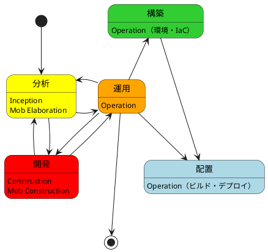
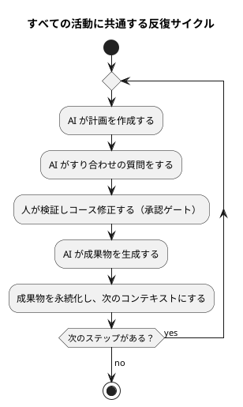
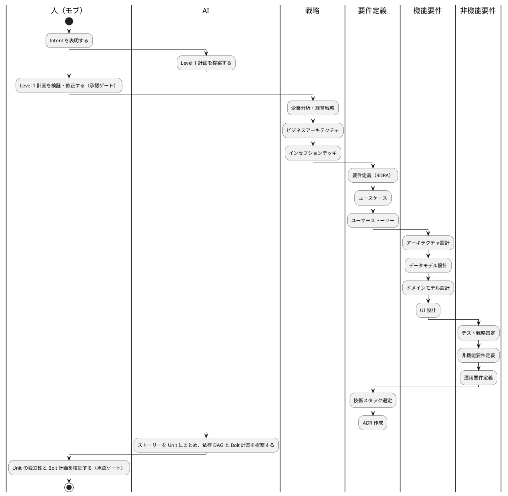
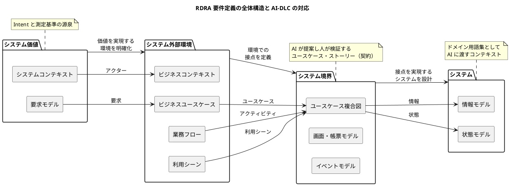
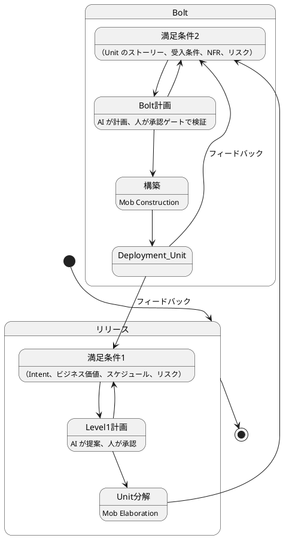
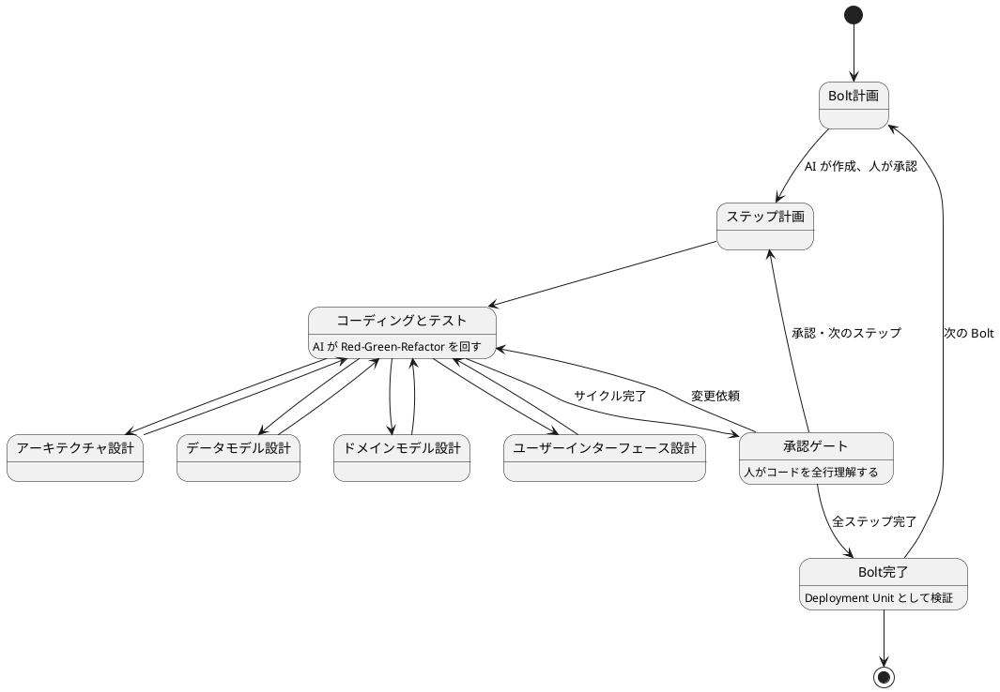
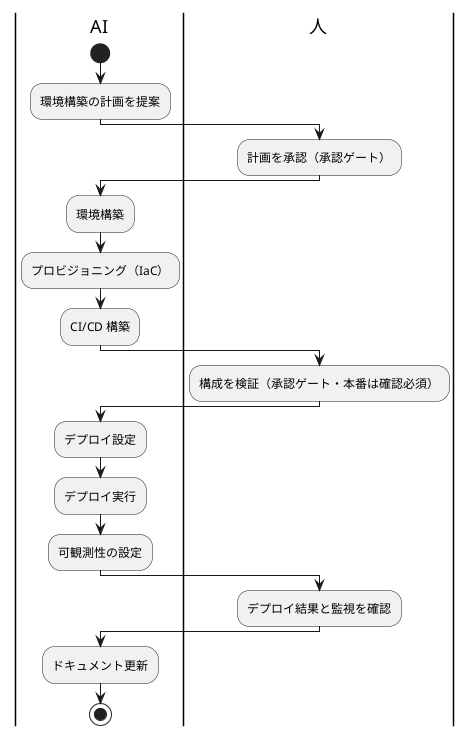
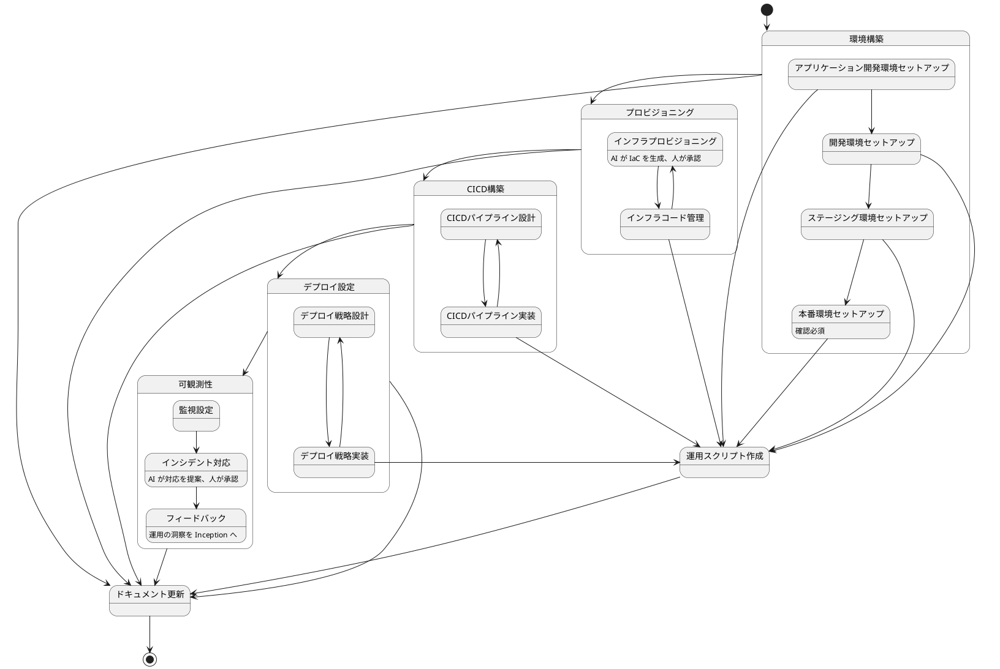

# 開発ガイド（AI-DLC 版）

このガイドは、[開発ガイド](開発ガイド.md)（XP 版）の開発ライフサイクルを AI-DLC の原則で読み替えたものです。AI-DLC の背景と用語は [AI-DLC 導入ガイド](AI-DLC導入ガイド.md) を参照してください。

XP 版の開発ライフサイクル（分析・開発・運用・構築・配置）はそのまま残します。変わるのは、各活動で **AI が計画・分解・生成を担い、人が承認ゲートで検証・決定する** ことと、活動の単位が **Intent → Unit → Bolt** になることです。アプリケーション開発は引き続き XP に基づいて進め、AI-DLC はその上で「AI が実行し人が監督する」構図を与えます。

| XP 版の活動 | AI-DLC のフェーズ | 儀式 | AI が生成するもの | 人が検証するもの |
| :--- | :--- | :--- | :--- | :--- |
| 分析 | Inception（開始） | Mob Elaboration | Level 1 計画、要件、ユースケース、ストーリー、NFR、リスク、Unit、Bolt 計画 | Intent との整合、Unit の独立性、契約としての妥当性 |
| 開発 | Construction（構築） | Mob Construction | ドメインモデル、論理設計、ADR、コード、テスト | 設計判断、コードの全行理解、受入条件 |
| 運用・構築・配置 | Operation（運用） | — | IaC、CI/CD、デプロイ、可観測性、インシデント対応案 | デプロイ構成、SLA・コンプライアンスとの整合 |

---

## 開発ライフサイクル

分析では、Intent を捉えて Unit に分解し、要件・設計・非機能要件を AI と共に精緻化します。開発では Unit を Bolt 単位で実装し、Deployment Unit にします。運用では AI がテレメトリを分析し、人が承認した対応を実行します。構築では環境と IaC を、配置ではビルドとデプロイを AI が生成し、人が承認します。これらの活動は相互に影響し合い、各活動の成果物は永続化されて次の活動のコンテキストになります。

### AI-DLC の反復サイクル

すべての活動は、次の 4 ステップの反復で進みます。

各承認ゲートでの人の検証は **損失関数** です。誤りが下流で膨らむ前に刈り取ります。ゲートの密度は、ウォーキングスケルトン（最初の Bolt）で AI の出力品質を確かめてから決めます。

### XP との関係

AI-DLC は XP を置き換えるものではなく、XP の規律を AI が実行する形に組み替えたものです。対応は次のとおりです。

| XP | AI-DLC | 備考 |
| :--- | :--- | :--- |
| 計画ゲーム | Inception（Mob Elaboration） | AI が Intent を Unit とストーリーに分解し、人が優先順位と受入条件を決める |
| イテレーション | Bolt | 時間・日単位。イテレーション内で複数の Bolt を回す |
| ユーザーストーリー | User Story（Unit の構成要素） | 人と AI の契約としてそのまま残る |
| ペアプログラミング | Mob Construction | AI が選択肢を提示し、人が技術判断とレビューを行う |
| テスト駆動開発 | TDD フレーバーの AI-DLC | 三原則は変えない。AI が回し、人がゲートで検証する |
| 継続的インテグレーション | Construction の CI Pipeline | デプロイがボトルネックになる前に整える |
| 小さなリリース | Deployment Unit | Unit 単位で独立してデプロイ可能にする |

詳細は [エクストリームプログラミング](エクストリームプログラミング.md) と [AI-DLC 導入ガイド](AI-DLC導入ガイド.md) の第 13 章を参照。

---

## 分析（Inception）

Intent を捉え、開発可能な Unit に変換するフェーズです。儀式は **Mob Elaboration** で、ファシリテーターの進行のもと、プロダクトオーナー・開発者・QA が同じ画面で AI と対話します。XP 版の分析の流れ（戦略 → 要件定義 → 機能要件 → 非機能要件）はそのまま残し、各活動で AI が初稿を生成し、人が検証します。

### Inception の成果物

Unit ごとに次が揃ったとき、Inception を完了します。

| 成果物 | 内容 | XP 版のガイド |
| :--- | :--- | :--- |
| ユーザーストーリーと受入条件 | Unit の機能スコープ。人と AI の契約 | [ユースケース作成ガイド（AI-DLC 版）](ユースケース作成ガイド_AI-DLC版.md) |
| NFR 定義 | Unit に固有の非機能要件 | [非機能要件定義ガイド](非機能要件定義ガイド.md) |
| リスク記述 | 組織のリスク台帳との対応 | [リリース・イテレーション計画ガイド（AI-DLC 版）](リリース・イテレーション計画ガイド_AI-DLC版.md) 第 5 章 |
| 測定基準 | ビジネス意図にトレースできる指標 | [経営戦略分析ガイド](経営戦略分析ガイド.md) |
| 推奨 Bolt | Unit を構築するための Bolt 計画 | [リリース・イテレーション計画ガイド（AI-DLC 版）](リリース・イテレーション計画ガイド_AI-DLC版.md) |
| PRFAQ（任意） | ビジネス意図・機能・期待効果の要約 | [インセプションデッキ](../template/index.md) |

### 戦略

#### 企業分析・経営戦略

企業事例の整理から企業戦略・事業戦略・機能戦略の 3 階層戦略立案までの詳細は [経営戦略分析ガイド](経営戦略分析ガイド.md) を参照。AI-DLC では、戦略の成果物が Intent と測定基準の源泉になります。AI に SWOT・VRIO などの分析初稿を生成させ、人が事実関係と判断を検証します。

#### ビジネスアーキテクチャ

ビジネスアーキテクチャの詳細は [ビジネスアーキテクチャ分析ガイド](ビジネスアーキテクチャ分析ガイド.md) を参照。ケイパビリティマップとバリューストリームは、Unit の境界を決める際の根拠になります。

### 要件定義

RDRA 2.0 の 4 層（システム価値 → 外部環境 → 境界 → 内部構造）はそのまま使います。AI-DLC では、各層の成果物が AI に渡すコンテキストになり、アクターの実在性や業務ルールの検証根拠になります。

要件定義の詳細は [要件定義ガイド](要件定義ガイド.md) を参照。ユースケース・ユーザーストーリーの AI-DLC 版は [ユースケース作成ガイド（AI-DLC 版）](ユースケース作成ガイド_AI-DLC版.md) を参照。

### 機能要件

AI-DLC の論文では、Domain Design（業務ロジックのモデル化）と Logical Design（NFR とアーキテクチャパターンの適用）は Construction の前半に位置づけられます。本プロジェクトでは XP 版と同じく分析フェーズで設計の初稿を作り、Construction の各 Bolt で Unit ごとに詳細化します。

#### アーキテクチャ設計

アーキテクチャ設計の詳細は [アーキテクチャ設計ガイド](アーキテクチャ設計ガイド.md) を参照。AI にアーキテクチャパターンの選択肢とトレードオフを提示させ、人が決定して ADR に記録します。

#### データモデル設計

データモデル設計の詳細は [データモデル設計ガイド](データモデル設計ガイド.md) を参照。スキーマは確認必須の対象です。AI の提案を人が承認してから適用します。

#### ドメインモデル設計

ドメインモデル設計の詳細は [ドメインモデル設計ガイド](ドメインモデル設計ガイド.md) を参照。AI-DLC の論文は DDD フレーバーを中核に置いています。ドメイン用語集を先に整備し、ユースケース・ドメインモデル・コードで共通に参照させます。

#### UI 設計

UI 設計の詳細は [UI設計ガイド](UI設計ガイド.md) を参照。UI を持たない Unit にはこの活動を含めません。

### 非機能要件

非機能要件の詳細は [非機能要件ガイド](非機能要件定義ガイド.md) を参照。Unit ごとに NFR を定義し、Logical Design と Deployment Unit のテストに反映します。

#### テスト戦略

テスト戦略の詳細は [テスト戦略ガイド](テスト戦略ガイド.md) を参照。AI-DLC では、テスト戦略の水準（Minimal／Standard／Comprehensive）を Unit ごとに選び、AI に生成させるテストの量と種類を指示します。本番機能は Standard 未満にしません。

#### 非機能要件定義

非機能要件定義は [非機能要件定義ガイド](非機能要件定義ガイド.md) を参照。

#### 運用要件定義

運用要件定義は [運用要件定義ガイド](運用要件定義ガイド.md) を参照。Operation フェーズで AI がテレメトリを分析し対応を提案する前提として、SLA・監視項目・ランブックを定義します。

### ユースケース・ユーザーストーリー

ユースケース・ユーザーストーリーの詳細は [ユースケース作成ガイド（AI-DLC 版）](ユースケース作成ガイド_AI-DLC版.md) を参照。XP 版は [ユースケース作成ガイド](ユースケース作成ガイド.md)。

---

## 開発（Construction）

Inception で定義した Unit を、テスト済みで運用可能な Deployment Unit に変換するフェーズです。儀式は **Mob Construction** で、チームが同じ部屋で統合仕様を交換し、技術判断を下して Bolt を届けます。

### リリース計画と Bolt 計画

XP 版のリリース計画とイテレーション計画は、AI-DLC 版ではリリース計画と **Bolt 計画** になります。AI が計画を提案し、人が承認ゲートで検証します。

計画づくりの詳細は [リリース・イテレーション計画ガイド（AI-DLC 版）](リリース・イテレーション計画ガイド_AI-DLC版.md) を参照。XP 版は [リリース・イテレーション計画ガイド](リリース・イテレーション計画ガイド.md)。

リリースの詳細は [リリースガイド](リリースガイド.md) を参照。

### コーディングとテスト

Bolt の中で、AI がステップ計画を書き、Red-Green-Refactor を回し、人が承認ゲートでコードを全行理解して検証します。設計（アーキテクチャ・データモデル・ドメインモデル・UI）は Bolt の中で Unit ごとに詳細化され、その結果は設計ドキュメントに反映されます。

開発の詳細は [コーディングとテストガイド（AI-DLC 版）](コーディングとテストガイド_AI-DLC版.md) を参照。XP 版は [コーディングとテストガイド](コーディングとテストガイド.md)。

### ブラウンフィールド

既存システムに手を入れる場合、Construction の前に AI に既存コードを **静的モデルと動的モデルに昇格** させ、人が検証してから変更に入ります。詳細は [AI-DLC 導入ガイド](AI-DLC導入ガイド.md) の第 6.2 節と、[ユースケース作成ガイド（AI-DLC 版）](ユースケース作成ガイド_AI-DLC版.md) の第 12 章を参照。

---

## 運用（Operation）

デプロイ・可観測性・保守を担うフェーズです。AI がテレメトリ（メトリクス・ログ・トレース）を分析して異常検知と SLA 違反の予測を行い、ランブックと連携して対応を提案します。人が承認すると AI が対応を実行します。

### 構築・配置

XP 版の構築（環境構築・プロビジョニング・CI/CD 構築）と配置（デプロイ設定）は、AI-DLC では Operation フェーズの活動です。AI が IaC・パイプライン定義・デプロイ構成を生成し、人が承認します。本番環境に関わる操作はすべて確認必須です。

### Operation の人の役割

| 活動 | AI の役割 | 人の役割 |
| :--- | :--- | :--- |
| デプロイ | Deployment Unit のパッケージ化、デプロイ構成の生成 | 構成を承認し、ステージング・本番への展開を判断する |
| 可観測性 | メトリクス・ログ・トレースの分析、異常検知、SLA 違反の予測 | 監視項目と閾値が SLA と一致することを検証する |
| インシデント対応 | ランブックと連携した対応案（スケーリング・チューニング・障害分離）の提示 | 対応案を承認し、解決を監視する |
| フィードバック | 運用の洞察（利用状況・性能・コスト）を次の Intent の材料として整理 | 次の Inception に持ち込む課題を決める |

運用スクリプトは運用手順書に定義済みのタスクを使い、独自の一時スクリプトを作らないという本プロジェクトの規律は AI-DLC でも変わりません。AI が新しい運用タスクを必要とする場合は、正式なタスクとして追加し手順書に記載します。詳細は [運用スクリプト作成ガイド](運用スクリプト作成ガイド.md) と [インフラ設計ガイド](インフラ設計ガイド.md) を参照。

---

## ガイドの対応表

| 活動 | XP 版 | AI-DLC 版 |
| :--- | :--- | :--- |
| 開発ライフサイクル全体 | [開発ガイド](開発ガイド.md) | 本ガイド |
| 方法論 | [エクストリームプログラミング](エクストリームプログラミング.md) | [AI-DLC 導入ガイド](AI-DLC導入ガイド.md) |
| 用語 | — | [AI-DLC 用語集](AI-DLC用語集.md) |
| 計画 | [リリース・イテレーション計画ガイド](リリース・イテレーション計画ガイド.md) | [リリース・イテレーション計画ガイド（AI-DLC 版）](リリース・イテレーション計画ガイド_AI-DLC版.md) |
| ユースケース・ストーリー | [ユースケース作成ガイド](ユースケース作成ガイド.md) | [ユースケース作成ガイド（AI-DLC 版）](ユースケース作成ガイド_AI-DLC版.md) |
| コーディングとテスト | [コーディングとテストガイド](コーディングとテストガイド.md) | [コーディングとテストガイド（AI-DLC 版）](コーディングとテストガイド_AI-DLC版.md) |
| 要件定義・設計・非機能・運用の各ガイド | XP 版をそのまま使用 | 各活動で「AI が初稿を生成し、人が承認ゲートで検証する」形で運用する |

AI-DLC 版が無いガイドは XP 版をそのまま使い、本ガイドの各節に記した AI と人の分担に従って運用してください。
